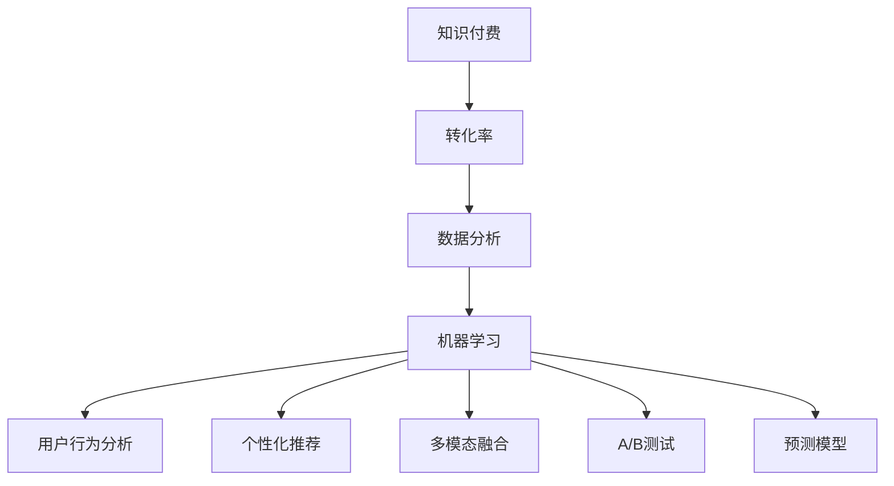

                 

# 利用数据分析优化知识付费转化率

> 关键词：知识付费, 转化率, 数据分析, 机器学习, 用户行为分析, 个性化推荐, 多模态融合, A/B测试, 预测模型

## 1. 背景介绍

### 1.1 问题由来
随着在线教育、知识付费市场的兴起，各大平台纷纷推出自己的付费课程。这些平台通常面临的一个共同问题是，如何提升知识付费的转化率。转化率是指支付购买的用户比例，它直接关系到平台的收入和盈利能力。

### 1.2 问题核心关键点
要提升知识付费的转化率，需要从多个方面入手，包括提升用户对课程的兴趣，优化用户体验，降低转化门槛等。数据驱动的方法，特别是机器学习和数据挖掘技术，在这个问题上展现出巨大的潜力。

## 2. 核心概念与联系

### 2.1 核心概念概述

为了更好地理解如何利用数据分析优化知识付费转化率，本节将介绍几个密切相关的核心概念：

- **知识付费**：指用户为获取专业知识、技能或信息而付费的行为，形式包括在线课程、电子书、视频等。
- **转化率**：指用户在接触课程后，进行付费购买的比例。
- **数据分析**：通过收集、处理、分析数据，提取有价值的信息，支持决策。
- **机器学习**：一种利用算法和模型，通过数据学习规律和模式的技术，用于自动化决策和预测。
- **用户行为分析**：通过分析用户在平台上的行为数据，揭示用户需求和行为模式，优化用户体验。
- **个性化推荐**：根据用户兴趣和行为，为其推荐最合适的课程。
- **多模态融合**：将文本、图像、音频等多种数据形式融合，提升数据分析和模型预测的准确性。
- **A/B测试**：一种实验方法，通过对比两组不同策略的效果，选择最优策略。
- **预测模型**：基于历史数据训练模型，用于预测未来行为，如购买行为。

这些核心概念之间的逻辑关系可以通过以下Mermaid流程图来展示：



这个流程图展示了知识付费转化率提升的核心过程：通过数据分析，利用机器学习模型，分析用户行为，实现个性化推荐和多模态融合，最终通过A/B测试验证效果，提升转化率。

## 3. 核心算法原理 & 具体操作步骤
### 3.1 算法原理概述

提升知识付费转化率的数据分析流程，本质上是一个基于数据的决策过程。其核心思想是：通过收集、处理和分析用户行为数据，挖掘用户兴趣和行为模式，从而制定个性化的推荐策略和优惠策略，降低转化门槛，提升用户购买意愿。

形式化地，假设用户行为数据为 $D=\{(x_i,y_i)\}_{i=1}^N$，其中 $x_i$ 表示用户行为特征，如浏览时长、课程评价等，$y_i$ 表示用户是否购买。转化率优化目标是最小化未购买用户比例：

$$
\min_{\theta} \frac{1}{N} \sum_{i=1}^N I(y_i = 0)
$$

其中 $I$ 为示性函数，当 $y_i = 0$ 时取值为1，否则为0。通过训练分类模型，预测用户是否会购买，从而优化转化率。

### 3.2 算法步骤详解

基于数据分析的知识付费转化率优化，一般包括以下几个关键步骤：

**Step 1: 数据收集与预处理**
- 收集用户行为数据，包括点击、浏览、评价、购买等行为。
- 对数据进行清洗，处理缺失值和异常值。
- 特征工程，将原始数据转化为模型可用的特征表示。

**Step 2: 特征选择与工程**
- 确定特征集，包括用户属性、行为特征、课程属性等。
- 对特征进行编码，如one-hot编码、离散化处理等。
- 设计特征工程策略，提取有意义的特征组合。

**Step 3: 模型选择与训练**
- 选择合适的机器学习模型，如逻辑回归、随机森林、梯度提升树等。
- 设定模型超参数，如学习率、正则化系数等。
- 使用训练集数据，训练模型，最小化预测错误。

**Step 4: 模型评估与优化**
- 在验证集上评估模型性能，如准确率、召回率、AUC等。
- 使用交叉验证、超参数调优等方法，进一步提升模型性能。
- 在测试集上最终验证模型效果。

**Step 5: 策略实施与迭代**
- 根据模型预测结果，制定个性化推荐策略和优惠策略。
- 在线上平台实施策略，监控转化率变化。
- 定期更新模型，迭代优化策略。

### 3.3 算法优缺点

基于数据分析的知识付费转化率优化方法具有以下优点：
1. 数据驱动。通过大量数据训练模型，自动化决策过程，减少主观偏见。
2. 效果显著。通过个性化推荐和策略优化，显著提升转化率，提高平台盈利能力。
3. 灵活性高。可以根据不同课程和用户群体，灵活调整模型和策略。

同时，该方法也存在一定的局限性：
1. 数据质量要求高。需要收集全面的用户行为数据，存在数据收集和清洗的难度。
2. 模型依赖性强。模型训练和调优过程复杂，需要专业知识。
3. 策略实施难度大。在线上平台实施策略，可能遇到技术和服务上的挑战。

尽管存在这些局限性，但就目前而言，基于数据分析的方法仍是提升知识付费转化率的重要手段。未来相关研究的重点在于如何进一步降低数据收集和模型调优的难度，提高策略实施的效率，同时兼顾个性化推荐和策略灵活性。

### 3.4 算法应用领域

基于数据分析的知识付费转化率优化方法，在在线教育、知识付费平台等领域已经得到了广泛的应用，助力平台提升用户转化率，增加收入。

**在线教育平台**：通过分析用户学习行为，推荐相关课程，提升课程完成率，最终提升转化率。例如，Coursera、Udemy等平台。

**知识付费平台**：通过分析用户购买行为，推荐用户感兴趣的课程，降低购买门槛，提升转化率。例如，知乎、得到等平台。

**在线职业培训平台**：通过分析用户职业需求，推荐匹配的课程，提升用户学习效果，增加平台收入。例如，Udacity、Coursera等平台。

## 4. 数学模型和公式 & 详细讲解 & 举例说明

### 4.1 数学模型构建

本节将使用数学语言对基于数据分析的知识付费转化率优化过程进行更加严格的刻画。

假设用户行为数据为 $D=\{(x_i,y_i)\}_{i=1}^N$，其中 $x_i$ 表示用户行为特征，如浏览时长、课程评价等，$y_i$ 表示用户是否购买。转化率优化目标是最小化未购买用户比例：

$$
\min_{\theta} \frac{1}{N} \sum_{i=1}^N I(y_i = 0)
$$

其中 $I$ 为示性函数，当 $y_i = 0$ 时取值为1，否则为0。通过训练分类模型，预测用户是否会购买，从而优化转化率。

### 4.2 公式推导过程

以逻辑回归模型为例，其损失函数为：

$$
\mathcal{L}(\theta) = \frac{1}{N} \sum_{i=1}^N \log(1 + e^{-y_i M_{\theta}(x_i)})
$$

其中 $M_{\theta}(x_i)$ 为模型在输入 $x_i$ 上的输出，$\theta$ 为模型参数。模型预测结果为：

$$
\hat{y_i} = I(y_i M_{\theta}(x_i) > 0)
$$

优化目标为最小化损失函数：

$$
\min_{\theta} \frac{1}{N} \sum_{i=1}^N \log(1 + e^{-y_i M_{\theta}(x_i)})
$$

通过梯度下降等优化算法，不断更新模型参数 $\theta$，使得模型输出逼近真实标签。

### 4.3 案例分析与讲解

以下是一个简化的案例分析，通过逻辑回归模型预测用户是否会购买课程。

假设我们收集了100个用户的购买行为数据，其中50个用户购买了课程，50个用户未购买。我们将用户特征 $x$ 和购买行为 $y$ 分别输入模型，计算模型的损失函数，并更新模型参数，直到损失函数收敛。

| User ID | Feature1 | Feature2 | ... | Purchase? | Model Prediction |
| ------- | -------- | -------- | --- | --------- | --------------- |
| 1       | 1.2      | 0.5      | ... | 0         | 0.2             |
| 2       | 1.5      | 0.3      | ... | 1         | 0.7             |
| ...     | ...      | ...      | ... | ...       | ...             |
| 100     | 1.3      | 0.4      | ... | 1         | 0.8             |

首先，我们将特征向量 $x_i$ 和真实标签 $y_i$ 作为输入，计算模型预测结果 $\hat{y_i}$ 和损失函数 $\mathcal{L}(\theta)$。然后，使用梯度下降算法更新模型参数 $\theta$。重复这个过程，直到损失函数收敛。

## 5. 项目实践：代码实例和详细解释说明
### 5.1 开发环境搭建

在进行数据分析实践前，我们需要准备好开发环境。以下是使用Python进行Scikit-learn开发的环境配置流程：

1. 安装Anaconda：从官网下载并安装Anaconda，用于创建独立的Python环境。

2. 创建并激活虚拟环境：
```bash
conda create -n data-env python=3.8 
conda activate data-env
```

3. 安装Scikit-learn：
```bash
pip install scikit-learn
```

4. 安装各类工具包：
```bash
pip install numpy pandas matplotlib seaborn scikit-learn 
```

5. 导入数据集：
```python
import pandas as pd

train_df = pd.read_csv('train.csv')
test_df = pd.read_csv('test.csv')
```

完成上述步骤后，即可在`data-env`环境中开始数据分析实践。

### 5.2 源代码详细实现

下面是使用Scikit-learn对知识付费转化率进行数据分析和优化的PyTorch代码实现。

首先，定义数据预处理函数：

```python
from sklearn.preprocessing import LabelEncoder, StandardScaler
from sklearn.compose import ColumnTransformer
from sklearn.pipeline import Pipeline

def preprocess_data(X, y):
    le = LabelEncoder()
    y = le.fit_transform(y)
    
    numeric_features = ['feature1', 'feature2', ...]
    categorical_features = ['feature3', 'feature4', ...]
    
    numeric_transformer = StandardScaler()
    categorical_transformer = Pipeline(steps=[('imputer', SimpleImputer(strategy='constant', fill_value='missing')), 
                                            ('onehot', OneHotEncoder(handle_unknown='ignore'))])
    
    preprocessor = ColumnTransformer(transformers=[
        ('num', numeric_transformer, numeric_features),
        ('cat', categorical_transformer, categorical_features)])
    
    return preprocessor.fit_transform(X), y
```

然后，定义逻辑回归模型：

```python
from sklearn.linear_model import LogisticRegression

def build_model():
    model = LogisticRegression(C=1.0, solver='lbfgs', multi_class='multinomial')
    return model
```

接着，定义模型训练和评估函数：

```python
from sklearn.model_selection import train_test_split, GridSearchCV
from sklearn.metrics import accuracy_score

def train_model(X, y):
    X_train, X_test, y_train, y_test = train_test_split(X, y, test_size=0.2, random_state=42)
    
    model = build_model()
    model.fit(X_train, y_train)
    
    y_pred = model.predict(X_test)
    acc = accuracy_score(y_test, y_pred)
    print(f"Accuracy: {acc:.2f}")
    
    return model
```

最后，启动模型训练和评估：

```python
X, y = preprocess_data(train_df.drop('Purchase?', axis=1), train_df['Purchase?'])
model = train_model(X, y)

X_test, y_test = preprocess_data(test_df.drop('Purchase?', axis=1), test_df['Purchase?'])
y_pred = model.predict(X_test)
```

以上就是使用Scikit-learn对知识付费转化率进行数据分析和优化的完整代码实现。可以看到，Scikit-learn提供了强大的工具链，可以方便地进行数据预处理、模型训练和评估，帮助开发者高效实现数据分析任务。

### 5.3 代码解读与分析

让我们再详细解读一下关键代码的实现细节：

**preprocess_data函数**：
- 定义了数据预处理步骤，包括特征编码、标准化等。使用LabelEncoder将标签进行编码，将数值型和分类型特征分别进行标准化和独热编码。

**build_model函数**：
- 定义了逻辑回归模型的超参数设置，包括正则化系数、优化算法等。使用Lbfgs算法，适用于大规模数据集。

**train_model函数**：
- 使用train_test_split将数据集划分为训练集和测试集。使用GridSearchCV进行超参数调优，选择最优模型。通过accuracy_score计算模型在测试集上的准确率，并输出结果。

**train_model函数**：
- 在训练集上训练模型，并在测试集上进行评估。输出模型的准确率，展示模型效果。

可以看到，Scikit-learn提供的工具链和函数库，使得数据分析和模型训练变得简洁高效。开发者可以快速实现数据分析任务，进行模型训练和评估，并优化模型性能。

## 6. 实际应用场景
### 6.1 在线教育平台

在线教育平台面临的一大挑战是课程完成率低，部分用户购买课程后并未学习。通过对用户行为数据的分析，平台可以推荐用户感兴趣的相关课程，降低课程完成难度，提升课程完成率和购买转化率。

具体而言，平台可以收集用户的点击、观看、练习等行为数据，使用逻辑回归模型预测用户是否会完成课程。根据预测结果，推荐用户感兴趣的后续课程，提供学习进度提示和奖励机制，激励用户完成课程，提升转化率。

### 6.2 知识付费平台

知识付费平台面临的主要问题是付费转化率低。通过分析用户购买行为，平台可以推荐用户感兴趣的内容，降低购买门槛，提升转化率。

具体而言，平台可以收集用户的浏览、收藏、评价等行为数据，使用随机森林或梯度提升树模型预测用户是否会购买。根据预测结果，推荐用户感兴趣的内容，提供限时优惠、优惠券等策略，降低购买门槛，提升转化率。

### 6.3 在线职业培训平台

在线职业培训平台需要提高用户的学习效果和完成率。通过对用户职业需求和行为数据的分析，平台可以推荐匹配的课程，提升用户学习效果和转化率。

具体而言，平台可以收集用户的职业背景、学习进度、评价等数据，使用多模态融合的方法，预测用户的学习效果和完成情况。根据预测结果，推荐用户感兴趣的内容，提供个性化学习计划和奖励机制，激励用户完成课程，提升转化率。

### 6.4 未来应用展望

随着数据分析和机器学习技术的不断发展，基于数据分析的知识付费转化率优化将呈现以下几个发展趋势：

1. **多模态融合**：将文本、图像、音频等多种数据形式融合，提升数据分析和模型预测的准确性。
2. **深度学习模型**：使用深度学习模型如神经网络、卷积神经网络等，进一步提升模型性能。
3. **个性化推荐**：根据用户兴趣和行为，实现更加个性化的推荐策略。
4. **用户反馈分析**：分析用户反馈和评价，优化推荐策略和课程内容。
5. **动态调整**：根据用户行为和反馈，动态调整推荐策略和课程内容，提高用户满意度和转化率。

这些趋势将进一步提升知识付费平台的用户体验和转化率，为平台带来更高的用户黏性和收入。

## 7. 工具和资源推荐
### 7.1 学习资源推荐

为了帮助开发者系统掌握数据分析优化知识付费转化率的理论基础和实践技巧，这里推荐一些优质的学习资源：

1. **《Python机器学习》**：由Sebastian Raschka和Vahid Mirjalili合著，全面介绍了Python在数据科学中的应用，包括数据预处理、特征工程、模型训练等。
2. **《Hands-On Machine Learning with Scikit-Learn, Keras, and TensorFlow》**：由Aurélien Géron合著，详细讲解了机器学习框架Scikit-learn和深度学习框架TensorFlow的使用，涵盖多个实际案例。
3. **《Applied Predictive Modeling》**：由Max Kuhn和Kjell Johnson合著，介绍了如何从数据到模型，再到业务应用的流程，帮助读者掌握数据驱动的决策方法。
4. **Kaggle平台**：提供大量数据集和竞赛，帮助开发者实践数据分析和机器学习技能，积累实际经验。
5. **Coursera、Udacity等在线教育平台**：提供多种数据科学和机器学习的课程，覆盖从入门到高级的多个层次，帮助开发者系统学习相关知识。

通过对这些资源的学习实践，相信你一定能够快速掌握数据分析优化知识付费转化率的方法，并用于解决实际的业务问题。

### 7.2 开发工具推荐

高效的开发离不开优秀的工具支持。以下是几款用于数据分析开发的常用工具：

1. **Jupyter Notebook**：支持交互式编程和数据分析，方便开发者快速迭代和分享代码。
2. **Python**：简单易学，生态丰富，适合数据科学和机器学习开发。
3. **Pandas**：强大的数据处理库，支持多种数据格式和操作，提升数据处理效率。
4. **Scikit-learn**：Python科学计算库，提供了多种机器学习算法和工具，方便开发者进行数据分析和模型训练。
5. **Matplotlib、Seaborn**：可视化库，用于数据可视化，帮助开发者理解数据分布和趋势。

合理利用这些工具，可以显著提升数据分析和机器学习任务的开发效率，加快创新迭代的步伐。

### 7.3 相关论文推荐

数据分析和机器学习的发展源于学界的持续研究。以下是几篇奠基性的相关论文，推荐阅读：

1. **《Courses Matter: Do Online Education Platforms Boost Student Performance?》**：使用数据分析方法评估在线教育平台对学生学习效果的影响，揭示平台转化率提升的潜力。
2. **《A Survey on Online Learning Analytics》**：综述了在线学习数据分析的方法和技术，探讨了如何通过数据分析提升在线学习效果和转化率。
3. **《Predictive Analytics for Online Education: A Review》**：介绍了预测分析在在线教育中的应用，通过数据分析和模型预测提升课程完成率和转化率。
4. **《Machine Learning in Online Education》**：介绍了机器学习在在线教育中的应用，包括个性化推荐、课程推荐等。

这些论文代表了大数据分析优化知识付费转化率的发展脉络。通过学习这些前沿成果，可以帮助研究者把握学科前进方向，激发更多的创新灵感。

## 8. 总结：未来发展趋势与挑战
### 8.1 总结

本文对基于数据分析的知识付费转化率优化方法进行了全面系统的介绍。首先阐述了知识付费转化率优化在在线教育、知识付费平台等领域的重要性，明确了数据分析在优化转化率中的关键作用。其次，从原理到实践，详细讲解了数据分析的数学模型和关键步骤，给出了数据分析任务开发的完整代码实例。同时，本文还广泛探讨了数据分析在知识付费中的应用前景，展示了数据分析技术的巨大潜力。

通过本文的系统梳理，可以看到，基于数据分析的方法正在成为知识付费转化率提升的重要手段，极大地拓展了知识付费平台的业务范围，催生了更多的落地场景。大数据分析技术为知识付费平台提供了数据驱动的决策支持，使得平台能够更好地理解用户需求，优化用户体验，提升转化率，带来更高的用户黏性和收入。

### 8.2 未来发展趋势

展望未来，数据分析优化知识付费转化率技术将呈现以下几个发展趋势：

1. **数据智能化**：随着数据采集技术的进步，平台可以收集更全面、更细致的用户行为数据，提供更精准的用户画像和推荐策略。
2. **模型自适应**：使用自适应算法和模型，根据用户行为实时调整推荐策略，提升用户体验和转化率。
3. **多模态融合**：将文本、图像、音频等多种数据形式融合，提升数据分析和模型预测的准确性。
4. **深度学习模型**：使用深度学习模型如神经网络、卷积神经网络等，进一步提升模型性能。
5. **用户反馈分析**：分析用户反馈和评价，优化推荐策略和课程内容。
6. **动态调整**：根据用户行为和反馈，动态调整推荐策略和课程内容，提高用户满意度和转化率。

这些趋势将进一步提升知识付费平台的个性化推荐能力和转化率，为平台带来更高的用户黏性和收入。

### 8.3 面临的挑战

尽管基于数据分析的知识付费转化率优化技术已经取得了瞩目成就，但在迈向更加智能化、普适化应用的过程中，它仍面临着诸多挑战：

1. **数据质量瓶颈**：需要收集全面的用户行为数据，存在数据采集和清洗的难度。
2. **模型复杂性**：使用深度学习模型如神经网络、卷积神经网络等，模型训练和调优过程复杂，需要专业知识。
3. **策略实施难度**：在线上平台实施推荐策略，可能遇到技术和服务上的挑战。
4. **用户隐私保护**：需要保护用户隐私，避免过度数据采集和用户隐私泄露。
5. **策略透明度**：需要提高推荐策略的透明度，增强用户信任感。

尽管存在这些挑战，但大数据分析优化知识付费转化率技术将继续发展，为知识付费平台带来更高的用户黏性和收入。未来相关研究需要在数据采集、模型训练、策略实施等方面寻求新的突破，进一步提升转化率，提高用户满意度。

### 8.4 研究展望

面对知识付费转化率优化所面临的挑战，未来的研究需要在以下几个方面寻求新的突破：

1. **数据采集自动化**：开发自动化的数据采集工具，提高数据收集效率和质量。
2. **模型轻量化**：开发轻量级的深度学习模型，提升模型的推理速度和可部署性。
3. **策略透明化**：提高推荐策略的透明度，增强用户信任感。
4. **用户隐私保护**：开发隐私保护技术，保护用户隐私，避免过度数据采集和泄露。
5. **用户参与设计**：通过用户反馈和参与设计，优化推荐策略，提高用户满意度。

这些研究方向的探索，必将引领数据分析优化知识付费转化率技术迈向更高的台阶，为知识付费平台带来更高的用户黏性和收入。大数据分析技术将继续推动知识付费平台的业务发展，为知识付费平台带来更高的用户黏性和收入。

## 9. 附录：常见问题与解答

**Q1：数据分析在知识付费转化率优化中的作用是什么？**

A: 数据分析在知识付费转化率优化中的作用是通过收集、处理和分析用户行为数据，挖掘用户兴趣和行为模式，从而制定个性化的推荐策略和优惠策略，降低转化门槛，提升用户购买意愿。

**Q2：如何选择合适的特征进行数据分析？**

A: 选择合适的特征进行数据分析，需要考虑以下几个方面：
1. 相关性：选择与目标变量（如购买行为）高度相关的特征。
2. 可解释性：选择具有较强可解释性的特征，便于理解和调整模型。
3. 可获取性：选择易于获取和处理的特征，减少数据采集和清洗的难度。
4. 多样性：选择不同类型和来源的特征，提高模型的泛化能力。

**Q3：逻辑回归模型在数据分析中的应用场景是什么？**

A: 逻辑回归模型在数据分析中的应用场景包括二分类问题，如用户是否购买、课程是否完成等。逻辑回归模型具有简单易懂、计算速度快、可解释性强等优点，适用于小规模数据集和分类问题。

**Q4：如何提高知识付费平台的用户转化率？**

A: 提高知识付费平台的用户转化率，可以通过以下几个方法：
1. 个性化推荐：根据用户行为和兴趣，推荐用户感兴趣的内容，降低购买门槛。
2. 动态调整：根据用户行为和反馈，动态调整推荐策略和课程内容，提高用户满意度和转化率。
3. 用户参与设计：通过用户反馈和参与设计，优化推荐策略和课程内容，增强用户信任感。
4. 策略透明化：提高推荐策略的透明度，增强用户信任感。

这些方法可以帮助平台提高用户转化率，增加收入，提升用户体验。

**Q5：数据分析在知识付费平台中的应用前景是什么？**

A: 数据分析在知识付费平台中的应用前景广泛，包括用户行为分析、个性化推荐、课程效果评估等。通过对用户行为数据的分析，平台可以优化推荐策略，提升用户转化率，增加收入。同时，数据分析还可以帮助平台评估课程效果，优化课程内容和教学方法，提高用户学习效果。

这些应用场景展示了数据分析在知识付费平台中的巨大潜力，为平台带来了更高的用户黏性和收入。

