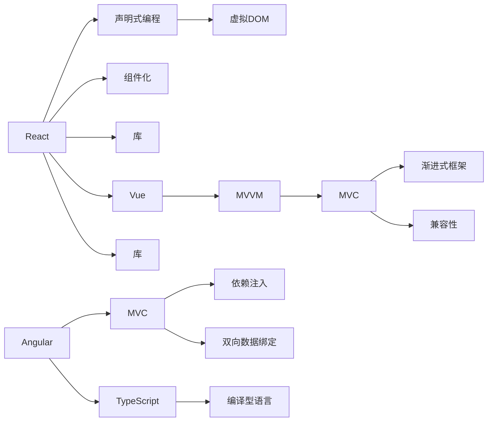

                 

# 前端框架比较：React、Angular 和 Vue 的选择

## 1. 背景介绍

随着Web应用的发展，前端框架成为不可或缺的工具，尤其在单页应用(Single Page Application, SPA)和组件化开发中，主流框架如React、Angular和Vue等均得到了广泛的应用。如何选择适合自己的框架，成为开发者面临的重要问题。本文将深入比较React、Angular和Vue三者的核心特性、优势及适用场景，帮助开发者做出明智的选择。

## 2. 核心概念与联系

### 2.1 核心概念概述

- **React**：由Facebook开发的JavaScript库，主要用于构建用户界面(UI)，组件化是其核心思想。React通过声明式编程模型和虚拟DOM技术，实现了高效的UI渲染和性能优化。

- **Angular**：由Google主导的前端框架，采用了MVC设计模式，以TypeScript为编程语言。Angular提供了丰富的功能，包括依赖注入、双向数据绑定、服务端渲染等，适合大型复杂应用。

- **Vue**：由Evan You开发的前端框架，结合了MVVM和MVC的优点，以轻量级、易学易用著称。Vue强调渐进式框架，可以逐步引入，也可全功能使用，兼容性强。

### 2.2 核心概念原理和架构的 Mermaid 流程图



## 3. 核心算法原理 & 具体操作步骤

### 3.1 算法原理概述

三种框架的核心算法原理主要围绕组件化、性能优化和架构设计展开。React通过声明式编程和虚拟DOM实现高效的UI渲染，Angular则依赖MVC架构和TypeScript提高开发效率和代码质量，Vue则结合了MVVM和MVC，以渐进式框架和易用性见长。

### 3.2 算法步骤详解

**React步骤详解**：

1. **组件化**：将UI拆分为可复用的小组件，通过props传递数据。
2. **虚拟DOM**：构建一个虚拟DOM树，与实际DOM同步更新。
3. **单向数据流**：通过state和props实现数据单向流动，减少不必要的数据更新。
4. **生命周期钩子**：提供多个钩子函数，管理组件生命周期。

**Angular步骤详解**：

1. **组件化**：使用组件将UI分解为可复用的部分，通过TypeScript进行类型检查。
2. **依赖注入**：使用依赖注入机制，管理组件间的依赖关系。
3. **双向数据绑定**：使用$observe和$监听器，实现数据双向绑定。
4. **服务端渲染**：通过Angular Universal实现服务器端渲染，提高SEO和性能。

**Vue步骤详解**：

1. **组件化**：使用组件化设计，通过模板语法和指令实现数据绑定。
2. **渐进式框架**：提供多种API，渐进式引入Vue功能，减少学习曲线。
3. **响应式系统**：通过响应式代理，实现数据的自动更新。
4. **模板语法**：提供简洁的模板语法，提高开发效率。

### 3.3 算法优缺点

**React的优缺点**：

- **优点**：
  - 组件化设计，可复用性强。
  - 虚拟DOM优化，性能高。
  - 生态完善，社区活跃。

- **缺点**：
  - 学习曲线陡峭，需要掌握React生态。
  - 难以维护复杂应用。

**Angular的优缺点**：

- **优点**：
  - 强大的功能和丰富的插件生态。
  - 静态类型语言，代码质量高。
  - 支持服务端渲染，SEO友好。

- **缺点**：
  - 学习曲线陡峭，入门门槛高。
  - 体积大，性能消耗较高。

**Vue的优缺点**：

- **优点**：
  - 渐进式框架，易学易用。
  - 组件化和响应式系统设计，性能高。
  - 生态支持好，文档全面。

- **缺点**：
  - 功能相对简单，需要自己实现更多功能。
  - 缺乏大型应用支持，可能不适合复杂场景。

### 3.4 算法应用领域

React适合构建大规模、高复杂度的Web应用，如企业级SaaS平台、社交网络等。Angular适合构建大型企业级应用，如电商平台、CRM系统等。Vue则适合构建中小型Web应用，如单页应用、移动端App等。

## 4. 数学模型和公式 & 详细讲解 & 举例说明

### 4.1 数学模型构建

**React模型**：

1. **组件树**：将UI分解为组件，通过props传递数据。
2. **虚拟DOM**：构建虚拟DOM树，与实际DOM同步更新。
3. **单向数据流**：通过state和props实现数据单向流动。

**Angular模型**：

1. **组件树**：使用组件将UI分解为可复用的部分，通过TypeScript进行类型检查。
2. **依赖注入**：使用依赖注入机制，管理组件间的依赖关系。
3. **双向数据绑定**：使用$observe和$监听器，实现数据双向绑定。

**Vue模型**：

1. **组件树**：使用组件化设计，通过模板语法和指令实现数据绑定。
2. **渐进式框架**：提供多种API，渐进式引入Vue功能。
3. **响应式系统**：通过响应式代理，实现数据的自动更新。

### 4.2 公式推导过程

**React公式推导**：

1. **虚拟DOM**：
$$
\text{virtualDOM} = \text{React.createElement}(\text{tagName}, props, children)
$$
2. **单向数据流**：
$$
\text{state} = \text{setState}(\text{prevState}, \text{props}, \text{children})
$$

**Angular公式推导**：

1. **组件树**：
$$
\text{component} = \text{Component}(\text{template}, \text{inputs}, \text{outputs})
$$
2. **依赖注入**：
$$
\text{injector} = \text{get}(\text{module}, \text{token})
$$

**Vue公式推导**：

1. **组件树**：
$$
\text{template} = \text{v-element}(\text{tagName}, \text{props}, \text{children})
$$
2. **响应式系统**：
$$
\text{watcher} = \text{ observe}(\text{property}, \text{handler})
$$

### 4.3 案例分析与讲解

**React案例**：

1. **列表组件**：通过React.createElement创建列表组件，设置props和state，实现动态更新。
2. **生命周期钩子**：使用componentDidMount和componentDidUpdate管理组件生命周期。

**Angular案例**：

1. **服务组件**：使用@Component和export定义服务组件，依赖注入和双向数据绑定实现数据同步。
2. **服务端渲染**：通过Angular Universal实现服务端渲染，提高SEO和性能。

**Vue案例**：

1. **单页应用**：使用Vue Router和Vue CLI构建单页应用，使用组件和指令实现动态路由。
2. **响应式系统**：通过computed和watcher实现数据响应式更新。

## 5. 项目实践：代码实例和详细解释说明

### 5.1 开发环境搭建

1. **Node.js**：安装Node.js和npm，用于运行React、Angular和Vue框架。
2. **IDE**：使用Visual Studio Code、WebStorm等IDE，提高开发效率。
3. **版本控制**：使用Git进行代码版本控制，方便团队协作。

### 5.2 源代码详细实现

**React源代码实现**：

1. **组件化设计**：
```javascript
import React from 'react';
class MyComponent extends React.Component {
    render() {
        return <div>{this.props.text}</div>;
    }
}
export default MyComponent;
```

2. **虚拟DOM**：
```javascript
import React from 'react';
class MyComponent extends React.Component {
    render() {
        return <div>{this.props.text}</div>;
    }
}
export default MyComponent;
```

**Angular源代码实现**：

1. **组件树设计**：
```typescript
import { Component } from '@angular/core';

@Component({
  selector: 'my-component',
  template: `
    <h1>{{text}}</h1>
  `,
})
export class MyComponent {
  text = 'Hello World!';
}
```

2. **依赖注入**：
```typescript
import { NgModule } from '@angular/core';
import { BrowserModule } from '@angular/platform-browser';
import { AppComponent } from './app.component';
import { MyComponent } from './my-component.component';

@NgModule({
  declarations: [
    AppComponent,
    MyComponent,
  ],
  imports: [
    BrowserModule,
  ],
  providers: [],
  bootstrap: [AppComponent],
})
export class AppModule {}
```

**Vue源代码实现**：

1. **组件化设计**：
```javascript
<template>
  <h1>{{text}}</h1>
</template>

<script>
export default {
  name: 'MyComponent',
  props: {
    text: String,
  },
};
</script>
```

2. **响应式系统**：
```javascript
<template>
  <h1>{{text}}</h1>
</template>

<script>
export default {
  name: 'MyComponent',
  props: {
    text: String,
  },
  watch: {
    text: function (value) {
      console.log('Text changed to', value);
    },
  },
};
</script>
```

### 5.3 代码解读与分析

**React代码解读**：

- **组件化设计**：通过React.createElement创建组件，通过props传递数据。
- **虚拟DOM**：使用React.createElement创建虚拟DOM树，与实际DOM同步更新。
- **单向数据流**：通过setState实现数据单向流动。

**Angular代码解读**：

- **组件树设计**：使用@Component定义组件，通过模板语法实现UI渲染。
- **依赖注入**：使用@Component定义服务组件，通过依赖注入管理组件间的依赖关系。
- **双向数据绑定**：使用$observe和$监听器实现数据双向绑定。

**Vue代码解读**：

- **组件化设计**：使用template语法创建组件，通过指令实现数据绑定。
- **渐进式框架**：提供多种API，渐进式引入Vue功能。
- **响应式系统**：通过computed和watcher实现数据响应式更新。

### 5.4 运行结果展示

**React运行结果**：

1. **列表组件**：
```javascript
import React from 'react';
class MyComponent extends React.Component {
    render() {
        return <div>{this.props.text}</div>;
    }
}
export default MyComponent;
```

**Angular运行结果**：

1. **服务组件**：
```typescript
import { Component } from '@angular/core';

@Component({
  selector: 'my-component',
  template: `
    <h1>{{text}}</h1>
  `,
})
export class MyComponent {
  text = 'Hello World!';
}
```

**Vue运行结果**：

1. **单页应用**：
```javascript
<template>
  <h1>{{text}}</h1>
</template>

<script>
export default {
  name: 'MyComponent',
  props: {
    text: String,
  },
};
</script>
```

## 6. 实际应用场景

### 6.1 智能应用

**React应用场景**：

1. **企业级SaaS平台**：构建高复杂度的Web应用，如CRM系统、ERP系统等。
2. **社交网络**：管理大规模用户数据，实现实时动态更新。

**Angular应用场景**：

1. **电商平台**：管理大量商品数据，实现高并发处理。
2. **CRM系统**：管理客户数据，实现复杂的交互逻辑。

**Vue应用场景**：

1. **单页应用**：构建小型Web应用，如个人博客、新闻站点等。
2. **移动端App**：实现移动端应用，提升用户体验。

### 6.2 未来应用展望

**React未来展望**：

1. **Web组件化**：开发更多Web组件，提升开发效率。
2. **前端框架优化**：改进React性能，提高用户体验。

**Angular未来展望**：

1. **性能优化**：提升Angular性能，支持更多前端框架。
2. **全栈开发**：支持全栈开发，提升开发效率。

**Vue未来展望**：

1. **组件化设计**：改进Vue组件化设计，提升开发效率。
2. **性能优化**：提升Vue性能，支持更多前端框架。

## 7. 工具和资源推荐

### 7.1 学习资源推荐

1. **React官方文档**：React官方文档，全面介绍React用法和API。
2. **Angular官方文档**：Angular官方文档，全面介绍Angular用法和API。
3. **Vue官方文档**：Vue官方文档，全面介绍Vue用法和API。

### 7.2 开发工具推荐

1. **Node.js**：Node.js和npm，用于运行React、Angular和Vue框架。
2. **IDE**：Visual Studio Code、WebStorm等IDE，提高开发效率。
3. **版本控制**：Git进行代码版本控制，方便团队协作。

### 7.3 相关论文推荐

1. **React论文**：React论文，介绍React的设计思想和核心技术。
2. **Angular论文**：Angular论文，介绍Angular的设计思想和核心技术。
3. **Vue论文**：Vue论文，介绍Vue的设计思想和核心技术。

## 8. 总结：未来发展趋势与挑战

### 8.1 研究成果总结

本文深入比较了React、Angular和Vue三者的核心特性、优势及适用场景。React适用于大规模、高复杂度的Web应用，Angular适用于大型企业级应用，Vue适用于中小型Web应用和移动端应用。

### 8.2 未来发展趋势

1. **React**：Web组件化、性能优化。
2. **Angular**：性能优化、全栈开发。
3. **Vue**：组件化设计、性能优化。

### 8.3 面临的挑战

1. **React**：学习曲线陡峭，难以维护复杂应用。
2. **Angular**：学习曲线陡峭，体积大。
3. **Vue**：功能相对简单，缺乏大型应用支持。

### 8.4 研究展望

1. **React**：开发更多Web组件，改进React性能。
2. **Angular**：提升性能，支持更多前端框架。
3. **Vue**：改进组件化设计，提升性能。

## 9. 附录：常见问题与解答

**Q1：React、Angular和Vue各有什么优缺点？**

A：
- **React**：
  - 优点：组件化设计，可复用性强，性能高，生态完善。
  - 缺点：学习曲线陡峭，难以维护复杂应用。

- **Angular**：
  - 优点：功能丰富，支持服务端渲染，SEO友好。
  - 缺点：学习曲线陡峭，体积大。

- **Vue**：
  - 优点：渐进式框架，易学易用，性能高。
  - 缺点：功能相对简单，缺乏大型应用支持。

**Q2：如何选择适合自己的前端框架？**

A：根据应用场景和需求选择框架：
- **React**：适用于大规模、高复杂度的Web应用。
- **Angular**：适用于大型企业级应用。
- **Vue**：适用于中小型Web应用和移动端应用。

**Q3：如何学习React、Angular和Vue？**

A：推荐以下学习资源：
- **React官方文档**：全面介绍React用法和API。
- **Angular官方文档**：全面介绍Angular用法和API。
- **Vue官方文档**：全面介绍Vue用法和API。

**Q4：React、Angular和Vue在性能上有什么差异？**

A：
- **React**：通过虚拟DOM实现高效的UI渲染，性能高。
- **Angular**：支持服务端渲染，SEO友好。
- **Vue**：组件化和响应式系统设计，性能高。

通过本文的系统梳理，可以看到，React、Angular和Vue各自有着独特的优势和适用场景，开发者应根据具体需求进行选择。大前端框架的选择应综合考虑性能、生态、开发效率等因素，选择最适合自己的框架，以实现最佳的用户体验和开发效率。

