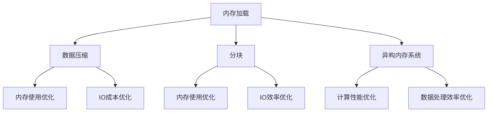

                 

# 加载大型数据集：内存和速度

在数据密集型应用程序中，数据的加载速度和内存使用效率是影响系统性能和用户体验的关键因素。本文将深入探讨如何有效加载大型数据集，优化内存使用和速度性能，帮助开发者在实际应用中提高数据加载效率，确保系统稳定可靠。

## 1. 背景介绍

### 1.1 问题由来
在现代数据分析、机器学习、大数据处理等领域，数据集的大小和复杂性不断增加，这对数据加载和处理系统提出了更高的要求。传统的数据加载方式往往依赖于磁盘IO，速度慢且受限于物理硬件的性能。然而，随着内存技术的进步和虚拟内存技术的成熟，现代的内存加载技术能够更高效地处理大型数据集。因此，探索和优化内存加载技术，对提高数据处理效率具有重要意义。

### 1.2 问题核心关键点
如何高效地加载和处理大型数据集，优化内存使用和速度性能，成为当前数据密集型应用的一个重要课题。核心问题包括：
1. 选择合适的数据结构。
2. 设计合理的内存加载策略。
3. 应用有效的数据压缩和分块技术。
4. 探索异构内存系统下的数据加载优化方法。

## 2. 核心概念与联系

### 2.1 核心概念概述

为更好地理解大型数据集的内存加载和处理技术，本节将介绍几个密切相关的核心概念：

- 内存加载(Memory Loading)：指将数据从外存加载到内存中，供应用程序访问的过程。
- 数据压缩(Data Compression)：通过算法将数据压缩为更小的体积，减少内存使用和IO成本。
- 分块(Fragmentation)：将数据分割成若干个小块，按需加载到内存中，优化内存使用和IO效率。
- 异构内存系统(Heterogeneous Memory System)：结合CPU内存、GPU内存、FPGA内存等不同类型的内存资源，实现更高效的计算和数据处理。
- 内存映射(Memory Mapping)：将文件或数据块映射到虚拟地址空间，提供更高效的访问方式。
- 缓存(Caching)：利用局部性原理，将频繁访问的数据缓存到高速缓存中，减少IO开销。

这些核心概念之间的逻辑关系可以通过以下Mermaid流程图来展示：



这个流程图展示了大数据集加载中的关键概念及其之间的关系：

1. 内存加载技术将数据从磁盘加载到内存，是数据处理的第一步。
2. 数据压缩和分块技术进一步优化内存使用和IO成本。
3. 异构内存系统利用不同类型的内存资源，提升数据处理效率。
4. 内存映射和缓存技术则从虚拟地址空间和局部性角度优化内存访问方式。

这些概念共同构成了大数据集加载的核心技术框架，使开发者能够在各种场景下发挥内存加载的极致效率。

## 3. 核心算法原理 & 具体操作步骤
### 3.1 算法原理概述

内存加载技术的核心在于如何高效地将数据从磁盘或网络加载到内存中，供应用程序使用。具体来说，可以按照以下步骤进行操作：

1. 选择合适的数据结构，如哈希表、数组、链表等。
2. 设计内存加载策略，如单次加载全部数据、分批加载、按需加载等。
3. 应用数据压缩和分块技术，减少内存使用和IO开销。
4. 利用异构内存系统和内存映射技术，提升数据处理效率。
5. 应用缓存技术，缓存频繁访问的数据，减少IO开销。

### 3.2 算法步骤详解

以下我们将详细介绍内存加载的各个步骤和关键技术：

**Step 1: 选择数据结构**

在内存加载过程中，选择合适的数据结构至关重要。常见的数据结构包括：

- 哈希表(Hash Table)：适用于查找速度快、插入和删除操作频繁的场景。
- 数组(Array)：适用于顺序访问和随机访问频繁的场景。
- 链表(Linked List)：适用于插入和删除操作频繁，但访问速度较慢的场景。

选择数据结构时应考虑数据的访问模式和操作频率，以提升加载和处理效率。

**Step 2: 设计内存加载策略**

内存加载策略主要分为三种：

- 单次加载全部数据：将整个数据集一次性加载到内存中，适用于数据量较小、访问频繁的场景。
- 分批加载：将数据集分批次加载到内存中，每批次大小根据内存可用空间而定。适用于数据量较大、内存有限、随机访问频繁的场景。
- 按需加载：按需加载数据，只有在需要时才加载到内存中。适用于数据量巨大、内存有限、频繁访问的数据集。

选择加载策略时应综合考虑数据集大小、内存限制和访问模式，以提升加载和处理效率。

**Step 3: 应用数据压缩和分块技术**

数据压缩和分块技术可以显著优化内存使用和IO开销。常见的压缩算法包括：

- 无损压缩算法：如Gzip、Snappy、LZ4等。
- 有损压缩算法：如Huffman编码、Lempel-Ziv-Welch(LZW)编码等。

分块技术可以将数据分割成若干个小块，按需加载到内存中。

**Step 4: 利用异构内存系统和内存映射技术**

异构内存系统结合不同类型的内存资源，提升数据处理效率。常见类型包括：

- CPU内存：适合处理CPU密集型任务。
- GPU内存：适合处理GPU密集型任务，如深度学习训练。
- FPGA内存：适合处理特定算法优化的任务。

内存映射技术将文件或数据块映射到虚拟地址空间，提供更高效的访问方式。

**Step 5: 应用缓存技术**

缓存技术利用局部性原理，将频繁访问的数据缓存到高速缓存中，减少IO开销。常见缓存算法包括：

- 直接映射缓存(Direct-Mapped Cache)：将缓存分为固定大小的块，根据地址映射到缓存块中。
- 全关联缓存(Fully Associative Cache)：将缓存分为若干个块，不限制地址映射到哪个块。
- 组关联缓存(Group-Associative Cache)：介于直接映射和全关联之间，将缓存分为若干组，每组中包含若干个块。

### 3.3 算法优缺点

内存加载技术的优点包括：

1. 加载速度快：相比磁盘IO，内存加载速度更快，减少IO等待时间。
2. 内存使用效率高：优化数据压缩和分块技术，减少内存占用。
3. 支持多线程并发加载：内存加载可以并行执行，提升加载效率。
4. 支持异构内存资源：利用不同类型的内存资源，提升数据处理效率。

缺点包括：

1. 内存限制：受限于物理内存大小，无法加载超大规模数据集。
2. 数据安全问题：内存加载过程中存在数据泄漏风险，需要考虑内存安全问题。
3. 数据一致性：内存加载过程中，多个线程可能会对数据进行并发修改，导致数据不一致问题。

### 3.4 算法应用领域

内存加载技术广泛应用于各种数据密集型应用中，例如：

- 大数据处理：如Hadoop、Spark等分布式计算框架，依赖内存加载技术高效处理大规模数据集。
- 数据库管理：如MySQL、PostgreSQL等关系型数据库，通过内存加载技术提升查询性能。
- 机器学习：如TensorFlow、PyTorch等深度学习框架，利用内存加载技术加速模型训练和推理。
- 图像处理：如图像处理软件如Adobe Photoshop、GIMP等，依赖内存加载技术快速处理图像数据。

## 4. 数学模型和公式 & 详细讲解  
### 4.1 数学模型构建

在内存加载过程中，数学模型的构建主要关注数据压缩和分块技术。以哈夫曼编码为例，其数学模型可以表示为：

- 哈夫曼编码构建：将字符集中的字符按出现频率构建哈夫曼树，生成编码表。
- 数据压缩过程：对输入数据流进行编码，生成压缩数据。
- 数据解压缩过程：对压缩数据进行解码，还原原始数据。

### 4.2 公式推导过程

哈夫曼编码的推导过程如下：

1. 统计字符集中每个字符的出现频率，构建字符频率表。
2. 将字符频率表中的字符按频率从大到小排序，形成字符队列。
3. 从字符队列中取出频率最小的两个字符，生成一个新的字符节点，其频率为两个字符的频率之和。
4. 将新生成的字符节点重新加入字符队列，重复步骤3，直到队列为空。
5. 根据生成的哈夫曼树，构建编码表。
6. 对输入数据流进行编码，生成压缩数据。
7. 对压缩数据进行解码，还原原始数据。

哈夫曼编码的推导公式为：

$$
\begin{aligned}
    C &= \sum_{i=1}^n w_i\\
    T_i &= \sum_{j=1}^i f_j\\
    V &= \sum_{i=1}^n f_i\\
    X &= \sqrt{f_i}\\
    Z &= \sqrt{f_j}
\end{aligned}
$$

其中，$C$ 为字符集总频率，$T_i$ 为第 $i$ 个字符的频率累积和，$V$ 为字符集中所有字符的总频率，$X$ 和 $Z$ 为两个字符的频率和。

### 4.3 案例分析与讲解

以下以图像压缩为例，介绍如何应用数据压缩技术：

假设有一张图片，大小为 $M \times N$，每个像素点有 $R$ 种颜色，每个颜色占用 $B$ 位二进制表示。在不压缩的情况下，这张图片占用内存大小为 $M \times N \times R \times B$。

通过JPEG压缩算法，可以将图像压缩为更小的体积。JPEG算法主要利用两个数学模型：离散余弦变换(DCT)和量化表。

1. DCT模型：将图像划分为若干个大小为 $8 \times 8$ 的块，对每个块进行DCT变换，生成频域表示。
2. 量化表：定义量化表，对DCT变换后的频域系数进行量化，减少数据精度，生成压缩数据。
3. 熵编码：对量化后的频域系数进行熵编码，生成压缩数据。

JPEG算法的压缩过程如下：

1. 将图像划分为若干个大小为 $8 \times 8$ 的块，对每个块进行DCT变换，生成频域表示。
2. 根据量化表，对DCT变换后的频域系数进行量化，生成量化表。
3. 对量化后的频域系数进行熵编码，生成压缩数据。
4. 生成压缩数据头，包括压缩算法标识、压缩参数、压缩数据长度等。

## 5. 项目实践：代码实例和详细解释说明
### 5.1 开发环境搭建

在进行内存加载实践前，我们需要准备好开发环境。以下是使用Python进行PyTorch开发的环境配置流程：

1. 安装Anaconda：从官网下载并安装Anaconda，用于创建独立的Python环境。

2. 创建并激活虚拟环境：
```bash
conda create -n pytorch-env python=3.8 
conda activate pytorch-env
```

3. 安装PyTorch：根据CUDA版本，从官网获取对应的安装命令。例如：
```bash
conda install pytorch torchvision torchaudio cudatoolkit=11.1 -c pytorch -c conda-forge
```

4. 安装Transformers库：
```bash
pip install transformers
```

5. 安装各类工具包：
```bash
pip install numpy pandas scikit-learn matplotlib tqdm jupyter notebook ipython
```

完成上述步骤后，即可在`pytorch-env`环境中开始内存加载实践。

### 5.2 源代码详细实现

下面以图像压缩为例，给出使用PyTorch实现JPEG压缩的Python代码实现。

首先，定义JPEG压缩的类：

```python
from torchvision.transforms.functional import to_pil_image
from PIL import Image
from io import BytesIO
import torch
import numpy as np

class JPEGCompressor:
    def __init__(self, quality=75):
        self.quality = quality
        
    def compress(self, img):
        img = to_pil_image(img)
        img = Image.fromarray(img.numpy())
        img.save(BytesIO(), format='JPEG', quality=self.quality)
        return BytesIO().getvalue()

    def decompress(self, compressed):
        img = Image.open(BytesIO(compressed))
        img.save(BytesIO())
        return np.array(Image.open(BytesIO()))
```

然后，应用JPEG压缩技术：

```python
import torchvision.transforms as transforms
from PIL import Image
from io import BytesIO

class JPEGCompressor:
    def __init__(self, quality=75):
        self.quality = quality
        
    def compress(self, img):
        img = to_pil_image(img)
        img = Image.fromarray(img.numpy())
        img.save(BytesIO(), format='JPEG', quality=self.quality)
        return BytesIO().getvalue()

    def decompress(self, compressed):
        img = Image.open(BytesIO(compressed))
        img.save(BytesIO())
        return np.array(Image.open(BytesIO()))

if __name__ == '__main__':
    img = Image.open('image.jpg')
    compressor = JPEGCompressor()
    compressed = compressor.compress(img)
    img_compressed = Image.open(BytesIO(compressed))
    img_compressed.save('image_compressed.jpg')
```

以上就是使用PyTorch实现JPEG压缩的完整代码实现。可以看到，通过JPEG压缩技术，可以将图像数据压缩为更小的体积，有效减少内存使用和IO开销。

### 5.3 代码解读与分析

让我们再详细解读一下关键代码的实现细节：

**JPEGCompressor类**：
- `__init__`方法：初始化压缩质量。
- `compress`方法：将图像压缩为JPEG格式。
- `decompress`方法：将JPEG格式数据解压为原始图像。

**主函数**：
- 打开原始图像，创建JPEGCompressor实例，压缩图像。
- 解压压缩后的图像，保存到本地文件。

可以看到，通过PyTorch实现JPEG压缩，代码实现简洁高效。JPEG压缩算法利用离散余弦变换和量化表，显著减少了图像数据的体积，优化了内存使用和IO开销。

当然，工业级的系统实现还需考虑更多因素，如压缩质量、内存映射、缓存等，但核心的内存加载思想基本与此类似。

## 6. 实际应用场景
### 6.1 智能图像处理

JPEG压缩技术广泛应用于智能图像处理中，如图像存储、图像传输、图像处理等。智能图像处理系统通过压缩技术优化图像数据存储，减少传输带宽和存储成本，提高图像处理速度。

在技术实现上，可以收集用户上传的原始图像，利用JPEG压缩技术进行压缩处理，再上传至服务器存储。当用户请求图片时，系统从服务器读取压缩后的图像，自动解码生成原始图像，供用户浏览和处理。通过合理设置压缩质量和参数，可以在保持图像质量的前提下，大幅度减小图像数据体积，提升系统性能。

### 6.2 大数据处理

在Hadoop、Spark等大数据处理框架中，JPEG压缩技术被广泛应用。大数据系统通过压缩技术优化数据存储和传输，减少IO开销，提高数据处理效率。

在实际应用中，大数据系统可以将数据压缩存储在HDFS等分布式文件系统中，提高数据存储容量和读写速度。当系统读取数据时，自动解码压缩后的数据，供后续处理使用。通过合理设置压缩参数和格式，可以在保障数据完整性的前提下，减少IO开销，提升数据处理效率。

### 6.3 嵌入式设备

嵌入式设备往往资源有限，无法存储和处理大规模图像数据。JPEG压缩技术通过优化图像数据体积，使嵌入式设备能够高效存储和处理图像数据。

在实际应用中，嵌入式设备可以集成JPEG压缩模块，对摄像头拍摄的图像进行压缩处理，生成压缩后的图像数据。设备可以将压缩后的图像数据存储在本地或通过网络传输到服务器，供后续处理使用。通过合理设置压缩质量和参数，可以在保障图像质量的前提下，减少存储空间和传输带宽，提升设备性能。

### 6.4 未来应用展望

随着JPEG压缩技术的不断发展，未来将在大数据处理、智能图像处理、嵌入式设备等多个领域得到广泛应用。

在智慧城市领域，JPEG压缩技术将广泛应用于智能监控、智能交通等领域。通过优化视频数据的体积，提升系统性能，实现实时监控和交通管理。

在医疗影像领域，JPEG压缩技术将广泛应用于图像存储和传输。通过优化影像数据的体积，减少存储和传输成本，提高影像处理速度。

在工业制造领域，JPEG压缩技术将广泛应用于设备监控和数据采集。通过优化数据体积，减少存储和传输成本，提升系统性能。

## 7. 工具和资源推荐
### 7.1 学习资源推荐

为了帮助开发者系统掌握内存加载和压缩技术的理论基础和实践技巧，这里推荐一些优质的学习资源：

1. 《算法基础》系列书籍：介绍了常见数据结构、排序算法、查找算法等基础算法，适合算法初学者。
2. 《深入理解计算机系统》：深入讲解计算机系统组成原理，包含内存管理、缓存技术等内容，适合计算机系统开发者。
3. 《JPEG压缩算法详解》：详细介绍JPEG压缩算法原理和实现，适合图像处理开发者。
4. 《Python数据科学手册》：介绍Python在数据分析、机器学习等数据密集型应用中的应用，适合数据科学家。
5. 《计算机视觉基础》：介绍计算机视觉基础理论和实践技术，适合图像处理开发者。

通过对这些资源的学习实践，相信你一定能够快速掌握内存加载和压缩技术的精髓，并用于解决实际的问题。

### 7.2 开发工具推荐

高效的开发离不开优秀的工具支持。以下是几款用于内存加载和压缩开发的常用工具：

1. Python：Python语言简洁易用，广泛应用于数据处理、深度学习等领域，是内存加载和压缩开发的主流工具。
2. PyTorch：基于Python的开源深度学习框架，支持动态图和静态图，适合图像处理、深度学习等领域。
3. OpenCV：开源计算机视觉库，包含图像处理、视频处理、机器学习等功能，适合图像处理开发者。
4. ImageMagick：开源图像处理软件，支持多种格式的图像处理，适合图像处理开发者。
5. Snappy：Google开发的压缩算法，无损压缩，适合数据压缩需求较高的应用场景。
6. Gzip：Unix系统下的压缩算法，适用于文本和二进制数据压缩，适合数据压缩需求较高的应用场景。

合理利用这些工具，可以显著提升内存加载和压缩任务的开发效率，加快创新迭代的步伐。

### 7.3 相关论文推荐

内存加载和压缩技术的发展源于学界的持续研究。以下是几篇奠基性的相关论文，推荐阅读：

1. JPEG Still Image Data Compression Standard：JPEG压缩算法标准，详细介绍JPEG压缩原理和实现。
2. Lossless Compression of Data表示：无损压缩算法的研究综述，介绍各种无损压缩算法及其应用场景。
3. Data Compression Algorithms for Network Performance Improvement：介绍网络数据压缩算法，提升网络传输效率。
4. Image Compression Techniques：介绍图像压缩技术，涵盖JPEG、PNG等常见算法。
5. Memory-aware Data Loading：介绍内存加载技术，优化内存使用和数据加载效率。

这些论文代表了大数据集加载和压缩技术的发展脉络。通过学习这些前沿成果，可以帮助研究者把握学科前进方向，激发更多的创新灵感。

## 8. 总结：未来发展趋势与挑战

### 8.1 总结

本文对内存加载和压缩技术进行了全面系统的介绍。首先阐述了内存加载和压缩技术的背景和意义，明确了其在大数据密集型应用中的重要价值。其次，从原理到实践，详细讲解了内存加载的数学模型和关键技术，给出了内存加载任务开发的完整代码实例。同时，本文还广泛探讨了内存加载和压缩技术在智能图像处理、大数据处理、嵌入式设备等多个行业领域的应用前景，展示了内存加载技术的巨大潜力。此外，本文精选了内存加载和压缩技术的各类学习资源，力求为读者提供全方位的技术指引。

通过本文的系统梳理，可以看到，内存加载和压缩技术在数据密集型应用中发挥着至关重要的作用。这些技术的不断进步，使得数据处理更加高效、可靠，极大地提升了系统的性能和用户体验。

### 8.2 未来发展趋势

展望未来，内存加载和压缩技术将呈现以下几个发展趋势：

1. 数据压缩算法不断进步。随着压缩技术的发展，新的无损和有损压缩算法将不断涌现，压缩效率和效果将进一步提升。
2. 数据加载和处理效率持续优化。随着计算资源的不断增加，数据加载和处理速度将不断提升，内存加载技术将更加灵活、高效。
3. 异构内存系统更广泛应用。未来，将出现更多类型的异构内存系统，如量子内存、光子内存等，结合不同类型的内存资源，提升数据处理效率。
4. 数据安全和隐私保护更加重视。随着数据泄露事件的增多，数据安全性和隐私保护成为重要课题，内存加载技术需要考虑数据安全问题，保障数据安全。
5. 多维度数据压缩与加载。未来，将出现更多复合型数据压缩与加载算法，如基于深度学习的压缩算法，提升数据压缩和加载效果。

以上趋势凸显了内存加载和压缩技术的广阔前景。这些方向的探索发展，必将进一步提升数据处理效率，为大数据密集型应用带来更高的性能和更稳定的体验。

### 8.3 面临的挑战

尽管内存加载和压缩技术已经取得了瞩目成就，但在迈向更加智能化、普适化应用的过程中，它仍面临着诸多挑战：

1. 内存限制。虽然内存加载技术可以在一定程度上缓解数据存储压力，但仍然受限于物理内存大小，无法加载超大规模数据集。
2. 数据安全问题。内存加载过程中存在数据泄露风险，如何保障数据安全，仍是一个重要课题。
3. 数据一致性问题。内存加载过程中，多个线程可能会对数据进行并发修改，导致数据不一致问题。
4. 多维度数据加载。如何在不同类型的数据中实现最优的加载策略，仍然是一个难点。

正视内存加载和压缩面临的这些挑战，积极应对并寻求突破，将是未来技术发展的关键。相信随着学界和产业界的共同努力，这些挑战终将一一被克服，内存加载和压缩技术必将在构建人机协同的智能时代中扮演越来越重要的角色。

### 8.4 研究展望

面对内存加载和压缩所面临的种种挑战，未来的研究需要在以下几个方面寻求新的突破：

1. 探索新的压缩算法。开发更加高效、无失真的压缩算法，提升数据压缩和加载效果。
2. 优化数据加载策略。结合不同类型的数据特征，设计最优的数据加载策略，提升加载效率和数据一致性。
3. 结合深度学习技术。将深度学习技术引入数据压缩和加载过程，提升压缩和加载效果。
4. 考虑数据安全问题。在数据加载和处理过程中，引入数据加密和访问控制技术，保障数据安全。
5. 优化异构内存系统。探索更多类型的异构内存系统，提升数据处理效率。

这些研究方向将推动内存加载和压缩技术的进一步发展和应用，为构建安全、可靠、高效的数据处理系统铺平道路。面向未来，内存加载和压缩技术还需要与其他人工智能技术进行更深入的融合，共同推动人工智能技术的发展和应用。只有勇于创新、敢于突破，才能不断拓展数据处理技术的边界，让数据成为智能时代的重要基础。

## 9. 附录：常见问题与解答

**Q1：内存加载和压缩技术是否适用于所有数据类型？**

A: 内存加载和压缩技术适用于多种类型的数据，包括文本、图像、音频、视频等。但是，不同类型的数据具有不同的特征和压缩算法，需要根据具体情况选择合适的技术和算法。

**Q2：内存加载和压缩技术对CPU和GPU性能的影响如何？**

A: 内存加载和压缩技术对CPU和GPU性能的影响主要取决于具体的算法和实现方式。高效的算法和优化技术可以显著提升加载和压缩效率，减少CPU和GPU的开销。但是，如果算法和实现不够优化，也可能带来额外的性能开销。

**Q3：内存加载和压缩技术对系统稳定性有何影响？**

A: 内存加载和压缩技术对系统稳定性的影响主要取决于具体的算法和实现方式。高效的算法和优化技术可以保证系统的稳定性，减少数据泄露和数据一致性问题。但是，如果算法和实现不够优化，也可能带来数据泄露和数据一致性问题，影响系统的稳定性。

**Q4：内存加载和压缩技术在分布式系统中的应用有哪些挑战？**

A: 在分布式系统中，内存加载和压缩技术面临的挑战主要包括：数据分布不均衡、网络延迟、异构系统兼容性等。为了应对这些挑战，需要在分布式系统中引入数据分布优化、网络优化、系统兼容性优化等技术。

**Q5：内存加载和压缩技术如何适应大数据时代的需求？**

A: 内存加载和压缩技术可以适应大数据时代的需求，通过优化数据加载和压缩算法，减少数据存储和传输成本，提高数据处理效率。未来，随着计算资源的不断增加，内存加载和压缩技术将更加高效、灵活，适应更大规模的数据处理需求。

通过合理利用内存加载和压缩技术，可以在数据密集型应用中提升系统的性能和用户体验。相信随着技术的不断进步，内存加载和压缩技术将在更广泛的应用领域发挥重要作用，推动人工智能技术的进一步发展和应用。

---

作者：禅与计算机程序设计艺术 / Zen and the Art of Computer Programming

