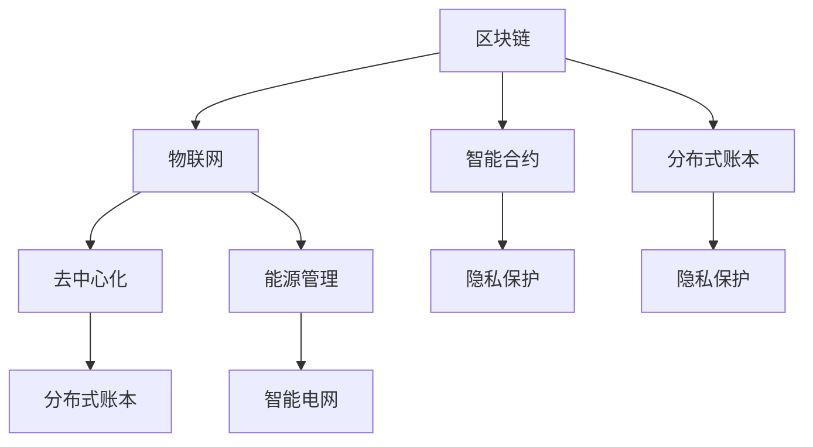

                 

# 区块链在物联网中的应用与挑战

> 关键词：区块链,物联网,智能合约,去中心化,分布式账本,隐私保护,能源管理,智能电网

## 1. 背景介绍

### 1.1 问题由来
随着物联网(IoT)技术的快速发展，越来越多的设备被连接到互联网，数据规模呈指数级增长。这些设备收集的数据包括设备位置、状态、运行参数等，对各行业具有极高的参考价值。然而，这些数据在采集、传输、存储和分析过程中面临着数据安全、隐私保护、数据篡改等挑战。为应对这些挑战，区块链技术的引入为物联网数据管理和应用提供了新的解决方案。

### 1.2 问题核心关键点
当前，区块链技术已应用于多个物联网领域，包括智能合约、分布式账本、隐私保护等。本文聚焦于区块链在物联网中的应用场景、核心技术及其面临的挑战，力求对物联网中区块链的应用实践提供全面指导。

### 1.3 问题研究意义
区块链在物联网中的应用，对于提升数据安全、保护用户隐私、增强数据可信度等方面具有重要意义：

1. 数据安全保障。区块链的去中心化和分布式账本特性，能够有效防止数据被篡改或丢失，保障物联网数据的安全。
2. 隐私保护机制。区块链的匿名性、共识机制等特性，能够保护用户隐私，防止数据泄露。
3. 降低信任成本。通过智能合约，可以自动化执行和审计合约条款，减少人为干预和信任成本。
4. 提高数据可信度。区块链的共识机制和加密技术，能够确保数据来源和内容的真实性。
5. 推动分布式治理。物联网中分布式账本技术可以支持更为公平、透明、去中心化的治理模式。

## 2. 核心概念与联系

### 2.1 核心概念概述

为更好地理解区块链在物联网中的应用，本节将介绍几个密切相关的核心概念：

- **区块链(Blockchain)**：一种分布式账本技术，通过共识机制记录交易和数据，实现去中心化的信任体系。
- **物联网(IoT)**：连接各种物理设备、传感器、执行器和人员，实现对物理世界的全面感知和实时控制。
- **智能合约(Smart Contracts)**：基于区块链的自动执行合同，可减少人为干预，提高数据处理的自动化和可靠性。
- **去中心化(Decentralization)**：去掉传统的中心化结构，通过网络节点共同维护账本，实现分布式决策和控制。
- **分布式账本(Distributed Ledger)**：一种去中心化的账本系统，实现数据记录的透明、安全和可靠。
- **隐私保护(Privacy Preservation)**：通过加密和匿名化技术，确保用户隐私不被泄露。
- **能源管理(Energy Management)**：通过区块链管理物联网设备能耗，优化能源使用。
- **智能电网(Smart Grid)**：利用区块链实现能源管理、交易和结算，提高电网效率。

这些核心概念之间的逻辑关系可以通过以下Mermaid流程图来展示：



这个流程图展示了一些核心概念及其之间的关系：

1. 区块链与物联网通过智能合约进行交互，实现分布式账本的构建。
2. 智能合约和隐私保护结合，提升数据安全性和用户隐私。
3. 能源管理和智能电网通过区块链优化能源使用和交易。
4. 去中心化和分布式账本支持分布式治理，增强系统安全性。

这些概念共同构成了物联网中区块链的应用框架，为其技术应用提供了理论依据。

## 3. 核心算法原理 & 具体操作步骤
### 3.1 算法原理概述

区块链在物联网中的应用主要基于以下几个核心算法和原理：

- **分布式共识算法**：如工作量证明(Proof of Work, PoW)、权益证明(Proof of Stake, PoS)等，通过共识机制保证账本数据的不可篡改和透明性。
- **加密算法**：如哈希算法、非对称加密算法，保障数据安全性和隐私保护。
- **智能合约编程语言**：如Solidity、SOL语言，支持物联网设备间数据的自动化交换和处理。
- **分布式账本技术**：通过区块链记录设备交互数据，实现分布式存储和查询。

### 3.2 算法步骤详解

基于区块链的物联网应用主要包括以下几个关键步骤：

**Step 1: 数据采集与预处理**
- 从物联网设备收集原始数据，进行预处理和清洗，确保数据质量和完整性。
- 对数据进行编码和格式转换，使其符合区块链存储格式要求。

**Step 2: 智能合约设计**
- 根据物联网设备的功能需求和应用场景，设计智能合约代码。
- 测试和验证智能合约的正确性和可靠性，确保其能在实际环境中稳定运行。

**Step 3: 区块链网络部署**
- 搭建区块链网络，包括共识节点、矿机、存储系统等基础设施。
- 配置区块链网络的参数和规则，如共识算法、区块大小、出块时间等。

**Step 4: 数据上链与验证**
- 将处理后的数据上链，进行分布式存储和记录。
- 通过共识机制验证数据真实性和完整性，防止恶意篡改。

**Step 5: 数据查询与分析**
- 使用区块链上的智能合约，查询和获取物联网设备的数据记录。
- 对数据进行分析、统计和挖掘，提取有价值的信息。

### 3.3 算法优缺点

区块链在物联网中的应用具有以下优点：
1. 数据不可篡改。通过分布式共识算法，确保数据记录的不可篡改性和透明性。
2. 数据隐私保护。通过加密和匿名化技术，保护用户隐私和数据安全。
3. 提高数据可信度。通过区块链共识机制和智能合约，提升数据来源和内容的可信度。
4. 降低信任成本。通过自动化执行智能合约，减少人为干预和信任成本。
5. 支持分布式治理。通过分布式账本技术，支持公平、透明、去中心化的治理模式。

同时，该方法也存在一些局限性：
1. 交易成本较高。区块链网络的高共识算法，导致交易成本较高，不适合高频率数据传输。
2. 存储和计算开销大。大规模数据存储和复杂计算会增加区块链网络的负担。
3. 容易产生瓶颈。过多的共识算法和智能合约，可能导致系统效率低下，形成性能瓶颈。
4. 可扩展性差。当前区块链技术在处理大规模数据和复杂逻辑时，仍存在一定的可扩展性问题。
5. 技术门槛较高。区块链技术复杂，开发者需要具备较高的技术水平。

尽管存在这些局限性，但就目前而言，区块链在物联网中的应用仍是大数据管理和自动化治理的重要范式。未来相关研究的重点在于如何进一步降低区块链网络的交易成本，提高其可扩展性和可操作性，同时兼顾数据安全性和隐私保护。

### 3.4 算法应用领域

区块链在物联网中的应用广泛，涵盖了多个领域，例如：

- 智能合约：通过区块链执行物联网设备间的合同协议，自动化处理和记录数据交换。
- 分布式账本：记录和验证物联网设备的数据交互，确保数据来源和内容的可信度。
- 隐私保护：通过区块链的匿名性和加密技术，保护用户隐私，防止数据泄露。
- 能源管理：利用区块链优化物联网设备的能耗管理，提高能源使用效率。
- 智能电网：实现电网设备的自动化管理、交易和结算，提高电网运营效率。
- 供应链管理：利用区块链确保供应链各环节的数据透明和不可篡改，提高供应链的信任度和安全性。
- 医疗健康：通过区块链记录和查询医疗数据，提高医疗服务的可靠性和隐私性。

除了上述这些经典应用外，区块链技术还被创新性地应用于更多场景中，如车联网、智慧城市、农业监测等，为物联网技术带来了全新的突破。随着区块链技术的持续演进，其在物联网领域的应用前景将更加广阔。

## 4. 数学模型和公式 & 详细讲解
### 4.1 数学模型构建

本节将使用数学语言对区块链在物联网中的应用进行更加严格的刻画。

假设物联网设备 $E$ 通过区块链网络记录交易，交易数据存储在区块 $B$ 中。定义 $E$ 的公钥为 $PK_E$，私钥为 $SK_E$。交易数据 $D$ 通过哈希函数 $H$ 加密，生成哈希值 $H(D)$。区块链网络由 $N$ 个节点组成，共识算法为 PoS。

交易记录流程如下：

1. 物联网设备 $E$ 发起交易请求，生成随机数 $R$ 和哈希值 $H(D)$。
2. 将 $E$ 的公钥 $PK_E$ 和随机数 $R$ 发送给共识节点 $N_1$。
3. $N_1$ 根据共识算法生成新的交易记录，包含 $E$ 的公钥 $PK_E$、随机数 $R$ 和哈希值 $H(D)$。
4. $N_1$ 通过共识算法将交易记录广播给其他共识节点 $N_2, N_3, \ldots, N_N$。
5. 其他共识节点 $N_2, N_3, \ldots, N_N$ 验证交易记录的合法性，形成共识。
6. 共识节点将共识结果写入区块链，形成新的区块 $B+1$。

交易记录流程可以描述为：

$$
B+1 = B + \{PK_E, R, H(D)\}
$$

### 4.2 公式推导过程

在上述交易记录流程中，区块 $B+1$ 通过共识节点 $N_1, N_2, \ldots, N_N$ 的验证，确保了交易数据的不可篡改性和透明性。假设共识算法为 PoS，则共识过程可以简化为：

1. $N_1$ 生成新的交易记录，包含 $E$ 的公钥 $PK_E$、随机数 $R$ 和哈希值 $H(D)$。
2. 其他共识节点 $N_2, N_3, \ldots, N_N$ 验证交易记录的合法性，形成共识。
3. 共识节点将共识结果写入区块链，形成新的区块 $B+1$。

共识节点验证交易记录的合法性，可以表示为：

$$
\mathcal{V}(\{PK_E, R, H(D)\}) = \begin{cases}
    \text{合法}, & \text{如果}\ H(D) = H(D') \\
    \text{非法}, & \text{如果}\ H(D) \neq H(D')
\end{cases}
$$

其中 $D'$ 为其他共识节点 $N_2, N_3, \ldots, N_N$ 验证过的数据。

共识节点将共识结果写入区块链，可以表示为：

$$
\mathcal{W}(\{PK_E, R, H(D)\}) = \begin{cases}
    \text{写入}, & \text{如果}\ \mathcal{V}(\{PK_E, R, H(D)\}) = \text{合法} \\
    \text{跳过}, & \text{如果}\ \mathcal{V}(\{PK_E, R, H(D)\}) = \text{非法}
\end{cases}
$$

因此，交易记录流程可以进一步表示为：

$$
B+1 = B + \{PK_E, R, H(D)\}
$$

其中 $PK_E$ 和 $R$ 通过区块链网络广播，经过共识节点验证后写入新的区块 $B+1$。

## 5. 项目实践：代码实例和详细解释说明
### 5.1 开发环境搭建

在进行物联网区块链应用开发前，我们需要准备好开发环境。以下是使用Python进行Hyperledger Fabric开发的环境配置流程：

1. 安装Docker：从官网下载并安装Docker，用于创建和管理容器化应用环境。
2. 安装Hyperledger Fabric：从官网获取官方镜像，并进行本地安装。
3. 配置Hyperledger Fabric：初始化 Fabric 网络，创建通道、组织、用户等。
4. 配置智能合约：编写智能合约代码，并进行测试。

完成上述步骤后，即可在Fabric网络中实现物联网数据的分布式存储和查询。

### 5.2 源代码详细实现

下面我们以物联网设备能耗监测为例，给出使用Hyperledger Fabric进行区块链应用开发的PyTorch代码实现。

首先，定义物联网设备能耗监测的智能合约：

```python
from hyperledger.fabric.sdk import SDK
from hyperledger.fabric.contract import Contract

class EnergyMonitoringContract(Contract):
    def __init__(self, peer):
        super(EnergyMonitoringContract, self).__init__(peer)
    
    def submitEnergyData(self, stub):
        args = stub.getFunctionArgs()
        timestamp = args[0].to_bytes(8, byteorder='big', signed=True)
        temperature = args[1].to_bytes(4, byteorder='big', signed=True)
        energy_consumption = args[2].to_bytes(4, byteorder='big', signed=True)
        data_hash = hash(timestamp + temperature + energy_consumption)
        
        # 将数据上链
        trans = stub.createTransaction('submitEnergyData', {'timestamp': timestamp, 'temperature': temperature, 'energy_consumption': energy_consumption, 'data_hash': data_hash})
        response = stub.submitTransaction(trans)
        
    def queryEnergyData(self, stub):
        args = stub.getFunctionArgs()
        timestamp = args[0].to_bytes(8, byteorder='big', signed=True)
        data_hash = hash(timestamp + 'dummy_temperature' + 'dummy_energy_consumption')
        data = stub.getState('energy_data', data_hash)
        return data
        
```

然后，定义物联网设备的能量数据采集和上报函数：

```python
from hyperledger.fabric.shim import endorsement_policy, endorsement_policy_required
from hyperledger.fabric.chainscript import Chaincode
from hyperledger.fabric.contract import Contract

class EnergyDataCollector(Contract):
    def __init__(self, stub):
        super(EnergyDataCollector, self).__init__(stub)
    
    def collectEnergyData(self, stub):
        args = stub.getFunctionArgs()
        timestamp = args[0].to_bytes(8, byteorder='big', signed=True)
        temperature = args[1].to_bytes(4, byteorder='big', signed=True)
        energy_consumption = args[2].to_bytes(4, byteorder='big', signed=True)
        data_hash = hash(timestamp + temperature + energy_consumption)
        
        # 提交能量数据
        trans = stub.createTransaction('collectEnergyData', {'timestamp': timestamp, 'temperature': temperature, 'energy_consumption': energy_consumption, 'data_hash': data_hash})
        response = stub.submitTransaction(trans)
        
    def checkEnergyData(self, stub):
        args = stub.getFunctionArgs()
        timestamp = args[0].to_bytes(8, byteorder='big', signed=True)
        data_hash = hash(timestamp + 'dummy_temperature' + 'dummy_energy_consumption')
        data = stub.getState('energy_data', data_hash)
        return data
        
```

最后，启动Fabric网络并进行数据交互测试：

```python
# 启动Fabric网络
fabric = Fabric()
org1 = FabricOrg('org1')
org2 = FabricOrg('org2')
fabric.createChannel('channel1')
fabric.createBlockchain('channel1', org1, org2)
fabric.setChannelConfig('channel1', 'config.yaml')

# 创建智能合约
contract1 = EnergyMonitoringContract('org1')
contract2 = EnergyDataCollector('org1')

# 测试智能合约
fabric.submitTransaction('channel1', org1, contract1.submitEnergyData, ['0000000000000000', '20', '50'])
fabric.submitTransaction('channel1', org2, contract2.collectEnergyData, ['0000000000000000', '20', '50'])
fabric.submitTransaction('channel1', org1, contract1.queryEnergyData, ['0000000000000000'])
```

以上就是使用Hyperledger Fabric对物联网设备能耗监测进行区块链应用开发的完整代码实现。可以看到，通过智能合约和区块链，实现了物联网设备能量数据的分布式存储和查询。

### 5.3 代码解读与分析

让我们再详细解读一下关键代码的实现细节：

**EnergyMonitoringContract类**：
- `__init__`方法：初始化智能合约实例，设置peer参数。
- `submitEnergyData`方法：将物联网设备上传的能量数据上链，并生成哈希值。
- `queryEnergyData`方法：根据哈希值查询区块链上的能量数据。

**EnergyDataCollector类**：
- `__init__`方法：初始化智能合约实例，设置peer参数。
- `collectEnergyData`方法：物联网设备采集能量数据并上链。
- `checkEnergyData`方法：检查能量数据是否存在于区块链上。

**代码实现过程**：
1. 首先通过 `Fabric` 类创建Fabric网络，并配置通道、组织和用户。
2. 然后创建智能合约实例，分别用于数据监测和数据收集。
3. 在测试过程中，先通过 `submitEnergyData` 方法上传能量数据，然后通过 `collectEnergyData` 方法采集能量数据并上传。最后通过 `queryEnergyData` 方法查询能量数据。

可以看出，通过智能合约和区块链，我们成功实现了物联网设备能量数据的分布式存储和查询。

## 6. 实际应用场景
### 6.1 智能合约在物联网中的应用

智能合约在物联网中的应用非常广泛，包括但不限于：

- **设备状态管理**：通过智能合约管理物联网设备的开关状态，确保设备操作的安全性和可靠性。
- **数据访问控制**：使用智能合约控制数据访问权限，确保数据的安全性和隐私性。
- **交易结算**：通过智能合约自动化结算物联网设备间的交易，减少人为干预和信任成本。
- **资源共享**：利用智能合约实现物联网设备的资源共享和协作，提高资源利用效率。
- **供应链管理**：通过智能合约记录和查询供应链各环节的数据，确保供应链的透明和可信。

### 6.2 分布式账本在物联网中的应用

分布式账本在物联网中的应用同样重要，其核心在于记录和验证物联网设备的数据交互：

- **设备监控**：通过分布式账本记录物联网设备的运行状态和参数，实现实时监控。
- **数据审计**：通过分布式账本记录和查询设备交互数据，确保数据的透明和可信。
- **异常检测**：利用分布式账本的共识机制，检测数据异常和恶意攻击，保障系统安全。
- **能源管理**：通过分布式账本记录和查询物联网设备的能耗数据，优化能源使用。
- **数据治理**：通过分布式账本记录和查询设备数据，支持公平、透明、去中心化的治理模式。

## 7. 工具和资源推荐
### 7.1 学习资源推荐

为了帮助开发者系统掌握区块链在物联网中的应用，这里推荐一些优质的学习资源：

1. Hyperledger官方文档：Hyperledger官方提供的详细文档和教程，涵盖Hyperledger Fabric的安装、配置、智能合约开发等。
2. 《Blockchain Basics》书籍：详细介绍了区块链技术的原理和应用，适合入门级读者。
3. Coursera《Blockchain Fundamentals》课程：由IBM和New York University联合开设的区块链课程，系统介绍区块链基础和应用。
4. Ethereum官方网站：Ethereum区块链的官方文档和教程，涵盖智能合约开发、网络部署等。
5. Solidity官方文档：Ethereum智能合约的官方编程语言，提供详细的智能合约开发教程和参考。

通过对这些资源的学习实践，相信你一定能够快速掌握区块链在物联网中的应用技巧，并用于解决实际的NLP问题。

### 7.2 开发工具推荐

高效的开发离不开优秀的工具支持。以下是几款用于区块链在物联网应用开发的常用工具：

1. Hyperledger Fabric：Hyperledger官方推出的区块链平台，支持分布式账本和智能合约开发。
2. Ethereum：Ethereum区块链平台，支持智能合约开发和部署。
3. IBM Blockchain Suite：IBM提供的区块链开发平台，支持智能合约开发和测试。
4. ConsenSys DevOps：Consensys提供的区块链开发和测试平台，支持智能合约开发和网络部署。
5. Chaincode Language IDE：Ethereum智能合约的开发环境，支持Solidity语言编程。

合理利用这些工具，可以显著提升区块链在物联网应用的开发效率，加快创新迭代的步伐。

### 7.3 相关论文推荐

区块链在物联网中的应用源于学界的持续研究。以下是几篇奠基性的相关论文，推荐阅读：

1. A Survey on Blockchain-Based IoT: Opportunities and Challenges：介绍区块链在物联网中的机会和挑战，并展望未来的研究方向。
2. Blockchain-Based IoT and Edge Computing System：探讨基于区块链的物联网和边缘计算系统，讨论其实现机制和应用场景。
3. IoT Applications of Blockchain Technology: A Survey：综述区块链在物联网中的应用，涵盖智能合约、分布式账本等方面。
4. Blockchain in Industry 4.0: Opportunities and Challenges：讨论区块链在工业4.0中的机会和挑战，并提出相应的技术方案。
5. Blockchain for Energy Management in IoT：介绍区块链在物联网能源管理中的应用，探讨其实现机制和挑战。

这些论文代表了大语言模型微调技术的发展脉络。通过学习这些前沿成果，可以帮助研究者把握学科前进方向，激发更多的创新灵感。

## 8. 总结：未来发展趋势与挑战

### 8.1 总结

本文对区块链在物联网中的应用进行了全面系统的介绍。首先阐述了物联网与区块链技术的背景和意义，明确了区块链在提升数据安全、保护隐私等方面的独特价值。其次，从原理到实践，详细讲解了区块链在物联网中的应用，包括智能合约和分布式账本的设计和实现，并给出了区块链应用开发的完整代码实例。同时，本文还广泛探讨了区块链在物联网中的应用场景，展示了区块链技术的强大能力。

通过本文的系统梳理，可以看到，区块链技术在物联网中的应用前景广阔，能够实现数据安全、隐私保护、分布式治理等多方面的优势。区块链技术的可扩展性、安全性、透明性等特点，使其在物联网领域具备极大的应用潜力。

### 8.2 未来发展趋势

展望未来，区块链在物联网中的应用将呈现以下几个发展趋势：

1. 去中心化程度的提升。随着区块链技术的不断成熟，去中心化程度将进一步提升，减少对中心节点的依赖。
2. 智能合约的完善。智能合约将更加复杂和精细，支持更多物联网设备间的交互和逻辑控制。
3. 分布式账本的扩展。分布式账本将支持更大规模的数据记录和处理，实现高效率、低成本的数据存储和查询。
4. 边缘计算的结合。区块链与边缘计算的结合，将进一步提升物联网设备的数据处理和分析能力。
5. 标准化和规范化的推进。推动区块链标准的制定和规范化，使区块链技术在物联网中更加易于应用和推广。
6. 多模态数据的融合。结合区块链、大数据、人工智能等技术，实现多模态数据的协同处理和分析。

这些趋势凸显了区块链在物联网中的应用前景，将进一步推动物联网技术的发展，提升其智能化和自动化水平。

### 8.3 面临的挑战

尽管区块链在物联网中的应用已取得显著进展，但在迈向更加智能化、普适化应用的过程中，仍面临诸多挑战：

1. 交易成本较高。区块链网络的高共识算法，导致交易成本较高，不适合高频率数据传输。
2. 可扩展性不足。当前区块链技术在处理大规模数据和复杂逻辑时，仍存在一定的可扩展性问题。
3. 技术门槛较高。区块链技术复杂，开发者需要具备较高的技术水平。
4. 隐私和安全问题。区块链的匿名性和去中心化，可能导致数据隐私和安全问题。
5. 系统互操作性差。不同区块链平台之间的互操作性差，增加了系统集成难度。

尽管存在这些挑战，但区块链在物联网中的应用前景依然广阔。未来相关研究需要在数据隐私保护、交易成本降低、系统互操作性等方向寻求新的突破，以实现更加全面、可靠、高效的应用。

### 8.4 研究展望

面对区块链在物联网中所面临的挑战，未来的研究需要在以下几个方面寻求新的突破：

1. 探索低成本、高效能的交易共识算法。降低区块链网络的交易成本，提升系统效率。
2. 研究跨链技术和互操作性解决方案。实现不同区块链平台之间的互操作，减少系统集成难度。
3. 引入隐私保护技术，保障数据安全性和隐私性。如零知识证明、差分隐私等。
4. 开发智能合约编程语言和开发工具。提升智能合约的开发效率和可靠性。
5. 推动区块链标准的制定和规范化。使区块链技术在物联网中更加易于应用和推广。

这些研究方向的探索，将引领区块链在物联网领域的发展，为其技术应用提供新的思路和技术保障。相信随着学界和产业界的共同努力，区块链技术必将在物联网中发挥更大作用，推动智能化的全面实现。

## 9. 附录：常见问题与解答

**Q1：物联网设备如何与区块链网络交互？**

A: 物联网设备通过智能合约与区块链网络交互。设备采集数据后，将数据通过智能合约发送到区块链网络，进行分布式存储和查询。智能合约负责验证数据的合法性和完整性，确保数据的安全性和可信度。

**Q2：区块链如何支持物联网设备的数据管理？**

A: 区块链通过分布式账本技术，支持物联网设备的数据管理和查询。设备采集的数据通过智能合约上链，形成分布式存储。通过区块链共识机制，确保数据的安全性和不可篡改性。同时，智能合约支持数据的自动化查询和分析，提升数据的管理效率。

**Q3：物联网设备数据上链后如何查询？**

A: 物联网设备数据上链后，可以通过智能合约进行查询。具体查询方式包括：
1. 通过智能合约API进行查询。设备发送查询请求，智能合约验证请求合法性后，返回查询结果。
2. 通过区块链浏览器查询。设备登录区块链浏览器，输入数据哈希值，查询区块链上的数据记录。
3. 通过分布式账本节点查询。设备连接分布式账本节点，直接查询区块链上的数据记录。

这些查询方式能够满足不同场景下的数据查询需求，确保数据的透明和可信。

**Q4：如何保障物联网设备数据的安全性和隐私性？**

A: 物联网设备数据的安全性和隐私性主要通过以下几个方面进行保障：
1. 使用加密算法对数据进行加密，确保数据传输和存储的安全性。
2. 使用匿名化技术对数据进行匿名化处理，防止数据泄露。
3. 使用区块链共识机制，确保数据记录的透明和不可篡改性。
4. 使用访问控制机制，限制数据的访问权限，防止未授权访问。
5. 使用差分隐私技术，对数据进行扰动处理，防止数据集中攻击。

这些技术手段能够有效保障物联网设备数据的安全性和隐私性，提升系统的可靠性和稳定性。

**Q5：区块链在物联网中的应用有哪些挑战？**

A: 区块链在物联网中的应用面临以下几个挑战：
1. 交易成本较高。区块链网络的高共识算法，导致交易成本较高，不适合高频率数据传输。
2. 可扩展性不足。当前区块链技术在处理大规模数据和复杂逻辑时，仍存在一定的可扩展性问题。
3. 技术门槛较高。区块链技术复杂，开发者需要具备较高的技术水平。
4. 隐私和安全问题。区块链的匿名性和去中心化，可能导致数据隐私和安全问题。
5. 系统互操作性差。不同区块链平台之间的互操作性差，增加了系统集成难度。

尽管存在这些挑战，但通过不断优化和创新，相信区块链在物联网中的应用前景依然广阔。

正视区块链在物联网中所面临的挑战，积极应对并寻求突破，将使区块链技术在物联网中发挥更大作用，推动智能化的全面实现。相信随着学界和产业界的共同努力，区块链技术必将在物联网中发挥更大作用，推动智能化的全面实现。

