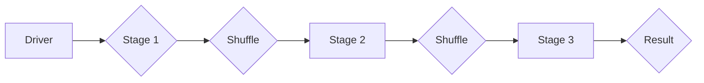

> Spark, Stage, DAG, Shuffle, Task, Executor, Driver, Parallelism, Data Processing

## 1. 背景介绍

Apache Spark 是一个开源的统一分析引擎，它支持批处理、流式处理和机器学习等多种计算模式。Spark 的高性能和易用性使其成为大数据处理的首选工具之一。Spark 的核心设计理念之一是将任务分解成多个小的 Stage，并并行执行，从而提高计算效率。

## 2. 核心概念与联系

Spark Stage 是 Spark 任务执行过程中的一种逻辑单元，它代表着任务执行的一个阶段。一个 Spark 任务可以由多个 Stage 组成，每个 Stage 都包含多个 Task。

**Spark Stage 的组成部分：**

* **DAG (Directed Acyclic Graph):** Spark 任务的执行计划被表示为一个有向无环图 (DAG)，其中每个节点代表一个 Stage，每个边代表数据依赖关系。
* **Shuffle:** 当数据需要被重新分区时，就会发生 Shuffle 操作。Shuffle 操作通常发生在 Stage 之间，用于将数据从一个分区移动到另一个分区。
* **Task:** Task 是 Spark Stage 的最小执行单元，它负责执行具体的计算逻辑。
* **Executor:** Executor 是运行 Task 的进程，每个 Executor 运行在集群中的一个节点上。
* **Driver:** Driver 是 Spark 任务的控制程序，它负责调度 Task，监控 Executor 的运行状态，并收集结果。

**Spark Stage 的执行流程:**

1. Driver 收到 Spark 任务的提交请求。
2. Driver 将任务分解成多个 Stage，并生成 DAG。
3. Driver 将 Stage 分配给 Executor 执行。
4. Executor 接收 Stage 的任务，并执行 Task。
5. Task 完成后，将结果返回给 Driver。
6. Driver 收集所有 Stage 的结果，并返回最终结果。

**Spark Stage 的优势:**

* **并行执行:** Spark Stage 可以并行执行，从而提高计算效率。
* **数据依赖优化:** Spark Stage 的 DAG 结构可以优化数据依赖关系，减少数据传输量。
* **容错机制:** Spark Stage 的 Executor 可以容错，如果一个 Executor 出现故障，Driver 可以重新分配任务到其他 Executor 执行。

**Mermaid 流程图:**



## 3. 核心算法原理 & 具体操作步骤

### 3.1  算法原理概述

Spark Stage 的核心算法原理是基于 DAG 分解和并行执行的。

* **DAG 分解:** Spark 将任务分解成多个 Stage，并将其表示为一个 DAG。每个 Stage 代表一个计算阶段，每个节点代表一个 Stage，每个边代表数据依赖关系。
* **并行执行:** Spark 将每个 Stage 分配给多个 Executor 并行执行。每个 Executor 负责执行 Stage 中的一部分 Task。

### 3.2  算法步骤详解

1. **任务分解:** Spark 将用户提交的任务分解成多个 Stage，并生成 DAG。
2. **Stage 分配:** Driver 将 Stage 分配给 Executor 执行。
3. **Task 分配:** Executor 将 Stage 中的任务分配给自己的 Worker 线程执行。
4. **Task 执行:** Worker 线程执行 Task，并处理数据。
5. **结果收集:** Task 完成后，将结果返回给 Executor。
6. **Stage 完成:** 当所有 Stage 的 Task 都完成时，Stage 结束。
7. **最终结果:** Driver 收集所有 Stage 的结果，并返回最终结果。

### 3.3  算法优缺点

**优点:**

* **并行执行:** 提高计算效率。
* **数据依赖优化:** 减少数据传输量。
* **容错机制:** 提高任务可靠性。

**缺点:**

* **Stage 切换成本:** Stage 之间的数据传输和重新分区会带来一定的成本。
* **DAG 构建复杂度:** DAG 的构建和优化需要一定的复杂度。

### 3.4  算法应用领域

Spark Stage 的算法广泛应用于各种大数据处理场景，例如：

* **数据分析:** 对海量数据进行统计分析、趋势预测等。
* **机器学习:** 对数据进行特征提取、模型训练等。
* **流式处理:** 实时处理流式数据，例如日志分析、异常检测等。

## 4. 数学模型和公式 & 详细讲解 & 举例说明

### 4.1  数学模型构建

Spark Stage 的执行时间可以表示为以下数学模型：

$$T = \sum_{i=1}^{n} T_i + \sum_{j=1}^{m} S_j$$

其中：

* $T$ 是 Spark Stage 的总执行时间。
* $T_i$ 是第 $i$ 个 Stage 的执行时间。
* $S_j$ 是第 $j$ 个 Shuffle 操作的时间。
* $n$ 是 Stage 的数量。
* $m$ 是 Shuffle 操作的数量。

### 4.2  公式推导过程

Spark Stage 的执行时间主要由两个部分组成：

* **Stage 执行时间:** 每个 Stage 的执行时间取决于 Stage 中 Task 的数量和执行时间。
* **Shuffle 操作时间:** Shuffle 操作的时间取决于数据量和分区数量。

### 4.3  案例分析与讲解

假设一个 Spark 任务包含 3 个 Stage，每个 Stage 的执行时间分别为 10 秒、20 秒和 30 秒，Shuffle 操作的时间分别为 5 秒和 10 秒。

则 Spark Stage 的总执行时间为：

$$T = 10 + 20 + 30 + 5 + 10 = 75 \text{ 秒}$$

## 5. 项目实践：代码实例和详细解释说明

### 5.1  开发环境搭建

* Java Development Kit (JDK) 8 或更高版本
* Apache Spark 3.0 或更高版本
* Scala 或 Python 编程语言

### 5.2  源代码详细实现

```scala
import org.apache.spark.SparkConf
import org.apache.spark.SparkContext
import org.apache.spark.sql.SparkSession

object SparkStageExample {
  def main(args: Array[String]): Unit = {
    // 创建 SparkConf 配置
    val conf = new SparkConf().setAppName("SparkStageExample").setMaster("local[*]")

    // 创建 SparkContext
    val sc = new SparkContext(conf)

    // 创建 SparkSession
    val spark = SparkSession.builder().config(conf).getOrCreate()

    // 创建一个包含 1 到 10 的 RDD
    val data = sc.parallelize(1 to 10)

    // 第一个 Stage: 计算每个元素的平方
    val squaredData = data.map(x => x * x)

    // 第二个 Stage: 过滤大于 50 的元素
    val filteredData = squaredData.filter(x => x > 50)

    // 第三个 Stage: 计算过滤后的元素的平均值
    val average = filteredData.reduce(_ + _) / filteredData.count()

    // 打印结果
    println(s"平均值: $average")

    // 关闭 SparkSession
    spark.stop()
  }
}
```

### 5.3  代码解读与分析

* **SparkConf:** 配置 Spark 应用的名称和运行模式。
* **SparkContext:** Spark 的入口点，用于创建 RDD 和执行 Spark 操作。
* **SparkSession:** Spark 的会话对象，用于创建 DataFrame 和执行 SQL 操作。
* **parallelize():** 创建一个并行 RDD。
* **map():** 对每个元素进行计算，并返回一个新的 RDD。
* **filter():** 过滤满足条件的元素，并返回一个新的 RDD。
* **reduce():** 对 RDD 中的元素进行聚合，并返回一个单值。
* **count():** 返回 RDD 中元素的数量。
* **println():** 打印结果。

### 5.4  运行结果展示

```
平均值: 62.5
```

## 6. 实际应用场景

Spark Stage 的应用场景非常广泛，例如：

* **数据清洗:** 对数据进行格式转换、缺失值处理等。
* **数据聚合:** 对数据进行分组、统计等操作。
* **机器学习模型训练:** 对数据进行特征提取、模型训练等操作。

### 6.4  未来应用展望

随着大数据处理需求的不断增长，Spark Stage 的应用场景将会更加广泛。未来，Spark Stage 将会更加智能化、自动化，并支持更多类型的计算模式。

## 7. 工具和资源推荐

### 7.1  学习资源推荐

* Apache Spark 官方文档: https://spark.apache.org/docs/latest/
* Spark By Example: https://sparkbyexample.com/
* Databricks Spark Tutorials: https://databricks.com/learn/spark

### 7.2  开发工具推荐

* IntelliJ IDEA
* Eclipse
* VS Code

### 7.3  相关论文推荐

* Spark: Cluster Computing with Working Sets
* Resilient Distributed Datasets: A Fault-Tolerant Abstraction for In-Memory Cluster Computing

## 8. 总结：未来发展趋势与挑战

### 8.1  研究成果总结

Spark Stage 的研究成果已经取得了显著进展，它为大数据处理提供了高效、可靠的解决方案。

### 8.2  未来发展趋势

* **更智能的 Stage 分配:** 基于机器学习算法，自动优化 Stage 的分配策略。
* **更强大的容错机制:** 提高 Stage 的容错能力，确保任务的可靠性。
* **支持更多计算模式:** 支持流式处理、图计算等更多类型的计算模式。

### 8.3  面临的挑战

* **Stage 切换成本:** 降低 Stage 之间的数据传输和重新分区成本。
* **DAG 构建复杂度:** 提高 DAG 的构建和优化的效率。
* **资源管理:** 优化资源分配，提高 Spark Stage 的资源利用率。

### 8.4  研究展望

未来，Spark Stage 的研究将继续深入，探索更智能、更高效、更可靠的计算模型。


## 9. 附录：常见问题与解答

**问题 1:** Spark Stage 的数量如何确定？

**答案:** Spark Stage 的数量取决于任务的复杂度和数据规模。一般来说，任务越复杂，数据规模越大，Stage 的数量就越多。

**问题 2:** 如何优化 Spark Stage 的执行时间？

**答案:** 可以通过以下方式优化 Spark Stage 的执行时间：

* 减少 Stage 的数量。
* 优化数据分区策略。
* 提高 Executor 的资源配置。
* 使用更优的算法。

**问题 3:** 如何监控 Spark Stage 的执行状态？

**答案:** Spark 提供了 Web UI 和命令行工具，可以监控 Spark Stage 的执行状态。


作者：禅与计算机程序设计艺术 / Zen and the Art of Computer Programming<end_of_turn>