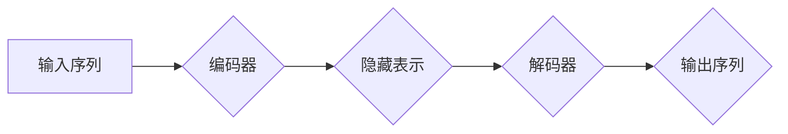

> Transformer, 大模型, ktrain, 自然语言处理, 深度学习, 机器学习

## 1. 背景介绍

近年来，深度学习在自然语言处理 (NLP) 领域取得了突破性进展，其中 Transformer 架构成为 NLP 领域的新宠。其强大的序列建模能力和并行训练效率，使得 Transformer 模型在机器翻译、文本摘要、问答系统等任务中取得了显著的成绩。

然而，训练和部署大型 Transformer 模型需要强大的计算资源和专业知识。为了降低开发门槛，许多开源库和工具应运而生，其中 ktrain 库就凭借其易用性和强大的功能，成为了众多开发者和研究者的首选。

本篇文章将深入探讨 Transformer 大模型的原理和应用，并以 ktrain 库为例，详细介绍如何利用其高效训练和部署 Transformer 模型。

## 2. 核心概念与联系

### 2.1 Transformer 架构

Transformer 架构由编码器 (Encoder) 和解码器 (Decoder) 两部分组成。编码器负责将输入序列映射到一个隐藏表示，解码器则根据隐藏表示生成输出序列。

Transformer 的核心创新在于其自注意力机制 (Self-Attention)，它能够捕捉序列中不同词之间的依赖关系，从而更好地理解上下文信息。

**Mermaid 流程图:**



### 2.2 ktrain 库

ktrain 是一个 Python 库，专门用于训练和部署深度学习模型，尤其擅长 Transformer 模型。其特点包括：

* **易用性:** ktrain 提供了简洁的 API，即使是初学者也能快速上手。
* **高效性:** ktrain 利用了 GPU 加速和分布式训练等技术，可以显著提高训练速度。
* **灵活性:** ktrain 支持多种预训练模型和数据集，可以满足不同应用场景的需求。

## 3. 核心算法原理 & 具体操作步骤

### 3.1 算法原理概述

Transformer 模型的核心算法是自注意力机制和多头注意力机制。

* **自注意力机制:** 

自注意力机制能够计算每个词与所有其他词之间的相关性，并生成一个权重矩阵，用于加权求和所有词的表示，从而得到每个词的上下文表示。

* **多头注意力机制:** 

多头注意力机制通过并行执行多个自注意力机制，并对结果进行拼接，可以捕捉到不同层次的语义信息。

### 3.2 算法步骤详解

1. **输入嵌入:** 将输入序列中的每个词转换为向量表示。
2. **多头注意力:** 对输入序列应用多头注意力机制，得到每个词的上下文表示。
3. **前馈网络:** 对每个词的上下文表示应用一个前馈神经网络，进一步提取语义信息。
4. **输出层:** 将隐藏层的输出应用到输出层，生成输出序列。

### 3.3 算法优缺点

**优点:**

* 能够捕捉长距离依赖关系。
* 并行训练效率高。
* 在各种 NLP 任务中表现出色。

**缺点:**

* 计算量大，训练成本高。
* 对训练数据要求高。

### 3.4 算法应用领域

Transformer 模型在以下领域取得了广泛应用:

* 机器翻译
* 文本摘要
* 问答系统
* 语义理解
* 代码生成

## 4. 数学模型和公式 & 详细讲解 & 举例说明

### 4.1 数学模型构建

Transformer 模型的数学模型主要包括以下几个部分:

* **词嵌入:** 将每个词映射到一个低维向量空间。
* **多头注意力机制:** 计算每个词与所有其他词之间的相关性。
* **前馈神经网络:** 对每个词的上下文表示进行进一步处理。
* **输出层:** 生成输出序列。

### 4.2 公式推导过程

**多头注意力机制公式:**

$$
Attention(Q, K, V) = softmax(\frac{QK^T}{\sqrt{d_k}})V
$$

其中:

* $Q$ 是查询矩阵
* $K$ 是键矩阵
* $V$ 是值矩阵
* $d_k$ 是键向量的维度

**多头注意力机制的计算过程:**

1. 将输入序列 $X$ 分成多个子序列 $X_1, X_2, ..., X_h$，其中 $h$ 是多头数量。
2. 对每个子序列 $X_i$ 应用线性变换得到查询矩阵 $Q_i$, 键矩阵 $K_i$ 和值矩阵 $V_i$。
3. 计算每个子序列 $X_i$ 的注意力权重 $A_i$。
4. 将注意力权重 $A_i$ 与值矩阵 $V_i$ 相乘，得到每个子序列 $X_i$ 的输出 $O_i$。
5. 将所有子序列的输出 $O_1, O_2, ..., O_h$ 拼接在一起，得到最终的注意力输出 $O$。

### 4.3 案例分析与讲解

假设我们有一个句子 "The cat sat on the mat"，我们使用 Transformer 模型进行文本分类任务。

1. 将句子中的每个词转换为词嵌入向量。
2. 应用多头注意力机制，计算每个词与所有其他词之间的相关性。
3. 应用前馈神经网络，对每个词的上下文表示进行进一步处理。
4. 将隐藏层的输出应用到输出层，生成分类结果。

## 5. 项目实践：代码实例和详细解释说明

### 5.1 开发环境搭建

* Python 3.6+
* TensorFlow 2.0+
* PyTorch 1.0+
* ktrain 0.10+

### 5.2 源代码详细实现

```python
from ktrain import text_classifier
from ktrain.data import get_dataset
from ktrain.metrics import accuracy

# 加载预训练模型
model = text_classifier.get_model("bert-base-uncased")

# 加载数据集
train_data, val_data = get_dataset("imdb", split_ratio=0.8)

# 训练模型
trainer = text_classifier.create_trainer(model, train_data, val_data)
trainer.fit(epochs=3)

# 评估模型
_, val_loss, val_acc = trainer.evaluate(val_data)
print(f"Validation Accuracy: {val_acc:.4f}")

# 保存模型
trainer.save("imdb_classifier")
```

### 5.3 代码解读与分析

* 使用 `text_classifier.get_model()` 函数加载预训练的 BERT 模型。
* 使用 `get_dataset()` 函数加载 IMDB 数据集。
* 使用 `text_classifier.create_trainer()` 函数创建训练器。
* 使用 `trainer.fit()` 函数训练模型。
* 使用 `trainer.evaluate()` 函数评估模型。
* 使用 `trainer.save()` 函数保存模型。

### 5.4 运行结果展示

训练完成后，模型将输出验证集上的准确率。

## 6. 实际应用场景

Transformer 模型在以下实际应用场景中发挥着重要作用:

* **机器翻译:** Google Translate 等机器翻译系统利用 Transformer 模型实现高效的跨语言文本翻译。
* **文本摘要:** Transformer 模型可以自动生成文本摘要，例如新闻文章的摘要、会议记录的摘要等。
* **问答系统:** Transformer 模型可以理解自然语言问题，并从文本数据中找到相应的答案。
* **对话系统:** Transformer 模型可以用于构建更自然、更智能的对话系统，例如聊天机器人、虚拟助手等。

### 6.4 未来应用展望

随着 Transformer 模型的不断发展，其应用场景将更加广泛，例如:

* **代码生成:** Transformer 模型可以学习代码的语法和语义，并生成新的代码片段。
* **药物研发:** Transformer 模型可以分析生物数据，并预测药物的活性。
* **个性化推荐:** Transformer 模型可以根据用户的行为和偏好，推荐个性化的商品或服务。

## 7. 工具和资源推荐

### 7.1 学习资源推荐

* **论文:** "Attention Is All You Need"
* **博客:** Jay Alammar's Blog
* **在线课程:** Coursera, Udacity

### 7.2 开发工具推荐

* **ktrain:** https://github.com/karpathy/ktrain
* **HuggingFace Transformers:** https://huggingface.co/transformers/
* **TensorFlow:** https://www.tensorflow.org/
* **PyTorch:** https://pytorch.org/

### 7.3 相关论文推荐

* "BERT: Pre-training of Deep Bidirectional Transformers for Language Understanding"
* "GPT-3: Language Models are Few-Shot Learners"
* "T5: Text-to-Text Transfer Transformer"

## 8. 总结：未来发展趋势与挑战

### 8.1 研究成果总结

Transformer 模型在 NLP 领域取得了显著的成果，其强大的序列建模能力和并行训练效率，推动了 NLP 技术的快速发展。

### 8.2 未来发展趋势

* **模型规模:** Transformer 模型的规模将继续扩大，以提高模型性能。
* **高效训练:** 研究人员将探索更有效的训练方法，降低训练成本。
* **多模态学习:** Transformer 模型将与其他模态数据融合，实现多模态理解。

### 8.3 面临的挑战

* **计算资源:** 训练大型 Transformer 模型需要大量的计算资源。
* **数据标注:** 高质量的训练数据对于 Transformer 模型的性能至关重要。
* **可解释性:** Transformer 模型的决策过程难以解释，这限制了其在一些应用场景中的应用。

### 8.4 研究展望

未来研究将集中在以下几个方面:

* 开发更有效的训练方法，降低训练成本。
* 探索 Transformer 模型的多模态学习能力。
* 研究 Transformer 模型的可解释性，提高其在安全和隐私敏感领域的应用。

## 9. 附录：常见问题与解答

* **Q: 如何选择合适的 Transformer 模型？**

A: 选择合适的 Transformer 模型取决于具体的应用场景和数据规模。对于小型数据集，可以使用预训练的 BERT 或 RoBERTa 模型。对于大型数据集，可以考虑使用更大型的模型，例如 GPT-3 或 T5。

* **Q: 如何训练 Transformer 模型？**

A: 使用 ktrain 库可以方便地训练 Transformer 模型。ktrain 提供了预训练模型和训练脚本，可以快速上手。

* **Q: 如何部署 Transformer 模型？**

A: Transformer 模型可以部署在云端、边缘设备或本地机器上。ktrain 提供了模型部署工具，可以方便地将模型部署到不同的环境中。


作者：禅与计算机程序设计艺术 / Zen and the Art of Computer Programming 
<end_of_turn>