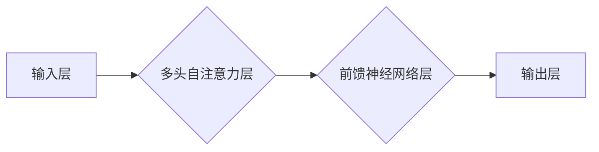

> Transformer, 大模型, 大批量训练, 深度学习, 自然语言处理

## 1. 背景介绍

近年来，深度学习在人工智能领域取得了突破性进展，其中Transformer模型凭借其强大的序列建模能力，在自然语言处理 (NLP) 任务上取得了显著的成就。从BERT到GPT-3，Transformer模型的规模不断扩大，其性能也随之提升。然而，训练这些庞大的模型需要大量的计算资源和时间。大批量训练 (Large Batch Training) 作为一种有效的训练策略，可以显著加速模型训练速度，并提高训练效率。

## 2. 核心概念与联系

Transformer模型的核心在于其自注意力机制 (Self-Attention)，它能够捕捉序列中不同词之间的依赖关系，从而更好地理解上下文信息。

**Transformer模型架构**



**大批量训练**

大批量训练是指将多个样本一次性输入模型进行训练，相比于小批量训练，大批量训练可以减少梯度更新的次数，从而提高训练效率。

## 3. 核心算法原理 & 具体操作步骤

### 3.1  算法原理概述

Transformer模型的训练基于反向传播算法 (Backpropagation)，其目标是通过最小化模型预测与真实值的误差来学习模型参数。

大批量训练的核心思想是将多个样本打包成一个大批量，一次性进行梯度更新。

### 3.2  算法步骤详解

1. **数据预处理:** 将文本数据转换为模型可理解的格式，例如词嵌入。
2. **数据分批:** 将预处理后的数据分成多个大批量。
3. **前向传播:** 将每个大批量的数据输入模型，计算模型的预测输出。
4. **损失函数计算:** 计算模型预测输出与真实值的误差，使用损失函数衡量误差大小。
5. **反向传播:** 计算梯度，更新模型参数。
6. **重复步骤3-5:** 迭代训练模型，直到达到预设的训练目标。

### 3.3  算法优缺点

**优点:**

* 训练速度更快
* 训练效率更高
* 能够更好地利用硬件资源

**缺点:**

* 容易出现梯度爆炸或梯度消失问题
* 需要更大的内存空间
* 训练过程可能更加不稳定

### 3.4  算法应用领域

大批量训练广泛应用于各种深度学习模型的训练，例如：

* 自然语言处理 (NLP)
* computer vision
* speech recognition

## 4. 数学模型和公式 & 详细讲解 & 举例说明

### 4.1  数学模型构建

Transformer模型的数学模型主要包括以下几个部分:

* **词嵌入层:** 将每个词映射到一个低维向量空间。
* **多头自注意力层:** 计算每个词与其他词之间的注意力权重，捕捉序列中的依赖关系。
* **前馈神经网络层:** 对每个词的嵌入向量进行非线性变换。
* **位置编码层:** 为每个词添加位置信息，使模型能够理解词序。
* **输出层:** 将模型的输出映射到目标任务的输出空间。

### 4.2  公式推导过程

**多头自注意力机制**

```latex
Attention(Q, K, V) = softmax(\frac{QK^T}{\sqrt{d_k}})V
```

其中:

* Q: 查询矩阵
* K: 键矩阵
* V: 值矩阵
* $d_k$: 键向量的维度

**前馈神经网络层**

```latex
FFN(x) = max(0, xW_1 + b_1)W_2 + b_2
```

其中:

* x: 输入向量
* $W_1$, $W_2$: 权重矩阵
* $b_1$, $b_2$: 偏置向量

### 4.3  案例分析与讲解

**BERT模型**

BERT模型采用双向Transformer架构，其训练目标是通过预测掩盖的词来学习语言表示。BERT模型在各种NLP任务上取得了优异的性能，例如文本分类、问答系统和机器翻译。

## 5. 项目实践：代码实例和详细解释说明

### 5.1  开发环境搭建

* Python 3.6+
* PyTorch 1.0+
* CUDA 10.0+

### 5.2  源代码详细实现

```python
import torch
import torch.nn as nn

class Transformer(nn.Module):
    def __init__(self, vocab_size, embedding_dim, num_heads, num_layers):
        super(Transformer, self).__init__()
        self.embedding = nn.Embedding(vocab_size, embedding_dim)
        self.transformer_layers = nn.ModuleList([
            nn.TransformerEncoderLayer(embedding_dim, num_heads)
            for _ in range(num_layers)
        ])
        self.linear = nn.Linear(embedding_dim, vocab_size)

    def forward(self, x):
        x = self.embedding(x)
        for layer in self.transformer_layers:
            x = layer(x)
        x = self.linear(x)
        return x
```

### 5.3  代码解读与分析

* `__init__` 方法初始化模型参数，包括词嵌入层、Transformer编码器层和输出层。
* `forward` 方法定义模型的正向传播过程，将输入序列映射到输出序列。

### 5.4  运行结果展示

训练完成后，可以使用模型对新的文本数据进行预测。

## 6. 实际应用场景

大批量训练在各种实际应用场景中发挥着重要作用，例如：

* **机器翻译:** 训练大型机器翻译模型，提高翻译质量和效率。
* **文本摘要:** 训练文本摘要模型，自动生成文本摘要。
* **问答系统:** 训练问答系统模型，能够回答用户提出的问题。

### 6.4  未来应用展望

随着计算资源的不断发展，大批量训练将应用于更多领域，例如：

* **药物研发:** 训练药物研发模型，加速药物发现和开发。
* **材料科学:** 训练材料科学模型，设计新型材料。
* **金融预测:** 训练金融预测模型，预测股票价格和市场趋势。

## 7. 工具和资源推荐

### 7.1  学习资源推荐

* **论文:**
    * "Attention Is All You Need"
    * "BERT: Pre-training of Deep Bidirectional Transformers for Language Understanding"
* **博客:**
    * Jay Alammar's Blog
    * Hugging Face Blog

### 7.2  开发工具推荐

* **PyTorch:** 深度学习框架
* **TensorFlow:** 深度学习框架
* **Horovod:** 分布式深度学习训练框架

### 7.3  相关论文推荐

* "Large Batch Training of Transformers"
* "Scaling Laws for Neural Language Models"

## 8. 总结：未来发展趋势与挑战

### 8.1  研究成果总结

大批量训练是深度学习训练中的一种重要策略，它可以显著提高训练效率。Transformer模型凭借其强大的序列建模能力，在NLP任务上取得了突破性进展。

### 8.2  未来发展趋势

* **模型规模进一步扩大:** 随着计算资源的不断发展，模型规模将继续扩大，训练更加复杂的模型。
* **训练效率进一步提升:** 研究人员将继续探索新的训练策略和算法，提高训练效率。
* **应用领域不断拓展:** 大批量训练将应用于更多领域，例如药物研发、材料科学和金融预测。

### 8.3  面临的挑战

* **梯度爆炸和梯度消失问题:** 大批量训练容易出现梯度爆炸或梯度消失问题，需要采取相应的措施进行缓解。
* **内存占用问题:** 大批量训练需要更大的内存空间，对硬件资源提出了更高的要求。
* **训练稳定性问题:** 大批量训练过程可能更加不稳定，需要进行更细致的调参和监控。

### 8.4  研究展望

未来研究将集中在以下几个方面:

* **开发新的训练算法:** 研究更有效的训练算法，提高训练效率和稳定性。
* **探索新的模型架构:** 设计新的模型架构，更好地适应大批量训练。
* **研究大规模模型的泛化能力:** 研究大规模模型的泛化能力，确保模型在实际应用中能够取得良好的性能。

## 9. 附录：常见问题与解答

**问题:** 大批量训练为什么比小批量训练更快？

**答案:** 大批量训练可以减少梯度更新的次数，从而提高训练效率。

**问题:** 大批量训练容易出现梯度爆炸或梯度消失问题，如何解决？

**答案:** 可以使用梯度裁剪 (Gradient Clipping) 或学习率衰减 (Learning Rate Decay) 等技术来缓解梯度爆炸或梯度消失问题。

**问题:** 大批量训练需要更大的内存空间，如何解决？

**答案:** 可以使用混合精度训练 (Mixed Precision Training) 或模型并行 (Model Parallelism) 等技术来减少内存占用。


作者：禅与计算机程序设计艺术 / Zen and the Art of Computer Programming 
<end_of_turn>