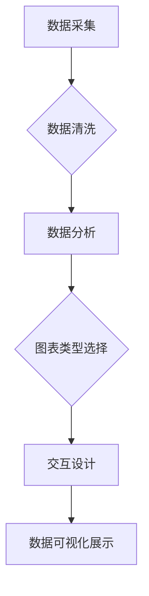

> 数据可视化, AI, 大数据, 计算原理, 图表, 算法, 代码实例, Python, Matplotlib, Seaborn, Tableau

## 1. 背景介绍

在海量数据时代，数据可视化作为一种重要的数据分析和呈现方式，越来越受到重视。它能够将复杂的数据转化为直观易懂的图表和图形，帮助人们快速理解数据趋势、发现隐藏模式和做出更明智的决策。

数据可视化在各个领域都有广泛的应用，例如：

* **商业领域:** 分析市场趋势、客户行为、销售数据等。
* **科学研究:** 可视化实验数据、研究结果、模型模拟等。
* **教育领域:**  展示教学内容、学生学习情况、数据分析结果等。
* **新闻媒体:**  呈现新闻数据、事件地图、社会热点等。

随着人工智能技术的快速发展，数据可视化也迎来了新的机遇和挑战。AI算法可以帮助我们自动生成更具洞察力的图表，并提供更深入的数据分析。

## 2. 核心概念与联系

数据可视化涉及到多个核心概念，包括数据清洗、数据分析、图表类型选择、交互设计等。这些概念相互关联，共同构成了数据可视化系统的完整框架。

**数据可视化系统架构**



* **数据采集:** 从各种数据源收集原始数据。
* **数据清洗:** 处理数据中的缺失值、异常值、重复值等问题，确保数据质量。
* **数据分析:** 对数据进行统计分析、模式识别、趋势预测等操作，提取有价值的信息。
* **图表类型选择:** 根据数据特点和分析目标，选择合适的图表类型进行展示。
* **交互设计:** 设计用户交互界面，使用户能够自由探索数据、进行筛选和过滤等操作。
* **数据可视化展示:** 将数据以图表、图形等形式呈现出来，方便用户理解和解读。

## 3. 核心算法原理 & 具体操作步骤

数据可视化算法主要涉及到数据聚类、降维、异常检测等领域。

### 3.1  算法原理概述

* **数据聚类:** 将数据点根据相似性进行分组，发现数据中的潜在结构和模式。常用的聚类算法包括K-means、层次聚类、DBSCAN等。
* **降维:** 将高维数据映射到低维空间，减少数据维度，同时保留数据的主要信息。常用的降维算法包括主成分分析(PCA)、线性判别分析(LDA)、t-SNE等。
* **异常检测:** 识别数据中的异常值，例如欺诈交易、设备故障等。常用的异常检测算法包括基于统计的异常检测、基于机器学习的异常检测等。

### 3.2  算法步骤详解

以K-means聚类算法为例，详细说明其步骤：

1. **初始化:** 随机选择K个数据点作为初始聚类中心。
2. **分配:** 将每个数据点分配到距离其最近的聚类中心所属的类别。
3. **更新:** 计算每个聚类中心的新的位置，即所有属于该类别的点的平均值。
4. **重复:** 重复步骤2和步骤3，直到聚类中心不再发生变化或达到最大迭代次数。

### 3.3  算法优缺点

* **K-means算法:**
    * **优点:** 算法简单易实现，计算效率高。
    * **缺点:** 容易受到初始聚类中心的选择影响，对数据分布形状有要求。

### 3.4  算法应用领域

* **数据挖掘:** 发现数据中的隐藏模式和关系。
* **图像识别:** 将图像分割成不同的区域，识别图像中的物体。
* **推荐系统:** 根据用户的历史行为，推荐用户可能感兴趣的内容。

## 4. 数学模型和公式 & 详细讲解 & 举例说明

### 4.1  数学模型构建

K-means聚类算法的数学模型可以描述为：

* **目标函数:**  最小化所有数据点到其所属聚类中心的距离之和。
* **距离度量:** 通常使用欧氏距离或曼哈顿距离等。

### 4.2  公式推导过程

目标函数可以表示为：

$$J(C) = \sum_{i=1}^{n} \min_{k=1}^{K} ||x_i - c_k||^2$$

其中：

* $J(C)$ 是目标函数值。
* $n$ 是数据点的数量。
* $K$ 是聚类数。
* $x_i$ 是第 $i$ 个数据点。
* $c_k$ 是第 $k$ 个聚类中心。
* $||x_i - c_k||^2$ 是数据点 $x_i$ 到聚类中心 $c_k$ 的欧氏距离平方。

### 4.3  案例分析与讲解

假设我们有以下数据点：

```
x1 = [1, 2]
x2 = [1.5, 1.8]
x3 = [5, 8]
x4 = [8, 8]
```

我们希望将这些数据点聚类成两个类别。

通过K-means算法，我们可以得到以下聚类结果：

* 类别1:  x1, x2
* 类别2:  x3, x4

## 5. 项目实践：代码实例和详细解释说明

### 5.1  开发环境搭建

* Python 3.x
* Matplotlib
* Seaborn

### 5.2  源代码详细实现

```python
import matplotlib.pyplot as plt
import seaborn as sns
from sklearn.cluster import KMeans

# 数据准备
data = [[1, 2], [1.5, 1.8], [5, 8], [8, 8]]

# K-means聚类
kmeans = KMeans(n_clusters=2)
kmeans.fit(data)

# 获取聚类标签
labels = kmeans.labels_

# 可视化结果
plt.figure(figsize=(6, 4))
sns.scatterplot(x=[point[0] for point in data], y=[point[1] for point in data], hue=labels)
plt.title('K-means聚类结果')
plt.show()
```

### 5.3  代码解读与分析

* **数据准备:** 将数据点存储在一个列表中。
* **K-means聚类:** 使用`KMeans`类进行聚类，指定聚类数为2。
* **获取聚类标签:** 使用`labels_`属性获取每个数据点的聚类标签。
* **可视化结果:** 使用`seaborn`库绘制散点图，根据聚类标签区分不同颜色。

### 5.4  运行结果展示

运行代码后，会生成一个散点图，将数据点根据聚类结果进行区分。

## 6. 实际应用场景

数据可视化在各个领域都有广泛的应用场景，例如：

* **商业分析:** 使用图表展示销售数据、市场趋势、客户行为等信息，帮助企业做出更明智的决策。
* **科学研究:** 可视化实验数据、研究结果、模型模拟等，帮助科学家发现隐藏模式和进行深入分析。
* **教育教学:** 使用图表展示教学内容、学生学习情况、数据分析结果等，提高教学效率和学生的学习兴趣。

### 6.4  未来应用展望

随着人工智能技术的不断发展，数据可视化将更加智能化、个性化和交互式。

* **智能数据可视化:** AI算法可以自动生成更具洞察力的图表，并提供更深入的数据分析。
* **个性化数据可视化:** 根据用户的需求和偏好，定制个性化的数据可视化界面。
* **交互式数据可视化:** 用户可以自由探索数据、进行筛选和过滤等操作，获得更深入的理解。

## 7. 工具和资源推荐

### 7.1  学习资源推荐

* **书籍:**
    * 《数据可视化：让数据说话》
    * 《Storytelling with Data: A Data Visualization Guide for Business Professionals》
* **在线课程:**
    * Coursera: Data Visualization Specialization
    * edX: Data Visualization with Tableau

### 7.2  开发工具推荐

* **Python库:** Matplotlib, Seaborn, Plotly
* **商业工具:** Tableau, Power BI

### 7.3  相关论文推荐

* **Tufte, E. R. (2001). The visual display of quantitative information.**
* **Heer, J., & Bostock, M. (2013). Interactive data visualization in the browser.**

## 8. 总结：未来发展趋势与挑战

### 8.1  研究成果总结

数据可视化技术已经取得了显著的进展，能够有效地帮助人们理解和分析复杂的数据。

### 8.2  未来发展趋势

数据可视化将更加智能化、个性化和交互式，并与其他技术领域深度融合。

### 8.3  面临的挑战

* 如何设计更具洞察力的图表，更好地传达数据信息。
* 如何应对海量数据的可视化挑战，提高可视化效率。
* 如何确保数据可视化的准确性和可靠性。

### 8.4  研究展望

未来，数据可视化研究将继续探索新的算法、技术和应用场景，为人们提供更便捷、更直观的数据分析和呈现方式。

## 9. 附录：常见问题与解答

* **Q: 如何选择合适的图表类型？**
* **A:** 选择图表类型时，需要考虑数据的特点、分析目标和受众群体。

* **Q: 如何避免数据可视化中的误导性？**
* **A:** 数据可视化设计应遵循客观、准确、清晰的原则，避免使用虚假数据或误导性的图表。

* **Q: 如何进行数据可视化交互设计？**
* **A:** 数据可视化交互设计应考虑用户体验，提供用户友好的操作界面和交互方式。


作者：禅与计算机程序设计艺术 / Zen and the Art of Computer Programming 
<end_of_turn>