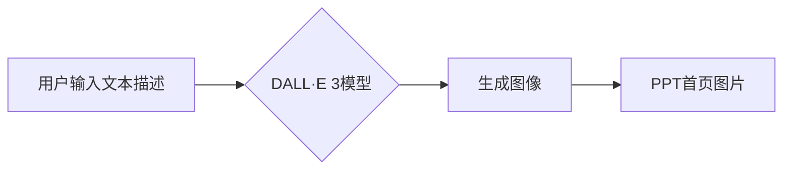

> DALL·E 3, 大模型, AI Agent, PPT首页, 图像生成, 视觉化, 应用开发

## 1. 背景介绍

随着人工智能技术的飞速发展，大模型在各个领域展现出强大的应用潜力。其中，文本生成模型如GPT-3、LaMDA等已经取得了令人瞩目的成就，而图像生成模型则逐渐成为研究热点。DALL·E 3作为OpenAI最新推出的文本到图像生成模型，凭借其强大的生成能力和逼真的图像效果，在创意设计、内容制作等领域引发了广泛关注。

在现代商业和学术领域，PPT（PowerPoint）作为一种常用的演示工具，其首页往往需要一张引人注目的图片来吸引观众的注意力。传统的PPT首页图片通常是通过网络搜索或付费素材库获取，缺乏个性化和创意。而利用DALL·E 3模型，我们可以根据PPT主题或内容生成独一无二的图像，为PPT首页增添视觉冲击力，提升整体效果。

## 2. 核心概念与联系

### 2.1 大模型

大模型是指参数量巨大、训练数据海量的人工智能模型。它们通常拥有强大的泛化能力和学习能力，能够在各种任务中表现出色，例如文本生成、图像识别、机器翻译等。

### 2.2 文本到图像生成模型

文本到图像生成模型是一种能够根据文本描述生成图像的AI模型。它通过学习文本和图像之间的语义关系，将文本信息转化为图像像素，从而实现文本描述到图像生成的映射。

### 2.3 DALL·E 3

DALL·E 3是OpenAI最新推出的文本到图像生成模型，其参数量更大、训练数据更丰富，生成图像的质量和逼真度更高。它能够根据用户提供的文本描述生成各种风格、场景和主题的图像，并支持多种图像编辑功能，例如图像修复、图像增强等。

### 2.4 PPT首页

PPT首页是演示文稿的第一页，通常包含标题、作者、日期等基本信息，以及一张引人注目的图片来吸引观众的注意力。

**Mermaid 流程图**



## 3. 核心算法原理 & 具体操作步骤

### 3.1 算法原理概述

DALL·E 3模型基于Transformer架构，并结合了文本编码、图像编码和图像生成等模块。

* **文本编码模块:** 将用户输入的文本描述转化为数字向量，以便模型理解和处理。
* **图像编码模块:** 将图像信息转化为数字向量，以便模型学习图像特征和语义。
* **图像生成模块:** 根据文本编码和图像编码信息，生成新的图像像素。

### 3.2 算法步骤详解

1. **文本预处理:** 将用户输入的文本描述进行清洗、分词、词干提取等预处理操作，以便模型更好地理解文本内容。
2. **文本编码:** 使用预训练的Transformer模型将文本描述转化为数字向量，表示文本的语义信息。
3. **图像编码:** 如果需要参考已有图像，则使用预训练的图像编码模型将图像信息转化为数字向量，表示图像的特征和语义。
4. **图像生成:** 将文本编码和图像编码信息输入到图像生成模块，根据模型的训练知识生成新的图像像素。
5. **图像后处理:** 对生成的图像进行处理，例如调整亮度、对比度、色彩等，使其更加逼真和美观。

### 3.3 算法优缺点

**优点:**

* 生成图像质量高，逼真度高。
* 支持多种图像风格和场景的生成。
* 可以根据文本描述进行精确的图像生成。

**缺点:**

* 模型参数量大，需要强大的计算资源进行训练和推理。
* 生成图像可能存在一些偏差或错误，需要进行人工审核。

### 3.4 算法应用领域

* **创意设计:** 生成创意插画、海报、标志等设计素材。
* **内容制作:** 生成视频、动画、游戏等内容的视觉元素。
* **教育培训:** 生成教学演示、学习素材等。
* **科学研究:** 生成科学实验结果的图像、图表等。

## 4. 数学模型和公式 & 详细讲解 & 举例说明

### 4.1 数学模型构建

DALL·E 3模型基于Transformer架构，其核心是注意力机制和多头自注意力机制。

**注意力机制:**

注意力机制允许模型关注输入序列中最重要的部分，并根据其重要性分配不同的权重。

**公式:**

$$
\text{Attention}(Q, K, V) = \text{softmax}\left(\frac{QK^T}{\sqrt{d_k}}\right)V
$$

其中：

* $Q$：查询矩阵
* $K$：键矩阵
* $V$：值矩阵
* $d_k$：键向量的维度

**多头自注意力机制:**

多头自注意力机制将注意力机制应用于多个不同的子空间，从而学习到更丰富的语义信息。

**公式:**

$$
\text{MultiHeadAttention}(Q, K, V) = \text{Concat}(head_1, head_2, ..., head_h)W^O
$$

其中：

* $head_i$：第 $i$ 个注意力头的输出
* $h$：注意力头的数量
* $W^O$：最终输出层的权重矩阵

### 4.2 公式推导过程

注意力机制的公式推导过程可以参考相关文献，例如Vaswani et al. (2017)的论文《Attention Is All You Need》。

### 4.3 案例分析与讲解

通过将文本描述输入到DALL·E 3模型，可以生成各种风格、场景和主题的图像。例如，输入文本描述“一只穿着牛仔裤的猫在玩吉他”，模型可以生成一只穿着牛仔裤的猫在弹吉他的图像。

## 5. 项目实践：代码实例和详细解释说明

### 5.1 开发环境搭建

* Python 3.7+
* PyTorch 1.7+
* CUDA 10.2+
* OpenAI API

### 5.2 源代码详细实现

```python
import openai

# 设置OpenAI API密钥
openai.api_key = "YOUR_API_KEY"

# 定义文本描述
prompt = "一只穿着牛仔裤的猫在玩吉他"

# 使用DALL·E 3模型生成图像
response = openai.Image.create(
    prompt=prompt,
    n=1,
    size="1024x1024",
    response_format="json"
)

# 获取生成的图像URL
image_url = response["data"][0]["url"]

# 打印图像URL
print(image_url)
```

### 5.3 代码解读与分析

* 首先，需要导入必要的库，并设置OpenAI API密钥。
* 然后，定义文本描述，即要生成的图像内容。
* 使用`openai.Image.create()`函数调用DALL·E 3模型，生成图像。
* 参数`n`指定生成图像的数量，`size`指定图像尺寸，`response_format`指定返回格式。
* 获取生成的图像URL，并打印出来。

### 5.4 运行结果展示

运行代码后，将输出DALL·E 3生成的图像URL，可以通过该URL访问生成的图像。

## 6. 实际应用场景

### 6.1 PPT首页设计

利用DALL·E 3模型，可以根据PPT主题或内容生成独一无二的图像，为PPT首页增添视觉冲击力，提升整体效果。例如，如果PPT主题是“人工智能发展趋势”，可以生成一张人工智能相关的图像，例如机器人、数据分析等。

### 6.2 内容创作

DALL·E 3模型可以帮助内容创作者生成高质量的视觉素材，例如文章插图、视频背景、游戏场景等。

### 6.3 教育教学

DALL·E 3模型可以帮助教师生成教学演示、学习素材等，例如将文本描述转化为相关的图像，帮助学生更好地理解概念。

### 6.4 未来应用展望

随着DALL·E 3模型的不断发展，其应用场景将更加广泛，例如：

* **虚拟现实和增强现实:** 生成逼真的虚拟场景和增强现实内容。
* **个性化定制:** 根据用户的需求生成个性化的图像，例如定制服装、家居装饰等。
* **艺术创作:** 辅助艺术家创作新的艺术作品。

## 7. 工具和资源推荐

### 7.1 学习资源推荐

* **OpenAI官方文档:** https://platform.openai.com/docs/api-reference/images
* **DALL·E 3模型介绍:** https://openai.com/blog/dall-e-3/
* **Transformer模型论文:** https://arxiv.org/abs/1706.03762

### 7.2 开发工具推荐

* **Python:** https://www.python.org/
* **PyTorch:** https://pytorch.org/
* **OpenAI API:** https://platform.openai.com/docs/api-reference

### 7.3 相关论文推荐

* **Attention Is All You Need:** https://arxiv.org/abs/1706.03762
* **DALL·E 2: Hierarchical Text-Conditional Image Generation with CLIP Latents:** https://arxiv.org/abs/2102.12092

## 8. 总结：未来发展趋势与挑战

### 8.1 研究成果总结

DALL·E 3模型在文本到图像生成领域取得了显著的成果，其生成图像的质量和逼真度大幅提升，为创意设计、内容制作等领域提供了新的可能性。

### 8.2 未来发展趋势

* **模型参数量更大、训练数据更丰富:** 随着计算资源的不断发展，未来DALL·E 3模型的参数量将进一步增加，训练数据也将更加丰富，生成图像的质量和多样性将得到进一步提升。
* **多模态生成:** 未来DALL·E 3模型将支持多模态生成，例如文本到图像、文本到视频、图像到文本等，实现更丰富的创意表达。
* **个性化定制:** 未来DALL·E 3模型将支持个性化定制，根据用户的需求生成个性化的图像，例如定制服装、家居装饰等。

### 8.3 面临的挑战

* **伦理问题:** DALL·E 3模型可以生成逼真的图像，可能会被用于生成虚假信息或进行恶意攻击，因此需要关注其伦理问题。
* **数据偏见:** DALL·E 3模型的训练数据可能存在偏见，导致生成的图像也存在偏见，需要进行数据清洗和去偏见处理。
* **计算资源:** DALL·E 3模型的参数量大，训练和推理需要大量的计算资源，成本较高。

### 8.4 研究展望

未来，我们将继续研究DALL·E 3模型的应用，探索其在更多领域的潜力，并积极解决其面临的挑战，推动人工智能技术向更安全、更可持续的方向发展。

## 9. 附录：常见问题与解答

**Q1: 如何使用DALL·E 3模型？**

A1: 需要注册OpenAI账号，并获取API密钥。然后使用Python代码调用OpenAI API，即可使用DALL·E 3模型生成图像。

**Q2: DALL·E 3模型的生成图像质量如何？**

A2: DALL·E 3模型生成的图像质量非常高，逼真度高，能够满足大多数应用场景的需求。

**Q3: DALL·E 3模型的应用场景有哪些？**

A3: DALL·E 3模型的应用场景非常广泛，例如创意设计、内容制作、教育教学、虚拟现实和增强现实等。

**Q