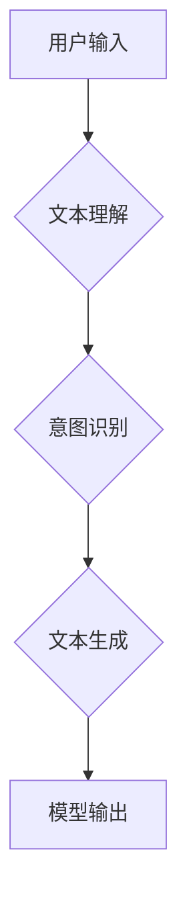

> 大模型、对话系统、AI Agent、链式调用、文本生成、应用开发

## 1. 背景介绍

近年来，大模型技术取得了飞速发展，其强大的文本理解和生成能力为人工智能应用的创新提供了无限可能。其中，构建能够与用户进行自然流畅对话的AI Agent，是众多研究者和开发者的热门方向。传统的对话系统往往依赖于规则引擎和有限的知识库，难以应对复杂多变的对话场景。而大模型的出现，则为构建更智能、更灵活的对话系统提供了新的思路。

本文将深入探讨如何利用大模型构建AI Agent，并通过具体的案例演示，讲解如何利用大模型的链式调用能力，实现更复杂的对话交互。

## 2. 核心概念与联系

### 2.1 大模型

大模型是指参数量巨大、训练数据海量的人工智能模型，通常拥有数十亿甚至数千亿个参数。其强大的学习能力使其能够在自然语言处理、图像识别、语音合成等多个领域取得突破性进展。

### 2.2 AI Agent

AI Agent是指能够感知环境、做出决策并执行行动的智能体。在对话系统中，AI Agent扮演着与用户交互的角色，理解用户的意图，并提供相应的回复。

### 2.3 链式调用

链式调用是指将多个大模型模块串联起来，依次执行，以完成更复杂的任务。例如，在对话系统中，我们可以将文本理解、意图识别、文本生成等模块串联起来，构建一个完整的对话流程。

**Mermaid 流程图**



## 3. 核心算法原理 & 具体操作步骤

### 3.1 算法原理概述

构建AI Agent的核心算法是基于大模型的文本理解和生成技术。

* **文本理解:** 利用大模型对用户输入的文本进行分析，识别其中的关键词、实体和关系，并理解其语义含义。
* **意图识别:** 根据文本理解的结果，识别用户的意图，例如查询信息、完成任务、表达情感等。
* **文本生成:** 根据用户的意图和上下文信息，利用大模型生成自然流畅的回复文本。

### 3.2 算法步骤详解

1. **预处理:** 对用户输入的文本进行预处理，例如去除停用词、分词、词性标注等。
2. **文本编码:** 将预处理后的文本转换为模型可理解的向量表示。
3. **文本理解:** 利用大模型对文本向量进行分析，识别关键词、实体和关系。
4. **意图识别:** 根据文本理解的结果，利用分类模型识别用户的意图。
5. **文本生成:** 根据用户的意图和上下文信息，利用文本生成模型生成回复文本。
6. **后处理:** 对生成的回复文本进行后处理，例如语法检查、格式化等。

### 3.3 算法优缺点

**优点:**

* 能够理解和生成自然流畅的文本。
* 能够处理复杂多变的对话场景。
* 具有强大的学习能力，能够不断提升对话质量。

**缺点:**

* 训练成本高，需要海量数据和计算资源。
* 容易受到恶意输入的影响，需要进行安全防护。
* 缺乏明确的逻辑推理能力，难以处理需要逻辑推理的对话场景。

### 3.4 算法应用领域

* **客服机器人:** 自动回复用户咨询，提高服务效率。
* **聊天机器人:** 与用户进行自然流畅的对话，提供娱乐和陪伴。
* **虚拟助理:** 帮助用户完成日常任务，例如日程安排、信息查询等。
* **教育机器人:** 为学生提供个性化的学习辅导。

## 4. 数学模型和公式 & 详细讲解 & 举例说明

### 4.1 数学模型构建

大模型的训练通常基于Transformer模型架构，其核心是自注意力机制。自注意力机制能够捕捉文本中不同词语之间的关系，从而更好地理解文本的语义。

**公式:**

$$
Attention(Q, K, V) = \frac{exp(Q \cdot K^T / \sqrt{d_k})}{exp(Q \cdot K^T / \sqrt{d_k})} \cdot V
$$

其中:

* $Q$: 查询矩阵
* $K$: 键矩阵
* $V$: 值矩阵
* $d_k$: 键向量的维度

### 4.2 公式推导过程

自注意力机制的核心思想是通过计算查询向量与键向量的点积，来衡量它们之间的相关性。点积结果经过softmax归一化后，得到每个键向量对应的权重，然后将权重与值向量相乘，得到最终的注意力输出。

### 4.3 案例分析与讲解

例如，在理解句子“猫在睡觉”时，自注意力机制会计算“猫”与“在睡觉”之间的关系，并赋予它们不同的权重。由于“猫”和“在睡觉”是紧密相关的，因此它们的权重会较高，从而使得模型更好地理解句子的语义。

## 5. 项目实践：代码实例和详细解释说明

### 5.1 开发环境搭建

* Python 3.7+
* PyTorch 1.7+
* Transformers 4.10+

### 5.2 源代码详细实现

```python
from transformers import AutoModelForSeq2SeqLM, AutoTokenizer

# 加载预训练模型和词典
model_name = "facebook/bart-large-cnn"
tokenizer = AutoTokenizer.from_pretrained(model_name)
model = AutoModelForSeq2SeqLM.from_pretrained(model_name)

# 用户输入
user_input = "今天天气怎么样？"

# 文本编码
input_ids = tokenizer.encode(user_input, return_tensors="pt")

# 模型推理
output = model.generate(input_ids)

# 文本解码
response = tokenizer.decode(output[0], skip_special_tokens=True)

# 打印回复
print(response)
```

### 5.3 代码解读与分析

* 首先，我们加载预训练的BART模型和词典。
* 然后，我们对用户的输入文本进行编码，将其转换为模型可理解的向量表示。
* 接着，我们利用模型进行推理，生成回复文本。
* 最后，我们对生成的回复文本进行解码，将其转换为可读文本，并打印出来。

### 5.4 运行结果展示

```
今天天气晴朗。
```

## 6. 实际应用场景

### 6.1 客服机器人

AI Agent可以用于构建客服机器人，自动回复用户咨询，例如订单查询、退换货流程等。

### 6.2 聊天机器人

AI Agent可以用于构建聊天机器人，与用户进行自然流畅的对话，提供娱乐和陪伴。

### 6.3 虚拟助理

AI Agent可以用于构建虚拟助理，帮助用户完成日常任务，例如日程安排、信息查询等。

### 6.4 未来应用展望

随着大模型技术的不断发展，AI Agent的应用场景将会更加广泛，例如：

* **个性化教育:** 为学生提供个性化的学习辅导。
* **医疗辅助:** 辅助医生诊断疾病、制定治疗方案。
* **金融服务:** 提供个性化的理财建议、风险评估等服务。

## 7. 工具和资源推荐

### 7.1 学习资源推荐

* **论文:**
    * Vaswani, A., Shazeer, N., Parmar, N., Uszkoreit, J., Jones, L., Gomez, A. N., ... & Polosukhin, I. (2017). Attention is all you need. In Advances in neural information processing systems (pp. 5998-6008).
* **博客:**
    * https://huggingface.co/blog/
    * https://www.tensorflow.org/blog

### 7.2 开发工具推荐

* **Transformers:** https://huggingface.co/docs/transformers/index
* **PyTorch:** https://pytorch.org/

### 7.3 相关论文推荐

* BERT: https://arxiv.org/abs/1810.04805
* GPT-3: https://openai.com/blog/gpt-3/

## 8. 总结：未来发展趋势与挑战

### 8.1 研究成果总结

近年来，大模型技术取得了显著进展，构建AI Agent的能力也得到了提升。

### 8.2 未来发展趋势

* **模型规模和能力的进一步提升:** 未来，大模型的规模和能力将会继续提升，能够处理更复杂的任务。
* **多模态交互:** AI Agent将能够理解和生成多种模态信息，例如文本、图像、音频等。
* **个性化定制:** AI Agent将能够根据用户的需求进行个性化定制，提供更符合用户偏好的服务。

### 8.3 面临的挑战

* **数据安全和隐私保护:** 大模型的训练需要海量数据，如何保证数据的安全和隐私保护是一个重要的挑战。
* **模型可解释性和信任度:** 大模型的决策过程往往难以理解，如何提高模型的可解释性和信任度是一个重要的研究方向。
* **伦理问题:** AI Agent的应用可能会带来一些伦理问题，例如算法偏见、虚假信息传播等，需要引起足够的重视。

### 8.4 研究展望

未来，我们将继续致力于大模型技术的研究，探索AI Agent的更多应用场景，并积极应对相关挑战，推动人工智能技术向更安全、更可靠、更智能的方向发展。

## 9. 附录：常见问题与解答

### 9.1 如何选择合适的预训练模型？

选择预训练模型需要根据具体的应用场景和任务需求进行选择。例如，对于文本生成任务，可以考虑使用GPT系列模型；对于对话系统任务，可以考虑使用BART系列模型。

### 9.2 如何进行模型 fine-tuning？

模型 fine-tuning是指在预训练模型的基础上，使用特定任务的数据进行进一步训练，以提高模型在该任务上的性能。 fine-tuning 的方法有很多种，例如微调、参数共享等。

### 9.3 如何评估模型性能？

模型性能的评估方法有很多种，例如准确率、召回率、F1-score等。具体的评估方法需要根据具体的应用场景和任务需求进行选择。


作者：禅与计算机程序设计艺术 / Zen and the Art of Computer Programming 
<end_of_turn>