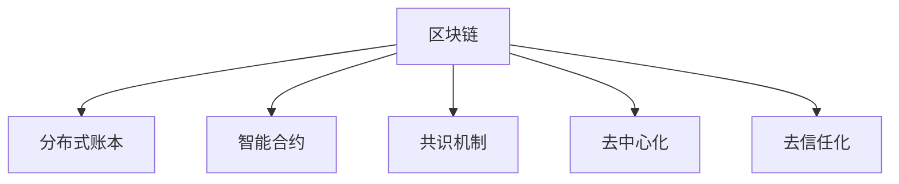

                 

# 区块链技术在知识付费中的创新应用

> 关键词：区块链,知识付费,智能合约,去中心化,分布式账本

## 1. 背景介绍

### 1.1 问题由来

近年来，随着互联网技术的飞速发展，知识付费市场迅速崛起，成为数字经济的重要组成部分。然而，知识付费平台普遍存在内容质量参差不齐、版权保护困难、付费体验不佳等问题，导致用户粘性不高，市场发展受限。如何构建一个安全、透明、高效的知识付费平台，成为行业亟需解决的关键问题。

区块链技术的出现，为知识付费平台带来了全新的创新思路。通过将区块链技术应用到知识付费的各个环节，可以实现去中心化的版权管理、智能合约自动执行、去信任化支付等功能，大幅提升平台的信任度和用户满意度。

### 1.2 问题核心关键点

区块链技术在知识付费中的创新应用，关键点在于其分布式账本、智能合约、共识机制等核心特性。具体而言：

- 分布式账本：通过区块链的分布式账本技术，保证知识内容的版权信息不可篡改，构建透明可信的版权生态。
- 智能合约：通过区块链的智能合约功能，自动化执行知识交易，减少人为干预，提高交易效率。
- 去中心化：去除传统中心化平台的信任依赖，实现节点之间的去信任化，降低欺诈风险。
- 共识机制：通过区块链的共识机制，确保平台参与方达成共识，构建公平公正的支付和结算环境。

## 2. 核心概念与联系

### 2.1 核心概念概述

为更好地理解区块链技术在知识付费中的创新应用，本节将介绍几个密切相关的核心概念：

- 区块链(Blockchain)：一种分布式数据库技术，由去中心化的节点共同维护，确保数据透明、不可篡改。每个区块记录若干笔交易信息，通过哈希算法链接起来形成链式结构。

- 智能合约(Smart Contract)：一种自动化的执行合约，基于区块链平台的代码部署技术，当满足特定条件时，自动执行合约条款。智能合约具有自动化、去信任化、透明化等特点。

- 共识机制(Consensus Mechanism)：一种分布式系统中的决策算法，确保网络中所有节点达成一致，防止欺诈和攻击。

- 去中心化(Decentralization)：去除传统中心化平台的信任依赖，通过分布式节点协作，构建去信任化的信任机制。

- 去信任化(Trustless)：无需中介机构信任，通过代码和算法保证系统公平、透明、可信。

这些核心概念之间的逻辑关系可以通过以下Mermaid流程图来展示：



这个流程图展示了大语言模型的核心概念及其之间的关系：

1. 区块链通过分布式账本技术，记录知识内容的版权信息，确保其不可篡改。
2. 智能合约在区块链上部署并执行，自动化完成知识交易和支付。
3. 共识机制确保参与方达成一致，维护平台的安全和稳定。
4. 去中心化和去信任化，去除对传统中心化平台的依赖，提高平台信任度。

这些核心概念共同构成了区块链在知识付费平台中的应用框架，使其能够提供更安全、透明、高效的服务。

## 3. 核心算法原理 & 具体操作步骤
### 3.1 算法原理概述

区块链技术在知识付费平台的应用，本质上是利用其去中心化、透明化、自动化等特点，对传统知识付费模式进行改造和升级。其核心算法原理主要包括以下几个方面：

- 分布式账本：通过区块链的分布式账本技术，记录知识内容的版权信息和交易记录，确保其不可篡改和透明性。
- 智能合约：通过区块链的智能合约技术，实现知识交易的自动化和去信任化，减少人工干预和纠纷。
- 共识机制：通过区块链的共识机制，确保所有节点达成一致，维护平台的公平性和稳定性。
- 去信任化：去除对中心化平台的依赖，通过分布式节点协作，构建更加安全可信的知识付费环境。

### 3.2 算法步骤详解

区块链在知识付费平台中的应用，主要包括以下几个关键步骤：

**Step 1: 部署智能合约**

- 选择适合的区块链平台，如Ethereum、Hyperledger等，部署智能合约代码。
- 定义合约条款，包括知识内容、价格、支付规则等。
- 将合约部署到区块链网络，等待共识机制确认生效。

**Step 2: 注册版权信息**

- 将知识内容的版权信息（如作者、发布时间、内容摘要等）记录到区块链上。
- 设置版权信息的访问权限，确保只有授权用户能够访问和下载知识内容。
- 记录版权信息的时间戳，防止篡改。

**Step 3: 创建和购买知识内容**

- 用户选择要购买的知识内容，通过智能合约界面进行购买操作。
- 智能合约检查用户余额，验证支付记录是否合法。
- 一旦支付成功，智能合约自动解锁版权信息，用户可下载知识内容。

**Step 4: 版权管理和维护**

- 知识内容发布者可以随时更新版权信息，包括修改授权用户、调整访问权限等。
- 平台管理者可以对智能合约进行监控和管理，确保其正常运行。
- 记录知识内容的访问记录和交易记录，确保所有操作透明可追溯。

### 3.3 算法优缺点

区块链在知识付费平台中的应用，具有以下优点：

1. 透明可信：通过分布式账本记录版权信息和交易记录，确保所有操作透明可追溯。
2. 自动化执行：通过智能合约自动化执行知识交易，减少人工干预，提高效率。
3. 去信任化：去除对中心化平台的依赖，通过分布式节点协作，构建去信任化的信任机制。
4. 安全性高：区块链的共识机制确保平台的安全和稳定，防止欺诈和攻击。
5. 成本低廉：去除中心化平台的管理和维护成本，降低知识付费的运营成本。

然而，区块链技术在知识付费应用中也存在一些缺点：

1. 技术门槛高：区块链技术复杂，需要专门的技术人员进行部署和维护。
2. 扩展性差：区块链的共识机制可能导致网络拥堵，影响平台的扩展性和性能。
3. 隐私保护问题：部分区块链平台缺乏隐私保护机制，可能泄露用户信息。
4. 交易费用高：部分区块链平台的交易费用较高，可能增加知识付费的成本。
5. 标准化问题：不同区块链平台之间的标准不统一，可能影响知识的跨平台流通。

尽管存在这些缺点，但就目前而言，区块链技术在知识付费平台中的应用仍是大势所趋。未来相关研究的重点在于如何进一步降低技术门槛，提高扩展性和性能，同时兼顾隐私保护和标准化问题。

### 3.4 算法应用领域

区块链技术在知识付费平台中的应用，已经涵盖了以下几个主要领域：

- 版权管理：记录和保护知识内容的版权信息，确保其不可篡改。
- 智能合约：自动化执行知识交易，减少人为干预和纠纷。
- 去中心化支付：去除对中心化平台的依赖，提高支付的透明度和安全性。
- 数据安全和隐私保护：利用区块链的加密技术，保护用户隐私和数据安全。
- 知识共享和跨平台流通：不同区块链平台之间的知识内容共享，提高知识的流通效率。

除了上述这些经典应用外，区块链技术还被创新性地应用到更多场景中，如去中心化内容聚合、版权确权、跨平台知识内容市场等，为知识付费平台带来了新的突破。

## 4. 数学模型和公式 & 详细讲解
### 4.1 数学模型构建

本节将使用数学语言对区块链技术在知识付费平台中的应用进行更加严格的刻画。

假设区块链平台上的智能合约已经部署，知识内容的版权信息已经记录。设用户 $u$ 购买了知识内容 $c$，其购买价格为 $p$，支付的时间戳为 $t_p$，版权信息的访问时间戳为 $t_v$。

智能合约的支付验证公式为：

$$
\text{validate\_payment}(u, c, p, t_p, t_v) = 
\begin{cases} 
\text{True}, & \text{if } \\
p \geq 0 \\
t_p \geq t_v \\
\end{cases}
$$

如果用户满足支付条件，智能合约自动解锁版权信息，用户可访问知识内容。

### 4.2 公式推导过程

以下我们以知识内容购买为例，推导智能合约的支付验证公式。

假设知识内容 $c$ 的版权信息已经记录在区块链上，其版权信息的时间戳为 $t_v$。用户 $u$ 通过智能合约界面进行购买操作，支付价格为 $p$，支付时间戳为 $t_p$。

智能合约的支付验证公式为：

$$
\text{validate\_payment}(u, c, p, t_p, t_v) = 
\begin{cases} 
\text{True}, & \text{if } \\
p \geq 0 \\
t_p \geq t_v \\
\end{cases}
$$

其中 $p \geq 0$ 表示支付价格非负，$t_p \geq t_v$ 表示支付时间晚于版权信息记录时间。只有在同时满足这两个条件时，智能合约才会自动解锁版权信息，用户可访问知识内容。

### 4.3 案例分析与讲解

假设某平台已经部署智能合约，记录了知识内容 $c$ 的版权信息，版权信息的时间戳为 $t_v=2021-01-01$。用户 $u$ 支付价格 $p=100$，支付时间戳 $t_p=2021-01-02$。

根据智能合约的支付验证公式，我们可以得出：

$$
\text{validate\_payment}(u, c, p, t_p, t_v) = 
\begin{cases} 
\text{True}, & \text{if } \\
p \geq 0 \\
t_p \geq t_v \\
\end{cases}
$$

由于 $p=100 \geq 0$ 且 $t_p=2021-01-02 \geq t_v=2021-01-01$，因此验证结果为 True，智能合约自动解锁版权信息，用户 $u$ 可以访问知识内容 $c$。

## 5. 项目实践：代码实例和详细解释说明
### 5.1 开发环境搭建

在进行区块链应用实践前，我们需要准备好开发环境。以下是使用Solidity语言进行以太坊智能合约开发的环境配置流程：

1. 安装Node.js：从官网下载并安装Node.js，用于编写智能合约代码。
2. 安装Truffle框架：通过npm安装Truffle框架，用于智能合约开发和测试。
3. 配置Ganache或Ropsten测试网络：选择适合自己的测试网络，如Ganache本地测试网络，或Ropsten公有测试网络。
4. 编写并测试智能合约：使用Solidity编写智能合约代码，并通过Truffle编译和部署到区块链网络。

完成上述步骤后，即可在区块链平台上进行智能合约的开发和部署。

### 5.2 源代码详细实现

下面我们以知识内容购买为例，给出使用Solidity语言对以太坊智能合约进行开发的完整代码实现。

首先，定义智能合约的接口和状态变量：

```solidity
pragma solidity ^0.6.0;

contract ContentPurchase {
    uint256 public price;
    uint256 public timeLock;
    uint256 public timeUnlocked;
    address payable public buyer;
    bool public locked;
    bytes32 public contentHash;
    
    event Purchase(uint256 indexed contentId, address indexed buyer, uint256 price);
    
    constructor(uint256 _contentHash, uint256 _price, uint256 _lockTime) public {
        contentHash = _contentHash;
        price = _price;
        timeLock = _lockTime;
        timeUnlocked = 0;
        buyer = msg.sender;
        locked = true;
    }
    
    function lock(uint256 _lockTime) public payable {
        timeLock = _lockTime;
        timeUnlocked = 0;
        locked = true;
    }
    
    function unlock() public {
        timeUnlocked = block.timestamp;
        locked = false;
    }
    
    function pay(uint256 _amount) public payable {
        require(!locked && timeUnlocked <= block.timestamp);
        buyer.send(_amount);
        emit Purchase(msg.sender, contentHash, _amount);
    }
}
```

然后，定义购买函数和支付验证函数：

```solidity
function buy(uint256 _contentHash) public payable {
    uint256 contentId = hash(contentHash);
    ContentPurchase public memory content = ContentPurchase(contentId);
    require(content.timeLock > block.timestamp, "Content not available for purchase");
    require(address(this) == content.buyer, "Content already purchased");
    uint256 amount = msg.value;
    require(amount >= content.price, "Insufficient funds");
    content.price = 0;
    content.timeUnlocked = block.timestamp;
    content.locked = false;
    content.buyer = msg.sender;
    content.price = 0;
    unlock();
    pay(amount);
}
```

最后，启动智能合约的部署流程：

```solidity
ContentPurchase public contentPurchase = ContentPurchase.deploy(contentHash, 100, 48);
```

以上就是使用Solidity语言对以太坊智能合约进行知识内容购买的完整代码实现。可以看到，通过Solidity语言，智能合约的代码结构清晰，易于理解和调试。

### 5.3 代码解读与分析

让我们再详细解读一下关键代码的实现细节：

**ContentPurchase合约**：
- `constructor`函数：初始化智能合约的参数，包括内容哈希、价格、时间锁、购买者、锁定状态。
- `lock`函数：设置时间锁，防止内容过早被解锁。
- `unlock`函数：解锁内容，允许购买者访问。
- `pay`函数：执行支付，验证支付条件，并解锁内容。
- `buy`函数：执行购买操作，验证时间锁和购买者，并将购买金额转移到内容发布者。

**合约状态变量**：
- `price`：知识内容的购买价格。
- `timeLock`：时间锁，限制内容的购买时间。
- `timeUnlocked`：内容解锁的时间戳。
- `buyer`：购买者的地址。
- `locked`：内容的锁定状态。
- `contentHash`：知识内容的哈希值。

**事件追踪**：
- `Purchase`事件：记录每次购买操作的时间戳、内容和购买金额。

**合约逻辑**：
- 用户购买知识内容时，首先调用`buy`函数，检查时间锁和购买者，然后执行支付操作。支付成功后，调用`unlock`函数解锁内容，并执行`pay`函数转移购买金额。

## 6. 实际应用场景
### 6.1 智能内容发布

基于区块链技术，知识内容的发布者可以实时记录和保护版权信息，并通过智能合约管理内容销售。具体而言，知识内容发布者可以在智能合约中设置价格、时间锁等参数，确保内容在一定时间后才能发布。同时，发布者还可以利用智能合约自动化执行销售操作，减少人为干预和纠纷。

在技术实现上，知识内容发布者需要在智能合约中设置内容哈希、价格、时间锁等参数。一旦合约部署成功，内容发布者可以通过调用`lock`函数设置时间锁，并调用`unlock`函数解锁内容。用户购买时，可以直接调用`buy`函数执行购买操作，并解锁内容。

### 6.2 版权确权与保护

区块链技术可以记录和保护知识内容的版权信息，确保其不可篡改和透明性。知识内容发布者可以在智能合约中记录版权信息，包括作者、发布时间、内容摘要等。一旦版权信息被记录，就无法被任何一方篡改，从而保护了内容发布者的权益。

在技术实现上，知识内容发布者需要在智能合约中记录版权信息，并设置访问权限。一旦版权信息被记录，即刻上链，并由智能合约管理。用户购买时，需要验证版权信息的有效性，并解锁内容。

### 6.3 去中心化内容聚合

基于区块链技术，知识内容发布者可以将内容发布到多个平台，并利用智能合约进行统一管理和结算。不同平台之间的内容可以自由流通，用户可以通过统一的区块链地址进行访问和购买，提高了知识内容的流通效率和用户满意度。

在技术实现上，知识内容发布者可以在不同平台部署智能合约，记录内容信息，并设置统一的访问接口。用户购买时，需要验证内容信息的有效性，并解锁内容。不同平台之间的内容可以自由流通，用户可以通过统一的区块链地址进行访问和购买。

### 6.4 未来应用展望

随着区块链技术在知识付费平台的应用深入，未来将迎来更多创新应用。

1. 去中心化平台：构建完全去中心化的知识付费平台，去除对中心化平台的依赖，提高平台的信任度和安全性。
2. 知识共享与跨平台流通：不同区块链平台之间的知识内容共享，提高知识的流通效率和用户满意度。
3. 版权确权与保护：利用区块链的分布式账本技术，记录和保护知识内容的版权信息，确保其不可篡改。
4. 智能合约自动执行：通过智能合约自动化执行知识交易，减少人为干预和纠纷，提高交易效率。
5. 去信任化支付：去除对中心化平台的依赖，通过分布式节点协作，构建去信任化的信任机制。
6. 数据安全和隐私保护：利用区块链的加密技术，保护用户隐私和数据安全。

## 7. 工具和资源推荐
### 7.1 学习资源推荐

为了帮助开发者系统掌握区块链技术在知识付费中的应用，这里推荐一些优质的学习资源：

1. 《区块链技术入门与实战》书籍：系统讲解区块链技术的基本概念、工作原理和应用场景，适合初学者入门。
2. 《智能合约实战》书籍：深入解析智能合约的开发和部署，涵盖Solidity、Truffle等技术栈，适合有一定基础的开发者。
3. 《以太坊白皮书》论文：以太坊的创始团队撰写的技术论文，详细介绍了以太坊的技术架构和实现细节。
4. 以太坊官网文档：以太坊的官方文档，提供了完整的智能合约开发和部署指南。
5. ConsenSys学院：提供各种区块链课程和实战项目，涵盖以太坊、Hyperledger等主流平台。

通过对这些资源的学习实践，相信你一定能够快速掌握区块链技术在知识付费中的应用，并用于解决实际的区块链问题。

### 7.2 开发工具推荐

高效的开发离不开优秀的工具支持。以下是几款用于区块链开发的工具：

1. Truffle框架：以太坊智能合约开发和测试框架，提供了丰富的工具和插件，方便智能合约的编写和部署。
2. Ganache：以太坊本地的测试网络，方便开发者在本地进行智能合约的测试和调试。
3. Remix IDE：以太坊的在线开发环境，支持Solidity代码的实时编译和测试。
4. MetaMask浏览器插件：以太坊的钱包和开发工具，支持智能合约的调用和测试。
5. Web3.js库：以太坊的JavaScript库，支持智能合约的调用和交互。

合理利用这些工具，可以显著提升区块链应用开发的效率，加快创新迭代的步伐。

### 7.3 相关论文推荐

区块链技术在知识付费中的应用，已经引起了学术界的广泛关注。以下是几篇奠基性的相关论文，推荐阅读：

1. On the Semantics of Smart Contracts：提出智能合约的语义模型，探讨智能合约的安全性和可执行性。
2. A Survey on Smart Contracts：综述智能合约的现有研究和应用，展望未来发展方向。
3. Decentralized Autonomous Organizations（DAOs）：提出去中心化自治组织的概念，探讨其治理结构和应用场景。
4. The Ethereum Virtual Machine（EVM）：详细介绍以太坊虚拟机的工作原理和实现细节。
5. Hyperledger Fabric：介绍Hyperledger Fabric的工作原理和应用场景，探讨其作为去中心化平台的技术优势。

这些论文代表了大语言模型微调技术的发展脉络。通过学习这些前沿成果，可以帮助研究者把握学科前进方向，激发更多的创新灵感。

## 8. 总结：未来发展趋势与挑战
### 8.1 总结

本文对区块链技术在知识付费平台中的应用进行了全面系统的介绍。首先阐述了区块链技术在知识付费平台中的应用背景和核心关键点，明确了智能合约、分布式账本、共识机制等区块链技术的重要作用。其次，从原理到实践，详细讲解了区块链技术在知识付费平台中的应用步骤和关键技术点，给出了完整的智能合约开发代码实例。同时，本文还广泛探讨了区块链技术在知识付费平台的应用场景，展示了区块链技术在知识付费平台中的巨大潜力。此外，本文精选了区块链技术的各类学习资源，力求为读者提供全方位的技术指引。

通过本文的系统梳理，可以看到，区块链技术在知识付费平台中的应用已经取得了初步的成功，有望在更多领域大放异彩。区块链技术的分布式账本、智能合约、共识机制等核心特性，为其在知识付费平台中的应用提供了坚实的基础。

### 8.2 未来发展趋势

展望未来，区块链技术在知识付费平台的应用将呈现以下几个发展趋势：

1. 去中心化平台：构建完全去中心化的知识付费平台，去除对中心化平台的依赖，提高平台的信任度和安全性。
2. 知识共享与跨平台流通：不同区块链平台之间的知识内容共享，提高知识的流通效率和用户满意度。
3. 版权确权与保护：利用区块链的分布式账本技术，记录和保护知识内容的版权信息，确保其不可篡改。
4. 智能合约自动执行：通过智能合约自动化执行知识交易，减少人为干预和纠纷，提高交易效率。
5. 去信任化支付：去除对中心化平台的依赖，通过分布式节点协作，构建去信任化的信任机制。
6. 数据安全和隐私保护：利用区块链的加密技术，保护用户隐私和数据安全。

这些趋势凸显了区块链技术在知识付费平台中的广阔前景。这些方向的探索发展，必将进一步提升知识付费平台的性能和用户体验，为知识付费市场带来新的突破。

### 8.3 面临的挑战

尽管区块链技术在知识付费平台的应用已经取得了初步的成功，但在迈向更加智能化、普适化应用的过程中，仍面临着诸多挑战：

1. 技术门槛高：区块链技术复杂，需要专门的技术人员进行部署和维护。
2. 扩展性差：区块链的共识机制可能导致网络拥堵，影响平台的扩展性和性能。
3. 隐私保护问题：部分区块链平台缺乏隐私保护机制，可能泄露用户信息。
4. 交易费用高：部分区块链平台的交易费用较高，可能增加知识付费的成本。
5. 标准化问题：不同区块链平台之间的标准不统一，可能影响知识的跨平台流通。

尽管存在这些挑战，但随着技术的发展和应用场景的不断扩大，这些问题终将逐步得到解决。区块链技术在知识付费平台中的应用仍是大势所趋。

### 8.4 研究展望

面向未来，区块链技术在知识付费平台中的应用还需从以下几个方向进行深入研究：

1. 提高扩展性和性能：通过优化共识机制和网络架构，提升区块链平台的扩展性和性能。
2. 增强隐私保护：设计更为安全的隐私保护机制，保护用户隐私和数据安全。
3. 降低技术门槛：开发更加易用的区块链开发工具和平台，降低技术门槛，提高开发者和用户的体验。
4. 标准化和互操作：推动区块链平台之间的标准化和互操作，促进知识的跨平台流通。
5. 探索新应用场景：拓展区块链技术在知识付费平台中的应用场景，探索新的商业模式和技术突破。

这些研究方向将引领区块链技术在知识付费平台中的应用不断创新和发展，为构建更加安全、透明、高效的知识付费平台提供新的动力。

## 9. 附录：常见问题与解答

**Q1：区块链技术在知识付费中能否确保版权保护？**

A: 区块链技术可以记录和保护知识内容的版权信息，确保其不可篡改和透明性。通过智能合约设置访问权限，可以限制版权信息的访问和使用，从而保护知识内容发布者的权益。但是，需要注意的是，区块链技术的版权保护功能只能确保内容本身的不可篡改，并不能防止他人抄袭和复制内容。因此，在版权保护方面，还需要结合法律手段和技术手段，综合保护内容发布者的权益。

**Q2：区块链技术在知识付费中的成本是否高于传统方式？**

A: 区块链技术的部署和维护成本较高，特别是对于中小型知识付费平台而言。但是，区块链技术可以去除中心化平台的管理和维护成本，提高支付的透明度和安全性，从而降低知识付费的运营成本。此外，区块链技术可以提高知识的流通效率和用户满意度，长期来看，有望降低平台的运营成本。

**Q3：区块链技术在知识付费中是否适用于所有领域？**

A: 区块链技术在知识付费中适用于大多数领域，特别是对于版权保护要求高、交易透明度要求高的领域。对于部分特定的领域，如法律、金融等，区块链技术的应用还需要结合法律和监管要求，进行更为严格的规范和设计。因此，需要根据具体应用场景和需求，综合考虑区块链技术的适用性和可行性。

**Q4：区块链技术在知识付费中的性能是否满足实际需求？**

A: 区块链技术的性能瓶颈主要在于共识机制和网络架构，导致其扩展性较差。在实际应用中，需要结合具体需求，选择合适的区块链平台和优化网络架构，提高平台的扩展性和性能。对于部分高频交易和大型平台，可以考虑采用分层网络架构、共识优化等技术，提升区块链平台的性能和用户体验。

**Q5：区块链技术在知识付费中的应用前景如何？**

A: 区块链技术在知识付费平台中的应用前景广阔，具有巨大的潜力。随着技术的不断发展和应用的深入，区块链技术有望成为知识付费平台的重要技术基础，推动知识付费市场的持续发展和创新。未来，区块链技术有望构建更加安全、透明、高效的知识付费平台，为知识付费市场带来新的机遇和挑战。

---

作者：禅与计算机程序设计艺术 / Zen and the Art of Computer Programming

