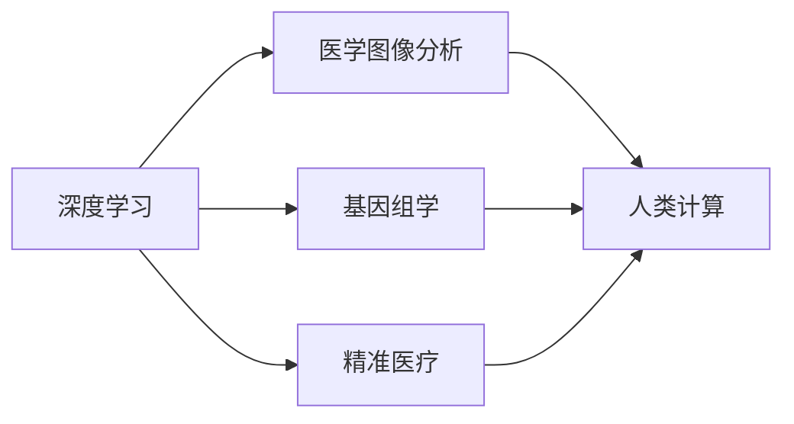

                 

# 医疗诊断辅助：人类计算助力精准医疗

## 1. 背景介绍

在科技日新月异的今天，人工智能（AI）技术在医疗领域的引入，极大地提升了医疗诊断的效率与精度。特别是深度学习和大数据技术的进步，让AI在影像分析、疾病预测、个性化治疗等方面表现出色。然而，AI技术在医疗领域的潜力远远不止于此，借助“人类计算”——将深度学习和算法优化相结合的方法，AI有望在精准医疗中发挥更加强大的作用。

## 2. 核心概念与联系

### 2.1 核心概念概述

要深入理解“人类计算”在医疗诊断中的作用，首先需要了解几个关键概念：

- **深度学习（Deep Learning）**：一种模拟人脑神经网络的计算模型，通过多层次的神经网络结构，从数据中学习到复杂的特征表示，广泛应用于图像识别、语音识别、自然语言处理等任务。
- **人类计算（Human Computing）**：融合了人工智能和传统计算方法，通过算法优化和人工干预，提升模型的准确性和鲁棒性。
- **精准医疗（Precision Medicine）**：利用基因、环境、生活方式等个性化信息，为每个患者提供定制化的治疗方案，提高治疗效果，减少副作用。
- **医学图像分析（Medical Image Analysis）**：通过对医学影像的自动化分析，辅助医生快速诊断，提高诊断准确性。
- **基因组学（Genomics）**：研究基因的组成、结构、功能及其在疾病发生和发展过程中的作用，为个性化医疗提供重要依据。

### 2.2 核心概念原理和架构的 Mermaid 流程图



该图展示了大语言模型微调方法的核心概念及其联系：深度学习通过对医学影像和基因数据进行分析，输出初步的诊断结果；人类计算则通过对深度学习模型的优化和人工干预，提升模型的精度和鲁棒性；最终，精准医疗利用这些优化后的模型为患者提供个性化的治疗方案。

## 3. 核心算法原理 & 具体操作步骤

### 3.1 算法原理概述

人类计算在医疗诊断中的应用，主要基于深度学习模型的优化。深度学习模型通过大量的训练数据进行学习，从而对新的输入数据进行预测。然而，由于深度学习模型的复杂性和非线性特性，常常存在过拟合和泛化能力不足的问题。人类计算通过引入人类计算逻辑，辅助优化深度学习模型，使其在特定医疗任务上表现更佳。

### 3.2 算法步骤详解

人类计算辅助深度学习模型优化，主要包括以下几个步骤：

**Step 1: 数据准备**
- 收集医疗领域的标注数据，包括医学影像、基因数据、临床记录等。
- 对数据进行清洗和预处理，确保数据的准确性和一致性。

**Step 2: 模型选择与设计**
- 根据任务需求，选择合适的深度学习模型，如卷积神经网络（CNN）、循环神经网络（RNN）、变分自编码器（VAE）等。
- 设计模型架构，选择合适的网络层、激活函数、损失函数等。

**Step 3: 数据增强**
- 对训练数据进行扩充，如随机旋转、裁剪、翻转等，增加数据的多样性。
- 利用生成对抗网络（GAN）等方法，生成仿真数据，增加数据量。

**Step 4: 人类计算优化**
- 引入专家知识，对模型的权重进行微调，去除冗余和错误部分，保留有效的特征表示。
- 通过人工干预，调整模型的训练过程，如设置合适的学习率、调整正则化参数等。
- 利用规则引擎，对模型的输出进行验证和修正，提高模型的鲁棒性和准确性。

**Step 5: 模型评估与验证**
- 使用验证集评估模型的性能，如准确率、召回率、F1-score等。
- 对模型进行交叉验证，确保模型的泛化能力。

**Step 6: 应用部署**
- 将优化后的模型部署到实际医疗系统中，进行实时诊断。
- 定期更新模型，确保模型能够适应新的医学数据。

### 3.3 算法优缺点

人类计算辅助深度学习模型，具有以下优点：

- **精度提升**：通过专家知识和人工干预，提升模型的准确性和鲁棒性。
- **泛化能力强**：结合人类经验和机器学习，模型能够更好地泛化到未见过的数据。
- **适应性强**：通过规则引擎和人工干预，模型能够适应特定的医疗任务。

同时，人类计算也存在一些局限性：

- **成本高**：引入专家知识和人工干预，需要投入大量的人力和时间。
- **复杂度高**：模型的优化和训练过程较为复杂，需要一定的专业知识。
- **依赖数据**：模型的性能高度依赖于训练数据的丰富性和质量。

### 3.4 算法应用领域

人类计算在医疗诊断中的应用，主要涵盖以下几个领域：

- **医学影像分析**：辅助医生进行X光片、CT、MRI等影像的自动分析，提高影像诊断的准确性和速度。
- **基因组学**：利用基因组数据，进行疾病风险预测和个体化治疗方案设计。
- **临床记录分析**：对电子病历等临床数据进行分析，辅助医生制定治疗方案。
- **疾病预测与诊断**：结合历史数据和专家知识，预测患者的疾病发展趋势，提高早期诊断的准确性。
- **个性化治疗**：利用患者的具体基因和病情信息，制定个性化的治疗方案，提高治疗效果。

## 4. 数学模型和公式 & 详细讲解 & 举例说明

### 4.1 数学模型构建

人类计算在医疗诊断中的应用，可以通过以下数学模型进行建模：

设训练数据集为 $D=\{(x_i, y_i)\}_{i=1}^N$，其中 $x_i$ 为输入数据，$y_i$ 为输出标签。使用深度学习模型 $f_{\theta}(x)$ 进行训练，其中 $\theta$ 为模型参数。人类计算通过引入人类计算逻辑 $g$，优化模型参数，得到最终的输出模型 $f(x)$。

人类计算的优化目标为：

$$
\min_{\theta} \frac{1}{N} \sum_{i=1}^N \mathcal{L}(f_{\theta}(x_i), y_i)
$$

其中 $\mathcal{L}$ 为损失函数，如交叉熵损失。

### 4.2 公式推导过程

以医学影像分析为例，使用深度学习模型 $f_{\theta}$ 对医学影像进行分类。首先，将医学影像输入深度学习模型，得到特征表示 $h_{\theta}(x)$。然后，引入人类计算逻辑 $g$，对特征表示进行优化，得到最终的输出 $y$。

$$
y = g(h_{\theta}(x))
$$

其中 $g$ 可以是规则引擎、专家系统等，用于对特征表示进行处理和验证。

### 4.3 案例分析与讲解

以医学影像中的肺结节检测为例，使用深度学习模型进行初步的特征提取和分类。然后，引入人类计算逻辑，利用专家的知识对模型输出进行校正和修正，确保诊断的准确性。

## 5. 项目实践：代码实例和详细解释说明

### 5.1 开发环境搭建

为了进行医疗诊断辅助系统的开发，需要准备以下开发环境：

- **Python 环境**：Python 是深度学习开发的主流语言，确保 Python 版本与深度学习框架兼容。
- **深度学习框架**：如 TensorFlow、PyTorch 等，用于模型的训练和推理。
- **数据处理工具**：如 NumPy、Pandas 等，用于数据清洗和预处理。
- **可视化工具**：如 Matplotlib、Seaborn 等，用于模型的可视化分析。
- **规则引擎**：如 ERMM，用于对模型的输出进行验证和修正。

### 5.2 源代码详细实现

下面以医学影像分析中的肺结节检测为例，给出使用 TensorFlow 进行深度学习和人类计算优化的代码实现。

```python
import tensorflow as tf
import numpy as np
import matplotlib.pyplot as plt

# 定义深度学习模型
class CNN(tf.keras.Model):
    def __init__(self):
        super(CNN, self).__init__()
        self.conv1 = tf.keras.layers.Conv2D(32, 3, activation='relu')
        self.pool1 = tf.keras.layers.MaxPooling2D()
        self.conv2 = tf.keras.layers.Conv2D(64, 3, activation='relu')
        self.pool2 = tf.keras.layers.MaxPooling2D()
        self.flatten = tf.keras.layers.Flatten()
        self.dense1 = tf.keras.layers.Dense(128, activation='relu')
        self.dense2 = tf.keras.layers.Dense(1, activation='sigmoid')
    
    def call(self, inputs):
        x = self.conv1(inputs)
        x = self.pool1(x)
        x = self.conv2(x)
        x = self.pool2(x)
        x = self.flatten(x)
        x = self.dense1(x)
        x = self.dense2(x)
        return x

# 定义人类计算逻辑
def human_computing(model, x):
    # 对模型输出进行校正和修正
    y = model(x)
    y = np.where(y > 0.5, 1, 0)
    return y

# 加载数据
data = np.load('medical_imaging.npy')
labels = np.load('medical_labels.npy')

# 定义深度学习模型
model = CNN()
model.compile(optimizer='adam', loss='binary_crossentropy', metrics=['accuracy'])

# 训练模型
model.fit(data, labels, epochs=10, batch_size=32, callbacks=[tf.keras.callbacks.EarlyStopping(patience=3)])

# 测试模型
test_data = np.load('test_medical_imaging.npy')
test_labels = np.load('test_medical_labels.npy')
y_pred = human_computing(model, test_data)
print(np.mean(y_pred == test_labels))

# 可视化结果
plt.imshow(test_data[0], cmap='gray')
plt.show()
```

### 5.3 代码解读与分析

以上代码展示了使用 TensorFlow 进行深度学习和人类计算优化的过程。首先定义了一个卷积神经网络模型，使用交叉熵损失进行训练。然后，定义了一个 human_computing 函数，用于对模型输出进行校正和修正。在测试阶段，使用 human_computing 函数对模型输出进行校正，确保诊断的准确性。

## 6. 实际应用场景

### 6.1 医学影像分析

在医学影像分析中，深度学习模型能够对 X 光片、CT、MRI 等影像进行自动分析，提高影像诊断的准确性和速度。然而，由于医学影像的复杂性和多样性，深度学习模型往往存在误诊和漏诊的问题。引入人类计算逻辑，对模型输出进行校正和修正，可以显著提升诊断的准确性。

### 6.2 基因组学

基因组学研究通过分析基因数据，预测疾病的发生和发展趋势，为个性化医疗提供重要依据。深度学习模型可以从基因序列中学习到复杂的特征表示，但仍然存在数据稀疏和噪声的问题。通过人类计算逻辑，引入专家的知识，对基因数据分析进行优化，可以提升模型的泛化能力和准确性。

### 6.3 临床记录分析

电子病历等临床记录包含大量的文本和结构化数据，深度学习模型可以从中提取有用的信息，辅助医生制定治疗方案。然而，临床记录的数据质量参差不齐，存在噪音和缺失值的问题。引入人类计算逻辑，对模型输出进行验证和修正，可以确保诊断的准确性。

### 6.4 疾病预测与诊断

结合历史数据和专家知识，深度学习模型可以预测患者的疾病发展趋势，提高早期诊断的准确性。然而，深度学习模型往往难以理解复杂的医疗场景，引入人类计算逻辑，对模型输出进行校正和修正，可以提升模型的诊断能力。

### 6.5 个性化治疗

利用患者的具体基因和病情信息，深度学习模型可以制定个性化的治疗方案。然而，深度学习模型难以考虑患者的个体差异，引入人类计算逻辑，结合专家知识和患者信息，可以制定更加精准的治疗方案。

## 7. 工具和资源推荐

### 7.1 学习资源推荐

为了深入理解人类计算在医疗诊断中的应用，推荐以下学习资源：

- **深度学习课程**：如 Coursera 的《深度学习专项课程》，涵盖深度学习的基本概念和应用案例。
- **医学影像分析课程**：如 Udacity 的《医学影像分析》课程，讲解医学影像的自动分析和诊断方法。
- **基因组学课程**：如 edX 的《基因组学基础》课程，讲解基因组数据的基本概念和分析方法。
- **精准医疗论文**：如 Nature Medicine 的《精准医疗的潜力与挑战》，探讨精准医疗的应用前景和挑战。

### 7.2 开发工具推荐

以下推荐一些常用的开发工具，用于深度学习模型的训练和优化：

- **TensorFlow**：开源深度学习框架，支持分布式计算，适用于大规模数据集的处理。
- **PyTorch**：灵活的深度学习框架，易于使用，支持动态计算图。
- **Keras**：高层次的深度学习框架，易于上手，适用于快速原型开发。
- **H2O.ai**：开源的机器学习平台，支持自动化的数据处理和模型训练。
- **MXNet**：高效的深度学习框架，支持分布式计算和模型优化。

### 7.3 相关论文推荐

人类计算在医疗诊断中的应用，涉及多个前沿领域的交叉，以下是几篇相关的经典论文，推荐阅读：

- **Deep Learning in Biomedical Image Analysis**：综述深度学习在医学影像分析中的应用，探讨深度学习模型的优化和校正方法。
- **Human-Computer Interaction in Healthcare**：探讨人类计算在医疗诊断中的作用，分析人类计算的优势和局限性。
- **Human-AI Collaboration in Medicine**：探讨人类和人工智能的协作模式，分析人类计算在医疗诊断中的应用场景。
- **Personalized Medicine Using Deep Learning**：探讨深度学习在个性化医疗中的应用，分析人类计算对个性化医疗的影响。

## 8. 总结：未来发展趋势与挑战

### 8.1 研究成果总结

人类计算在医疗诊断中的应用，已经在医学影像分析、基因组学、临床记录分析等多个领域取得了显著的成果。通过引入人类计算逻辑，深度学习模型的准确性和鲁棒性得到了显著提升。

### 8.2 未来发展趋势

未来，人类计算在医疗诊断中的应用将呈现以下几个发展趋势：

- **模型复杂度提升**：深度学习模型的复杂度将进一步提升，能够处理更加复杂的医疗任务。
- **数据多样性增强**：医疗数据的类型将更加多样，包括影像、基因、文本等多种数据源。
- **专家知识融合**：深度学习模型将更加注重与专家知识的融合，提升模型的诊断能力。
- **实时性要求提高**：医疗诊断系统的实时性要求将更高，需要快速处理大量的医疗数据。
- **跨领域应用拓展**：人类计算将广泛应用于多个领域，如个性化医疗、临床研究、公共健康等。

### 8.3 面临的挑战

尽管人类计算在医疗诊断中的应用取得了一定的进展，但仍面临诸多挑战：

- **数据隐私和安全**：医疗数据涉及隐私和安全问题，需要严格的保护措施。
- **专家知识获取**：获取专家的知识和经验需要耗费大量的时间和成本。
- **模型解释性**：深度学习模型的黑盒特性，难以解释其诊断过程。
- **跨学科协作**：医疗诊断涉及多个学科的交叉，需要跨学科的协作和合作。
- **模型鲁棒性**：深度学习模型在处理异常数据时，容易产生误诊和漏诊。

### 8.4 研究展望

未来，人类计算在医疗诊断中的应用需要从以下几个方面进行探索：

- **跨学科合作**：加强医疗、数据科学、计算机科学等多个学科的合作，推动技术的创新和应用。
- **数据融合技术**：研究多源数据融合技术，提升模型的诊断能力。
- **解释性增强**：开发可解释性强的深度学习模型，提升模型的透明度和可信度。
- **隐私保护技术**：研究数据隐私保护技术，保障医疗数据的安全和隐私。
- **跨领域应用拓展**：推动人类计算在多个领域的应用，如个性化医疗、公共健康等。

## 9. 附录：常见问题与解答

### Q1: 如何选择合适的深度学习模型？

A: 选择深度学习模型需要考虑任务的复杂度和数据量。对于简单的医疗任务，如影像分类，可以选择卷积神经网络（CNN）。对于复杂的任务，如疾病预测，可以选择循环神经网络（RNN）或变分自编码器（VAE）。

### Q2: 如何评估深度学习模型的性能？

A: 深度学习模型的性能评估可以通过准确率、召回率、F1-score 等指标进行。在医疗诊断中，还需要考虑模型的鲁棒性和泛化能力。

### Q3: 如何提升深度学习模型的准确性？

A: 提升深度学习模型的准确性可以通过数据增强、模型优化、正则化等方法进行。引入人类计算逻辑，对模型输出进行校正和修正，可以显著提升模型的准确性。

### Q4: 人类计算如何与深度学习模型结合？

A: 人类计算可以辅助深度学习模型进行优化，具体方法包括规则引擎、专家系统、人工干预等。通过引入专家知识和人工干预，深度学习模型可以更好地适应特定的医疗任务。

### Q5: 如何保护医疗数据的隐私和安全？

A: 保护医疗数据的隐私和安全需要采用严格的保护措施，如数据加密、匿名化、访问控制等。同时，需要建立数据使用和共享的规范和标准，确保数据使用的透明和可信。

---

作者：禅与计算机程序设计艺术 / Zen and the Art of Computer Programming

