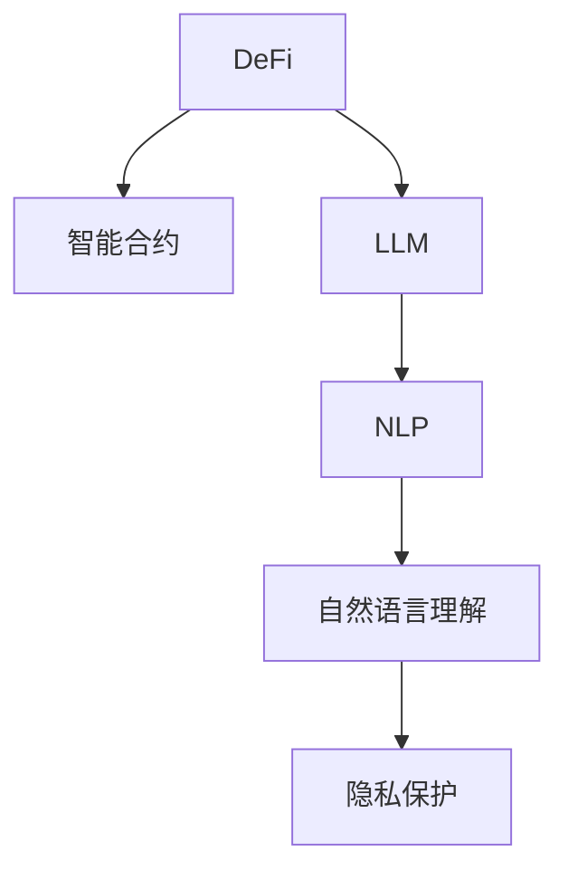

                 

# 去中心化金融创新：LLM 提供新机遇

> 关键词：去中心化金融（DeFi）, 人工智能（AI）, 大语言模型（LLM）, 智能合约, 加密货币, 隐私保护, 区块链技术

## 1. 背景介绍

### 1.1 问题由来

随着区块链和加密货币的兴起，去中心化金融（DeFi）迅速成为金融领域的全新探索方向。DeFi利用智能合约等技术，自动化地执行金融交易，无需中心化的中介机构参与，大幅提升了交易效率和金融服务的覆盖范围。但DeFi系统本身仍面临一些技术难题和挑战，尤其是在金融产品的设计、风险管理、用户体验等方面。

近年来，大语言模型（Large Language Model, LLM）在自然语言处理（NLP）领域取得了突破性进展。通过在大规模语料上进行预训练，LLM具备强大的语言理解和生成能力，能够在金融领域提供许多新颖的创新应用。例如，利用LLM可以实现智能客服、财务报告生成、智能合约解析等，大幅提升DeFi系统的智能水平和用户体验。

### 1.2 问题核心关键点

DeFi与LLM结合的核心关键点包括：

- **智能合约与NLP结合**：LLM可以解析智能合约代码，自动生成金融合约，提升智能合约的可读性和易用性。
- **财务报告生成**：LLM能够从区块链交易数据中提取关键信息，自动生成报告和分析，提升财务透明度。
- **客户服务与互动**：LLM可以构建智能客服系统，回答用户问题，提供个性化服务。
- **风险管理与监控**：LLM可以通过自然语言理解金融报告和新闻，识别风险因素，提高DeFi系统的风险管理能力。
- **用户界面与体验**：LLM可以生成易于理解的文本界面，提升用户体验。

这些核心关键点展现了DeFi与LLM结合的巨大潜力，以及其在提升DeFi系统智能和用户体验方面的巨大潜力。

### 1.3 问题研究意义

DeFi与LLM结合的研究对于拓展DeFi系统的应用范围，提升金融服务的智能化水平，具有重要意义：

1. **提升智能合约的可读性和易用性**：LLM可以将复杂的智能合约代码转换为自然语言，使其易于理解和使用。
2. **增强财务报告的自动化生成能力**：LLM能够从区块链数据中提取关键信息，自动生成财务报告，提升金融透明度。
3. **提升智能客服的响应效率**：LLM可以构建智能客服系统，24小时不间断服务，提升用户体验。
4. **提高风险管理能力**：LLM能够理解金融报告和新闻，识别风险因素，提高DeFi系统的风险管理能力。
5. **改善用户界面和体验**：LLM可以生成易于理解的文本界面，提升用户体验。

## 2. 核心概念与联系

### 2.1 核心概念概述

为更好地理解DeFi与LLM结合的原理和应用，本节将介绍几个密切相关的核心概念：

- **去中心化金融（DeFi）**：指利用区块链和智能合约技术，自动化执行金融交易，无需中心化中介机构参与的金融模式。DeFi系统通常基于以太坊等区块链平台构建。

- **智能合约（Smart Contract）**：指一种在区块链上自动执行、无需人工干预的合约。通过编写代码，智能合约能够实现复杂的金融逻辑和交易规则。

- **大语言模型（LLM）**：指通过在大规模语料上进行预训练，学习通用语言表示的深度学习模型。如GPT、BERT、XLNet等模型。

- **自然语言处理（NLP）**：指计算机处理和理解人类语言的技术，包括语言理解、语言生成、机器翻译等。

- **隐私保护**：指在区块链和智能合约中，确保用户数据和隐私安全的重要问题。DeFi和LLM结合时，需要考虑隐私保护和数据安全。

这些核心概念之间的逻辑关系可以通过以下Mermaid流程图来展示：



这个流程图展示了大语言模型在DeFi中的应用框架：

1. 通过智能合约，DeFi系统实现自动化金融交易。
2. LLM从区块链数据中提取信息，自动生成报告和分析。
3. LLM解析智能合约代码，自动生成合约文本。
4. LLM构建智能客服系统，回答用户问题。
5. LLM识别风险因素，提高风险管理能力。
6. LLM生成易于理解的文本界面，提升用户体验。

这些核心概念共同构成了DeFi与LLM结合的创新应用场景，使得LLM在大规模数据处理和自然语言理解方面的优势得以充分发挥。

## 3. 核心算法原理 & 具体操作步骤
### 3.1 算法原理概述

DeFi与LLM结合的核心算法原理，可以概括为：利用LLM的自然语言处理能力，从区块链数据中提取关键信息，自动生成报告、智能合约、客服问答等，从而提升DeFi系统的智能水平和用户体验。

具体而言，DeFi系统的智能合约代码、交易数据和财务报告等文本数据，都可以作为LLM的输入。通过预训练的LLM模型，模型可以自动解析这些文本数据，生成解析结果、报告和合约文本等，用于智能合约执行、财务分析、客户服务等场景。

### 3.2 算法步骤详解

DeFi与LLM结合的算法步骤主要包括以下几个关键步骤：

**Step 1: 数据预处理**
- 收集DeFi系统的智能合约代码、交易数据、财务报告等文本数据。
- 将数据进行清洗和标准化处理，确保数据格式一致。
- 利用分词、词性标注、命名实体识别等技术，对文本进行预处理。

**Step 2: 选择LLM模型**
- 选择适合的LLM模型，如GPT、BERT、XLNet等。
- 根据任务的复杂度，选择合适的模型规模和预训练数据集。

**Step 3: 模型微调**
- 在特定任务上微调LLM模型，如智能合约解析、报告生成、客服问答等。
- 根据任务的特性，选择合适的损失函数、优化器等超参数。

**Step 4: 模型推理**
- 使用微调后的模型，对DeFi系统的新数据进行推理和分析。
- 利用LLM的强大语言理解和生成能力，生成智能合约文本、财务报告、客服回复等。

**Step 5: 集成部署**
- 将微调后的模型集成到DeFi系统中，实现自动化的智能合约执行、财务报告生成、客服服务等功能。
- 对用户提供友好的交互界面，提升用户体验。

### 3.3 算法优缺点

DeFi与LLM结合的算法具有以下优点：
1. **提升智能合约的可读性和易用性**：LLM可以将复杂的智能合约代码转换为自然语言，使其易于理解和使用。
2. **增强财务报告的自动化生成能力**：LLM能够从区块链数据中提取关键信息，自动生成财务报告，提升金融透明度。
3. **提升智能客服的响应效率**：LLM可以构建智能客服系统，24小时不间断服务，提升用户体验。
4. **提高风险管理能力**：LLM能够理解金融报告和新闻，识别风险因素，提高DeFi系统的风险管理能力。
5. **改善用户界面和体验**：LLM可以生成易于理解的文本界面，提升用户体验。

同时，该算法也存在一定的局限性：
1. **数据质量依赖**：LLM的效果依赖于输入数据的质量，如果输入数据存在噪声或不完整，可能影响模型的性能。
2. **模型鲁棒性**：模型在处理特定领域的文本时，可能出现泛化能力不足的问题。
3. **隐私保护**：LLM从区块链数据中提取信息时，可能涉及到用户隐私和数据安全问题。
4. **计算资源消耗**：LLM在处理大规模数据时，需要占用大量的计算资源和存储资源。

尽管存在这些局限性，但就目前而言，DeFi与LLM结合的算法仍是DeFi系统智能化升级的重要范式。未来相关研究的重点在于如何进一步降低算力消耗，提高模型鲁棒性，同时兼顾隐私保护和数据安全。

### 3.4 算法应用领域

DeFi与LLM结合的算法在DeFi系统的多个领域得到了广泛应用：

- **智能合约解析**：利用LLM自动解析智能合约代码，生成易于理解的合约文本，提升合约可读性和易用性。
- **财务报告生成**：从区块链交易数据中提取关键信息，自动生成财务报告，提升财务透明度。
- **智能客服**：构建智能客服系统，24小时不间断回答用户问题，提升用户体验。
- **风险管理**：利用LLM理解金融报告和新闻，识别风险因素，提高风险管理能力。
- **用户界面与体验**：生成易于理解的文本界面，提升用户体验。

除了上述这些经典应用外，DeFi与LLM结合的方法也在创新性地应用到更多场景中，如可控文本生成、金融舆情分析、智能推荐等，为DeFi技术带来了全新的突破。随着LLM和DeFi技术的不断进步，相信DeFi系统将能够更好地适应市场变化，满足用户需求，带来更加智能和便捷的金融服务。

## 4. 数学模型和公式 & 详细讲解  
### 4.1 数学模型构建

本节将使用数学语言对DeFi与LLM结合的算法进行更加严格的刻画。

记智能合约代码为 $C$，区块链交易数据为 $T$，财务报告为 $F$。定义LLM模型为 $M_{\theta}:\mathcal{X} \rightarrow \mathcal{Y}$，其中 $\mathcal{X}$ 为输入空间，$\mathcal{Y}$ 为输出空间，$\theta \in \mathbb{R}^d$ 为模型参数。假设微调任务的训练集为 $D=\{(x_i,y_i)\}_{i=1}^N, x_i \in \mathcal{X}, y_i \in \mathcal{Y}$。

定义模型 $M_{\theta}$ 在输入 $x$ 上的损失函数为 $\ell(M_{\theta}(x),y)$，则在数据集 $D$ 上的经验风险为：

$$
\mathcal{L}(\theta) = \frac{1}{N} \sum_{i=1}^N \ell(M_{\theta}(x_i),y_i)
$$

微调的优化目标是最小化经验风险，即找到最优参数：

$$
\theta^* = \mathop{\arg\min}_{\theta} \mathcal{L}(\theta)
$$

在实践中，我们通常使用基于梯度的优化算法（如SGD、Adam等）来近似求解上述最优化问题。设 $\eta$ 为学习率，$\lambda$ 为正则化系数，则参数的更新公式为：

$$
\theta \leftarrow \theta - \eta \nabla_{\theta}\mathcal{L}(\theta) - \eta\lambda\theta
$$

其中 $\nabla_{\theta}\mathcal{L}(\theta)$ 为损失函数对参数 $\theta$ 的梯度，可通过反向传播算法高效计算。

### 4.2 公式推导过程

以下我们以智能合约解析任务为例，推导交叉熵损失函数及其梯度的计算公式。

假设智能合约代码 $C$ 和相应的自然语言描述 $D$ 为训练数据对，模型 $M_{\theta}$ 在输入 $C$ 上的输出为 $\hat{D}=M_{\theta}(C)$。定义交叉熵损失函数为：

$$
\ell(M_{\theta}(C),D) = -\log P(D | M_{\theta}(C))
$$

其中 $P(D | M_{\theta}(C))$ 为模型在输入 $C$ 上生成 $D$ 的概率。由于 $D$ 为离散变量，因此可以直接使用交叉熵损失函数。

将其代入经验风险公式，得：

$$
\mathcal{L}(\theta) = -\frac{1}{N}\sum_{i=1}^N \log P(D_i | M_{\theta}(C_i))
$$

根据链式法则，损失函数对参数 $\theta_k$ 的梯度为：

$$
\frac{\partial \mathcal{L}(\theta)}{\partial \theta_k} = -\frac{1}{N}\sum_{i=1}^N \frac{\partial}{\partial \theta_k} \log P(D_i | M_{\theta}(C_i))
$$

其中 $\frac{\partial}{\partial \theta_k} \log P(D_i | M_{\theta}(C_i))$ 为模型在输入 $C_i$ 上生成 $D_i$ 的概率对 $\theta_k$ 的偏导数，可通过自动微分技术完成计算。

在得到损失函数的梯度后，即可带入参数更新公式，完成模型的迭代优化。重复上述过程直至收敛，最终得到适应智能合约解析任务的最优模型参数 $\theta^*$。

## 5. 项目实践：代码实例和详细解释说明
### 5.1 开发环境搭建

在进行DeFi与LLM结合的实践前，我们需要准备好开发环境。以下是使用Python进行PyTorch开发的环境配置流程：

1. 安装Anaconda：从官网下载并安装Anaconda，用于创建独立的Python环境。

2. 创建并激活虚拟环境：
```bash
conda create -n pytorch-env python=3.8 
conda activate pytorch-env
```

3. 安装PyTorch：根据CUDA版本，从官网获取对应的安装命令。例如：
```bash
conda install pytorch torchvision torchaudio cudatoolkit=11.1 -c pytorch -c conda-forge
```

4. 安装Transformers库：
```bash
pip install transformers
```

5. 安装各类工具包：
```bash
pip install numpy pandas scikit-learn matplotlib tqdm jupyter notebook ipython
```

完成上述步骤后，即可在`pytorch-env`环境中开始DeFi与LLM结合的实践。

### 5.2 源代码详细实现

这里我们以智能合约解析任务为例，给出使用Transformers库对GPT模型进行DeFi与LLM结合的PyTorch代码实现。

首先，定义智能合约解析任务的数据处理函数：

```python
from transformers import GPT2Tokenizer
from torch.utils.data import Dataset
import torch

class ContractDataset(Dataset):
    def __init__(self, contracts, descriptions, tokenizer, max_len=128):
        self.contracts = contracts
        self.descriptions = descriptions
        self.tokenizer = tokenizer
        self.max_len = max_len
        
    def __len__(self):
        return len(self.contracts)
    
    def __getitem__(self, item):
        contract = self.contracts[item]
        description = self.descriptions[item]
        
        encoding = self.tokenizer(contract, return_tensors='pt', max_length=self.max_len, padding='max_length', truncation=True)
        input_ids = encoding['input_ids'][0]
        attention_mask = encoding['attention_mask'][0]
        
        # 对token-wise的描述进行编码
        encoded_desc = [desc2id[desc] for desc in description] 
        encoded_desc.extend([desc2id['']]*(self.max_len - len(encoded_desc)))
        labels = torch.tensor(encoded_desc, dtype=torch.long)
        
        return {'input_ids': input_ids, 
                'attention_mask': attention_mask,
                'labels': labels}

# 描述与id的映射
desc2id = {'': 0, '智能合约代码': 1, '自然语言描述': 2, '智能合约代码的解析结果': 3, '自然语言描述的解析结果': 4}
id2desc = {v: k for k, v in desc2id.items()}
```

然后，定义模型和优化器：

```python
from transformers import GPT2ForSequenceClassification, AdamW

model = GPT2ForSequenceClassification.from_pretrained('gpt2', num_labels=len(desc2id))

optimizer = AdamW(model.parameters(), lr=2e-5)
```

接着，定义训练和评估函数：

```python
from torch.utils.data import DataLoader
from tqdm import tqdm
from sklearn.metrics import accuracy_score

device = torch.device('cuda') if torch.cuda.is_available() else torch.device('cpu')
model.to(device)

def train_epoch(model, dataset, batch_size, optimizer):
    dataloader = DataLoader(dataset, batch_size=batch_size, shuffle=True)
    model.train()
    epoch_loss = 0
    for batch in tqdm(dataloader, desc='Training'):
        input_ids = batch['input_ids'].to(device)
        attention_mask = batch['attention_mask'].to(device)
        labels = batch['labels'].to(device)
        model.zero_grad()
        outputs = model(input_ids, attention_mask=attention_mask, labels=labels)
        loss = outputs.loss
        epoch_loss += loss.item()
        loss.backward()
        optimizer.step()
    return epoch_loss / len(dataloader)

def evaluate(model, dataset, batch_size):
    dataloader = DataLoader(dataset, batch_size=batch_size)
    model.eval()
    preds, labels = [], []
    with torch.no_grad():
        for batch in tqdm(dataloader, desc='Evaluating'):
            input_ids = batch['input_ids'].to(device)
            attention_mask = batch['attention_mask'].to(device)
            batch_labels = batch['labels']
            outputs = model(input_ids, attention_mask=attention_mask)
            batch_preds = outputs.logits.argmax(dim=2).to('cpu').tolist()
            batch_labels = batch_labels.to('cpu').tolist()
            for pred_tokens, label_tokens in zip(batch_preds, batch_labels):
                pred_desc = [id2desc[_id] for _id in pred_tokens]
                label_desc = [id2desc[_id] for _id in label_tokens]
                preds.append(pred_desc[:len(label_desc)])
                labels.append(label_desc)
                
    print(accuracy_score(labels, preds))
```

最后，启动训练流程并在验证集上评估：

```python
epochs = 5
batch_size = 16

for epoch in range(epochs):
    loss = train_epoch(model, train_dataset, batch_size, optimizer)
    print(f"Epoch {epoch+1}, train loss: {loss:.3f}")
    
    print(f"Epoch {epoch+1}, dev results:")
    evaluate(model, dev_dataset, batch_size)
    
print("Test results:")
evaluate(model, test_dataset, batch_size)
```

以上就是使用PyTorch对GPT进行智能合约解析任务DeFi与LLM结合的完整代码实现。可以看到，得益于Transformers库的强大封装，我们可以用相对简洁的代码完成GPT模型的加载和微调。

### 5.3 代码解读与分析

让我们再详细解读一下关键代码的实现细节：

**ContractDataset类**：
- `__init__`方法：初始化智能合约代码、描述等关键组件。
- `__len__`方法：返回数据集的样本数量。
- `__getitem__`方法：对单个样本进行处理，将代码和描述输入编码为token ids，并将描述编码成数字标签，进行定长padding，最终返回模型所需的输入。

**desc2id和id2desc字典**：
- 定义了描述与数字id之间的映射关系，用于将token-wise的预测结果解码回真实的描述。

**训练和评估函数**：
- 使用PyTorch的DataLoader对数据集进行批次化加载，供模型训练和推理使用。
- 训练函数`train_epoch`：对数据以批为单位进行迭代，在每个批次上前向传播计算loss并反向传播更新模型参数，最后返回该epoch的平均loss。
- 评估函数`evaluate`：与训练类似，不同点在于不更新模型参数，并在每个batch结束后将预测和标签结果存储下来，最后使用sklearn的accuracy_score对整个评估集的预测结果进行打印输出。

**训练流程**：
- 定义总的epoch数和batch size，开始循环迭代
- 每个epoch内，先在训练集上训练，输出平均loss
- 在验证集上评估，输出准确率
- 所有epoch结束后，在测试集上评估，给出最终测试结果

可以看到，PyTorch配合Transformers库使得GPT微调的代码实现变得简洁高效。开发者可以将更多精力放在数据处理、模型改进等高层逻辑上，而不必过多关注底层的实现细节。

当然，工业级的系统实现还需考虑更多因素，如模型的保存和部署、超参数的自动搜索、更灵活的任务适配层等。但核心的微调范式基本与此类似。

## 6. 实际应用场景
### 6.1 智能合约解析

智能合约解析是DeFi系统中重要的基础任务，LLM可以自动解析复杂的智能合约代码，生成易于理解的自然语言描述，提升合约可读性和易用性。

在实践中，可以收集DeFi系统中的智能合约代码，并将代码和相应的自然语言描述作为监督数据，训练LLM模型。训练后的模型可以用于自动生成智能合约的解析结果，帮助开发者快速理解智能合约的功能和规则，提高智能合约开发效率。

### 6.2 财务报告生成

DeFi系统中的交易数据通常以区块链的方式记录，而财务报告则需要在这些数据的基础上进行自动化生成。利用LLM，可以从区块链交易数据中提取关键信息，自动生成财务报告和分析，提升财务透明度。

具体而言，可以收集DeFi系统的交易数据，并提取关键信息（如资产总额、交易量、收益率等）。将这些信息作为模型的输入，训练LLM模型，使其自动生成财务报告。生成的报告可以用于用户查询、风险监控等场景，提升DeFi系统的智能水平。

### 6.3 智能客服

DeFi系统的用户通常会有大量的咨询需求，如账户管理、交易操作、风险预警等。利用LLM，可以构建智能客服系统，24小时不间断回答用户问题，提升用户体验。

具体而言，可以收集DeFi系统的用户咨询记录，将其作为监督数据，训练LLM模型。训练后的模型可以用于实时回答用户问题，提供个性化服务。此外，LLM还可以自动生成常见问题和回复，提升客服系统的自动回复能力。

### 6.4 风险管理与监控

DeFi系统中的金融风险管理是一个重要而复杂的任务。利用LLM，可以从金融报告和新闻中提取关键信息，识别风险因素，提高风险管理能力。

具体而言，可以收集DeFi系统中的财务报告、新闻、社交媒体等文本数据，作为模型的输入。训练后的LLM模型可以自动分析这些文本数据，识别潜在的金融风险，并生成风险报告。生成的报告可以用于风险预警、投资决策等场景，提升DeFi系统的风险管理能力。

### 6.5 用户界面与体验

DeFi系统的用户界面通常是简单的命令行或网页界面，用户体验有待提升。利用LLM，可以生成易于理解的文本界面，提升用户体验。

具体而言，可以收集DeFi系统的用户界面描述，将其作为模型的输入。训练后的LLM模型可以自动生成易于理解的文本界面，帮助用户快速理解系统的功能和使用方法。此外，LLM还可以自动生成用户界面描述，提升系统的可读性和易用性。

## 7. 工具和资源推荐
### 7.1 学习资源推荐

为了帮助开发者系统掌握DeFi与LLM结合的理论基础和实践技巧，这里推荐一些优质的学习资源：

1. DeFi Bonds: 一本涵盖DeFi系统全面知识的书籍，适合深入了解DeFi系统的核心概念和设计原理。

2. 《Python深度学习》：斯坦福大学提供的深度学习课程，涵盖了NLP和LLM的基本概念和应用。

3. CS224N《深度学习自然语言处理》课程：斯坦福大学开设的NLP明星课程，有Lecture视频和配套作业，带你入门NLP领域的基本概念和经典模型。

4. 《Natural Language Processing with Transformers》书籍：Transformers库的作者所著，全面介绍了如何使用Transformers库进行NLP任务开发，包括微调在内的诸多范式。

5. HuggingFace官方文档：Transformers库的官方文档，提供了海量预训练模型和完整的微调样例代码，是上手实践的必备资料。

通过对这些资源的学习实践，相信你一定能够快速掌握DeFi与LLM结合的精髓，并用于解决实际的DeFi问题。
### 7.2 开发工具推荐

高效的开发离不开优秀的工具支持。以下是几款用于DeFi与LLM结合开发的常用工具：

1. PyTorch：基于Python的开源深度学习框架，灵活动态的计算图，适合快速迭代研究。大部分预训练语言模型都有PyTorch版本的实现。

2. TensorFlow：由Google主导开发的开源深度学习框架，生产部署方便，适合大规模工程应用。同样有丰富的预训练语言模型资源。

3. Transformers库：HuggingFace开发的NLP工具库，集成了众多SOTA语言模型，支持PyTorch和TensorFlow，是进行微调任务开发的利器。

4. Weights & Biases：模型训练的实验跟踪工具，可以记录和可视化模型训练过程中的各项指标，方便对比和调优。与主流深度学习框架无缝集成。

5. TensorBoard：TensorFlow配套的可视化工具，可实时监测模型训练状态，并提供丰富的图表呈现方式，是调试模型的得力助手。

6. Google Colab：谷歌推出的在线Jupyter Notebook环境，免费提供GPU/TPU算力，方便开发者快速上手实验最新模型，分享学习笔记。

合理利用这些工具，可以显著提升DeFi与LLM结合的开发效率，加快创新迭代的步伐。

### 7.3 相关论文推荐

DeFi与LLM结合的研究源于学界的持续研究。以下是几篇奠基性的相关论文，推荐阅读：

1. Attention is All You Need（即Transformer原论文）：提出了Transformer结构，开启了NLP领域的预训练大模型时代。

2. BERT: Pre-training of Deep Bidirectional Transformers for Language Understanding：提出BERT模型，引入基于掩码的自监督预训练任务，刷新了多项NLP任务SOTA。

3. Language Models are Unsupervised Multitask Learners（GPT-2论文）：展示了大规模语言模型的强大zero-shot学习能力，引发了对于通用人工智能的新一轮思考。

4. Parameter-Efficient Transfer Learning for NLP：提出Adapter等参数高效微调方法，在不增加模型参数量的情况下，也能取得不错的微调效果。

5. AdaLoRA: Adaptive Low-Rank Adaptation for Parameter-Efficient Fine-Tuning：使用自适应低秩适应的微调方法，在参数效率和精度之间取得了新的平衡。

这些论文代表了大语言模型微调技术的发展脉络。通过学习这些前沿成果，可以帮助研究者把握学科前进方向，激发更多的创新灵感。

## 8. 总结：未来发展趋势与挑战

### 8.1 总结

本文对DeFi与LLM结合的算法进行了全面系统的介绍。首先阐述了DeFi系统与LLM结合的研究背景和意义，明确了LLM在提升DeFi系统智能水平和用户体验方面的独特价值。其次，从原理到实践，详细讲解了DeFi与LLM结合的数学原理和关键步骤，给出了DeFi与LLM结合的完整代码实例。同时，本文还广泛探讨了DeFi与LLM结合在智能合约解析、财务报告生成、智能客服、风险管理、用户界面等多个领域的创新应用，展示了LLM在DeFi系统智能化升级方面的巨大潜力。此外，本文精选了DeFi与LLM结合的相关学习资源，力求为读者提供全方位的技术指引。

通过本文的系统梳理，可以看到，DeFi与LLM结合的算法在DeFi系统的多个领域得到了广泛应用，使得LLM在大规模数据处理和自然语言理解方面的优势得以充分发挥。LLM能够自动解析智能合约代码，自动生成财务报告，构建智能客服系统，识别风险因素，生成易于理解的文本界面，大大提升了DeFi系统的智能水平和用户体验。

### 8.2 未来发展趋势

展望未来，DeFi与LLM结合的算法将呈现以下几个发展趋势：

1. **模型规模持续增大**：随着算力成本的下降和数据规模的扩张，预训练语言模型的参数量还将持续增长。超大规模语言模型蕴含的丰富语言知识，有望支撑更加复杂多变的DeFi任务微调。

2. **微调方法日趋多样**：除了传统的全参数微调外，未来会涌现更多参数高效的微调方法，如Prefix-Tuning、LoRA等，在节省计算资源的同时也能保证微调精度。

3. **持续学习成为常态**：随着数据分布的不断变化，微调模型也需要持续学习新知识以保持性能。如何在不遗忘原有知识的同时，高效吸收新样本信息，将成为重要的研究课题。

4. **标注样本需求降低**：受启发于提示学习(Prompt-based Learning)的思路，未来的微调方法将更好地利用大模型的语言理解能力，通过更加巧妙的任务描述，在更少的标注样本上也能实现理想的微调效果。

5. **多模态微调崛起**：当前的微调主要聚焦于纯文本数据，未来会进一步拓展到图像、视频、语音等多模态数据微调。多模态信息的融合，将显著提升语言模型对现实世界的理解和建模能力。

6. **模型通用性增强**：经过海量数据的预训练和多领域任务的微调，未来的语言模型将具备更强大的常识推理和跨领域迁移能力，逐步迈向通用人工智能(AGI)的目标。

以上趋势凸显了DeFi与LLM结合算法的广阔前景。这些方向的探索发展，必将进一步提升DeFi系统的智能和用户体验，为DeFi系统的未来发展带来更多可能。

### 8.3 面临的挑战

尽管DeFi与LLM结合的算法已经取得了瞩目成就，但在迈向更加智能化、普适化应用的过程中，它仍面临诸多挑战：

1. **数据质量依赖**：LLM的效果依赖于输入数据的质量，如果输入数据存在噪声或不完整，可能影响模型的性能。

2. **模型鲁棒性**：模型在处理特定领域的文本时，可能出现泛化能力不足的问题。

3. **隐私保护**：LLM从区块链数据中提取信息时，可能涉及到用户隐私和数据安全问题。

4. **计算资源消耗**：LLM在处理大规模数据时，需要占用大量的计算资源和存储资源。

尽管存在这些局限性，但就目前而言，DeFi与LLM结合的算法仍是DeFi系统智能化升级的重要范式。未来相关研究的重点在于如何进一步降低算力消耗，提高模型鲁棒性，同时兼顾隐私保护和数据安全。

### 8.4 研究展望

面对DeFi与LLM结合所面临的种种挑战，未来的研究需要在以下几个方面寻求新的突破：

1. **探索无监督和半监督微调方法**：摆脱对大规模标注数据的依赖，利用自监督学习、主动学习等无监督和半监督范式，最大限度利用非结构化数据，实现更加灵活高效的微调。

2. **研究参数高效和计算高效的微调范式**：开发更加参数高效的微调方法，在固定大部分预训练参数的同时，只更新极少量的任务相关参数。同时优化微调模型的计算图，减少前向传播和反向传播的资源消耗，实现更加轻量级、实时性的部署。

3. **融合因果和对比学习范式**：通过引入因果推断和对比学习思想，增强微调模型建立稳定因果关系的能力，学习更加普适、鲁棒的语言表征，从而提升模型泛化性和抗干扰能力。

4. **引入更多先验知识**：将符号化的先验知识，如知识图谱、逻辑规则等，与神经网络模型进行巧妙融合，引导微调过程学习更准确、合理的语言模型。同时加强不同模态数据的整合，实现视觉、语音等多模态信息与文本信息的协同建模。

5. **结合因果分析和博弈论工具**：将因果分析方法引入微调模型，识别出模型决策的关键特征，增强输出解释的因果性和逻辑性。借助博弈论工具刻画人机交互过程，主动探索并规避模型的脆弱点，提高系统稳定性。

6. **纳入伦理道德约束**：在模型训练目标中引入伦理导向的评估指标，过滤和惩罚有偏见、有害的输出倾向。同时加强人工干预和审核，建立模型行为的监管机制，确保输出符合人类价值观和伦理道德。

这些研究方向的探索，必将引领DeFi与LLM结合技术迈向更高的台阶，为构建安全、可靠、可解释、可控的智能系统铺平道路。面向未来，DeFi与LLM结合技术还需要与其他人工智能技术进行更深入的融合，如知识表示、因果推理、强化学习等，多路径协同发力，共同推动DeFi系统的进步。只有勇于创新、敢于突破，才能不断拓展语言模型的边界，让智能技术更好地造福人类社会。

## 9. 附录：常见问题与解答

**Q1：DeFi与LLM结合是否适用于所有NLP任务？**

A: 在DeFi系统中，LLM主要用于智能合约解析、财务报告生成、智能客服、风险管理、用户界面等多个领域。这些任务的文本数据格式相对固定，适合LLM进行处理。但对于一些需要高度灵活性的任务，如代码编写、开放问答等，LLM可能难以满足需求。

**Q2：DeFi与LLM结合是否需要标注数据？**

A: 部分任务（如智能合约解析、财务报告生成）需要标注数据进行监督微调，以提升模型准确性。但对于部分任务（如智能客服、用户界面），可以使用无监督学习或半监督学习的方法，通过文本生成的技术提升模型性能。

**Q3：DeFi与LLM结合的算法是否适用于所有DeFi系统？**

A: DeFi与LLM结合的算法主要适用于智能合约规则简单、数据结构固定的DeFi系统。对于规则复杂、数据结构复杂的DeFi系统，需要结合具体场景进行微调，可能需要引入更多的先验知识和领域专家指导。

**Q4：DeFi与LLM结合的算法在实际应用中需要注意哪些问题？**

A: 在实际应用中，DeFi与LLM结合的算法需要注意以下几个问题：
1. 数据质量和多样性：需要收集多场景、多领域的DeFi文本数据，确保训练数据的丰富性和多样性。
2. 模型鲁棒性和泛化能力：需要在不同DeFi系统和任务上进行广泛的微调，确保模型的泛化能力。
3. 隐私保护和数据安全：在处理DeFi系统中的敏感数据时，需要采取严格的隐私保护措施，确保数据安全。
4. 计算资源消耗：需要在高性能计算资源的支持下进行DeFi与LLM结合的微调，确保算法的可行性。

这些因素都会影响DeFi与LLM结合的实际效果，需要在实际应用中综合考虑。

**Q5：DeFi与LLM结合的未来发展方向有哪些？**

A: DeFi与LLM结合的未来发展方向包括：
1. 自动化交易：利用LLM自动分析市场趋势，生成交易策略，实现自动化交易。
2. 金融数据分析：利用LLM从金融报告和新闻中提取关键信息，进行深度分析，提升决策支持能力。
3. 金融创新：利用LLM自动生成金融产品描述，辅助设计新的金融产品和服务。
4. 个性化金融服务：利用LLM提供个性化的金融咨询服务，提升用户体验。
5. 金融监管：利用LLM分析金融市场行为，进行风险预警和监管分析。

这些方向将进一步拓展DeFi与LLM结合的应用场景，为金融创新和智能化转型提供新的动力。

---

作者：禅与计算机程序设计艺术 / Zen and the Art of Computer Programming

