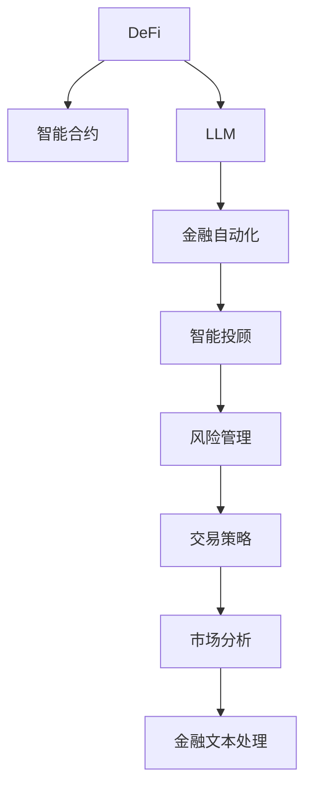

                 

# 去中心化金融：LLM 的应用

> 关键词：去中心化金融, LLM, 大语言模型, DeFi, 金融自动化, 智能合约, 风险管理, 交易策略, 自然语言处理, 智能投顾

## 1. 背景介绍

### 1.1 问题由来
去中心化金融（DeFi）是近年来区块链技术引领下新兴的一个金融领域，它通过智能合约等技术手段，在无需中心化机构参与的情况下，实现了类似传统金融业务的功能，如借贷、交易、稳定币等。DeFi的兴起，一方面大大降低了传统金融服务的成本和复杂性，另一方面也带来了更高的透明度和安全性。然而，DeFi应用场景的复杂性和多样性，使得其管理和服务效率成为一大挑战。

传统金融业务中的许多流程都需要通过人工来完成，而智能合约等技术的出现，有望通过自动化提升DeFi的运行效率。但这些智能合约往往难以适应快速变化的金融市场环境，且在理解和生成金融文本、预测金融趋势等方面，仍然存在局限性。大语言模型（LLM）的崛起，为解决这些挑战提供了新的思路。

LLM是一种能够理解自然语言并生成高质量文本的强大模型，其广泛的语言处理能力可以显著提升DeFi应用场景中的智能合约和金融决策效率。LLM可以自动处理和生成金融文本，解释和分析市场动态，生成复杂的金融交易策略，支持智能投顾等金融自动化功能。

### 1.2 问题核心关键点
LLM在DeFi领域的应用，主要集中在以下几个方面：

- 金融文本处理：LLM可以自动理解和生成金融新闻、公告、分析报告等文本信息，提取其中的关键金融指标，为智能合约和交易策略提供输入。
- 市场分析：LLM能够实时分析金融市场数据，预测价格波动、市场趋势，生成风险评估报告。
- 交易策略：LLM可以基于历史数据和市场分析，生成各种复杂的金融交易策略，支持高频交易、套利等金融自动化操作。
- 智能投顾：LLM可以作为智能投顾的决策引擎，根据用户需求和市场动态，提供个性化的投资建议。
- 合规审计：LLM可以自动生成合规审计报告，确保DeFi平台的合规性。

这些关键点共同构成了LLM在DeFi领域的应用框架，通过提升智能合约的自动化和智能化水平，大幅提升DeFi服务的效率和用户体验。

### 1.3 问题研究意义
LLM在DeFi领域的应用，对于推动DeFi技术的进步和普及，具有重要的意义：

1. 提高效率：通过自动化处理金融文本和市场分析，LLM可以显著提升DeFi服务的效率，减少人工操作和成本。
2. 增强安全性：智能合约和金融自动化操作基于LLM的分析结果，可以大大降低人为失误带来的风险。
3. 提升用户体验：智能投顾等个性化服务，可以提升用户对DeFi的满意度和粘性。
4. 促进技术创新：LLM的应用推动了智能合约和金融自动化技术的发展，为DeFi技术的创新提供了新的方向。
5. 强化合规性：LLM可以自动生成合规审计报告，确保DeFi平台的合规性，促进DeFi行业的规范化和标准化。

总之，LLM在DeFi领域的应用，为DeFi技术的成熟和应用提供了强大的技术支持，有助于构建更安全、高效、可靠的DeFi生态系统。

## 2. 核心概念与联系

### 2.1 核心概念概述

为更好地理解LLM在DeFi中的应用，本节将介绍几个关键概念：

- 去中心化金融(DeFi)：利用区块链技术，通过智能合约等手段实现金融业务自动化、去中心化的金融应用模式。

- 大语言模型(LLM)：一种能够理解并生成自然语言文本的深度学习模型，广泛应用于文本生成、机器翻译、情感分析、自然语言处理等任务。

- 智能合约：一种自动执行的计算机程序，通过区块链技术实现，可以自动化完成金融交易、资产管理等复杂操作。

- 金融自动化：指通过智能合约和LLM等技术手段，实现金融操作的自动化和智能化，提升金融服务的效率和用户满意度。

- 智能投顾：一种基于人工智能的投顾服务，根据用户需求和市场动态，提供个性化的投资建议和资产管理。

这些概念之间的逻辑关系可以通过以下Mermaid流程图来展示：



这个流程图展示了大语言模型在DeFi应用中的关键作用，从金融文本处理到市场分析、交易策略、智能投顾和风险管理，LLM的应用贯穿了DeFi的各个环节。

## 3. 核心算法原理 & 具体操作步骤
### 3.1 算法原理概述

LLM在DeFi应用中的核心原理，是利用其强大的自然语言处理能力，自动处理和分析金融文本，生成金融交易策略，支持智能合约的决策和执行。LLM的输入通常是各类金融文本，包括新闻、公告、分析报告等，其输出可以是金融指标、预测模型、交易策略等，用于支持智能合约和金融自动化操作。

### 3.2 算法步骤详解

LLM在DeFi应用中的主要操作流程如下：

1. **文本收集与预处理**：
   - 收集各类金融文本数据，如新闻、公告、分析报告等。
   - 对文本进行预处理，如清洗噪声、分词、去除停用词等。

2. **模型输入构建**：
   - 将预处理后的文本数据输入到LLM模型中，得到模型生成的文本摘要或分析报告。
   - 根据需要提取关键金融指标，如价格、波动率、市场情绪等。

3. **分析与处理**：
   - 根据LLM输出的分析报告和关键指标，结合市场数据，进行金融分析和预测。
   - 生成风险评估报告，识别高风险事件和市场趋势。

4. **策略生成与优化**：
   - 基于分析结果，生成各类金融交易策略，如套利策略、风险管理策略等。
   - 通过优化算法调整策略参数，使其符合用户的风险偏好和市场情况。

5. **智能合约执行**：
   - 将生成的交易策略自动输入到智能合约中，实现金融操作的自动化执行。
   - 监控市场动态，实时调整策略参数，确保智能合约始终符合市场要求。

6. **用户交互与反馈**：
   - 根据用户需求和市场动态，不断优化智能投顾的个性化服务。
   - 收集用户反馈，持续改进LLM的金融文本处理和分析能力。

### 3.3 算法优缺点

LLM在DeFi领域的应用，具有以下优点：

1. **高效处理金融文本**：LLM能够自动处理和分析金融文本，大大降低了人工操作的时间和成本。
2. **增强决策准确性**：LLM能够实时分析市场数据，生成高精度的金融预测和策略，提升智能合约的决策准确性。
3. **提升自动化水平**：LLM支持自动化生成金融交易策略和执行操作，提高了DeFi服务的自动化程度。
4. **提升用户体验**：智能投顾等个性化服务，提升了用户对DeFi的满意度和粘性。
5. **强化合规性**：LLM可以自动生成合规审计报告，确保DeFi平台的合规性。

同时，LLM在DeFi领域的应用，也存在以下缺点：

1. **数据质量依赖性**：LLM的输出质量很大程度上依赖于输入数据的准确性和完整性，数据噪声和缺失可能导致误判。
2. **模型复杂度**：LLM的模型复杂度高，对计算资源和存储资源的需求较大，部署成本较高。
3. **技术门槛**：LLM在DeFi应用中需要结合多种技术和工具，对开发者的技术水平和经验要求较高。
4. **风险管理不足**：LLM生成的交易策略和分析报告，需要结合人工审核，确保其风险可控。
5. **市场适应性**：LLM的模型训练依赖历史数据，可能难以适应快速变化的市场环境。

### 3.4 算法应用领域

LLM在DeFi领域的应用，已经涵盖了多个细分领域，如：

- 资产管理：LLM可以根据市场数据和用户需求，自动生成资产配置策略，实现智能投资组合管理。
- 借贷服务：LLM可以自动分析和预测借款人的信用风险，生成贷款审批策略，实现智能借贷服务。
- 交易执行：LLM可以生成高频交易策略，自动执行交易操作，提升交易效率。
- 保险服务：LLM可以自动分析和评估保险标的的风险，生成保险产品定价策略，实现智能保险服务。
- 资产证券化：LLM可以自动分析和评估资产的质量和风险，生成资产证券化策略，实现智能资产证券化。

这些应用领域充分展示了LLM在DeFi中的强大能力，为DeFi技术的发展提供了新的动力。

## 4. 数学模型和公式 & 详细讲解  
### 4.1 数学模型构建

本节将使用数学语言对LLM在DeFi中的应用进行更加严格的刻画。

记LLM为$f(x)$，其中$x$为输入的金融文本数据。LLM的输出为一个向量$y$，包含关键金融指标和分析报告。设市场数据为$D_t$，则LLM在DeFi应用中的数学模型为：

$$
y = f(x, D_t)
$$

其中$D_t$为市场数据，$x$为金融文本数据。模型目标是最大化LLM输出与市场数据的相关性，即：

$$
\max_{f} \text{corr}(y, D_t)
$$

### 4.2 公式推导过程

以下我们以风险评估为例，推导LLM在风险管理中的应用公式。

假设LLM的输出向量$y$中包含一个风险指标$R$，表示当前市场中的风险水平。设市场数据为$D_t$，其中包含历史价格波动率、市场情绪指标等。则风险评估的数学模型为：

$$
R = f(x, D_t) = \frac{\sum_{i=1}^{n} w_i d_i}{\sigma} = \frac{\sum_{i=1}^{n} \alpha_i f_i(x) \rho_i d_i}{\sigma}
$$

其中$f_i(x)$为LLM对金融文本的第$i$个关键指标的输出，$d_i$为市场数据中的第$i$个指标值，$w_i$为第$i$个指标的权重，$\sigma$为市场数据的标准差，$\alpha_i$为第$i$个指标的系数，$\rho_i$为第$i$个指标与风险指标的相关系数。

将上述公式代入模型目标，得：

$$
\max_{f} \text{corr}(y, D_t) = \max_{f} \text{corr}(\frac{\sum_{i=1}^{n} \alpha_i f_i(x) \rho_i d_i}{\sigma}, D_t)
$$

通过优化算法，不断调整$f_i$的权重和系数，使得风险评估指标与市场数据的相关性最大化，从而生成高精度的风险评估报告。

### 4.3 案例分析与讲解

以资产管理为例，展示LLM在DeFi中的应用。假设某DeFi平台需要自动生成资产配置策略，以实现智能投资组合管理。

1. **文本收集与预处理**：
   - 收集各类金融文本数据，如市场报告、分析文章、公司财报等。
   - 对文本进行预处理，如清洗噪声、分词、去除停用词等。

2. **模型输入构建**：
   - 将预处理后的文本数据输入到LLM模型中，得到模型生成的文本摘要或分析报告。
   - 根据报告内容，提取关键金融指标，如公司盈利、市场情绪、行业趋势等。

3. **分析与处理**：
   - 根据LLM输出的分析报告和关键指标，结合市场数据，进行资产配置分析。
   - 生成风险评估报告，识别高风险资产和市场趋势。

4. **策略生成与优化**：
   - 基于分析结果，生成各类资产配置策略，如多元化投资、风险分散等。
   - 通过优化算法调整策略参数，使其符合用户的风险偏好和市场情况。

5. **智能合约执行**：
   - 将生成的资产配置策略自动输入到智能合约中，实现资产配置的自动化执行。
   - 监控市场动态，实时调整策略参数，确保资产配置始终符合市场要求。

6. **用户交互与反馈**：
   - 根据用户需求和市场动态，不断优化智能投顾的个性化服务。
   - 收集用户反馈，持续改进LLM的金融文本处理和分析能力。

通过以上步骤，LLM能够实现DeFi平台的高效、智能资产管理，提升用户的投资收益和风险控制能力。

## 5. 项目实践：代码实例和详细解释说明
### 5.1 开发环境搭建

在进行LLM在DeFi应用的项目实践前，我们需要准备好开发环境。以下是使用Python进行PyTorch开发的环境配置流程：

1. 安装Anaconda：从官网下载并安装Anaconda，用于创建独立的Python环境。

2. 创建并激活虚拟环境：
```bash
conda create -n pytorch-env python=3.8 
conda activate pytorch-env
```

3. 安装PyTorch：根据CUDA版本，从官网获取对应的安装命令。例如：
```bash
conda install pytorch torchvision torchaudio cudatoolkit=11.1 -c pytorch -c conda-forge
```

4. 安装LLM库：
```bash
pip install transformers
```

5. 安装各类工具包：
```bash
pip install numpy pandas scikit-learn matplotlib tqdm jupyter notebook ipython
```

完成上述步骤后，即可在`pytorch-env`环境中开始项目实践。

### 5.2 源代码详细实现

这里我们以风险评估为例，展示使用LLM进行DeFi应用开发的PyTorch代码实现。

首先，定义风险评估的训练数据集：

```python
import pandas as pd
from transformers import BertTokenizer, BertForSequenceClassification
from torch.utils.data import Dataset

class RiskDataset(Dataset):
    def __init__(self, file_path):
        self.tokenizer = BertTokenizer.from_pretrained('bert-base-uncased')
        self.data = pd.read_csv(file_path)

    def __len__(self):
        return len(self.data)

    def __getitem__(self, item):
        text = self.data.iloc[item]['text']
        label = self.data.iloc[item]['label']
        encoding = self.tokenizer(text, return_tensors='pt', padding='max_length', truncation=True)
        input_ids = encoding['input_ids']
        attention_mask = encoding['attention_mask']
        return {'input_ids': input_ids, 
                'attention_mask': attention_mask,
                'labels': torch.tensor(label, dtype=torch.long)}
```

然后，定义风险评估的模型和优化器：

```python
from transformers import AdamW

model = BertForSequenceClassification.from_pretrained('bert-base-uncased', num_labels=2)
optimizer = AdamW(model.parameters(), lr=2e-5)
```

接着，定义训练和评估函数：

```python
from torch.utils.data import DataLoader
from tqdm import tqdm

device = torch.device('cuda') if torch.cuda.is_available() else torch.device('cpu')
model.to(device)

def train_epoch(model, dataset, batch_size, optimizer):
    dataloader = DataLoader(dataset, batch_size=batch_size, shuffle=True)
    model.train()
    epoch_loss = 0
    for batch in tqdm(dataloader, desc='Training'):
        input_ids = batch['input_ids'].to(device)
        attention_mask = batch['attention_mask'].to(device)
        labels = batch['labels'].to(device)
        model.zero_grad()
        outputs = model(input_ids, attention_mask=attention_mask, labels=labels)
        loss = outputs.loss
        epoch_loss += loss.item()
        loss.backward()
        optimizer.step()
    return epoch_loss / len(dataloader)

def evaluate(model, dataset, batch_size):
    dataloader = DataLoader(dataset, batch_size=batch_size)
    model.eval()
    preds, labels = [], []
    with torch.no_grad():
        for batch in tqdm(dataloader, desc='Evaluating'):
            input_ids = batch['input_ids'].to(device)
            attention_mask = batch['attention_mask'].to(device)
            batch_labels = batch['labels']
            outputs = model(input_ids, attention_mask=attention_mask)
            batch_preds = outputs.logits.argmax(dim=2).to('cpu').tolist()
            batch_labels = batch_labels.to('cpu').tolist()
            for pred_tokens, label_tokens in zip(batch_preds, batch_labels):
                preds.append(pred_tokens[:len(label_tokens)])
                labels.append(label_tokens)
                
    print(classification_report(labels, preds))
```

最后，启动训练流程并在测试集上评估：

```python
epochs = 5
batch_size = 16

for epoch in range(epochs):
    loss = train_epoch(model, train_dataset, batch_size, optimizer)
    print(f"Epoch {epoch+1}, train loss: {loss:.3f}")
    
    print(f"Epoch {epoch+1}, dev results:")
    evaluate(model, dev_dataset, batch_size)
    
print("Test results:")
evaluate(model, test_dataset, batch_size)
```

以上就是使用PyTorch对LLM进行风险评估任务的代码实现。可以看到，得益于Transformers库的强大封装，我们能够用相对简洁的代码完成LLM模型的加载和训练。

### 5.3 代码解读与分析

让我们再详细解读一下关键代码的实现细节：

**RiskDataset类**：
- `__init__`方法：初始化文本、标签、分词器等关键组件。
- `__len__`方法：返回数据集的样本数量。
- `__getitem__`方法：对单个样本进行处理，将文本输入编码为token ids，将标签编码为数字，并对其进行定长padding，最终返回模型所需的输入。

**训练和评估函数**：
- 使用PyTorch的DataLoader对数据集进行批次化加载，供模型训练和推理使用。
- 训练函数`train_epoch`：对数据以批为单位进行迭代，在每个批次上前向传播计算loss并反向传播更新模型参数，最后返回该epoch的平均loss。
- 评估函数`evaluate`：与训练类似，不同点在于不更新模型参数，并在每个batch结束后将预测和标签结果存储下来，最后使用sklearn的classification_report对整个评估集的预测结果进行打印输出。

**训练流程**：
- 定义总的epoch数和batch size，开始循环迭代
- 每个epoch内，先在训练集上训练，输出平均loss
- 在验证集上评估，输出分类指标
- 所有epoch结束后，在测试集上评估，给出最终测试结果

可以看到，PyTorch配合Transformers库使得LLM风险评估的代码实现变得简洁高效。开发者可以将更多精力放在数据处理、模型改进等高层逻辑上，而不必过多关注底层的实现细节。

当然，工业级的系统实现还需考虑更多因素，如模型的保存和部署、超参数的自动搜索、更灵活的任务适配层等。但核心的LLM范式基本与此类似。

## 6. 实际应用场景
### 6.1 智能合约自动执行

基于LLM的智能合约自动执行，可以通过自动分析金融文本和市场数据，生成高精度的金融策略和交易指令。这种自动化执行方式，可以大幅提升DeFi服务的效率和准确性。

例如，假设某DeFi平台需要根据市场数据和金融文本，自动生成借贷合同的条款和条件。在项目实施中，平台可以使用LLM模型自动分析用户提交的金融文本，提取关键信息，生成合同条款。同时，LLM可以实时监测市场数据，自动调整合同条款，确保合同始终符合市场要求。

### 6.2 智能投顾个性化服务

智能投顾作为LLM在DeFi应用的典型应用之一，可以大幅提升用户的投资体验。智能投顾通过LLM对金融文本和市场数据的分析，生成个性化的投资建议和资产管理方案，满足不同用户的需求。

例如，某用户希望在DeFi平台上进行智能投顾服务，智能投顾可以根据用户的风险偏好和市场动态，自动生成投资组合和交易策略。LLM可以根据用户输入的文本和市场数据，生成多种投资建议，供用户选择。同时，LLM可以实时监测市场数据，自动调整投资组合，确保用户资产的安全性和收益性。

### 6.3 金融自动化交易

LLM在DeFi应用的另一个重要方向是金融自动化交易。LLM可以自动分析市场数据和金融文本，生成高精度的交易策略和指令，支持高频交易、套利等操作。

例如，某用户希望进行高频交易，LLM可以自动分析市场数据，生成高频交易策略，并自动执行交易指令。LLM可以根据市场波动和交易信号，实时调整交易策略，确保交易效率和收益。

### 6.4 未来应用展望

随着LLM技术的发展，其在DeFi领域的应用将更加广泛和深入，推动DeFi技术的不断创新和普及。

1. **多模态金融数据处理**：未来的LLM模型将具备多模态数据处理能力，支持图像、视频、语音等多模态数据的融合分析，提升DeFi服务的智能化水平。
2. **金融文本生成与分析**：LLM可以自动生成金融文本和报告，帮助用户更好地理解市场动态和投资机会。
3. **智能合约动态优化**：LLM可以自动分析和优化智能合约的条款和条件，提高DeFi平台的自动化和智能化水平。
4. **个性化金融服务**：LLM可以根据用户需求和市场动态，提供个性化的金融服务，提升用户满意度。
5. **区块链技术融合**：LLM将与区块链技术深度融合，实现金融数据的自动记录和验证，提升DeFi系统的安全性和透明性。

总之，LLM在DeFi领域的应用前景广阔，通过提升智能合约和金融自动化操作的效率和智能化水平，将显著提升DeFi服务的质量和用户体验，为DeFi技术的发展注入新的动力。

## 7. 工具和资源推荐
### 7.1 学习资源推荐

为了帮助开发者系统掌握LLM在DeFi中的应用，这里推荐一些优质的学习资源：

1. 《Transformer from Scratch》系列博文：由大模型技术专家撰写，深入浅出地介绍了Transformer原理、BERT模型、LLM在NLP任务中的应用等前沿话题。

2. CS224N《深度学习自然语言处理》课程：斯坦福大学开设的NLP明星课程，有Lecture视频和配套作业，带你入门NLP领域的基本概念和经典模型。

3. 《Natural Language Processing with Transformers》书籍：Transformers库的作者所著，全面介绍了如何使用Transformers库进行NLP任务开发，包括LLM在DeFi应用中的应用。

4. HuggingFace官方文档：Transformers库的官方文档，提供了海量预训练模型和完整的LLM样例代码，是上手实践的必备资料。

5. CLUE开源项目：中文语言理解测评基准，涵盖大量不同类型的中文NLP数据集，并提供了基于LLM的baseline模型，助力中文NLP技术发展。

通过对这些资源的学习实践，相信你一定能够快速掌握LLM在DeFi中的应用，并用于解决实际的金融问题。

### 7.2 开发工具推荐

高效的开发离不开优秀的工具支持。以下是几款用于LLM在DeFi应用开发的常用工具：

1. PyTorch：基于Python的开源深度学习框架，灵活动态的计算图，适合快速迭代研究。大部分预训练语言模型都有PyTorch版本的实现。

2. TensorFlow：由Google主导开发的开源深度学习框架，生产部署方便，适合大规模工程应用。同样有丰富的预训练语言模型资源。

3. Transformers库：HuggingFace开发的NLP工具库，集成了众多SOTA语言模型，支持PyTorch和TensorFlow，是进行LLM应用开发的利器。

4. Weights & Biases：模型训练的实验跟踪工具，可以记录和可视化模型训练过程中的各项指标，方便对比和调优。与主流深度学习框架无缝集成。

5. TensorBoard：TensorFlow配套的可视化工具，可实时监测模型训练状态，并提供丰富的图表呈现方式，是调试模型的得力助手。

6. Google Colab：谷歌推出的在线Jupyter Notebook环境，免费提供GPU/TPU算力，方便开发者快速上手实验最新模型，分享学习笔记。

合理利用这些工具，可以显著提升LLM在DeFi应用开发效率，加快创新迭代的步伐。

### 7.3 相关论文推荐

LLM在DeFi领域的研究源于学界的持续探索。以下是几篇奠基性的相关论文，推荐阅读：

1. Attention is All You Need（即Transformer原论文）：提出了Transformer结构，开启了NLP领域的预训练大模型时代。

2. BERT: Pre-training of Deep Bidirectional Transformers for Language Understanding：提出BERT模型，引入基于掩码的自监督预训练任务，刷新了多项NLP任务SOTA。

3. Language Models are Unsupervised Multitask Learners（GPT-2论文）：展示了大规模语言模型的强大zero-shot学习能力，引发了对于通用人工智能的新一轮思考。

4. Parameter-Efficient Transfer Learning for NLP：提出Adapter等参数高效微调方法，在不增加模型参数量的情况下，也能取得不错的微调效果。

5. Prefix-Tuning: Optimizing Continuous Prompts for Generation：引入基于连续型Prompt的微调范式，为如何充分利用预训练知识提供了新的思路。

6. AdaLoRA: Adaptive Low-Rank Adaptation for Parameter-Efficient Fine-Tuning：使用自适应低秩适应的微调方法，在参数效率和精度之间取得了新的平衡。

这些论文代表了大语言模型在DeFi领域的研究进展。通过学习这些前沿成果，可以帮助研究者把握学科前进方向，激发更多的创新灵感。

## 8. 总结：未来发展趋势与挑战

### 8.1 总结

本文对LLM在DeFi领域的应用进行了全面系统的介绍。首先阐述了DeFi技术和LLM的基本概念和研究背景，明确了LLM在DeFi中的应用场景和价值。其次，从原理到实践，详细讲解了LLM在DeFi应用中的数学模型和操作流程，给出了LLM应用的完整代码实例。同时，本文还探讨了LLM在DeFi领域的应用前景，展示了LLM在提升DeFi服务效率和智能化水平方面的巨大潜力。

通过本文的系统梳理，可以看到，LLM在DeFi领域的应用，为DeFi技术的成熟和普及提供了强大的技术支持，有助于构建更安全、高效、可靠的DeFi生态系统。

### 8.2 未来发展趋势

展望未来，LLM在DeFi领域的应用将呈现以下几个发展趋势：

1. **多模态数据融合**：未来的LLM模型将具备多模态数据处理能力，支持图像、视频、语音等多模态数据的融合分析，提升DeFi服务的智能化水平。

2. **金融文本生成与分析**：LLM可以自动生成金融文本和报告，帮助用户更好地理解市场动态和投资机会。

3. **智能合约动态优化**：LLM可以自动分析和优化智能合约的条款和条件，提高DeFi平台的自动化和智能化水平。

4. **个性化金融服务**：LLM可以根据用户需求和市场动态，提供个性化的金融服务，提升用户满意度。

5. **区块链技术融合**：LLM将与区块链技术深度融合，实现金融数据的自动记录和验证，提升DeFi系统的安全性和透明性。

以上趋势凸显了LLM在DeFi领域的应用前景，通过提升智能合约和金融自动化操作的效率和智能化水平，将显著提升DeFi服务的质量和用户体验，为DeFi技术的发展注入新的动力。

### 8.3 面临的挑战

尽管LLM在DeFi领域的应用已经取得了一定的进展，但在迈向更加智能化、普适化应用的过程中，它仍面临诸多挑战：

1. **数据质量瓶颈**：LLM的输出质量很大程度上依赖于输入数据的准确性和完整性，数据噪声和缺失可能导致误判。

2. **模型复杂度**：LLM的模型复杂度高，对计算资源和存储资源的需求较大，部署成本较高。

3. **技术门槛高**：LLM在DeFi应用中需要结合多种技术和工具，对开发者的技术水平和经验要求较高。

4. **风险管理不足**：LLM生成的交易策略和分析报告，需要结合人工审核，确保其风险可控。

5. **市场适应性差**：LLM的模型训练依赖历史数据，可能难以适应快速变化的市场环境。

6. **伦理与安全**：LLM在处理金融数据时，需要关注数据隐私和模型安全性，确保数据和模型不被滥用。

正视LLM在DeFi应用中面临的这些挑战，积极应对并寻求突破，将是大语言模型在DeFi领域走向成熟的必由之路。相信随着学界和产业界的共同努力，这些挑战终将一一被克服，LLM在DeFi中的应用将更加广泛和深入。

### 8.4 研究展望

面对LLM在DeFi应用中面临的种种挑战，未来的研究需要在以下几个方面寻求新的突破：

1. **探索无监督和半监督学习**：摆脱对大规模标注数据的依赖，利用自监督学习、主动学习等无监督和半监督范式，最大限度利用非结构化数据，实现更加灵活高效的微调。

2. **开发更高效的微调方法**：开发更加参数高效和计算高效的微调方法，如Adapter、Prefix等，在保证精度的情况下，进一步减小计算资源和存储资源的消耗。

3. **引入因果推断和对比学习**：通过引入因果推断和对比学习思想，增强LLM建立稳定因果关系的能力，学习更加普适、鲁棒的语言表征。

4. **融合更多先验知识**：将符号化的先验知识，如知识图谱、逻辑规则等，与神经网络模型进行巧妙融合，引导LLM的微调过程。

5. **结合博弈论工具**：将博弈论工具引入LLM的应用中，探索人机交互过程的优化策略，提高系统的稳定性。

6. **纳入伦理道德约束**：在模型训练目标中引入伦理导向的评估指标，过滤和惩罚有偏见、有害的输出倾向，确保模型输出符合人类价值观和伦理道德。

这些研究方向的探索，必将引领LLM在DeFi领域的技术演进，为构建安全、可靠、可解释、可控的智能系统铺平道路。面向未来，LLM在DeFi领域的应用还需要与其他AI技术进行更深入的融合，如知识表示、因果推理、强化学习等，多路径协同发力，共同推动自然语言理解和智能交互系统的进步。只有勇于创新、敢于突破，才能不断拓展语言模型的边界，让智能技术更好地造福人类社会。

## 9. 附录：常见问题与解答

**Q1：LLM在DeFi应用中的数据质量要求有多高？**

A: 在DeFi应用中，LLM的数据质量要求较高，主要依赖金融文本和市场数据。数据质量直接影响LLM的输出效果，需要保证数据准确性、完整性和时效性。对于关键指标和市场数据，需要确保数据的来源可靠、更新及时，避免数据噪声和缺失。

**Q2：LLM在DeFi应用中如何处理多模态数据？**

A: 在DeFi应用中，LLM可以处理图像、视频、语音等多模态数据。对于图像数据，可以使用视觉语言模型（VLM）进行语义理解，结合LLM生成金融文本。对于视频和语音数据，可以使用声纹识别、语音合成等技术进行预处理，再结合LLM生成金融文本。

**Q3：LLM在DeFi应用中如何应对市场快速变化？**

A: 为了应对市场快速变化，LLM需要不断更新训练数据和模型参数。可以利用主动学习、增量学习等技术，实时更新模型，保持模型的时效性和适应性。同时，可以通过引入因果推断和对比学习等方法，增强模型的稳定性和鲁棒性。

**Q4：LLM在DeFi应用中如何确保模型安全性？**

A: 在DeFi应用中，LLM生成的金融文本和分析报告需要确保数据隐私和模型安全性。可以通过加密存储、权限控制等措施，确保数据不被滥用。同时，需要定期进行模型审计和风险评估，发现和修复潜在的安全漏洞。

**Q5：LLM在DeFi应用中如何提升用户体验？**

A: 在DeFi应用中，LLM可以通过个性化服务提升用户体验。例如，智能投顾可以根据用户需求和市场动态，自动生成投资组合和交易策略，并提供实时监控和调整建议。同时，可以通过自然语言交互技术，提升用户与系统的互动体验，增加用户粘性。

---

作者：禅与计算机程序设计艺术 / Zen and the Art of Computer Programming

