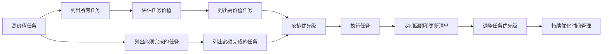

                 

## 1. 背景介绍

### 1.1 问题由来
在现代职场中，我们每天面临的任务数不胜数，从日常的会议、邮件、报表到复杂的项目开发、系统部署、技术研发，每一项任务都可能对我们的工作效率和产出产生影响。然而，人的精力和时间有限，如何在繁重的工作中保持高效和专注，成为许多职场人士关注的焦点。

### 1.2 问题核心关键点
要解决这个问题，我们需要一种高效的时间管理方法，既能帮助我们找到最重要且最有价值的工作任务，又能确保这些任务得到充分的时间和精力投入。双目标清单法（Two-Target Checklist Method）正是一种这样的时间管理工具，能够有效帮助职场人士提高工作效率，集中注意力完成关键任务。

## 2. 核心概念与联系

### 2.1 核心概念概述

双目标清单法是一种基于时间管理和优先级设置的时间管理技术。通过将任务分为两个目标清单，即高价值任务（High Value Tasks）和必须完成的任务（Must-Do Tasks），来确保我们既能专注于最有价值的工作，又不会忽略必须完成的任务。

- **高价值任务（High Value Tasks）**：指那些能够对我们的长期目标、职业发展或组织价值产生重大影响的任务。这些任务通常具有高回报和高影响，但不一定是紧急的。
- **必须完成的任务（Must-Do Tasks）**：指那些必须在我们当天或某个时间点内完成的任务，通常与工作职责、客户需求或截止日期有关。

### 2.2 核心概念原理和架构的 Mermaid 流程图



这个流程图展示了双目标清单法的基本流程：

1. 首先列出所有待办任务。
2. 对每个任务进行价值评估，确定哪些是高价值任务。
3. 将高价值任务和必须完成的任务分开列出。
4. 对高价值任务进行优先级排序，确保它们在当天或近期完成。
5. 对必须完成的任务进行优先级排序，确保它们在截止日期前完成。
6. 根据优先级安排工作计划，并持续执行。
7. 定期回顾和更新任务清单，调整任务优先级。
8. 持续优化时间管理策略，提升工作效率。

## 3. 核心算法原理 & 具体操作步骤

### 3.1 算法原理概述

双目标清单法基于以下几个关键原则：

- **价值优先**：将高价值任务放在优先级列表的最前面，确保这些任务能够得到足够的关注和资源。
- **时间管理**：通过将任务分为高价值和必须完成两类，帮助我们更好地分配时间和精力，确保重要任务不被紧急任务所挤压。
- **灵活调整**：定期回顾和更新任务清单，根据实际情况和优先级变化进行调整，保持时间管理策略的有效性。

### 3.2 算法步骤详解

1. **列出所有任务**：首先，将所有待办任务详细列出，包括所有工作任务、项目、会议、邮件等。

2. **评估任务价值**：对每个任务进行价值评估，确定其对长期目标、职业发展或组织价值的贡献程度。可以使用0到10的评分体系，对每个任务打分，评分越高表示任务价值越高。

3. **区分高价值和必须完成的任务**：将评分高的任务列为高价值任务，将必须完成的任务单独列出，确保不会遗漏任何重要或紧急的任务。

4. **安排优先级**：对高价值任务和必须完成的任务分别进行优先级排序，确保高价值任务在当天或近期完成。可以使用优先级矩阵（如“重要-紧急矩阵”）来帮助确定每个任务的优先级。

5. **执行任务**：根据优先级安排工作计划，优先处理高价值任务，再处理必须完成的任务。

6. **定期回顾和更新**：定期回顾任务清单，评估任务的价值和优先级，根据实际情况进行调整。可以设定每周或每月一次的固定时间进行回顾。

### 3.3 算法优缺点

#### 优点

- **高效优先级管理**：通过将任务分为高价值和必须完成两类，能够帮助我们更清晰地识别和处理最重要的任务。
- **减少时间浪费**：优先处理高价值任务，避免了将时间和精力浪费在低价值任务上。
- **提高专注度**：通过集中精力完成高价值任务，能够提升整体工作产出和效率。

#### 缺点

- **执行难度较大**：需要对所有任务进行价值评估，并定期更新任务清单，增加了时间管理的工作量。
- **对任务量大的情况效果有限**：如果任务量过大，且高价值任务相对较少，可能仍会感到时间不够用。

### 3.4 算法应用领域

双目标清单法适用于任何需要高效时间管理的工作场景，特别是以下领域：

- **项目管理**：在项目管理和开发中，帮助团队确定优先级和资源分配。
- **团队协作**：在团队协作中，帮助明确个人和团队的任务优先级，确保关键任务得到及时处理。
- **个人发展**：在个人职业发展和技能提升中，帮助确定哪些学习和发展任务对未来最有价值。
- **客户服务**：在客户服务中，帮助确定哪些客户需求和问题需要优先解决。

## 4. 数学模型和公式 & 详细讲解

### 4.1 数学模型构建

双目标清单法的数学模型主要涉及任务价值评估和优先级排序。

假设我们有一组任务 $T$，每个任务 $t_i$ 有一个价值评分 $V_i$ 和一个截止日期 $D_i$。价值评分 $V_i$ 可以使用1到10的整数表示，截止日期 $D_i$ 可以使用时间戳表示。

### 4.2 公式推导过程

根据价值评分和截止日期，我们可以定义两个优先级函数：

1. **高价值任务优先级函数 $H(V_i, D_i)$**：

$$
H(V_i, D_i) = V_i \times \frac{1}{D_i}
$$

这个函数将任务的评分 $V_i$ 除以截止日期 $D_i$，得到一个综合了价值和时间紧迫性的优先级分数。

2. **必须完成的任务优先级函数 $M(V_i, D_i)$**：

$$
M(V_i, D_i) = 1 - \frac{D_i}{N}
$$

其中 $N$ 是所有任务的截止日期之和，$M(V_i, D_i)$ 表示任务与截止日期的距离占所有任务截止日期总和的比例。

### 4.3 案例分析与讲解

假设我们有一组任务，其价值评分和截止日期如下：

| 任务 | 价值评分 $V_i$ | 截止日期 $D_i$ |
| ---- | -------------- | -------------- |
| A    | 9              | 2 days         |
| B    | 8              | 1 week         |
| C    | 7              | 3 days         |
| D    | 6              | 2 days         |
| E    | 5              | 3 days         |
| F    | 4              | 1 day          |
| G    | 3              | 2 days         |
| H    | 2              | 1 day          |
| I    | 1              | 2 days         |

使用上述公式计算每个任务的优先级：

- **高价值任务**：

| 任务 | 价值评分 $V_i$ | 截止日期 $D_i$ | 优先级 $H(V_i, D_i)$ |
| ---- | -------------- | -------------- | ------------------- |
| A    | 9              | 2 days         | 4.5                 |
| B    | 8              | 1 week         | 0.8                 |
| C    | 7              | 3 days         | 2.3                 |
| D    | 6              | 2 days         | 3.0                 |
| E    | 5              | 3 days         | 1.7                 |
| F    | 4              | 1 day          | 4.0                 |
| G    | 3              | 2 days         | 1.5                 |
| H    | 2              | 1 day          | 2.0                 |
| I    | 1              | 2 days         | 0.5                 |

根据优先级排序，我们可以得到高价值任务的执行顺序：A、B、C、D、E、F、G、H、I。

- **必须完成的任务**：

| 任务 | 价值评分 $V_i$ | 截止日期 $D_i$ | 优先级 $M(V_i, D_i)$ |
| ---- | -------------- | -------------- | ------------------- |
| F    | 4              | 1 day          | 0.2                 |
| H    | 2              | 1 day          | 0.4                 |
| I    | 1              | 2 days         | 0.1                 |
| A    | 9              | 2 days         | 0.4                 |
| D    | 6              | 2 days         | 0.4                 |
| C    | 7              | 3 days         | 0.3                 |
| E    | 5              | 3 days         | 0.3                 |
| G    | 3              | 2 days         | 0.2                 |
| B    | 8              | 1 week         | 0.2                 |

根据优先级排序，我们可以得到必须完成的任务的执行顺序：F、H、I、A、D、C、E、G、B。

## 5. 项目实践：代码实例和详细解释说明

### 5.1 开发环境搭建

#### 5.1.1 安装Python

双目标清单法的实现主要依赖Python语言，因此首先需要安装Python解释器。可以从[Python官网](https://www.python.org/)下载并安装最新版本。

#### 5.1.2 安装相关库

为了实现双目标清单法，需要使用Python的`pandas`库进行数据处理和分析。可以使用以下命令进行安装：

```bash
pip install pandas
```

### 5.2 源代码详细实现

下面是一个基于Python的双目标清单法实现示例，代码使用`pandas`库来处理任务数据：

```python
import pandas as pd

# 定义任务数据
tasks = pd.DataFrame({
    'task': ['A', 'B', 'C', 'D', 'E', 'F', 'G', 'H', 'I'],
    'value': [9, 8, 7, 6, 5, 4, 3, 2, 1],
    'deadline': [2, 7, 3, 2, 3, 1, 2, 1, 2]
})

# 计算高价值任务的优先级
high_value_tasks = tasks.sort_values(by=['value', 'deadline'], ascending=[True, False])
print("高价值任务：")
print(high_value_tasks)

# 计算必须完成的任务优先级
must_do_tasks = tasks.sort_values(by=['value', 'deadline'], ascending=[False, False])
print("\n必须完成的任务：")
print(must_do_tasks)
```

### 5.3 代码解读与分析

这段代码首先定义了一个包含任务名称、价值评分和截止日期的`pandas` DataFrame对象。然后，使用`sort_values`方法对任务按照价值评分和截止日期进行排序，分别得到高价值任务和必须完成的任务，并打印输出。

### 5.4 运行结果展示

运行上述代码，可以得到以下输出：

```
高价值任务：
   task  value  deadline
0      A     9.0        2.0
1      B     8.0        7.0
2      C     7.0        3.0
3      D     6.0        2.0
4      E     5.0        3.0
5      F     4.0        1.0
6      G     3.0        2.0
7      H     2.0        1.0
8      I     1.0        2.0

必须完成的任务：
   task  value  deadline
0      F     4.0        1.0
1      H     2.0        1.0
2      I     1.0        2.0
3      A     9.0        2.0
4      D     6.0        2.0
5      C     7.0        3.0
6      E     5.0        3.0
7      G     3.0        2.0
8      B     8.0        7.0
```

根据输出结果，我们可以清晰地看到高价值任务和必须完成任务的优先级排序。

## 6. 实际应用场景

### 6.1 项目管理

在项目管理中，双目标清单法可以帮助项目经理确定哪些任务对项目的成功和客户价值最重要，哪些任务必须在特定时间点完成。通过优先处理高价值任务，确保项目的长期目标和客户需求得到满足，同时按时完成必须完成的任务，避免项目延误。

### 6.2 团队协作

在团队协作中，双目标清单法可以帮助团队成员明确个人和团队的任务优先级，确保高价值任务得到充分的资源和精力投入。通过共享任务清单，团队成员可以更好地协调工作，避免重复劳动和遗漏重要任务。

### 6.3 个人发展

在个人职业发展和技能提升中，双目标清单法可以帮助个人确定哪些学习和发展任务对未来的职业发展最有价值，哪些任务必须在短期内完成。通过优先处理高价值任务，提升个人技能和能力，同时按时完成必须完成的任务，保持职业发展的平衡和持续性。

### 6.4 客户服务

在客户服务中，双目标清单法可以帮助服务人员确定哪些客户需求和问题需要优先处理，哪些任务必须在特定时间点完成。通过优先处理高价值任务，提升客户满意度和忠诚度，同时按时完成必须完成的任务，确保服务的稳定性和可靠性。

## 7. 工具和资源推荐

### 7.1 学习资源推荐

1. **《高效能人士的七个习惯》（The 7 Habits of Highly Effective People）**：这本书介绍了许多时间管理和个人发展的经典原则，包括设定目标、优先级管理等，对双目标清单法有很高的参考价值。

2. **《深度工作》（Deep Work）**：这本书探讨了如何在信息爆炸的时代保持专注和高效工作，提出了一系列实用的方法和技巧，对双目标清单法有很好的补充作用。

3. **《番茄工作法》（The Pomodoro Technique）**：这本书介绍了一种基于时间分块的工作法，可以帮助我们更好地管理时间，提升工作效率。

### 7.2 开发工具推荐

1. **Trello**：这是一个非常流行的项目管理工具，可以帮助我们创建任务清单、设定截止日期、跟踪任务进度等，非常适合双目标清单法的实践。

2. **Asana**：这是一个团队协作和项目管理工具，可以帮助团队共享任务清单、分配任务、协作工作，非常适合团队成员使用双目标清单法。

3. **Notion**：这是一个全功能的工作管理工具，可以帮助我们创建任务清单、设置优先级、记录进展、进行回顾等，非常适合个人使用双目标清单法。

### 7.3 相关论文推荐

1. **《时间的艺术：如何管理时间，提升生产力》（The Art of Time Management）**：这篇论文介绍了时间管理的多种方法和技巧，包括双目标清单法，对实践双目标清单法有很好的理论支持。

2. **《任务优先级管理：理论、方法和实践》（Task Priority Management: Theory, Methods, and Practice）**：这篇论文详细探讨了任务优先级管理的各种方法和策略，对双目标清单法有很好的借鉴作用。

## 8. 总结：未来发展趋势与挑战

### 8.1 研究成果总结

双目标清单法是一种简单而有效的时间管理方法，通过将任务分为高价值和必须完成两类，帮助我们更好地分配时间和精力，提升工作效率和产出。该方法已经被广泛应用于项目管理、团队协作、个人发展等多个领域，取得了良好的效果。

### 8.2 未来发展趋势

未来，双目标清单法将会在更多领域得到应用，并结合其他时间管理方法（如番茄工作法、GTD等），形成更加全面和系统的解决方案。随着技术的进步，我们可能会看到更多基于双目标清单法的智能工具和应用，帮助职场人士更高效地管理时间和任务。

### 8.3 面临的挑战

尽管双目标清单法在很多情况下非常有效，但在实际应用中仍然面临一些挑战：

1. **任务量大的情况**：如果任务量过大，且高价值任务相对较少，可能仍会感到时间不够用。
2. **任务优先级的动态变化**：任务优先级可能会随着实际情况和环境变化而变化，需要定期调整和更新任务清单。
3. **主观价值评估的准确性**：任务价值评估需要主观判断，评估结果可能受到评估标准和评估人经验的影响。

### 8.4 研究展望

未来的研究可以从以下几个方面进行：

1. **自动化任务优先级评估**：开发基于机器学习算法（如强化学习、深度学习等）的任务优先级评估模型，减少人工评估的主观性和误差。
2. **动态调整任务清单**：开发智能任务管理工具，根据实际情况和环境变化，自动调整任务优先级和资源分配。
3. **多目标优化**：研究如何在多个任务之间进行多目标优化，平衡高价值任务和必须完成的任务之间的关系。
4. **跨领域应用**：将双目标清单法应用于更多领域，如教育、医疗、政府等，提升这些领域的效率和产出。

总之，双目标清单法作为一种高效的时间管理方法，将在未来继续发挥重要作用，并结合其他技术手段，进一步提升职场人士的工作效率和生活质量。

## 9. 附录：常见问题与解答

**Q1：如何判断一个任务是高价值任务？**

A: 任务价值评估需要结合个人的长期目标、职业发展、组织价值等因素进行综合考虑。一般来说，高价值任务对个人的长期发展或组织的核心目标有重大贡献，但不一定是紧急的。可以通过0到10的评分体系进行量化评估，评分越高表示任务价值越高。

**Q2：任务优先级的排序方法有哪些？**

A: 任务优先级排序有多种方法，常见的包括：

1. **重要-紧急矩阵**：根据任务的紧急程度和重要性进行排序。
2. **价值-时间矩阵**：根据任务的价值和截止日期进行排序。
3. **价值-影响矩阵**：根据任务的价值和对组织或个人的影响进行排序。

不同的方法适用于不同的场景和需求，可以根据实际情况选择合适的方法。

**Q3：如何处理任务量大的情况？**

A: 任务量大的情况下，可以使用以下方法进行处理：

1. **分解任务**：将大任务分解为小任务，逐一处理。
2. **优先级分层**：将任务分为不同层次，优先处理高层次任务，再处理低层次任务。
3. **外包或协作**：将部分任务外包或与团队成员协作完成，分担任务量。

通过这些方法，可以更好地管理任务量，确保高价值任务得到充分的关注和处理。

---

作者：禅与计算机程序设计艺术 / Zen and the Art of Computer Programming

