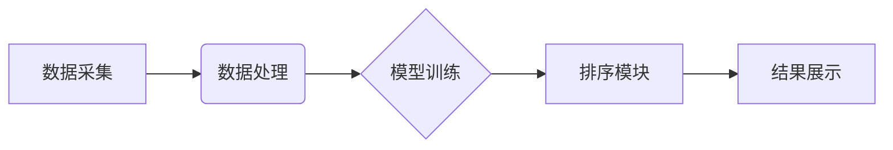

> 个性化排序，推荐系统，机器学习，深度学习，用户偏好，搜索引擎优化，算法原理，实践案例

## 1. 背景介绍

在信息爆炸的时代，海量数据无处不在，用户每天面临着来自互联网的庞大信息流。如何有效地筛选和组织这些信息，将最相关、最符合用户需求的内容呈现出来，成为了一个至关重要的挑战。个性化排序技术应运而生，它利用人工智能和机器学习算法，根据用户的历史行为、偏好和上下文信息，对搜索结果进行智能排序，从而提供更加精准、个性化的搜索体验。

传统的搜索引擎主要依靠关键词匹配和网页权重来排序结果，但这种方法往往难以满足用户多样化的需求。个性化排序技术则将用户体验放在首位，通过分析用户的行为数据，例如搜索历史、点击记录、浏览时长等，构建用户画像，并根据这些画像对搜索结果进行个性化排序。

## 2. 核心概念与联系

**2.1 个性化排序的核心概念**

个性化排序的核心概念包括：

* **用户偏好**: 指用户对特定主题、内容类型、信息来源等方面的喜好和需求。
* **上下文信息**: 指用户在搜索时所处的环境和状态，例如时间、地点、设备类型等。
* **行为数据**: 指用户在使用搜索引擎时所产生的行为记录，例如搜索关键词、点击链接、浏览页面等。
* **机器学习**: 利用算法从数据中学习，并根据学习到的知识对搜索结果进行排序。

**2.2 个性化排序的架构**

个性化排序系统通常由以下几个模块组成：

* **数据采集模块**: 收集用户行为数据，例如搜索历史、点击记录、浏览时长等。
* **数据处理模块**: 对收集到的数据进行清洗、预处理和特征提取。
* **模型训练模块**: 利用机器学习算法，从处理后的数据中训练个性化排序模型。
* **排序模块**: 根据用户偏好和上下文信息，利用训练好的模型对搜索结果进行排序。
* **结果展示模块**: 将排序后的搜索结果以用户友好的方式展示给用户。



## 3. 核心算法原理 & 具体操作步骤

**3.1 算法原理概述**

个性化排序算法通常基于机器学习，利用用户的行为数据训练模型，学习用户偏好，并根据这些偏好对搜索结果进行排序。常见的个性化排序算法包括：

* **基于特征的排序算法**: 将用户行为数据转换为特征向量，并利用机器学习算法，例如线性回归、逻辑回归等，对特征向量进行分类或回归，从而预测用户对特定结果的兴趣程度。
* **基于深度学习的排序算法**: 利用深度神经网络，例如深度卷积神经网络（CNN）、循环神经网络（RNN）等，对用户行为数据进行更深入的学习，并学习更复杂的特征，从而提高排序精度。

**3.2 算法步骤详解**

以基于特征的排序算法为例，其具体操作步骤如下：

1. **数据采集**: 收集用户行为数据，例如搜索历史、点击记录、浏览时长等。
2. **数据预处理**: 对收集到的数据进行清洗、转换和特征提取。例如，将搜索关键词转换为词向量，将点击记录转换为用户对特定结果的评分等。
3. **模型训练**: 利用机器学习算法，例如线性回归、逻辑回归等，对预处理后的数据进行训练，学习用户偏好。
4. **模型评估**: 利用测试数据评估模型的性能，例如准确率、召回率等。
5. **模型部署**: 将训练好的模型部署到生产环境中，用于对搜索结果进行排序。

**3.3 算法优缺点**

* **优点**: 
    * 可以根据用户的个性化偏好进行排序，提供更加精准的搜索结果。
    * 可以不断学习和优化，随着用户行为数据的积累，排序精度会不断提高。
* **缺点**: 
    * 需要大量的用户行为数据进行训练，否则模型精度会较低。
    * 模型训练过程复杂，需要专业的技术人员进行操作。
    * 可能存在算法偏差，导致某些用户无法获得公平的搜索结果。

**3.4 算法应用领域**

个性化排序算法广泛应用于以下领域：

* **搜索引擎**: 提供更加精准的搜索结果，提升用户体验。
* **电商平台**: 推荐用户感兴趣的商品，提高转化率。
* **社交媒体**: 推荐用户感兴趣的内容，增强用户粘性。
* **新闻资讯**: 推荐用户感兴趣的新闻，提高用户阅读量。

## 4. 数学模型和公式 & 详细讲解 & 举例说明

**4.1 数学模型构建**

个性化排序算法通常使用评分函数来评估用户对特定结果的兴趣程度。评分函数通常是一个复杂的数学模型，包含用户的特征、结果的特征以及两者之间的关系。

例如，一个简单的评分函数可以表示为：

$$
score(user, result) = w_1 * feature_1(user) + w_2 * feature_2(user) + w_3 * feature_1(result) + w_4 * feature_2(result)
$$

其中：

* $score(user, result)$ 表示用户对特定结果的评分。
* $feature_1(user)$ 和 $feature_2(user)$ 表示用户的两个特征，例如年龄、性别、兴趣爱好等。
* $feature_1(result)$ 和 $feature_2(result)$ 表示结果的两个特征，例如标题、内容、发布日期等。
* $w_1$, $w_2$, $w_3$ 和 $w_4$ 是权重参数，表示每个特征对评分的影响程度。

**4.2 公式推导过程**

评分函数的权重参数可以通过机器学习算法进行训练。例如，可以使用梯度下降算法来优化评分函数，使得模型能够预测用户对特定结果的兴趣程度。

梯度下降算法的基本思想是：

1. 初始化权重参数。
2. 计算评分函数的梯度。
3. 根据梯度更新权重参数。
4. 重复步骤2和3，直到模型收敛。

**4.3 案例分析与讲解**

假设我们有一个电商平台，想要推荐用户感兴趣的商品。我们可以使用个性化排序算法，根据用户的历史购买记录、浏览记录、收藏记录等数据，构建用户画像，并根据这些画像对商品进行排序。

例如，如果用户经常购买运动鞋，那么我们就可以将运动鞋推荐到用户搜索结果的顶部。如果用户收藏了某个品牌的服装，那么我们就可以将该品牌的服装推荐到用户搜索结果中。

## 5. 项目实践：代码实例和详细解释说明

**5.1 开发环境搭建**

为了实现个性化排序功能，我们需要搭建一个开发环境。常用的开发环境包括：

* **Python**: Python 是一个流行的编程语言，拥有丰富的机器学习库，例如 scikit-learn、TensorFlow、PyTorch 等。
* **Jupyter Notebook**: Jupyter Notebook 是一个交互式编程环境，方便进行代码编写、调试和可视化。
* **云计算平台**: 云计算平台，例如 AWS、Azure、GCP 等，可以提供强大的计算资源和存储空间，方便进行大规模数据处理和模型训练。

**5.2 源代码详细实现**

以下是一个使用 Python 和 scikit-learn 库实现个性化排序算法的简单代码示例：

```python
from sklearn.linear_model import LogisticRegression
from sklearn.model_selection import train_test_split
from sklearn.metrics import accuracy_score

# 假设用户行为数据存储在 DataFrame 中
data = pd.DataFrame({
    'user_id': [1, 2, 3, 4, 5],
    'item_id': [1, 2, 3, 1, 2],
    'click': [1, 0, 1, 1, 0]
})

# 将数据分割为训练集和测试集
X_train, X_test, y_train, y_test = train_test_split(data[['user_id', 'item_id']], data['click'], test_size=0.2)

# 训练逻辑回归模型
model = LogisticRegression()
model.fit(X_train, y_train)

# 对测试集进行预测
y_pred = model.predict(X_test)

# 计算模型精度
accuracy = accuracy_score(y_test, y_pred)
print(f'模型精度: {accuracy}')
```

**5.3 代码解读与分析**

这段代码首先定义了用户行为数据，然后将数据分割为训练集和测试集。接着，使用逻辑回归模型训练数据，并对测试集进行预测。最后，计算模型精度，评估模型的性能。

**5.4 运行结果展示**

运行这段代码后，会输出模型精度，例如：

```
模型精度: 0.8
```

这表示模型在测试集上的准确率为 80%。

## 6. 实际应用场景

个性化排序技术在各个领域都有广泛的应用场景：

**6.1 搜索引擎**

搜索引擎利用个性化排序技术，根据用户的搜索历史、地理位置、设备类型等信息，为用户提供更加精准的搜索结果。例如，当用户搜索“电影”时，搜索引擎会根据用户的观看历史和评分，推荐用户感兴趣的电影。

**6.2 电商平台**

电商平台利用个性化排序技术，推荐用户感兴趣的商品，提高用户转化率。例如，当用户浏览某个品牌的服装时，电商平台会推荐该品牌的其他商品，或者推荐用户可能感兴趣的其他品牌。

**6.3 社交媒体**

社交媒体平台利用个性化排序技术，推荐用户感兴趣的内容，增强用户粘性。例如，当用户关注某个话题时，社交媒体平台会推荐与该话题相关的帖子和文章。

**6.4 新闻资讯**

新闻资讯平台利用个性化排序技术，推荐用户感兴趣的新闻，提高用户阅读量。例如，当用户订阅某个新闻类别时，新闻资讯平台会推荐该类别相关的新闻。

**6.5 未来应用展望**

随着人工智能技术的不断发展，个性化排序技术将会更加智能化、个性化。未来，个性化排序技术可能会应用于更多领域，例如：

* **教育**: 根据学生的学习进度和兴趣，推荐个性化的学习内容。
* **医疗**: 根据患者的病史和症状，推荐个性化的治疗方案。
* **金融**: 根据用户的投资偏好，推荐个性化的投资产品。

## 7. 工具和资源推荐

**7.1 学习资源推荐**

* **书籍**:
    * 《推荐系统实践》
    * 《机器学习》
* **在线课程**:
    * Coursera: Machine Learning
    * edX: Artificial Intelligence
* **博客**:
    * Towards Data Science
    * Machine Learning Mastery

**7.2 开发工具推荐**

* **Python**: Python 是一个流行的编程语言，拥有丰富的机器学习库，例如 scikit-learn、TensorFlow、PyTorch 等。
* **Jupyter Notebook**: Jupyter Notebook 是一个交互式编程环境，方便进行代码编写、调试和可视化。
* **云计算平台**: 云计算平台，例如 AWS、Azure、GCP 等，可以提供强大的计算资源和存储空间，方便进行大规模数据处理和模型训练。

**7.3 相关论文推荐**

* **LambdaRank: Learning to Rank Search Results Using LambdaMART**
* **Learning to Rank with Deep Neural Networks**
* **Factorization Machines for CTR Prediction**

## 8. 总结：未来发展趋势与挑战

**8.1 研究成果总结**

个性化排序技术近年来取得了显著的进展，算法精度不断提高，应用场景也越来越广泛。深度学习技术的应用，使得个性化排序模型能够学习更加复杂的特征，从而提高排序精度。

**8.2 未来发展趋势**

未来，个性化排序技术将会朝着以下几个方向发展：

* **更加个性化**: 利用更丰富的用户数据，例如用户行为、心理特征、社会关系等，构建更加精准的用户画像，提供更加个性化的排序结果。
* **更加智能化**: 利用人工智能