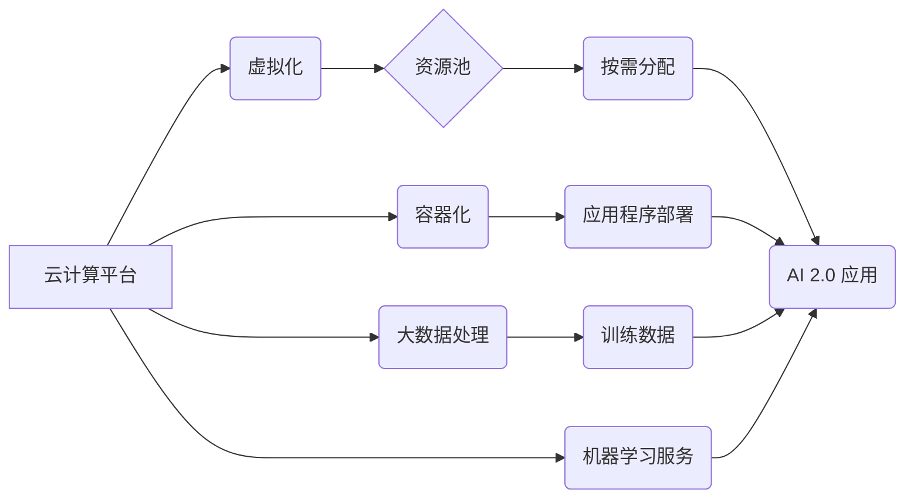

> 云计算, AI 2.0, 虚拟化, 容器化, 大数据, 机器学习, 深度学习, 资源弹性, 可扩展性

## 1. 背景介绍

人工智能（AI）正以惊人的速度发展，从语音识别到图像处理，再到自然语言理解，AI 正在改变着我们生活的方方面面。随着 AI 应用的不断扩展，对计算资源的需求也呈指数级增长。传统的基础设施架构难以满足 AI 2.0 应用对计算能力、存储空间和网络带宽的巨大需求。

云计算应运而生，为 AI 2.0 应用提供了灵活、可扩展的资源平台。云计算通过将计算资源虚拟化，可以按需提供计算、存储和网络服务，满足 AI 应用的动态需求。

## 2. 核心概念与联系

云计算的核心概念包括虚拟化、容器化、大数据处理和机器学习。

* **虚拟化:** 将物理资源（如服务器、存储设备）抽象成虚拟资源，可以实现资源的动态分配和利用。
* **容器化:** 将应用程序及其依赖项打包成一个独立的单元，可以方便地部署和管理应用程序。
* **大数据处理:** 云计算平台提供大数据处理能力，可以处理海量数据，为 AI 应用提供训练数据和运行环境。
* **机器学习:** 云计算平台提供机器学习服务，可以帮助开发者构建和部署机器学习模型。

**云计算与 AI 2.0 应用的联系:**



## 3. 核心算法原理 & 具体操作步骤

### 3.1  算法原理概述

云计算平台利用多种算法来实现资源的虚拟化、容器化、调度和管理。

* **虚拟化技术:** 使用虚拟机监控程序（hypervisor）将物理硬件资源分割成多个虚拟机，每个虚拟机可以独立运行操作系统和应用程序。
* **容器技术:** 使用容器引擎（如 Docker）将应用程序及其依赖项打包成容器，容器可以轻量级地运行在任何支持容器技术的平台上。
* **调度算法:** 根据资源可用性和应用程序需求，将应用程序分配到合适的虚拟机或容器上。常见的调度算法包括优先级调度、轮转调度和最短作业优先调度。

### 3.2  算法步骤详解

**虚拟化技术:**

1. 安装虚拟机监控程序（hypervisor）在物理服务器上。
2. 将物理硬件资源（CPU、内存、存储）划分成多个虚拟机。
3. 在每个虚拟机上安装操作系统和应用程序。
4. 通过虚拟机监控程序管理虚拟机的运行状态和资源分配。

**容器技术:**

1. 使用容器引擎（如 Docker）将应用程序及其依赖项打包成容器镜像。
2. 将容器镜像上传到容器注册中心。
3. 在目标平台上运行容器引擎，拉取容器镜像并运行容器。
4. 通过容器引擎管理容器的运行状态和资源分配。

**调度算法:**

1. 收集应用程序的资源需求和运行状态信息。
2. 收集虚拟机或容器的资源可用性和运行状态信息。
3. 根据调度算法，将应用程序分配到合适的虚拟机或容器上。
4. 监控应用程序和资源的运行状态，并根据需要调整资源分配。

### 3.3  算法优缺点

**虚拟化技术:**

* **优点:** 提高硬件资源利用率，简化系统管理，增强系统安全性。
* **缺点:** 虚拟化层增加系统开销，性能相对较低。

**容器技术:**

* **优点:** 轻量级、快速启动、易于部署和管理。
* **缺点:** 容器隔离性相对较弱，安全性需要加强。

**调度算法:**

* **优点:** 提高资源利用率，优化应用程序性能。
* **缺点:** 调度算法的复杂度较高，需要根据实际情况进行调整。

### 3.4  算法应用领域

* **云计算平台:** 提供虚拟化、容器化、调度和管理服务。
* **大数据处理:** 处理海量数据，为 AI 应用提供训练数据和运行环境。
* **机器学习:** 构建和部署机器学习模型。
* **软件开发:** 提高软件开发效率，简化软件部署和管理。

## 4. 数学模型和公式 & 详细讲解 & 举例说明

### 4.1  数学模型构建

云计算平台的资源调度可以建模为一个优化问题，目标是最大化资源利用率，同时满足应用程序的性能需求。

**资源利用率:**

$$
Utilization = \frac{Total \ Resource \ Used}{Total \ Available \ Resource}
$$

**性能需求:**

$$
Performance = f(CPU, Memory, Network)
$$

其中，$f$ 是性能函数，$CPU$, $Memory$, $Network$ 分别表示 CPU 资源、内存资源和网络带宽。

### 4.2  公式推导过程

为了最大化资源利用率，可以采用贪婪算法或动态规划算法进行资源调度。

**贪婪算法:**

1. 按照应用程序的优先级排序。
2. 将优先级最高的应用程序分配到合适的资源上。
3. 重复步骤 2，直到所有应用程序都被分配到资源上。

**动态规划算法:**

1. 将资源调度问题划分为多个子问题。
2. 对于每个子问题，找到最优的资源分配方案。
3. 将子问题的最优方案组合起来，得到整个问题的最优方案。

### 4.3  案例分析与讲解

假设有 3 个应用程序，分别需要 2 个 CPU 核、1 GB 内存和 10 Mbps 网络带宽。有 4 个虚拟机，每个虚拟机拥有 4 个 CPU 核、2 GB 内存和 20 Mbps 网络带宽。

使用贪婪算法，可以按照应用程序的优先级将资源分配如下：

* 应用程序 1：虚拟机 1
* 应用程序 2：虚拟机 2
* 应用程序 3：虚拟机 3

使用动态规划算法，可以找到更优的资源分配方案，例如将应用程序 1 和应用程序 2 分配到同一个虚拟机上，以提高资源利用率。

## 5. 项目实践：代码实例和详细解释说明

### 5.1  开发环境搭建

* 操作系统：Ubuntu 20.04
* 云计算平台：AWS
* 虚拟化工具：VirtualBox
* 容器引擎：Docker

### 5.2  源代码详细实现

```python
# 云计算平台资源调度程序

import random

class Application:
    def __init__(self, cpu, memory, network):
        self.cpu = cpu
        self.memory = memory
        self.network = network
        self.priority = random.randint(1, 10)

class VirtualMachine:
    def __init__(self, cpu, memory, network):
        self.cpu = cpu
        self.memory = memory
        self.network = network
        self.applications = []

def schedule_applications(applications, virtual_machines):
    # 贪婪算法
    applications.sort(key=lambda x: x.priority, reverse=True)
    for app in applications:
        for vm in virtual_machines:
            if vm.cpu >= app.cpu and vm.memory >= app.memory and vm.network >= app.network:
                vm.applications.append(app)
                break

# 示例代码
applications = [
    Application(cpu=2, memory=1, network=10),
    Application(cpu=1, memory=0.5, network=5),
    Application(cpu=3, memory=2, network=15),
]

virtual_machines = [
    VirtualMachine(cpu=4, memory=2, network=20),
    VirtualMachine(cpu=4, memory=2, network=20),
    VirtualMachine(cpu=4, memory=2, network=20),
]

schedule_applications(applications, virtual_machines)

for vm in virtual_machines:
    print(f"虚拟机 {vm.cpu} CPU, {vm.memory} 内存, {vm.network} 网络带宽")
    for app in vm.applications:
        print(f"  应用程序 {app.cpu} CPU, {app.memory} 内存, {app.network} 网络带宽")
```

### 5.3  代码解读与分析

该代码实现了一个简单的云计算平台资源调度程序，使用贪婪算法将应用程序分配到虚拟机上。

* `Application` 类表示一个应用程序，包含 CPU、内存和网络带宽需求以及优先级。
* `VirtualMachine` 类表示一个虚拟机，包含 CPU、内存和网络带宽资源以及分配的应用程序列表。
* `schedule_applications` 函数根据应用程序的优先级和虚拟机的资源情况，将应用程序分配到虚拟机上。

### 5.4  运行结果展示

运行该代码后，会输出每个虚拟机分配的应用程序信息，以及每个应用程序的资源需求。

## 6. 实际应用场景

### 6.1  机器学习训练

云计算平台为机器学习训练提供了海量数据和强大的计算资源。

* **数据存储:** 云存储服务可以存储海量训练数据，并提供数据访问和管理工具。
* **计算资源:** 云计算平台可以提供大量的 CPU、GPU 和内存资源，加速机器学习模型的训练。
* **机器学习服务:** 云平台提供机器学习服务，可以帮助开发者构建和部署机器学习模型。

### 6.2  深度学习模型推理

深度学习模型推理需要大量的计算资源和低延迟。云计算平台可以提供高性能计算资源和弹性伸缩能力，满足深度学习模型推理的需求。

* **GPU 服务器:** 云平台提供高性能 GPU 服务器，可以加速深度学习模型的推理。
* **边缘计算:** 云平台可以将深度学习模型部署到边缘设备上，实现低延迟的推理。

### 6.3  大数据分析

云计算平台可以处理海量数据，并提供大数据分析工具，帮助企业洞察数据，发现商业价值。

* **大数据处理引擎:** 云平台提供大数据处理引擎，可以处理海量数据，并进行数据清洗、转换和分析。
* **数据可视化工具:** 云平台提供数据可视化工具，可以帮助用户直观地了解数据趋势和模式。

### 6.4  未来应用展望

云计算技术将继续发展，为 AI 2.0 应用提供更强大的支持。

* **更强大的计算资源:** 云平台将提供更强大的计算资源，例如量子计算和人工智能加速器。
* **更智能的资源调度:** 云平台将采用更智能的资源调度算法，提高资源利用率和应用程序性能。
* **更丰富的 AI 服务:** 云平台将提供更丰富的 AI 服务，例如自然语言处理、计算机视觉和语音识别。

## 7. 工具和资源推荐

### 7.1  学习资源推荐

* **书籍:**
    * 《云计算：原理、架构和应用》
    * 《人工智能：一种现代方法》
* **在线课程:**
    * Coursera: 云计算和人工智能课程
    * edX: 云计算和人工智能课程

### 7.2  开发工具推荐

* **云计算平台:** AWS, Azure, Google Cloud Platform
* **容器引擎:** Docker, Kubernetes
* **机器学习框架:** TensorFlow, PyTorch

### 7.3  相关论文推荐

* **云计算与 AI 的结合:**
    * "Cloud Computing for Artificial Intelligence"
    * "AI on Cloud: Challenges and Opportunities"
* **云计算平台的资源调度:**
    * "Resource Allocation in Cloud Computing Environments"
    * "Dynamic Resource Allocation in Cloud Computing"

## 8. 总结：未来发展趋势与挑战

### 8.1  