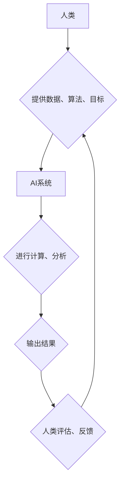

> 人工智能，未来就业，技能发展，人类计算，自动化，数据分析，机器学习，深度学习，自然语言处理

## 1. 背景介绍

人工智能（AI）正以惊人的速度发展，其影响力正在深刻地改变着我们的生活和工作方式。从自动驾驶汽车到智能家居，从医疗诊断到金融交易，AI技术正在各个领域发挥着越来越重要的作用。然而，这种快速发展也引发了人们对未来就业市场和技能发展趋势的担忧。

一方面，AI技术的自动化能力将取代一些传统工作岗位，例如数据录入、客服等。另一方面，AI技术也创造了新的工作机会，例如AI工程师、数据科学家、AI伦理学家等。因此，我们需要认真思考如何在AI时代保持就业竞争力，并为未来发展做好准备。

## 2. 核心概念与联系

**2.1 人类计算**

人类计算是指人类利用自身的认知能力和创造力进行计算和解决问题。它包括逻辑推理、抽象思维、语言理解、情感判断等多种能力。

**2.2 人工智能**

人工智能是指模拟人类智能行为的计算机系统。它通过学习和分析数据，不断提高其决策和解决问题的能力。

**2.3 人工智能与人类计算的联系**

人工智能的发展离不开人类的参与和引导。人类为AI系统提供数据、算法和目标，并对AI系统的输出进行评估和反馈。同时，AI技术也能够帮助人类提高计算效率、增强决策能力，从而提升人类计算的水平。

**2.4  AI时代的人类计算**

在AI时代，人类计算将更加注重与AI系统的协作和融合。人类将发挥其创造力、批判性思维和情感智能等优势，与AI系统共同解决复杂问题，创造新的价值。



## 3. 核心算法原理 & 具体操作步骤

**3.1 算法原理概述**

机器学习算法是人工智能的核心技术之一，它通过学习数据，建立模型，并根据模型预测未来结果。常见的机器学习算法包括：

* **监督学习:** 利用标记数据训练模型，例如分类和回归问题。
* **无监督学习:** 利用未标记数据发现数据中的模式，例如聚类和降维。
* **强化学习:** 通过试错学习，在环境中获得最大奖励。

**3.2 算法步骤详解**

以监督学习为例，其基本步骤如下：

1. **数据收集和预处理:** 收集相关数据，并进行清洗、转换、特征工程等预处理操作。
2. **模型选择:** 根据具体问题选择合适的机器学习算法模型。
3. **模型训练:** 利用标记数据训练模型，调整模型参数，使其能够准确预测结果。
4. **模型评估:** 利用测试数据评估模型的性能，例如准确率、召回率、F1-score等。
5. **模型部署:** 将训练好的模型部署到实际应用场景中，用于预测和决策。

**3.3 算法优缺点**

* **优点:**

    * 自动化学习能力，无需人工编程。
    * 能够处理海量数据，发现隐藏模式。
    * 性能不断提升，应用范围不断扩大。

* **缺点:**

    * 需要大量数据进行训练，数据质量对模型性能影响较大。
    * 模型解释性较差，难以理解模型决策过程。
    * 容易受到数据偏差的影响，导致模型偏见。

**3.4 算法应用领域**

机器学习算法广泛应用于各个领域，例如：

* **图像识别:** 人脸识别、物体检测、图像分类。
* **自然语言处理:** 文本分类、情感分析、机器翻译。
* **推荐系统:** 商品推荐、内容推荐、用户画像。
* **金融预测:** 股票预测、信用风险评估、欺诈检测。
* **医疗诊断:** 疾病预测、影像分析、药物研发。

## 4. 数学模型和公式 & 详细讲解 & 举例说明

**4.1 数学模型构建**

机器学习算法通常基于数学模型进行构建。例如，线性回归模型可以表示为：

$$y = w_0 + w_1x_1 + w_2x_2 + ... + w_nx_n + \epsilon$$

其中：

* $y$ 是预测结果
* $w_0, w_1, ..., w_n$ 是模型参数
* $x_1, x_2, ..., x_n$ 是输入特征
* $\epsilon$ 是误差项

**4.2 公式推导过程**

模型参数的学习过程通常使用梯度下降算法进行优化。梯度下降算法的目标是找到使模型预测结果与真实结果误差最小化的参数值。

**4.3 案例分析与讲解**

例如，在图像分类任务中，我们可以使用卷积神经网络（CNN）模型进行训练。CNN模型通过多个卷积层和池化层提取图像特征，并最终使用全连接层进行分类。

## 5. 项目实践：代码实例和详细解释说明

**5.1 开发环境搭建**

可以使用Python语言和相关的机器学习库，例如TensorFlow、PyTorch等，进行项目开发。

**5.2 源代码详细实现**

以下是一个简单的线性回归模型的Python代码实现：

```python
import numpy as np
from sklearn.linear_model import LinearRegression

# 生成随机数据
X = np.random.rand(100, 1)
y = 2 * X + 1 + np.random.randn(100, 1)

# 创建线性回归模型
model = LinearRegression()

# 训练模型
model.fit(X, y)

# 预测结果
y_pred = model.predict(X)

# 打印模型参数
print(model.coef_)
print(model.intercept_)
```

**5.3 代码解读与分析**

* 首先，我们生成随机数据，其中X是输入特征，y是目标变量。
* 然后，我们创建线性回归模型，并使用fit()方法训练模型。
* 训练完成后，我们可以使用predict()方法预测新的数据。
* 最后，我们可以打印模型参数，例如权重和截距。

**5.4 运行结果展示**

运行代码后，会输出模型的权重和截距，这些参数代表了模型对输入特征和目标变量之间的关系。

## 6. 实际应用场景

**6.1 医疗诊断**

AI技术可以帮助医生更快、更准确地诊断疾病。例如，AI算法可以分析医学影像，识别肿瘤和其他异常情况。

**6.2 金融风险管理**

AI技术可以帮助金融机构识别和管理风险。例如，AI算法可以分析客户数据，预测客户违约风险。

**6.3 自动驾驶汽车**

AI技术是自动驾驶汽车的核心技术之一。AI算法可以帮助汽车感知周围环境，做出决策，并控制车辆行驶。

**6.4 未来应用展望**

AI技术的发展将带来更多新的应用场景，例如：

* **个性化教育:** AI可以根据学生的学习情况提供个性化的学习方案。
* **智能家居:** AI可以帮助我们管理家居设备，提高生活效率。
* **机器人服务:** AI可以赋予机器人更强的智能，使其能够更好地服务人类。

## 7. 工具和资源推荐

**7.1 学习资源推荐**

* **在线课程:** Coursera、edX、Udacity等平台提供丰富的AI课程。
* **书籍:** 《深度学习》、《机器学习实战》等书籍是学习AI的基础教材。
* **开源项目:** TensorFlow、PyTorch等开源项目可以帮助我们实践AI技术。

**7.2 开发工具推荐**

* **Python:** Python是AI开发最常用的编程语言。
* **TensorFlow:** TensorFlow是一个开源的机器学习框架。
* **PyTorch:** PyTorch是一个开源的深度学习框架。

**7.3 相关论文推荐**

* **《ImageNet Classification with Deep Convolutional Neural Networks》**
* **《Attention Is All You Need》**
* **《BERT: Pre-training of Deep Bidirectional Transformers for Language Understanding》**

## 8. 总结：未来发展趋势与挑战

**8.1 研究成果总结**

近年来，AI技术取得了长足的进步，在各个领域都取得了显著的应用成果。

**8.2 未来发展趋势**

* **模型规模和能力的提升:** 未来，AI模型将更加强大，能够处理更复杂的任务。
* **算法的泛化能力增强:** 未来，AI算法将更加通用，能够应用于更多领域。
* **AI技术的解释性和透明度提升:** 未来，我们将更加了解AI模型的决策过程，提高其可解释性和透明度。

**8.3 面临的挑战**

* **数据安全和隐私保护:** AI技术的应用需要大量数据，如何保障数据安全和隐私保护是一个重要挑战。
* **算法偏见和公平性:** AI算法可能受到数据偏差的影响，导致算法偏见和不公平性。
* **AI伦理和社会影响:** AI技术的快速发展引发了伦理和社会影响方面的担忧，需要进行深入的探讨和研究。

**8.4 研究展望**

未来，AI研究将更加注重以下方面：

* **开发更安全、更可靠的AI算法。**
* **解决AI算法偏见和公平性问题。**
* **探索AI技术的伦理和社会影响。**
* **推动AI技术与人类社会和谐共处。**

## 9. 附录：常见问题与解答

**9.1 如何学习AI技术？**

可以学习在线课程、阅读书籍、参与开源项目等方式学习AI技术。

**9.2 AI技术会取代人类工作吗？**

AI技术会改变一些工作岗位，但也会创造新的工作机会。我们需要适应变化，不断学习新技能，才能在AI时代保持竞争力。

**9.3 AI技术对社会有什么影响？**

AI技术对社会的影响是多方面的，既有积极的一面，也有负面影响。我们需要积极引导AI技术的发展，使其更好地服务于人类社会。


作者：禅与计算机程序设计艺术 / Zen and the Art of Computer Programming 
<end_of_turn>