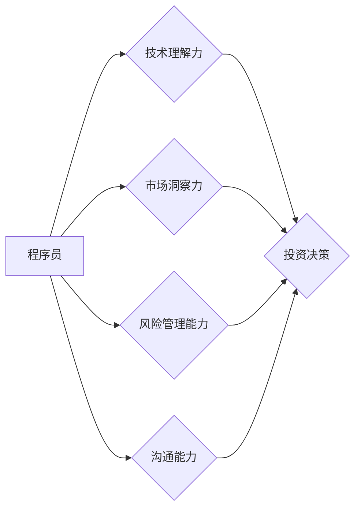

> 程序员，天使投资人，创业，技术，风险投资，投资策略，市场分析，商业模式

## 1. 背景介绍

程序员，这个职业曾经是许多人眼中充满光环的代名词。他们用代码构建数字世界，创造出各种各样的应用程序，改变着人们的生活方式。然而，随着科技的快速发展，程序员的职业道路也面临着新的挑战和机遇。

对于一些经验丰富的程序员来说，他们可能已经积累了丰富的技术经验和项目经验，但他们也可能感到对现状感到厌倦，渴望更大的挑战和成就感。这时，天使投资人这个职业就成为了一个新的选择。

## 2. 核心概念与联系

**2.1 天使投资人**

天使投资人是指个人或小型机构，他们利用自己的资金和经验，投资于早期阶段的创业公司。他们通常对技术领域有深入的了解，能够识别出具有潜力的创业项目，并提供必要的指导和支持。

**2.2 程序员转天使投资人**

程序员转天使投资人，是指拥有编程经验和技术背景的程序员，选择将自己的职业方向转向投资领域。他们利用自身的专业知识和行业经验，在投资决策中占据优势。

**2.3 核心概念联系**

程序员转天使投资人，本质上是一种职业转型，需要程序员具备以下核心能力：

* **技术理解力:** 能够理解和评估创业公司的技术方案和商业模式。
* **市场洞察力:** 能够识别市场需求和趋势，判断创业公司的市场潜力。
* **风险管理能力:** 能够评估投资风险，制定合理的投资策略。
* **沟通能力:** 能够与创业团队和投资人进行有效的沟通和协作。

**Mermaid 流程图**



## 3. 核心算法原理 & 具体操作步骤

**3.1 算法原理概述**

程序员转天使投资人需要掌握一些核心算法原理，例如：

* **风险评估算法:** 用于评估投资项目的风险水平，例如贝叶斯网络、决策树等。
* **市场分析算法:** 用于分析市场趋势和竞争格局，例如聚类分析、关联规则挖掘等。
* **财务建模算法:** 用于预测投资项目的财务回报，例如 discounted cash flow (DCF) 模型、内部收益率 (IRR) 等。

**3.2 算法步骤详解**

**3.2.1 风险评估算法**

1. 收集项目相关数据，包括市场规模、竞争对手、团队经验等。
2. 建立贝叶斯网络模型，描述项目风险因素之间的关系。
3. 利用历史数据训练模型，计算项目风险概率。
4. 根据风险概率，评估项目风险水平。

**3.2.2 市场分析算法**

1. 收集市场数据，包括用户需求、市场规模、竞争格局等。
2. 使用聚类分析算法，将市场细分到不同的用户群体。
3. 利用关联规则挖掘算法，发现用户需求和产品之间的关联关系。
4. 根据市场分析结果，判断项目市场潜力。

**3.2.3 财务建模算法**

1. 收集项目财务数据，包括收入、成本、利润等。
2. 使用 DCF 模型或 IRR 模型，预测项目未来财务回报。
3. 根据财务预测结果，评估项目投资价值。

**3.3 算法优缺点**

* **优点:** 能够提高投资决策的效率和准确性，降低投资风险。
* **缺点:** 需要大量的历史数据和专业知识，模型的准确性依赖于数据质量和模型参数。

**3.4 算法应用领域**

* 风险投资
* 创业投资
* 资产管理
* 金融科技

## 4. 数学模型和公式 & 详细讲解 & 举例说明

**4.1 数学模型构建**

**4.1.1 风险评估模型**

假设一个投资项目有 n 个风险因素，每个风险因素的概率为 p_i，影响程度为 w_i，则项目总风险可以表示为：

$$Risk = \sum_{i=1}^{n} p_i * w_i$$

**4.1.2 市场分析模型**

可以使用聚类分析算法将市场细分为 k 个用户群体，每个用户群体的特征向量为 x_j，则用户群体之间的相似度可以表示为：

$$Similarity(x_i, x_j) = \frac{x_i \cdot x_j}{||x_i|| ||x_j||}$$

**4.2 公式推导过程**

**4.2.1 风险评估模型推导**

风险评估模型的推导过程基于风险因素的概率和影响程度。每个风险因素的概率代表其发生的可能性，影响程度代表其对项目的影响程度。将这两个因素相乘，可以得到每个风险因素的风险贡献值。最后，将所有风险因素的风险贡献值相加，得到项目的总风险。

**4.2.2 市场分析模型推导**

市场分析模型的推导过程基于用户群体的特征向量。用户群体的特征向量可以包含用户的年龄、性别、收入、兴趣等信息。通过计算用户群体的特征向量之间的相似度，可以将用户群体进行聚类。

**4.3 案例分析与讲解**

**4.3.1 风险评估案例**

假设一个创业公司开发了一款新的移动应用程序，其风险因素包括市场竞争、团队经验、技术难度等。

* 市场竞争的概率为 0.6，影响程度为 0.8。
* 团队经验的概率为 0.3，影响程度为 0.7。
* 技术难度的概率为 0.4，影响程度为 0.9。

根据风险评估模型，项目的总风险为：

$$Risk = 0.6 * 0.8 + 0.3 * 0.7 + 0.4 * 0.9 = 0.85$$

**4.3.2 市场分析案例**

假设一个电商平台想要进行用户细分，其用户特征包括年龄、性别、购买频率等。

通过聚类分析算法，将用户细分为三个用户群体：

* 用户群体 1：年轻用户，购买频率高。
* 用户群体 2：中年用户，购买频率中等。
* 用户群体 3：老年用户，购买频率低。

电商平台可以根据不同的用户群体，制定不同的营销策略。

## 5. 项目实践：代码实例和详细解释说明

**5.1 开发环境搭建**

* 操作系统：Windows/macOS/Linux
* 编程语言：Python
* 开发工具：Jupyter Notebook

**5.2 源代码详细实现**

```python
# 风险评估模型
def calculate_risk(risk_factors):
  """
  计算项目风险

  Args:
    risk_factors: 风险因素列表，每个元素为 (概率, 影响程度)

  Returns:
    项目总风险
  """
  risk = 0
  for probability, weight in risk_factors:
    risk += probability * weight
  return risk

# 市场分析模型
from sklearn.cluster import KMeans

def cluster_users(user_data, n_clusters):
  """
  对用户进行聚类

  Args:
    user_data: 用户特征数据
    n_clusters: 聚类数量

  Returns:
    用户聚类结果
  """
  kmeans = KMeans(n_clusters=n_clusters)
  kmeans.fit(user_data)
  return kmeans.labels_

# 示例代码
risk_factors = [(0.6, 0.8), (0.3, 0.7), (0.4, 0.9)]
total_risk = calculate_risk(risk_factors)
print(f"项目总风险: {total_risk}")

user_data = [[25, '男', 10], [35, '女', 5], [55, '男', 2]]
user_clusters = cluster_users(user_data, 3)
print(f"用户聚类结果: {user_clusters}")
```

**5.3 代码解读与分析**

* 风险评估模型：该模型计算项目总风险，并根据风险水平进行评估。
* 市场分析模型：该模型使用 KMeans 聚类算法对用户进行细分，并根据用户群体的特征制定不同的营销策略。

**5.4 运行结果展示**

运行上述代码，可以得到项目总风险和用户聚类结果。

## 6. 实际应用场景

**6.1 风险投资**

天使投资人可以使用风险评估模型，评估创业项目的风险水平，并根据风险水平进行投资决策。

**6.2 创业投资**

创业投资人可以使用市场分析模型，分析市场趋势和竞争格局，并根据市场分析结果选择投资方向。

**6.3 资产管理**

资产管理公司可以使用风险评估模型，评估投资组合的风险水平，并根据风险水平进行资产配置。

**6.4 未来应用展望**

随着人工智能技术的不断发展，风险评估和市场分析模型将更加智能化和精准化，为天使投资人提供更有效的投资决策支持。

## 7. 工具和资源推荐

**7.1 学习资源推荐**

* **书籍:**
    * 《天使投资人》
    * 《创业投资实战》
    * 《风险投资》
* **在线课程:**
    * Coursera: 风险投资
    * edX: 创业投资
* **网站:**
    * Crunchbase
    * AngelList

**7.2 开发工具推荐**

* **Python:** 
    * Jupyter Notebook
    * Pandas
    * Scikit-learn
* **R:** 
    * RStudio
    * Tidyverse

**7.3 相关论文推荐**

* **风险评估:**
    * "A Bayesian Network Approach to Risk Assessment"
    * "Decision Trees for Risk Assessment"
* **市场分析:**
    * "Clustering Analysis for Market Segmentation"
    * "Association Rule Mining for Market Basket Analysis"

## 8. 总结：未来发展趋势与挑战

**8.1 研究成果总结**

程序员转天使投资人是一个充满机遇和挑战的职业转型。通过掌握核心算法原理和工具，程序员可以提高投资决策的效率和准确性，并获得更大的成功。

**8.2 未来发展趋势**

* 人工智能技术将更加广泛地应用于风险评估和市场分析，为天使投资人提供更智能化的投资决策支持。
* 数据分析和可视化技术将更加成熟，帮助天使投资人更好地理解市场趋势和投资项目。
* 天使投资人将更加注重对创业公司的技术评估和商业模式的分析。

**8.3 面临的挑战**

* 天使投资人需要不断学习和更新自己的知识和技能，以适应不断变化的市场环境。
* 天使投资人需要具备良好的风险管理能力，才能有效地规避投资风险。
* 天使投资人需要建立良好的投资人网络，才能获得更多投资机会。

**8.4 研究展望**

未来，我们将继续研究人工智能技术在风险评估和市场分析中的应用，并探索新的投资策略和方法，为天使投资人提供更有效的投资决策支持。

## 9. 附录：常见问题与解答

**9.1 如何评估创业公司的技术水平？**

* 了解创业公司的技术团队背景和经验。
* 评估创业公司的技术方案的创新性和可行性。
* 了解创业公司的技术路线图和发展规划。

**9.2 如何评估创业公司的商业模式？**

* 了解创业公司的目标市场和竞争对手。
* 评估创业公司的产品或服务价值和市场需求。
* 了解创业公司的盈利模式和财务预测。

**9.3 如何降低投资风险？**

* 进行充分的市场调研和投资 Due Diligence。
* 投资于具有高成长潜力的创业公司。
* 分散投资，降低单一项目风险。
* 与创业团队建立良好的合作关系。


作者：禅与计算机程序设计艺术 / Zen and the Art