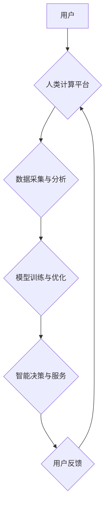

> 人类计算，客户体验，人工智能，自然语言处理，交互设计，用户体验，情感计算

## 1. 背景介绍

在当今数字化时代，客户体验 (Customer Experience，CX) 已成为企业竞争的关键要素。随着人工智能 (Artificial Intelligence，AI) 技术的飞速发展，企业纷纷寻求利用 AI 技术提升客户体验。然而，单纯依靠机器学习算法和数据分析，往往难以真正理解和满足客户的多层次需求。

人类计算 (Human Computation) 作为一种将人类智能与计算机智能相结合的新兴范式，为提升客户体验提供了新的思路。人类计算强调利用人类的创造力、洞察力和情感理解能力，与计算机协同工作，共同解决复杂问题，并提供更个性化、更人性化的服务体验。

## 2. 核心概念与联系

**2.1 人类计算的概念**

人类计算是指利用人类的智慧和能力，与计算机协同工作，共同完成复杂的任务。它强调人类和机器的协同作用，充分发挥各自的优势，以达到超越单一智能的协同效应。

**2.2 人类计算与客户体验的联系**

人类计算可以有效提升客户体验，主要体现在以下几个方面：

* **更精准的客户理解:** 人类计算可以结合自然语言处理 (Natural Language Processing，NLP) 技术，分析客户的语言表达、情感倾向和行为模式，更精准地理解客户的需求和意图。
* **更个性化的服务体验:** 人类计算可以根据客户的个人喜好、行为习惯和历史记录，提供个性化的产品推荐、服务建议和互动体验。
* **更有效的沟通和解决问题:** 人类计算可以将客户与专业客服人员或专家连接起来，提供更有效的沟通和问题解决服务。
* **更人性化的交互体验:** 人类计算可以模拟人类的沟通方式和情感表达，使客户与系统之间的交互更加自然、人性化。

**2.3 人类计算架构**



## 3. 核心算法原理 & 具体操作步骤

**3.1 算法原理概述**

人类计算的核心算法原理主要包括：

* **自然语言处理 (NLP):** 用于理解和处理人类语言，包括文本分析、情感识别、对话系统等。
* **机器学习 (ML):** 用于从数据中学习模式和规律，并进行预测和决策。
* **深度学习 (DL):** 一种更高级的机器学习方法，能够处理更复杂的数据和任务。
* **强化学习 (RL):** 用于训练智能体在环境中学习最佳策略。

**3.2 算法步骤详解**

1. **数据采集与预处理:** 收集与客户体验相关的各种数据，例如用户行为数据、文本评论数据、情感数据等，并进行清洗、转换和格式化。
2. **特征提取与表示:** 从原始数据中提取关键特征，并将其转换为机器可理解的表示形式。
3. **模型训练与优化:** 利用机器学习算法，训练模型以预测客户行为、情感倾向或其他相关指标。
4. **智能决策与服务:** 根据模型的预测结果，提供个性化的产品推荐、服务建议或互动体验。
5. **用户反馈收集与分析:** 收集用户对服务的反馈，并将其用于模型的持续优化和改进。

**3.3 算法优缺点**

**优点:**

* 能够更精准地理解客户需求和意图。
* 可以提供更个性化、更人性化的服务体验。
* 能够有效提升客户满意度和忠诚度。

**缺点:**

* 需要大量的数据进行训练和优化。
* 模型的准确性取决于数据的质量和特征的提取。
* 需要考虑数据隐私和安全问题。

**3.4 算法应用领域**

* **电商:** 个性化商品推荐、智能客服、客户关系管理。
* **金融:** 风险评估、欺诈检测、个性化理财建议。
* **医疗:** 疾病诊断、个性化治疗方案、患者管理。
* **教育:** 个性化学习路径、智能辅导、在线考试。

## 4. 数学模型和公式 & 详细讲解 & 举例说明

**4.1 数学模型构建**

人类计算模型通常基于概率统计和机器学习算法，例如贝叶斯网络、决策树、支持向量机等。这些模型可以用来预测客户行为、情感倾向或其他相关指标。

**4.2 公式推导过程**

例如，可以使用贝叶斯定理来计算客户购买特定产品的概率，公式如下：

$$P(A|B) = \frac{P(B|A)P(A)}{P(B)}$$

其中：

* $P(A|B)$ 是客户购买产品 A 的概率，已知客户属于群体 B。
* $P(B|A)$ 是客户属于群体 B 的概率，已知客户购买了产品 A。
* $P(A)$ 是客户购买产品 A 的概率。
* $P(B)$ 是客户属于群体 B 的概率。

**4.3 案例分析与讲解**

假设我们有一个电商平台，想要预测客户购买特定产品的概率。我们可以收集客户的购买历史、浏览记录、年龄、性别等数据，并将其作为训练数据。然后，我们可以使用贝叶斯网络模型来学习客户购买产品的概率分布。

## 5. 项目实践：代码实例和详细解释说明

**5.1 开发环境搭建**

* 操作系统: Ubuntu 20.04
* Python 版本: 3.8
* 必要的库: numpy, pandas, scikit-learn, tensorflow

**5.2 源代码详细实现**

```python
import pandas as pd
from sklearn.model_selection import train_test_split
from sklearn.linear_model import LogisticRegression

# 加载数据
data = pd.read_csv('customer_data.csv')

# 提取特征和目标变量
features = ['age', 'gender', 'purchase_history']
target = 'purchase_product'

# 将数据分割为训练集和测试集
X_train, X_test, y_train, y_test = train_test_split(data[features], data[target], test_size=0.2)

# 训练逻辑回归模型
model = LogisticRegression()
model.fit(X_train, y_train)

# 对测试集进行预测
y_pred = model.predict(X_test)

# 评估模型性能
from sklearn.metrics import accuracy_score
accuracy = accuracy_score(y_test, y_pred)
print(f'模型准确率: {accuracy}')
```

**5.3 代码解读与分析**

这段代码演示了如何使用逻辑回归模型预测客户购买产品的概率。首先，我们加载数据并提取特征和目标变量。然后，我们将数据分割为训练集和测试集。接着，我们训练逻辑回归模型，并使用测试集进行预测。最后，我们评估模型的性能，例如准确率。

**5.4 运行结果展示**

运行上述代码后，会输出模型的准确率。例如，如果模型的准确率为 0.85，则表示模型能够正确预测 85% 的客户购买产品的概率。

## 6. 实际应用场景

**6.1 电商平台**

* **个性化商品推荐:** 根据用户的浏览历史、购买记录和兴趣偏好，推荐个性化的商品。
* **智能客服:** 利用自然语言处理技术，提供24小时在线客服，解答客户疑问，解决问题。
* **客户关系管理:** 分析客户行为数据，识别潜在的客户流失风险，并采取措施挽留客户。

**6.2 金融机构**

* **风险评估:** 利用机器学习算法，评估客户的信用风险，为贷款和保险等服务提供参考。
* **欺诈检测:** 分析客户交易数据，识别异常行为，防止欺诈交易。
* **个性化理财建议:** 根据客户的风险偏好、投资目标和财务状况，提供个性化的理财建议。

**6.3 医疗机构**

* **疾病诊断:** 利用机器学习算法，分析患者的症状、检查结果和病史，辅助医生进行疾病诊断。
* **个性化治疗方案:** 根据患者的基因信息、生活习惯和病史，制定个性化的治疗方案。
* **患者管理:** 利用人工智能技术，提高患者管理效率，减少医疗成本。

**6.4 未来应用展望**

随着人工智能技术的不断发展，人类计算将在更多领域得到应用，例如教育、交通、娱乐等。未来，人类计算将更加智能化、个性化和人性化，为人们提供更加便捷、高效、舒适的生活体验。

## 7. 工具和资源推荐

**7.1 学习资源推荐**

* **书籍:**
    * 《人类计算》
    * 《人工智能：一种现代方法》
    * 《深度学习》
* **在线课程:**
    * Coursera: 人工智能
    * edX: 深度学习
    * Udacity: 机器学习工程师

**7.2 开发工具推荐**

* **Python:** 人工智能开发的常用语言
* **TensorFlow:** 深度学习框架
* **PyTorch:** 深度学习框架
* **Scikit-learn:** 机器学习库

**7.3 相关论文推荐**

* **人类计算的未来**
* **人工智能与人类计算的协同发展**
* **人类计算在客户体验中的应用**

## 8. 总结：未来发展趋势与挑战

**8.1 研究成果总结**

人类计算作为一种新兴的计算范式，在提升客户体验方面展现出巨大的潜力。通过结合人类智能和计算机智能，人类计算能够更精准地理解客户需求，提供更个性化、更人性化的服务体验。

**8.2 未来发展趋势**

未来，人类计算将朝着以下几个方向发展：

* **更加智能化:** 利用更先进的机器学习算法和深度学习技术，提高人类计算的智能水平。
* **更加个性化:** 根据用户的个人特征和需求，提供更加个性化的服务体验。
* **更加协同:** 将人类计算与其他新兴技术，例如物联网、云计算和区块链等，进行融合，构建更加智能、高效的协同工作环境。

**8.3 面临的挑战**

人类计算的发展也面临着一些挑战：

* **数据隐私和安全:** 人类计算需要处理大量用户数据，因此需要确保数据的隐私和安全。
* **算法偏见:** 机器学习算法可能会受到训练数据的影响，导致算法偏见，从而影响客户体验。
* **伦理问题:** 人类计算的应用可能会引发一些伦理问题，例如算法透明度、责任归属等，需要进行深入探讨和解决。

**8.4 研究展望**

未来，我们需要继续深入研究人类计算的原理和方法，开发更加智能、更加安全、更加可解释的人类计算系统。同时，还需要关注人类计算的伦理问题，确保其健康、可持续发展。

## 9. 附录：常见问题与解答

**9.1 如何保证人类计算的准确性？**

人类计算的准确性取决于数据的质量、算法的优劣和人类参与者的能力。需要不断收集高质量的数据，开发更先进的算法，并加强人类参与者的培训和指导。

**9.2 人类计算会取代人类工作吗？**

人类计算不会完全取代人类工作，而是会与人类协同工作，共同完成复杂任务。人类仍然需要发挥创造力、洞察力和情感理解能力，而计算机可以帮助人类提高效率、降低成本。

**9.3 人类计算的伦理问题有哪些？**

人类计算的应用可能会引发一些伦理问题，例如算法透明度、责任归属、数据隐私等。需要制定相应的伦理规范和法律法规，确保人类计算的健康发展。


作者：禅与计算机程序设计艺术 / Zen and the Art of Computer Programming 
<end_of_turn>