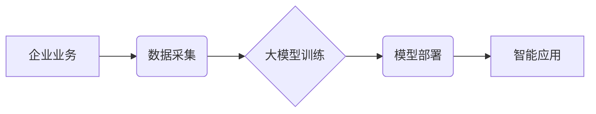

> 大模型、企业应用、工作效率、自然语言处理、计算机视觉、机器学习、人工智能

## 1. 背景介绍

近年来，人工智能（AI）技术取得了飞速发展，其中大模型（Large Language Model，LLM）作为AI领域的重要突破，展现出强大的学习和推理能力，在自然语言处理、计算机视觉、语音识别等领域取得了令人瞩目的成果。大模型的出现为企业数字化转型和智能化升级提供了新的机遇，也带来了新的挑战。

企业面临着日益激烈的市场竞争和不断变化的客户需求，需要更高效、更智能的运营模式来提升竞争力。大模型的强大能力可以帮助企业自动化流程、优化决策、提升客户体验，从而显著提高工作效率。

## 2. 核心概念与联系

**2.1 大模型概述**

大模型是指参数量巨大、训练数据海量的人工智能模型。这些模型通过学习海量数据，能够掌握复杂的语言模式和知识结构，从而实现更精准、更自然的语言理解和生成。

**2.2 企业应用场景**

大模型在企业应用场景中具有广泛的应用前景，例如：

* **客户服务:** 利用大模型构建智能客服系统，自动处理客户咨询、解决常见问题，提高客户服务效率和满意度。
* **市场营销:** 利用大模型分析客户数据，精准定位目标客户，个性化推荐产品和服务，提升营销效果。
* **内容创作:** 利用大模型生成高质量的文案、广告、新闻等内容，节省人力成本，提高内容生产效率。
* **数据分析:** 利用大模型分析海量数据，挖掘潜在的商业价值，为企业决策提供数据支持。

**2.3 架构图**



## 3. 核心算法原理 & 具体操作步骤

**3.1 算法原理概述**

大模型的训练主要基于深度学习算法，其中Transformer模型是目前最主流的架构。Transformer模型通过自注意力机制（Self-Attention）学习文本中的语义关系，能够捕捉长距离依赖关系，从而实现更精准的语言理解和生成。

**3.2 算法步骤详解**

1. **数据预处理:** 将原始数据清洗、格式化，并转换为模型可理解的格式。
2. **模型训练:** 使用深度学习框架（如TensorFlow、PyTorch）训练Transformer模型，通过反向传播算法不断优化模型参数。
3. **模型评估:** 使用测试数据评估模型性能，并根据评估结果进行模型调优。
4. **模型部署:** 将训练好的模型部署到生产环境中，用于实际应用。

**3.3 算法优缺点**

* **优点:**

    * 强大的语言理解和生成能力
    * 能够捕捉长距离依赖关系
    * 可迁移学习，在不同任务上表现出色

* **缺点:**

    * 训练成本高，需要海量数据和计算资源
    * 模型参数量大，部署成本较高
    * 容易受到训练数据偏差的影响

**3.4 算法应用领域**

* 自然语言处理：文本分类、情感分析、机器翻译、文本摘要等
* 计算机视觉：图像识别、目标检测、图像分割等
* 语音识别：语音转文本、语音合成等
* 其他领域：代码生成、药物研发、金融分析等

## 4. 数学模型和公式 & 详细讲解 & 举例说明

**4.1 数学模型构建**

Transformer模型的核心是自注意力机制，其数学模型可以表示为：

$$
Attention(Q, K, V) = softmax(\frac{QK^T}{\sqrt{d_k}})V
$$

其中：

* $Q$：查询矩阵
* $K$：键矩阵
* $V$：值矩阵
* $d_k$：键向量的维度
* $softmax$：softmax函数

**4.2 公式推导过程**

自注意力机制通过计算查询向量与键向量的点积，并使用softmax函数进行归一化，得到每个键向量的重要性权重。然后，将这些权重与值向量相乘，得到最终的注意力输出。

**4.3 案例分析与讲解**

例如，在机器翻译任务中，查询向量可以表示源语言句子中的每个词，键向量和值向量可以表示目标语言词典中的每个词。通过自注意力机制，模型可以学习到源语言句子中每个词与目标语言词典中每个词之间的关系，从而实现更精准的翻译。

## 5. 项目实践：代码实例和详细解释说明

**5.1 开发环境搭建**

* 操作系统：Linux/macOS
* Python版本：3.7+
* 深度学习框架：TensorFlow/PyTorch
* 其他依赖库：transformers、numpy、pandas等

**5.2 源代码详细实现**

```python
from transformers import AutoModelForSequenceClassification, AutoTokenizer

# 加载预训练模型和词典
model_name = "bert-base-uncased"
tokenizer = AutoTokenizer.from_pretrained(model_name)
model = AutoModelForSequenceClassification.from_pretrained(model_name, num_labels=2)

# 文本预处理
text = "This is a sample text."
inputs = tokenizer(text, return_tensors="pt")

# 模型预测
outputs = model(**inputs)
predicted_class = outputs.logits.argmax().item()

# 输出结果
print(f"Predicted class: {predicted_class}")
```

**5.3 代码解读与分析**

* 使用transformers库加载预训练模型和词典。
* 对输入文本进行预处理，转换为模型可理解的格式。
* 使用模型进行预测，获取预测结果。
* 输出预测结果。

**5.4 运行结果展示**

运行上述代码，可以得到模型对输入文本的分类结果。

## 6. 实际应用场景

**6.1 客户服务**

利用大模型构建智能客服系统，自动处理客户咨询、解决常见问题，例如：

* 自动回复常见问题
* 识别客户情绪，提供个性化服务
* 将客户咨询转交给人工客服

**6.2 市场营销**

利用大模型分析客户数据，精准定位目标客户，个性化推荐产品和服务，例如：

* 根据客户浏览历史推荐相关产品
* 生成个性化广告文案
* 分析市场趋势，预测产品需求

**6.3 内容创作**

利用大模型生成高质量的文案、广告、新闻等内容，例如：

* 自动生成产品描述
* 撰写新闻报道
* 生成创意广告文案

**6.4 未来应用展望**

随着大模型技术的不断发展，其在企业应用场景中的应用将更加广泛和深入，例如：

* 更智能的自动化流程
* 更精准的决策支持
* 更个性化的客户体验

## 7. 工具和资源推荐

**7.1 学习资源推荐**

* **书籍:**

    * 《深度学习》
    * 《自然语言处理》
    * 《Transformer模型详解》

* **在线课程:**

    * Coursera: 深度学习
    * edX: 自然语言处理
    * fast.ai: 深度学习

**7.2 开发工具推荐**

* **深度学习框架:** TensorFlow, PyTorch
* **自然语言处理库:** transformers, spaCy, NLTK
* **云平台:** AWS, Azure, GCP

**7.3 相关论文推荐**

* 《Attention Is All You Need》
* 《BERT: Pre-training of Deep Bidirectional Transformers for Language Understanding》
* 《GPT-3: Language Models are Few-Shot Learners》

## 8. 总结：未来发展趋势与挑战

**8.1 研究成果总结**

大模型技术取得了显著进展，在自然语言处理、计算机视觉等领域取得了突破性成果。企业利用大模型可以提高工作效率、优化决策、提升客户体验。

**8.2 未来发展趋势**

* 模型规模进一步扩大
* 模型训练效率提升
* 模型应用场景更加广泛
* 模型安全性与可解释性增强

**8.3 面临的挑战**

* 训练成本高
* 数据安全与隐私问题
* 模型偏见与误差问题
* 模型解释性与可控性问题

**8.4 研究展望**

未来研究将重点关注：

* 更高效的模型训练方法
* 更安全、更可靠的模型部署
* 更可解释、更可控的模型设计
* 更广泛的模型应用场景

## 9. 附录：常见问题与解答

**9.1 如何选择合适的预训练模型？**

选择预训练模型需要根据具体应用场景和任务需求进行选择。例如，对于文本分类任务，可以选择BERT、RoBERTa等预训练模型；对于机器翻译任务，可以选择T5、MarianMT等预训练模型。

**9.2 如何进行模型调优？**

模型调优可以通过调整模型超参数、增加训练数据、使用迁移学习等方法进行。

**9.3 如何解决模型偏见问题？**

模型偏见问题可以通过使用更公平的训练数据、进行数据清洗、使用对抗训练等方法进行解决。


作者：禅与计算机程序设计艺术 / Zen and the Art of Computer Programming 
<end_of_turn>