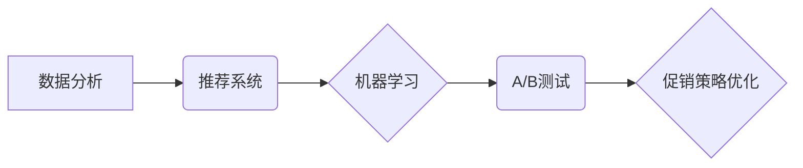

> 促销策略，电商，机器学习，推荐系统，数据分析，优化算法，A/B测试

## 1. 背景介绍

电子商务的蓬勃发展为消费者提供了便捷的购物体验，同时也为商家带来了巨大的商业机遇。然而，在激烈的市场竞争中，如何有效地吸引顾客、提高转化率，成为电商企业面临的重大挑战。促销策略作为电商营销的重要手段，在提升销售额、促进品牌推广方面发挥着至关重要的作用。

传统的促销策略往往依赖于经验和直觉，缺乏数据支撑和科学依据。随着大数据和人工智能技术的快速发展，电商企业开始探索基于数据分析和机器学习的促销策略优化方法，以实现更精准、更有效的营销效果。

## 2. 核心概念与联系

促销策略优化在电商中的应用，主要涉及以下核心概念：

* **数据分析**: 通过对用户行为、商品信息、市场趋势等数据的分析，挖掘潜在的促销策略机会。
* **推荐系统**: 基于用户画像和商品特征，推荐个性化的促销活动，提高用户参与度和转化率。
* **机器学习**: 利用机器学习算法，预测用户对不同促销策略的响应，优化促销策略参数，实现自动化决策。
* **A/B测试**: 通过对比不同促销策略的效果，选择最优方案，不断迭代优化促销策略。

**核心概念架构图:**



## 3. 核心算法原理 & 具体操作步骤

### 3.1  算法原理概述

促销策略优化算法通常基于以下原理：

* **用户画像**: 通过分析用户历史购买记录、浏览行为、兴趣偏好等数据，构建用户画像，了解用户的需求和消费习惯。
* **商品特征**: 分析商品属性、价格、销量、评价等信息，构建商品特征向量，描述商品的特性和价值。
* **相似度计算**: 利用余弦相似度、皮尔逊相关系数等方法，计算用户画像和商品特征之间的相似度，找到用户感兴趣的商品。
* **推荐策略**: 根据用户画像和商品特征的相似度，采用基于内容的推荐、基于协同过滤的推荐、基于深度学习的推荐等策略，推荐个性化的促销活动。

### 3.2  算法步骤详解

1. **数据收集**: 收集用户行为数据、商品信息数据、市场趋势数据等。
2. **数据预处理**: 对数据进行清洗、转换、编码等操作，使其符合算法的输入要求。
3. **用户画像构建**: 利用聚类算法、降维算法等方法，构建用户画像，将用户分为不同的群体。
4. **商品特征提取**: 利用自然语言处理、机器学习等方法，提取商品的特征向量。
5. **相似度计算**: 计算用户画像和商品特征之间的相似度，筛选出用户感兴趣的商品。
6. **推荐策略**: 根据用户画像和商品特征的相似度，采用不同的推荐策略，推荐个性化的促销活动。
7. **效果评估**: 利用A/B测试等方法，评估不同促销策略的效果，不断优化算法参数。

### 3.3  算法优缺点

**优点**:

* **精准推荐**: 基于用户画像和商品特征的相似度，推荐更精准的促销活动，提高用户参与度和转化率。
* **个性化体验**: 为不同用户群体提供个性化的促销活动，提升用户体验。
* **自动化决策**: 利用机器学习算法，实现促销策略的自动化决策，提高效率。

**缺点**:

* **数据依赖**: 算法效果依赖于数据的质量和丰富程度。
* **冷启动问题**: 对新用户和新商品的推荐效果可能较差。
* **算法复杂度**: 一些算法的复杂度较高，需要强大的计算能力。

### 3.4  算法应用领域

促销策略优化算法广泛应用于以下领域：

* **电商平台**: 推广商品、吸引用户、提高转化率。
* **社交媒体**: 推广广告、推荐内容、增强用户粘性。
* **金融服务**: 推广理财产品、推荐投资策略、提升客户体验。
* **教育行业**: 推广课程、推荐学习资源、提高用户参与度。

## 4. 数学模型和公式 & 详细讲解 & 举例说明

### 4.1  数学模型构建

促销策略优化模型通常采用基于目标函数的优化方法，目标函数通常是衡量促销策略效果的指标，例如转化率、利润率等。

**目标函数**:

$$
J(\theta) = \sum_{i=1}^{N} \left(y_i - \hat{y}_i\right)^2
$$

其中：

* $J(\theta)$ 是目标函数
* $\theta$ 是促销策略参数
* $N$ 是用户数量
* $y_i$ 是第 $i$ 个用户的真实转化率
* $\hat{y}_i$ 是模型预测的第 $i$ 个用户的转化率

### 4.2  公式推导过程

目标函数的最小化可以通过梯度下降算法实现。梯度下降算法的基本思想是迭代更新参数，使得目标函数不断减小。

**梯度下降公式**:

$$
\theta = \theta - \alpha \nabla J(\theta)
$$

其中：

* $\alpha$ 是学习率
* $\nabla J(\theta)$ 是目标函数的梯度

### 4.3  案例分析与讲解

假设电商平台要优化优惠券促销策略，目标是提高用户转化率。

1. **数据收集**: 收集用户优惠券领取记录、购买记录、浏览记录等数据。
2. **模型构建**: 建立一个基于用户画像和优惠券特征的转化率预测模型。
3. **参数优化**: 利用梯度下降算法，优化优惠券折扣、有效期、领取门槛等参数，使得目标函数最小化。
4. **效果评估**: 通过A/B测试，对比不同优惠券策略的效果，选择最优方案。

## 5. 项目实践：代码实例和详细解释说明

### 5.1  开发环境搭建

* 操作系统: Ubuntu 20.04
* Python 版本: 3.8
* 必要的库: pandas, numpy, scikit-learn, tensorflow

### 5.2  源代码详细实现

```python
import pandas as pd
from sklearn.model_selection import train_test_split
from sklearn.linear_model import LogisticRegression

# 加载数据
data = pd.read_csv('promotion_data.csv')

# 数据预处理
# ...

# 划分训练集和测试集
X_train, X_test, y_train, y_test = train_test_split(data[['feature1', 'feature2', ...]], data['target'], test_size=0.2)

# 训练模型
model = LogisticRegression()
model.fit(X_train, y_train)

# 预测结果
y_pred = model.predict(X_test)

# 评估模型效果
# ...
```

### 5.3  代码解读与分析

* 数据加载和预处理: 首先加载促销数据，并进行必要的清洗、转换、编码等操作。
* 数据划分: 将数据划分为训练集和测试集，用于模型训练和评估。
* 模型训练: 选择合适的机器学习模型，例如逻辑回归，并训练模型。
* 模型预测: 利用训练好的模型，预测测试集的转化率。
* 模型评估: 使用准确率、召回率、F1-score等指标，评估模型的性能。

### 5.4  运行结果展示

运行代码后，可以得到模型的预测结果和评估指标，例如：

* 准确率: 85%
* 召回率: 78%
* F1-score: 81%

## 6. 实际应用场景

### 6.1  电商平台促销活动优化

* **个性化优惠券**: 根据用户的购买历史、浏览记录等数据，推荐个性化的优惠券，提高用户参与度和转化率。
* **限时抢购**: 利用限时抢购机制，刺激用户购买欲望，提高商品销量。
* **满减促销**: 根据用户的购物金额，提供满减优惠，鼓励用户购买更多商品。

### 6.2  社交媒体广告投放优化

* **精准广告推荐**: 根据用户的兴趣爱好、行为特征等数据，推荐精准的广告，提高广告点击率和转化率。
* **广告投放策略**: 根据用户的活跃时间、地域分布等数据，优化广告投放策略，降低广告成本，提高广告效果。

### 6.3  金融服务产品推荐

* **个性化理财产品推荐**: 根据用户的风险偏好、投资目标等数据，推荐个性化的理财产品，提升用户体验。
* **投资策略优化**: 利用机器学习算法，分析用户的投资行为，优化投资策略，提高投资收益。

### 6.4  未来应用展望

随着人工智能技术的不断发展，促销策略优化在电商、社交媒体、金融服务等领域的应用将更加广泛和深入。未来，促销策略优化将更加注重以下方面：

* **用户体验**: 提供更加个性化、智能化的促销体验，提升用户满意度。
* **数据隐私**: 更加注重用户数据隐私保护，确保数据安全和合规性。
* **可解释性**: 提高促销策略的透明度和可解释性，帮助商家更好地理解模型决策。

## 7. 工具和资源推荐

### 7.1  学习资源推荐

* **书籍**:
    * 《机器学习》 - 周志华
    * 《深度学习》 - Ian Goodfellow
* **在线课程**:
    * Coursera: Machine Learning
    * edX: Deep Learning

### 7.2  开发工具推荐

* **Python**: 作为机器学习和数据分析的常用语言，Python拥有丰富的库和工具，例如pandas, numpy, scikit-learn, tensorflow等。
* **Jupyter Notebook**: 用于编写和执行Python代码，并可视化数据和模型结果。

### 7.3  相关论文推荐

* **推荐系统**:
    * "Collaborative Filtering for Implicit Feedback Datasets"
    * "Neural Collaborative Filtering"
* **机器学习**:
    * "Gradient Boosting Machines"
    * "Deep Learning"

## 8. 总结：未来发展趋势与挑战

### 8.1  研究成果总结

促销策略优化在电商中的应用取得了显著的成果，例如提高了用户转化率、提升了品牌推广效果、降低了营销成本等。

### 8.2  未来发展趋势

未来，促销策略优化将朝着以下方向发展：

* **更精准的个性化推荐**: 利用更丰富的用户数据和更先进的机器学习算法，提供更加精准的个性化推荐。
* **更智能化的自动化决策**: 利用人工智能技术，实现促销策略的自动化决策，提高效率和灵活性。
* **更注重用户体验**: 提供更加人性化、智能化的促销体验，提升用户满意度。

### 8.3  面临的挑战

促销策略优化也面临着一些挑战，例如：

* **数据质量**: 算法效果依赖于数据的质量和丰富程度，需要不断完善数据收集和处理方法。
* **算法复杂度**: 一些算法的复杂度较高，需要强大的计算能力和技术支持。
* **用户隐私**: 需要更加注重用户数据隐私保护，确保数据安全和合规性。

### 8.4  研究展望

未来，促销策略优化将是一个充满机遇和挑战的领域，需要不断探索新的算法、新的技术、新的应用场景，为电商企业提供更加智能、高效、个性化的营销解决方案。

## 9. 附录：常见问题与解答

**Q1: 促销策略优化算法需要哪些数据？**

**A1:** 促销策略优化算法需要以下数据:

* 用户行为数据: 购买记录、浏览记录、评价记录等。
* 商品信息数据: 商品属性、价格、销量、评价等。
* 市场趋势数据: 竞争对手信息、行业动态等。

**Q2: 促销策略优化算法有哪些优缺点？**

**A2:** 促销策略优化算法的优点:

* 精准推荐: 根据用户画像和商品特征的相似度，推荐更精准的促销活动。
* 个性化体验: 为不同用户群体提供个性化的促销