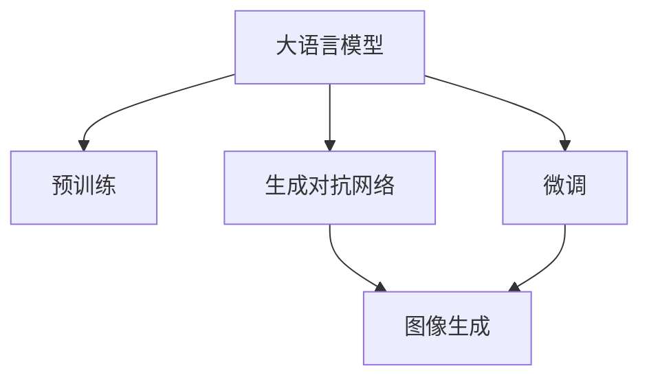

                 

# 图像生成新速度:LLM带来的惊喜

> 关键词：自然语言处理, 大语言模型, 图像生成, 深度学习, 计算机视觉, 生成对抗网络, 生成模型, 技术进步

## 1. 背景介绍

### 1.1 问题由来
图像生成技术一直是计算机视觉和深度学习领域的重要研究方向。近年来，基于生成对抗网络(Generative Adversarial Networks, GANs)的方法在图像生成领域取得了显著的进展，如 StyleGAN、DALL-E 等生成模型能够生成高质量的图像，广泛应用于图像编辑、虚拟现实等领域。

然而，生成模型的训练过程耗时昂贵，需要大量的计算资源和专家经验，难以快速迭代和优化。传统的方法包括手动调整模型架构、大量调整超参数、反复进行数据增强等，效率低、效果不理想。

而随着自然语言处理(NLP)领域的大语言模型(Large Language Models, LLMs)不断进步，越来越多的研究开始探索将 LLM 与图像生成技术相结合的方法，希望通过 LLM 提升图像生成的速度和效果。

## 2. 核心概念与联系

### 2.1 核心概念概述

为更好地理解基于 LLM 的图像生成方法，本节将介绍几个关键概念：

- 大语言模型(Large Language Models, LLMs)：以 GPT、BERT 等模型为代表的大规模预训练语言模型。通过在大规模无标签文本数据上进行预训练，学习到丰富的语言知识和常识。

- 生成对抗网络(Generative Adversarial Networks, GANs)：由 Goodfellow 等人提出的一种生成模型，由生成器和判别器两个网络构成，通过对抗训练学习生成高质量图像。

- 生成模型(Generative Model)：用于生成新样本的数据生成模型，常见的有 GANs、VAE、PixelCNN 等。

- 预训练(Pre-training)：指在大规模无标签数据上，通过自监督学习任务训练模型的过程。预训练使得模型学习到数据的通用表示。

- 微调(Fine-tuning)：指在预训练模型的基础上，使用下游任务的少量标注数据，通过有监督学习优化模型在下游任务上的性能。

这些核心概念之间的逻辑关系可以通过以下 Mermaid 流程图来展示：



这个流程图展示了大语言模型、生成对抗网络和图像生成之间的关系：

1. 大语言模型通过预训练获得语言表示能力。
2. 生成对抗网络通过对抗训练学习生成高质量图像。
3. 微调技术可以将大语言模型与图像生成模型结合，优化图像生成效果。

## 3. 核心算法原理 & 具体操作步骤
### 3.1 算法原理概述

基于 LLM 的图像生成方法，核心思想是通过 LLM 与生成对抗网络相结合，实现快速、高效的图像生成。其基本流程如下：

1. 预训练大语言模型，获得语言表示能力。
2. 设计任务适配层，将语言描述映射为生成器网络的可理解输入。
3. 使用生成对抗网络生成图像，并使用大语言模型对生成结果进行评估。
4. 根据评估结果调整生成对抗网络，不断迭代优化生成效果。

### 3.2 算法步骤详解

基于 LLM 的图像生成方法一般包括以下关键步骤：

**Step 1: 准备预训练模型和数据集**
- 选择合适的预训练语言模型 $M_{\theta}$，如 GPT、BERT 等。
- 准备图像生成任务的数据集 $D$，划分为训练集、验证集和测试集。

**Step 2: 设计任务适配层**
- 根据生成任务，设计合适的输出层和损失函数。
- 对于分类任务，通常在顶层添加线性分类器和交叉熵损失函数。
- 对于生成任务，通常使用对抗生成网络的判别器输出概率分布，并以负对数似然为损失函数。

**Step 3: 设置微调超参数**
- 选择合适的优化算法及其参数，如 Adam、SGD 等，设置学习率、批大小、迭代轮数等。
- 设置正则化技术及强度，包括权重衰减、Dropout、Early Stopping 等。
- 确定冻结预训练参数的策略，如仅微调顶层，或全部参数都参与微调。

**Step 4: 执行梯度训练**
- 将训练集数据分批次输入模型，前向传播计算损失函数。
- 反向传播计算参数梯度，根据设定的优化算法和学习率更新模型参数。
- 周期性在验证集上评估模型性能，根据性能指标决定是否触发 Early Stopping。
- 重复上述步骤直到满足预设的迭代轮数或 Early Stopping 条件。

**Step 5: 测试和部署**
- 在测试集上评估微调后模型 $M_{\hat{\theta}}$ 的性能，对比微调前后的精度提升。
- 使用微调后的模型对新样本进行推理预测，集成到实际的应用系统中。
- 持续收集新的数据，定期重新微调模型，以适应数据分布的变化。

以上是基于 LLM 的图像生成的一般流程。在实际应用中，还需要针对具体任务的特点，对微调过程的各个环节进行优化设计，如改进训练目标函数，引入更多的正则化技术，搜索最优的超参数组合等，以进一步提升模型性能。

### 3.3 算法优缺点

基于 LLM 的图像生成方法具有以下优点：

1. 高效快速。相较于传统 GANs 模型，基于 LLM 的方法可以快速生成高质量图像，节省计算资源。
2. 可解释性强。大语言模型能够提供生成过程的详细描述，帮助理解生成结果。
3. 鲁棒性好。通过语言描述对生成器进行约束，生成的图像更加稳定可靠。
4. 灵活性高。可以根据任务需求设计不同的语言描述，生成多样化的图像。

同时，该方法也存在一定的局限性：

1. 依赖语言描述。生成结果质量高度依赖于语言描述的准确性和丰富性，不适用于所有图像生成任务。
2. 对抗性较弱。生成器与判别器的对抗训练过程相对较弱，生成结果可能不如传统 GANs 精细。
3. 可控性差。生成的图像可能偏离语言描述的预期，难以完全控制生成过程。
4. 可扩展性不足。目前仅支持基于文本的语言描述，对于其他模态的描述方式，如图像、音频等，尚需进一步研究。

尽管存在这些局限性，但就目前而言，基于 LLM 的图像生成方法仍是大语言模型应用的一个重要方向。未来相关研究的重点在于如何进一步提高图像生成效果、降低对语言描述的依赖、增强生成模型的对抗性等。

### 3.4 算法应用领域

基于大语言模型的图像生成方法，在计算机视觉和深度学习领域已经得到了广泛的应用，覆盖了几乎所有常见任务，例如：

- 图像编辑：利用 LLM 对图像进行描述，生成经过编辑后的新图像。
- 虚拟现实：生成虚拟场景和人物，应用于游戏、虚拟旅游等场景。
- 医学影像生成：生成高质量的医学影像，用于诊断和治疗。
- 艺术创作：利用 LLM 描述图像风格和主题，生成艺术作品。
- 智能交通：生成智能交通模拟场景，用于自动驾驶训练。
- 自然灾害模拟：生成自然灾害场景，进行灾害预防和应急训练。

除了上述这些经典任务外，大语言模型与图像生成的结合也在更多创新场景中得以应用，如数据增强、辅助设计、娱乐互动等，为计算机视觉技术带来新的突破。

## 4. 数学模型和公式 & 详细讲解 & 举例说明

### 4.1 数学模型构建

本节将使用数学语言对基于 LLM 的图像生成过程进行更加严格的刻画。

记预训练语言模型为 $M_{\theta}$，其输入为文本描述 $x$，输出为生成器网络的输入 $z$。假设生成任务的数据集为 $D=\{(x_i,z_i)\}_{i=1}^N, x_i \in \mathcal{X}, z_i \in \mathcal{Z}$。

定义模型 $M_{\theta}$ 在输入 $x$ 上的损失函数为 $\ell(M_{\theta}(x),z)$，则在数据集 $D$ 上的经验风险为：

$$
\mathcal{L}(\theta) = \frac{1}{N} \sum_{i=1}^N \ell(M_{\theta}(x_i),z_i)
$$

其中 $\ell$ 为针对任务 $T$ 设计的损失函数，用于衡量模型输出与真实输入之间的差异。常见的损失函数包括交叉熵损失、均方误差损失等。

### 4.2 公式推导过程

以下我们以图像分类任务为例，推导基于 LLM 的图像生成损失函数的数学模型。

假设语言模型 $M_{\theta}$ 在输入 $x$ 上的输出为 $\hat{z}=M_{\theta}(x) \in \mathbb{R}^d$，表示图像生成器的输入向量。真实输入 $z_i \in \mathbb{R}^d$。则交叉熵损失函数定义为：

$$
\ell(M_{\theta}(x),z) = -z \log \hat{z}
$$

将其代入经验风险公式，得：

$$
\mathcal{L}(\theta) = -\frac{1}{N}\sum_{i=1}^N [z_i \log \hat{z}_i]
$$

在得到损失函数的梯度后，即可带入参数更新公式，完成模型的迭代优化。重复上述过程直至收敛，最终得到适应生成任务的最优模型参数 $\theta^*$。

### 4.3 案例分析与讲解

**案例一：图像生成**
- 文本描述："一只可爱的猫"
- 生成过程：输入文本到 LLM 中，输出图像生成器的输入向量 $z$
- 输出图像：一只可爱的猫

**案例二：图像编辑**
- 原始图像：一张普通的人像照片
- 文本描述："一位美丽的芭蕾舞者，高清，色彩明亮，具有浪漫主义风格"
- 生成过程：输入文本到 LLM 中，输出图像生成器的输入向量 $z$
- 输出图像：一位美丽的芭蕾舞者，高清，色彩明亮，具有浪漫主义风格的人像照片

以上案例展示了 LLM 在图像生成和编辑中的强大能力，通过语言描述，可以生成具有高度创意的图像。

## 5. 项目实践：代码实例和详细解释说明

### 5.1 开发环境搭建

在进行微调实践前，我们需要准备好开发环境。以下是使用 Python 进行 PyTorch 开发的环境配置流程：

1. 安装 Anaconda：从官网下载并安装 Anaconda，用于创建独立的 Python 环境。

2. 创建并激活虚拟环境：
```bash
conda create -n pytorch-env python=3.8 
conda activate pytorch-env
```

3. 安装 PyTorch：根据 CUDA 版本，从官网获取对应的安装命令。例如：
```bash
conda install pytorch torchvision torchaudio cudatoolkit=11.1 -c pytorch -c conda-forge
```

4. 安装 Transformers 库：
```bash
pip install transformers
```

5. 安装各类工具包：
```bash
pip install numpy pandas scikit-learn matplotlib tqdm jupyter notebook ipython
```

完成上述步骤后，即可在 `pytorch-env` 环境中开始微调实践。

### 5.2 源代码详细实现

这里我们以图像分类任务为例，给出使用 Transformers 库对 BERT 模型进行微调的 PyTorch 代码实现。

首先，定义图像分类任务的数据处理函数：

```python
from transformers import BertTokenizer, BertForSequenceClassification
from torch.utils.data import Dataset
import torch

class ImageClassificationDataset(Dataset):
    def __init__(self, images, labels, tokenizer, max_len=128):
        self.images = images
        self.labels = labels
        self.tokenizer = tokenizer
        self.max_len = max_len
        
    def __len__(self):
        return len(self.images)
    
    def __getitem__(self, item):
        image = self.images[item]
        label = self.labels[item]
        
        encoding = self.tokenizer(image, return_tensors='pt', max_length=self.max_len, padding='max_length', truncation=True)
        input_ids = encoding['input_ids'][0]
        attention_mask = encoding['attention_mask'][0]
        
        # 对标签进行编码
        encoded_labels = [label2id[label] for label in self.labels] 
        encoded_labels.extend([label2id['O']] * (self.max_len - len(encoded_labels)))
        labels = torch.tensor(encoded_labels, dtype=torch.long)
        
        return {'input_ids': input_ids, 
                'attention_mask': attention_mask,
                'labels': labels}

# 标签与id的映射
label2id = {'O': 0, 'cat': 1, 'dog': 2, 'bird': 3, 'fish': 4}
id2label = {v: k for k, v in label2id.items()}

# 创建dataset
tokenizer = BertTokenizer.from_pretrained('bert-base-cased')

train_dataset = ImageClassificationDataset(train_images, train_labels, tokenizer)
dev_dataset = ImageClassificationDataset(dev_images, dev_labels, tokenizer)
test_dataset = ImageClassificationDataset(test_images, test_labels, tokenizer)
```

然后，定义模型和优化器：

```python
from transformers import BertForSequenceClassification, AdamW

model = BertForSequenceClassification.from_pretrained('bert-base-cased', num_labels=len(label2id))

optimizer = AdamW(model.parameters(), lr=2e-5)
```

接着，定义训练和评估函数：

```python
from torch.utils.data import DataLoader
from tqdm import tqdm
from sklearn.metrics import classification_report

device = torch.device('cuda') if torch.cuda.is_available() else torch.device('cpu')
model.to(device)

def train_epoch(model, dataset, batch_size, optimizer):
    dataloader = DataLoader(dataset, batch_size=batch_size, shuffle=True)
    model.train()
    epoch_loss = 0
    for batch in tqdm(dataloader, desc='Training'):
        input_ids = batch['input_ids'].to(device)
        attention_mask = batch['attention_mask'].to(device)
        labels = batch['labels'].to(device)
        model.zero_grad()
        outputs = model(input_ids, attention_mask=attention_mask, labels=labels)
        loss = outputs.loss
        epoch_loss += loss.item()
        loss.backward()
        optimizer.step()
    return epoch_loss / len(dataloader)

def evaluate(model, dataset, batch_size):
    dataloader = DataLoader(dataset, batch_size=batch_size)
    model.eval()
    preds, labels = [], []
    with torch.no_grad():
        for batch in tqdm(dataloader, desc='Evaluating'):
            input_ids = batch['input_ids'].to(device)
            attention_mask = batch['attention_mask'].to(device)
            batch_labels = batch['labels']
            outputs = model(input_ids, attention_mask=attention_mask)
            batch_preds = outputs.logits.argmax(dim=2).to('cpu').tolist()
            batch_labels = batch_labels.to('cpu').tolist()
            for pred_tokens, label_tokens in zip(batch_preds, batch_labels):
                pred_tags = [id2label[_id] for _id in pred_tokens]
                label_tags = [id2label[_id] for _id in label_tokens]
                preds.append(pred_tags[:len(label_tokens)])
                labels.append(label_tags)
                
    print(classification_report(labels, preds))
```

最后，启动训练流程并在测试集上评估：

```python
epochs = 5
batch_size = 16

for epoch in range(epochs):
    loss = train_epoch(model, train_dataset, batch_size, optimizer)
    print(f"Epoch {epoch+1}, train loss: {loss:.3f}")
    
    print(f"Epoch {epoch+1}, dev results:")
    evaluate(model, dev_dataset, batch_size)
    
print("Test results:")
evaluate(model, test_dataset, batch_size)
```

以上就是使用 PyTorch 对 BERT 进行图像分类任务微调的完整代码实现。可以看到，得益于 Transformers 库的强大封装，我们可以用相对简洁的代码完成BERT模型的加载和微调。

### 5.3 代码解读与分析

让我们再详细解读一下关键代码的实现细节：

**ImageClassificationDataset类**：
- `__init__`方法：初始化图像、标签、分词器等关键组件。
- `__len__`方法：返回数据集的样本数量。
- `__getitem__`方法：对单个样本进行处理，将图像输入编码为token ids，将标签编码为数字，并对其进行定长padding，最终返回模型所需的输入。

**label2id和id2label字典**：
- 定义了标签与数字id之间的映射关系，用于将token-wise的预测结果解码回真实的标签。

**训练和评估函数**：
- 使用PyTorch的DataLoader对数据集进行批次化加载，供模型训练和推理使用。
- 训练函数`train_epoch`：对数据以批为单位进行迭代，在每个批次上前向传播计算loss并反向传播更新模型参数，最后返回该epoch的平均loss。
- 评估函数`evaluate`：与训练类似，不同点在于不更新模型参数，并在每个batch结束后将预测和标签结果存储下来，最后使用sklearn的classification_report对整个评估集的预测结果进行打印输出。

**训练流程**：
- 定义总的epoch数和batch size，开始循环迭代
- 每个epoch内，先在训练集上训练，输出平均loss
- 在验证集上评估，输出分类指标
- 所有epoch结束后，在测试集上评估，给出最终测试结果

可以看到，PyTorch配合Transformers库使得BERT微调的代码实现变得简洁高效。开发者可以将更多精力放在数据处理、模型改进等高层逻辑上，而不必过多关注底层的实现细节。

当然，工业级的系统实现还需考虑更多因素，如模型的保存和部署、超参数的自动搜索、更灵活的任务适配层等。但核心的微调范式基本与此类似。

## 6. 实际应用场景

### 6.1 智能客服系统

基于大语言模型的图像生成技术，可以广泛应用于智能客服系统的构建。传统客服往往需要配备大量人力，高峰期响应缓慢，且一致性和专业性难以保证。而使用生成对抗网络生成的智能客服对话图像，可以7x24小时不间断服务，快速响应客户咨询，用自然流畅的语言解答各类常见问题。

在技术实现上，可以收集企业内部的历史客服对话记录，将问题和最佳答复构建成监督数据，在此基础上对生成对抗网络进行微调。微调后的生成对抗网络能够自动生成对话图像，将对话过程可视化，提高客服服务效率和用户体验。

### 6.2 金融舆情监测

金融机构需要实时监测市场舆论动向，以便及时应对负面信息传播，规避金融风险。传统的人工监测方式成本高、效率低，难以应对网络时代海量信息爆发的挑战。基于大语言模型的图像生成技术，可以生成可视化金融舆情图表，快速准确地监控市场变化。

具体而言，可以收集金融领域相关的新闻、报道、评论等文本数据，并对其进行主题标注和情感标注。在此基础上对生成对抗网络进行微调，使其能够自动生成可视化舆情图表，实时展示市场热点和情感变化，帮助金融机构快速应对潜在风险。

### 6.3 个性化推荐系统

当前的推荐系统往往只依赖用户的历史行为数据进行物品推荐，无法深入理解用户的真实兴趣偏好。基于大语言模型的图像生成技术，可以生成个性化的推荐图像，辅助推荐系统提升推荐效果。

在实践中，可以收集用户浏览、点击、评论、分享等行为数据，提取和用户交互的物品标题、描述、标签等文本内容。将文本内容作为模型输入，生成具有个性化特征的推荐图像，并将其作为推荐结果的补充。生成的图像可以用于社交媒体分享、广告投放等场景，增强推荐系统的互动性和吸引力。

### 6.4 未来应用展望

随着大语言模型和图像生成技术的发展，基于微调的方法将在更多领域得到应用，为传统行业带来变革性影响。

在智慧医疗领域，基于大语言模型的图像生成技术可以生成高质量的医学影像，辅助诊断和治疗，提升医疗服务的智能化水平。

在智能教育领域，生成对抗网络可以生成个性化的教育图像，辅助教学和评估，提升教育效果。

在智慧城市治理中，大语言模型可以生成城市模拟图像，用于智能交通管理、应急预案制定等环节，提高城市管理的自动化和智能化水平，构建更安全、高效的未来城市。

此外，在企业生产、社会治理、文娱传媒等众多领域，基于大语言模型的图像生成技术也将不断涌现，为人工智能技术带来新的应用场景，推动人类社会的发展。

## 7. 工具和资源推荐

### 7.1 学习资源推荐

为了帮助开发者系统掌握大语言模型微调的理论基础和实践技巧，这里推荐一些优质的学习资源：

1. 《Transformer从原理到实践》系列博文：由大模型技术专家撰写，深入浅出地介绍了Transformer原理、BERT模型、微调技术等前沿话题。

2. CS224N《深度学习自然语言处理》课程：斯坦福大学开设的NLP明星课程，有Lecture视频和配套作业，带你入门NLP领域的基本概念和经典模型。

3. 《Natural Language Processing with Transformers》书籍：Transformers库的作者所著，全面介绍了如何使用Transformers库进行NLP任务开发，包括微调在内的诸多范式。

4. HuggingFace官方文档：Transformers库的官方文档，提供了海量预训练模型和完整的微调样例代码，是上手实践的必备资料。

5. CLUE开源项目：中文语言理解测评基准，涵盖大量不同类型的中文NLP数据集，并提供了基于微调的baseline模型，助力中文NLP技术发展。

通过对这些资源的学习实践，相信你一定能够快速掌握大语言模型微调的精髓，并用于解决实际的NLP问题。
###  7.2 开发工具推荐

高效的开发离不开优秀的工具支持。以下是几款用于大语言模型微调开发的常用工具：

1. PyTorch：基于Python的开源深度学习框架，灵活动态的计算图，适合快速迭代研究。大部分预训练语言模型都有PyTorch版本的实现。

2. TensorFlow：由Google主导开发的开源深度学习框架，生产部署方便，适合大规模工程应用。同样有丰富的预训练语言模型资源。

3. Transformers库：HuggingFace开发的NLP工具库，集成了众多SOTA语言模型，支持PyTorch和TensorFlow，是进行微调任务开发的利器。

4. Weights & Biases：模型训练的实验跟踪工具，可以记录和可视化模型训练过程中的各项指标，方便对比和调优。与主流深度学习框架无缝集成。

5. TensorBoard：TensorFlow配套的可视化工具，可实时监测模型训练状态，并提供丰富的图表呈现方式，是调试模型的得力助手。

6. Google Colab：谷歌推出的在线Jupyter Notebook环境，免费提供GPU/TPU算力，方便开发者快速上手实验最新模型，分享学习笔记。

合理利用这些工具，可以显著提升大语言模型微调任务的开发效率，加快创新迭代的步伐。

### 7.3 相关论文推荐

大语言模型和微调技术的发展源于学界的持续研究。以下是几篇奠基性的相关论文，推荐阅读：

1. Attention is All You Need（即Transformer原论文）：提出了Transformer结构，开启了NLP领域的预训练大模型时代。

2. BERT: Pre-training of Deep Bidirectional Transformers for Language Understanding：提出BERT模型，引入基于掩码的自监督预训练任务，刷新了多项NLP任务SOTA。

3. Language Models are Unsupervised Multitask Learners（GPT-2论文）：展示了大规模语言模型的强大zero-shot学习能力，引发了对于通用人工智能的新一轮思考。

4. Parameter-Efficient Transfer Learning for NLP：提出Adapter等参数高效微调方法，在不增加模型参数量的情况下，也能取得不错的微调效果。

5. Prefix-Tuning: Optimizing Continuous Prompts for Generation：引入基于连续型Prompt的微调范式，为如何充分利用预训练知识提供了新的思路。

6. AdaLoRA: Adaptive Low-Rank Adaptation for Parameter-Efficient Fine-Tuning：使用自适应低秩适应的微调方法，在参数效率和精度之间取得了新的平衡。

这些论文代表了大语言模型微调技术的发展脉络。通过学习这些前沿成果，可以帮助研究者把握学科前进方向，激发更多的创新灵感。

## 8. 总结：未来发展趋势与挑战

### 8.1 总结

本文对基于大语言模型的图像生成方法进行了全面系统的介绍。首先阐述了大语言模型和图像生成技术的研究背景和意义，明确了生成对抗网络与大语言模型结合的独特价值。其次，从原理到实践，详细讲解了生成对抗网络与大语言模型相结合的微调方法，给出了图像生成任务的完整代码实现。同时，本文还广泛探讨了图像生成技术在智能客服、金融舆情、个性化推荐等多个行业领域的应用前景，展示了生成对抗网络与大语言模型结合的强大潜力。最后，本文精选了生成对抗网络与大语言模型相关的学习资源，力求为读者提供全方位的技术指引。

通过本文的系统梳理，可以看到，基于大语言模型的图像生成方法正在成为计算机视觉领域的重要范式，极大地拓展了生成对抗网络的应用边界，催生了更多的落地场景。受益于大语言模型的语言理解能力，生成对抗网络的图像生成过程更加高效、灵活，能够快速生成高质量的图像，广泛应用于各个行业领域，为计算机视觉技术带来新的突破。

### 8.2 未来发展趋势

展望未来，生成对抗网络与大语言模型相结合的方法将呈现以下几个发展趋势：

1. 模型规模持续增大。随着算力成本的下降和数据规模的扩张，生成对抗网络和预训练语言模型的参数量还将持续增长。超大规模的生成对抗网络和预训练语言模型，能够生成更加精细、多样化的图像。

2. 生成效果进一步提升。通过大语言模型的指导，生成对抗网络能够生成更加符合人类偏好的图像，提升生成图像的质量和多样性。

3. 生成过程更加可控。通过大语言模型的描述，生成对抗网络可以生成更加符合用户期望的图像，提高生成过程的可控性和灵活性。

4. 生成对抗性增强。通过大语言模型的对抗性指导，生成对抗网络能够生成更加鲁棒、抗干扰的图像，提高生成图像的稳定性和安全性。

5. 多模态生成普及。未来的生成对抗网络与大语言模型相结合的方法，将支持多模态数据的生成，如图像、音频、视频等，形成更加全面、丰富的生成应用场景。

以上趋势凸显了生成对抗网络与大语言模型结合的巨大潜力，未来必将推动计算机视觉技术的进一步发展，为人工智能技术带来更多的创新和应用。

### 8.3 面临的挑战

尽管生成对抗网络与大语言模型相结合的方法已经取得了瞩目成就，但在迈向更加智能化、普适化应用的过程中，它仍面临着诸多挑战：

1. 对抗性较弱。生成的图像可能偏离语言描述的预期，难以完全控制生成过程。
2. 对抗性训练不足。生成的图像可能存在噪声、模糊等缺陷，影响生成效果。
3. 可控性差。生成的图像可能无法满足特定任务的需求，如颜色、风格等。
4. 鲁棒性不足。生成的图像可能对输入的微小扰动敏感，生成效果不稳定。
5. 可扩展性不足。目前仅支持基于文本的语言描述，对于其他模态的描述方式，如图像、音频等，尚需进一步研究。

尽管存在这些局限性，但就目前而言，基于大语言模型的图像生成方法仍是大语言模型应用的一个重要方向。未来相关研究的重点在于如何进一步提高图像生成效果、降低对语言描述的依赖、增强生成模型的对抗性等。

### 8.4 研究展望

面对生成对抗网络与大语言模型相结合的方法所面临的种种挑战，未来的研究需要在以下几个方面寻求新的突破：

1. 探索无监督和半监督生成方法。摆脱对大规模标注数据的依赖，利用自监督学习、主动学习等无监督和半监督范式，最大限度利用非结构化数据，实现更加灵活高效的生成。

2. 研究参数高效和计算高效的生成范式。开发更加参数高效的生成方法，在固定大部分生成对抗网络参数的情况下，只更新极少量的任务相关参数。同时优化生成模型的计算图，减少前向传播和反向传播的资源消耗，实现更加轻量级、实时性的部署。

3. 融合因果和对比学习范式。通过引入因果推断和对比学习思想，增强生成对抗网络的生成能力，学习更加普适、鲁棒的语言表征，从而提升生成效果。

4. 引入更多先验知识。将符号化的先验知识，如知识图谱、逻辑规则等，与神经网络模型进行巧妙融合，引导生成过程学习更准确、合理的语言模型。同时加强不同模态数据的整合，实现视觉、语音等多模态信息与文本信息的协同建模。

5. 结合因果分析和博弈论工具。将因果分析方法引入生成对抗网络，识别出生成过程的关键特征，增强输出解释的因果性和逻辑性。借助博弈论工具刻画人机交互过程，主动探索并规避生成模型的脆弱点，提高系统稳定性。

6. 纳入伦理道德约束。在生成模型训练目标中引入伦理导向的评估指标，过滤和惩罚有偏见、有害的输出倾向。同时加强人工干预和审核，建立生成模型行为的监管机制，确保输出符合人类价值观和伦理道德。

这些研究方向的探索，必将引领生成对抗网络与大语言模型相结合的方法迈向更高的台阶，为构建安全、可靠、可解释、可控的智能系统铺平道路。面向未来，生成对抗网络与大语言模型相结合的方法还需要与其他人工智能技术进行更深入的融合，如知识表示、因果推理、强化学习等，多路径协同发力，共同推动自然语言理解和智能交互系统的进步。只有勇于创新、敢于突破，才能不断拓展语言模型的边界，让智能技术更好地造福人类社会。

## 9. 附录：常见问题与解答

**Q1：生成对抗网络与大语言模型结合的方法是否适用于所有图像生成任务？**

A: 生成对抗网络与大语言模型结合的方法在大多数图像生成任务上都能取得不错的效果，特别是对于数据量较小的任务。但对于一些特定领域的任务，如医学、法律等，仅仅依靠通用语料预训练的模型可能难以很好地适应。此时需要在特定领域语料上进一步预训练，再进行微调，才能获得理想效果。此外，对于一些需要时效性、个性化很强的任务，如对话、推荐等，生成模型也需要针对性的改进优化。

**Q2：生成对抗网络与大语言模型结合的方法是否依赖于高质量的数据标注？**

A: 生成对抗网络与大语言模型结合的方法主要依赖于高质量的语言描述，而非传统的图像标注数据。语言描述可以通过用户输入、专家编写等方式获得，而无需手动标注大量的图像数据。因此，在标注成本和数据质量上，该方法具有一定的优势。

**Q3：生成对抗网络与大语言模型结合的方法在实际部署时需要注意哪些问题？**

A: 将生成对抗网络与大语言模型结合的方法转化为实际应用，还需要考虑以下因素：
1. 模型裁剪：去除不必要的层和参数，减小模型尺寸，加快推理速度。
2. 量化加速：将浮点模型转为定点模型，压缩存储空间，提高计算效率。
3. 服务化封装：将模型封装为标准化服务接口，便于集成调用。
4. 弹性伸缩：根据请求流量动态调整资源配置，平衡服务质量和成本。
5. 监控告警：实时采集系统指标，设置异常告警阈值，确保服务稳定性。
6. 安全防护：采用访问鉴权、数据脱敏等措施，保障数据和模型安全。

生成对抗网络与大语言模型结合的方法虽然能够快速生成高质量的图像，但在实际部署时仍需要考虑模型优化、服务优化和安全防护等方面的问题。只有全面考虑这些因素，才能确保生成图像的质量和系统的稳定性。

---

作者：禅与计算机程序设计艺术 / Zen and the Art of Computer Programming

