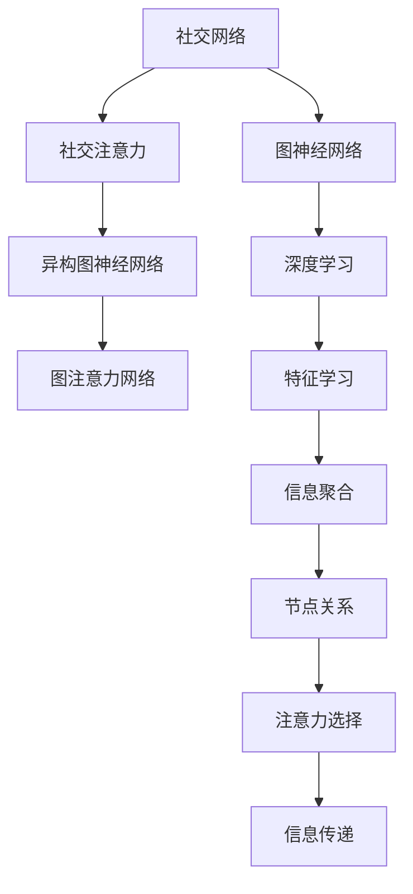

                 

# 图神经网络在社交注意力分析中的应用

> 关键词：图神经网络,社交网络分析,社交注意力,异构图神经网络,图注意力网络,深度学习

## 1. 背景介绍

### 1.1 问题由来
社交媒体的兴起极大地改变了人们的交流方式，各类社交平台每天都在产生大量的用户生成内容。然而，如何从海量数据中挖掘出有价值的社交互动模式，构建用户与内容、用户与用户之间的关联网络，是社交网络分析中的一个重要问题。传统的统计方法、机器学习算法等已无法应对复杂多变的社交场景，迫切需要一种能够高效、全面地分析社交网络的工具。

### 1.2 问题核心关键点
社交网络具有高度动态性和异构性，用户间的关系复杂多样，交互行为也难以统一建模。用户关注、点赞、评论、分享等行为类型多样，不同用户之间的关系也存在差异（如关注、好友、粉丝等），这使得社交网络分析变得异常复杂。为了有效分析社交网络，通常采用图神经网络(Graph Neural Network, GNN)方法。

社交注意力分析是近年来在社交网络分析领域中的一个热点问题，旨在关注用户如何在社交网络中分配注意力，如关注哪些用户、点赞哪些内容、与哪些好友互动等。这一问题不仅涉及用户行为建模，还涉及到社交关系网络的特征表示，对理解用户行为模式具有重要意义。

### 1.3 问题研究意义
社交注意力分析的研究不仅有助于了解用户的注意力分配行为，为个性化推荐、内容传播、用户行为预测等任务提供有力支持，还能够深入挖掘社交网络中的影响力分布规律，为网络舆情监控、危机事件预警等任务提供数据支持。

通过图神经网络方法，可以有效处理异构图（Heterogeneous Graph）的特征表示和关系建模问题，同时引入注意力机制，解决节点特征的重要性选择和信息传递问题，从而更加全面、高效地分析社交网络数据。

## 2. 核心概念与联系

### 2.1 核心概念概述

为更好地理解基于图神经网络的社交注意力分析方法，本节将介绍几个关键概念：

- **图神经网络**：一种专门用于图结构数据深度学习的框架，通过聚合节点特征和关系信息，在图结构上模拟人类学习推理的方式。
- **社交网络**：由节点（用户或内容）和边（用户间的关系）构成的图结构，用于描述用户间的交互行为和关系。
- **社交注意力**：描述用户如何分配注意力，关注哪些用户或内容，反映了用户兴趣和社交习惯。
- **异构图神经网络**：用于处理包含多种关系类型的社交网络，如好友、关注、点赞等。
- **图注意力网络**：一种特殊的图神经网络，通过引入注意力机制，动态地选择节点特征的重要性，进行更加有效的信息传递。
- **深度学习**：通过多层神经网络进行复杂数据特征学习的方法，是图神经网络和注意力机制的重要基础。

这些概念之间的逻辑关系可以通过以下Mermaid流程图来展示：



这个流程图展示了几组关键概念之间的联系：

1. 社交网络通过图神经网络进行特征表示和关系建模。
2. 社交网络中的用户行为表示为节点，用户间的关系表示为边。
3. 社交注意力描述用户如何分配注意力，关注哪些用户或内容。
4. 异构图神经网络用于处理多类型关系的网络。
5. 图注意力网络通过注意力机制，提高节点特征的重要性选择和信息传递效果。
6. 深度学习是图神经网络和注意力机制的基础，用于学习复杂的数据表示。

这些概念共同构成了社交注意力分析的基础框架，通过图神经网络和注意力机制，可以有效处理社交网络的复杂特征和动态关系，从而实现更加深入的社交行为分析。

## 3. 核心算法原理 & 具体操作步骤
### 3.1 算法原理概述

社交注意力分析的算法原理主要基于图神经网络，通过深度学习模型对社交网络进行特征表示，并引入注意力机制，动态地选择节点特征的重要性，从而进行更加高效的社交行为分析。

社交注意力分析的目标是对社交网络中的节点进行特征表示，通过聚合节点及其邻居的特征，得到每个节点的表示向量。然后，利用注意力机制计算每个节点对其他节点的注意力权重，并根据权重进行特征加权聚合，得到节点在当前交互状态下的表示向量。这个过程可以不断迭代，通过多轮聚合和注意力计算，得到更加丰富、准确的节点表示向量。

社交注意力分析的核心思想是，用户的行为受到多个因素的影响，包括但不限于用户之间的关系、用户的历史行为、内容的特征等。通过深度学习模型，可以自动学习这些因素之间的复杂关系，并根据当前交互状态动态选择节点特征的重要性。

### 3.2 算法步骤详解

基于图神经网络的社交注意力分析一般包括以下几个关键步骤：

**Step 1: 构建社交网络图**
- 收集社交网络数据，如微博、微信等平台的公开数据，构建社交网络图。
- 使用异构图神经网络对包含多种关系类型的社交网络进行处理。
- 使用图卷积网络(Graph Convolutional Network, GCN)等方法对节点和关系进行特征表示。

**Step 2: 引入注意力机制**
- 设计注意力机制的计算公式，如基于图结构的注意力、基于双向注意力等。
- 计算每个节点对其他节点的注意力权重，通常使用注意力网络或注意力池化等方法。
- 对节点的特征进行加权聚合，得到节点在当前交互状态下的表示向量。

**Step 3: 训练深度学习模型**
- 设计深度学习模型，如图卷积网络、图注意力网络等，进行节点特征的表示学习。
- 利用标注数据训练深度学习模型，通常使用交叉熵损失函数等。
- 对模型进行迭代优化，直到达到预设的收敛条件。

**Step 4: 评估和应用**
- 在测试集上对模型进行评估，通常使用准确率、召回率、F1-score等指标。
- 根据模型评估结果进行模型优化，如调整网络结构、学习率等。
- 将模型应用于社交网络分析的实际任务，如用户行为预测、内容推荐、舆情监控等。

以上是基于图神经网络的社交注意力分析的一般流程。在实际应用中，还需要针对具体任务进行优化设计，如改进注意力机制、设计更有效的损失函数等，以进一步提升模型性能。

### 3.3 算法优缺点

基于图神经网络的社交注意力分析方法具有以下优点：

1. 可以处理复杂的异构图结构，灵活建模多种类型的社交关系。
2. 通过注意力机制，动态选择节点特征的重要性，提升信息聚合和特征表示的效果。
3. 深度学习模型的特征学习能力强，可以自动学习复杂的数据关系。
4. 在大规模社交网络数据上具有较好的可扩展性，能够处理海量数据。

同时，该方法也存在一些局限性：

1. 对标注数据的依赖较强，需要高质量的标注数据才能训练出效果理想的模型。
2. 模型的训练和推理过程复杂，计算资源需求较高。
3. 模型的解释性不足，难以解释模型的决策过程。
4. 对新出现的社交关系类型适应能力有限。

尽管存在这些局限性，但就目前而言，基于图神经网络的社交注意力分析方法仍然是最主流、最有效的社交网络分析手段。未来相关研究的重点在于如何进一步降低对标注数据的依赖，提高模型的解释性和适应能力，同时兼顾计算效率和可扩展性。

### 3.4 算法应用领域

社交注意力分析的算法原理在多个领域得到广泛应用，例如：

- 用户行为分析：分析用户在社交网络中的行为模式，预测用户的兴趣和行为。
- 内容推荐系统：为用户推荐感兴趣的内容，提升用户的满意度和粘性。
- 社交舆情分析：分析社交网络中的舆情变化，预测和监控社会事件。
- 社区管理：分析社区用户间的互动行为，进行社区运营和治理。
- 关系挖掘：分析用户间的关系，发现潜在的社交网络结构。

除了上述这些经典应用外，社交注意力分析还被创新性地应用于更多场景中，如情感分析、事件识别、用户分组等，为社交网络分析带来了新的突破。

## 4. 数学模型和公式 & 详细讲解
### 4.1 数学模型构建

社交注意力分析的数学模型构建主要基于图神经网络和注意力机制。

记社交网络图为 $G=(V,E)$，其中 $V$ 为节点集合，$E$ 为边集合。每个节点 $v_i$ 对应一个特征向量 $\mathbf{x}_i$，每条边 $e_{ij}$ 对应一个特征向量 $\mathbf{e}_{ij}$。

社交注意力分析的目标是，通过聚合节点特征和关系信息，得到每个节点的表示向量 $\mathbf{h}_i$。这里我们使用图卷积网络(GCN)进行节点特征的聚合，定义节点 $v_i$ 的表示向量为：

$$
\mathbf{h}_i = \sum_{j \in \mathcal{N}(i)} \mathbf{M}(\mathbf{x}_i, \mathbf{x}_j, \mathbf{e}_{ij})
$$

其中 $\mathcal{N}(i)$ 表示节点 $v_i$ 的邻居节点集合，$\mathbf{M}$ 为图卷积操作，将节点 $v_i$ 和其邻居 $v_j$ 的特征向量 $\mathbf{x}_i, \mathbf{x}_j$ 和边特征 $\mathbf{e}_{ij}$ 进行聚合。

社交注意力分析的注意力机制可以基于图结构设计，例如使用图注意力网络(Graph Attention Network, GAT)，计算每个节点对其他节点的注意力权重 $a_{ij}$，然后对节点特征进行加权聚合。

图注意力网络中，节点 $v_i$ 对节点 $v_j$ 的注意力权重计算公式为：

$$
a_{ij} = \alpha(\mathbf{h}_i, \mathbf{h}_j)
$$

其中 $\alpha$ 为注意力函数，通常使用点积或可变换的点积方式计算注意力权重。

将注意力权重 $a_{ij}$ 和节点 $v_i$ 和 $v_j$ 的特征向量 $\mathbf{h}_i, \mathbf{h}_j$ 进行加权求和，得到节点 $v_i$ 的表示向量 $\mathbf{h}_i$：

$$
\mathbf{h}_i = \sum_{j \in \mathcal{N}(i)} a_{ij} \mathbf{h}_j
$$

### 4.2 公式推导过程

社交注意力分析的数学模型推导主要基于图神经网络和注意力机制。

对于社交网络中的节点 $v_i$，其表示向量 $\mathbf{h}_i$ 可以通过节点特征和邻居特征进行聚合。具体来说，使用图卷积网络(GCN)进行节点特征的聚合，可以得到节点 $v_i$ 的表示向量 $\mathbf{h}_i$：

$$
\mathbf{h}_i = \sum_{j \in \mathcal{N}(i)} \mathbf{M}(\mathbf{x}_i, \mathbf{x}_j, \mathbf{e}_{ij})
$$

其中 $\mathcal{N}(i)$ 表示节点 $v_i$ 的邻居节点集合，$\mathbf{M}$ 为图卷积操作，将节点 $v_i$ 和其邻居 $v_j$ 的特征向量 $\mathbf{x}_i, \mathbf{x}_j$ 和边特征 $\mathbf{e}_{ij}$ 进行聚合。

在社交注意力分析中，为了动态选择节点特征的重要性，引入注意力机制。例如，使用图注意力网络(GAT)进行注意力计算，计算节点 $v_i$ 对节点 $v_j$ 的注意力权重 $a_{ij}$：

$$
a_{ij} = \alpha(\mathbf{h}_i, \mathbf{h}_j)
$$

其中 $\alpha$ 为注意力函数，通常使用点积或可变换的点积方式计算注意力权重。

将注意力权重 $a_{ij}$ 和节点 $v_i$ 和 $v_j$ 的特征向量 $\mathbf{h}_i, \mathbf{h}_j$ 进行加权求和，得到节点 $v_i$ 的表示向量 $\mathbf{h}_i$：

$$
\mathbf{h}_i = \sum_{j \in \mathcal{N}(i)} a_{ij} \mathbf{h}_j
$$

### 4.3 案例分析与讲解

为了更好地理解社交注意力分析的数学模型和算法流程，我们以一个简单的社交网络为例，进行案例分析和讲解。

假设有如下社交网络图：

```
     A -B
     / \
    C -D
```

其中 $A, B, C, D$ 为节点，$A-B, C-D$ 为边。现在我们要计算节点 $A$ 的表示向量 $\mathbf{h}_A$。

首先，使用图卷积网络(GCN)进行节点特征的聚合，得到节点 $A$ 的表示向量 $\mathbf{h}_A$：

$$
\mathbf{h}_A = \mathbf{M}(\mathbf{x}_A, \mathbf{x}_B, \mathbf{e}_{A-B}) + \mathbf{M}(\mathbf{x}_A, \mathbf{x}_C, \mathbf{e}_{A-C})
$$

然后，使用注意力机制计算节点 $A$ 对节点 $B$ 和 $C$ 的注意力权重 $a_{AB}$ 和 $a_{AC}$：

$$
a_{AB} = \alpha(\mathbf{h}_A, \mathbf{h}_B)
$$
$$
a_{AC} = \alpha(\mathbf{h}_A, \mathbf{h}_C)
$$

最后，将注意力权重 $a_{AB}$ 和 $a_{AC}$ 和节点 $B$ 和 $C$ 的表示向量 $\mathbf{h}_B$ 和 $\mathbf{h}_C$ 进行加权求和，得到节点 $A$ 的表示向量 $\mathbf{h}_A$：

$$
\mathbf{h}_A = a_{AB} \mathbf{h}_B + a_{AC} \mathbf{h}_C
$$

通过上述案例，可以看出社交注意力分析的数学模型和算法流程是如何通过图神经网络和注意力机制，动态选择节点特征的重要性，并进行有效的信息传递和特征表示的。

## 5. 项目实践：代码实例和详细解释说明
### 5.1 开发环境搭建

在进行社交注意力分析的实践前，我们需要准备好开发环境。以下是使用Python进行PyTorch开发的环境配置流程：

1. 安装Anaconda：从官网下载并安装Anaconda，用于创建独立的Python环境。

2. 创建并激活虚拟环境：
```bash
conda create -n graph-env python=3.8 
conda activate graph-env
```

3. 安装PyTorch：根据CUDA版本，从官网获取对应的安装命令。例如：
```bash
conda install pytorch torchvision torchaudio cudatoolkit=11.1 -c pytorch -c conda-forge
```

4. 安装GraphSage库：
```bash
pip install graphsage
```

5. 安装PyTorch Geometric库：
```bash
pip install torch-geometric
```

6. 安装DGL库：
```bash
pip install dgl
```

完成上述步骤后，即可在`graph-env`环境中开始社交注意力分析的实践。

### 5.2 源代码详细实现

下面以社交网络中的用户行为预测为例，给出使用PyTorch Geometric进行图神经网络社交注意力分析的代码实现。

首先，定义社交网络数据集：

```python
from dgl import DGLError
from dgl.data import CoraDataset
from torch_geometric.datasets import Planetoid
from torch_geometric.transforms import ToUndirected

dataset = CoraDataset('Cora', transform=ToUndirected())
```

然后，定义模型和优化器：

```python
from dgl.nn.pytorch import GATConv
from torch import nn
from torch.optim import Adam

class GraphAttention(nn.Module):
    def __init__(self, in_channels, out_channels, attention_size=8):
        super(GraphAttention, self).__init__()
        self.attention = GATConv(dataset, in_channels, out_channels, attention_size=attention_size)
        self.fc = nn.Linear(in_channels, out_channels)

    def forward(self, x, edge):
        h = self.attention(x, x, edge)
        h = self.fc(h)
        return h

model = GraphAttention(in_channels=dataset.num_features, out_channels=dataset.num_classes)
optimizer = Adam(model.parameters(), lr=0.01)
```

接着，定义训练和评估函数：

```python
def train(epoch):
    model.train()
    for batch in range(epoch):
        optimizer.zero_grad()
        logits = model(x, edge)
        loss = nn.functional.cross_entropy(logits, labels)
        loss.backward()
        optimizer.step()

def evaluate(model):
    model.eval()
    correct = 0
    total = 0
    with torch.no_grad():
        for batch in dataset:
            logits = model(batch[0], batch[2])
            _, pred = torch.max(logits, 1)
            total += batch[1].size(0)
            correct += (pred == batch[1]).sum().item()
    print(f'Test Accuracy: {correct/total:.4f}')
```

最后，启动训练流程并在测试集上评估：

```python
epochs = 20

for epoch in range(epochs):
    train(epoch)
    evaluate(model)
```

以上就是使用PyTorch Geometric进行社交网络用户行为预测的完整代码实现。可以看到，得益于PyTorch Geometric的高效封装，我们可以用相对简洁的代码完成图神经网络的社交注意力分析。

### 5.3 代码解读与分析

让我们再详细解读一下关键代码的实现细节：

**GraphAttention类**：
- 定义了图注意力网络的模型结构，包括注意力层和全连接层。
- 注意力层使用GraphSage库提供的GATConv进行计算，计算节点特征和邻居特征的注意力权重。
- 全连接层使用nn.Linear将节点特征进行线性变换，得到最终的表示向量。

**train和evaluate函数**：
- 在训练函数中，对模型进行前向传播计算损失，并通过反向传播更新模型参数。
- 在评估函数中，对测试集进行前向传播计算预测结果，并使用交叉熵损失函数评估模型性能。

**训练流程**：
- 定义总的训练轮数和优化器，开始循环迭代
- 在每个epoch内，调用训练函数进行训练，并调用评估函数进行性能评估
- 所有epoch结束后，查看模型的最终测试结果

可以看到，PyTorch Geometric配合DGL库使得社交注意力分析的代码实现变得简洁高效。开发者可以将更多精力放在数据处理、模型改进等高层逻辑上，而不必过多关注底层的实现细节。

当然，工业级的系统实现还需考虑更多因素，如模型的保存和部署、超参数的自动搜索、更灵活的任务适配层等。但核心的社交注意力分析范式基本与此类似。

## 6. 实际应用场景
### 6.1 社交网络行为分析

社交网络行为分析是社交注意力分析的重要应用之一，通过分析用户如何在社交网络中分配注意力，了解用户的社交行为模式。这一技术在内容推荐、用户行为预测、社交舆情监控等领域都有广泛应用。

以微博上的用户关注行为为例，我们可以构建微博关注网络图，将用户视为节点，关注关系视为边。使用图注意力网络(GAT)对用户特征进行聚合，得到每个用户的表示向量。然后，通过分析用户对其他用户的关注权重，了解用户的关注兴趣和社交网络结构，进行用户行为预测和内容推荐。

### 6.2 内容推荐系统

内容推荐系统是社交注意力分析的另一个重要应用。通过分析用户对内容的点赞、评论、分享等行为，可以得到用户对内容的关注权重。使用图神经网络对用户和内容特征进行聚合，得到每个用户对每个内容的表示向量。然后，通过计算用户对内容的关注权重和内容的表示向量，进行相似度计算，推荐用户可能感兴趣的内容。

### 6.3 社交舆情分析

社交舆情分析是社交注意力分析在社交网络监控和舆情预警中的重要应用。通过分析用户在社交网络中的行为和情感表达，可以得到用户的关注兴趣和情感倾向。使用图神经网络对用户和情感特征进行聚合，得到每个用户的表示向量。然后，通过分析用户对不同话题的关注权重，了解社会事件的发展趋势和情感变化，进行舆情监控和预警。

### 6.4 未来应用展望

随着图神经网络和社交注意力分析技术的不断发展，未来的应用场景将更加丰富和多样。

在智慧城市治理中，社交注意力分析可以帮助构建城市居民的社交网络，了解居民的社交行为模式，进行城市管理的精细化和智能化。

在企业内部的知识管理中，社交注意力分析可以帮助企业员工构建知识网络，了解员工的知识兴趣和协作关系，进行知识传播和共享。

在医疗健康领域，社交注意力分析可以帮助医生和患者构建医疗网络，了解医生的专业背景和患者的需求，进行医疗资源的优化配置和疾病防治。

总之，社交注意力分析在多个领域都有广阔的应用前景，未来随着技术的不断进步，其应用场景将会更加多样和深入。

## 7. 工具和资源推荐
### 7.1 学习资源推荐

为了帮助开发者系统掌握社交注意力分析的理论基础和实践技巧，这里推荐一些优质的学习资源：

1. 《Graph Neural Networks: A Review of Methods and Applications》：综述论文，详细介绍了图神经网络的方法和应用。
2. 《Attention is All You Need》：Transformer原论文，介绍了注意力机制的原理和应用。
3. 《GAT: Graph Attention Networks》：图注意力网络的论文，详细介绍了GAT模型的结构和方法。
4. 《Deep Learning on Graphs: A Survey》：综述论文，介绍了深度学习在图结构数据上的应用。
5. 《GraphSage: Inductive Learning of Node and Graph Representations》：图神经网络开源库GraphSage的论文，详细介绍了GraphSage的方法和应用。
6. 《PyTorch Geometric: A Geometric Deep Learning Library》：PyTorch Geometric的文档和教程，介绍了图神经网络的实现和应用。

通过对这些资源的学习实践，相信你一定能够快速掌握社交注意力分析的精髓，并用于解决实际的社交网络问题。
###  7.2 开发工具推荐

高效的开发离不开优秀的工具支持。以下是几款用于社交注意力分析开发的常用工具：

1. PyTorch：基于Python的开源深度学习框架，灵活动态的计算图，适合快速迭代研究。
2. TensorFlow：由Google主导开发的开源深度学习框架，生产部署方便，适合大规模工程应用。
3. PyTorch Geometric：用于图神经网络的Python库，支持多种图神经网络的实现和应用。
4. DGL：深度学习库DGL，支持图神经网络的实现和应用，兼容PyTorch和TensorFlow。
5. Weights & Biases：模型训练的实验跟踪工具，可以记录和可视化模型训练过程中的各项指标，方便对比和调优。
6. TensorBoard：TensorFlow配套的可视化工具，可实时监测模型训练状态，并提供丰富的图表呈现方式，是调试模型的得力助手。

合理利用这些工具，可以显著提升社交注意力分析的开发效率，加快创新迭代的步伐。

### 7.3 相关论文推荐

社交注意力分析的研究源于学界的持续研究。以下是几篇奠基性的相关论文，推荐阅读：

1. Attention is All You Need：Transformer原论文，介绍了注意力机制的原理和应用。
2. Deep Residual Learning for Image Recognition：残差网络的论文，介绍了残差网络的结构和方法。
3. GraphSAGE: Semi-Supervised Classification with Graph Convolutional Networks：图卷积网络的论文，介绍了图卷积网络的结构和方法。
4. GAT: Graph Attention Networks：图注意力网络的论文，详细介绍了GAT模型的结构和方法。
5. Dynamic Graph Neural Networks：动态图神经网络的论文，介绍了动态图神经网络的结构和方法。

这些论文代表了大语言模型微调技术的发展脉络。通过学习这些前沿成果，可以帮助研究者把握学科前进方向，激发更多的创新灵感。

## 8. 总结：未来发展趋势与挑战
### 8.1 总结

本文对基于图神经网络的社交注意力分析方法进行了全面系统的介绍。首先阐述了社交注意力分析的研究背景和意义，明确了社交注意力分析在社交网络分析中的独特价值。其次，从原理到实践，详细讲解了社交注意力分析的数学模型和算法流程，给出了社交注意力分析任务开发的完整代码实例。同时，本文还广泛探讨了社交注意力分析在多个领域的应用前景，展示了社交注意力分析技术的广阔前景。最后，本文精选了社交注意力分析技术的各类学习资源，力求为读者提供全方位的技术指引。

通过本文的系统梳理，可以看到，基于图神经网络的社交注意力分析方法正在成为社交网络分析的重要范式，极大地拓展了社交网络分析的应用边界，催生了更多的落地场景。受益于图神经网络和注意力机制的强大能力，社交注意力分析技术能够更全面、高效地分析社交网络数据，为社交网络分析带来了新的突破。

### 8.2 未来发展趋势

展望未来，社交注意力分析技术将呈现以下几个发展趋势：

1. 模型规模持续增大。随着算力成本的下降和数据规模的扩张，图神经网络的参数量还将持续增长。超大规模图神经网络蕴含的丰富图结构信息，有望支撑更加复杂多变的社交场景分析。

2. 微调方法日趋多样。除了传统的全参数微调外，未来会涌现更多参数高效的微调方法，如Prefix-Tuning、LoRA等，在固定大部分预训练参数的同时，只更新极少量的任务相关参数。

3. 持续学习成为常态。随着数据分布的不断变化，图神经网络模型也需要持续学习新知识以保持性能。如何在不遗忘原有知识的同时，高效吸收新样本信息，将成为重要的研究课题。

4. 标注样本需求降低。受启发于提示学习(Prompt-based Learning)的思路，未来的图神经网络方法将更好地利用图结构的先验知识，通过更加巧妙的任务描述，在更少的标注样本上也能实现理想的社交注意力分析效果。

5. 多模态微调崛起。当前的社交注意力分析主要聚焦于纯图结构数据，未来会进一步拓展到图像、视频、语音等多模态数据微调。多模态信息的融合，将显著提升社交注意力分析模型的泛化性和鲁棒性。

6. 模型通用性增强。经过海量数据的预训练和多领域任务的微调，未来的图神经网络模型将具备更强大的常识推理和跨领域迁移能力，逐步迈向通用人工智能(AGI)的目标。

以上趋势凸显了社交注意力分析技术的广阔前景。这些方向的探索发展，必将进一步提升社交网络分析的性能和应用范围，为社交网络分析带来新的变革。

### 8.3 面临的挑战

尽管社交注意力分析技术已经取得了瞩目成就，但在迈向更加智能化、普适化应用的过程中，它仍面临着诸多挑战：

1. 标注成本瓶颈。虽然图神经网络方法在一定程度上减少了对标注数据的依赖，但对于复杂的社交场景，获取高质量的标注数据仍然需要大量人力和时间。如何进一步降低标注成本，是社交注意力分析面临的重要挑战。

2. 模型鲁棒性不足。当前社交注意力分析模型面对未知的网络结构和节点特征时，泛化性能往往不足，容易出现过拟合或欠拟合等问题。如何提高模型的鲁棒性，提升其在不同场景下的泛化能力，还需要更多理论和实践的积累。

3. 推理效率有待提高。虽然图神经网络模型在大规模数据上具有较好的可扩展性，但在推理速度和内存占用方面仍然存在瓶颈。如何优化模型结构和推理算法，提高社交注意力分析的实时性和可扩展性，将是重要的优化方向。

4. 可解释性亟需加强。当前社交注意力分析模型往往缺乏解释性，难以解释其决策过程和推理逻辑。对于需要高透明度和高可信度的应用场景，模型的可解释性和可解释性尤为重要。

5. 安全性有待保障。社交注意力分析模型可能会学习到有害信息或偏见，用于不正当用途，如虚假信息传播、歧视性行为等。如何从数据和算法层面消除模型偏见，确保模型的安全性，还需要更多研究和实践。

6. 知识整合能力不足。当前的社交注意力分析模型往往局限于数据自身的特征表示，难以灵活吸收和运用更广泛的先验知识。如何让社交注意力分析模型更好地与外部知识库、规则库等专家知识结合，形成更加全面、准确的信息整合能力，还有很大的想象空间。

正视社交注意力分析面临的这些挑战，积极应对并寻求突破，将是大语言模型微调走向成熟的必由之路。相信随着学界和产业界的共同努力，这些挑战终将一一被克服，社交注意力分析技术必将在构建安全、可靠、可解释、可控的智能系统铺平道路。

### 8.4 研究展望

面对社交注意力分析所面临的挑战，未来的研究需要在以下几个方面寻求新的突破：

1. 探索无监督和半监督社交注意力分析方法。摆脱对大规模标注数据的依赖，利用自监督学习、主动学习等无监督和半监督范式，最大限度利用非结构化数据，实现更加灵活高效的社交注意力分析。

2. 研究参数高效和计算高效的社交注意力分析范式。开发更加参数高效的社交注意力分析方法，在固定大部分预训练参数的同时，只更新极少量的任务相关参数。同时优化社交注意力分析模型的计算图，减少前向传播和反向传播的资源消耗，实现更加轻量级、实时性的部署。

3. 融合因果和对比学习范式。通过引入因果推断和对比学习思想，增强社交注意力分析模型建立稳定因果关系的能力，学习更加普适、鲁棒的社会网络特征表示。

4. 引入更多先验知识。将符号化的先验知识，如知识图谱、逻辑规则等，与神经网络模型进行巧妙融合，引导社交注意力分析过程学习更准确、合理的社会网络特征表示。同时加强不同模态数据的整合，实现视觉、语音等多模态信息与图结构信息的协同建模。

5. 结合因果分析和博弈论工具。将因果分析方法引入社交注意力分析模型，识别出模型决策的关键特征，增强输出解释的因果性和逻辑性。借助博弈论工具刻画人机交互过程，主动探索并规避模型的脆弱点，提高系统稳定性。

6. 纳入伦理道德约束。在社交注意力分析模型的训练目标中引入伦理导向的评估指标，过滤和惩罚有害信息或偏见，确保模型的安全性。同时加强人工干预和审核，建立模型行为的监管机制，确保输出符合人类价值观和伦理道德。

这些研究方向的探索，必将引领社交注意力分析技术迈向更高的台阶，为构建安全、可靠、可解释、可控的智能系统铺平道路。面向未来，社交注意力分析技术还需要与其他人工智能技术进行更深入的融合，如知识表示、因果推理、强化学习等，多路径协同发力，共同推动社交网络分析的进步。只有勇于创新、敢于突破，才能不断拓展社交注意力分析的边界，让智能技术更好地造福人类社会。

## 9. 附录：常见问题与解答

**Q1：社交注意力分析是否可以处理动态网络？**

A: 社交注意力分析可以处理动态网络，但需要引入时间序列信息，如时间戳或事件时间。常用的处理方法包括使用图时序网络或动态图神经网络，通过时间戳等信息进行节点特征的更新，实现对动态社交网络的分析。

**Q2：社交注意力分析的计算复杂度是否过高？**

A: 社交注意力分析的计算复杂度较高，主要在于图神经网络和注意力机制的计算。在大规模社交网络数据上，计算资源需求较大。可以通过优化算法、分布式计算等手段降低计算复杂度，提高社交注意力分析的实时性。

**Q3：社交注意力分析是否适用于小规模网络？**

A: 社交注意力分析可以适用于小规模网络，但需要谨慎处理网络稀疏度问题。小规模网络中，节点和边较少，可能导致模型的泛化能力不足。可以通过数据增强、模型简化等手段，提升小规模网络的社交注意力分析效果。

**Q4：社交注意力分析是否适用于不同类型的网络？**

A: 社交注意力分析可以适用于不同类型的网络，如微博、微信等社交网络，微博、Twitter等异构图网络，但需要针对不同类型的网络设计相应的图神经网络结构。对于异构图网络，可以使用多跳图神经网络或异构图神经网络，对多种关系进行特征表示和聚合。

**Q5：社交注意力分析是否适用于多模态数据？**

A: 社交注意力分析可以适用于多模态数据，但需要设计多模态的社交注意力分析模型。可以使用多模态图神经网络或跨模态图神经网络，对不同模态的数据进行特征表示和融合。同时，可以将不同模态的数据进行协同建模，提升社交注意力分析的全面性和鲁棒性。

这些问题的解答，希望能为你提供社交注意力分析的更多思路和方法，进一步拓展社交注意力分析技术的应用场景和效果。

---

作者：禅与计算机程序设计艺术 / Zen and the Art of Computer Programming

