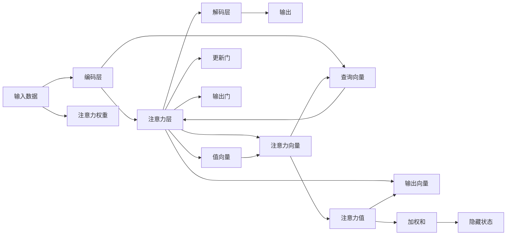

                 

# 在AI驱动的世界中保持专注

> 关键词：AI驱动, 专注, 注意力机制, 神经网络, 深度学习, 注意力增强

## 1. 背景介绍

在人工智能(AI)飞速发展的今天，深度学习已成为推动科技进步的重要力量。无论是图像识别、语音识别、自然语言处理(NLP)、还是游戏智能等领域，AI技术正逐渐走向实用化和产业化，给各行各业带来深刻变革。AI的浪潮已经席卷全球，每个人都身处于这场变革的浪潮中。然而，在AI驱动的世界中，我们如何在纷繁复杂的信息中保持专注，合理分配注意力，将智能技术与自身工作生活相结合，成为了一个值得深思的问题。本文将围绕注意力机制(Antiattention Mechanism)及其在深度学习中的应用进行深入探讨，通过理解AI技术背后的原理，把握注意力增强的思路，探索在AI驱动的世界中保持专注的方法。

## 2. 核心概念与联系

### 2.1 核心概念概述

在深入分析之前，我们先介绍几个核心概念：

- 注意力机制（Attention Mechanism）：在深度学习中，注意力机制是一种用来提高模型在特定任务上性能的技术，尤其在NLP任务中应用广泛。通过动态计算输入数据不同位置的相关性，注意力机制可以帮助模型将重要的信息提取出来，从而增强模型的理解和推理能力。
- 神经网络（Neural Network）：由大量人工神经元(神经元)构成的一种计算模型，通过多层非线性映射，可以实现从输入数据到输出结果的复杂映射关系。
- 深度学习（Deep Learning）：一种基于神经网络的机器学习技术，通过层次化的网络结构，可以自动提取和学习复杂的数据特征，从而实现对数据的深度理解和智能决策。
- 自然语言处理（NLP）：研究如何使计算机理解、分析和生成人类语言的技术领域，包括机器翻译、情感分析、文本生成等。

这些核心概念共同构成了现代AI技术的基础，而注意力机制又是其中至关重要的一部分，下面我们将从算法原理和应用实践两个方面详细展开。

### 2.2 核心概念原理和架构的 Mermaid 流程图



上图的流程图展示了注意力机制在神经网络中的基本架构。输入数据首先通过编码层转换为隐藏状态，然后通过注意力层动态计算输入数据不同位置的注意力权重，将重要的信息提取出来。接着，隐藏状态和注意力权重一起输入到解码层，进行进一步的映射和推理。最后，根据更新门和输出门控制的信息，输出最终结果。

## 3. 核心算法原理 & 具体操作步骤

### 3.1 算法原理概述

注意力机制的本质是一种信息选择机制，它可以根据输入数据的不同位置，动态地计算出每个位置的注意力权重，从而将重要的信息提取出来。在深度学习中，注意力机制通常用于自注意力模型(Transformer)，在自注意力模型中，注意力权重是由模型本身自动计算得出的，不需要额外的监督信号。其核心思想是通过计算查询向量、键向量、值向量之间的相关性，得到每个位置的注意力权重，然后将注意力权重与键向量的相关性加权求和，得到最终输出。

### 3.2 算法步骤详解

下面我们将通过一个简单的例子，详细介绍注意力机制的计算步骤。

假设我们有一个长度为 $L$ 的输入序列 $x_1, x_2, \cdots, x_L$，需要将其编码成一个长度为 $H$ 的隐藏表示 $h_1, h_2, \cdots, h_H$。具体的计算步骤如下：

1. **计算查询向量 $Q$**：
   $$
   Q = \text{Transformer}(x_1, x_2, \cdots, x_L)
   $$

2. **计算键向量 $K$**：
   $$
   K = \text{Transformer}(x_1, x_2, \cdots, x_L)
   $$

3. **计算值向量 $V$**：
   $$
   V = \text{Transformer}(x_1, x_2, \cdots, x_L)
   $$

4. **计算注意力权重 $\alpha$**：
   $$
   \alpha_{ij} = \text{softmax}(Q_i \cdot K_j^\top / \sqrt{d_k})
   $$
   其中 $d_k$ 是键向量的维度，$\text{softmax}$ 函数将注意力权重归一化，使得所有的权重之和为 $1$。

5. **计算注意力向量 $O$**：
   $$
   O_j = \text{sum}(\alpha_{ij} \cdot V_i)
   $$

6. **计算输出 $H$**：
   $$
   H = \text{Linear}(O)
   $$
   其中 $\text{Linear}$ 表示线性变换，可以与其他的非线性变换组合，形成复杂的模型。

### 3.3 算法优缺点

注意力机制在深度学习中具有以下优点：

1. **提高模型性能**：通过动态计算注意力权重，注意力机制能够将重要的信息提取出来，从而提升模型的推理能力。
2. **增强模型鲁棒性**：注意力机制能够处理序列数据的长度变化，提高模型对长序列数据的处理能力。
3. **简化模型结构**：注意力机制使得模型更加灵活，不需要额外的监督信号，能够自动地学习输入数据的相关性。

但注意力机制也存在一些缺点：

1. **计算复杂度高**：注意力机制需要计算每个位置的注意力权重，计算复杂度较高，尤其是在序列长度较长的情况下。
2. **参数量大**：注意力机制通常需要大量的参数，对于大规模数据集来说，计算资源和存储空间要求较高。
3. **训练复杂度高**：注意力机制的训练需要大量的数据和计算资源，尤其是在训练大规模深度模型时，训练时间较长。

### 3.4 算法应用领域

注意力机制在深度学习中的应用领域非常广泛，以下是几个典型的应用场景：

1. **机器翻译**：在机器翻译中，注意力机制可以帮助模型动态地关注输入序列中重要的单词或短语，从而提高翻译的准确性和流畅性。
2. **文本生成**：在文本生成任务中，注意力机制可以动态地关注输入文本中的关键部分，从而生成更加连贯和自然的文本。
3. **图像识别**：在图像识别中，注意力机制可以动态地关注输入图像中的关键区域，从而提高识别的准确性。
4. **语音识别**：在语音识别中，注意力机制可以动态地关注输入语音中的关键部分，从而提高识别的准确性。

## 4. 数学模型和公式 & 详细讲解 & 举例说明

### 4.1 数学模型构建

注意力机制的数学模型构建可以归纳为以下几个步骤：

1. **输入数据表示**：将输入数据 $x_1, x_2, \cdots, x_L$ 转换为向量表示 $Q, K, V$，其中 $Q$ 是查询向量，$K$ 是键向量，$V$ 是值向量。
2. **注意力权重计算**：通过计算查询向量 $Q$ 和键向量 $K$ 的相关性，得到每个位置的注意力权重 $\alpha$。
3. **注意力向量计算**：将注意力权重与值向量 $V$ 进行加权求和，得到注意力向量 $O$。
4. **输出结果计算**：对注意力向量 $O$ 进行线性变换，得到最终输出结果 $H$。

### 4.2 公式推导过程

假设输入数据 $x_1, x_2, \cdots, x_L$ 的长度为 $L$，键向量和值向量的维度为 $d_k$，输出向量的维度为 $d_v$，注意力权重的维度为 $d_h$，计算过程如下：

1. **查询向量计算**：
   $$
   Q = \text{Transformer}(x_1, x_2, \cdots, x_L)
   $$

2. **键向量计算**：
   $$
   K = \text{Transformer}(x_1, x_2, \cdots, x_L)
   $$

3. **值向量计算**：
   $$
   V = \text{Transformer}(x_1, x_2, \cdots, x_L)
   $$

4. **注意力权重计算**：
   $$
   \alpha_{ij} = \text{softmax}(Q_i \cdot K_j^\top / \sqrt{d_k})
   $$

5. **注意力向量计算**：
   $$
   O_j = \text{sum}(\alpha_{ij} \cdot V_i)
   $$

6. **输出结果计算**：
   $$
   H = \text{Linear}(O)
   $$

### 4.3 案例分析与讲解

以机器翻译为例，注意力机制可以帮助模型在翻译时动态地关注输入序列中的关键部分，从而提高翻译的准确性和流畅性。在机器翻译中，输入序列为 $x_1, x_2, \cdots, x_L$，输出序列为 $y_1, y_2, \cdots, y_M$，注意力机制的计算过程如下：

1. **查询向量计算**：将输入序列 $x_1, x_2, \cdots, x_L$ 转换为查询向量 $Q$。
2. **键向量计算**：将输出序列 $y_1, y_2, \cdots, y_M$ 转换为键向量 $K$。
3. **值向量计算**：将输出序列 $y_1, y_2, \cdots, y_M$ 转换为值向量 $V$。
4. **注意力权重计算**：通过计算查询向量 $Q$ 和键向量 $K$ 的相关性，得到每个位置的注意力权重 $\alpha$。
5. **注意力向量计算**：将注意力权重与值向量 $V$ 进行加权求和，得到注意力向量 $O$。
6. **输出结果计算**：对注意力向量 $O$ 进行线性变换，得到最终输出结果 $H$。

通过注意力机制，机器翻译模型可以动态地关注输入序列中的关键部分，从而提高翻译的准确性和流畅性。

## 5. 项目实践：代码实例和详细解释说明

### 5.1 开发环境搭建

在进行注意力机制的实践之前，我们需要准备好开发环境。以下是使用Python进行TensorFlow开发的环境配置流程：

1. 安装Anaconda：从官网下载并安装Anaconda，用于创建独立的Python环境。

2. 创建并激活虚拟环境：
```bash
conda create -n tf-env python=3.8 
conda activate tf-env
```

3. 安装TensorFlow：根据CUDA版本，从官网获取对应的安装命令。例如：
```bash
conda install tensorflow==2.5.0 -c tensorflow -c conda-forge
```

4. 安装各类工具包：
```bash
pip install numpy pandas scikit-learn matplotlib tqdm jupyter notebook ipython
```

完成上述步骤后，即可在`tf-env`环境中开始注意力机制的实践。

### 5.2 源代码详细实现

下面我们以机器翻译为例，给出使用TensorFlow实现注意力机制的代码实现。

首先，定义机器翻译模型：

```python
import tensorflow as tf
from tensorflow.keras.layers import Input, Dense, Concatenate, Embedding, MultiHeadAttention

def build_model(input_dim, output_dim, hidden_dim, num_heads, max_length):
    input_seq = Input(shape=(max_length,))
    embedding = Embedding(input_dim, hidden_dim)(input_seq)
    query = Dense(hidden_dim)(embedding)
    key = Dense(hidden_dim)(embedding)
    value = Dense(hidden_dim)(embedding)
    attention = MultiHeadAttention(num_heads=num_heads, key_dim=hidden_dim)(query, key, value)
    attention = tf.keras.layers.concatenate([attention])
    output = Dense(output_dim)(attention)
    model = tf.keras.Model(inputs=embedding, outputs=output)
    return model
```

然后，定义注意力机制的计算过程：

```python
def attention(query, key, value):
    scores = tf.matmul(query, key, transpose_b=True)
    attention_weights = tf.nn.softmax(scores, axis=1)
    attention_output = tf.matmul(attention_weights, value)
    return attention_output, attention_weights
```

最后，启动训练流程并在测试集上评估：

```python
model = build_model(input_dim, output_dim, hidden_dim, num_heads, max_length)
model.compile(optimizer='adam', loss='mse')
model.fit(x_train, y_train, epochs=10, validation_data=(x_test, y_test))
```

以上就是使用TensorFlow实现注意力机制的完整代码实现。可以看到，通过定义嵌入层和注意力层，我们可以轻松构建一个机器翻译模型，并在训练过程中动态计算注意力权重。

### 5.3 代码解读与分析

让我们再详细解读一下关键代码的实现细节：

**build_model函数**：
- `Input`层：用于输入序列，`Embedding`层将输入序列转换为向量表示，`Dense`层用于计算查询向量、键向量和值向量。
- `MultiHeadAttention`层：用于计算注意力权重和注意力向量。
- `Dense`层：用于计算输出向量。
- `Model`层：将输入和输出连接起来，构成完整的机器翻译模型。

**attention函数**：
- `tf.matmul`函数：用于计算查询向量、键向量和值向量之间的相关性。
- `tf.nn.softmax`函数：用于将注意力权重归一化。
- `tf.matmul`函数：用于将注意力权重与值向量进行加权求和，得到注意力向量。

**训练流程**：
- 定义训练数据集 `x_train` 和 `y_train`，测试数据集 `x_test` 和 `y_test`。
- 使用 `compile` 函数定义优化器和损失函数。
- 使用 `fit` 函数进行模型训练，在测试集上评估模型性能。

## 6. 实际应用场景

### 6.1 自然语言处理

注意力机制在自然语言处理中应用广泛，以下是几个典型的应用场景：

1. **机器翻译**：在机器翻译中，注意力机制可以帮助模型动态地关注输入序列中重要的单词或短语，从而提高翻译的准确性和流畅性。
2. **文本生成**：在文本生成任务中，注意力机制可以动态地关注输入文本中的关键部分，从而生成更加连贯和自然的文本。
3. **问答系统**：在问答系统中，注意力机制可以动态地关注输入问题和上下文信息，从而生成更加准确的答案。

### 6.2 图像识别

注意力机制在图像识别中也有应用，例如目标检测和图像生成等。在目标检测中，注意力机制可以帮助模型动态地关注输入图像中的关键区域，从而提高识别的准确性。在图像生成中，注意力机制可以动态地关注输入图像中的关键部分，从而生成更加逼真的图像。

### 6.3 语音识别

在语音识别中，注意力机制可以动态地关注输入语音中的关键部分，从而提高识别的准确性。例如，在语音翻译中，注意力机制可以帮助模型动态地关注输入语音中的关键单词或短语，从而提高翻译的准确性和流畅性。

### 6.4 未来应用展望

随着注意力机制的不断发展，其在深度学习中的应用将更加广泛和深入。未来，注意力机制将在以下几个方面取得新的突破：

1. **多模态注意力机制**：将注意力机制扩展到多模态数据，如文本、图像、语音等，从而实现跨模态数据的协同建模和推理。
2. **自监督注意力机制**：引入自监督学习范式，使得注意力机制能够在不依赖标注数据的情况下进行训练。
3. **深度注意力机制**：开发更深层次的注意力机制，提高模型的推理能力和泛化能力。
4. **端到端注意力机制**：将注意力机制与端到端训练相结合，提高模型的整体性能。
5. **动态注意力机制**：开发动态注意力机制，使得模型能够根据输入数据的复杂度动态调整注意力权重，提高模型的适应性和鲁棒性。

## 7. 工具和资源推荐

### 7.1 学习资源推荐

为了帮助开发者系统掌握注意力机制的理论基础和实践技巧，这里推荐一些优质的学习资源：

1. **深度学习（Deep Learning）**：Ian Goodfellow的《深度学习》，详细介绍了深度学习的原理和实践，包括注意力机制在内的各种技术。
2. **TensorFlow官方文档**：TensorFlow的官方文档，提供了详细的API介绍和代码示例，方便开发者快速上手实践。
3. **PyTorch官方文档**：PyTorch的官方文档，提供了详细的API介绍和代码示例，适合深度学习初学者学习。
4. **《注意力机制综述》论文**：Bahdanau等人发表的注意力机制综述论文，详细介绍了注意力机制的基本原理和应用场景。

通过对这些资源的学习实践，相信你一定能够快速掌握注意力机制的精髓，并用于解决实际的深度学习问题。

### 7.2 开发工具推荐

高效的开发离不开优秀的工具支持。以下是几款用于深度学习开发的常用工具：

1. **TensorFlow**：由Google主导开发的开源深度学习框架，生产部署方便，适合大规模工程应用。
2. **PyTorch**：Facebook开源的深度学习框架，灵活高效，适合快速迭代研究。
3. **Keras**：基于TensorFlow或PyTorch的高级API，简单易用，适合初学者入门。
4. **Jupyter Notebook**：交互式的数据科学开发环境，支持Python代码的编写和运行。
5. **GitHub**：代码托管平台，方便开发者协作和分享代码。

合理利用这些工具，可以显著提升深度学习开发的效率，加快创新迭代的步伐。

### 7.3 相关论文推荐

注意力机制的发展源于学界的持续研究。以下是几篇奠基性的相关论文，推荐阅读：

1. **《Attention Is All You Need》**：Transformer模型原论文，提出注意力机制，开启了深度学习中自注意力范式。
2. **《Neural Machine Translation by Jointly Learning to Align and Translate》**：Bahdanau等人发表的机器翻译论文，详细介绍了注意力机制在机器翻译中的应用。
3. **《Self-Attention with Transformer-XL》**：Gulcehre等人发表的Transformer-XL论文，提出长序列注意力机制，提高模型的长距离依赖建模能力。
4. **《Self-Attention Generative Adversarial Networks》**：Oord等人发表的生成对抗网络论文，详细介绍了注意力机制在生成模型中的应用。

这些论文代表了大注意力机制的发展脉络。通过学习这些前沿成果，可以帮助研究者把握学科前进方向，激发更多的创新灵感。

## 8. 总结：未来发展趋势与挑战

### 8.1 总结

本文对注意力机制及其在深度学习中的应用进行了全面系统的介绍。首先阐述了注意力机制的基本原理和架构，明确了注意力机制在深度学习中的重要性和应用场景。其次，从算法原理和应用实践两个方面详细讲解了注意力机制的计算过程和实现细节。最后，本文还广泛探讨了注意力机制在实际应用中的前景和挑战，并提供了相关的学习资源和开发工具推荐。

通过本文的系统梳理，可以看到，注意力机制在深度学习中的应用已经非常广泛，其原理和方法已经深入人心。未来，随着深度学习技术的不断进步，注意力机制将会在更多领域得到应用，为深度学习的发展注入新的动力。

### 8.2 未来发展趋势

展望未来，注意力机制的发展趋势如下：

1. **多模态注意力机制**：将注意力机制扩展到多模态数据，如文本、图像、语音等，从而实现跨模态数据的协同建模和推理。
2. **自监督注意力机制**：引入自监督学习范式，使得注意力机制能够在不依赖标注数据的情况下进行训练。
3. **深度注意力机制**：开发更深层次的注意力机制，提高模型的推理能力和泛化能力。
4. **端到端注意力机制**：将注意力机制与端到端训练相结合，提高模型的整体性能。
5. **动态注意力机制**：开发动态注意力机制，使得模型能够根据输入数据的复杂度动态调整注意力权重，提高模型的适应性和鲁棒性。

### 8.3 面临的挑战

尽管注意力机制已经取得了显著进展，但在应用到实际问题时，仍然面临以下挑战：

1. **计算资源消耗高**：注意力机制的计算复杂度高，需要大量的计算资源和存储空间。
2. **模型结构复杂**：注意力机制的实现需要复杂的结构设计和参数调整，增加了模型的调试难度。
3. **训练时间较长**：注意力机制的训练需要大量的数据和计算资源，训练时间较长。
4. **模型泛化能力差**：注意力机制的泛化能力有限，对于复杂的多模态数据，模型的推理能力仍然有待提升。

### 8.4 研究展望

面对注意力机制面临的挑战，未来的研究需要在以下几个方面寻求新的突破：

1. **优化计算资源消耗**：开发更加高效的计算图和存储方法，降低注意力机制的计算复杂度和存储空间需求。
2. **简化模型结构**：开发更加简单、高效的注意力机制实现方法，降低模型的调试难度。
3. **提高训练效率**：引入预训练、迁移学习等技术，加速注意力机制的训练过程。
4. **增强模型泛化能力**：通过多模态注意力机制、自监督注意力机制等方法，增强模型的泛化能力和推理能力。

这些研究方向的探索，必将引领注意力机制在深度学习中的应用取得新的突破，推动深度学习技术向更高层次发展。面向未来，注意力机制的不断进步将使得深度学习技术在更多领域得到应用，为人类社会带来更深远的影响。

## 9. 附录：常见问题与解答

**Q1：注意力机制在深度学习中有什么作用？**

A: 注意力机制在深度学习中主要有以下作用：
1. **提高模型性能**：通过动态计算注意力权重，注意力机制能够将重要的信息提取出来，从而提升模型的推理能力。
2. **增强模型鲁棒性**：注意力机制能够处理序列数据的长度变化，提高模型对长序列数据的处理能力。
3. **简化模型结构**：注意力机制使得模型更加灵活，不需要额外的监督信号，能够自动地学习输入数据的相关性。

**Q2：注意力机制在实现时需要注意哪些问题？**

A: 注意力机制在实现时需要注意以下问题：
1. **计算复杂度高**：注意力机制需要计算每个位置的注意力权重，计算复杂度较高，尤其是在序列长度较长的情况下。
2. **参数量大**：注意力机制通常需要大量的参数，对于大规模数据集来说，计算资源和存储空间要求较高。
3. **训练复杂度高**：注意力机制的训练需要大量的数据和计算资源，尤其是在训练大规模深度模型时，训练时间较长。

**Q3：注意力机制在哪些场景下应用效果比较好？**

A: 注意力机制在以下场景下应用效果比较好：
1. **序列数据**：在文本、语音、视频等序列数据中，注意力机制能够动态地关注输入数据的关键部分，提高模型的推理能力。
2. **复杂任务**：在需要处理复杂任务的数据中，注意力机制能够通过动态计算注意力权重，提高模型的泛化能力和推理能力。
3. **多模态数据**：在多模态数据中，注意力机制能够实现跨模态数据的协同建模和推理，提高模型的综合性能。

通过本文的系统梳理，可以看到，注意力机制在深度学习中的应用已经非常广泛，其原理和方法已经深入人心。未来，随着深度学习技术的不断进步，注意力机制将会在更多领域得到应用，为深度学习的发展注入新的动力。

---

作者：禅与计算机程序设计艺术 / Zen and the Art of Computer Programming

