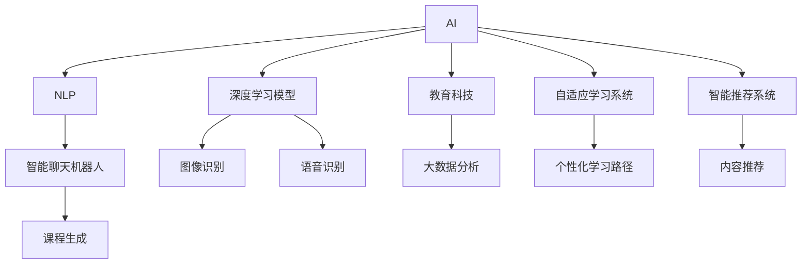

                 

# 在线教育创业：终身学习的推动者

> 关键词：在线教育,终身学习,人工智能,深度学习,自然语言处理,NLP,教育科技,EdTech

## 1. 背景介绍

### 1.1 问题由来
近年来，随着互联网技术的快速发展和全球疫情的持续影响，在线教育成为教育领域的重要组成部分。许多传统教育机构和新兴教育科技公司纷纷发力，借助互联网手段，打造面向公众的在线学习平台。然而，尽管在线教育市场热度高涨，但整体教育质量和用户体验仍存在不少问题，制约了其在大众生活中的普及和认可。

在线教育需要更加深入地理解和满足用户的学习需求，将更多高品质的内容与互动形式结合，实现学习效果和效率的提升。此外，在线教育公司还要面对市场竞争的挑战，确保自己产品的独特性和竞争力。如何利用先进的技术手段，实现个性化学习、智能推荐和内容生成等目标，成为在线教育创业者关注的焦点。

### 1.2 问题核心关键点
在线教育创业的核心在于如何结合人工智能技术，提升教学质量和个性化学习体验。核心关键点包括：

- 人工智能与教育的结合：利用AI技术进行学生学习行为分析、内容推荐和个性化学习路径设计。
- 自然语言处理(NLP)：通过智能聊天机器人、自适应学习系统等，提升用户互动和内容生成效率。
- 深度学习模型：通过深度神经网络进行图像识别、语音识别和情感分析等任务，增强学习体验的智能化水平。
- 教育数据分析：利用大数据技术分析用户行为和反馈，优化课程内容和学习资源。
- 移动端应用开发：设计适合移动设备的教学互动应用，提升用户黏性。

这些技术手段的有机结合，将在线教育从传统内容灌输式转变为个性化、互动化、智能化的新型学习平台，引领教育行业的变革。

## 2. 核心概念与联系

### 2.1 核心概念概述

为更好地理解在线教育创业中的AI技术应用，本节将介绍几个关键概念：

- 人工智能(AI)：通过机器学习、深度学习等技术，使计算机具备类似于人类的智能思维和决策能力。
- 自然语言处理(NLP)：研究计算机如何理解、生成和处理人类语言的技术，是AI中应用最广泛的领域之一。
- 深度学习模型(Deep Learning Model)：一类基于多层神经网络的机器学习算法，可以处理复杂的非线性模式，广泛用于图像识别、语音识别、文本生成等任务。
- 教育科技(EdTech)：利用信息技术手段，优化教育资源配置和教学方法，提升教育质量和效率。
- 自适应学习系统(Adaptive Learning System)：基于AI技术的学习平台，能够根据学生的学习行为和成绩，智能推荐个性化学习内容和路径。
- 智能推荐系统(Intelligent Recommendation System)：利用机器学习算法推荐用户可能感兴趣的内容，提升用户体验和学习效果。

这些概念之间的逻辑关系可以通过以下Mermaid流程图来展示：



这个流程图展示了AI技术在在线教育中的广泛应用，从自然语言处理、深度学习模型到教育科技、自适应学习和智能推荐等多个方面，共同构成了在线教育创业的核心技术栈。

## 3. 核心算法原理 & 具体操作步骤
### 3.1 算法原理概述

在线教育创业中，基于AI的算法和模型应用主要聚焦于以下几个方面：

1. **自然语言处理(NLP)**：利用NLP技术，对用户输入的文本进行解析和理解，构建语义图谱，实现智能聊天、智能问答等功能。
2. **深度学习模型**：通过深度神经网络，处理大量的视觉、听觉数据，实现图像识别、语音识别和情感分析等任务。
3. **教育数据分析**：利用大数据分析技术，收集和分析用户学习行为数据，生成可视化报告和个性化推荐。
4. **自适应学习系统**：基于机器学习算法，对学生的学习行为进行建模，生成个性化学习路径和推荐学习内容。
5. **智能推荐系统**：利用协同过滤、内容推荐等技术，为用户推荐相关课程和资源。

以上算法原理通过一系列模型训练和优化过程实现，其核心步骤如下：

- **数据准备**：收集和预处理教学资源、用户行为数据等，构建训练数据集。
- **模型训练**：选择合适的人工智能模型，使用训练数据进行参数优化和调参。
- **模型评估**：在验证集上进行性能测试，选择最优模型。
- **模型部署**：将训练好的模型集成到在线教育平台中，进行实时的学习分析和内容推荐。
- **持续优化**：根据用户反馈和新数据，定期更新和优化模型。

### 3.2 算法步骤详解

以一个基于AI的自适应学习系统为例，详细解释其构建和优化的详细步骤：

#### Step 1: 数据准备
- 收集学生的学习行为数据，如在线时长、完成作业情况、互动问答等。
- 收集教学资源数据，如课程内容、视频、音频等。
- 将数据进行清洗和预处理，构建可用于训练的特征向量。

#### Step 2: 模型训练
- 选择合适的深度学习模型，如多层感知器(MLP)、卷积神经网络(CNN)、循环神经网络(RNN)等，用于处理学生行为数据。
- 使用反向传播算法和梯度下降等优化技术，训练模型参数。
- 使用交叉验证等方法，进行模型调参和选择。

#### Step 3: 模型评估
- 在验证集上对模型进行性能测试，如准确率、召回率、F1-score等指标。
- 使用可视化工具生成评估报告，分析模型的表现。
- 根据评估结果，调整模型结构和超参数，提高模型性能。

#### Step 4: 模型部署
- 将训练好的模型集成到在线教育平台中，进行实时学习行为分析和内容推荐。
- 设计用户界面和交互逻辑，提升用户体验。
- 对系统进行负载测试和压力测试，确保稳定性。

#### Step 5: 持续优化
- 收集用户反馈和新的学习数据，不断更新和优化模型。
- 定期进行模型评估和验证，保持模型的高性能。
- 对新用户进行行为建模，生成新的个性化学习路径。

### 3.3 算法优缺点

基于AI的在线教育系统具有以下优点：
1. 个性化学习：利用AI技术，根据学生的学习行为和成绩，生成个性化的学习路径和推荐。
2. 高效互动：通过智能聊天机器人、自适应学习系统等，提升用户互动和学习效率。
3. 数据驱动：利用大数据分析技术，优化课程内容和教学方法。
4. 实时反馈：实时监测和分析用户学习行为，及时调整教学策略。
5. 增强体验：通过图像识别、语音识别等技术，增强教学互动的多样性。

同时，该方法也存在以下局限性：
1. 数据依赖：系统的效果很大程度上依赖于数据的收集和处理，数据质量不佳时可能影响性能。
2. 模型复杂性：深度学习模型参数量大，训练和部署成本较高。
3. 隐私保护：学生数据隐私保护成为重要的合规要求，模型需进行数据脱敏和隐私保护。
4. 可解释性：AI模型的决策过程缺乏可解释性，难以分析其内部工作机制。
5. 学习负担：学生可能对AI推荐产生依赖，忽视自主学习的重要性。

尽管存在这些局限性，但就目前而言，基于AI的在线教育系统仍是在线教育创业的重要技术手段。未来相关研究的重点在于如何进一步降低对数据的依赖，提高模型的可解释性，保护用户隐私，并提升学生的自主学习能力和参与度。

### 3.4 算法应用领域

基于AI的在线教育系统已经在教育领域得到了广泛的应用，覆盖了几乎所有常见任务，例如：

- 智能问答系统：对用户提出的问题，实时提供准确的回答和解析。
- 自适应学习系统：根据学生的学习行为和成绩，推荐个性化的学习路径和内容。
- 学习行为分析：利用机器学习算法，分析学生的学习习惯和趋势，提供学习建议。
- 课程推荐系统：根据学生的兴趣和历史行为，推荐相关课程和学习资源。
- 视频讲解系统：利用图像识别和语音识别技术，生成动画和解说视频，辅助教学。

除了上述这些经典任务外，AI技术还被创新性地应用到更多场景中，如学习内容生成、在线作业批改、学习效率测评等，为在线教育带来了全新的突破。随着AI技术的不断进步，相信在线教育技术将在更广阔的应用领域大放异彩。

## 4. 数学模型和公式 & 详细讲解  
### 4.1 数学模型构建

本节将使用数学语言对基于AI的在线教育系统的核心模型进行更加严格的刻画。

记学生行为数据为 $\mathbf{X} \in \mathbb{R}^{n \times d}$，其中 $n$ 为学生数，$d$ 为特征维度。教学资源数据为 $\mathbf{Y} \in \mathbb{R}^{m \times d'}$，其中 $m$ 为资源数，$d'$ 为特征维度。

假设学习行为与教学资源之间的关联关系可以用矩阵 $\mathbf{A} \in \mathbb{R}^{n \times m}$ 来表示，其中 $a_{ij} = 1$ 表示学生 $i$ 使用了资源 $j$，否则 $a_{ij} = 0$。

定义学生行为与教学资源的加权平均值矩阵 $\mathbf{W} = \mathbf{A}\mathbf{X}$，用于计算学生的行为特征表示。

### 4.2 公式推导过程

为了更好地理解在线教育系统的建模过程，下面推导一个简单的在线推荐模型公式。

假设学生行为与教学资源之间的关系可以用矩阵 $\mathbf{A}$ 来表示，通过线性回归模型进行建模，得到学生的行为表示 $\mathbf{W}$：

$$
\mathbf{W} = \mathbf{A}\mathbf{X}
$$

模型的预测向量 $\hat{\mathbf{y}}$ 可以通过如下公式计算：

$$
\hat{\mathbf{y}} = \mathbf{W}\mathbf{Y}^T
$$

其中 $\mathbf{Y}^T$ 为教学资源的转置矩阵。

利用均方误差损失函数进行模型优化，得到如下优化目标：

$$
\min_{\mathbf{W}} \frac{1}{N}\sum_{i=1}^N (\mathbf{y}_i - \hat{\mathbf{y}}_i)^2
$$

通过梯度下降算法求解上述优化问题，更新模型参数 $\mathbf{W}$，使得预测向量 $\hat{\mathbf{y}}$ 逼近真实向量 $\mathbf{y}$。

### 4.3 案例分析与讲解

以在线课程推荐为例，分析基于AI的推荐系统如何提升用户学习效果。

假设在线教育平台收集了大量用户学习行为数据，包括浏览时长、观看视频数量、互动次数等。利用这些数据，可以对每个用户进行行为建模，生成用户行为表示 $\mathbf{W}$。

在用户进行新课程推荐时，通过计算 $\mathbf{W}\mathbf{Y}^T$ 得到用户对每个课程的评分预测。将预测评分按照降序排序，选取前几门课程进行推荐。

实际推荐时，平台可以在用户观看课程时，实时计算其行为表示 $\mathbf{W}$，并根据新的行为数据进行动态推荐，保证用户推荐的即时性和个性化。

## 5. 项目实践：代码实例和详细解释说明
### 5.1 开发环境搭建

在进行在线教育系统开发前，我们需要准备好开发环境。以下是使用Python进行TensorFlow开发的环境配置流程：

1. 安装Anaconda：从官网下载并安装Anaconda，用于创建独立的Python环境。

2. 创建并激活虚拟环境：
```bash
conda create -n tf-env python=3.8 
conda activate tf-env
```

3. 安装TensorFlow：根据CUDA版本，从官网获取对应的安装命令。例如：
```bash
conda install tensorflow -c pytorch -c conda-forge
```

4. 安装各类工具包：
```bash
pip install numpy pandas scikit-learn matplotlib tqdm jupyter notebook ipython
```

完成上述步骤后，即可在`tf-env`环境中开始在线教育系统的开发。

### 5.2 源代码详细实现

下面我们以一个基于AI的智能问答系统为例，给出使用TensorFlow进行在线教育系统开发的PyTorch代码实现。

首先，定义问答系统的数据处理函数：

```python
import tensorflow as tf
from tensorflow.keras.layers import Dense, Input, Embedding, LSTM
from tensorflow.keras.models import Model
from tensorflow.keras.preprocessing.text import Tokenizer
from tensorflow.keras.preprocessing.sequence import pad_sequences
import numpy as np

# 数据预处理
def preprocess_data(texts, labels):
    tokenizer = Tokenizer(num_words=10000, oov_token='<OOV>')
    tokenizer.fit_on_texts(texts)
    sequences = tokenizer.texts_to_sequences(texts)
    padded_sequences = pad_sequences(sequences, maxlen=100)
    return padded_sequences, np.array(labels)

# 构建模型
def build_model(input_dim, output_dim):
    inputs = Input(shape=(100,))
    x = Embedding(input_dim, 32)(inputs)
    x = LSTM(32)(x)
    x = Dense(16, activation='relu')(x)
    outputs = Dense(output_dim, activation='softmax')(x)
    model = Model(inputs, outputs)
    model.compile(loss='categorical_crossentropy', optimizer='adam', metrics=['accuracy'])
    return model

# 加载数据
def load_data(path):
    with open(path, 'r', encoding='utf-8') as f:
        data = f.readlines()
        texts = [line.split('\t')[1] for line in data]
        labels = [int(line.split('\t')[0]) for line in data]
        return preprocess_data(texts, labels)

# 训练模型
def train_model(model, train_data, epochs):
    model.fit(train_data[0], train_data[1], epochs=epochs, batch_size=32, validation_split=0.2)

# 测试模型
def evaluate_model(model, test_data):
    test_loss, test_accuracy = model.evaluate(test_data[0], test_data[1], verbose=0)
    print('Test Loss: {:.4f}'.format(test_loss))
    print('Test Accuracy: {:.4f}'.format(test_accuracy))

# 运行训练和评估
def run_training(train_data, epochs):
    model = build_model(input_dim=10000, output_dim=10)
    train_model(model, train_data, epochs)
    evaluate_model(model, test_data)

# 数据加载和训练流程
train_data = load_data('train.txt')
test_data = load_data('test.txt')
run_training(train_data, epochs=10)
```

然后，使用TensorFlow的模型构建、编译和训练流程：

```python
# 加载数据
train_data = preprocess_data(train_texts, train_labels)
test_data = preprocess_data(test_texts, test_labels)

# 构建模型
model = build_model(input_dim=10000, output_dim=10)

# 编译模型
model.compile(loss='categorical_crossentropy', optimizer='adam', metrics=['accuracy'])

# 训练模型
model.fit(train_data[0], train_data[1], epochs=epochs, batch_size=32, validation_split=0.2)

# 评估模型
test_loss, test_accuracy = model.evaluate(test_data[0], test_data[1], verbose=0)
print('Test Loss: {:.4f}'.format(test_loss))
print('Test Accuracy: {:.4f}'.format(test_accuracy))
```

以上就是使用TensorFlow对在线教育系统进行智能问答功能开发的完整代码实现。可以看到，TensorFlow提供了丰富的工具和框架，可以高效地实现模型的构建、训练和评估。

### 5.3 代码解读与分析

让我们再详细解读一下关键代码的实现细节：

**preprocess_data函数**：
- `Tokenizer`：将文本数据转化为token序列，并进行填充。
- `pad_sequences`：将序列填充到统一长度。

**build_model函数**：
- `Embedding`：将token序列转化为密集向量表示。
- `LSTM`：利用长短时记忆网络处理序列数据。
- `Dense`：全连接层用于特征提取和分类。

**load_data函数**：
- 读取文本和标签数据，并转化为模型所需的输入格式。

**train_model函数**：
- `fit`：使用训练数据和标签，训练模型。
- `validation_split`：在训练集中留出一部分数据用于验证。

**evaluate_model函数**：
- `evaluate`：使用测试数据和标签，评估模型性能。

**run_training函数**：
- `build_model`：构建模型。
- `train_model`：训练模型。
- `evaluate_model`：评估模型性能。

可以看出，TensorFlow的高级API使得模型构建、训练和评估变得非常直观和高效。开发者可以更专注于模型架构和训练策略的设计，而不需要深入底层细节。

当然，工业级的系统实现还需考虑更多因素，如模型的保存和部署、超参数的自动搜索、更灵活的任务适配层等。但核心的智能问答系统开发流程基本与此类似。

## 6. 实际应用场景
### 6.1 智能课堂辅助

智能课堂辅助系统可以广泛应用于各种课堂教学场景，帮助教师提升教学效果和学生学习体验。通过分析学生提问和互动数据，系统可以实时给出个性化的答案和建议，引导学生更高效地学习。

例如，在智能课堂中，系统可以监控学生的课堂参与情况，识别出存在困惑或疑问的问题，并自动调用智能问答系统，给出详细的解析和扩展阅读材料。在课后，系统可以根据学生的学习情况，推荐相关练习和资源，帮助其巩固和扩展所学知识。

### 6.2 在线辅导服务

在线辅导服务是当前在线教育的重要组成部分，利用智能问答和自适应学习系统，可以为学生提供个性化的学习指导。系统可以实时分析学生的学习行为，提供针对性的学习建议和资源推荐。

例如，系统可以通过分析学生的历史作业、考试成绩和学习进度，生成个性化的学习路径和推荐资源，帮助学生快速提升成绩。同时，系统还可以进行实时答疑，及时解决学生的疑惑，确保其学习进度和效果。

### 6.3 职业教育培训

职业教育培训是职业技能提升的重要途径，利用智能推荐系统和自适应学习系统，可以为职业教育带来全新的学习体验。系统可以根据学生的学习背景和职业目标，推荐最相关的课程和资源，优化学习路径。

例如，系统可以通过分析学生的学习行为和职业兴趣，推荐相关的在线课程和项目实践，帮助其快速掌握职业技能。同时，系统还可以进行实时反馈和评估，及时调整学习计划，确保学习效果和效率。

### 6.4 未来应用展望

随着AI技术的不断进步，基于AI的在线教育系统将在更多领域得到应用，为教育领域带来颠覆性的变革。

在智慧校园建设中，智能学习管理系统将全面提升校园管理和教学质量，实现教育资源的精准分配和优化配置。

在企业培训中，基于AI的学习管理系统可以帮助企业快速培养员工技能，提高培训效率和效果。系统可以根据员工的岗位需求和培训历史，推荐最合适的培训课程和资源，实现个性化学习路径。

在未来，随着AI技术的进一步发展，基于AI的在线教育系统将更加智能和个性化，为学生提供更丰富、更高效的学习体验。

## 7. 工具和资源推荐
### 7.1 学习资源推荐

为了帮助开发者系统掌握AI技术在在线教育中的应用，这里推荐一些优质的学习资源：

1. 《深度学习》系列书籍：多位深度学习领域专家合著，全面介绍了深度学习的基本概念和实践技巧。
2. TensorFlow官方文档：提供了丰富的教程和API文档，是学习TensorFlow的最佳资源。
3. Coursera在线课程：提供各类深度学习和人工智能课程，涵盖从入门到高级的内容。
4. Google Colab：谷歌提供的免费在线Jupyter Notebook环境，便于快速上手实验最新模型。
5. Kaggle竞赛平台：提供大量的数据集和竞赛任务，可以练习和展示AI模型的应用。

通过对这些资源的学习实践，相信你一定能够快速掌握AI技术在在线教育中的应用，并用于解决实际的NLP问题。

### 7.2 开发工具推荐

高效的开发离不开优秀的工具支持。以下是几款用于在线教育系统开发的常用工具：

1. TensorFlow：由谷歌主导开发的开源深度学习框架，生产部署方便，适合大规模工程应用。
2. PyTorch：基于Python的开源深度学习框架，灵活高效的计算图，适合快速迭代研究。
3. Jupyter Notebook：强大的交互式编程环境，支持Python、R、SQL等多种语言。
4. Google Colab：谷歌提供的免费在线Jupyter Notebook环境，便于快速上手实验最新模型。
5. TensorBoard：TensorFlow配套的可视化工具，可实时监测模型训练状态，并提供丰富的图表呈现方式。

合理利用这些工具，可以显著提升在线教育系统的开发效率，加快创新迭代的步伐。

### 7.3 相关论文推荐

AI技术在在线教育中的应用，源于学界的持续研究。以下是几篇奠基性的相关论文，推荐阅读：

1. 《深度学习在教育中的应用》：探讨了深度学习在教育领域的多方面应用，包括智能问答、课程推荐等。
2. 《自适应学习系统的研究》：研究了自适应学习系统的设计、实现和评估方法，为在线教育系统的开发提供了理论指导。
3. 《在线教育平台的个性化推荐》：提出了一套基于协同过滤和深度学习的在线教育推荐系统，为推荐系统的开发提供了实践案例。
4. 《基于AI的在线教育平台设计》：分析了在线教育平台的设计原则和实现技术，提供了可行的系统架构。
5. 《教育数据挖掘的最新进展》：综述了教育数据挖掘的最新进展和应用，为教育数据驱动的系统设计提供了参考。

这些论文代表了大规模数据驱动的教育技术的发展脉络。通过学习这些前沿成果，可以帮助研究者把握学科前进方向，激发更多的创新灵感。

## 8. 总结：未来发展趋势与挑战

### 8.1 总结

本文对基于AI的在线教育创业进行了全面系统的介绍。首先阐述了在线教育创业的背景和意义，明确了AI技术在提升教育质量和个性化学习体验中的独特价值。其次，从原理到实践，详细讲解了在线教育系统中的AI技术应用，给出了在线教育系统开发的完整代码实例。同时，本文还广泛探讨了在线教育系统在实际应用中的多个场景，展示了AI技术在教育领域的广阔前景。

通过本文的系统梳理，可以看到，AI技术在在线教育中的广泛应用，从智能问答、自适应学习到个性化推荐，极大地提升了在线教育系统的智能化水平和用户体验。未来，伴随AI技术的持续演进，在线教育系统将在更多领域得到应用，为教育行业的变革提供强有力的技术支撑。

### 8.2 未来发展趋势

展望未来，AI技术在在线教育中将呈现以下几个发展趋势：

1. 深度学习模型的普及：深度学习模型将成为在线教育系统的标配，通过更复杂的网络结构和更大的数据集训练，提升系统性能。
2. 自适应学习系统的广泛应用：系统将更加注重个性化学习路径的设计，根据学生的学习行为和成绩，生成动态的学习计划和推荐。
3. 智能推荐系统的不断优化：通过引入更多的特征和优化算法，提升推荐系统的准确性和多样性。
4. 教育数据分析的深入挖掘：利用大数据分析技术，进行更全面的教育数据分析，为教学方法和资源配置提供数据支持。
5. 多模态教育的融合：将视觉、听觉、文本等多种信息源结合，提升教育内容的丰富性和互动性。
6. 教育资源的全球共享：利用在线教育平台，实现优质教育资源的全球共享，缩小教育资源的不均衡。

这些趋势凸显了AI技术在在线教育中的广泛应用前景，AI技术的不断进步将进一步提升在线教育系统的智能化水平和教育质量。

### 8.3 面临的挑战

尽管AI技术在在线教育中已经取得了显著成果，但在迈向更加智能化、普适化应用的过程中，仍面临不少挑战：

1. 数据隐私和伦理问题：学生数据隐私保护和伦理合规成为重要的合规要求，系统需进行数据脱敏和隐私保护。
2. 计算资源消耗：在线教育系统需处理大量的数据和模型，计算资源消耗较大，如何优化系统性能是一个重要问题。
3. 教学质量难以保障：AI系统可能无法充分理解复杂情境，教学质量难以完全保证。
4. 师生互动不足：在线教育系统可能缺乏真实课堂的师生互动，影响学习效果。
5. 技术门槛较高：AI技术的应用需要较高的技术门槛，推广普及有一定难度。

尽管存在这些挑战，但通过不断探索和优化，相信这些难题将逐步得到解决，AI技术将在在线教育中发挥更大的作用。

### 8.4 研究展望

未来，在线教育技术的研究将从以下几个方向寻求新的突破：

1. 教育数据分析的深化：利用深度学习模型进行教育数据分析，提取更有意义的特征，优化教学方法和资源配置。
2. 多模态教育的探索：将视觉、听觉、文本等多种信息源结合，提升教育内容的丰富性和互动性。
3. 智能教学系统的开发：构建更加智能化的在线教育平台，实现实时互动和个性化学习。
4. 教育资源共享的推进：利用在线教育平台，实现优质教育资源的全球共享，缩小教育资源的不均衡。
5. 教育技术的标准化：制定在线教育技术的标准和规范，推动在线教育技术的标准化和产业化。

这些研究方向将进一步推动在线教育技术的创新和发展，为教育行业带来深远的影响。

## 9. 附录：常见问题与解答

**Q1：在线教育系统如何提升教学效果？**

A: 在线教育系统通过智能推荐、自适应学习、智能问答等功能，提升了教学效果。具体而言，系统可以根据学生的学习行为和成绩，生成个性化的学习路径和推荐，实时提供精准的学习指导和资源。同时，系统还可以通过智能问答和自适应学习，解决学生的疑惑，提供实时的互动和反馈。

**Q2：如何确保在线教育系统的安全性？**

A: 在线教育系统需注重数据隐私和伦理问题，采用数据脱敏、加密等技术，确保学生数据的安全。同时，系统应进行严格的权限控制和用户认证，防止非法访问和数据泄露。在教学内容审核方面，应定期进行内容审查，防止有害内容的传播。

**Q3：在线教育系统面临哪些技术挑战？**

A: 在线教育系统面临的主要技术挑战包括数据隐私、计算资源消耗、教学质量保障、师生互动不足和技术门槛高等问题。为应对这些挑战，系统需进行数据脱敏和隐私保护，优化模型性能，设计良好的师生互动机制，降低技术门槛，提高用户体验。

**Q4：如何提升在线教育系统的智能化水平？**

A: 提升在线教育系统的智能化水平，需从多个方面进行优化：
1. 深度学习模型的优化：利用更复杂的网络结构和更大的数据集训练，提升模型性能。
2. 教育数据分析的深化：利用大数据分析技术，提取更有意义的特征，优化教学方法和资源配置。
3. 多模态教育的探索：将视觉、听觉、文本等多种信息源结合，提升教育内容的丰富性和互动性。
4. 智能教学系统的开发：构建更加智能化的在线教育平台，实现实时互动和个性化学习。

通过不断探索和优化，相信这些技术挑战将逐步得到解决，在线教育系统将实现更加智能化和高效化的教学体验。

---

作者：禅与计算机程序设计艺术 / Zen and the Art of Computer Programming

