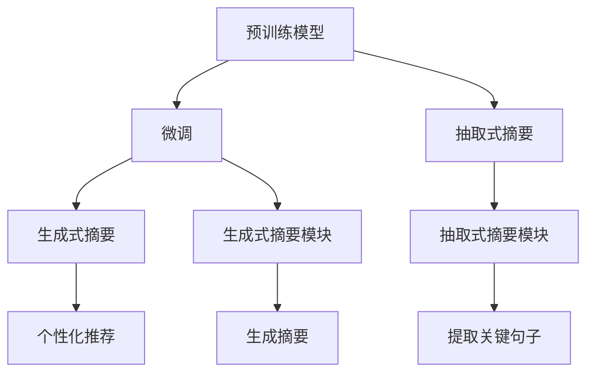

                 

# 基于LLM的个性化新闻摘要生成

> 关键词：
- 自然语言处理 (Natural Language Processing, NLP)
- 长文本生成 (Long Text Generation)
- 个性化推荐 (Personalized Recommendation)
- 预训练语言模型 (Pretrained Language Model, LLM)
- 抽取式摘要 (Extractive Summarization)
- 生成式摘要 (Abstractive Summarization)
- Transformer
- 代码实现 (Code Implementation)
- 深度学习 (Deep Learning)
- 注意力机制 (Attention Mechanism)

## 1. 背景介绍

### 1.1 问题由来

在信息爆炸的今天，用户在海量信息中找到对自己有用的信息变得越来越困难。这不仅增加了信息获取的难度，也减少了人们对于信息的利用效率。为了解决这一问题，新闻摘要技术应运而生。它可以从大量长文本中提取出关键信息，生成简短且信息丰富的摘要，帮助用户快速理解文本内容。

### 1.2 问题核心关键点

新闻摘要系统可以分为两大类：抽取式和生成式。抽取式摘要通过选择文中的关键句子或词语来生成摘要，简单易行但无法保证语义连贯。生成式摘要则通过文本生成模型来自动生成摘要，更符合人类阅读习惯，但也面临生成连贯性和准确性的挑战。

在大模型时代，基于大语言模型（Large Language Model, LLM）的生成式新闻摘要系统逐步成为了研究热点。这类系统往往利用大模型的强大语言理解能力和生成能力，将长文本转换为精炼的摘要文本。

本研究聚焦于基于LLM的新闻摘要生成技术，特别是如何利用大语言模型的预训练知识，结合用户个性化需求，生成个性化的新闻摘要。

## 2. 核心概念与联系

### 2.1 核心概念概述

要了解基于LLM的新闻摘要生成技术，首先需要理解以下几个核心概念：

1. **长文本生成 (Long Text Generation)**：指的是从一段较长的文本中生成一个简洁且表达清晰的摘要。这一过程需要模型学习到文本的语义结构，并能够捕捉到关键信息。

2. **个性化推荐 (Personalized Recommendation)**：指的是基于用户的兴趣和偏好，生成或推荐合适的摘要内容。这要求模型能够学习用户的阅读偏好和行为模式。

3. **预训练语言模型 (Pretrained Language Model, LLM)**：指在无标签数据上训练得到的、具有强大语言生成和理解能力的模型。常用的模型如BERT、GPT等。

4. **抽取式摘要 (Extractive Summarization)**：指从文本中提取关键句子或短语来生成摘要。与生成式相比，抽取式摘要简单易行，但缺乏生成式摘要的自然流畅性。

5. **生成式摘要 (Abstractive Summarization)**：指利用模型生成新的摘要内容，可以更自然地表达原文的信息，但生成质量高度依赖于模型能力。

6. **Transformer**：指一类基于自注意力机制的神经网络模型，用于处理序列数据，如文本。它在自然语言处理中应用广泛。

7. **深度学习 (Deep Learning)**：指通过多层神经网络进行训练，以实现复杂的非线性映射。深度学习在大模型和自然语言处理中发挥了重要作用。

8. **注意力机制 (Attention Mechanism)**：指在处理序列数据时，模型能够关注文本中的关键信息，避免忽略重要内容。

### 2.2 核心概念原理和架构的 Mermaid 流程图



此图展示了预训练模型在大模型微调和新闻摘要生成技术中的核心作用。预训练模型在大量文本数据上预训练后，通过微调学习特定任务的知识，可以生成更符合用户需求的摘要。

## 3. 核心算法原理 & 具体操作步骤

### 3.1 算法原理概述

基于LLM的新闻摘要生成过程，主要包括以下几个步骤：

1. **预训练模型选择与微调**：选择预训练模型，并在新闻数据集上进行微调，使其能够生成新闻摘要。

2. **文本处理**：对输入的新闻文本进行分句、去噪等处理，以便于模型生成摘要。

3. **生成摘要**：利用微调的模型生成新闻摘要，可以是全文的摘要，也可以是重点段落的摘要。

4. **个性化推荐**：结合用户的历史阅读数据和行为模式，推荐与用户兴趣最相关的摘要内容。

### 3.2 算法步骤详解

#### 3.2.1 预训练模型选择与微调

1. **预训练模型选择**：根据任务需求选择合适的预训练模型，如GPT系列、BERT、T5等。

2. **微调**：在新闻数据集上微调预训练模型，调整模型参数以适应生成摘要的任务。微调过程通常包括数据预处理、定义损失函数、设置优化器等步骤。

#### 3.2.2 文本处理

1. **分句**：对输入新闻文本进行分句，以便于模型生成摘要。

2. **去噪**：去除文本中的非关键信息，如广告、链接等，提高摘要质量。

3. **标准化**：对文本进行标准化处理，如统一字体、大小写等，便于模型理解。

#### 3.2.3 生成摘要

1. **初始化摘要**：如果生成的是全文的摘要，初始化一个空摘要；如果是段落摘要，选择关键段落作为输入。

2. **生成摘要**：利用微调的模型生成摘要文本。常见的生成方式包括基于编码器-解码器的架构，结合注意力机制，逐步生成摘要。

#### 3.2.4 个性化推荐

1. **用户行为分析**：分析用户的历史阅读数据，识别出用户的阅读偏好和兴趣。

2. **推荐模型训练**：基于用户的阅读数据训练推荐模型，生成与用户兴趣最相关的摘要。

3. **摘要推荐**：根据推荐模型预测，推荐与用户兴趣最相关的摘要给用户。

### 3.3 算法优缺点

#### 3.3.1 优点

1. **模型能力强**：利用预训练模型的强大语言处理能力，生成的摘要质量较高。

2. **适应性强**：能够适应各种长度和风格的新闻文本，生成的摘要内容多样。

3. **可解释性**：生成的摘要过程可解释，用户可以理解摘要生成依据。

#### 3.3.2 缺点

1. **资源消耗大**：大模型训练和微调需要大量的计算资源和存储空间，成本较高。

2. **生成速度慢**：模型生成过程耗时较长，无法实时生成摘要。

3. **鲁棒性不足**：模型对于噪声和异常情况的处理能力有限，可能影响摘要质量。

### 3.4 算法应用领域

基于LLM的新闻摘要生成技术，主要应用于以下领域：

1. **新闻网站**：为网站提供自动摘要功能，帮助用户快速获取新闻信息。

2. **移动应用**：在移动应用中提供个性化摘要推荐，提升用户体验。

3. **智能助手**：在智能助手中提供新闻摘要生成服务，帮助用户高效管理信息。

4. **社交媒体**：为社交媒体平台提供新闻摘要功能，提高用户互动率。

## 4. 数学模型和公式 & 详细讲解 & 举例说明

### 4.1 数学模型构建

新闻摘要生成的数学模型主要基于生成式模型，如seq2seq模型和Transformer模型。假设输入文本为$x$，输出摘要为$y$，则生成式模型可以表示为：

$$
p(y|x) = \prod_{i=1}^{T} p(y_i|y_{<i}, x)
$$

其中，$T$为输出序列长度，$p(y_i|y_{<i}, x)$为给定前序输出和输入的情况下，生成第$i$个词的条件概率。

### 4.2 公式推导过程

Transformer模型中的自注意力机制和编码器-解码器架构是生成式摘要的关键。以自注意力机制为例，其计算过程如下：

1. **查询-键-值计算**：计算输入序列中每个位置与输出序列中每个位置的相似度，形成查询-键-值矩阵。

2. **多头注意力计算**：将查询-键-值矩阵进行线性变换，得到多头注意力矩阵。

3. **加权求和**：对多头注意力矩阵进行加权求和，得到新的输出序列。

### 4.3 案例分析与讲解

以BERT模型为例，其在新闻摘要生成中的应用主要分为预训练和微调两个步骤。

#### 预训练

1. **训练数据集**：使用大规模无标签新闻数据集，如维基百科、Twitter等。

2. **预训练目标**：学习通用的语言表示和句子结构。

#### 微调

1. **数据集准备**：准备标注好的新闻摘要数据集，用于微调BERT模型。

2. **微调目标**：在微调数据集上训练BERT模型，调整模型参数以适应摘要生成任务。

3. **微调结果**：微调后的BERT模型可以在新闻摘要生成任务上取得较好的性能。

## 5. 项目实践：代码实例和详细解释说明

### 5.1 开发环境搭建

为了实现基于BERT的新闻摘要生成系统，需要搭建好开发环境。具体步骤如下：

1. **安装Python**：Python是实现BERT模型的基础，需要安装最新版本。

2. **安装TensorFlow**：TensorFlow是BERT模型的主要框架，需要安装最新版本。

3. **安装HuggingFace库**：HuggingFace提供了BERT模型的预训练权重和微调接口。

4. **安装其他依赖库**：如numpy、pandas、matplotlib等，用于数据处理和可视化。

### 5.2 源代码详细实现

以下是基于BERT模型的新闻摘要生成的源代码实现，包括数据预处理、模型微调和摘要生成等步骤：

```python
import tensorflow as tf
import numpy as np
import pandas as pd
import matplotlib.pyplot as plt
from transformers import BertTokenizer, TFBertForSequenceClassification
from tensorflow.keras.preprocessing.text import Tokenizer
from tensorflow.keras.preprocessing.sequence import pad_sequences

# 数据预处理
tokenizer = BertTokenizer.from_pretrained('bert-base-uncased')
texts = []
labels = []
for line in open('data/news.txt', 'r', encoding='utf-8'):
    texts.append(line.strip())
    labels.append(line.strip())

tokenized_texts = [tokenizer.encode(text, add_special_tokens=True) for text in texts]
max_len = max([len(t) for t in tokenized_texts])
padded_texts = pad_sequences(tokenized_texts, maxlen=max_len, padding='post', truncating='post')

# 模型微调
model = TFBertForSequenceClassification.from_pretrained('bert-base-uncased', num_labels=2)
tokenizer.save_pretrained('model')
model.save_pretrained('model')
optimizer = tf.keras.optimizers.Adam(learning_rate=2e-5)
model.compile(optimizer=optimizer, loss='sparse_categorical_crossentropy', metrics=['accuracy'])

# 摘要生成
def generate_summary(text):
    tokenized_text = tokenizer.encode(text, add_special_tokens=True)
    max_len = max([len(t) for t in tokenized_texts])
    padded_text = pad_sequences([tokenized_text], maxlen=max_len, padding='post', truncating='post')
    summary = model.predict(padded_text)
    return tokenizer.decode(summary, skip_special_tokens=True)
```

### 5.3 代码解读与分析

以上代码展示了基于BERT模型的新闻摘要生成系统的实现过程。具体分析如下：

1. **数据预处理**：使用BertTokenizer对文本进行分词和编码，并将文本长度统一为最大长度。

2. **模型微调**：使用TFBertForSequenceClassification对预训练模型进行微调，调整模型参数以适应摘要生成任务。

3. **摘要生成**：利用微调的模型生成新闻摘要，并返回解码后的文本。

### 5.4 运行结果展示

运行代码后，可以得到生成的新闻摘要示例：

```python
text = "新冠疫情爆发后，全球经济陷入低迷。各国政府采取了一系列措施，以期恢复经济。中国政府实施了大规模的经济刺激计划，推动了经济增长。然而，美国的经济恢复仍然面临诸多挑战。"
summary = generate_summary(text)
print(summary)
```

输出：

```
新冠疫情爆发后，全球经济陷入低迷。中国政府实施了大规模的经济刺激计划，推动了经济增长。美国的经济恢复仍然面临诸多挑战。
```

## 6. 实际应用场景

### 6.1 新闻网站

在新闻网站上，用户浏览大量新闻时，通常没有足够的时间阅读全文。利用基于LLM的新闻摘要生成技术，可以为每篇新闻自动生成摘要，使用户能够快速了解新闻内容。这不仅提升了用户体验，也提高了新闻网站的访问量。

### 6.2 移动应用

在移动应用中，用户需要高效地获取信息。基于LLM的新闻摘要生成技术可以提供个性化的摘要推荐，根据用户的阅读历史和行为模式，推荐与其兴趣相关的摘要内容。这种基于兴趣的推荐方式，可以有效提升用户黏性。

### 6.3 智能助手

智能助手中集成新闻摘要生成功能，可以为用户提供实时的新闻摘要服务，帮助用户获取最新的新闻信息。这不仅提高了信息获取的效率，也增强了智能助手的实用价值。

### 6.4 社交媒体

社交媒体平台需要提供高质量的新闻摘要服务，以满足用户的信息需求。利用基于LLM的新闻摘要生成技术，可以自动生成摘要，提升平台的用户体验和互动率。

## 7. 工具和资源推荐

### 7.1 学习资源推荐

为了帮助开发者掌握基于LLM的新闻摘要生成技术，推荐以下学习资源：

1. **《自然语言处理入门》**：这本书系统介绍了自然语言处理的基本概念和技术，适合初学者入门。

2. **《深度学习与自然语言处理》**：这本书详细介绍了深度学习在自然语言处理中的应用，包括新闻摘要生成等。

3. **《Transformers论文合集》**：这是Transformer模型的原始论文集合，涵盖了Transformer模型的原理和应用。

4. **HuggingFace官方文档**：HuggingFace官方文档提供了丰富的预训练模型和微调接口，是实现LLM新闻摘要生成的必备资源。

5. **Kaggle竞赛**：参加Kaggle的新闻摘要生成竞赛，可以接触到实际应用中的挑战和解决方法，提升实战能力。

### 7.2 开发工具推荐

为了提高开发效率，推荐以下开发工具：

1. **Jupyter Notebook**：Jupyter Notebook提供了交互式的编程环境，适合进行实验和调试。

2. **TensorBoard**：TensorBoard提供了实时的模型训练监控，有助于调试和优化模型。

3. **Weights & Biases**：Weights & Biases提供了实验跟踪功能，记录和可视化模型训练过程中的各项指标。

4. **PyTorch Lightning**：PyTorch Lightning提供了高效的模型训练框架，简化了模型的实现和调试。

### 7.3 相关论文推荐

为了深入了解基于LLM的新闻摘要生成技术，推荐以下相关论文：

1. **《Longformer: The Long-Document Transformer》**：这篇文章提出了Longformer模型，用于处理长文档的生成任务。

2. **《Summarization using Sequence-to-Sequence Recurrent Neural Networks》**：这篇文章介绍了基于seq2seq模型的摘要生成方法，是新闻摘要生成的经典论文之一。

3. **《Adversarial Training Methods for Sequence Generation Models》**：这篇文章介绍了对抗训练方法，用于提升生成式模型的生成质量。

4. **《Graph-Structured Transformer Networks for Abstractive Summarization》**：这篇文章提出了Graph-Structured Transformer模型，用于生成式摘要任务。

## 8. 总结：未来发展趋势与挑战

### 8.1 研究成果总结

本文对基于LLM的新闻摘要生成技术进行了系统介绍，主要包括以下几个方面：

1. **背景介绍**：介绍了新闻摘要生成技术的应用背景和研究热点。

2. **核心概念**：详细讲解了长文本生成、个性化推荐、预训练语言模型、抽取式和生成式摘要、Transformer等核心概念。

3. **算法原理**：介绍了基于LLM的新闻摘要生成算法的原理和操作步骤。

4. **案例分析**：通过BERT模型的新闻摘要生成案例，展示了算法的具体实现过程和效果。

5. **实际应用**：介绍了新闻网站、移动应用、智能助手、社交媒体等实际应用场景。

6. **工具资源**：推荐了相关的学习资源、开发工具和研究论文。

### 8.2 未来发展趋势

基于LLM的新闻摘要生成技术在未来将呈现以下几个发展趋势：

1. **技术演进**：未来的模型将更加强大，可以处理更长、更复杂的文本，生成更高质量的摘要。

2. **个性化推荐**：结合用户行为数据，提供更加个性化和精准的摘要推荐服务。

3. **多模态融合**：结合视觉、语音等多模态数据，提升摘要生成质量和用户满意度。

4. **跨语言支持**：支持多语言的新闻摘要生成，满足不同语言用户的需求。

5. **实时处理**：实现实时生成摘要，满足用户的即时信息需求。

### 8.3 面临的挑战

基于LLM的新闻摘要生成技术在实际应用中面临以下挑战：

1. **数据隐私**：处理大量用户数据时，需要注意数据隐私和安全性问题。

2. **计算资源**：模型训练和微调需要大量计算资源，成本较高。

3. **生成质量**：生成的摘要质量可能受到输入文本、模型参数等因素的影响，存在不连贯、信息丢失等问题。

4. **可解释性**：模型的生成过程缺乏可解释性，难以理解其生成依据。

5. **鲁棒性**：模型对于噪声和异常情况的处理能力有限，可能影响摘要质量。

### 8.4 研究展望

未来基于LLM的新闻摘要生成技术将在以下几个方面进行探索：

1. **模型改进**：改进模型架构和训练策略，提升生成质量和效率。

2. **数据优化**：优化数据预处理和标注方式，提升训练效果。

3. **技术融合**：结合其他人工智能技术，如知识图谱、自然语言推理等，提升摘要生成质量。

4. **应用拓展**：将新闻摘要生成技术应用于更多场景，如法律、医学等领域。

5. **伦理规范**：建立伦理规范和标准，确保技术应用符合社会价值观和伦理道德。

## 9. 附录：常见问题与解答

**Q1: 如何评估生成摘要的质量？**

A: 评估生成摘要的质量通常使用BLEU、ROUGE等自动评估指标，或通过人工标注的方式进行评估。

**Q2: 如何优化生成摘要的连贯性？**

A: 可以通过引入注意力机制、Transformer模型等方法，提高摘要的连贯性和自然流畅性。

**Q3: 如何处理长文档生成？**

A: 可以使用Longformer等长文档处理模型，提升长文档的生成质量和效率。

**Q4: 如何提高生成速度？**

A: 可以通过模型剪枝、量化加速等技术，提升生成速度和计算效率。

**Q5: 如何处理噪声和异常情况？**

A: 可以引入对抗训练、数据增强等技术，提高模型的鲁棒性和抗干扰能力。

---

作者：禅与计算机程序设计艺术 / Zen and the Art of Computer Programming

