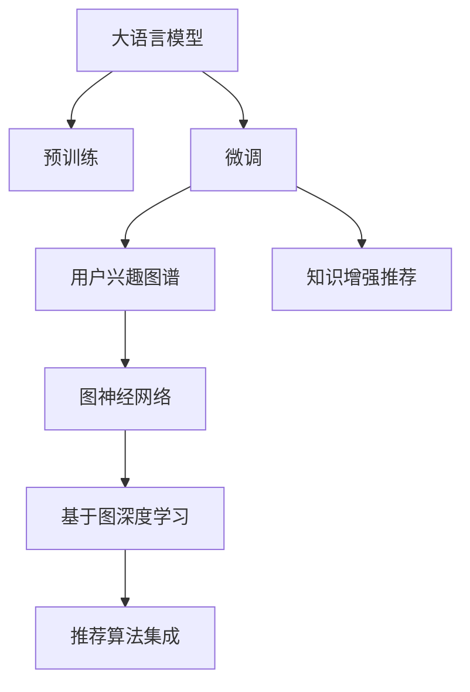

                 

# 基于LLM的推荐系统用户兴趣图谱构建

> 关键词：推荐系统,大语言模型,用户兴趣图谱,图神经网络,基于图深度学习

## 1. 背景介绍

### 1.1 问题由来

在互联网时代，信息过载已经成为用户面临的主要问题之一。如何从海量数据中高效筛选出符合用户需求的个性化信息，成为了推荐系统研究的焦点。传统的推荐系统主要依赖用户的历史行为数据，通过协同过滤、矩阵分解等方法，推荐与用户历史行为相似的物品。然而，这些方法往往难以刻画用户对物品的真实兴趣和潜在需求，容易陷入局部最优，甚至产生推荐偏差。

为了克服这些缺点，近年来的推荐系统开始引入外部知识图谱，通过联合图神经网络(Graph Neural Network, GNN)技术，对用户与物品之间的关系进行建模，实现更加全面、动态的用户兴趣表示。然而，构建高质量的图谱并进行高效的深度学习计算，对数据和算力提出了很高的要求。大语言模型(Large Language Model, LLM)的出现，为推荐系统提供了新的思路。通过预训练-微调范式，大语言模型能够在较少标注数据的情况下，学习到用户兴趣和物品属性的复杂表示，并融合外部知识图谱，构建出高效的推荐模型。

### 1.2 问题核心关键点

构建基于大语言模型的推荐系统，需要解决以下关键问题：

1. 如何从大语言模型中高效抽取用户兴趣和物品属性，生成高质量的嵌入向量。
2. 如何将大语言模型与外部知识图谱进行融合，实现知识增强的推荐。
3. 如何高效计算用户与物品之间的相似度，进行精准推荐。
4. 如何综合利用多个推荐算法，提高推荐效果。

这些问题共同构成了基于大语言模型的推荐系统研发框架，使其能够在用户个性化信息推荐方面发挥巨大作用。

### 1.3 问题研究意义

大语言模型与推荐系统的结合，将极大地提升推荐系统的表现力和应用范围。其研究意义体现在以下几个方面：

1. 更精准的用户兴趣建模：大语言模型通过预训练-微调过程，能够在较少标注数据下学习到用户对物品的真实兴趣和潜在需求，从而提供更个性化、多样化的推荐。
2. 更丰富的知识融合机制：大语言模型可以融合外部知识图谱，学习物品之间的关系属性，使得推荐系统具备更广泛、全面的知识表示能力。
3. 更高效的推荐计算：通过在大语言模型基础上进行图神经网络建模，可以实现知识增强的推荐，提高推荐准确性和召回率。
4. 更广泛的应用场景：推荐系统不仅限于电商、视频等场景，在大语言模型驱动下，还可以拓展到新闻、文章、教育等更多垂直领域。
5. 加速技术落地：大语言模型庞大的参数量和高计算需求，可以通过微调技术，在少量标注数据下实现快速收敛，加速推荐系统的产业化进程。

综上所述，基于大语言模型的推荐系统不仅在学术界具有重要的理论意义，更在工业界具备巨大的应用前景。

## 2. 核心概念与联系

### 2.1 核心概念概述

本节将介绍几项核心概念，以帮助理解基于大语言模型的推荐系统研发过程。

- **大语言模型(LLM)**：以自回归或自编码模型为代表的大规模预训练语言模型。通过在海量无标签文本语料上进行预训练，学习通用的语言表示，具备强大的语言理解和生成能力。

- **推荐系统**：通过分析用户行为数据和物品属性，为用户提供个性化推荐的服务。常用的推荐算法包括协同过滤、矩阵分解、内容过滤等。

- **用户兴趣图谱**：用于表示用户与物品之间的关系图谱，包含用户兴趣向量、物品属性向量等信息。通常采用图神经网络对图谱进行深度学习，提取用户和物品的隐式特征。

- **图神经网络(GNN)**：用于处理图结构数据的深度学习模型。通过对节点和边之间的关系进行建模，可以高效提取节点之间的隐式关系，实现图谱上的知识增强。

- **基于图深度学习**：将深度学习模型应用于图结构数据的表示和推理，提取节点和边的隐式特征，用于推荐系统等场景。

这些概念之间的联系可以通过以下Mermaid流程图来展示：



该流程图展示了大语言模型与推荐系统的核心概念及其之间的关系：

1. 大语言模型通过预训练-微调过程，学习到用户和物品的隐式表示。
2. 微调后的大语言模型可以作为用户兴趣图谱的初始化参数。
3. 用户兴趣图谱通过图神经网络进行深度学习，提取隐式特征。
4. 图神经网络基于大语言模型提供的外部知识图谱，实现知识增强的推荐。
5. 基于图深度学习技术，构建高效的知识增强推荐模型。
6. 推荐算法集成，综合利用多种推荐方法，提高推荐效果。

## 3. 核心算法原理 & 具体操作步骤
### 3.1 算法原理概述

基于大语言模型的推荐系统，本质上是一个多任务学习过程。其核心思想是：将大语言模型作为用户兴趣和物品属性的表示器，通过在推荐任务上的微调，学习到用户和物品的隐式表示，并利用图神经网络进行知识增强的推荐。

形式化地，假设预训练语言模型为 $M_{\theta}$，其中 $\theta$ 为预训练得到的模型参数。给定推荐任务的数据集 $D=\{(u_i, i_j)\}_{i=1}^N$，其中 $u_i$ 表示用户 $i$，$i_j$ 表示物品 $j$。微调的目标是找到新的模型参数 $\hat{\theta}$，使得：

$$
\hat{\theta}=\mathop{\arg\min}_{\theta} \mathcal{L}(M_{\theta},D)
$$

其中 $\mathcal{L}$ 为针对推荐任务设计的损失函数，用于衡量模型推荐结果与真实标签之间的差异。常用的损失函数包括交叉熵损失、均方误差损失等。

通过梯度下降等优化算法，微调过程不断更新模型参数 $\theta$，最小化损失函数 $\mathcal{L}$，使得模型推荐结果逼近真实标签。由于 $\theta$ 已经通过预训练获得了较好的初始化，因此即便在少量标注数据集 $D$ 上进行微调，也能较快收敛到理想的模型参数 $\hat{\theta}$。

### 3.2 算法步骤详解

基于大语言模型的推荐系统一般包括以下几个关键步骤：

**Step 1: 准备预训练模型和数据集**
- 选择合适的预训练语言模型 $M_{\theta}$ 作为初始化参数，如 GPT、BERT 等。
- 准备推荐任务的数据集 $D$，划分为训练集、验证集和测试集。一般要求标注数据与预训练数据的分布不要差异过大。

**Step 2: 添加推荐适配层**
- 根据任务类型，在预训练模型顶层设计合适的输出层和损失函数。
- 对于推荐任务，通常使用交叉熵损失函数。
- 在用户-物品关系图上，添加图神经网络作为推荐适配层，用于提取用户和物品的隐式特征。

**Step 3: 设置微调超参数**
- 选择合适的优化算法及其参数，如 AdamW、SGD 等，设置学习率、批大小、迭代轮数等。
- 设置正则化技术及强度，包括权重衰减、Dropout、Early Stopping 等。
- 确定冻结预训练参数的策略，如仅微调顶层，或全部参数都参与微调。

**Step 4: 执行梯度训练**
- 将推荐数据集以批为单位输入模型，前向传播计算损失函数。
- 反向传播计算参数梯度，根据设定的优化算法和学习率更新模型参数。
- 周期性在验证集上评估模型性能，根据性能指标决定是否触发 Early Stopping。
- 重复上述步骤直到满足预设的迭代轮数或 Early Stopping 条件。

**Step 5: 测试和部署**
- 在测试集上评估微调后模型 $M_{\hat{\theta}}$ 的性能，对比微调前后的推荐效果。
- 使用微调后的模型对新用户和新物品进行推荐，集成到实际的应用系统中。
- 持续收集新的用户和物品数据，定期重新微调模型，以适应数据分布的变化。

以上是基于大语言模型的推荐系统的一般流程。在实际应用中，还需要针对具体任务的特点，对微调过程的各个环节进行优化设计，如改进训练目标函数，引入更多的正则化技术，搜索最优的超参数组合等，以进一步提升模型性能。

### 3.3 算法优缺点

基于大语言模型的推荐系统具有以下优点：

1. 高效的用户兴趣建模：大语言模型通过预训练-微调过程，能够在较少标注数据下学习到用户对物品的真实兴趣和潜在需求，从而提供更个性化、多样化的推荐。
2. 丰富的知识融合机制：大语言模型可以融合外部知识图谱，学习物品之间的关系属性，使得推荐系统具备更广泛、全面的知识表示能力。
3. 高效的推荐计算：通过在大语言模型基础上进行图神经网络建模，可以实现知识增强的推荐，提高推荐准确性和召回率。
4. 更广泛的应用场景：推荐系统不仅限于电商、视频等场景，在大语言模型驱动下，还可以拓展到新闻、文章、教育等更多垂直领域。
5. 加速技术落地：大语言模型庞大的参数量和高计算需求，可以通过微调技术，在少量标注数据下实现快速收敛，加速推荐系统的产业化进程。

同时，该方法也存在一定的局限性：

1. 数据标注成本高：构建高质量的推荐系统数据集，需要大量人工标注工作，成本较高。
2. 知识图谱构建复杂：知识图谱的构建和维护，需要大量的手工工作，且难以保证准确性。
3. 模型计算量大：大语言模型和图神经网络模型的计算需求高，需要高性能算力支持。
4. 推荐效果依赖于预训练模型：推荐系统的性能很大程度上依赖于预训练模型的质量，难以保证在每个任务上都有良好的表现。
5. 可解释性不足：推荐系统模型内部工作机制复杂，难以解释推荐结果的生成过程，缺乏可解释性。

尽管存在这些局限性，但就目前而言，基于大语言模型的推荐系统仍然是最为主流的范式之一。未来相关研究的重点在于如何进一步降低标注数据的需求，提高知识图谱构建的效率，同时兼顾可解释性和伦理安全性等因素。

### 3.4 算法应用领域

基于大语言模型的推荐系统已经在电商、视频、新闻、文章、教育等多个领域得到了广泛应用，取得了显著的效果。例如：

- **电商推荐**：通过分析用户浏览记录和物品属性，为用户推荐可能感兴趣的商品。
- **新闻推荐**：根据用户阅读历史和新闻内容，为用户推荐相关新闻文章。
- **视频推荐**：结合用户观看历史和视频属性，推荐相似或相关视频内容。
- **文章推荐**：通过用户阅读行为和文章属性，推荐相关的学术文章或博客。
- **教育推荐**：分析学生学习历史和课程属性，推荐适合的学习资源。

除了上述这些经典应用外，基于大语言模型的推荐系统还被创新性地应用于更多场景中，如音乐推荐、旅游推荐、金融推荐等，为推荐系统带来了全新的突破。随着预训练模型和推荐方法的不断进步，相信推荐系统技术将在更广阔的应用领域大放异彩。

## 4. 数学模型和公式 & 详细讲解  
### 4.1 数学模型构建

本节将使用数学语言对基于大语言模型的推荐系统进行更加严格的刻画。

记预训练语言模型为 $M_{\theta}$，其中 $\theta$ 为预训练得到的模型参数。假设推荐任务的数据集为 $D=\{(u_i, i_j)\}_{i=1}^N$，其中 $u_i$ 表示用户 $i$，$i_j$ 表示物品 $j$。

定义模型 $M_{\theta}$ 在用户-物品关系图 $G$ 上的损失函数为 $\ell(M_{\theta},G)$，则在数据集 $D$ 上的经验风险为：

$$
\mathcal{L}(\theta) = \frac{1}{N}\sum_{(u_i, i_j)\in D} \ell(M_{\theta}, (u_i, i_j))
$$

其中 $\ell(M_{\theta}, (u_i, i_j))$ 为模型在用户 $u_i$ 和物品 $i_j$ 上的推荐损失函数，用于衡量模型推荐结果与真实标签之间的差异。常用的推荐损失函数包括交叉熵损失、均方误差损失等。

### 4.2 公式推导过程

以下我们以交叉熵损失为例，推导推荐任务上的损失函数及其梯度的计算公式。

假设模型 $M_{\theta}$ 在用户 $u$ 和物品 $i$ 的关系图上推荐物品 $j$，输出概率分布为 $\hat{y}_j = M_{\theta}(u, j)$。真实标签 $y_j \in \{0, 1\}$。则交叉熵损失函数定义为：

$$
\ell(M_{\theta}, (u_i, i_j)) = -y_i\log \hat{y}_i - (1-y_i)\log (1-\hat{y}_i)
$$

将其代入经验风险公式，得：

$$
\mathcal{L}(\theta) = -\frac{1}{N}\sum_{(u_i, i_j)\in D} [y_i\log M_{\theta}(u_i, i_j)+(1-y_i)\log(1-M_{\theta}(u_i, i_j))]
$$

根据链式法则，损失函数对参数 $\theta_k$ 的梯度为：

$$
\frac{\partial \mathcal{L}(\theta)}{\partial \theta_k} = -\frac{1}{N}\sum_{(u_i, i_j)\in D} (\frac{y_i}{M_{\theta}(u_i, i_j)}-\frac{1-y_i}{1-M_{\theta}(u_i, i_j)}) \frac{\partial M_{\theta}(u_i, i_j)}{\partial \theta_k}
$$

其中 $\frac{\partial M_{\theta}(u_i, i_j)}{\partial \theta_k}$ 可进一步递归展开，利用自动微分技术完成计算。

在得到损失函数的梯度后，即可带入参数更新公式，完成模型的迭代优化。重复上述过程直至收敛，最终得到适应推荐任务的最优模型参数 $\theta^*$。

## 5. 项目实践：代码实例和详细解释说明
### 5.1 开发环境搭建

在进行推荐系统微调实践前，我们需要准备好开发环境。以下是使用Python进行PyTorch开发的环境配置流程：

1. 安装Anaconda：从官网下载并安装Anaconda，用于创建独立的Python环境。

2. 创建并激活虚拟环境：
```bash
conda create -n pytorch-env python=3.8 
conda activate pytorch-env
```

3. 安装PyTorch：根据CUDA版本，从官网获取对应的安装命令。例如：
```bash
conda install pytorch torchvision torchaudio cudatoolkit=11.1 -c pytorch -c conda-forge
```

4. 安装Transformers库：
```bash
pip install transformers
```

5. 安装各类工具包：
```bash
pip install numpy pandas scikit-learn matplotlib tqdm jupyter notebook ipython
```

完成上述步骤后，即可在`pytorch-env`环境中开始推荐系统微调实践。

### 5.2 源代码详细实现

下面我们以电商推荐任务为例，给出使用Transformers库对BERT模型进行推荐系统微调的PyTorch代码实现。

首先，定义推荐任务的数据处理函数：

```python
from transformers import BertTokenizer
from torch.utils.data import Dataset
import torch

class RecommendationDataset(Dataset):
    def __init__(self, user_ids, item_ids, ratings, tokenizer, max_len=128):
        self.user_ids = user_ids
        self.item_ids = item_ids
        self.ratings = ratings
        self.tokenizer = tokenizer
        self.max_len = max_len
        
    def __len__(self):
        return len(self.user_ids)
    
    def __getitem__(self, item):
        user_id = self.user_ids[item]
        item_id = self.item_ids[item]
        rating = self.ratings[item]
        
        # 将用户和物品转换为token ids
        encoding = self.tokenizer((user_id, item_id), return_tensors='pt', max_length=self.max_len, padding='max_length', truncation=True)
        user_ids = encoding['input_ids'][0]
        item_ids = encoding['input_ids'][1]
        attention_mask = encoding['attention_mask'][0]
        
        # 对标签进行编码
        encoded_ratings = [rating] * self.max_len
        labels = torch.tensor(encoded_ratings, dtype=torch.float)
        
        return {'user_ids': user_ids, 
                'item_ids': item_ids,
                'attention_mask': attention_mask,
                'labels': labels}

# 定义标签与id的映射
rating2id = {0: 0, 1: 1, 2: 2, 3: 3, 4: 4}
id2rating = {v: k for k, v in rating2id.items()}

# 创建dataset
tokenizer = BertTokenizer.from_pretrained('bert-base-cased')

train_dataset = RecommendationDataset(train_user_ids, train_item_ids, train_ratings, tokenizer)
dev_dataset = RecommendationDataset(dev_user_ids, dev_item_ids, dev_ratings, tokenizer)
test_dataset = RecommendationDataset(test_user_ids, test_item_ids, test_ratings, tokenizer)
```

然后，定义模型和优化器：

```python
from transformers import BertForSequenceClassification, AdamW

model = BertForSequenceClassification.from_pretrained('bert-base-cased', num_labels=5)

optimizer = AdamW(model.parameters(), lr=2e-5)
```

接着，定义训练和评估函数：

```python
from torch.utils.data import DataLoader
from tqdm import tqdm
from sklearn.metrics import mean_squared_error

device = torch.device('cuda') if torch.cuda.is_available() else torch.device('cpu')
model.to(device)

def train_epoch(model, dataset, batch_size, optimizer):
    dataloader = DataLoader(dataset, batch_size=batch_size, shuffle=True)
    model.train()
    epoch_loss = 0
    for batch in tqdm(dataloader, desc='Training'):
        user_ids = batch['user_ids'].to(device)
        item_ids = batch['item_ids'].to(device)
        attention_mask = batch['attention_mask'].to(device)
        labels = batch['labels'].to(device)
        model.zero_grad()
        outputs = model(user_ids, item_ids, attention_mask=attention_mask, labels=labels)
        loss = outputs.loss
        epoch_loss += loss.item()
        loss.backward()
        optimizer.step()
    return epoch_loss / len(dataloader)

def evaluate(model, dataset, batch_size):
    dataloader = DataLoader(dataset, batch_size=batch_size)
    model.eval()
    preds, labels = [], []
    with torch.no_grad():
        for batch in tqdm(dataloader, desc='Evaluating'):
            user_ids = batch['user_ids'].to(device)
            item_ids = batch['item_ids'].to(device)
            attention_mask = batch['attention_mask'].to(device)
            batch_labels = batch['labels']
            outputs = model(user_ids, item_ids, attention_mask=attention_mask)
            batch_preds = outputs.logits.argmax(dim=2).to('cpu').tolist()
            batch_labels = batch_labels.to('cpu').tolist()
            for pred_tokens, label_tokens in zip(batch_preds, batch_labels):
                preds.append(pred_tokens[:len(label_tokens)])
                labels.append(label_tokens)
                
    print(mean_squared_error(labels, preds))
```

最后，启动训练流程并在测试集上评估：

```python
epochs = 5
batch_size = 16

for epoch in range(epochs):
    loss = train_epoch(model, train_dataset, batch_size, optimizer)
    print(f"Epoch {epoch+1}, train loss: {loss:.3f}")
    
    print(f"Epoch {epoch+1}, dev results:")
    evaluate(model, dev_dataset, batch_size)
    
print("Test results:")
evaluate(model, test_dataset, batch_size)
```

以上就是使用PyTorch对BERT进行电商推荐任务微调的完整代码实现。可以看到，得益于Transformers库的强大封装，我们可以用相对简洁的代码完成BERT模型的加载和微调。

### 5.3 代码解读与分析

让我们再详细解读一下关键代码的实现细节：

**RecommendationDataset类**：
- `__init__`方法：初始化用户ID、物品ID、评分等关键组件。
- `__len__`方法：返回数据集的样本数量。
- `__getitem__`方法：对单个样本进行处理，将用户和物品转换为token ids，将评分转换为数字，并对其进行定长padding，最终返回模型所需的输入。

**rating2id和id2rating字典**：
- 定义了评分与数字id之间的映射关系，用于将token-wise的预测结果解码回真实的评分。

**训练和评估函数**：
- 使用PyTorch的DataLoader对数据集进行批次化加载，供模型训练和推理使用。
- 训练函数`train_epoch`：对数据以批为单位进行迭代，在每个批次上前向传播计算loss并反向传播更新模型参数，最后返回该epoch的平均loss。
- 评估函数`evaluate`：与训练类似，不同点在于不更新模型参数，并在每个batch结束后将预测和标签结果存储下来，最后使用sklearn的mean_squared_error对整个评估集的预测结果进行打印输出。

**训练流程**：
- 定义总的epoch数和batch size，开始循环迭代
- 每个epoch内，先在训练集上训练，输出平均loss
- 在验证集上评估，输出评分均方误差
- 所有epoch结束后，在测试集上评估，给出最终评分预测结果

可以看到，PyTorch配合Transformers库使得BERT微调的代码实现变得简洁高效。开发者可以将更多精力放在数据处理、模型改进等高层逻辑上，而不必过多关注底层的实现细节。

当然，工业级的系统实现还需考虑更多因素，如模型的保存和部署、超参数的自动搜索、更灵活的任务适配层等。但核心的微调范式基本与此类似。

## 6. 实际应用场景
### 6.1 智能推荐系统

基于大语言模型的推荐系统已经在电商、视频、新闻、文章、教育等多个领域得到了广泛应用，取得了显著的效果。例如：

- **电商推荐**：通过分析用户浏览记录和物品属性，为用户推荐可能感兴趣的商品。
- **新闻推荐**：根据用户阅读历史和新闻内容，为用户推荐相关新闻文章。
- **视频推荐**：结合用户观看历史和视频属性，推荐相似或相关视频内容。
- **文章推荐**：通过用户阅读行为和文章属性，推荐相关的学术文章或博客。
- **教育推荐**：分析学生学习历史和课程属性，推荐适合的学习资源。

除了上述这些经典应用外，基于大语言模型的推荐系统还被创新性地应用于更多场景中，如音乐推荐、旅游推荐、金融推荐等，为推荐系统带来了全新的突破。随着预训练模型和推荐方法的不断进步，相信推荐系统技术将在更广阔的应用领域大放异彩。

### 6.2 社交网络推荐

社交网络推荐系统能够帮助用户发现新的好友，拓展社交圈。基于大语言模型的社交网络推荐系统，可以通过分析用户的社交行为和兴趣偏好，推荐相似的用户。具体而言，可以收集用户之间的互动数据（如点赞、评论、转发等），以及用户的兴趣标签（如爱好、职业等）。将这些数据作为训练集，对预训练语言模型进行微调，学习到用户之间的相似度表示。在推荐时，根据用户画像找到相似的社交网络用户，并推送其互动历史和兴趣信息，从而丰富用户的社交体验。

### 6.3 智能客服推荐

智能客服系统能够自动回答用户问题，提供个性化服务。基于大语言模型的智能客服推荐系统，可以通过分析用户的历史对话记录和问题，推荐最合适的回答模板。具体而言，可以收集用户与客服的历史对话记录，提取用户的意图和背景信息，构建知识图谱。将这些数据作为训练集，对预训练语言模型进行微调，学习到用户对问题的隐式表示。在推荐时，根据用户意图和背景信息，找到匹配的回答模板，并推送给用户，从而提升客服体验和效率。

### 6.4 未来应用展望

随着大语言模型和推荐系统的不断发展，基于微调的推荐系统将呈现以下几个发展趋势：

1. 用户兴趣表示更加全面。大语言模型可以融合更多的外部知识，学习到用户兴趣的隐式表示，从而提供更加个性化和多样化的推荐。
2. 推荐算法更加智能。通过引入强化学习、因果推理等技术，推荐系统将具备更强的自适应能力和鲁棒性，能够应对用户行为的动态变化。
3. 推荐效果更加精准。结合多任务学习、联邦学习等技术，推荐系统将实现更高的推荐准确率和召回率，提升用户体验。
4. 推荐场景更加多样化。推荐系统不仅限于电商、视频等场景，在大语言模型驱动下，还可以拓展到更多垂直领域，如医疗、金融、教育等。
5. 推荐过程更加透明。通过引入可解释性技术，推荐系统将具备更强的可解释性，便于用户理解推荐结果的生成过程。

以上趋势凸显了大语言模型推荐系统的发展潜力。这些方向的探索发展，必将进一步提升推荐系统的表现力和应用范围，为推荐系统带来新的突破。

## 7. 工具和资源推荐
### 7.1 学习资源推荐

为了帮助开发者系统掌握基于大语言模型的推荐系统研发过程，这里推荐一些优质的学习资源：

1. 《推荐系统实战》系列博文：由大语言模型技术专家撰写，深入浅出地介绍了推荐系统的基本概念和经典算法，覆盖了推荐系统的各个方面。

2. CS224W《深度学习推荐系统》课程：斯坦福大学开设的推荐系统课程，涵盖推荐系统的理论基础和实用技术，有Lecture视频和配套作业，助力推荐系统技术入门。

3. 《推荐系统精算法与工业实践》书籍：详细介绍了推荐系统的理论基础和工业实践，包括评分预测、协同过滤、排序算法等，适合推荐系统开发人员参考。

4. KDD Cup推荐系统竞赛论文集：收集了多个知名推荐系统竞赛的优秀论文，展示了推荐系统领域的最新研究成果和技术实践。

5. HuggingFace官方文档：提供了大量预训练模型和微调样例代码，是推荐系统开发者必须掌握的资源。

通过对这些资源的学习实践，相信你一定能够快速掌握基于大语言模型的推荐系统研发流程，并应用于实际问题。

### 7.2 开发工具推荐

高效的开发离不开优秀的工具支持。以下是几款用于基于大语言模型的推荐系统开发的常用工具：

1. PyTorch：基于Python的开源深度学习框架，灵活动态的计算图，适合快速迭代研究。大部分预训练语言模型都有PyTorch版本的实现。

2. TensorFlow：由Google主导开发的开源深度学习框架，生产部署方便，适合大规模工程应用。同样有丰富的预训练语言模型资源。

3. Transformers库：HuggingFace开发的NLP工具库，集成了众多SOTA语言模型，支持PyTorch和TensorFlow，是进行推荐系统微调任务开发的利器。

4. Weights & Biases：模型训练的实验跟踪工具，可以记录和可视化模型训练过程中的各项指标，方便对比和调优。与主流深度学习框架无缝集成。

5. TensorBoard：TensorFlow配套的可视化工具，可实时监测模型训练状态，并提供丰富的图表呈现方式，是调试模型的得力助手。

6. Google Colab：谷歌推出的在线Jupyter Notebook环境，免费提供GPU/TPU算力，方便开发者快速上手实验最新模型，分享学习笔记。

合理利用这些工具，可以显著提升基于大语言模型的推荐系统开发效率，加快创新迭代的步伐。

### 7.3 相关论文推荐

基于大语言模型的推荐系统研究涉及领域广泛，涵盖了推荐系统、深度学习、图神经网络等多个方向。以下是几篇奠基性的相关论文，推荐阅读：

1. Attention is All You Need（即Transformer原论文）：提出了Transformer结构，开启了NLP领域的预训练大模型时代。

2. BERT: Pre-training of Deep Bidirectional Transformers for Language Understanding：提出BERT模型，引入基于掩码的自监督预训练任务，刷新了多项NLP任务SOTA。

3. Graph Neural Networks for Recommendation Systems: A Survey：综述了图神经网络在推荐系统中的应用，介绍了常见的GNN模型及其优化方法。

4. Cross-Attention Based Recommendation Model: A Theoretical and Empirical Study：提出基于自注意力机制的推荐模型，展示了GNN在推荐系统上的优越性。

5. Parameter-Efficient Matrix Factorization for Multi-Aspect Recommendation：提出参数高效的矩阵分解方法，解决推荐系统中的稀疏性问题，提高了推荐效率和效果。

这些论文代表了大语言模型推荐系统的发展脉络。通过学习这些前沿成果，可以帮助研究者把握学科前进方向，激发更多的创新灵感。

## 8. 总结：未来发展趋势与挑战

### 8.1 总结

本文对基于大语言模型的推荐系统进行了全面系统的介绍。首先阐述了推荐系统和大语言模型的研究背景和意义，明确了微调在拓展推荐系统表现力和应用范围方面的独特价值。其次，从原理到实践，详细讲解了基于大语言模型的推荐系统研发过程，包括预训练-微调范式、图神经网络、图深度学习等核心技术。最后，探讨了基于大语言模型的推荐系统在实际应用中的各种场景和未来趋势。

通过本文的系统梳理，可以看到，基于大语言模型的推荐系统不仅在学术界具有重要的理论意义，更在工业界具备巨大的应用前景。其研究意义体现在以下几个方面：

1. 更精准的用户兴趣建模：大语言模型通过预训练-微调过程，能够在较少标注数据下学习到用户对物品的真实兴趣和潜在需求，从而提供更个性化、多样化的推荐。
2. 丰富的知识融合机制：大语言模型可以融合外部知识图谱，学习物品之间的关系属性，使得推荐系统具备更广泛、全面的知识表示能力。
3. 高效的推荐计算：通过在大语言模型基础上进行图神经网络建模，可以实现知识增强的推荐，提高推荐准确性和召回率。
4. 更广泛的应用场景：推荐系统不仅限于电商、视频等场景，在大语言模型驱动下，还可以拓展到新闻、文章、教育等更多垂直领域。
5. 加速技术落地：大语言模型庞大的参数量和高计算需求，可以通过微调技术，在少量标注数据下实现快速收敛，加速推荐系统的产业化进程。

### 8.2 未来发展趋势

展望未来，基于大语言模型的推荐系统将呈现以下几个发展趋势：

1. 用户兴趣表示更加全面。大语言模型可以融合更多的外部知识，学习到用户兴趣的隐式表示，从而提供更加个性化和多样化的推荐。
2. 推荐算法更加智能。通过引入强化学习、因果推理等技术，推荐系统将具备更强的自适应能力和鲁棒性，能够应对用户行为的动态变化。
3. 推荐效果更加精准。结合多任务学习、联邦学习等技术，推荐系统将实现更高的推荐准确率和召回率，提升用户体验。
4. 推荐场景更加多样化。推荐系统不仅限于电商、视频等场景，在大语言模型驱动下，还可以拓展到更多垂直领域，如医疗、金融、教育等。
5. 推荐过程更加透明。通过引入可解释性技术，推荐系统将具备更强的可解释性，便于用户理解推荐结果的生成过程。

以上趋势凸显了大语言模型推荐系统的发展潜力。这些方向的探索发展，必将进一步提升推荐系统的表现力和应用范围，为推荐系统带来新的突破。

### 8.3 面临的挑战

尽管基于大语言模型的推荐系统已经取得了显著进展，但在迈向更加智能化、普适化应用的过程中，它仍面临诸多挑战：

1. 标注成本高：构建高质量的推荐系统数据集，需要大量人工标注工作，成本较高。
2. 知识图谱复杂：知识图谱的构建和维护，需要大量的手工工作，且难以保证准确性。
3. 计算需求高：大语言模型和图神经网络模型的计算需求高，需要高性能算力支持。
4. 推荐效果依赖预训练模型：推荐系统的性能很大程度上依赖于预训练模型的质量，难以保证在每个任务上都有良好的表现。
5. 可解释性不足：推荐系统模型内部工作机制复杂，难以解释推荐结果的生成过程，缺乏可解释性。

尽管存在这些挑战，但就目前而言，基于大语言模型的推荐系统仍然是最为主流的范式之一。未来相关研究的重点在于如何进一步降低标注数据的需求，提高知识图谱构建的效率，同时兼顾可解释性和伦理安全性等因素。

### 8.4 研究展望

面对大语言模型推荐系统所面临的挑战，未来的研究需要在以下几个方面寻求新的突破：

1. 探索无监督和半监督推荐方法。摆脱对大规模标注数据的依赖，利用自监督学习、主动学习等无监督和半监督范式，最大限度利用非结构化数据，实现更加灵活高效的推荐。
2. 研究参数高效和计算高效的推荐范式。开发更加参数高效的推荐方法，在固定大部分预训练参数的同时，只更新极少量的任务相关参数。同时优化推荐模型的计算图，减少前向传播和反向传播的资源消耗，实现更加轻量级、实时性的部署。
3. 融合因果和对比学习范式。通过引入因果推断和对比学习思想，增强推荐模型建立稳定因果关系的能力，学习更加普适、鲁棒的用户和物品表示。
4. 引入更多先验知识。将符号化的先验知识，如知识图谱、逻辑规则等，与神经网络模型进行巧妙融合，引导推荐过程学习更准确、合理的用户和物品表示。同时加强不同模态数据的整合，实现视觉、语音等多模态信息与文本信息的协同建模。
5. 结合因果分析和博弈论工具。将因果分析方法引入推荐模型，识别出推荐结果的关键特征，增强推荐结果的因果性和逻辑性。借助博弈论工具刻画人机交互过程，主动探索并规避推荐模型的脆弱点，提高系统稳定性。
6. 纳入伦理道德约束。在模型训练目标中引入伦理导向的评估指标，过滤和惩罚有偏见、有害的推荐结果，确保输出符合人类价值观和伦理道德。

这些研究方向的探索，必将引领大语言模型推荐系统迈向更高的台阶，为构建安全、可靠、可解释、可控的智能推荐系统铺平道路。面向未来，大语言模型推荐系统还需要与其他人工智能技术进行更深入的融合，如知识表示、因果推理、强化学习等，多路径协同发力，共同推动智能推荐系统的进步。只有勇于创新、敢于突破，才能不断拓展语言模型的边界，让智能技术更好地造福人类社会。

## 9. 附录：常见问题与解答

**Q1：大语言模型是否适用于所有推荐系统任务？**

A: 大语言模型在推荐系统中的应用具有很强的普适性，适用于大多数推荐任务，特别是在数据量较小的场景中表现优异。但对于一些特殊领域的推荐任务，如医疗、金融等，可能需要结合领域知识进行特定微调，才能获得最佳效果。

**Q2：微调过程中如何选择合适的学习率？**

A: 微调的学习率一般要比预训练时小1-2个数量级，如果使用过大的学习率，容易破坏预训练权重，导致过拟合。一般建议从1e-5开始调参，逐步减小学习率，直至收敛。也可以使用warmup策略，在开始阶段使用较小的学习率，再逐渐过渡到预设值。需要注意的是，不同的优化器(如AdamW、Adafactor等)以及不同的学习率调度策略，可能需要设置不同的学习率阈值。

**Q3：大语言模型推荐系统面临哪些资源瓶颈？**

A: 大语言模型推荐系统面临的主要资源瓶颈包括数据标注成本高、知识图谱构建复杂、计算需求高等问题。为解决这些问题，可以考虑以下措施：
1. 数据增强：通过回译、近义替换等方式扩充训练集，减少数据标注需求。
2. 模型压缩：采用模型压缩技术，减小模型参数量，降低计算资源消耗。
3. 分布式训练：利用分布式计算框架，加速训练过程，提高训练效率。

**Q4：推荐系统中如何利用大语言模型的多任务学习能力？**

A: 大语言模型可以通过微调学习到用户对物品的多任务表示，这些表示可以用于不同的推荐任务。具体而言，可以在微调过程中添加多个任务目标，如评分预测、协同过滤、兴趣表示等，在同一个模型中共享预训练权重，实现多任务的联合训练。通过多任务的协同学习，可以提高模型的泛化能力和推荐效果。

**Q5：推荐系统中的知识图谱如何构建和维护？**

A: 知识图谱的构建和维护是推荐系统中的重要一环，需要结合领域专家的知识进行设计和维护。具体而言，可以通过以下方式构建知识图谱：
1. 数据采集：收集领域相关的数据，如网页、新闻、论文等，提取其中的实体、关系和属性。
2. 知识抽取：使用NLP技术，如命名实体识别、关系抽取等，将数据中的信息转换为结构化的知识图谱。
3. 图谱整合：将不同来源的知识图谱进行整合，构建更加全面和多样化的知识图谱。
4. 图谱更新：定期更新知识图谱，添加新的实体和关系，保证图谱的时效性和准确性。

推荐系统中的知识图谱需要结合领域知识进行设计和维护，才能充分发挥其对推荐结果的增强作用。

通过本文的系统梳理，可以看到，基于大语言模型的推荐系统不仅在学术界具有重要的理论意义，更在工业界具备巨大的应用前景。其研究意义体现在以下几个方面：

1. 更精准的用户兴趣建模：大语言模型通过预训练-微调过程，能够在较少标注数据下学习到用户对物品的真实兴趣和潜在需求，从而提供更个性化、多样化的推荐。
2. 丰富的知识融合机制：大语言模型可以融合外部知识图谱，学习物品之间的关系属性，使得推荐系统具备更广泛、全面的知识表示能力。
3. 高效的推荐计算：通过在大语言模型基础上进行图神经网络建模，可以实现知识增强的推荐，提高推荐准确性和召回率。
4. 更广泛的应用场景：推荐系统不仅限于电商、视频等场景，在大语言模型驱动下，还可以拓展到新闻、文章、教育等更多垂直领域。
5. 加速技术落地：大语言模型庞大的参数量和高计算需求，可以通过微调技术，在少量标注数据下实现快速收敛，加速推荐系统的产业化进程。

总之，基于大语言模型的推荐系统是推荐系统领域的一大创新，通过预训练-微调范式，结合外部知识图谱，高效地实现了知识增强的推荐，为推荐系统带来了新的突破。未来，随着大语言模型的不断发展，推荐系统将有望实现更加精准、全面、智能的推荐效果，进一步推动人工智能技术的落地应用。

