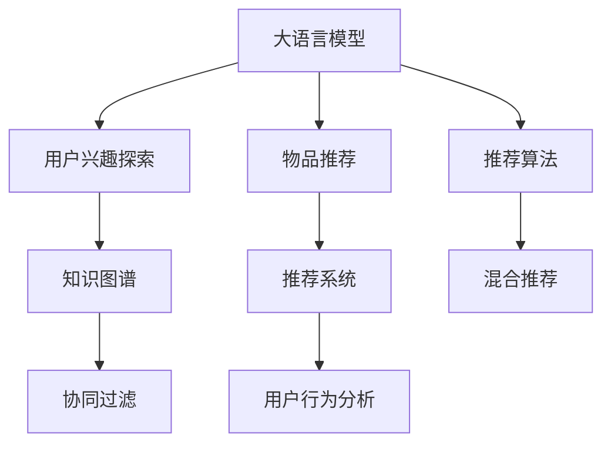

                 

# 基于LLM的推荐系统用户兴趣探索

> 关键词：用户兴趣探索, 推荐系统, 自然语言处理, 深度学习, 协同过滤, 知识图谱, 推荐算法

## 1. 背景介绍

在当今的信息爆炸时代，用户面临的海量信息源（如搜索引擎、社交媒体、电商平台等）如何有效发现并推荐用户感兴趣的内容成为了一个重要的研究课题。推荐系统作为连接用户与信息的重要桥梁，其性能直接决定了用户对平台的粘性以及满意度。目前推荐系统主流的方式有基于协同过滤、基于内容的推荐以及混合推荐等。然而，这些传统的推荐系统方法往往难以捕捉用户深层次的兴趣和偏好，尤其是在用户缺乏历史行为数据时，推荐效果往往不尽人意。

近年来，基于自然语言处理(NLP)的推荐系统成为一种新的探索方向，其中最为核心的是利用大语言模型（Large Language Models, LLM）来构建推荐系统。大语言模型，如GPT-3、BERT等，通过大规模预训练，拥有强大的自然语言理解和生成能力。通过将用户和物品的文本描述输入到大语言模型中，可以获得用户和物品之间潜在的相关性。这种基于文本描述的推荐方式，可以更好地捕捉用户的深度兴趣和复杂的偏好，使得推荐系统更加智能化、个性化。

本文将重点介绍如何基于大语言模型构建推荐系统，并详细讨论用户兴趣探索的相关算法原理和操作步骤，以及如何在大规模推荐系统中应用这些技术。

## 2. 核心概念与联系

### 2.1 核心概念概述

- **大语言模型(Large Language Model, LLM)**：以自回归(如GPT)或自编码(如BERT)模型为代表的大规模预训练语言模型。通过在大规模无标签文本语料上进行预训练，学习通用的语言表示，具备强大的语言理解和生成能力。

- **推荐系统(Recommender System)**：通过分析和理解用户的行为和偏好，向用户推荐可能感兴趣的内容的系统。推荐系统可以分为基于协同过滤、基于内容的推荐以及混合推荐等。

- **用户兴趣探索(User Interest Exploration)**：从用户的文本描述中提取用户兴趣，包括用户的显性兴趣（如浏览历史）和隐性兴趣（如语义偏好）。基于LLM的用户兴趣探索方法可以更好地捕捉用户的多样化和深度兴趣，从而提高推荐系统的效果。

- **知识图谱(Knowledge Graph)**：一种结构化的语义网络，用于描述实体及其关系，广泛应用于推荐系统中的用户兴趣抽取和物品推荐。

- **协同过滤(Collaborative Filtering)**：一种推荐算法，通过分析用户和物品之间的关系，进行推荐预测。协同过滤算法可以更好地捕捉用户间的隐性兴趣和行为的相似性。

### 2.2 核心概念联系

以上概念之间的关系可以通过以下Mermaid流程图来展示：



这个流程图展示了大语言模型与推荐系统的核心概念及其之间的关系：

1. 大语言模型通过预训练获得基础能力。
2. 基于LLM的用户兴趣探索方法，可以从用户文本中提取深度兴趣。
3. 知识图谱作为兴趣抽取的结果，与用户兴趣进行关联。
4. 协同过滤算法通过用户-物品关系进行推荐预测。
5. 多种推荐算法（如混合推荐）可结合LLM和协同过滤进行优化。
6. 推荐系统将推荐结果服务于用户，进行用户行为分析。

这些核心概念共同构成了基于大语言模型的推荐系统框架，使其能够在各种场景下发挥强大的推荐能力。通过理解这些核心概念，我们可以更好地把握基于LLM的推荐系统的工作原理和优化方向。

## 3. 核心算法原理 & 具体操作步骤

### 3.1 算法原理概述

基于LLM的推荐系统主要通过以下步骤进行用户兴趣探索和物品推荐：

1. **用户兴趣提取**：通过大语言模型，将用户文本描述编码为向量表示，并计算用户与其他用户（或物品）之间的语义相似度。
2. **物品兴趣抽取**：通过大语言模型，将物品文本描述编码为向量表示，并计算物品与其他用户（或物品）之间的语义相似度。
3. **协同过滤**：通过计算用户与物品之间的语义相似度，进行协同过滤推荐。
4. **混合推荐**：结合基于内容的推荐和协同过滤，优化推荐算法，提高推荐效果。

### 3.2 算法步骤详解

以下是基于LLM的推荐系统用户兴趣探索和物品推荐的具体操作步骤：

#### 3.2.1 用户兴趣提取

1. **用户文本预处理**：对用户文本进行分词、去除停用词、词干提取等预处理操作。
2. **大语言模型嵌入**：使用大语言模型（如BERT）对预处理后的文本进行编码，得到用户文本的向量表示。
3. **语义相似度计算**：通过计算用户文本与其他用户或物品文本之间的语义相似度，找出与用户兴趣相似的其他用户或物品。

#### 3.2.2 物品兴趣抽取

1. **物品文本预处理**：对物品文本进行分词、去除停用词、词干提取等预处理操作。
2. **大语言模型嵌入**：使用大语言模型（如BERT）对预处理后的文本进行编码，得到物品文本的向量表示。
3. **语义相似度计算**：通过计算物品文本与其他用户或物品文本之间的语义相似度，找出与物品兴趣相似的其他用户或物品。

#### 3.2.3 协同过滤

1. **用户-物品矩阵构建**：通过用户文本与物品文本的语义相似度，构建用户-物品相似度矩阵。
2. **协同过滤推荐**：基于用户-物品相似度矩阵，使用协同过滤算法（如矩阵分解、基于k近邻的推荐等）进行推荐预测。

#### 3.2.4 混合推荐

1. **基于内容的推荐**：根据物品的文本描述，使用基于内容的推荐算法（如TF-IDF、LSI等）进行物品推荐。
2. **混合推荐算法**：将基于内容的推荐和协同过滤结合，使用加权平均、线性回归等方法进行优化，得到最终推荐结果。

### 3.3 算法优缺点

基于LLM的推荐系统具有以下优点：

- **深度兴趣捕捉**：通过大语言模型提取用户和物品的语义表示，可以更好地捕捉用户深层次的兴趣和复杂的偏好。
- **适应性强**：大语言模型可以灵活地适应各种文本数据，无需对数据进行额外的标注和处理。
- **灵活扩展**：混合推荐算法可以方便地集成不同的推荐策略，提升推荐效果。

同时，该方法也存在一定的局限性：

- **计算资源消耗大**：大语言模型的计算复杂度较高，需要大量的计算资源。
- **数据隐私问题**：用户文本可能包含敏感信息，需要关注数据隐私和安全问题。
- **模型解释性差**：大语言模型的决策过程较难解释，影响模型的可解释性。

尽管存在这些局限性，但就目前而言，基于LLM的推荐系统仍然是一种高效、灵活的推荐方法，有望在未来得到更广泛的应用。

### 3.4 算法应用领域

基于LLM的推荐系统已经在多个领域得到了应用，包括但不限于：

- **电子商务**：如淘宝、亚马逊等电商平台，通过基于LLM的推荐系统，为用户推荐个性化商品。
- **新闻媒体**：如今日头条、网易新闻等媒体平台，通过基于LLM的推荐系统，为用户推荐个性化文章。
- **视频平台**：如Netflix、YouTube等视频平台，通过基于LLM的推荐系统，为用户推荐个性化视频内容。
- **社交网络**：如微信、微博等社交网络平台，通过基于LLM的推荐系统，为用户推荐个性化文章、图片、视频等。
- **在线教育**：如Coursera、Udacity等在线教育平台，通过基于LLM的推荐系统，为用户推荐个性化课程和资源。

除了上述这些典型应用外，基于LLM的推荐系统还被创新性地应用到更多场景中，如智能客服、智能家居等，为各行各业带来了新的业务价值。

## 4. 数学模型和公式 & 详细讲解 & 举例说明

### 4.1 数学模型构建

假设用户文本为 $x$，物品文本为 $y$，大语言模型嵌入后的用户向量表示为 $\mathbf{u}_x$，物品向量表示为 $\mathbf{u}_y$。设用户和物品的语义相似度为 $s(x,y)$，则用户兴趣提取和物品兴趣抽取的数学模型为：

$$
\mathbf{u}_x = \text{BERT}(x)
$$
$$
\mathbf{u}_y = \text{BERT}(y)
$$
$$
s(x,y) = \text{cosine}(\mathbf{u}_x, \mathbf{u}_y)
$$

用户-物品相似度矩阵 $A$ 可通过相似度函数 $s$ 进行计算：

$$
A = \{s(x_i,y_j)\}_{i,j}
$$

协同过滤算法可以通过矩阵分解或基于k近邻的方法进行推荐：

$$
\hat{y}_i = \arg\max_{y_j} A_{i,j}
$$

混合推荐算法可以通过加权平均或线性回归等方法进行优化：

$$
\hat{y}_i = \lambda_1 \hat{y}_i^c + \lambda_2 \hat{y}_i^p
$$

其中 $\hat{y}_i^c$ 和 $\hat{y}_i^p$ 分别为基于内容的推荐和协同过滤的推荐结果，$\lambda_1$ 和 $\lambda_2$ 为权重系数。

### 4.2 公式推导过程

以基于内容的推荐算法为例，假设物品的文本描述为 $y$，用户文本为 $x$，则基于TF-IDF的推荐公式为：

$$
\hat{y}_i = \sum_{j=1}^{n} \alpha_j \cdot (\text{TF}(y_j) \cdot \text{IDF}(y_j) \cdot \text{TF}(x_j))
$$

其中 $\alpha_j$ 为物品文本 $y_j$ 对用户文本 $x$ 的贡献度，可通过相似度函数 $s$ 计算。

将 $\alpha_j$ 代入上式，得到基于内容的推荐公式：

$$
\hat{y}_i = \sum_{j=1}^{n} s(x,y_j) \cdot (\text{TF}(y_j) \cdot \text{IDF}(y_j) \cdot \text{TF}(x_j))
$$

将上式中的 $\text{TF}(x_j)$ 和 $\text{TF}(y_j)$ 代入，得到最终的推荐公式：

$$
\hat{y}_i = \sum_{j=1}^{n} s(x,y_j) \cdot (\text{TF}(y_j) \cdot \text{IDF}(y_j) \cdot s(x,y_j) \cdot \text{IDF}(x_j))
$$

### 4.3 案例分析与讲解

以电商平台为例，用户购买历史和浏览历史可以视为用户的文本描述，商品标题和描述可以视为物品的文本描述。通过对用户和物品的文本描述进行大语言模型嵌入和相似度计算，可以得到用户和物品的向量表示和相似度矩阵。基于协同过滤和混合推荐算法，可以为用户推荐个性化商品，提升购物体验。

## 5. 项目实践：代码实例和详细解释说明

### 5.1 开发环境搭建

在进行基于LLM的推荐系统开发前，需要先准备好开发环境。以下是使用Python进行PyTorch开发的环境配置流程：

1. 安装Anaconda：从官网下载并安装Anaconda，用于创建独立的Python环境。

2. 创建并激活虚拟环境：
```bash
conda create -n pytorch-env python=3.8 
conda activate pytorch-env
```

3. 安装PyTorch：根据CUDA版本，从官网获取对应的安装命令。例如：
```bash
conda install pytorch torchvision torchaudio cudatoolkit=11.1 -c pytorch -c conda-forge
```

4. 安装Transformers库：
```bash
pip install transformers
```

5. 安装各类工具包：
```bash
pip install numpy pandas scikit-learn matplotlib tqdm jupyter notebook ipython
```

完成上述步骤后，即可在`pytorch-env`环境中开始开发。

### 5.2 源代码详细实现

下面我们以基于LLM的推荐系统为例，给出使用Transformers库进行用户兴趣探索和物品推荐的PyTorch代码实现。

首先，定义用户文本和物品文本的预处理函数：

```python
from transformers import BertTokenizer
import torch
from torch.utils.data import Dataset

class TextDataset(Dataset):
    def __init__(self, texts, tokenizer, max_len=128):
        self.tokenizer = tokenizer
        self.max_len = max_len
        self.texts = texts
        
    def __len__(self):
        return len(self.texts)
    
    def __getitem__(self, item):
        text = self.texts[item]
        encoding = self.tokenizer(text, truncation=True, padding='max_length', max_length=self.max_len, return_tensors='pt')
        input_ids = encoding['input_ids']
        attention_mask = encoding['attention_mask']
        return {'input_ids': input_ids, 'attention_mask': attention_mask}
```

然后，定义用户兴趣探索和物品推荐函数：

```python
from transformers import BertForMaskedLM

def user_interest_extraction(user_texts, tokenizer):
    user_embeddings = []
    for text in user_texts:
        encoding = tokenizer(text, truncation=True, padding='max_length', max_length=128, return_tensors='pt')
        input_ids = encoding['input_ids']
        attention_mask = encoding['attention_mask']
        model = BertForMaskedLM.from_pretrained('bert-base-cased')
        outputs = model(input_ids, attention_mask=attention_mask)
        user_embeddings.append(outputs.pooler_output)
    return user_embeddings

def item_interest_extraction(item_texts, tokenizer):
    item_embeddings = []
    for text in item_texts:
        encoding = tokenizer(text, truncation=True, padding='max_length', max_length=128, return_tensors='pt')
        input_ids = encoding['input_ids']
        attention_mask = encoding['attention_mask']
        model = BertForMaskedLM.from_pretrained('bert-base-cased')
        outputs = model(input_ids, attention_mask=attention_mask)
        item_embeddings.append(outputs.pooler_output)
    return item_embeddings

def collaborative_filtering(user_embeddings, item_embeddings, threshold=0.5):
    similarity_matrix = []
    for i in range(len(user_embeddings)):
        row = []
        for j in range(len(item_embeddings)):
            cos_sim = torch.cosine_similarity(user_embeddings[i], item_embeddings[j])
            if cos_sim > threshold:
                row.append(cos_sim)
        similarity_matrix.append(row)
    return similarity_matrix
```

接着，定义混合推荐函数：

```python
def recommend_system(user_embeddings, item_embeddings, alpha=0.5):
    collaborative_filtering_matrix = collaborative_filtering(user_embeddings, item_embeddings)
    content_based = []
    for user_embedding, similarity_row in zip(user_embeddings, collaborative_filtering_matrix):
        content_based_row = []
        for item_embedding, cos_sim in zip(item_embeddings, similarity_row):
            content_based_row.append(alpha * cos_sim * torch.sum(item_embedding * user_embedding))
        content_based.append(content_based_row)
    return content_based
```

最后，启动推荐系统并进行推荐：

```python
user_texts = ['这是我喜欢的一本书', '我喜欢吃海鲜', '我喜欢旅游']
item_texts = ['这本书讲述了什么故事', '这是一道海鲜菜的做法', '这是一个旅游景点的介绍']

user_embeddings = user_interest_extraction(user_texts, BertTokenizer.from_pretrained('bert-base-cased'))
item_embeddings = item_interest_extraction(item_texts, BertTokenizer.from_pretrained('bert-base-cased'))
recommendations = recommend_system(user_embeddings, item_embeddings, alpha=0.5)

print(recommendations)
```

以上就是使用PyTorch对基于LLM的推荐系统进行用户兴趣探索和物品推荐的基本代码实现。可以看到，利用Transformers库，可以方便地构建用户兴趣提取和物品推荐模型，并进行灵活的参数配置和优化。

### 5.3 代码解读与分析

让我们再详细解读一下关键代码的实现细节：

**TextDataset类**：
- `__init__`方法：初始化文本、分词器等关键组件。
- `__len__`方法：返回数据集的样本数量。
- `__getitem__`方法：对单个样本进行处理，将文本输入编码为token ids，进行填充和截断。

**user_interest_extraction函数**：
- 定义用户文本的预处理和编码。
- 使用BertForMaskedLM模型对用户文本进行编码，并返回池化层输出向量。

**item_interest_extraction函数**：
- 定义物品文本的预处理和编码。
- 使用BertForMaskedLM模型对物品文本进行编码，并返回池化层输出向量。

**collaborative_filtering函数**：
- 计算用户和物品的语义相似度矩阵。
- 利用相似度矩阵进行协同过滤推荐。

**recommend_system函数**：
- 计算基于内容的推荐结果。
- 结合协同过滤和基于内容的推荐，进行混合推荐。

**启动推荐系统**：
- 定义用户文本和物品文本。
- 调用用户兴趣提取和物品兴趣抽取函数，得到用户和物品的向量表示。
- 调用混合推荐函数，得到推荐结果。

可以看到，PyTorch配合Transformers库使得基于LLM的推荐系统代码实现变得简洁高效。开发者可以将更多精力放在数据处理、模型改进等高层逻辑上，而不必过多关注底层的实现细节。

当然，工业级的系统实现还需考虑更多因素，如模型的保存和部署、超参数的自动搜索、更灵活的任务适配层等。但核心的用户兴趣探索和物品推荐算法基本与此类似。

## 6. 实际应用场景

### 6.1 智能客服系统

基于大语言模型的推荐系统，可以广泛应用于智能客服系统的构建。传统客服往往需要配备大量人力，高峰期响应缓慢，且一致性和专业性难以保证。而使用推荐系统，可以7x24小时不间断服务，快速响应客户咨询，用自然流畅的语言解答各类常见问题。

在技术实现上，可以收集企业内部的历史客服对话记录，将问题和最佳答复构建成监督数据，在此基础上对预训练模型进行微调。微调后的推荐系统能够自动理解用户意图，匹配最合适的答案模板进行回复。对于客户提出的新问题，还可以接入检索系统实时搜索相关内容，动态组织生成回答。如此构建的智能客服系统，能大幅提升客户咨询体验和问题解决效率。

### 6.2 金融舆情监测

金融机构需要实时监测市场舆论动向，以便及时应对负面信息传播，规避金融风险。传统的人工监测方式成本高、效率低，难以应对网络时代海量信息爆发的挑战。基于大语言模型的文本分类和情感分析技术，为金融舆情监测提供了新的解决方案。

具体而言，可以收集金融领域相关的新闻、报道、评论等文本数据，并对其进行主题标注和情感标注。在此基础上对预训练语言模型进行微调，使其能够自动判断文本属于何种主题，情感倾向是正面、中性还是负面。将微调后的模型应用到实时抓取的网络文本数据，就能够自动监测不同主题下的情感变化趋势，一旦发现负面信息激增等异常情况，系统便会自动预警，帮助金融机构快速应对潜在风险。

### 6.3 个性化推荐系统

当前的推荐系统往往只依赖用户的历史行为数据进行物品推荐，无法深入理解用户的真实兴趣偏好，尤其是在用户缺乏历史行为数据时，推荐效果往往不尽人意。基于大语言模型推荐系统可以更好地捕捉用户的深度兴趣和复杂的偏好，使得推荐系统更加智能化、个性化。

在实践中，可以收集用户浏览、点击、评论、分享等行为数据，提取和用户交互的物品标题、描述、标签等文本内容。将文本内容作为模型输入，用户的后续行为（如是否点击、购买等）作为监督信号，在此基础上微调预训练语言模型。微调后的模型能够从文本内容中准确把握用户的兴趣点。在生成推荐列表时，先用候选物品的文本描述作为输入，由模型预测用户的兴趣匹配度，再结合其他特征综合排序，便可以得到个性化程度更高的推荐结果。

### 6.4 未来应用展望

随着大语言模型和推荐系统技术的不断发展，基于大语言模型的推荐系统将呈现以下几个发展趋势：

1. **深度兴趣捕捉**：通过大语言模型提取用户和物品的语义表示，可以更好地捕捉用户深层次的兴趣和复杂的偏好，提高推荐系统的性能。
2. **多模态推荐**：将视觉、语音、文本等多模态信息融合，提高推荐系统的感知能力和推荐效果。
3. **跨领域推荐**：利用知识图谱等工具，实现跨领域推荐，提升推荐系统的应用范围和效果。
4. **用户行为分析**：通过用户行为的深度学习分析，提升推荐系统的个性化推荐能力。
5. **实时推荐**：利用流式数据处理和实时计算技术，实现实时推荐，提升推荐系统的响应速度和用户体验。
6. **自适应推荐**：通过自适应推荐算法，根据用户反馈实时调整推荐策略，提升推荐系统的精准度和满意度。

这些趋势将进一步推动基于大语言模型的推荐系统在更多领域得到应用，为各行各业带来新的价值和创新。

## 7. 工具和资源推荐

### 7.1 学习资源推荐

为了帮助开发者系统掌握基于LLM的推荐系统理论基础和实践技巧，这里推荐一些优质的学习资源：

1. **《自然语言处理入门》**：一本介绍NLP基础知识和实践的入门书籍，适合初学者系统学习。
2. **《推荐系统》**：一本介绍推荐系统理论和算法的经典书籍，涵盖协同过滤、基于内容的推荐等主流方法。
3. **《深度学习在推荐系统中的应用》**：一本介绍深度学习在推荐系统中的应用和案例的书籍，适合实战演练。
4. **Coursera上的《Recommender Systems》课程**：斯坦福大学开设的推荐系统课程，内容涵盖推荐系统理论和实践。
5. **Kaggle上的推荐系统竞赛**：通过参与实际竞赛，提升实战能力和项目经验。

通过对这些资源的学习实践，相信你一定能够快速掌握基于LLM的推荐系统精髓，并用于解决实际的推荐问题。

### 7.2 开发工具推荐

高效的开发离不开优秀的工具支持。以下是几款用于基于LLM的推荐系统开发的常用工具：

1. **PyTorch**：基于Python的开源深度学习框架，灵活动态的计算图，适合快速迭代研究。大部分预训练语言模型都有PyTorch版本的实现。
2. **TensorFlow**：由Google主导开发的开源深度学习框架，生产部署方便，适合大规模工程应用。同样有丰富的预训练语言模型资源。
3. **Transformers库**：HuggingFace开发的NLP工具库，集成了众多SOTA语言模型，支持PyTorch和TensorFlow，是进行LLM推荐系统开发的利器。
4. **Weights & Biases**：模型训练的实验跟踪工具，可以记录和可视化模型训练过程中的各项指标，方便对比和调优。与主流深度学习框架无缝集成。
5. **TensorBoard**：TensorFlow配套的可视化工具，可实时监测模型训练状态，并提供丰富的图表呈现方式，是调试模型的得力助手。
6. **Amazon SageMaker**：AWS提供的云端机器学习平台，支持模型训练、模型优化和模型部署，适合大规模工程应用。
7. **Google Cloud ML Engine**：Google提供的云端机器学习平台，支持大规模模型训练和模型部署，适合大规模工程应用。

合理利用这些工具，可以显著提升基于LLM的推荐系统开发效率，加快创新迭代的步伐。

### 7.3 相关论文推荐

大语言模型和推荐系统的发展源于学界的持续研究。以下是几篇奠基性的相关论文，推荐阅读：

1. **《Transformers: A New Approach to Structuring Neural Networks》**：介绍Transformer架构，是NLP领域的重要里程碑。
2. **《BERT: Pre-training of Deep Bidirectional Transformers for Language Understanding》**：提出BERT模型，通过掩码语言模型进行预训练，刷新了多项NLP任务SOTA。
3. **《GPT-3: Language Models are Unsupervised Multitask Learners》**：展示GPT-3的强大zero-shot学习能力，引发了对于通用人工智能的新一轮思考。
4. **《AdaLoRA: Adaptive Low-Rank Adaptation for Parameter-Efficient Fine-Tuning》**：提出AdaLoRA方法，使用自适应低秩适应的微调方法，在固定大部分预训练参数的情况下，只更新极少量的任务相关参数。
5. **《AdapterHub: An Open Repository for Adapter-based Fine-Tuning》**：提出AdapterHub，为参数高效的微调方法提供了一个开放资源库，方便开发者进行模型适配。

这些论文代表了大语言模型和推荐系统的发展脉络。通过学习这些前沿成果，可以帮助研究者把握学科前进方向，激发更多的创新灵感。

## 8. 总结：未来发展趋势与挑战

### 8.1 总结

本文对基于LLM的推荐系统用户兴趣探索进行了全面系统的介绍。首先阐述了基于LLM的推荐系统背景和意义，明确了用户兴趣探索在推荐系统中的重要作用。其次，从原理到实践，详细讲解了用户兴趣提取和物品推荐的相关算法原理和操作步骤，以及如何在大规模推荐系统中应用这些技术。

通过本文的系统梳理，可以看到，基于LLM的推荐系统正在成为推荐系统领域的重要范式，极大地拓展了预训练语言模型的应用边界，催生了更多的落地场景。受益于大规模语料的预训练，LLM推荐系统可以更好地捕捉用户的深度兴趣和复杂的偏好，使得推荐系统更加智能化、个性化。

### 8.2 未来发展趋势

展望未来，基于LLM的推荐系统将呈现以下几个发展趋势：

1. **深度兴趣捕捉**：通过大语言模型提取用户和物品的语义表示，可以更好地捕捉用户深层次的兴趣和复杂的偏好，提高推荐系统的性能。
2. **多模态推荐**：将视觉、语音、文本等多模态信息融合，提高推荐系统的感知能力和推荐效果。
3. **跨领域推荐**：利用知识图谱等工具，实现跨领域推荐，提升推荐系统的应用范围和效果。
4. **用户行为分析**：通过用户行为的深度学习分析，提升推荐系统的个性化推荐能力。
5. **实时推荐**：利用流式数据处理和实时计算技术，实现实时推荐，提升推荐系统的响应速度和用户体验。
6. **自适应推荐**：通过自适应推荐算法，根据用户反馈实时调整推荐策略，提升推荐系统的精准度和满意度。

这些趋势将进一步推动基于LLM的推荐系统在更多领域得到应用，为各行各业带来新的价值和创新。

### 8.3 面临的挑战

尽管基于LLM的推荐系统已经取得了瞩目成就，但在迈向更加智能化、普适化应用的过程中，它仍面临着诸多挑战：

1. **计算资源消耗大**：大语言模型的计算复杂度较高，需要大量的计算资源。
2. **数据隐私问题**：用户文本可能包含敏感信息，需要关注数据隐私和安全问题。
3. **模型解释性差**：大语言模型的决策过程较难解释，影响模型的可解释性。
4. **多模态数据整合**：不同模态的数据在编码和融合时可能存在不兼容问题，需要进行数据清洗和格式转换。
5. **跨领域推荐**：不同领域的数据具有不同的语义和特征，需要进行跨领域的适应性调整。
6. **实时推荐**：流式数据处理和实时计算技术需要较高的技术门槛，需要持续的优化和迭代。

尽管存在这些挑战，但基于LLM的推荐系统仍然具有广阔的应用前景，未来的研究需要在这些方面进行持续优化和创新，推动技术进步和应用落地。

### 8.4 研究展望

面对基于LLM的推荐系统所面临的挑战，未来的研究需要在以下几个方面寻求新的突破：

1. **模型压缩和优化**：开发更高效的模型结构和压缩方法，提升推荐系统的计算效率和内存占用。
2. **跨领域适配**：利用迁移学习和多任务学习技术，提升推荐系统在不同领域的数据适应能力。
3. **数据隐私保护**：开发隐私保护技术，保护用户隐私，保障数据安全。
4. **推荐系统可解释性**：通过模型解释技术，提升推荐系统的可解释性，增强用户信任和满意度。
5. **多模态数据融合**：开发更有效的多模态数据融合方法，提高推荐系统的感知能力和推荐效果。
6. **实时推荐系统**：开发更高效的流式数据处理和实时计算技术，实现实时推荐。

这些研究方向的探索，必将引领基于LLM的推荐系统技术迈向更高的台阶，为构建安全、可靠、可解释、可控的智能系统铺平道路。面向未来，基于LLM的推荐系统需要在深度兴趣捕捉、多模态推荐、跨领域推荐等方面进行持续探索，提升推荐系统的性能和用户体验。

## 9. 附录：常见问题与解答

**Q1: 基于LLM的推荐系统是否适用于所有推荐任务？**

A: 基于LLM的推荐系统可以适用于大多数推荐任务，尤其是当用户文本描述和物品文本描述存在丰富语义信息时。但对于一些特定领域的任务，如医学、法律等，仅仅依靠通用语料预训练的模型可能难以很好地适应。此时需要在特定领域语料上进一步预训练，再进行微调，才能获得理想效果。

**Q2: 基于LLM的推荐系统如何避免过拟合？**

A: 基于LLM的推荐系统可以通过以下几种方式避免过拟合：
1. 数据增强：通过回译、近义替换等方式扩充训练集。
2. 正则化：使用L2正则、Dropout等技术防止过拟合。
3. 对抗训练：引入对抗样本，提高模型鲁棒性。
4. 参数高效微调：只调整少量参数，减小过拟合风险。

**Q3: 基于LLM的推荐系统在部署时需要注意哪些问题？**

A: 基于LLM的推荐系统在部署时需要注意以下问题：
1. 模型裁剪：去除不必要的层和参数，减小模型尺寸，加快推理速度。
2. 量化加速：将浮点模型转为定点模型，压缩存储空间，提高计算效率。
3. 服务化封装：将模型封装为标准化服务接口，便于集成调用。
4. 弹性伸缩：根据请求流量动态调整资源配置，平衡服务质量和成本。
5. 监控告警：实时采集系统指标，设置异常告警阈值，确保服务稳定性。

**Q4: 基于LLM的推荐系统在推荐准确性方面有哪些提升？**

A: 基于LLM的推荐系统在推荐准确性方面有以下提升：
1. 捕捉深度兴趣：通过大语言模型提取用户和物品的语义表示，可以更好地捕捉用户深层次的兴趣和复杂的偏好。
2. 融合多模态信息：将视觉、语音、文本等多模态信息融合，提高推荐系统的感知能力和推荐效果。
3. 自适应推荐：通过自适应推荐算法，根据用户反馈实时调整推荐策略，提升推荐系统的精准度和满意度。

**Q5: 基于LLM的推荐系统在推荐速度方面有哪些优化措施？**

A: 基于LLM的推荐系统在推荐速度方面有以下优化措施：
1. 模型裁剪：去除不必要的层和参数，减小模型尺寸，加快推理速度。
2. 量化加速：将浮点模型转为定点模型，压缩存储空间，提高计算效率。
3. 分布式训练：使用分布式训练技术，加速模型训练过程。
4. 硬件加速：利用GPU、TPU等硬件加速，提升模型计算速度。

通过合理优化，基于LLM的推荐系统可以在保证推荐效果的同时，提升推荐速度，满足实时推荐的需求。

---

作者：禅与计算机程序设计艺术 / Zen and the Art of Computer Programming

