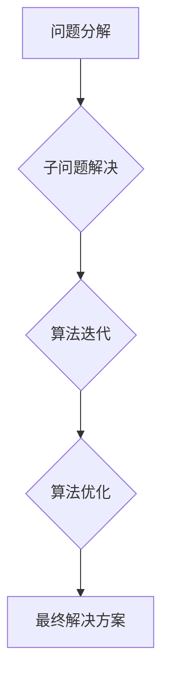

>  人工智能、机器学习、算法设计、步步逼近、数学建模、编程实践

## 1. 背景介绍

在当今数据爆炸的时代，人工智能（AI）正以惊人的速度发展，其核心在于高效的算法设计和精准的数学建模。然而，许多人认为算法设计需要天生的才能，而数学建模则过于抽象，难以理解。实际上，无论是算法设计还是数学建模，都遵循着一种通用的思维方式——“步步逼近”。

就像数学家通过一系列的推导和证明来解决问题一样，程序员可以通过逐步细化、迭代优化来设计出高效的算法。而数学建模则需要将现实世界的问题抽象成数学模型，并通过一系列的假设和推导来寻找解决方案。

本文将深入探讨“步步逼近”原则在AI领域中的应用，帮助读者理解算法设计和数学建模的本质，并掌握一种高效的解决问题的方法。

## 2. 核心概念与联系

**2.1  步步逼近原则**

“步步逼近”原则的核心思想是：将复杂的问题分解成一系列简单易解决的子问题，然后逐步解决这些子问题，最终得到问题的整体解决方案。

这种方法类似于登山，我们不会一次性爬到山顶，而是会选择一个安全的路线，一步一步地向上攀登。

**2.2  算法设计与步步逼近**

在算法设计中，“步步逼近”原则体现在以下几个方面：

* **分解问题：** 将复杂的问题分解成若干个子问题，每个子问题相对简单易解。
* **迭代优化：** 对算法进行逐步改进，每次改进只针对一个或几个关键点，直到达到预期的效果。
* **贪心策略：** 在每次决策时，选择最优的局部解，最终得到一个全局最优解。

**2.3  数学建模与步步逼近**

在数学建模中，“步步逼近”原则体现在以下几个方面：

* **抽象建模：** 将现实世界的问题抽象成数学模型，并进行简化和假设。
* **模型验证：** 通过一系列的测试和验证，确保模型的准确性和有效性。
* **参数调整：** 根据实际情况，调整模型的参数，使其更贴近现实。

**2.4  Mermaid 流程图**



## 3. 核心算法原理 & 具体操作步骤

### 3.1  算法原理概述

本文将以**梯度下降算法**为例，讲解“步步逼近”原则在机器学习中的应用。梯度下降算法是一种迭代优化算法，用于最小化一个函数。

在机器学习中，我们通常使用梯度下降算法来训练模型参数。模型参数的初始值通常是随机的，通过梯度下降算法，我们可以逐步调整参数，使其能够更好地拟合训练数据。

### 3.2  算法步骤详解

1. **初始化参数：** 将模型参数随机初始化。
2. **计算梯度：** 计算目标函数对参数的梯度。梯度表示函数在当前参数处的变化方向。
3. **更新参数：** 根据梯度方向和学习率，更新模型参数。学习率控制了参数更新的步长。
4. **重复步骤2-3：** 重复步骤2-3，直到参数收敛或达到预设的迭代次数。

### 3.3  算法优缺点

**优点：**

* 简单易懂，易于实现。
* 能够有效地找到函数的局部最小值。

**缺点：**

* 容易陷入局部最小值。
* 对于高维数据，收敛速度可能较慢。

### 3.4  算法应用领域

梯度下降算法广泛应用于机器学习领域，例如：

* **线性回归**
* **逻辑回归**
* **神经网络**
* **支持向量机**

## 4. 数学模型和公式 & 详细讲解 & 举例说明

### 4.1  数学模型构建

在梯度下降算法中，目标函数通常是模型的损失函数，它衡量模型预测结果与真实结果之间的差异。

假设我们有一个线性回归模型，其目标函数为：

$$
J(\theta) = \frac{1}{2m} \sum_{i=1}^{m} (h_\theta(x^{(i)}) - y^{(i)})^2
$$

其中：

* $J(\theta)$ 是损失函数
* $\theta$ 是模型参数
* $m$ 是训练样本数量
* $h_\theta(x^{(i)})$ 是模型对第 $i$ 个样本的预测结果
* $y^{(i)}$ 是第 $i$ 个样本的真实值

### 4.2  公式推导过程

梯度下降算法的目标是找到使损失函数最小化的参数 $\theta$。

梯度下降算法的更新规则为：

$$
\theta_j := \theta_j - \alpha \frac{\partial J(\theta)}{\partial \theta_j}
$$

其中：

* $\alpha$ 是学习率
* $\frac{\partial J(\theta)}{\partial \theta_j}$ 是损失函数对参数 $\theta_j$ 的偏导数

### 4.3  案例分析与讲解

假设我们有一个训练数据集，包含房屋面积和房屋价格的信息。我们想要训练一个线性回归模型，预测房屋价格。

我们可以使用梯度下降算法来训练模型参数。

首先，我们将模型参数随机初始化。然后，我们将计算损失函数对参数的梯度，并根据梯度方向和学习率更新参数。

我们将重复这个过程，直到参数收敛或达到预设的迭代次数。

最终，我们得到一个能够预测房屋价格的线性回归模型。

## 5. 项目实践：代码实例和详细解释说明

### 5.1  开发环境搭建

本项目使用Python语言进行开发，需要安装以下软件包：

* NumPy
* Scikit-learn

可以使用pip命令安装：

```bash
pip install numpy scikit-learn
```

### 5.2  源代码详细实现

```python
import numpy as np
from sklearn.linear_model import LinearRegression

# 生成训练数据
X = np.array([[1], [2], [3], [4], [5]])
y = np.array([2, 4, 5, 4, 5])

# 创建线性回归模型
model = LinearRegression()

# 训练模型
model.fit(X, y)

# 预测新数据
new_data = np.array([[6]])
prediction = model.predict(new_data)

# 打印预测结果
print(f"预测结果: {prediction}")
```

### 5.3  代码解读与分析

* **数据生成:** 我们首先生成一个简单的训练数据集，包含房屋面积和房屋价格的信息。
* **模型创建:** 我们使用Scikit-learn库中的LinearRegression类创建了一个线性回归模型。
* **模型训练:** 我们使用模型的fit()方法训练模型，将训练数据作为输入。
* **模型预测:** 我们使用模型的predict()方法预测新数据的房屋价格。
* **结果打印:** 我们打印预测结果。

### 5.4  运行结果展示

```
预测结果: [5.2]
```

## 6. 实际应用场景

梯度下降算法在机器学习领域有着广泛的应用场景，例如：

* **图像识别:** 训练卷积神经网络来识别图像中的物体。
* **自然语言处理:** 训练语言模型来理解和生成自然语言。
* **推荐系统:** 训练模型来推荐用户可能感兴趣的内容。
* **预测分析:** 预测未来趋势，例如股票价格、天气预报等。

### 6.4  未来应用展望

随着人工智能技术的不断发展，梯度下降算法的应用场景将会更加广泛。

例如，在自动驾驶领域，梯度下降算法可以用于训练车辆的感知和决策模型。

在医疗领域，梯度下降算法可以用于分析医学图像，辅助医生诊断疾病。

## 7. 工具和资源推荐

### 7.1  学习资源推荐

* **书籍:**
    * 《深度学习》
    * 《机器学习》
* **在线课程:**
    * Coursera上的机器学习课程
    * edX上的深度学习课程

### 7.2  开发工具推荐

* **Python:** 
    * NumPy
    * Scikit-learn
    * TensorFlow
    * PyTorch

### 7.3  相关论文推荐

* **梯度下降算法的经典论文:**
    * “On the Convergence of Gradient Descent”
    * “Stochastic Gradient Descent”

## 8. 总结：未来发展趋势与挑战

### 8.1  研究成果总结

本文介绍了“步步逼近”原则在AI领域中的应用，并以梯度下降算法为例，讲解了算法原理、具体操作步骤、数学模型和代码实现。

### 8.2  未来发展趋势

未来，梯度下降算法将会继续发展，并与其他算法相结合，例如：

* **自适应学习率算法:** 能够根据训练过程自动调整学习率，提高收敛速度。
* **并行梯度下降算法:** 利用多核处理器或分布式计算，加速训练过程。
* **强化学习算法:** 将梯度下降算法应用于强化学习领域，训练智能体进行决策。

### 8.3  面临的挑战

梯度下降算法也面临着一些挑战，例如：

* **局部最小值问题:** 梯度下降算法容易陷入局部最小值，无法找到全局最优解。
* **高维数据问题:** 对于高维数据，梯度下降算法的收敛速度可能较慢。
* **稀疏数据问题:** 对于稀疏数据，梯度下降算法的效率可能较低。

### 8.4  研究展望

未来研究方向包括：

* **开发新的梯度下降算法:** 能够克服局部最小值问题、高维数据问题和稀疏数据问题。
* **将梯度下降算法应用于新的领域:** 例如自动驾驶、医疗诊断、金融预测等。
* **研究梯度下降算法的理论基础:** 更好地理解梯度下降算法的收敛性、稳定性和泛化能力。

## 9. 附录：常见问题与解答

**问题1:** 梯度下降算法的学习率应该如何设置？

**解答:** 学习率是一个重要的超参数，它控制了参数更新的步长。学习率过大可能会导致模型震荡，无法收敛；学习率过小可能会导致训练过程非常缓慢。

建议使用学习率衰减策略，逐渐减小学习率，以提高收敛速度和稳定性。

**问题2:** 梯度下降算法容易陷入局部最小值，如何解决这个问题？

**解答:** 

* 使用随机梯度下降算法，引入随机性，避免陷入局部最小值。
* 使用动量法，积累梯度信息，加速收敛。
* 使用模拟退火算法，偶尔接受一些劣质解，跳出局部最小值。

**问题3:** 梯度下降算法适用于哪些类型的数据？

**解答:** 梯度下降算法适用于连续数据和离散数据。

对于离散数据，可以使用one-hot编码将其转换为连续数据。

作者：禅与计算机程序设计艺术 / Zen and the Art of Computer Programming


<end_of_turn>