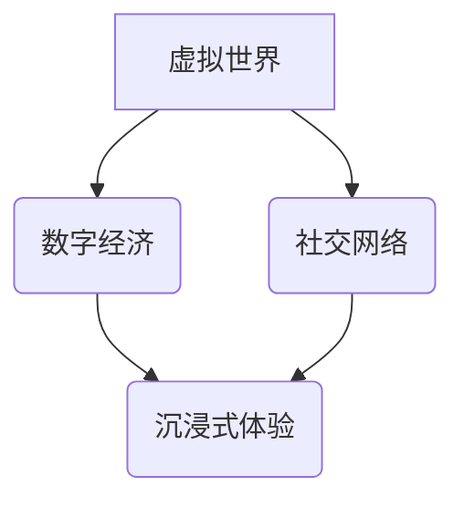

> 元宇宙、虚拟现实、增强现实、区块链、人工智能、集体意识、数字孪生、沉浸式体验

## 1. 背景介绍

近年来，随着虚拟现实 (VR)、增强现实 (AR)、区块链、人工智能 (AI) 等技术的快速发展，一个全新的概念——元宇宙逐渐进入人们的视野。元宇宙被定义为一个由虚拟世界、数字经济和社交网络组成的融合空间，它将打破物理世界和数字世界的界限，创造一个更加沉浸式、交互式和持久化的体验。

元宇宙的概念源于科幻小说和电影，例如尼尔·斯蒂芬森的《雪崩》和《头号玩家》。这些作品描绘了一个虚拟世界，人们可以在其中生活、工作和娱乐，并与其他用户进行互动。随着技术的进步，元宇宙的概念逐渐从科幻走向现实，并开始在各个领域得到应用。

## 2. 核心概念与联系

元宇宙是一个复杂的系统，它包含多个核心概念和技术，这些概念和技术相互关联，共同构成了元宇宙的整体架构。

**2.1 核心概念**

* **虚拟世界:** 元宇宙的核心是虚拟世界，它是一个由计算机生成的虚拟环境，可以模拟现实世界或创造全新的世界。
* **数字经济:** 元宇宙将拥有自己的经济体系，用户可以通过虚拟货币、NFT 等方式进行交易和消费。
* **社交网络:** 元宇宙将成为一个新的社交平台，用户可以与其他用户进行互动、建立关系和共同体验。
* **沉浸式体验:** 元宇宙将利用 VR、AR 等技术，为用户提供更加沉浸式和交互式的体验。

**2.2 架构关系**



**2.3 关键技术**

* **区块链:** 元宇宙将利用区块链技术实现数据安全、透明和不可篡改。
* **人工智能:** AI 将在元宇宙中扮演重要角色，例如用于生成虚拟内容、提供个性化服务和模拟人类行为。
* **云计算:** 云计算将为元宇宙提供强大的计算和存储能力。
* **5G/6G:** 高速网络将为元宇宙提供低延迟、高带宽的连接。

## 3. 核心算法原理 & 具体操作步骤

元宇宙的构建和运行需要多种算法的支持，例如图形渲染算法、路径规划算法、人工智能算法等。

### 3.1  算法原理概述

* **图形渲染算法:** 用于生成虚拟世界的图像，例如光线追踪算法、着色算法等。
* **路径规划算法:** 用于计算虚拟角色在虚拟世界中的移动路径，例如A*算法、Dijkstra算法等。
* **人工智能算法:** 用于模拟虚拟角色的行为和决策，例如深度学习算法、强化学习算法等。

### 3.2  算法步骤详解

以路径规划算法为例，其具体步骤如下：

1. **构建地图:** 将虚拟世界转化为一个图形表示，例如网格地图或图结构。
2. **定义起点和终点:** 指定虚拟角色的起始位置和目标位置。
3. **搜索路径:** 使用路径规划算法搜索从起点到终点的最优路径。
4. **执行路径:** 虚拟角色按照搜索到的路径进行移动。

### 3.3  算法优缺点

* **图形渲染算法:** 优点是能够生成逼真的图像，缺点是计算量大，需要强大的硬件支持。
* **路径规划算法:** 优点是能够找到最优路径，缺点是可能会受到环境变化的影响。
* **人工智能算法:** 优点是能够模拟复杂的智能行为，缺点是训练成本高，需要大量的数据支持。

### 3.4  算法应用领域

* **游戏开发:** 用于实现游戏角色的移动、战斗和交互。
* **机器人导航:** 用于指导机器人自主导航。
* **自动驾驶:** 用于规划车辆的路径和避障。

## 4. 数学模型和公式 & 详细讲解 & 举例说明

元宇宙的构建和运行需要多种数学模型和公式的支持，例如图形学模型、路径规划模型、人工智能模型等。

### 4.1  数学模型构建

* **图形学模型:** 用于描述虚拟世界的几何形状、材质和光照效果。常用的模型包括三角形网格、曲面模型和体素模型。
* **路径规划模型:** 用于描述虚拟角色在虚拟世界中的移动路径。常用的模型包括网格地图模型、图结构模型和拓扑图模型。
* **人工智能模型:** 用于模拟虚拟角色的行为和决策。常用的模型包括神经网络模型、决策树模型和强化学习模型。

### 4.2  公式推导过程

以路径规划模型为例，其核心公式是**最短路径算法**，例如Dijkstra算法。

Dijkstra算法的核心思想是通过不断地更新距离值，找到从起点到所有其他节点的最短路径。

**公式:**

$$
d(u, v) = min(d(u, v), d(u, w) + w(v))
$$

其中：

* $d(u, v)$ 表示从节点 $u$ 到节点 $v$ 的距离。
* $d(u, w)$ 表示从节点 $u$ 到节点 $w$ 的距离。
* $w(v)$ 表示从节点 $w$ 到节点 $v$ 的权重。

### 4.3  案例分析与讲解

假设有一个虚拟世界，包含多个节点，每个节点之间都有连接，连接的权重代表了移动的距离。

使用Dijkstra算法可以找到从起点到所有其他节点的最短路径。例如，从节点 A 到节点 E 的最短路径可能是 A -> B -> C -> D -> E。

## 5. 项目实践：代码实例和详细解释说明

为了更好地理解元宇宙的构建和运行，我们可以通过一个简单的项目实践来进行演示。

### 5.1  开发环境搭建

* 操作系统: Windows/macOS/Linux
* 编程语言: Python
* 框架: Pygame

### 5.2  源代码详细实现

```python
import pygame

# 初始化 Pygame
pygame.init()

# 设置窗口大小
screen_width = 800
screen_height = 600
screen = pygame.display.set_mode((screen_width, screen_height))

# 设置标题
pygame.display.set_caption("元宇宙示例")

# 设置颜色
black = (0, 0, 0)
white = (255, 255, 255)

# 创建虚拟角色
player_x = 100
player_y = 100
player_size = 20

# 游戏循环
running = True
while running:
    # 处理事件
    for event in pygame.event.get():
        if event.type == pygame.QUIT:
            running = False

    # 绘制背景
    screen.fill(black)

    # 绘制虚拟角色
    pygame.draw.circle(screen, white, (player_x, player_y), player_size)

    # 更新显示
    pygame.display.flip()

# 退出 Pygame
pygame.quit()
```

### 5.3  代码解读与分析

* 该代码使用 Pygame 库创建了一个简单的虚拟世界，包含一个虚拟角色。
* 虚拟角色的坐标和大小可以通过代码进行修改。
* 游戏循环不断地处理事件、绘制背景和虚拟角色，并更新显示。

### 5.4  运行结果展示

运行该代码后，将显示一个黑色的窗口，其中有一个白色的圆形代表虚拟角色。

## 6. 实际应用场景

元宇宙的应用场景非常广泛，例如：

* **游戏:** 创建更加沉浸式和交互式的游戏体验。
* **教育:** 提供虚拟课堂和模拟实验环境，提高学习效率。
* **医疗:** 进行虚拟手术模拟和远程医疗诊断。
* **社交:** 建立虚拟社交空间，方便用户进行交流和互动。
* **商业:** 创建虚拟商店和展厅，提供新的销售和营销模式。

### 6.4  未来应用展望

随着技术的不断发展，元宇宙的应用场景将更加丰富，例如：

* **数字孪生:** 创建虚拟世界的数字副本，用于模拟和预测现实世界的变化。
* **元宇宙经济:** 建立基于虚拟资产和虚拟货币的经济体系。
* **虚拟身份:** 用户可以在元宇宙中创建虚拟身份，并进行社交和活动。

## 7. 工具和资源推荐

### 7.1  学习资源推荐

* **书籍:** 《元宇宙：人类集体意识的数字化映射》
* **网站:** https://www.metaverse.com/
* **论坛:** https://www.reddit.com/r/metaverse/

### 7.2  开发工具推荐

* **Unity:** 游戏引擎
* **Unreal Engine:** 游戏引擎
* **Blender:** 3D建模软件

### 7.3  相关论文推荐

* **The Metaverse: A New Paradigm for Human Interaction**
* **Towards a Framework for Understanding the Metaverse**

## 8. 总结：未来发展趋势与挑战

元宇宙是一个充满机遇和挑战的领域。

### 8.1  研究成果总结

* 元宇宙的概念和技术正在快速发展。
* 元宇宙的应用场景非常广泛。
* 元宇宙将对人类社会产生深远的影响。

### 8.2  未来发展趋势

* 元宇宙将更加沉浸式、交互式和持久化。
* 元宇宙将与其他技术融合，例如人工智能、区块链和物联网。
* 元宇宙将成为一个新的经济和社会体系。

### 8.3  面临的挑战

* 元宇宙的技术发展还面临很多挑战，例如图形渲染、路径规划和人工智能算法的优化。
* 元宇宙的商业模式和监管机制还需进一步探索。
* 元宇宙的伦理问题也需要引起重视。

### 8.4  研究展望

* 需要进一步研究元宇宙的社会影响和伦理问题。
* 需要开发更加先进的元宇宙技术，例如虚拟现实、增强现实和人工智能。
* 需要探索元宇宙的商业模式和监管机制。

## 9. 附录：常见问题与解答

* **什么是元宇宙？**

元宇宙是一个由虚拟世界、数字经济和社交网络组成的融合空间，它将打破物理世界和数字世界的界限，创造一个更加沉浸式、交互式和持久化的体验。

* **元宇宙有什么应用场景？**

元宇宙的应用场景非常广泛，例如游戏、教育、医疗、社交和商业。

* **元宇宙的未来发展趋势是什么？**

元宇宙将更加沉浸式、交互式和持久化，并将与其他技术融合，例如人工智能、区块链和物联网。

作者：禅与计算机程序设计艺术 / Zen and the Art of Computer Programming


<end_of_turn>