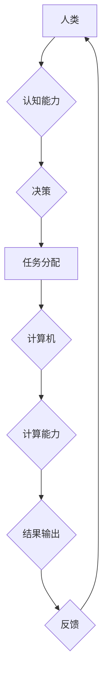

> 人类计算、计算模型、人工智能、深度学习、神经网络、算法、数据科学、未来趋势

## 1. 背景介绍

人类对计算的渴望源远流长，从古老的算盘到现代的超级计算机，我们一直在探索更有效、更智能的计算方式。随着信息技术的飞速发展，人类计算的概念逐渐从理论走向实践，并深刻地改变了我们生活、工作和思考的方式。

人类计算是指利用人类的认知能力和创造力，结合计算机技术，共同完成复杂的任务。它超越了传统计算机的局限性，将人类的智慧与机器的计算能力相结合，从而实现更强大的计算能力和更智能的决策。

## 2. 核心概念与联系

**2.1 人类计算的本质**

人类计算的核心在于将人类的认知能力和计算机的计算能力有机结合。人类擅长理解复杂的概念、进行抽象思考和解决非结构化问题，而计算机擅长处理大量数据、执行重复性任务和进行精确计算。

**2.2 人类计算的模式**

人类计算可以采用多种模式，例如：

* **协同计算:** 人类和计算机共同参与计算任务，人类提供创意和决策，计算机提供数据处理和计算能力。
* **增强计算:** 计算机辅助人类进行计算，例如使用人工智能技术辅助人类进行数据分析和决策。
* **混合计算:** 将不同类型的计算资源（例如云计算、边缘计算和本地计算）结合起来，实现更灵活和高效的计算。

**2.3 人类计算的架构**



**2.4 人类计算的优势**

* **更强的智能:** 人类计算能够结合人类的智慧和机器的计算能力，实现更强大的智能和更复杂的决策。
* **更灵活的适应性:** 人类能够根据实际情况灵活调整计算策略，适应不断变化的环境。
* **更可靠的安全性:** 人类能够对计算结果进行评估和判断，降低计算错误的风险。

## 3. 核心算法原理 & 具体操作步骤

**3.1 算法原理概述**

人类计算的核心算法通常基于人工智能技术，例如深度学习和神经网络。这些算法能够学习和模拟人类的认知过程，从而实现对复杂数据的理解和分析。

**3.2 算法步骤详解**

1. **数据收集和预处理:** 收集相关数据并进行清洗、转换和特征提取。
2. **模型构建:** 选择合适的算法模型，并根据数据特点进行参数调整。
3. **模型训练:** 使用训练数据训练模型，使其能够学习数据中的规律和模式。
4. **模型评估:** 使用测试数据评估模型的性能，并进行调整优化。
5. **模型部署:** 将训练好的模型部署到实际应用场景中，用于进行预测、分类或其他任务。

**3.3 算法优缺点**

* **优点:** 能够处理复杂数据、实现高精度预测、具有良好的泛化能力。
* **缺点:** 需要大量数据进行训练、训练时间较长、模型解释性较差。

**3.4 算法应用领域**

* **自然语言处理:** 语音识别、机器翻译、文本摘要等。
* **计算机视觉:** 图像识别、目标检测、图像分割等。
* **医疗诊断:** 病情预测、疾病诊断、药物研发等。
* **金融分析:** 风险评估、欺诈检测、投资决策等。

## 4. 数学模型和公式 & 详细讲解 & 举例说明

**4.1 数学模型构建**

人类计算的数学模型通常基于概率论、统计学和机器学习理论。例如，深度学习模型的训练过程可以看作是一个优化问题的求解过程，目标函数是模型的损失函数，优化算法是梯度下降法。

**4.2 公式推导过程**

例如，在神经网络中，激活函数的输出可以表示为：

$$
f(x) = \frac{1}{1 + e^{-x}}
$$

其中，x是神经元的输入值，f(x)是激活函数的输出值。

**4.3 案例分析与讲解**

例如，在图像识别任务中，可以使用卷积神经网络（CNN）模型进行图像分类。CNN模型通过卷积层和池化层提取图像特征，然后通过全连接层进行分类。

## 5. 项目实践：代码实例和详细解释说明

**5.1 开发环境搭建**

可以使用Python语言和相关的机器学习库（例如TensorFlow、PyTorch）进行人类计算项目的开发。

**5.2 源代码详细实现**

```python
import tensorflow as tf

# 定义模型结构
model = tf.keras.models.Sequential([
    tf.keras.layers.Conv2D(32, (3, 3), activation='relu', input_shape=(28, 28, 1)),
    tf.keras.layers.MaxPooling2D((2, 2)),
    tf.keras.layers.Conv2D(64, (3, 3), activation='relu'),
    tf.keras.layers.MaxPooling2D((2, 2)),
    tf.keras.layers.Flatten(),
    tf.keras.layers.Dense(10, activation='softmax')
])

# 编译模型
model.compile(optimizer='adam',
              loss='sparse_categorical_crossentropy',
              metrics=['accuracy'])

# 训练模型
model.fit(x_train, y_train, epochs=5)

# 评估模型
loss, accuracy = model.evaluate(x_test, y_test)
print('Test loss:', loss)
print('Test accuracy:', accuracy)
```

**5.3 代码解读与分析**

这段代码定义了一个简单的卷积神经网络模型，用于手写数字识别任务。模型包含卷积层、池化层和全连接层，用于提取图像特征和进行分类。

**5.4 运行结果展示**

训练完成后，模型可以用于预测新的手写数字图像。

## 6. 实际应用场景

**6.1 医疗诊断**

人类计算可以帮助医生更快、更准确地诊断疾病。例如，可以使用深度学习模型分析医学影像数据，辅助医生识别肿瘤、骨折和其他疾病。

**6.2 金融风险管理**

人类计算可以帮助金融机构识别和管理风险。例如，可以使用机器学习模型分析交易数据，识别欺诈行为和潜在的金融风险。

**6.3 个性化教育**

人类计算可以帮助提供个性化的教育体验。例如，可以使用人工智能系统根据学生的学习进度和需求，定制学习内容和教学方式。

**6.4 未来应用展望**

人类计算的应用场景还在不断扩展，未来将应用于更多领域，例如自动驾驶、机器人、科学研究等。

## 7. 工具和资源推荐

**7.1 学习资源推荐**

* **在线课程:** Coursera、edX、Udacity等平台提供丰富的机器学习和人工智能课程。
* **书籍:** 《深度学习》、《机器学习实战》等书籍是学习人工智能的基础教材。
* **开源项目:** TensorFlow、PyTorch等开源项目提供了丰富的代码示例和工具。

**7.2 开发工具推荐**

* **Python:** Python是机器学习和人工智能开发的常用语言。
* **TensorFlow:** TensorFlow是一个开源的机器学习框架。
* **PyTorch:** PyTorch是一个开源的深度学习框架。

**7.3 相关论文推荐**

* **《ImageNet Classification with Deep Convolutional Neural Networks》**
* **《Attention Is All You Need》**
* **《BERT: Pre-training of Deep Bidirectional Transformers for Language Understanding》**

## 8. 总结：未来发展趋势与挑战

**8.1 研究成果总结**

近年来，人类计算领域取得了显著进展，例如深度学习算法的突破、大规模数据量的积累、计算能力的提升等。这些进展推动了人工智能技术的快速发展，并为人类社会带来了诸多益处。

**8.2 未来发展趋势**

* **更强大的计算能力:** 随着硬件技术的进步，计算能力将继续提升，支持更复杂的计算任务。
* **更智能的算法:** 研究人员将继续开发更智能的算法，例如强化学习、迁移学习等，提高人工智能的智能水平。
* **更广泛的应用场景:** 人类计算将应用于更多领域，例如医疗、教育、金融、交通等，改变人们的生活方式。

**8.3 面临的挑战**

* **数据安全和隐私保护:** 人类计算需要处理大量数据，因此数据安全和隐私保护是一个重要的挑战。
* **算法可解释性和透明度:** 许多人工智能算法的决策过程难以理解，这可能会导致信任问题。
* **伦理和社会影响:** 人类计算的应用可能会带来伦理和社会问题，例如就业失业、算法偏见等，需要认真思考和解决。

**8.4 研究展望**

未来，人类计算研究将继续探索更智能、更安全、更可解释的人工智能技术，并致力于将人工智能技术应用于解决人类面临的重大挑战。

## 9. 附录：常见问题与解答

**9.1 什么是人类计算？**

人类计算是指利用人类的认知能力和计算机的计算能力，共同完成复杂任务的一种计算模式。

**9.2 人类计算有哪些优势？**

人类计算能够结合人类的智慧和机器的计算能力，实现更强大的智能、更灵活的适应性和更可靠的安全性。

**9.3 人类计算有哪些应用场景？**

人类计算的应用场景非常广泛，例如医疗诊断、金融风险管理、个性化教育等。

**9.4 人类计算面临哪些挑战？**

人类计算面临的数据安全和隐私保护、算法可解释性和透明度、伦理和社会影响等挑战。


作者：禅与计算机程序设计艺术 / Zen and the Art of Computer Programming 
<end_of_turn>