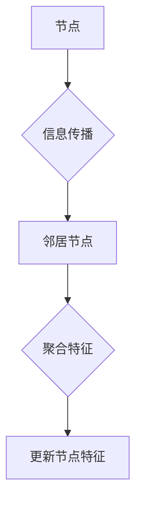

> 图神经网络，GNN，图数据，节点特征，边特征，卷积操作，图分类，图聚类，图预测

## 1. 背景介绍

随着数据类型的多样化，图数据作为一种重要的数据结构，在社交网络分析、推荐系统、知识图谱构建等领域得到了广泛应用。传统的机器学习算法难以有效处理图数据中的复杂关系和结构信息。为了解决这一问题，图神经网络 (Graph Neural Networks, GNN) 应运而生。

GNN 是一种专门用于处理图数据的深度学习模型，它能够学习图结构中的隐藏特征和关系，并将其用于各种图分析任务。与传统的深度学习模型不同，GNN 可以直接处理图结构，并利用图的邻接关系进行信息传播，从而更好地捕捉图数据的本质特征。

## 2. 核心概念与联系

图神经网络的核心概念包括：

* **图 (Graph):** 由节点 (Node) 和边 (Edge) 组成的数据结构。节点代表图中的实体，边代表实体之间的关系。
* **节点特征 (Node Feature):** 描述每个节点的属性信息，例如用户画像、商品属性等。
* **边特征 (Edge Feature):** 描述边之间的关系信息，例如用户之间的关系类型、商品之间的关联关系等。
* **信息传播 (Message Passing):** GNN 通过信息传播机制，将节点特征和边特征聚合起来，学习图结构中的隐藏特征。

**Mermaid 流程图:**



## 3. 核心算法原理 & 具体操作步骤

### 3.1  算法原理概述

GNN 的核心算法原理是基于信息传播的图卷积操作。图卷积操作将每个节点的特征信息与其邻居节点的特征信息进行聚合，从而学习节点的隐藏特征。

### 3.2  算法步骤详解

1. **初始化节点特征:** 为每个节点赋予初始特征向量。
2. **信息传播:** 每个节点将自己的特征信息传递给其邻居节点，并接收邻居节点的特征信息。
3. **特征聚合:** 每个节点将接收到的邻居节点特征信息进行聚合，得到更新后的特征向量。
4. **节点更新:** 使用聚合后的特征向量更新节点的特征信息。
5. **重复步骤 2-4:** 重复上述步骤多次，直到特征信息收敛。

### 3.3  算法优缺点

**优点:**

* 可以有效学习图结构中的隐藏特征和关系。
* 能够处理非结构化数据，例如社交网络、知识图谱等。
* 具有良好的泛化能力。

**缺点:**

* 计算复杂度较高，难以处理大型图数据。
* 训练过程需要大量的图数据。

### 3.4  算法应用领域

GNN 在以下领域具有广泛的应用前景:

* **社交网络分析:** 用户关系分析、社区发现、推荐系统等。
* **知识图谱构建:** 知识推理、关系抽取、实体链接等。
* **药物研发:** 药物分子结构分析、药物相互作用预测等。
* **自然语言处理:** 文本分类、关系抽取、文本生成等。

## 4. 数学模型和公式 & 详细讲解 & 举例说明

### 4.1  数学模型构建

GNN 的数学模型通常基于图卷积操作，其核心思想是将每个节点的特征信息与其邻居节点的特征信息进行聚合，从而学习节点的隐藏特征。

假设图 G = (V, E)，其中 V 是节点集合，E 是边集合。每个节点 v ∈ V 都有一个特征向量 x_v ∈ R^d，其中 d 是特征向量的维度。

### 4.2  公式推导过程

图卷积操作的数学公式如下:

$$
h_v^{(l+1)} = \sigma(\sum_{u \in N(v)} \frac{e_{uv}}{ \sqrt{d_u}} W^{(l)} h_u^{(l)} + b^{(l)})
$$

其中:

* h_v^{(l+1)} 是节点 v 在第 (l+1) 层的隐藏特征向量。
* h_u^{(l)} 是节点 u 在第 l 层的隐藏特征向量。
* N(v) 是节点 v 的邻居节点集合。
* e_{uv} 是节点 v 和 u 之间的边权重。
* d_u 是节点 u 的度数。
* W^{(l)} 是第 l 层的权重矩阵。
* b^{(l)} 是第 l 层的偏置向量。
* σ 是激活函数。

### 4.3  案例分析与讲解

假设我们有一个简单的图，其中有两个节点，每个节点都有一个特征向量。

* 节点 1 的特征向量为 [1, 2]。
* 节点 2 的特征向量为 [3, 4]。

节点 1 和节点 2 之间有一条边，边权重为 1。

使用上述公式计算节点 1 在第一层后的隐藏特征向量:

$$
h_1^{(1)} = \sigma(\frac{1}{\sqrt{1}} W^{(0)} [3, 4] + b^{(0)})
$$

其中 W^{(0)} 和 b^{(0)} 是第一层的权重矩阵和偏置向量。

通过计算，我们可以得到节点 1 在第一层后的隐藏特征向量。

## 5. 项目实践：代码实例和详细解释说明

### 5.1  开发环境搭建

* Python 3.6+
* PyTorch 1.0+
* 其他依赖库：numpy, matplotlib等

### 5.2  源代码详细实现

```python
import torch
import torch.nn as nn

class GCNLayer(nn.Module):
    def __init__(self, in_features, out_features):
        super(GCNLayer, self).__init__()
        self.linear = nn.Linear(in_features, out_features)

    def forward(self, x, adj):
        # 图卷积操作
        x = torch.matmul(adj, x)
        x = self.linear(x)
        return x

# 定义 GNN 模型
class GNN(nn.Module):
    def __init__(self, in_features, hidden_features, out_features):
        super(GNN, self).__init__()
        self.layer1 = GCNLayer(in_features, hidden_features)
        self.layer2 = GCNLayer(hidden_features, out_features)

    def forward(self, x, adj):
        x = self.layer1(x, adj)
        x = self.layer2(x, adj)
        return x

# 示例代码
# 假设输入特征 x 和邻接矩阵 adj
x = torch.randn(10, 5)  # 10 个节点，每个节点 5 个特征
adj = torch.randn(10, 10)  # 邻接矩阵

# 创建 GNN 模型
model = GNN(5, 10, 2)

# 前向传播
output = model(x, adj)

print(output.shape)  # 输出: torch.Size([10, 2])
```

### 5.3  代码解读与分析

* `GCNLayer` 类定义了图卷积操作，它接收节点特征向量 `x` 和邻接矩阵 `adj` 作为输入，并使用线性变换和激活函数进行特征聚合。
* `GNN` 类定义了多层图卷积网络，它包含多个 `GCNLayer` 层，用于学习图结构中的隐藏特征。
* 示例代码演示了如何创建 GNN 模型、进行前向传播，并输出模型的输出结果。

### 5.4  运行结果展示

运行上述代码后，会输出模型的输出结果，其形状为 `torch.Size([10, 2])`，表示每个节点的隐藏特征向量维度为 2。

## 6. 实际应用场景

### 6.1  社交网络分析

GNN 可以用于分析社交网络中的用户关系，例如发现社区结构、预测用户行为、推荐好友等。

### 6.2  推荐系统

GNN 可以学习用户和商品之间的关系，并用于推荐系统中，例如推荐用户可能感兴趣的商品、推荐用户可能认识的朋友等。

### 6.3  知识图谱构建

GNN 可以用于构建知识图谱，例如抽取实体关系、推理知识等。

### 6.4  未来应用展望

GNN 在未来将有更广泛的应用前景，例如药物研发、金融风险评估、交通流量预测等。

## 7. 工具和资源推荐

### 7.1  学习资源推荐

* **书籍:**
    * 《图神经网络》
    * 《深度学习》
* **在线课程:**
    * Coursera: Graph Neural Networks
    * Udacity: Deep Learning Nanodegree

### 7.2  开发工具推荐

* **PyTorch Geometric:** 一个用于图神经网络的 Python 库。
* **DGL:** 另一个用于图神经网络的 Python 库。

### 7.3  相关论文推荐

* 《Semi-Supervised Classification with Graph Convolutional Networks》
* 《Graph Attention Networks》
* 《Inductive Representation Learning on Large Graphs》

## 8. 总结：未来发展趋势与挑战

### 8.1  研究成果总结

GNN 在图数据分析领域取得了显著的成果，例如在图分类、图聚类、图预测等任务上取得了优异的性能。

### 8.2  未来发展趋势

* **模型效率:** 提高 GNN 模型的效率，使其能够处理更大的图数据。
* **可解释性:** 提高 GNN 模型的可解释性，使其能够更好地解释其决策过程。
* **应用领域:** 将 GNN 应用到更多领域，例如药物研发、金融风险评估等。

### 8.3  面临的挑战

* **数据稀疏性:** 图数据通常是稀疏的，这使得 GNN 模型的训练更加困难。
* **计算复杂度:** GNN 模型的计算复杂度较高，难以处理大型图数据。
* **可解释性:** GNN 模型的决策过程难以解释，这限制了其在一些应用场景中的应用。

### 8.4  研究展望

未来，GNN 研究将继续朝着提高模型效率、可解释性和应用领域的方向发展。


## 9. 附录：常见问题与解答

### 9.1  Q1: GNN 与传统机器学习算法有什么区别？

**A1:** GNN 能够直接处理图数据，并利用图的邻接关系进行信息传播，从而更好地捕捉图数据的本质特征。而传统机器学习算法难以有效处理图数据中的复杂关系和结构信息。

### 9.2  Q2: GNN 的训练过程需要哪些数据？

**A2:** GNN 的训练过程需要图数据，包括节点特征、边特征和图结构信息。

### 9.3  Q3: GNN 的应用领域有哪些？

**A3:** GNN 在社交网络分析、推荐系统、知识图谱构建、药物研发等领域具有广泛的应用前景。


作者：禅与计算机程序设计艺术 / Zen and the Art of Computer Programming 
<end_of_turn>