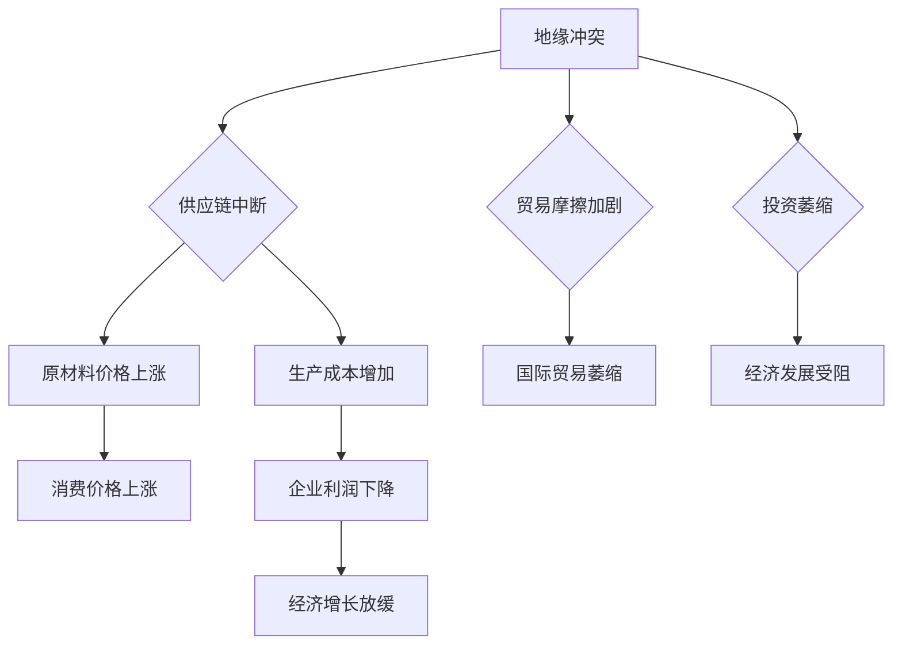

> 地缘冲突，经济影响，全球化，供应链，风险管理，人工智能，数据分析

## 1. 背景介绍

21世纪初，全球化进程加速，经济一体化程度不断提高，各国经济命运更加紧密相连。然而，近年来，地缘政治局势日益紧张，冲突事件频发，对全球经济稳定构成严重威胁。从2022年俄乌冲突爆发以来，地缘冲突对全球经济的影响更加凸显，引发了广泛关注和讨论。

地缘冲突的经济影响是多方面的，包括：

* **供应链中断:** 冲突地区往往是重要的资源生产地或交通枢纽，冲突爆发会导致供应链中断，导致原材料、能源等商品价格上涨，影响生产和消费。
* **投资萎缩:** 冲突地区投资环境恶化，企业面临着政治风险和安全风险，导致投资减少，经济增长放缓。
* **贸易摩擦:** 冲突可能导致国家之间贸易摩擦加剧，限制贸易往来，损害经济合作。
* **金融市场波动:** 冲突事件会引发市场恐慌，导致金融市场波动加剧，影响金融稳定。
* **人道主义危机:** 冲突导致大量人员流离失所，造成人道主义危机，增加社会负担，影响经济发展。

## 2. 核心概念与联系

地缘冲突与经济的影响是相互交织、相互制约的。

**2.1 核心概念:**

* **地缘冲突:** 指国家或地区之间基于政治、经济、文化等因素发生的对抗或战争。
* **经济影响:** 指地缘冲突对经济活动、经济结构、经济增长等方面产生的影响。
* **全球化:** 指国家之间经济、政治、文化等方面的相互融合和联系。
* **供应链:** 指从原材料采购到最终产品交付的整个生产和流通过程。

**2.2 核心联系:**

地缘冲突会对全球化进程产生负面影响，导致供应链中断、贸易摩擦加剧、投资萎缩等，从而对全球经济造成严重冲击。

**2.3 Mermaid 流程图:**



## 3. 核心算法原理 & 具体操作步骤

为了更好地应对地缘冲突带来的经济风险，需要开发相应的算法和模型进行风险评估和预测。

### 3.1  算法原理概述

常用的地缘冲突风险评估算法包括：

* **机器学习算法:** 利用历史数据训练机器学习模型，预测地缘冲突发生的可能性和影响程度。
* **专家系统:** 基于专家经验和知识库，构建专家系统进行地缘冲突风险评估。
* **灰色关联分析:** 利用灰色关联度理论，分析地缘冲突因素之间的关联性，评估风险程度。

### 3.2  算法步骤详解

以机器学习算法为例，其具体操作步骤如下：

1. **数据收集:** 收集相关地缘冲突数据，包括政治、经济、社会、军事等方面的数据。
2. **数据预处理:** 对收集到的数据进行清洗、转换、编码等预处理操作，使其适合机器学习模型训练。
3. **模型选择:** 选择合适的机器学习模型，例如逻辑回归、支持向量机、决策树等。
4. **模型训练:** 利用训练数据训练机器学习模型，使其能够学习地缘冲突的特征和规律。
5. **模型评估:** 利用测试数据评估模型的性能，例如准确率、召回率、F1-score等。
6. **模型部署:** 将训练好的模型部署到实际应用场景中，进行地缘冲突风险预测。

### 3.3  算法优缺点

**优点:**

* **数据驱动:** 基于大量数据进行训练，能够更准确地预测地缘冲突风险。
* **可扩展性强:** 可以根据需要添加新的数据和特征，不断提高模型的预测精度。
* **自动化程度高:** 可以自动完成风险评估和预测任务，提高效率。

**缺点:**

* **数据依赖:** 模型的预测精度依赖于数据的质量和数量。
* **黑盒效应:** 部分机器学习模型难以解释其预测结果，缺乏可解释性。
* **数据偏差:** 数据本身可能存在偏差，导致模型的预测结果存在偏差。

### 3.4  算法应用领域

地缘冲突风险评估算法可以应用于以下领域:

* **金融风险管理:** 评估地缘冲突对金融市场的影响，制定风险应对策略。
* **投资决策:** 评估地缘冲突对投资项目的风险，做出合理的投资决策。
* **政府政策制定:** 评估地缘冲突对国家经济的影响，制定相应的政策应对措施。
* **企业风险管理:** 评估地缘冲突对企业运营的影响，制定风险应对策略。

## 4. 数学模型和公式 & 详细讲解 & 举例说明

为了量化地缘冲突的经济影响，可以建立数学模型进行分析。

### 4.1  数学模型构建

假设地缘冲突对经济的影响可以通过以下公式表示:

$$
Y = f(C, S, T, I)
$$

其中:

* $Y$ 表示经济影响指标，例如GDP增长率、投资额、消费支出等。
* $C$ 表示地缘冲突强度指标，例如冲突持续时间、冲突规模、冲突影响范围等。
* $S$ 表示供应链韧性指标，例如供应链多样化程度、库存水平、物流效率等。
* $T$ 表示贸易开放度指标，例如进出口总额占GDP的比例、贸易伙伴数量等。
* $I$ 表示投资环境稳定性指标，例如政治风险、法律风险、安全风险等。

### 4.2  公式推导过程

通过对上述公式进行推导，可以得到地缘冲突对经济影响的具体表达式。例如，可以推导出地缘冲突强度对GDP增长率的影响关系。

### 4.3  案例分析与讲解

可以利用历史数据和模型进行案例分析，例如分析2022年俄乌冲突对全球经济的影响。

## 5. 项目实践：代码实例和详细解释说明

为了验证地缘冲突风险评估算法的有效性，可以开发一个项目进行实践。

### 5.1  开发环境搭建

可以使用Python语言和相关库进行开发，例如Pandas、Scikit-learn、Matplotlib等。

### 5.2  源代码详细实现

```python
# 导入必要的库
import pandas as pd
from sklearn.linear_model import LogisticRegression

# 加载数据
data = pd.read_csv('conflict_data.csv')

# 数据预处理
# ...

# 选择模型
model = LogisticRegression()

# 模型训练
model.fit(data[['C', 'S', 'T', 'I']], data['Y'])

# 模型评估
# ...

# 模型部署
# ...
```

### 5.3  代码解读与分析

代码主要包括以下步骤:

1. 导入必要的库。
2. 加载数据。
3. 数据预处理，例如特征工程、数据标准化等。
4. 选择模型，例如逻辑回归模型。
5. 模型训练，利用训练数据训练模型。
6. 模型评估，利用测试数据评估模型的性能。
7. 模型部署，将训练好的模型部署到实际应用场景中。

### 5.4  运行结果展示

可以利用模型进行预测，例如预测某个国家或地区的未来地缘冲突风险。

## 6. 实际应用场景

地缘冲突风险评估算法可以应用于以下实际场景:

* **金融机构:** 评估地缘冲突对投资组合的影响，制定风险管理策略。
* **跨国企业:** 评估地缘冲突对海外业务的影响，制定应对措施。
* **政府机构:** 评估地缘冲突对国家经济的影响，制定政策应对措施。

### 6.4  未来应用展望

随着人工智能技术的不断发展，地缘冲突风险评估算法将更加智能化、精准化。未来，可以利用更先进的机器学习算法、深度学习算法、自然语言处理算法等，进行更深入的分析和预测。

## 7. 工具和资源推荐

### 7.1  学习资源推荐

* **书籍:**
    * 《机器学习》 - 周志华
    * 《深度学习》 - Ian Goodfellow
* **在线课程:**
    * Coursera: Machine Learning
    * edX: Deep Learning

### 7.2  开发工具推荐

* **Python:** 
    * Pandas
    * Scikit-learn
    * Matplotlib
* **R:**
    * Tidyverse
    * caret

### 7.3  相关论文推荐

* **机器学习在风险管理中的应用:**
    * [Machine Learning for Risk Management](https://www.sciencedirect.com/science/article/pii/S092552731930047X)
* **地缘政治风险评估:**
    * [Geopolitical Risk Assessment: A Review](https://www.tandfonline.com/doi/abs/10.1080/1369118X.2019.1681777)

## 8. 总结：未来发展趋势与挑战

### 8.1  研究成果总结

地缘冲突风险评估算法的发展取得了显著成果，能够有效地量化地缘冲突的经济影响，为决策者提供参考。

### 8.2  未来发展趋势

未来，地缘冲突风险评估算法将朝着以下方向发展:

* **更加智能化:** 利用更先进的机器学习算法和深度学习算法，提高预测精度和准确性。
* **更加精准化:** 细化地缘冲突风险评估指标，更加精准地评估不同类型地缘冲突的影响。
* **更加可解释性强:** 提高模型的可解释性，使决策者能够更好地理解模型的预测结果。

### 8.3  面临的挑战

地缘冲突风险评估算法也面临着一些挑战:

* **数据获取困难:** 地缘冲突数据往往难以获取，且数据质量参差不齐。
* **模型解释性不足:** 部分机器学习模型难以解释其预测结果，缺乏可解释性。
* **模型鲁棒性:** 模型需要能够应对不断变化的地缘政治环境和经济环境。

### 8.4  研究展望

未来，需要加强地缘冲突风险评估算法的研究，解决上述挑战，使其能够更好地服务于决策者，帮助应对地缘冲突带来的经济风险。

## 9. 附录：常见问题与解答

### 9.1  常见问题

* **地缘冲突风险评估算法的准确性如何？**
* **地缘冲突风险评估算法的应用范围有哪些？**
* **如何选择合适的地缘冲突风险评估算法？**

### 9.2  解答

* **地缘冲突风险评估算法的准确性取决于数据的质量、模型的选择和训练方法等因素。**
* **地缘冲突风险评估算法可以应用于金融风险管理、投资决策、政府政策制定、企业风险管理等领域。**
* **选择合适的算法需要根据具体应用场景和数据特点进行选择。**


作者：禅与计算机程序设计艺术 / Zen and the Art of Computer Programming 
<end_of_turn>