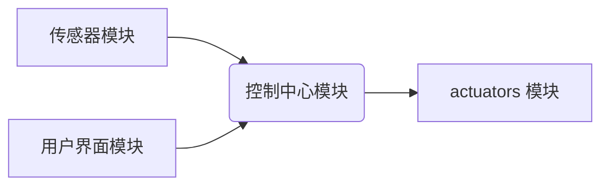

> 智能家居, Java, 面向对象, 设计模式, IoT,  物联网,  嵌入式系统

## 1. 背景介绍

智能家居已成为现代生活的重要组成部分，它通过将各种智能设备连接到网络，实现对家居环境的自动化控制和智能化管理。随着物联网技术的快速发展和智能设备的普及，智能家居市场呈现出爆发式增长趋势。

传统的智能家居系统往往存在以下问题：

* **系统架构复杂:**  多个智能设备之间缺乏统一的接口和协议，导致系统集成困难。
* **功能单一:**  大多数智能家居系统仅提供简单的控制功能，缺乏个性化定制和智能化服务。
* **安全性不足:**  智能家居系统的数据安全和隐私保护问题日益突出。

为了解决这些问题，本文将基于Java语言，采用面向对象的设计思想和设计模式，构建一个安全、可靠、功能丰富的智能家居系统。

## 2. 核心概念与联系

### 2.1 智能家居系统架构

智能家居系统通常由以下几个主要模块组成：

* **传感器模块:**  负责采集家居环境信息，例如温度、湿度、光照、气压等。
* ** actuators 模块:**  负责执行控制指令，例如控制灯光、空调、窗帘等设备。
* **控制中心模块:**  负责接收传感器数据，分析数据，并根据预设规则或用户指令发出控制指令。
* **用户界面模块:**  提供用户与智能家居系统交互的界面，例如手机APP、语音助手等。

### 2.2 面向对象设计

面向对象设计是一种软件开发方法，它将软件系统分解成一系列相互交互的对象，每个对象都具有自己的数据和行为。面向对象设计的主要特点包括：

* **封装:**  将数据和行为隐藏在对象内部，对外只提供接口。
* **继承:**  允许创建新的对象，继承父对象的属性和行为。
* **多态:**  同一个方法在不同对象上可以表现出不同的行为。

### 2.3 设计模式

设计模式是一种解决软件设计问题的通用解决方案，它提供了一种可重用的模板，可以帮助开发人员提高代码的复用性、可维护性和可扩展性。

**常用的智能家居系统设计模式包括：**

* **观察者模式:**  用于实现传感器和控制中心之间的通信，当传感器数据发生变化时，控制中心会收到通知并做出相应的处理。
* **策略模式:**  用于实现不同的控制策略，例如定时控制、场景控制、语音控制等。
* **命令模式:**  用于将控制指令封装成对象，方便控制中心管理和执行指令。

**智能家居系统架构图:**



## 3. 核心算法原理 & 具体操作步骤

### 3.1  算法原理概述

智能家居系统中，需要使用各种算法来实现智能化控制和数据分析。例如：

* **预测算法:**  根据历史数据预测未来家居环境的变化，例如温度、湿度等。
* **分类算法:**  根据传感器数据识别用户的行为模式，例如起床、睡觉、烹饪等。
* **聚类算法:**  将用户行为数据进行聚类，识别用户不同的生活习惯。

### 3.2  算法步骤详解

以预测算法为例，其具体步骤如下：

1. **数据采集:**  收集历史家居环境数据，例如温度、湿度、光照等。
2. **数据预处理:**  对采集到的数据进行清洗、转换和特征提取。
3. **模型训练:**  选择合适的预测算法模型，例如线性回归、决策树、神经网络等，并使用训练数据进行模型训练。
4. **模型评估:**  使用测试数据评估模型的预测精度。
5. **模型部署:**  将训练好的模型部署到智能家居系统中，用于预测未来家居环境的变化。

### 3.3  算法优缺点

不同的预测算法具有不同的优缺点，需要根据实际应用场景选择合适的算法。例如：

* **线性回归:**  简单易实现，但对非线性关系的拟合能力较差。
* **决策树:**  能够处理非线性关系，但容易过拟合。
* **神经网络:**  能够处理复杂非线性关系，但训练时间长，参数较多。

### 3.4  算法应用领域

预测算法在智能家居系统中具有广泛的应用领域，例如：

* **智能温度控制:**  根据用户习惯和天气预报预测未来温度变化，自动调节空调温度。
* **智能照明控制:**  根据光照强度和用户活动预测未来照明需求，自动调节灯光亮度。
* **智能能源管理:**  根据用电模式和能源价格预测未来用电量，优化能源使用。

## 4. 数学模型和公式 & 详细讲解 & 举例说明

### 4.1  数学模型构建

智能家居系统中，可以使用数学模型来描述家居环境的变化和用户行为模式。例如：

* **温度模型:**  可以使用热传导方程来描述家居环境的温度变化。
* **湿度模型:**  可以使用湿气扩散方程来描述家居环境的湿度变化。
* **用户行为模型:**  可以使用马尔科夫链来描述用户的行为模式。

### 4.2  公式推导过程

以温度模型为例，热传导方程的数学形式如下：

$$
\frac{\partial T}{\partial t} = \alpha \nabla^2 T + Q
$$

其中：

* $T$ 是温度
* $t$ 是时间
* $\alpha$ 是热扩散系数
* $\nabla^2$ 是拉普拉斯算符
* $Q$ 是热源强度

### 4.3  案例分析与讲解

假设一个房间的初始温度为 $20^\circ C$，房间的热扩散系数为 $0.001 m^2/s$，房间内没有热源，则根据热传导方程，房间温度随时间的变化可以表示为：

$$
T(x,y,z,t) = 20^\circ C + \sum_{n=1}^{\infty} A_n \sin(\frac{n\pi x}{L}) \sin(\frac{m\pi y}{W}) \sin(\frac{p\pi z}{H}) e^{-\alpha (n^2\pi^2/L^2 + m^2\pi^2/W^2 + p^2\pi^2/H^2)t}
$$

其中：

* $x$, $y$, $z$ 是房间的坐标
* $L$, $W$, $H$ 是房间的长、宽、高
* $A_n$, $m$, $p$ 是待定系数

通过求解上述方程，可以得到房间温度随时间的变化曲线。

## 5. 项目实践：代码实例和详细解释说明

### 5.1  开发环境搭建

* **操作系统:**  Windows/Linux/macOS
* **JDK:**  Java Development Kit 1.8 或更高版本
* **IDE:**  Eclipse/IntelliJ IDEA/NetBeans

### 5.2  源代码详细实现

```java
// SensorData.java
public class SensorData {
    private String sensorId;
    private String dataValue;

    // 构造函数、getter和setter方法
}

// ControlCenter.java
public class ControlCenter {
    private List<SensorData> sensorDataList;

    public ControlCenter() {
        sensorDataList = new ArrayList<>();
    }

    public void addSensorData(SensorData sensorData) {
        sensorDataList.add(sensorData);
    }

    public void processSensorData() {
        // 处理传感器数据，例如触发控制指令
    }
}

// Actuator.java
public class Actuator {
    private String actuatorId;

    public Actuator(String actuatorId) {
        this.actuatorId = actuatorId;
    }

    public void executeCommand(String command) {
        // 执行控制指令，例如控制灯光、空调等
    }
}
```

### 5.3  代码解读与分析

* **SensorData 类:**  用于存储传感器数据，包括传感器ID和数据值。
* **ControlCenter 类:**  负责接收传感器数据，分析数据，并发出控制指令。
* **Actuator 类:**  负责执行控制指令，例如控制灯光、空调等。

### 5.4  运行结果展示

运行上述代码，可以实现以下功能：

* 模拟传感器采集数据并发送到控制中心。
* 控制中心分析传感器数据，并根据预设规则发出控制指令。
* 执行器执行控制指令，例如控制灯光亮度。

## 6. 实际应用场景

### 6.1 智能家居场景

* **智能照明:**  根据用户活动和光照条件自动调节灯光亮度，实现节能和舒适照明。
* **智能空调:**  根据用户习惯和环境温度自动调节空调温度，实现舒适和节能。
* **智能安防:**  利用传感器和摄像头实现家居安全监控，报警和远程控制。

### 6.2 其他应用场景

* **智慧城市:**  利用智能家居技术构建智慧城市，例如智能交通、智能停车、智能垃圾分类等。
* **医疗保健:**  利用智能家居技术实现远程医疗、健康监测和康复训练。
* **工业自动化:**  利用智能家居技术实现工业设备的远程监控和控制。

### 6.4  未来应用展望

随着物联网技术的不断发展，智能家居系统将更加智能化、个性化和安全化。未来，智能家居系统将更加深入地融入人们的生活，为人们提供更加便捷、舒适和安全的居住环境。

## 7. 工具和资源推荐

### 7.1  学习资源推荐

* **书籍:**  《智能家居系统设计与实现》
* **在线课程:**  Coursera、edX、Udemy 等平台上的智能家居相关课程
* **技术博客:**  IEEE Spectrum、TechCrunch、Engadget 等技术博客

### 7.2  开发工具推荐

* **IDE:**  Eclipse、IntelliJ IDEA、NetBeans
* **物联网平台:**  阿里云物联网平台、腾讯云物联网平台、华为云物联网平台
* **传感器和 actuators:**  Arduino、Raspberry Pi、ESP32 等

### 7.3  相关论文推荐

* **论文:**  "A Survey of Smart Home Technologies and Applications"
* **论文:**  "Security and Privacy Challenges in Smart Homes"

## 8. 总结：未来发展趋势与挑战

### 8.1  研究成果总结

本文介绍了基于Java语言的智能家居系统设计，并探讨了核心概念、算法原理、代码实现和实际应用场景。

### 8.2  未来发展趋势

* **人工智能:**  将人工智能技术应用于智能家居系统，实现更加智能化和个性化的控制。
* **边缘计算:**  将计算能力部署到智能家居设备边缘，实现更加实时和高效的控制。
* **安全性和隐私保护:**  加强智能家居系统的安全性和隐私保护，保障用户数据安全。

### 8.3  面临的挑战

* **系统复杂性:**  智能家居系统涉及多个领域和技术，系统设计和开发难度较大。
* **数据安全:**  智能家居系统收集大量用户数据，数据安全和隐私保护是一个重要挑战。
* **标准化问题:**  智能家居系统缺乏统一的标准和协议，导致设备互联互通性差。

### 8.4  研究展望

未来，智能家居系统将朝着更加智能化、安全化、个性化和生态化的方向发展。研究人员将继续探索新的技术和应用场景，为人们提供更加便捷、舒适和安全的居住环境。

## 9. 附录：常见问题与解答

### 9.1  常见问题

* **如何选择合适的智能家居设备？**
* **如何实现智能家居系统的安全性和隐私保护？**
* **如何解决智能家居系统设备互联互通性问题？**

### 9.2  解答

* **如何选择合适的智能家居设备？**  选择智能