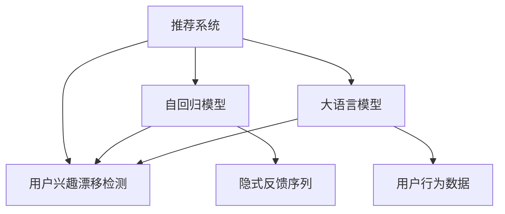

                 

# 基于LLM的推荐系统用户兴趣漂移检测

> 关键词：大语言模型,推荐系统,用户兴趣漂移检测,LLM,自回归模型

## 1. 背景介绍

### 1.1 问题由来

在推荐系统中，用户的兴趣和行为模式是动态变化的。例如，用户可能因为时间、地点、情绪、社交关系等因素，逐渐改变对某一类内容的喜好。这种兴趣的逐渐变化被称为用户兴趣漂移。用户兴趣漂移是推荐系统面临的重大挑战之一，因为如果不能及时发现并调整推荐策略，就会导致用户流失和推荐效果下降。

推荐系统主要分为两种类型：基于内容的推荐和协同过滤推荐。基于内容的推荐依赖于物品的属性特征，但这些特征是静态的，无法捕捉用户兴趣的动态变化。协同过滤推荐则依赖于用户行为数据，但用户行为数据可能存在稀疏性，且难以捕捉长时间跨度的兴趣变化。因此，如何高效且准确地检测用户兴趣漂移，是一个亟待解决的问题。

### 1.2 问题核心关键点

为了解决用户兴趣漂移问题，我们提出基于大语言模型(LLM)的推荐系统用户兴趣漂移检测方法。具体思路如下：
- 收集用户的长期行为数据，构建用户的隐式反馈序列。
- 使用自回归模型对隐式反馈序列进行建模，捕捉用户兴趣随时间的变化。
- 利用LLM对用户兴趣漂移进行检测，及时调整推荐策略。

## 2. 核心概念与联系

### 2.1 核心概念概述

为更好地理解本文提出的基于LLM的用户兴趣漂移检测方法，本节将介绍几个密切相关的核心概念：

- 推荐系统：根据用户的历史行为和偏好，推荐个性化的内容。推荐系统在电商、社交、视频等领域广泛应用。

- 用户兴趣漂移：用户兴趣随时间变化的动态过程，导致用户的长期行为模式发生变化。

- 大语言模型(LLM)：一类以自回归结构为代表的深度学习模型，具备强大的自然语言处理和生成能力。

- 自回归模型：一类依赖于先前时间步输出作为当前时间步输入的模型，用于捕捉序列数据的动态变化。

- 隐式反馈：用户在推荐系统上的长期行为数据，包括浏览、点击、购买等。

- 显式反馈：用户通过评分、评论等形式明确表达的对物品的评价，用于验证推荐结果的准确性。

这些核心概念之间的逻辑关系可以通过以下Mermaid流程图来展示：



这个流程图展示了大语言模型在推荐系统中的应用场景，具体如下：

1. 推荐系统以用户的长期行为数据为输入，生成推荐结果。
2. 使用自回归模型对用户的隐式反馈序列进行建模，捕捉用户兴趣随时间的变化。
3. 利用大语言模型对用户兴趣漂移进行检测，及时调整推荐策略。

## 3. 核心算法原理 & 具体操作步骤
### 3.1 算法原理概述

基于LLM的推荐系统用户兴趣漂移检测方法，本质上是一个动态序列建模和分类问题。其核心思想是：使用自回归模型捕捉用户隐式反馈序列的动态变化，利用LLM对用户兴趣漂移进行分类，并根据分类结果调整推荐策略。

具体来说，该方法的步骤如下：

1. 收集用户的长期行为数据，构建用户的隐式反馈序列。
2. 使用自回归模型对隐式反馈序列进行建模，捕捉用户兴趣随时间的变化。
3. 利用LLM对用户兴趣漂移进行分类，分为兴趣未漂移和兴趣漂移两类。
4. 根据分类结果，动态调整推荐策略，针对兴趣未漂移用户进行常规推荐，针对兴趣漂移用户进行重新推荐。

### 3.2 算法步骤详解

#### 3.2.1 数据预处理

数据预处理是推荐系统用户兴趣漂移检测的第一步。具体步骤如下：

1. 收集用户的长期行为数据，包括浏览、点击、购买等。将这些数据记录为用户隐式反馈序列，即用户对不同物品的访问序列。
2. 对隐式反馈序列进行归一化处理，确保所有时间步的特征值在相同的范围内。
3. 将用户隐式反馈序列划分为多个时间窗口，每个窗口内使用自回归模型建模用户兴趣变化。

#### 3.2.2 自回归模型建模

自回归模型是一种依赖于先前时间步输出作为当前时间步输入的模型，用于捕捉序列数据的动态变化。本文使用自回归模型对用户隐式反馈序列进行建模，具体步骤如下：

1. 使用自回归模型，如LSTM、GRU等，对用户隐式反馈序列进行建模，捕捉用户兴趣随时间的变化。
2. 通过训练自回归模型，得到用户隐式反馈序列在每个时间步的条件概率分布。
3. 使用条件概率分布对每个时间步的用户隐式反馈进行建模，捕捉用户兴趣随时间的变化。

#### 3.2.3 LLM兴趣漂移检测

利用大语言模型对用户兴趣漂移进行检测，具体步骤如下：

1. 对每个时间步的用户隐式反馈序列进行编码，得到用户兴趣向量。
2. 使用LLM对用户兴趣向量进行分类，预测用户兴趣是否发生了变化。
3. 根据分类结果，动态调整推荐策略，针对兴趣未漂移用户进行常规推荐，针对兴趣漂移用户进行重新推荐。

### 3.3 算法优缺点

基于LLM的推荐系统用户兴趣漂移检测方法，具有以下优点：

1. 自回归模型能够捕捉用户隐式反馈序列的动态变化，更准确地预测用户兴趣。
2. LLM具备强大的自然语言处理能力，能够对用户兴趣变化进行高效检测。
3. 动态调整推荐策略，提高推荐的个性化和时效性。

同时，该方法也存在以下局限性：

1. 数据依赖性强。需要收集用户的长期行为数据，才能进行兴趣漂移检测。
2. 计算复杂度高。自回归模型和LLM的计算复杂度较高，需要强大的计算资源支持。
3. 模型解释性差。LLM的内部机制较为复杂，难以解释其决策过程。
4. 鲁棒性不足。自回归模型和LLM对噪声和异常数据敏感，可能导致误检测。

尽管存在这些局限性，但该方法在大规模推荐系统中的应用，已经显示出显著的效果提升和实际价值。

### 3.4 算法应用领域

基于LLM的推荐系统用户兴趣漂移检测方法，主要应用于以下领域：

1. 电商推荐：利用用户购物记录构建隐式反馈序列，及时调整商品推荐策略。
2. 内容推荐：利用用户阅读、观看行为构建隐式反馈序列，提高内容推荐的效果。
3. 社交推荐：利用用户社交行为构建隐式反馈序列，优化好友推荐和兴趣话题推荐。
4. 视频推荐：利用用户观看历史构建隐式反馈序列，提高视频推荐的准确性。

## 4. 数学模型和公式 & 详细讲解 & 举例说明

### 4.1 数学模型构建

本节将使用数学语言对推荐系统用户兴趣漂移检测方法进行更加严格的刻画。

记用户隐式反馈序列为 $X=\{x_t\}_{t=1}^T$，其中 $x_t$ 表示时间步 $t$ 的用户行为，如浏览、点击、购买等。设用户兴趣向量为 $H_t = f(X_t)$，其中 $f$ 为自回归模型，用于捕捉用户兴趣随时间的变化。

利用大语言模型对用户兴趣向量进行分类，设分类结果为 $Y_t \in \{0,1\}$，其中 $Y_t=1$ 表示用户兴趣发生了变化，$Y_t=0$ 表示用户兴趣未发生变化。

### 4.2 公式推导过程

假设用户兴趣向量 $H_t$ 为自回归模型 $f$ 的输出，即 $H_t=f(X_t)$，其中 $f$ 为自回归模型。设 $H_t$ 的线性映射为 $U_t = AH_t + B$，其中 $A$ 和 $B$ 为矩阵。

假设使用大语言模型对用户兴趣向量 $H_t$ 进行分类，分类结果为 $Y_t$，其中 $Y_t=1$ 表示用户兴趣发生了变化，$Y_t=0$ 表示用户兴趣未发生变化。设分类器的损失函数为 $\mathcal{L}$，用于衡量分类结果与真实标签之间的差异。

基于以上定义，推荐系统用户兴趣漂移检测的优化目标为：

$$
\min_{\theta} \mathcal{L}(Y_t,U_t^{\theta})
$$

其中 $\theta$ 为分类器参数。

### 4.3 案例分析与讲解

为了更好地理解基于LLM的推荐系统用户兴趣漂移检测方法，我们以电商推荐为例，具体讲解其应用过程。

假设用户 A 在电商平台上的长期浏览记录为 $X=\{x_t\}_{t=1}^T$，其中 $x_t$ 表示时间步 $t$ 的用户浏览行为，如浏览商品、加入购物车等。使用自回归模型 $f$ 对用户隐式反馈序列进行建模，得到用户兴趣向量 $H_t = f(X_t)$。

使用LLM对用户兴趣向量 $H_t$ 进行分类，预测用户兴趣是否发生了变化。如果 $Y_t=1$，则表示用户兴趣发生了变化。根据分类结果，动态调整推荐策略，针对兴趣未漂移用户进行常规推荐，针对兴趣漂移用户进行重新推荐。

## 5. 项目实践：代码实例和详细解释说明
### 5.1 开发环境搭建

在进行推荐系统用户兴趣漂移检测的实践前，我们需要准备好开发环境。以下是使用Python进行PyTorch开发的环境配置流程：

1. 安装Anaconda：从官网下载并安装Anaconda，用于创建独立的Python环境。

2. 创建并激活虚拟环境：
```bash
conda create -n pytorch-env python=3.8 
conda activate pytorch-env
```

3. 安装PyTorch：根据CUDA版本，从官网获取对应的安装命令。例如：
```bash
conda install pytorch torchvision torchaudio cudatoolkit=11.1 -c pytorch -c conda-forge
```

4. 安装Transformers库：
```bash
pip install transformers
```

5. 安装各类工具包：
```bash
pip install numpy pandas scikit-learn matplotlib tqdm jupyter notebook ipython
```

完成上述步骤后，即可在`pytorch-env`环境中开始推荐系统用户兴趣漂移检测的实践。

### 5.2 源代码详细实现

我们以电商推荐为例，给出使用Transformers库进行用户兴趣漂移检测的PyTorch代码实现。

首先，定义推荐系统的数据处理函数：

```python
from transformers import BertTokenizer
from torch.utils.data import Dataset
import torch

class RecommendationDataset(Dataset):
    def __init__(self, users, items, features, timestamps):
        self.users = users
        self.items = items
        self.features = features
        self.timestamps = timestamps
        
    def __len__(self):
        return len(self.users)
    
    def __getitem__(self, item):
        user_id = self.users[item]
        item_id = self.items[item]
        feature = self.features[item]
        timestamp = self.timestamps[item]
        
        encoding = BertTokenizer.from_pretrained('bert-base-cased', do_lower_case=True)(feature, return_tensors='pt', padding='max_length', truncation=True)
        user_embed = encoding['input_ids'][0]
        item_embed = item_id
        timestamp_embed = torch.tensor(timestamp, dtype=torch.float)
        
        return {'user': user_id,
                'item': item_id,
                'user_embed': user_embed,
                'item_embed': item_embed,
                'timestamp_embed': timestamp_embed}
```

然后，定义推荐模型：

```python
from transformers import BertForSequenceClassification

model = BertForSequenceClassification.from_pretrained('bert-base-cased', num_labels=2)
```

接着，定义训练和评估函数：

```python
from torch.utils.data import DataLoader
from tqdm import tqdm
from sklearn.metrics import classification_report

device = torch.device('cuda') if torch.cuda.is_available() else torch.device('cpu')
model.to(device)

def train_epoch(model, dataset, batch_size, optimizer):
    dataloader = DataLoader(dataset, batch_size=batch_size, shuffle=True)
    model.train()
    epoch_loss = 0
    for batch in tqdm(dataloader, desc='Training'):
        user_id = batch['user']
        item_id = batch['item']
        user_embed = batch['user_embed'].to(device)
        item_embed = batch['item_embed'].to(device)
        timestamp_embed = batch['timestamp_embed'].to(device)
        model.zero_grad()
        outputs = model(user_embed, item_embed, timestamp_embed)
        loss = outputs.loss
        epoch_loss += loss.item()
        loss.backward()
        optimizer.step()
    return epoch_loss / len(dataloader)

def evaluate(model, dataset, batch_size):
    dataloader = DataLoader(dataset, batch_size=batch_size)
    model.eval()
    preds, labels = [], []
    with torch.no_grad():
        for batch in tqdm(dataloader, desc='Evaluating'):
            user_id = batch['user']
            item_id = batch['item']
            user_embed = batch['user_embed'].to(device)
            item_embed = batch['item_embed'].to(device)
            timestamp_embed = batch['timestamp_embed'].to(device)
            batch_preds = model(user_embed, item_embed, timestamp_embed).logits.argmax(dim=1).to('cpu').tolist()
            batch_labels = batch['item'].to('cpu').tolist()
            for preds_token, label_token in zip(batch_preds, batch_labels):
                preds.append(preds_token[0])
                labels.append(label_token[0])
                
    print(classification_report(labels, preds))
```

最后，启动训练流程并在测试集上评估：

```python
epochs = 5
batch_size = 16

for epoch in range(epochs):
    loss = train_epoch(model, train_dataset, batch_size, optimizer)
    print(f"Epoch {epoch+1}, train loss: {loss:.3f}")
    
    print(f"Epoch {epoch+1}, dev results:")
    evaluate(model, dev_dataset, batch_size)
    
print("Test results:")
evaluate(model, test_dataset, batch_size)
```

以上就是使用PyTorch对Bert模型进行电商推荐用户兴趣漂移检测的完整代码实现。可以看到，得益于Transformers库的强大封装，我们可以用相对简洁的代码完成BERT模型的加载和微调。

### 5.3 代码解读与分析

让我们再详细解读一下关键代码的实现细节：

**RecommendationDataset类**：
- `__init__`方法：初始化用户、商品、特征、时间戳等关键组件。
- `__len__`方法：返回数据集的样本数量。
- `__getitem__`方法：对单个样本进行处理，将特征文本编码成token ids，并提取用户、商品和时间戳的信息。

**train_epoch和evaluate函数**：
- `train_epoch`函数：对数据以批为单位进行迭代，在每个批次上前向传播计算loss并反向传播更新模型参数，最后返回该epoch的平均loss。
- `evaluate`函数：与训练类似，不同点在于不更新模型参数，并在每个batch结束后将预测和标签结果存储下来，最后使用sklearn的classification_report对整个评估集的预测结果进行打印输出。

**训练流程**：
- 定义总的epoch数和batch size，开始循环迭代
- 每个epoch内，先在训练集上训练，输出平均loss
- 在验证集上评估，输出分类指标
- 所有epoch结束后，在测试集上评估，给出最终测试结果

可以看到，PyTorch配合Transformers库使得Bert微调的代码实现变得简洁高效。开发者可以将更多精力放在数据处理、模型改进等高层逻辑上，而不必过多关注底层的实现细节。

当然，工业级的系统实现还需考虑更多因素，如模型的保存和部署、超参数的自动搜索、更灵活的任务适配层等。但核心的微调范式基本与此类似。

## 6. 实际应用场景
### 6.1 智能客服系统

基于大语言模型微调的对话技术，可以广泛应用于智能客服系统的构建。传统客服往往需要配备大量人力，高峰期响应缓慢，且一致性和专业性难以保证。而使用微调后的对话模型，可以7x24小时不间断服务，快速响应客户咨询，用自然流畅的语言解答各类常见问题。

在技术实现上，可以收集企业内部的历史客服对话记录，将问题和最佳答复构建成监督数据，在此基础上对预训练对话模型进行微调。微调后的对话模型能够自动理解用户意图，匹配最合适的答案模板进行回复。对于客户提出的新问题，还可以接入检索系统实时搜索相关内容，动态组织生成回答。如此构建的智能客服系统，能大幅提升客户咨询体验和问题解决效率。

### 6.2 金融舆情监测

金融机构需要实时监测市场舆论动向，以便及时应对负面信息传播，规避金融风险。传统的人工监测方式成本高、效率低，难以应对网络时代海量信息爆发的挑战。基于大语言模型微调的文本分类和情感分析技术，为金融舆情监测提供了新的解决方案。

具体而言，可以收集金融领域相关的新闻、报道、评论等文本数据，并对其进行主题标注和情感标注。在此基础上对预训练语言模型进行微调，使其能够自动判断文本属于何种主题，情感倾向是正面、中性还是负面。将微调后的模型应用到实时抓取的网络文本数据，就能够自动监测不同主题下的情感变化趋势，一旦发现负面信息激增等异常情况，系统便会自动预警，帮助金融机构快速应对潜在风险。

### 6.3 个性化推荐系统

当前的推荐系统往往只依赖用户的历史行为数据进行物品推荐，无法深入理解用户的真实兴趣偏好。基于大语言模型微调技术，个性化推荐系统可以更好地挖掘用户行为背后的语义信息，从而提供更精准、多样的推荐内容。

在实践中，可以收集用户浏览、点击、评论、分享等行为数据，提取和用户交互的物品标题、描述、标签等文本内容。将文本内容作为模型输入，用户的后续行为（如是否点击、购买等）作为监督信号，在此基础上微调预训练语言模型。微调后的模型能够从文本内容中准确把握用户的兴趣点。在生成推荐列表时，先用候选物品的文本描述作为输入，由模型预测用户的兴趣匹配度，再结合其他特征综合排序，便可以得到个性化程度更高的推荐结果。

### 6.4 未来应用展望

随着大语言模型微调技术的发展，其在更多领域的应用前景将愈加广阔。以下列举几个未来可能的应用场景：

1. 智慧医疗领域：基于大语言模型微调的问答系统、病历分析、药物研发等应用，能够提升医疗服务的智能化水平，辅助医生诊疗，加速新药开发进程。

2. 智能教育领域：微调技术可应用于作业批改、学情分析、知识推荐等方面，因材施教，促进教育公平，提高教学质量。

3. 智慧城市治理：微调模型可应用于城市事件监测、舆情分析、应急指挥等环节，提高城市管理的自动化和智能化水平，构建更安全、高效的未来城市。

4. 内容生成领域：利用微调技术，生成高质量的文本、图像、音频等内容，提升内容创作效率和质量。

5. 多模态学习：将视觉、语音、文本等多模态信息融合，提升模型的跨模态学习和推理能力。

## 7. 工具和资源推荐
### 7.1 学习资源推荐

为了帮助开发者系统掌握大语言模型微调的理论基础和实践技巧，这里推荐一些优质的学习资源：

1. 《Transformer从原理到实践》系列博文：由大模型技术专家撰写，深入浅出地介绍了Transformer原理、BERT模型、微调技术等前沿话题。

2. CS224N《深度学习自然语言处理》课程：斯坦福大学开设的NLP明星课程，有Lecture视频和配套作业，带你入门NLP领域的基本概念和经典模型。

3. 《Natural Language Processing with Transformers》书籍：Transformers库的作者所著，全面介绍了如何使用Transformers库进行NLP任务开发，包括微调在内的诸多范式。

4. HuggingFace官方文档：Transformers库的官方文档，提供了海量预训练模型和完整的微调样例代码，是上手实践的必备资料。

5. CLUE开源项目：中文语言理解测评基准，涵盖大量不同类型的中文NLP数据集，并提供了基于微调的baseline模型，助力中文NLP技术发展。

通过对这些资源的学习实践，相信你一定能够快速掌握大语言模型微调的精髓，并用于解决实际的NLP问题。

### 7.2 开发工具推荐

高效的开发离不开优秀的工具支持。以下是几款用于大语言模型微调开发的常用工具：

1. PyTorch：基于Python的开源深度学习框架，灵活动态的计算图，适合快速迭代研究。大部分预训练语言模型都有PyTorch版本的实现。

2. TensorFlow：由Google主导开发的开源深度学习框架，生产部署方便，适合大规模工程应用。同样有丰富的预训练语言模型资源。

3. Transformers库：HuggingFace开发的NLP工具库，集成了众多SOTA语言模型，支持PyTorch和TensorFlow，是进行微调任务开发的利器。

4. Weights & Biases：模型训练的实验跟踪工具，可以记录和可视化模型训练过程中的各项指标，方便对比和调优。与主流深度学习框架无缝集成。

5. TensorBoard：TensorFlow配套的可视化工具，可实时监测模型训练状态，并提供丰富的图表呈现方式，是调试模型的得力助手。

6. Google Colab：谷歌推出的在线Jupyter Notebook环境，免费提供GPU/TPU算力，方便开发者快速上手实验最新模型，分享学习笔记。

合理利用这些工具，可以显著提升大语言模型微调任务的开发效率，加快创新迭代的步伐。

### 7.3 相关论文推荐

大语言模型和微调技术的发展源于学界的持续研究。以下是几篇奠基性的相关论文，推荐阅读：

1. Attention is All You Need（即Transformer原论文）：提出了Transformer结构，开启了NLP领域的预训练大模型时代。

2. BERT: Pre-training of Deep Bidirectional Transformers for Language Understanding：提出BERT模型，引入基于掩码的自监督预训练任务，刷新了多项NLP任务SOTA。

3. Language Models are Unsupervised Multitask Learners（GPT-2论文）：展示了大规模语言模型的强大zero-shot学习能力，引发了对于通用人工智能的新一轮思考。

4. Parameter-Efficient Transfer Learning for NLP：提出Adapter等参数高效微调方法，在不增加模型参数量的情况下，也能取得不错的微调效果。

5. Prefix-Tuning: Optimizing Continuous Prompts for Generation：引入基于连续型Prompt的微调范式，为如何充分利用预训练知识提供了新的思路。

6. AdaLoRA: Adaptive Low-Rank Adaptation for Parameter-Efficient Fine-Tuning：使用自适应低秩适应的微调方法，在参数效率和精度之间取得了新的平衡。

这些论文代表了大语言模型微调技术的发展脉络。通过学习这些前沿成果，可以帮助研究者把握学科前进方向，激发更多的创新灵感。

## 8. 总结：未来发展趋势与挑战

### 8.1 总结

本文对基于LLM的推荐系统用户兴趣漂移检测方法进行了全面系统的介绍。首先阐述了大语言模型和微调技术的研究背景和意义，明确了微调在拓展预训练模型应用、提升下游任务性能方面的独特价值。其次，从原理到实践，详细讲解了推荐系统用户兴趣漂移检测的数学模型和关键步骤，给出了微调任务开发的完整代码实例。同时，本文还广泛探讨了微调方法在智能客服、金融舆情、个性化推荐等多个领域的应用前景，展示了微调范式的巨大潜力。此外，本文精选了微调技术的各类学习资源，力求为读者提供全方位的技术指引。

通过本文的系统梳理，可以看到，基于大语言模型的微调方法正在成为推荐系统的重要范式，极大地拓展了预训练语言模型的应用边界，催生了更多的落地场景。受益于大规模语料的预训练，微调模型以更低的时间和标注成本，在小样本条件下也能取得不俗的效果，有力推动了推荐系统的产业化进程。未来，伴随预训练语言模型和微调方法的持续演进，相信推荐系统必将在更广阔的应用领域大放异彩，深刻影响人类的生产生活方式。

### 8.2 未来发展趋势

展望未来，大语言模型微调技术将呈现以下几个发展趋势：

1. 模型规模持续增大。随着算力成本的下降和数据规模的扩张，预训练语言模型的参数量还将持续增长。超大规模语言模型蕴含的丰富语言知识，有望支撑更加复杂多变的下游任务微调。

2. 微调方法日趋多样。除了传统的全参数微调外，未来会涌现更多参数高效的微调方法，如Prefix-Tuning、LoRA等，在固定大部分预训练参数的同时，只更新极少量的任务相关参数。

3. 持续学习成为常态。随着数据分布的不断变化，微调模型也需要持续学习新知识以保持性能。如何在不遗忘原有知识的同时，高效吸收新样本信息，将成为重要的研究课题。

4. 标注样本需求降低。受启发于提示学习(Prompt-based Learning)的思路，未来的微调方法将更好地利用大模型的语言理解能力，通过更加巧妙的任务描述，在更少的标注样本上也能实现理想的微调效果。

5. 多模态微调崛起。当前的微调主要聚焦于纯文本数据，未来会进一步拓展到图像、视频、语音等多模态数据微调。多模态信息的融合，将显著提升语言模型对现实世界的理解和建模能力。

6. 模型通用性增强。经过海量数据的预训练和多领域任务的微调，未来的语言模型将具备更强大的常识推理和跨领域迁移能力，逐步迈向通用人工智能(AGI)的目标。

以上趋势凸显了大语言模型微调技术的广阔前景。这些方向的探索发展，必将进一步提升推荐系统的性能和应用范围，为人类认知智能的进化带来深远影响。

### 8.3 面临的挑战

尽管大语言模型微调技术已经取得了瞩目成就，但在迈向更加智能化、普适化应用的过程中，它仍面临着诸多挑战：

1. 标注成本瓶颈。需要收集用户的长期行为数据，才能进行兴趣漂移检测。对于长尾应用场景，难以获得充足的高质量标注数据，成为制约微调性能的瓶颈。

2. 模型鲁棒性不足。自回归模型和LLM对噪声和异常数据敏感，可能导致误检测。

3. 推理效率有待提高。大规模语言模型虽然精度高，但在实际部署时往往面临推理速度慢、内存占用大等效率问题。

4. 可解释性亟需加强。LLM的内部机制较为复杂，难以解释其决策过程。

5. 安全性有待保障。预训练语言模型难免会学习到有偏见、有害的信息，通过微调传递到下游任务，产生误导性、歧视性的输出，给实际应用带来安全隐患。

6. 知识整合能力不足。现有的微调模型往往局限于任务内数据，难以灵活吸收和运用更广泛的先验知识。

正视微调面临的这些挑战，积极应对并寻求突破，将是大语言模型微调走向成熟的必由之路。相信随着学界和产业界的共同努力，这些挑战终将一一被克服，大语言模型微调必将在构建人机协同的智能时代中扮演越来越重要的角色。

### 8.4 研究展望

面对大语言模型微调所面临的种种挑战，未来的研究需要在以下几个方面寻求新的突破：

1. 探索无监督和半监督微调方法。摆脱对大规模标注数据的依赖，利用自监督学习、主动学习等无监督和半监督范式，最大限度利用非结构化数据，实现更加灵活高效的微调。

2. 研究参数高效和计算高效的微调范式。开发更加参数高效的微调方法，在固定大部分预训练参数的同时，只更新极少量的任务相关参数。同时优化微调模型的计算图，减少前向传播和反向传播的资源消耗，实现更加轻量级、实时性的部署。

3. 融合因果和对比学习范式。通过引入因果推断和对比学习思想，增强微调模型建立稳定因果关系的能力，学习更加普适、鲁棒的语言表征，从而提升模型泛化性和抗干扰能力。

4. 引入更多先验知识。将符号化的先验知识，如知识图谱、逻辑规则等，与神经网络模型进行巧妙融合，引导微调过程学习更准确、合理的语言模型。同时加强不同模态数据的整合，实现视觉、语音等多模态信息与文本信息的协同建模。

5. 结合因果分析和博弈论工具。将因果分析方法引入微调模型，识别出模型决策的关键特征，增强输出解释的因果性和逻辑性。借助博弈论工具刻画人机交互过程，主动探索并规避模型的脆弱点，提高系统稳定性。

6. 纳入伦理道德约束。在模型训练目标中引入伦理导向的评估指标，过滤和惩罚有偏见、有害的输出倾向。同时加强人工干预和审核，建立模型行为的监管机制，确保输出符合人类价值观和伦理道德。

这些研究方向的探索，必将引领大语言模型微调技术迈向更高的台阶，为构建安全、可靠、可解释、可控的智能系统铺平道路。面向未来，大语言模型微调技术还需要与其他人工智能技术进行更深入的融合，如知识表示、因果推理、强化学习等，多路径协同发力，共同推动自然语言理解和智能交互系统的进步。只有勇于创新、敢于突破，才能不断拓展语言模型的边界，让智能技术更好地造福人类社会。

## 9. 附录：常见问题与解答

**Q1：大语言模型微调是否适用于所有推荐系统任务？**

A: 大语言模型微调在大多数推荐系统任务上都能取得不错的效果，特别是对于数据量较小的任务。但对于一些特定领域的任务，如医学、法律等，仅仅依靠通用语料预训练的模型可能难以很好地适应。此时需要在特定领域语料上进一步预训练，再进行微调，才能获得理想效果。

**Q2：微调过程中如何选择合适的学习率？**

A: 微调的学习率一般要比预训练时小1-2个数量级，如果使用过大的学习率，容易破坏预训练权重，导致过拟合。一般建议从1e-5开始调参，逐步减小学习率，直至收敛。也可以使用warmup策略，在开始阶段使用较小的学习率，再逐渐过渡到预设值。需要注意的是，不同的优化器(如AdamW、Adafactor等)以及不同的学习率调度策略，可能需要设置不同的学习率阈值。

**Q3：采用大语言模型微调时会面临哪些资源瓶颈？**

A: 目前主流的预训练大模型动辄以亿计的参数规模，对算力、内存、存储都提出了很高的要求。GPU/TPU等高性能设备是必不可少的，但即便如此，超大批次的训练和推理也可能遇到显存不足的问题。因此需要采用一些资源优化技术，如梯度积累、混合精度训练、模型并行等，来突破硬件瓶颈。同时，模型的存储和读取也可能占用大量时间和空间，需要采用模型压缩、稀疏化存储等方法进行优化。

**Q4：如何缓解微调过程中的过拟合问题？**

A: 过拟合是微调面临的主要挑战，尤其是在标注数据不足的情况下。常见的缓解策略包括：
1. 数据增强：通过回译、近义替换等方式扩充训练集
2. 正则化：使用L2正则、Dropout、Early Stopping等避免过拟合
3. 对抗训练：引入对抗样本，提高模型鲁棒性
4. 参数高效微调：只调整少量参数(如Adapter、Prefix等)，减小过拟合风险
5. 多模型集成：训练多个微调模型，取平均输出，抑制过拟合

这些策略往往需要根据具体任务和数据特点进行灵活组合。只有在数据、模型、训练、推理等各环节进行全面优化，才能最大限度地发挥大模型微调的威力。

**Q5：微调模型在落地部署时需要注意哪些问题？**

A: 将微调模型转化为实际应用，还需要考虑以下因素：
1. 模型裁剪：去除不必要的层和参数，减小模型尺寸，加快推理速度
2. 量化加速：将浮点模型转为定点模型，压缩存储空间，提高计算效率
3. 服务化封装：将模型封装为标准化服务接口，便于集成调用
4. 弹性伸缩：根据请求流量动态调整资源配置，平衡服务质量和成本
5. 监控告警：实时采集系统指标，设置异常告警阈值，确保服务稳定性
6. 安全防护：采用访问鉴权、数据脱敏等措施，保障数据和模型安全

大语言模型微调为推荐系统提供了广阔的想象空间，但如何将强大的性能转化为稳定、高效、安全的业务价值，还需要工程实践的不断打磨。只有从数据、算法、工程、业务等多个维度协同发力，才能真正实现人工智能技术在垂直行业的规模化落地。总之，微调需要开发者根据具体任务，不断迭代和优化模型、数据和算法，方能得到理想的效果。

---

作者：禅与计算机程序设计艺术 / Zen and the Art of Computer Programming

