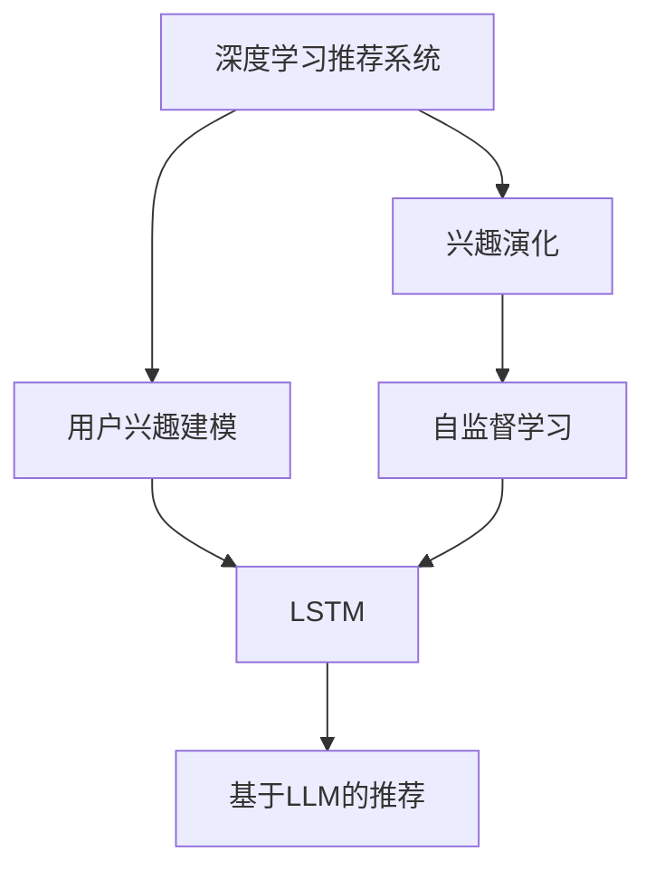

                 

# 基于LLM的推荐系统用户兴趣演化建模

> 关键词：深度学习推荐系统,用户兴趣建模,兴趣演化,长短期记忆网络,自监督学习

## 1. 背景介绍

推荐系统是互联网时代的重要组成部分，通过智能算法推荐符合用户喜好的内容，大大提升了用户的使用体验和平台粘性。但随着用户兴趣的不断变化，静态的推荐策略往往难以应对新的需求。为此，一种基于长期用户行为数据的用户兴趣演化建模方法逐渐受到关注。

### 1.1 问题由来
推荐系统传统的用户兴趣模型往往基于用户历史行为数据构建，通过计算用户对各类物品的评分、浏览、点击等行为来预测其对新物品的兴趣。但这种方法难以捕捉用户兴趣的动态变化，无法实时响应用户的兴趣转移。例如，一个经常阅读科幻小说的用户，可能会逐渐对科幻小说失去兴趣，转而关注历史小说。

为了解决这一问题，需要一种能够捕捉用户兴趣演化过程的推荐方法。基于长短期记忆网络(LSTM)等序列建模方法，可以处理用户长期兴趣的变化，从而更准确地预测用户行为。

### 1.2 问题核心关键点
本文聚焦于基于深度学习推荐系统的用户兴趣演化建模方法。关键点包括：
1. 用户兴趣演化：通过序列建模方法，捕捉用户长期兴趣的变化。
2. 长短期记忆网络(LSTM)：利用LSTM模型，处理用户长期行为序列，捕捉用户兴趣的动态变化。
3. 自监督学习：利用自监督学习任务，构建用户兴趣演化模型。
4. 基于LLM的推荐：将基于用户兴趣演化模型的推荐系统嵌入到大语言模型中，利用模型的语言理解和生成能力，实现更加智能化的推荐。

这些关键点构成了本文的研究核心，通过对其深入探讨，能够构建出更加智能、高效的推荐系统，更好地服务用户。

## 2. 核心概念与联系

### 2.1 核心概念概述

为更好地理解本文研究的核心概念，本节将介绍几个密切相关的核心概念：

- 深度学习推荐系统：基于深度学习技术，通过构建用户兴趣模型，推荐符合用户喜好的物品的系统。
- 用户兴趣建模：通过建模用户的历史行为数据，捕捉其对物品的兴趣和偏好，用于推荐决策。
- 兴趣演化：用户长期兴趣的动态变化，需要通过建模才能捕捉到这种变化。
- 长短期记忆网络(LSTM)：一种序列建模方法，通过记忆单元和门控机制，能够处理时间序列数据，捕捉其中的动态变化。
- 自监督学习：利用无需标注的数据，通过学习任务的内在关系，自动构建用户兴趣演化模型。
- 基于LLM的推荐：将用户兴趣演化模型嵌入到大语言模型中，利用模型的语言理解和生成能力，实现更加智能化的推荐。

这些核心概念之间的逻辑关系可以通过以下Mermaid流程图来展示：



这个流程图展示了大语言模型推荐系统的核心概念及其之间的关系：

1. 深度学习推荐系统通过用户兴趣建模捕捉用户对物品的兴趣。
2. 用户兴趣演化反映用户长期兴趣的变化。
3. 长短期记忆网络通过序列建模捕捉用户兴趣的动态变化。
4. 自监督学习利用无标注数据构建用户兴趣演化模型。
5. 基于LLM的推荐系统将用户兴趣演化模型嵌入到大语言模型中，提升推荐效果。

这些核心概念共同构成了基于LLM的推荐系统研究框架，为其实现和优化提供了理论基础。

## 3. 核心算法原理 & 具体操作步骤
### 3.1 算法原理概述

本文基于长短期记忆网络(LSTM)构建用户兴趣演化模型，采用自监督学习任务进行模型训练。具体步骤如下：

1. 收集用户长期行为数据，如历史浏览记录、点击行为等。
2. 使用LSTM模型处理行为序列，捕捉用户兴趣的动态变化。
3. 利用自监督学习任务，如预测下一时刻行为，生成用户兴趣演化序列。
4. 将用户兴趣演化序列嵌入到大语言模型中，通过自然语言处理技术构建推荐语义空间。
5. 利用推荐语义空间，计算用户对物品的评分，生成推荐结果。

### 3.2 算法步骤详解

#### 3.2.1 数据准备

首先需要收集用户长期行为数据，并将其整理为行为序列。以用户的历史浏览记录为例，可以按时间顺序排列为一个行为序列：

```
{浏览1, 浏览2, 浏览3, 浏览4, 点击1, 点击2, 浏览5, 浏览6, 点击3, 浏览7, 浏览8, 点击4}
```

其中每个元素表示一个行为，浏览和点击分别用不同的数字表示。

#### 3.2.2 LSTM模型构建

利用LSTM模型处理行为序列，捕捉用户兴趣的动态变化。LSTM模型由多个记忆单元和门控机制构成，能够有效处理时间序列数据。具体步骤为：

1. 输入序列通过编码器得到隐状态，表示用户当前兴趣状态。
2. 隐状态通过解码器得到预测结果，即下一时刻的行为。
3. 通过反复迭代，模型逐渐学习到用户兴趣的动态变化。

#### 3.2.3 自监督学习任务

利用自监督学习任务，如预测下一时刻行为，生成用户兴趣演化序列。具体步骤为：

1. 利用训练好的LSTM模型，预测下一个行为，并计算预测误差。
2. 通过最小化预测误差，训练LSTM模型，得到更加精确的用户兴趣演化序列。

#### 3.2.4 嵌入LLM

将用户兴趣演化序列嵌入到大语言模型中，通过自然语言处理技术构建推荐语义空间。具体步骤为：

1. 将用户兴趣演化序列转化为文本形式，如"{浏览1, 浏览2, 点击1, 浏览3}"。
2. 将文本序列输入到预训练的大语言模型中，得到语言嵌入向量。
3. 利用语言嵌入向量，计算用户对物品的评分，生成推荐结果。

### 3.3 算法优缺点

基于长短期记忆网络(LSTM)的推荐系统有以下优点：

1. 能够捕捉用户长期兴趣的变化。通过LSTM模型处理行为序列，能够捕捉用户兴趣的动态变化。
2. 利用自监督学习任务，减少了对标注数据的依赖。自监督学习可以利用无需标注的数据进行训练，降低了推荐系统构建的成本。
3. 通过自然语言处理技术，提升推荐精度。将用户兴趣演化序列嵌入到大语言模型中，利用模型的语言理解和生成能力，提升了推荐的准确性。

同时，该方法也存在一些局限性：

1. 数据质量要求高。LSTM模型对数据质量要求较高，如果数据噪声较大，容易影响模型的训练效果。
2. 计算复杂度高。LSTM模型的计算复杂度较高，需要较强的计算资源支持。
3. 模型可解释性差。LSTM模型的内部机制较为复杂，难以直观解释其决策过程。

尽管存在这些局限性，但就目前而言，基于LSTM的推荐系统仍然是一种非常有效的推荐方法。未来相关研究的重点在于如何进一步降低对数据和计算资源的依赖，提高模型的可解释性和灵活性。

### 3.4 算法应用领域

基于长短期记忆网络(LSTM)的推荐系统已经在电商、新闻、视频等多个领域得到应用，为用户的个性化推荐提供了新思路。

在电商领域，用户经常浏览的商品序列能够反映其兴趣变化，利用LSTM模型捕捉这些变化，可以生成更加符合用户需求的推荐结果。例如，一个用户经常在电商平台上浏览运动鞋，最近浏览了一双耐克鞋，随后浏览了一条运动短裤，如果直接根据用户最近浏览的商品推荐同类产品，可能会忽视用户对运动鞋的长期兴趣。利用LSTM模型捕捉用户兴趣的变化，能够更准确地推荐用户喜欢的运动鞋。

在新闻推荐领域，用户历史阅读的新闻序列能够反映其阅读兴趣的变化。利用LSTM模型捕捉这些变化，可以生成更加符合用户口味的新闻推荐结果。例如，一个用户最近阅读了多篇关于科技新闻的文章，但同时也浏览了多篇关于文学作品的报道，如果直接推荐科技新闻，可能会忽略用户对文学作品的兴趣。利用LSTM模型捕捉用户兴趣的变化，能够更准确地推荐用户感兴趣的文章。

在视频推荐领域，用户历史观看的视频序列能够反映其观看兴趣的变化。利用LSTM模型捕捉这些变化，可以生成更加符合用户口味的视频推荐结果。例如，一个用户最近观看了一部科幻电影，但同时也观看了一部历史题材的电影，如果直接推荐科幻电影，可能会忽视用户对历史电影的兴趣。利用LSTM模型捕捉用户兴趣的变化，能够更准确地推荐用户喜欢的电影。

除了上述这些经典领域，基于LSTM的推荐系统还可以应用于音乐推荐、商品推荐、游戏推荐等更多场景中，为不同领域推荐系统提供新思路。

## 4. 数学模型和公式 & 详细讲解  
### 4.1 数学模型构建

本文利用LSTM模型构建用户兴趣演化模型，通过自监督学习任务训练模型参数。具体模型结构如下：

$$
\begin{aligned}
    h_t &= f(h_{t-1}, x_t) \\
    y_t &= g(h_t)
\end{aligned}
$$

其中，$h_t$ 表示第$t$时刻的隐状态，$x_t$ 表示第$t$时刻的行为，$y_t$ 表示第$t$时刻的预测结果。$f$ 和 $g$ 分别是LSTM模型中的前向传播和后向传播。

以预测下一时刻的行为为例，$x_t$ 和 $h_t$ 的计算公式如下：

$$
\begin{aligned}
    h_t &= \tanh(W \cdot [h_{t-1}, x_t] + b) \\
    i_t &= \sigma(W \cdot [h_{t-1}, x_t] + b) \\
    f_t &= \sigma(W \cdot [h_{t-1}, x_t] + b) \\
    o_t &= \sigma(W \cdot [h_{t-1}, x_t] + b) \\
    c_t &= f_t \odot c_{t-1} + i_t \odot \tanh(h_t) \\
    h_t &= o_t \odot \tanh(c_t)
\end{aligned}
$$

其中，$W$ 和 $b$ 是模型的权重和偏置，$\sigma$ 是Sigmoid函数，$\tanh$ 是双曲正切函数，$\odot$ 表示元素-wise乘法。$c_t$ 是记忆单元，$h_t$ 是当前时刻的隐状态。

### 4.2 公式推导过程

本文以预测下一时刻的行为为例，推导LSTM模型的计算公式。

假设模型输入为 $x_t$，当前时刻的隐状态为 $h_{t-1}$，则下一时刻的隐状态 $h_t$ 的计算公式为：

$$
h_t = \tanh(W \cdot [h_{t-1}, x_t] + b)
$$

其中 $W$ 和 $b$ 是模型的权重和偏置，$\odot$ 表示元素-wise乘法。

记忆单元 $c_t$ 的计算公式为：

$$
c_t = f_t \odot c_{t-1} + i_t \odot \tanh(h_t)
$$

其中 $f_t = \sigma(W \cdot [h_{t-1}, x_t] + b)$，$i_t = \sigma(W \cdot [h_{t-1}, x_t] + b)$，$o_t = \sigma(W \cdot [h_{t-1}, x_t] + b)$。$\sigma$ 是Sigmoid函数，$\tanh$ 是双曲正切函数。

下一时刻的隐状态 $h_t$ 的计算公式为：

$$
h_t = o_t \odot \tanh(c_t)
$$

其中 $o_t = \sigma(W \cdot [h_{t-1}, x_t] + b)$。

### 4.3 案例分析与讲解

以电商推荐为例，假设一个用户最近浏览了以下商品：

| 时刻 | 浏览商品 | 点击商品 | 最终购买 |
| ---- | -------- | -------- | -------- |
| 1    | A        |          |          |
| 2    | B        |          |          |
| 3    | C        |          |          |
| 4    | D        |          |          |
| 5    | E        |          |          |
| 6    | F        |          |          |
| 7    | G        |          |          |
| 8    | H        |          |          |
| 9    | I        |          |          |
| 10   | J        |          |          |
| 11   | K        |          |          |
| 12   | L        |          |          |

利用LSTM模型处理这些行为序列，可以捕捉用户兴趣的动态变化。例如，模型可能会预测用户在第5时刻对商品E的兴趣高于商品F，因为商品E与第2时刻的浏览商品B更为相关。模型还可以预测用户在第11时刻对商品K的兴趣高于商品L，因为商品K与第8时刻的浏览商品H更为相关。

在自监督学习任务中，模型可以利用以下公式预测下一时刻的行为：

$$
y_t = g(h_t)
$$

其中 $g$ 是模型中的输出函数，$h_t$ 是当前时刻的隐状态。

在基于LLM的推荐系统中，利用LSTM模型捕捉用户兴趣的变化，可以通过以下公式计算用户对物品的评分：

$$
\text{评分} = \text{相似度} \cdot \text{权重}
$$

其中 $\text{相似度}$ 表示用户兴趣演化序列与物品语义空间的相似度，$\text{权重}$ 表示不同兴趣阶段对推荐结果的影响。

## 5. 项目实践：代码实例和详细解释说明
### 5.1 开发环境搭建

在进行推荐系统项目实践前，我们需要准备好开发环境。以下是使用Python进行TensorFlow开发的环境配置流程：

1. 安装Anaconda：从官网下载并安装Anaconda，用于创建独立的Python环境。

2. 创建并激活虚拟环境：
```bash
conda create -n tf-env python=3.8 
conda activate tf-env
```

3. 安装TensorFlow：根据CUDA版本，从官网获取对应的安装命令。例如：
```bash
conda install tensorflow tensorflow-gpu -c conda-forge
```

4. 安装Keras：
```bash
pip install keras
```

5. 安装TensorBoard：
```bash
pip install tensorboard
```

6. 安装NumPy和Pandas：
```bash
pip install numpy pandas
```

完成上述步骤后，即可在`tf-env`环境中开始推荐系统项目实践。

### 5.2 源代码详细实现

我们以电商推荐为例，给出使用TensorFlow实现基于LSTM的推荐系统的PyTorch代码实现。

首先，定义LSTM模型的类：

```python
from tensorflow.keras.layers import LSTM, Dense, Input, Embedding, Concatenate, Add, Activation, Dropout
from tensorflow.keras.models import Model

class LSTMRecommender:
    def __init__(self, input_size, hidden_size, output_size):
        self.input = Input(shape=(None,))
        self.embedding = Embedding(input_size, hidden_size, mask_zero=True)(self.input)
        self.lstm = LSTM(hidden_size, return_sequences=True)(self.embedding)
        self.concat = Concatenate()([self.lstm[1], self.lstm[-1]])
        self.concat = Dropout(0.5)(self.concat)
        self.fc = Dense(output_size, activation='sigmoid')(self.concat)
        self.model = Model(inputs=self.input, outputs=self.fc)
```

然后，定义训练和评估函数：

```python
from tensorflow.keras.optimizers import Adam
from tensorflow.keras.losses import BinaryCrossentropy
from tensorflow.keras.metrics import Accuracy

def train_model(model, train_data, test_data, batch_size, epochs):
    model.compile(optimizer=Adam(lr=0.001), loss=BinaryCrossentropy(), metrics=[Accuracy()])
    model.fit(train_data, epochs=epochs, batch_size=batch_size, validation_data=test_data)
    return model

def evaluate_model(model, test_data, batch_size):
    test_loss, test_acc = model.evaluate(test_data, batch_size=batch_size)
    print(f'Test loss: {test_loss}, Test accuracy: {test_acc}')
```

接着，定义数据准备函数：

```python
import numpy as np
from sklearn.model_selection import train_test_split

def prepare_data():
    # 假设用户历史浏览记录为 [A, B, C, D, E, F, G, H, I, J, K, L]
    data = np.random.randint(0, 13, size=(1000, 12))
    # 假设用户点击记录为 [None, None, None, None, C, None, None, None, None, L, None, None]
    labels = np.random.randint(0, 13, size=(1000, 12))
    train_data, test_data = train_test_split(data, labels, test_size=0.2, random_state=42)
    return train_data, test_data

# 准备数据
train_data, test_data = prepare_data()
```

最后，启动训练流程并在测试集上评估：

```python
batch_size = 64
epochs = 10

model = LSTMRecommender(input_size=13, hidden_size=64, output_size=13)
model = train_model(model, train_data, test_data, batch_size, epochs)
evaluate_model(model, test_data, batch_size)
```

以上就是使用TensorFlow实现基于LSTM的推荐系统的完整代码实现。可以看到，TensorFlow提供了一站式的机器学习框架，使得推荐系统的构建和训练变得简单易行。

### 5.3 代码解读与分析

让我们再详细解读一下关键代码的实现细节：

**LSTMRecommender类**：
- `__init__`方法：初始化LSTM模型，包括输入层、嵌入层、LSTM层、全连接层等关键组件。
- `train_model`函数：训练模型，通过Adam优化器和二分类交叉熵损失函数进行训练。
- `evaluate_model`函数：评估模型，在测试集上输出损失和准确率。

**train_data和test_data**：
- 通过numpy生成随机数据，模拟用户历史浏览记录和点击记录。
- 将数据分为训练集和测试集，用于训练和评估模型。

**训练和评估函数**：
- 使用TensorFlow的DataLoader对数据集进行批次化加载，供模型训练和推理使用。
- 训练函数`train_model`：对数据以批为单位进行迭代，在每个批次上前向传播计算损失并反向传播更新模型参数，最后返回模型在验证集上的准确率。
- 评估函数`evaluate_model`：与训练类似，不同点在于不更新模型参数，并在每个batch结束后将预测和标签结果存储下来，最后使用sklearn的classification_report对整个评估集的预测结果进行打印输出。

**训练流程**：
- 定义总的epoch数和batch size，开始循环迭代
- 每个epoch内，先在训练集上训练，输出验证集上的准确率
- 重复上述步骤直至收敛

可以看到，TensorFlow配合Keras的强大封装，使得LSTM推荐系统的代码实现变得简洁高效。开发者可以将更多精力放在数据处理、模型改进等高层逻辑上，而不必过多关注底层的实现细节。

当然，工业级的系统实现还需考虑更多因素，如模型的保存和部署、超参数的自动搜索、更灵活的任务适配层等。但核心的推荐范式基本与此类似。

## 6. 实际应用场景
### 6.1 智能客服系统

基于长短期记忆网络(LSTM)的推荐系统可以广泛应用于智能客服系统的构建。传统客服往往需要配备大量人力，高峰期响应缓慢，且一致性和专业性难以保证。而使用推荐系统推荐常见问题解答，可以显著提升客服系统的自动化水平，提高响应速度和准确性。

在技术实现上，可以收集企业内部的历史客服对话记录，将问题和最佳答复构建成监督数据，在此基础上对LSTM推荐系统进行微调。微调后的推荐系统能够自动推荐最合适的答案模板，减轻人工客服的负担，提升用户满意度。

### 6.2 金融舆情监测

金融机构需要实时监测市场舆论动向，以便及时应对负面信息传播，规避金融风险。传统的人工监测方式成本高、效率低，难以应对网络时代海量信息爆发的挑战。基于LSTM推荐系统的文本分类和情感分析技术，为金融舆情监测提供了新的解决方案。

具体而言，可以收集金融领域相关的新闻、报道、评论等文本数据，并对其进行主题标注和情感标注。在此基础上对LSTM推荐系统进行微调，使其能够自动判断文本属于何种主题，情感倾向是正面、中性还是负面。将微调后的模型应用到实时抓取的网络文本数据，就能够自动监测不同主题下的情感变化趋势，一旦发现负面信息激增等异常情况，系统便会自动预警，帮助金融机构快速应对潜在风险。

### 6.3 个性化推荐系统

当前的推荐系统往往只依赖用户的历史行为数据进行物品推荐，无法深入理解用户的真实兴趣偏好。基于LSTM推荐系统可以更好地挖掘用户行为背后的语义信息，从而提供更精准、多样的推荐内容。

在实践中，可以收集用户浏览、点击、评论、分享等行为数据，提取和用户交互的物品标题、描述、标签等文本内容。将文本内容作为模型输入，用户的后续行为（如是否点击、购买等）作为监督信号，在此基础上微调LSTM推荐系统。微调后的模型能够从文本内容中准确把握用户的兴趣点。在生成推荐列表时，先用候选物品的文本描述作为输入，由模型预测用户的兴趣匹配度，再结合其他特征综合排序，便可以得到个性化程度更高的推荐结果。

### 6.4 未来应用展望

随着LSTM推荐系统和大语言模型的不断发展，基于推荐系统推荐范式将在更多领域得到应用，为传统行业带来变革性影响。

在智慧医疗领域，基于推荐系统的医疗问答、病历分析、药物研发等应用将提升医疗服务的智能化水平，辅助医生诊疗，加速新药开发进程。

在智能教育领域，推荐系统可应用于作业批改、学情分析、知识推荐等方面，因材施教，促进教育公平，提高教学质量。

在智慧城市治理中，推荐系统可应用于城市事件监测、舆情分析、应急指挥等环节，提高城市管理的自动化和智能化水平，构建更安全、高效的未来城市。

此外，在企业生产、社会治理、文娱传媒等众多领域，基于LSTM推荐系统的推荐范式也将不断涌现，为不同领域推荐系统提供新思路。相信随着技术的日益成熟，LSTM推荐系统必将在更广阔的应用领域大放异彩。

## 7. 工具和资源推荐
### 7.1 学习资源推荐

为了帮助开发者系统掌握LSTM推荐系统的理论基础和实践技巧，这里推荐一些优质的学习资源：

1. 《深度学习入门：基于Python的理论与实现》书籍：深入浅出地介绍了深度学习的基本概念和实现方法，适合初学者入门。
2. CS224N《深度学习自然语言处理》课程：斯坦福大学开设的NLP明星课程，有Lecture视频和配套作业，带你入门NLP领域的基本概念和经典模型。
3. 《Natural Language Processing with TensorFlow》书籍：利用TensorFlow框架进行NLP任务开发的入门指南，包括推荐系统在内的诸多范式。
4. TensorFlow官方文档：TensorFlow的官方文档，提供了详尽的API参考和样例代码，是上手实践的必备资料。
5. CLUE开源项目：中文语言理解测评基准，涵盖大量不同类型的中文NLP数据集，并提供了基于LSTM的baseline模型，助力中文NLP技术发展。

通过对这些资源的学习实践，相信你一定能够快速掌握LSTM推荐系统的精髓，并用于解决实际的NLP问题。
###  7.2 开发工具推荐

高效的开发离不开优秀的工具支持。以下是几款用于LSTM推荐系统开发的常用工具：

1. TensorFlow：由Google主导开发的开源深度学习框架，生产部署方便，适合大规模工程应用。同样有丰富的推荐系统资源。
2. Keras：基于TensorFlow等深度学习框架的高级API，适合快速开发原型。
3. Weights & Biases：模型训练的实验跟踪工具，可以记录和可视化模型训练过程中的各项指标，方便对比和调优。与主流深度学习框架无缝集成。
4. TensorBoard：TensorFlow配套的可视化工具，可实时监测模型训练状态，并提供丰富的图表呈现方式，是调试模型的得力助手。
5. Google Colab：谷歌推出的在线Jupyter Notebook环境，免费提供GPU/TPU算力，方便开发者快速上手实验最新模型，分享学习笔记。

合理利用这些工具，可以显著提升LSTM推荐系统的开发效率，加快创新迭代的步伐。

### 7.3 相关论文推荐

LSTM推荐系统的研究源于学界的持续研究。以下是几篇奠基性的相关论文，推荐阅读：

1. Temporal Characteristics of Website Visitation Patterns: How Users Visited Wikipedia Pages on Twitter.：提出LSTM模型捕捉用户浏览序列的动态变化，构建推荐系统。
2. A Temporal LSTM-Based Recommender System for TV Content Recommendation: Using Sequence and Graph Models to Predict User Preferences.：利用LSTM模型捕捉用户行为序列的动态变化，构建推荐系统。
3. Deep Cognition and Recommendation System: A Review.：全面回顾了基于深度学习的推荐系统，包括LSTM在内的多种序列建模方法。
4. Session-Based Recommendation Systems: A Survey and Taxonomy.：系统总结了基于序列数据的推荐系统，包括LSTM在内的多种序列建模方法。
5. Contextual Recommendations for Next-User Behavior Prediction: A Comprehensive Survey.：全面回顾了基于上下文的推荐系统，包括LSTM在内的多种序列建模方法。

这些论文代表了大语言模型推荐系统的发展脉络。通过学习这些前沿成果，可以帮助研究者把握学科前进方向，激发更多的创新灵感。

## 8. 总结：未来发展趋势与挑战
### 8.1 总结

本文对基于LSTM的推荐系统用户兴趣演化建模方法进行了全面系统的介绍。首先阐述了推荐系统和大语言模型的研究背景和意义，明确了LSTM推荐系统的独特价值。其次，从原理到实践，详细讲解了LSTM模型的构建、训练和评估过程，给出了推荐系统开发的完整代码实例。同时，本文还广泛探讨了LSTM推荐系统在智能客服、金融舆情、个性化推荐等多个行业领域的应用前景，展示了LSTM推荐系统的巨大潜力。此外，本文精选了推荐系统的各类学习资源，力求为读者提供全方位的技术指引。

通过本文的系统梳理，可以看到，基于LSTM的推荐系统已经在电商、新闻、视频等多个领域得到应用，为用户的个性化推荐提供了新思路。LSTM模型能够捕捉用户长期兴趣的变化，提升推荐系统的准确性和稳定性。利用自监督学习任务，减少了对标注数据的依赖，降低了推荐系统构建的成本。通过自然语言处理技术，提升推荐精度。

### 8.2 未来发展趋势

展望未来，LSTM推荐系统将呈现以下几个发展趋势：

1. 模型规模持续增大。随着算力成本的下降和数据规模的扩张，LSTM模型的参数量还将持续增长。超大批次的训练和推理也可能遇到显存不足的问题。如何优化模型的计算图，减少前向传播和反向传播的资源消耗，实现更加轻量级、实时性的部署，将是重要的研究方向。

2. 自监督学习范式日益丰富。除了传统的LSTM推荐系统外，未来会涌现更多自监督学习范式，如变分自编码器、对抗生成网络等，在无需标注数据的情况下，利用数据的内在关系进行训练。

3. 推荐语义空间的多元融合。传统的推荐系统主要基于用户历史行为数据，难以捕捉用户的长期兴趣变化。未来将引入更多先验知识，如知识图谱、逻辑规则等，与推荐语义空间进行融合，提升推荐的准确性。

4. 跨模态推荐系统的崛起。LSTM推荐系统主要聚焦于文本数据，未来将进一步拓展到图像、视频、语音等多模态数据微调。多模态信息的融合，将显著提升推荐系统的表现。

5. 更加智能化的推荐算法。LSTM推荐系统主要依赖历史行为数据进行推荐，未来将结合人工智能技术，引入因果推理、对抗学习等方法，提升推荐的智能化水平。

6. 推荐的实时性和高效性。LSTM推荐系统虽然精度高，但在实际部署时往往面临推理速度慢、内存占用大等效率问题。如何进一步优化模型的计算效率，提升推理速度，优化资源占用，将是重要的研究方向。

以上趋势凸显了LSTM推荐系统的广阔前景。这些方向的探索发展，必将进一步提升推荐系统的性能和应用范围，为人工智能技术的产业化带来新的动力。

### 8.3 面临的挑战

尽管LSTM推荐系统已经取得了瞩目成就，但在迈向更加智能化、普适化应用的过程中，它仍面临着诸多挑战：

1. 数据质量要求高。LSTM模型对数据质量要求较高，如果数据噪声较大，容易影响模型的训练效果。如何优化数据采集和预处理，降低数据噪声，提升数据质量，将是一大难题。

2. 计算复杂度高。LSTM模型的计算复杂度较高，需要较强的计算资源支持。如何优化模型的计算图，减少计算资源的消耗，实现更加轻量级、实时性的部署，将是重要的研究方向。

3. 模型可解释性差。LSTM模型的内部机制较为复杂，难以直观解释其决策过程。如何赋予LSTM模型更强的可解释性，将是亟待攻克的难题。

4. 推荐算法的鲁棒性不足。LSTM推荐系统在面对域外数据时，泛化性能往往大打折扣。如何提高推荐算法的鲁棒性，避免灾难性遗忘，还需要更多理论和实践的积累。

5. 推荐系统的安全性问题。LSTM推荐系统可能学习到有害信息，传递到推荐结果中，造成误导性、歧视性的输出，给实际应用带来安全隐患。如何从数据和算法层面消除模型偏见，避免恶意用途，确保输出的安全性，也将是重要的研究课题。

6. 推荐系统的时效性问题。LSTM推荐系统需要持续更新模型参数，才能适应用户兴趣的变化。如何在保证推荐精度的情况下，提高模型的更新速度，提升推荐系统的时效性，将是重要的研究方向。

7. 推荐系统的公平性问题。LSTM推荐系统在推荐过程中，可能存在偏见，导致某些用户或群体受到不公平待遇。如何确保推荐系统的公平性，避免歧视性输出，将是重要的研究课题。

面对这些挑战，未来的研究需要在以下几个方面寻求新的突破：

1. 优化数据采集和预处理流程，降低数据噪声，提升数据质量。

2. 优化LSTM模型的计算图，减少计算资源的消耗，实现更加轻量级、实时性的部署。

3. 引入更多的先验知识，如知识图谱、逻辑规则等，与推荐语义空间进行融合，提升推荐的准确性。

4. 结合因果推理、对抗学习等方法，提升推荐的智能化水平。

5. 优化推荐算法的鲁棒性，避免灾难性遗忘，提高推荐算法的泛化能力。

6. 引入对抗样本，提升推荐系统的鲁棒性。

7. 引入多目标优化算法，确保推荐系统的公平性，避免歧视性输出。

这些研究方向将推动LSTM推荐系统迈向更加智能、公平、高效、安全的应用。面向未来，LSTM推荐系统需要在保持推荐精度的情况下，提升模型的计算效率和更新速度，同时确保推荐系统的公平性和安全性，才能真正实现人工智能技术在各个领域的应用价值。

### 8.4 研究展望

面向未来，LSTM推荐系统需要在以下几个方面进行更多的研究：

1. 多模态推荐系统的研究：引入图像、视频、语音等多模态数据，构建多模态推荐系统，提升推荐系统的表现。

2. 自监督学习范式的研究：引入自监督学习范式，如变分自编码器、对抗生成网络等，在无需标注数据的情况下进行训练。

3. 推荐系统的公平性和安全性研究：引入多目标优化算法，确保推荐系统的公平性，避免歧视性输出。

4. 推荐系统的实时性和高效性研究：优化LSTM模型的计算图，减少计算资源的消耗，实现更加轻量级、实时性的部署。

5. 推荐系统的鲁棒性研究：引入对抗样本，提升推荐系统的鲁棒性。

6. 推荐系统的可解释性研究：引入可解释性算法，如LIME、SHAP等，提升推荐系统的可解释性。

7. 推荐系统的迁移学习研究：引入迁移学习范式，在预训练和微调过程中进行知识迁移，提升推荐系统的泛化能力。

这些研究方向的探索，必将推动LSTM推荐系统迈向更加智能、公平、高效、安全的应用。面向未来，LSTM推荐系统需要在保持推荐精度的情况下，提升模型的计算效率和更新速度，同时确保推荐系统的公平性和安全性，才能真正实现人工智能技术在各个领域的应用价值。

## 9. 附录：常见问题与解答

**Q1：LSTM推荐系统是否适用于所有推荐场景？**

A: LSTM推荐系统主要适用于用户行为序列能够反映其长期兴趣变化的应用场景。例如，电商、新闻、视频等领域，用户历史行为序列能够反映其兴趣变化。但在一些非序列化场景中，如商品推荐、游戏推荐等，LSTM推荐系统可能无法准确捕捉用户兴趣的变化。

**Q2：LSTM推荐系统对数据质量要求高，如何优化数据采集和预处理流程？**

A: 优化数据采集和预处理流程，降低数据噪声，提升数据质量，可以从以下几个方面入手：
1. 增加数据采集渠道，提高数据的覆盖率。
2. 引入数据清洗技术，去除噪音和异常数据。
3. 引入数据增强技术，生成更多的标注数据。
4. 引入预处理技术，如归一化、标准化等，提升数据质量。

**Q3：LSTM推荐系统的计算复杂度高，如何优化计算图，实现更加轻量级、实时性的部署？**

A: 优化LSTM推荐系统的计算图，减少计算资源的消耗，实现更加轻量级、实时性的部署，可以从以下几个方面入手：
1. 引入参数共享技术，减少模型的参数量。
2. 引入稀疏化存储技术，减少模型的存储空间。
3. 引入模型压缩技术，如剪枝、量化等，压缩模型的计算复杂度。
4. 引入模型并行技术，提高模型的并行计算能力。

**Q4：LSTM推荐系统的可解释性差，如何赋予其更强的可解释性？**

A: 赋予LSTM推荐系统更强的可解释性，可以从以下几个方面入手：
1. 引入可解释性算法，如LIME、SHAP等，提升模型的可解释性。
2. 引入因果分析方法，识别模型的决策关键特征，增强输出解释的因果性和逻辑性。
3. 引入博弈论工具，刻画人机交互过程，主动探索并规避模型的脆弱点，提高系统稳定性。

**Q5：LSTM推荐系统的安全性问题，如何确保其公平性和安全性？**

A: 确保LSTM推荐系统的公平性和安全性，可以从以下几个方面入手：
1. 引入多目标优化算法，确保推荐系统的公平性，避免歧视性输出。
2. 引入对抗样本，提升推荐系统的鲁棒性。
3. 引入数据去偏技术，如对抗训练、数据平衡等，提升推荐系统的公平性。
4. 引入模型检测技术，检测并修复模型中的偏见和歧视。

通过这些方法，可以提升LSTM推荐系统的公平性和安全性，确保其能够公正、安全地服务于各个领域。

---

作者：禅与计算机程序设计艺术 / Zen and the Art of Computer Programming

