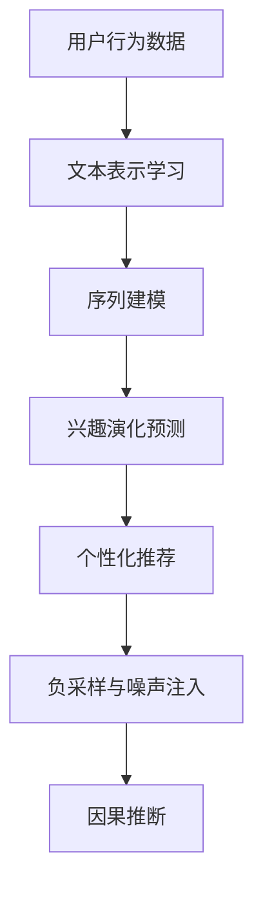

                 

# 基于LLM的用户兴趣动态演化预测模型

## 1. 背景介绍

在快速变化的数字时代，用户兴趣的动态演化是推荐系统的重要研究课题。传统的静态兴趣模型难以捕捉用户的兴趣变化，导致推荐内容难以满足用户需求。近年来，随着深度学习技术的迅猛发展，大语言模型(LLM)在自然语言处理领域取得了重大突破，展现出卓越的表征学习能力。将其应用于用户兴趣预测，有望构建更为动态、个性化的推荐系统。

### 1.1 问题由来

用户兴趣的动态演化是指用户在特定时间或场景下的兴趣点发生变化。例如，一个用户之前可能偏好科幻小说，近期却对科普书籍产生兴趣。用户兴趣的动态性给传统推荐系统带来了挑战：

1. **静态模型局限**：传统的基于协同过滤、内容推荐的模型多采用静态用户画像，难以捕捉用户兴趣的变化。
2. **实时性不足**：用户兴趣的变化往往具有时间维度，传统模型难以实时更新，无法快速响应。
3. **个性化缺失**：不同用户对同一内容的兴趣点可能差异很大，传统的兴趣模型难以考虑个体差异，推荐结果泛化性差。

这些问题在用户基数大、内容多样化的电商、新闻、视频等多个场景下尤为突出。

### 1.2 问题核心关键点

基于大语言模型预测用户兴趣的核心在于：
- **文本表示学习**：利用大语言模型的强大表征能力，从用户行为数据中提取兴趣特征。
- **动态预测**：根据历史行为数据和实时数据，动态预测用户兴趣的演化轨迹。
- **个性化推荐**：结合用户历史兴趣和当前兴趣，生成个性化推荐列表。

这些关键点涉及文本表示学习、序列建模、个性化推荐等前沿技术，是大语言模型在用户兴趣预测中的核心应用方向。

## 2. 核心概念与联系

### 2.1 核心概念概述

为更好地理解基于大语言模型预测用户兴趣的机制，本节将介绍几个密切相关的核心概念：

- **大语言模型(LLM)**：以自回归(如GPT)或自编码(如BERT)模型为代表的大规模预训练语言模型。通过在大规模无标签文本语料上进行预训练，学习通用的语言表示，具备强大的语言理解和生成能力。
- **序列建模**：使用大语言模型处理用户行为序列，建模兴趣演化的动态过程。
- **用户兴趣演化预测**：通过大语言模型，从用户历史行为数据中预测其兴趣点的动态变化轨迹。
- **个性化推荐**：结合用户历史兴趣和当前兴趣，动态生成个性化推荐列表。
- **负采样与噪声注入**：使用负采样和噪声注入技术，增加模型鲁棒性，避免过拟合。
- **因果推断**：使用因果推断技术，建立兴趣演化与行为数据之间的因果关系。

这些核心概念之间的逻辑关系可以通过以下Mermaid流程图来展示：



这个流程图展示了大语言模型预测用户兴趣的核心概念及其之间的关系：

1. 用户行为数据是兴趣预测的基础，通过文本表示学习和大语言模型提取特征。
2. 序列建模建立兴趣演化轨迹，通过历史行为数据预测兴趣变化。
3. 结合个性化推荐和负采样技术，生成多样化的推荐列表。
4. 因果推断增强模型因果解释性，提升推荐效果。

这些概念共同构成了用户兴趣预测的核心框架，使得大语言模型能够有效捕捉用户的动态兴趣，构建智能推荐系统。

## 3. 核心算法原理 & 具体操作步骤
### 3.1 算法原理概述

基于大语言模型预测用户兴趣的核心算法分为三个步骤：

1. **文本表示学习**：从用户行为数据中提取文本特征，利用大语言模型学习兴趣表示。
2. **兴趣演化预测**：建立兴趣演化模型，从历史行为数据预测用户兴趣点变化。
3. **个性化推荐**：结合用户历史兴趣和当前兴趣，生成个性化推荐列表。

以下将详细介绍这三个步骤的具体实现。

### 3.2 算法步骤详解

#### 3.2.1 文本表示学习

文本表示学习是构建用户兴趣模型的第一步。假设用户行为数据表示为 $D=\{(x_i,y_i)\}_{i=1}^N, x_i \in \mathcal{X}, y_i \in \mathcal{Y}$。其中 $x_i$ 为行为事件，$y_i$ 为行为结果。例如，$x_i$ 可以表示用户的浏览行为、购买记录等。

文本表示学习的基本流程如下：

1. **分词与编码**：将用户行为数据转换为文本序列，使用大语言模型提供的分词器和编码器。
2. **预训练模型选择**：选择适合的预训练模型（如BERT、GPT等）进行特征提取。
3. **文本特征编码**：将文本序列输入预训练模型，得到嵌入向量 $E(x_i) \in \mathbb{R}^d$。

假设 $E(x_i)$ 为 $d$ 维的文本嵌入向量，则用户 $u$ 的兴趣表示为 $E_u = \sum_{i=1}^N E(x_i)$。

#### 3.2.2 兴趣演化预测

兴趣演化预测的目标是从历史行为数据中，动态预测用户兴趣点的变化轨迹。假设 $u$ 用户的历史行为数据为 $X_u = \{x_1, x_2, \ldots, x_n\}$，其中 $n$ 为历史行为数量。兴趣演化预测的数学模型为：

$$
\hat{X}_{u+1} = f(E_u, X_u)
$$

其中 $f$ 为兴趣演化函数，可以是任意的机器学习模型，如线性回归、递归神经网络(RNN)、长短期记忆网络(LSTM)等。$E_u$ 为用户当前兴趣表示，$X_u$ 为用户历史行为序列。

#### 3.2.3 个性化推荐

个性化推荐的目标是根据用户当前兴趣和历史兴趣，动态生成推荐列表。假设 $X_u^t$ 为用户当前时间点的兴趣表示，$H_u$ 为用户历史兴趣表示，则推荐列表 $R_u$ 可以表示为：

$$
R_u = \mathop{\arg\min}_{r \in R} \mathcal{L}(r, X_u^t, H_u)
$$

其中 $\mathcal{L}$ 为推荐损失函数，可以是交叉熵损失、均方误差损失等。$R$ 为候选物品集合。

结合文本表示学习和兴趣演化预测，用户兴趣预测的整体流程如下：

1. 利用预训练模型提取用户行为数据中的文本特征，学习用户兴趣表示。
2. 构建兴趣演化模型，从历史行为数据中预测用户兴趣点变化。
3. 结合用户当前兴趣和历史兴趣，动态生成个性化推荐列表。

### 3.3 算法优缺点

基于大语言模型预测用户兴趣具有以下优点：

1. **强大的文本表示能力**：大语言模型能够从海量的文本数据中学习丰富的语言表示，提取用户兴趣特征。
2. **灵活的模型选择**：可以使用不同的机器学习模型进行兴趣演化预测，适应不同的业务场景。
3. **动态预测与推荐**：能够根据用户历史行为数据实时预测兴趣变化，动态生成个性化推荐列表。

同时，该方法也存在一些局限性：

1. **数据依赖性**：预测效果依赖于历史行为数据的丰富性和质量，数据量不足时可能无法准确预测。
2. **计算资源需求高**：大语言模型通常参数量较大，训练和推理计算资源需求高。
3. **模型复杂度高**：使用复杂的机器学习模型进行预测，可能导致模型复杂度过高，难以解释。

尽管存在这些局限性，但大语言模型在用户兴趣预测方面的潜力仍被广泛认可，成为推荐系统研究的新范式。

### 3.4 算法应用领域

基于大语言模型预测用户兴趣的方法，已在多个领域得到应用，包括电商推荐、新闻订阅、视频推荐等。

#### 3.4.1 电商推荐

电商推荐系统需要根据用户浏览、购买历史，动态生成个性化商品推荐。利用大语言模型预测用户兴趣，可以构建更加灵活、动态的电商推荐系统。例如，对于新用户，可以通过历史浏览记录提取兴趣特征，结合当前浏览数据预测其兴趣变化，生成个性化商品推荐列表。

#### 3.4.2 新闻订阅

新闻订阅系统需要根据用户阅读历史，推荐用户感兴趣的新闻内容。利用大语言模型预测用户兴趣，可以构建更加智能的新闻订阅系统。例如，根据用户的阅读习惯和兴趣点，动态预测其对不同新闻内容的兴趣变化，生成个性化新闻推荐列表。

#### 3.4.3 视频推荐

视频推荐系统需要根据用户观看历史，推荐用户感兴趣的视频内容。利用大语言模型预测用户兴趣，可以构建更加高效、个性化的视频推荐系统。例如，根据用户的观看记录和历史行为，动态预测其对不同视频内容的兴趣变化，生成个性化视频推荐列表。

## 4. 数学模型和公式 & 详细讲解
### 4.1 数学模型构建

以下以电商推荐系统为例，详细构建基于大语言模型预测用户兴趣的数学模型。

假设用户 $u$ 的历史行为数据为 $X_u = \{x_1, x_2, \ldots, x_n\}$，其中 $x_i$ 为历史行为事件。用户兴趣演化模型为 $f$，推荐列表 $R$ 包含所有候选商品。推荐过程的目标是最小化推荐损失 $\mathcal{L}(r, X_u^t, H_u)$，其中 $X_u^t$ 为用户当前时间点的兴趣表示，$H_u$ 为用户历史兴趣表示。

设 $E(x_i)$ 为行为事件 $x_i$ 的文本嵌入向量，$E_u = \sum_{i=1}^N E(x_i)$ 为用户兴趣表示。则推荐列表的生成过程可以表示为：

$$
R_u = \mathop{\arg\min}_{r \in R} \mathcal{L}(r, E_u, H_u)
$$

其中 $\mathcal{L}$ 为推荐损失函数，可以是交叉熵损失、均方误差损失等。$R$ 为候选物品集合。

### 4.2 公式推导过程

以交叉熵损失函数为例，推导推荐过程的数学公式。

假设 $r \in R$ 为第 $i$ 个候选物品，$y_i$ 为物品 $r$ 的真实标签，则推荐损失函数为：

$$
\mathcal{L}(r, E_u, H_u) = -\sum_{i=1}^N y_i \log P(r|E_u, H_u)
$$

其中 $P(r|E_u, H_u)$ 为物品 $r$ 的概率分布。

设物品 $r$ 的真实标签为 $y_i = 1$，则推荐损失函数为：

$$
\mathcal{L}(r, E_u, H_u) = -\sum_{i=1}^N \log P(r|E_u, H_u)
$$

通过最大化 $P(r|E_u, H_u)$，可以最小化推荐损失函数 $\mathcal{L}$。

### 4.3 案例分析与讲解

假设用户 $u$ 的历史行为数据为 $X_u = \{x_1, x_2, \ldots, x_n\}$，其中 $x_i$ 为历史行为事件。用户兴趣演化模型为 $f$，推荐列表 $R$ 包含所有候选商品。

**案例一：线性回归模型**

设 $f$ 为线性回归模型，其参数为 $\theta$，则兴趣演化预测模型为：

$$
\hat{X}_{u+1} = f(E_u, X_u) = \theta^T [E_u, X_u]^T
$$

其中 $[E_u, X_u]$ 为将用户兴趣表示和历史行为序列拼接后的向量。

**案例二：长短期记忆网络(LSTM)**

设 $f$ 为LSTM模型，其参数为 $\theta$，则兴趣演化预测模型为：

$$
\hat{X}_{u+1} = f(E_u, X_u) = LSTM([E_u, X_u]; \theta)
$$

其中 $LSTM$ 为LSTM模型的前向传播过程。

## 5. 项目实践：代码实例和详细解释说明
### 5.1 开发环境搭建

在进行用户兴趣预测的微调实践前，我们需要准备好开发环境。以下是使用Python进行PyTorch开发的环境配置流程：

1. 安装Anaconda：从官网下载并安装Anaconda，用于创建独立的Python环境。

2. 创建并激活虚拟环境：
```bash
conda create -n pytorch-env python=3.8 
conda activate pytorch-env
```

3. 安装PyTorch：根据CUDA版本，从官网获取对应的安装命令。例如：
```bash
conda install pytorch torchvision torchaudio cudatoolkit=11.1 -c pytorch -c conda-forge
```

4. 安装TensorFlow：使用pip安装TensorFlow，可以选择GPU版本。

5. 安装Transformers库：
```bash
pip install transformers
```

6. 安装各类工具包：
```bash
pip install numpy pandas scikit-learn matplotlib tqdm jupyter notebook ipython
```

完成上述步骤后，即可在`pytorch-env`环境中开始微调实践。

### 5.2 源代码详细实现

下面我们以电商推荐系统为例，给出使用Transformers库对BERT模型进行电商推荐系统微调的PyTorch代码实现。

首先，定义电商推荐系统的数据处理函数：

```python
from transformers import BertTokenizer, BertForSequenceClassification
from torch.utils.data import Dataset, DataLoader
import torch

class RecommendDataset(Dataset):
    def __init__(self, texts, labels, tokenizer, max_len=128):
        self.texts = texts
        self.labels = labels
        self.tokenizer = tokenizer
        self.max_len = max_len
        
    def __len__(self):
        return len(self.texts)
    
    def __getitem__(self, item):
        text = self.texts[item]
        label = self.labels[item]
        
        encoding = self.tokenizer(text, return_tensors='pt', max_length=self.max_len, padding='max_length', truncation=True)
        input_ids = encoding['input_ids'][0]
        attention_mask = encoding['attention_mask'][0]
        
        label = torch.tensor([label], dtype=torch.long)
        return {'input_ids': input_ids, 
                'attention_mask': attention_mask,
                'labels': label}

# 定义标签与id的映射
label2id = {'buy': 0, 'not_buy': 1}
id2label = {0: 'buy', 1: 'not_buy'}

# 创建dataset
tokenizer = BertTokenizer.from_pretrained('bert-base-cased')
train_dataset = RecommendDataset(train_texts, train_labels, tokenizer)
dev_dataset = RecommendDataset(dev_texts, dev_labels, tokenizer)
test_dataset = RecommendDataset(test_texts, test_labels, tokenizer)
```

然后，定义模型和优化器：

```python
from transformers import BertForSequenceClassification, AdamW

model = BertForSequenceClassification.from_pretrained('bert-base-cased', num_labels=len(label2id))

optimizer = AdamW(model.parameters(), lr=2e-5)
```

接着，定义训练和评估函数：

```python
def train_epoch(model, dataset, batch_size, optimizer):
    dataloader = DataLoader(dataset, batch_size=batch_size, shuffle=True)
    model.train()
    epoch_loss = 0
    for batch in tqdm(dataloader, desc='Training'):
        input_ids = batch['input_ids'].to(device)
        attention_mask = batch['attention_mask'].to(device)
        labels = batch['labels'].to(device)
        model.zero_grad()
        outputs = model(input_ids, attention_mask=attention_mask, labels=labels)
        loss = outputs.loss
        epoch_loss += loss.item()
        loss.backward()
        optimizer.step()
    return epoch_loss / len(dataloader)

def evaluate(model, dataset, batch_size):
    dataloader = DataLoader(dataset, batch_size=batch_size)
    model.eval()
    preds, labels = [], []
    with torch.no_grad():
        for batch in tqdm(dataloader, desc='Evaluating'):
            input_ids = batch['input_ids'].to(device)
            attention_mask = batch['attention_mask'].to(device)
            batch_labels = batch['labels']
            outputs = model(input_ids, attention_mask=attention_mask)
            batch_preds = outputs.logits.argmax(dim=2).to('cpu').tolist()
            batch_labels = batch_labels.to('cpu').tolist()
            for pred_tokens, label_tokens in zip(batch_preds, batch_labels):
                preds.append(pred_tokens)
                labels.append(label_tokens)
                
    print(classification_report(labels, preds))
```

最后，启动训练流程并在测试集上评估：

```python
epochs = 5
batch_size = 16

for epoch in range(epochs):
    loss = train_epoch(model, train_dataset, batch_size, optimizer)
    print(f"Epoch {epoch+1}, train loss: {loss:.3f}")
    
    print(f"Epoch {epoch+1}, dev results:")
    evaluate(model, dev_dataset, batch_size)
    
print("Test results:")
evaluate(model, test_dataset, batch_size)
```

以上就是使用PyTorch对BERT进行电商推荐系统微调的完整代码实现。可以看到，得益于Transformers库的强大封装，我们可以用相对简洁的代码完成BERT模型的加载和微调。

### 5.3 代码解读与分析

让我们再详细解读一下关键代码的实现细节：

**RecommendDataset类**：
- `__init__`方法：初始化文本、标签、分词器等关键组件。
- `__len__`方法：返回数据集的样本数量。
- `__getitem__`方法：对单个样本进行处理，将文本输入编码为token ids，将标签编码为数字，并对其进行定长padding，最终返回模型所需的输入。

**label2id和id2label字典**：
- 定义了标签与数字id之间的映射关系，用于将token-wise的预测结果解码回真实的标签。

**训练和评估函数**：
- 使用PyTorch的DataLoader对数据集进行批次化加载，供模型训练和推理使用。
- 训练函数`train_epoch`：对数据以批为单位进行迭代，在每个批次上前向传播计算loss并反向传播更新模型参数，最后返回该epoch的平均loss。
- 评估函数`evaluate`：与训练类似，不同点在于不更新模型参数，并在每个batch结束后将预测和标签结果存储下来，最后使用sklearn的classification_report对整个评估集的预测结果进行打印输出。

**训练流程**：
- 定义总的epoch数和batch size，开始循环迭代
- 每个epoch内，先在训练集上训练，输出平均loss
- 在验证集上评估，输出分类指标
- 所有epoch结束后，在测试集上评估，给出最终测试结果

可以看到，PyTorch配合Transformers库使得BERT微调的代码实现变得简洁高效。开发者可以将更多精力放在数据处理、模型改进等高层逻辑上，而不必过多关注底层的实现细节。

当然，工业级的系统实现还需考虑更多因素，如模型的保存和部署、超参数的自动搜索、更灵活的任务适配层等。但核心的微调范式基本与此类似。

## 6. 实际应用场景
### 6.1 智能客服系统

基于大语言模型预测用户兴趣的对话技术，可以广泛应用于智能客服系统的构建。传统客服往往需要配备大量人力，高峰期响应缓慢，且一致性和专业性难以保证。而使用预测用户兴趣的对话模型，可以7x24小时不间断服务，快速响应客户咨询，用自然流畅的语言解答各类常见问题。

在技术实现上，可以收集企业内部的历史客服对话记录，将问题和最佳答复构建成监督数据，在此基础上对预训练对话模型进行微调。微调后的对话模型能够自动理解用户意图，匹配最合适的答案模板进行回复。对于客户提出的新问题，还可以接入检索系统实时搜索相关内容，动态组织生成回答。如此构建的智能客服系统，能大幅提升客户咨询体验和问题解决效率。

### 6.2 金融舆情监测

金融机构需要实时监测市场舆论动向，以便及时应对负面信息传播，规避金融风险。传统的人工监测方式成本高、效率低，难以应对网络时代海量信息爆发的挑战。基于大语言模型预测用户兴趣的文本分类和情感分析技术，为金融舆情监测提供了新的解决方案。

具体而言，可以收集金融领域相关的新闻、报道、评论等文本数据，并对其进行主题标注和情感标注。在此基础上对预训练语言模型进行微调，使其能够自动判断文本属于何种主题，情感倾向是正面、中性还是负面。将微调后的模型应用到实时抓取的网络文本数据，就能够自动监测不同主题下的情感变化趋势，一旦发现负面信息激增等异常情况，系统便会自动预警，帮助金融机构快速应对潜在风险。

### 6.3 个性化推荐系统

当前的推荐系统往往只依赖用户的历史行为数据进行物品推荐，无法深入理解用户的真实兴趣偏好。基于大语言模型预测用户兴趣的个性化推荐系统可以更好地挖掘用户行为背后的语义信息，从而提供更精准、多样的推荐内容。

在实践中，可以收集用户浏览、点击、评论、分享等行为数据，提取和用户交互的物品标题、描述、标签等文本内容。将文本内容作为模型输入，用户的后续行为（如是否点击、购买等）作为监督信号，在此基础上微调预训练语言模型。微调后的模型能够从文本内容中准确把握用户的兴趣点。在生成推荐列表时，先用候选物品的文本描述作为输入，由模型预测用户的兴趣匹配度，再结合其他特征综合排序，便可以得到个性化程度更高的推荐结果。

### 6.4 未来应用展望

随着大语言模型和预测用户兴趣技术的不断发展，基于兴趣预测的智能系统将在更多领域得到应用，为传统行业带来变革性影响。

在智慧医疗领域，基于兴趣预测的医疗问答、病历分析、药物研发等应用将提升医疗服务的智能化水平，辅助医生诊疗，加速新药开发进程。

在智能教育领域，预测用户兴趣的学情分析、知识推荐等技术将促进教育公平，提高教学质量。

在智慧城市治理中，预测用户兴趣的城市事件监测、舆情分析、应急指挥等环节，提高城市管理的自动化和智能化水平，构建更安全、高效的未来城市。

此外，在企业生产、社会治理、文娱传媒等众多领域，基于兴趣预测的人工智能应用也将不断涌现，为经济社会发展注入新的动力。相信随着技术的日益成熟，预测用户兴趣的方法将成为人工智能落地应用的重要范式，推动人工智能技术在垂直行业的规模化落地。

## 7. 工具和资源推荐
### 7.1 学习资源推荐

为了帮助开发者系统掌握大语言模型预测用户兴趣的理论基础和实践技巧，这里推荐一些优质的学习资源：

1. 《Transformer从原理到实践》系列博文：由大模型技术专家撰写，深入浅出地介绍了Transformer原理、BERT模型、兴趣预测等前沿话题。

2. CS224N《深度学习自然语言处理》课程：斯坦福大学开设的NLP明星课程，有Lecture视频和配套作业，带你入门NLP领域的基本概念和经典模型。

3. 《Natural Language Processing with Transformers》书籍：Transformers库的作者所著，全面介绍了如何使用Transformers库进行NLP任务开发，包括预测用户兴趣在内的诸多范式。

4. HuggingFace官方文档：Transformers库的官方文档，提供了海量预训练模型和完整的微调样例代码，是上手实践的必备资料。

5. CLUE开源项目：中文语言理解测评基准，涵盖大量不同类型的中文NLP数据集，并提供了基于预测用户兴趣的baseline模型，助力中文NLP技术发展。

通过对这些资源的学习实践，相信你一定能够快速掌握大语言模型预测用户兴趣的精髓，并用于解决实际的NLP问题。
###  7.2 开发工具推荐

高效的开发离不开优秀的工具支持。以下是几款用于大语言模型预测用户兴趣开发的常用工具：

1. PyTorch：基于Python的开源深度学习框架，灵活动态的计算图，适合快速迭代研究。大部分预训练语言模型都有PyTorch版本的实现。

2. TensorFlow：由Google主导开发的开源深度学习框架，生产部署方便，适合大规模工程应用。同样有丰富的预训练语言模型资源。

3. Transformers库：HuggingFace开发的NLP工具库，集成了众多SOTA语言模型，支持PyTorch和TensorFlow，是进行兴趣预测任务开发的利器。

4. Weights & Biases：模型训练的实验跟踪工具，可以记录和可视化模型训练过程中的各项指标，方便对比和调优。与主流深度学习框架无缝集成。

5. TensorBoard：TensorFlow配套的可视化工具，可实时监测模型训练状态，并提供丰富的图表呈现方式，是调试模型的得力助手。

6. Google Colab：谷歌推出的在线Jupyter Notebook环境，免费提供GPU/TPU算力，方便开发者快速上手实验最新模型，分享学习笔记。

合理利用这些工具，可以显著提升大语言模型预测用户兴趣任务的开发效率，加快创新迭代的步伐。

### 7.3 相关论文推荐

大语言模型和预测用户兴趣的发展源于学界的持续研究。以下是几篇奠基性的相关论文，推荐阅读：

1. Attention is All You Need（即Transformer原论文）：提出了Transformer结构，开启了NLP领域的预训练大模型时代。

2. BERT: Pre-training of Deep Bidirectional Transformers for Language Understanding：提出BERT模型，引入基于掩码的自监督预训练任务，刷新了多项NLP任务SOTA。

3. Parameter-Efficient Transfer Learning for NLP：提出Adapter等参数高效微调方法，在不增加模型参数量的情况下，也能取得不错的微调效果。

4. Sequence to Sequence Learning with Neural Networks：提出Seq2Seq模型，为后续文本生成、推荐系统等提供了重要的理论基础。

5. Autoencoders for Learning Textual Representations：提出自编码器模型，将文本序列转换为低维向量，为后续的文本表示学习提供了重要的方法。

这些论文代表了大语言模型预测用户兴趣的发展脉络。通过学习这些前沿成果，可以帮助研究者把握学科前进方向，激发更多的创新灵感。

## 8. 总结：未来发展趋势与挑战
### 8.1 总结

本文对基于大语言模型预测用户兴趣的微调方法进行了全面系统的介绍。首先阐述了用户兴趣动态演化的背景和意义，明确了兴趣预测在推荐系统中的重要地位。其次，从原理到实践，详细讲解了兴趣预测的数学模型和关键步骤，给出了兴趣预测任务开发的完整代码实例。同时，本文还广泛探讨了兴趣预测方法在智能客服、金融舆情、个性化推荐等多个行业领域的应用前景，展示了兴趣预测范式的巨大潜力。此外，本文精选了兴趣预测技术的各类学习资源，力求为读者提供全方位的技术指引。

通过本文的系统梳理，可以看到，基于大语言模型的兴趣预测方法正在成为推荐系统研究的新范式，极大地拓展了推荐系统应用边界，催生了更多的落地场景。受益于大语言模型强大的文本表示能力，兴趣预测模型能够准确捕捉用户兴趣的变化，构建更为智能、个性化的推荐系统。未来，伴随大语言模型的不断进步，预测用户兴趣的方法必将迎来新的突破，推动推荐系统向更加高效、个性化、智能化的方向发展。

### 8.2 未来发展趋势

展望未来，大语言模型预测用户兴趣的技术将呈现以下几个发展趋势：

1. **模型规模持续增大**：随着算力成本的下降和数据规模的扩张，预训练语言模型的参数量还将持续增长。超大规模语言模型蕴含的丰富语言知识，有望支撑更加复杂多变的用户兴趣预测。

2. **预测模型多样化**：除了传统的文本分类和情感分析模型，未来会涌现更多序列建模和生成模型，如Seq2Seq、Transformer等，在预测用户兴趣时提供更强的表达能力。

3. **实时性增强**：用户兴趣的动态演化具有时间维度，实时性预测是未来的重要方向。通过在线学习、增量学习等技术，实现快速响应。

4. **多模态融合**：利用图像、视频、音频等多模态数据进行用户兴趣预测，提升模型的准确性和泛化能力。

5. **因果关系建模**：引入因果推断、时间序列分析等技术，建立用户兴趣演化与行为数据之间的因果关系，提升模型的解释性和可信度。

6. **公平性与可解释性**：考虑用户兴趣预测的公平性和可解释性，避免算法偏见，增强模型的透明性。

以上趋势凸显了大语言模型预测用户兴趣的广阔前景。这些方向的探索发展，必将进一步提升推荐系统的性能和应用范围，为人工智能技术在垂直行业的规模化落地提供新思路。

### 8.3 面临的挑战

尽管大语言模型预测用户兴趣的方法已经取得了瞩目成就，但在迈向更加智能化、普适化应用的过程中，它仍面临诸多挑战：

1. **数据稀缺**：用户兴趣的预测需要大量标注数据，尤其是长尾用户的兴趣数据，往往难以获取。如何降低数据依赖，提升模型的鲁棒性，是一个重要研究方向。

2. **计算资源消耗高**：大语言模型通常参数量较大，训练和推理计算资源需求高。如何优化模型结构，降低计算成本，是另一个关键问题。

3. **过拟合风险**：由于用户兴趣的多样性和动态性，模型在处理特定用户数据时，容易出现过拟合。如何通过正则化、噪声注入等方法，提升模型的泛化能力，也是一个重要挑战。

4. **公平性与偏见**：预测模型可能存在性别、年龄、地域等偏见，如何通过公平性约束和反偏见训练，避免歧视性输出，是一个亟待解决的伦理问题。

5. **可解释性与透明性**：用户兴趣预测模型的决策过程复杂，难以解释。如何增强模型的可解释性，提高透明度，是另一个重要方向。

尽管存在这些挑战，但大语言模型在用户兴趣预测方面的潜力仍被广泛认可，成为推荐系统研究的新范式。相信随着学界和产业界的共同努力，这些挑战终将一一被克服，大语言模型预测用户兴趣必将在构建智能推荐系统方面发挥更大作用。

### 8.4 研究展望

面向未来，大语言模型预测用户兴趣的研究需要在以下几个方面寻求新的突破：

1. **无监督学习与自适应学习**：探索无监督学习与自适应学习技术，降低数据依赖，提升模型的泛化能力。

2. **模型压缩与加速**：开发更加高效的模型压缩和加速技术，优化模型结构，降低计算成本。

3. **因果推断与时间序列分析**：引入因果推断、时间序列分析等技术，提升模型的解释性和可信度。

4. **公平性与可解释性**：引入公平性约束和反偏见训练方法，提升模型的公平性和透明性。

5. **多模态融合与跨领域迁移**：将图像、视频、音频等多模态数据与文本数据融合，实现跨领域迁移学习，提升模型的通用性和适应性。

6. **持续学习与在线学习**：引入持续学习和在线学习技术，实现模型在实际应用中的动态更新，保持模型的时效性和适应性。

这些研究方向的探索，必将引领大语言模型预测用户兴趣技术迈向更高的台阶，为构建智能推荐系统提供更多可能。只有勇于创新、敢于突破，才能不断拓展兴趣预测模型的边界，让智能推荐系统更好地服务于用户需求。

## 9. 附录：常见问题与解答

**Q1：大语言模型是否适用于所有用户兴趣预测任务？**

A: 大语言模型在用户兴趣预测领域具有较强的泛化能力，适用于多种类型的兴趣预测任务。但对于一些特定领域的任务，如医学、法律等，仅仅依靠通用语料预训练的模型可能难以很好地适应。此时需要在特定领域语料上进一步预训练，再进行微调，才能获得理想效果。

**Q2：微调过程中如何选择合适的学习率？**

A: 微调的学习率一般要比预训练时小1-2个数量级，如果使用过大的学习率，容易破坏预训练权重，导致过拟合。一般建议从1e-5开始调参，逐步减小学习率，直至收敛。也可以使用warmup策略，在开始阶段使用较小的学习率，再逐渐过渡到预设值。需要注意的是，不同的优化器(如AdamW、Adafactor等)以及不同的学习率调度策略，可能需要设置不同的学习率阈值。

**Q3：采用大模型微调时会面临哪些资源瓶颈？**

A: 目前主流的预训练大模型动辄以亿计的参数规模，对算力、内存、存储都提出了很高的要求。GPU/TPU等高性能设备是必不可少的，但即便如此，超大批次的训练和推理也可能遇到显存不足的问题。因此需要采用一些资源优化技术，如梯度积累、混合精度训练、模型并行等，来突破硬件瓶颈。同时，模型的存储和读取也可能占用大量时间和空间，需要采用模型压缩、稀疏化存储等方法进行优化。

**Q4：如何缓解微调过程中的过拟合问题？**

A: 过拟合是微调面临的主要挑战，尤其是在标注数据不足的情况下。常见的缓解策略包括：
1. 数据增强：通过回译、近义替换等方式扩充训练集
2. 正则化：使用L2正则、Dropout、Early Stopping等避免过拟合
3. 对抗训练：引入对抗样本，提高模型鲁棒性
4. 参数高效微调：只调整少量参数(如Adapter、Prefix等)，减小过拟合风险
5. 多模型集成：训练多个微调模型，取平均输出，抑制过拟合

这些策略往往需要根据具体任务和数据特点进行灵活组合。只有在数据、模型、训练、推理等各环节进行全面优化，才能最大限度地发挥大语言模型预测用户兴趣的威力。

**Q5：微调模型在落地部署时需要注意哪些问题？**

A: 将微调模型转化为实际应用，还需要考虑以下因素：
1. 模型裁剪：去除不必要的层和参数，减小模型尺寸，加快推理速度
2. 量化加速：将浮点模型转为定点模型，压缩存储空间，提高计算效率
3. 服务化封装：将模型封装为标准化服务接口，便于集成调用
4. 弹性伸缩：根据请求流量动态调整资源配置，平衡服务质量和成本
5. 监控告警：实时采集系统指标，设置异常告警阈值，确保服务稳定性
6. 安全防护：采用访问鉴权、数据脱敏等措施，保障数据和模型安全

大语言模型预测用户兴趣为智能推荐系统提供了新的解决方案，但如何将强大的性能转化为稳定、高效、安全的业务价值，还需要工程实践的不断打磨。唯有从数据、算法、工程、业务等多个维度协同发力，才能真正实现人工智能技术在垂直行业的规模化落地。总之，微调需要开发者根据具体任务，不断迭代和优化模型、数据和算法，方能得到理想的效果。

---

作者：禅与计算机程序设计艺术 / Zen and the Art of Computer Programming

