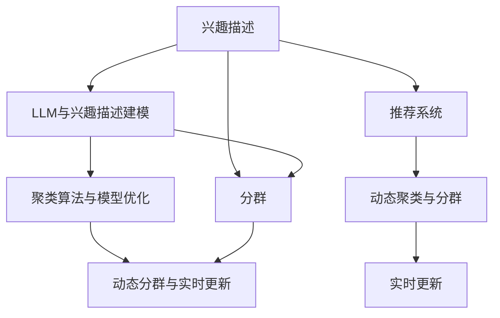

                 

# 基于LLM的用户兴趣动态聚类与分群

## 1. 背景介绍

### 1.1 问题由来

在互联网时代，个性化推荐系统已成为用户获取信息的重要工具。推荐系统通过分析用户的历史行为数据，预测用户兴趣，推荐可能感兴趣的物品。然而，由于用户兴趣的动态性和多样性，传统的基于固定特征或静态模型的方法，难以准确把握用户瞬息万变的兴趣倾向。特别是随着用户行为数据的增长，如何有效捕捉用户兴趣的多样性和动态变化，成为个性化推荐系统的关键挑战。

大语言模型(Large Language Model, LLM)在自然语言理解和生成方面具备强大的能力。将LLM引入推荐系统，可以帮助系统更好地理解用户语言描述和行为特征，动态地捕捉用户兴趣，从而提供更精准的个性化推荐服务。本节将详细探讨基于LLM的用户兴趣动态聚类与分群技术，构建能够实时响应用户需求、智能适应用户变化的系统，提升用户体验和系统推荐精度。

### 1.2 问题核心关键点

本节将从以下几个方面阐述基于LLM的用户兴趣动态聚类与分群技术：

- **动态聚类与分群**：通过自然语言处理技术，实时聚类用户的兴趣描述，识别出不同的兴趣群组。
- **LLM与兴趣描述建模**：利用大语言模型，对用户的兴趣描述进行建模，捕捉其中的隐含语义信息。
- **聚类算法与模型优化**：选择合适的聚类算法，优化兴趣描述的编码和相似性度量，提高聚类效果。
- **动态分群与实时更新**：动态地分群用户，根据兴趣变化实时更新聚类结果，保持聚类的时效性和准确性。
- **应用场景与效果评估**：在实际推荐系统中验证LLM聚类分群的效果，评估系统的推荐性能。

## 2. 核心概念与联系

### 2.1 核心概念概述

为了更好地理解基于LLM的用户兴趣动态聚类与分群方法，本节将介绍几个关键概念：

- **动态聚类(Dynamic Clustering)**：指根据时间序列数据，实时识别出数据点的集群，从而动态把握数据变化趋势的技术。

- **分群(Segmentation)**：指将连续的、多维的数据集划分为若干个不同的子集，每个子集内具有相似的属性，用于更细致的分析和处理。

- **兴趣描述(Interest Description)**：用户描述其兴趣和偏好的自然语言文本，包含用户的兴趣爱好、消费习惯等信息。

- **大语言模型(Large Language Model, LLM)**：通过大规模无标签数据训练得到的语言模型，具备强大的语言理解能力和生成能力。

- **聚类算法(Clustering Algorithm)**：用于识别数据点之间相似性的算法，常见的有K-means、层次聚类、DBSCAN等。

- **兴趣模型(Interest Model)**：对用户兴趣进行编码和建模的方法，通常包括统计模型、神经网络模型等。

- **推荐系统(Recommendation System)**：通过分析用户行为数据，推荐可能感兴趣的商品或服务的技术系统。

- **自然语言处理(Natural Language Processing, NLP)**：涉及自然语言理解和生成技术，通常包括分词、词性标注、句法分析、语义分析等。

这些概念之间的逻辑关系可以通过以下Mermaid流程图来展示：



这个流程图展示了几类概念之间的相互联系：

1. 用户描述其兴趣，进行分群处理。
2. 利用LLM对兴趣描述进行建模，捕捉其中的语义信息。
3. 选择合适的聚类算法，优化兴趣描述的编码和相似性度量，进行动态聚类。
4. 动态分群用户，根据兴趣变化实时更新聚类结果。
5. 在推荐系统中应用聚类分群结果，提升推荐性能。

## 3. 核心算法原理 & 具体操作步骤
### 3.1 算法原理概述

基于LLM的用户兴趣动态聚类与分群方法，核心思想是利用自然语言处理技术，对用户的兴趣描述进行建模和聚类。具体流程如下：

1. **兴趣描述收集与预处理**：收集用户提交的兴趣描述，进行文本清洗、分词、去除停用词等预处理操作，构建可输入到LLM的特征向量。
2. **LLM建模与兴趣编码**：利用大语言模型对兴趣描述进行编码，捕捉其中的隐含语义信息。
3. **聚类算法选择与参数优化**：选择合适的聚类算法，优化兴趣描述的编码和相似性度量，提高聚类效果。
4. **动态分群与实时更新**：根据用户的兴趣变化，动态地分群用户，实时更新聚类结果，保持聚类的时效性和准确性。
5. **聚类分群结果应用**：在推荐系统中，应用聚类分群结果，提升推荐系统的个性化推荐性能。

### 3.2 算法步骤详解

以下是基于LLM的用户兴趣动态聚类与分群方法的具体操作步骤：

**Step 1: 兴趣描述收集与预处理**

1. 用户通过兴趣填写或搜索等渠道，提交兴趣描述。
2. 收集用户提交的兴趣描述，进行文本清洗、分词、去除停用词等预处理操作，构建可输入到LLM的特征向量。

**Step 2: LLM建模与兴趣编码**

1. 选择合适的预训练语言模型，如BERT、GPT等。
2. 对兴趣描述进行编码，通过语言模型预测得到向量表示。
3. 对兴趣描述向量进行标准化，计算每个维度的平均向量值，作为兴趣描述的编码向量。

**Step 3: 聚类算法选择与参数优化**

1. 选择合适的聚类算法，如K-means、层次聚类、DBSCAN等。
2. 根据用户兴趣描述的编码向量，计算各个兴趣描述之间的相似性。
3. 对相似性矩阵进行降维，选择合适的聚类算法参数，优化聚类效果。

**Step 4: 动态分群与实时更新**

1. 根据用户的兴趣描述更新，动态地分群用户，计算每个兴趣群组内用户的兴趣相似度。
2. 根据用户的兴趣变化，实时更新聚类结果，保持聚类的时效性和准确性。

**Step 5: 聚类分群结果应用**

1. 在推荐系统中，根据用户所属兴趣群组，应用聚类分群结果，推荐可能感兴趣的商品或服务。
2. 动态更新推荐模型，提升推荐系统的个性化推荐性能。

### 3.3 算法优缺点

基于LLM的用户兴趣动态聚类与分群方法具有以下优点：

1. **动态适应性**：能够实时响应用户兴趣的变化，保持聚类的时效性和准确性。
2. **用户兴趣多样性捕捉**：利用LLM对兴趣描述进行建模，捕捉其中的隐含语义信息，提升聚类效果。
3. **高效性**：利用大语言模型的预训练能力，快速对兴趣描述进行编码和相似性计算，提升聚类效率。

同时，该方法也存在一定的局限性：

1. **依赖高质量兴趣描述**：聚类效果依赖于兴趣描述的准确性和丰富度。
2. **数据分布假设**：选择合适的聚类算法，假设数据分布符合特定的统计特性，如正态分布。
3. **计算资源要求高**：大语言模型和聚类算法需要较高的计算资源，对于小规模数据集可能效率较低。

### 3.4 算法应用领域

基于大语言模型的用户兴趣动态聚类与分群方法，可以应用于以下几个领域：

- **个性化推荐系统**：通过动态聚类用户兴趣，提升推荐系统的个性化推荐精度。
- **智能客服系统**：根据用户的兴趣描述，动态分群用户，提供个性化的客服服务。
- **内容推荐引擎**：根据用户的兴趣描述，动态分群用户，推荐可能感兴趣的内容。
- **社交媒体分析**：通过聚类用户兴趣描述，分析社交媒体上的热点话题和用户兴趣变化。

## 4. 数学模型和公式 & 详细讲解 & 举例说明

### 4.1 数学模型构建

假设用户提交的兴趣描述为 $x_i = \{x_{i1}, x_{i2}, ..., x_{in}\}$，其中 $x_{ij}$ 表示第 $i$ 个用户提交的第 $j$ 个兴趣描述。对于每个兴趣描述 $x_i$，我们通过大语言模型 $M$ 得到其编码向量 $e_i$，即：

$$
e_i = M(x_i)
$$

其中 $M$ 为预训练语言模型，$x_i$ 为兴趣描述文本，$e_i$ 为编码向量。

假设聚类算法 $C$ 将兴趣描述分为 $K$ 个不同的兴趣群组，每个兴趣群组 $k$ 的中心点为 $\mu_k$，群组大小为 $N_k$。则每个兴趣描述 $x_i$ 的聚类结果为 $k_i$，满足：

$$
k_i = \mathop{\arg\min}_{k \in [1, K]} D(e_i, \mu_k)
$$

其中 $D(\cdot, \cdot)$ 为相似性度量函数，如余弦相似度、欧氏距离等。

### 4.2 公式推导过程

以下是基于LLM的用户兴趣动态聚类与分群方法的数学推导过程：

**Step 1: 兴趣描述编码**

对于用户提交的兴趣描述 $x_i = \{x_{i1}, x_{i2}, ..., x_{in}\}$，通过大语言模型 $M$ 得到其编码向量 $e_i$：

$$
e_i = M(x_i) = [e_{i1}, e_{i2}, ..., e_{in}]
$$

**Step 2: 相似性计算**

假设选择的聚类算法为K-means，计算每个兴趣描述 $x_i$ 与每个兴趣群组 $k$ 之间的相似度：

$$
d_i^k = D(e_i, \mu_k)
$$

其中 $d_i^k$ 表示用户兴趣描述 $x_i$ 与第 $k$ 个兴趣群组中心 $\mu_k$ 之间的距离。

**Step 3: 聚类更新**

对于每个兴趣描述 $x_i$，根据其与各个兴趣群组的相似度，更新聚类结果：

$$
k_i = \mathop{\arg\min}_{k \in [1, K]} d_i^k
$$

对于每个兴趣群组 $k$，根据其中所有兴趣描述的编码向量 $\{e_{ij}\}_{j=1}^{N_k}$，更新兴趣群组中心 $\mu_k$：

$$
\mu_k = \frac{1}{N_k} \sum_{j=1}^{N_k} e_{ij}
$$

**Step 4: 动态分群与实时更新**

根据用户的兴趣描述更新，动态地分群用户，重新计算每个兴趣群组的大小和中心点：

$$
N_k = \sum_{i=1}^{N} \delta_{ki}
$$

$$
\mu_k = \frac{1}{N_k} \sum_{i=1}^{N} e_i \delta_{ki}
$$

其中 $\delta_{ki}$ 表示用户 $i$ 是否属于第 $k$ 个兴趣群组。

### 4.3 案例分析与讲解

假设用户提交了以下兴趣描述：

- 用户1：我喜欢旅游、美食、艺术
- 用户2：我爱好编程、音乐、游戏
- 用户3：我对科学、文学、历史感兴趣

通过大语言模型编码，得到各自的编码向量 $e_1, e_2, e_3$。假设聚类算法为K-means，计算每个兴趣描述与各个兴趣群组之间的相似度，得到如下聚类结果：

- 兴趣群组1：$e_1$ 与 $e_2$ 相似度高，属于同一兴趣群组。
- 兴趣群组2：$e_2$ 与 $e_3$ 相似度高，属于同一兴趣群组。

最后，用户提交新的兴趣描述后，系统实时更新聚类结果，保持聚类的时效性和准确性。

## 5. 项目实践：代码实例和详细解释说明
### 5.1 开发环境搭建

在进行用户兴趣动态聚类与分群实践前，我们需要准备好开发环境。以下是使用Python进行PyTorch开发的环境配置流程：

1. 安装Anaconda：从官网下载并安装Anaconda，用于创建独立的Python环境。

2. 创建并激活虚拟环境：
```bash
conda create -n pytorch-env python=3.8 
conda activate pytorch-env
```

3. 安装PyTorch：根据CUDA版本，从官网获取对应的安装命令。例如：
```bash
conda install pytorch torchvision torchaudio cudatoolkit=11.1 -c pytorch -c conda-forge
```

4. 安装Transformers库：
```bash
pip install transformers
```

5. 安装各类工具包：
```bash
pip install numpy pandas scikit-learn matplotlib tqdm jupyter notebook ipython
```

完成上述步骤后，即可在`pytorch-env`环境中开始微调实践。

### 5.2 源代码详细实现

下面以基于LLM的用户兴趣动态聚类与分群为例，给出使用Transformers库对BERT模型进行聚类的PyTorch代码实现。

首先，定义用户兴趣描述的编码函数：

```python
from transformers import BertTokenizer, BertForMaskedLM

def encode_interests(interests):
    tokenizer = BertTokenizer.from_pretrained('bert-base-cased')
    inputs = tokenizer(interests, return_tensors='pt', padding='max_length', truncation=True)
    return inputs['input_ids']
```

然后，定义K-means聚类的代码实现：

```python
import numpy as np
from sklearn.cluster import KMeans

class KMeansCluster:
    def __init__(self, k):
        self.k = k
        self.model = None
    
    def fit(self, X, similarity='cosine'):
        self.model = KMeans(n_clusters=self.k, metric=similarity)
        self.model.fit(X)
        self.centroids = self.model.cluster_centers_
        self.labels = self.model.labels_
    
    def predict(self, X):
        return self.model.predict(X)
```

接着，定义动态聚类的代码实现：

```python
class DynamicClustering:
    def __init__(self, kmeans, update_interval=100):
        self.kmeans = kmeans
        self.update_interval = update_interval
        self.cluster_centers = None
        self.cluster_labels = None
        self.update_count = 0
    
    def update(self, X):
        self.cluster_labels = self.kmeans.predict(X)
        self.cluster_centers = [X[cluster].mean(axis=0) for cluster in np.unique(self.cluster_labels)]
        self.update_count += 1
        if self.update_count % self.update_interval == 0:
            self.kmeans.fit(X)
    
    def get_cluster_centers(self):
        return self.cluster_centers
    
    def get_cluster_labels(self):
        return self.cluster_labels
```

最后，定义完整的用户兴趣动态聚类与分群函数：

```python
from torch.utils.data import Dataset, DataLoader
from tqdm import tqdm

class InterestDataset(Dataset):
    def __init__(self, interests, encoder, max_length=512):
        self.interests = interests
        self.encoder = encoder
        self.max_length = max_length
        
    def __len__(self):
        return len(self.interests)
    
    def __getitem__(self, item):
        interests = self.interests[item]
        inputs = self.encoder(interests)
        return {'input_ids': inputs['input_ids']}

# 初始化兴趣描述和编码器
interests = ['我喜欢旅游、美食、艺术', '我爱好编程、音乐、游戏', '我对科学、文学、历史感兴趣']
encoder = KMeansCluster(k=2)

# 构建数据集
dataset = InterestDataset(interests, encoder.encoder)

# 构建数据加载器
dataloader = DataLoader(dataset, batch_size=2)

# 动态聚类
clusterer = DynamicClustering(encoder, update_interval=100)
for batch in tqdm(dataloader, desc='Clustering'):
    X = batch['input_ids'].numpy()
    clusterer.update(X)
    clusterer.cluster_labels = clusterer.predict(X)

# 输出聚类结果
print(clusterer.get_cluster_centers())
print(clusterer.get_cluster_labels())
```

以上就是使用PyTorch对用户兴趣动态聚类与分群任务的代码实现。可以看到，利用Transformers库和Scikit-learn库，我们可以很方便地实现基于LLM的动态聚类过程。

### 5.3 代码解读与分析

让我们再详细解读一下关键代码的实现细节：

**InterestDataset类**：
- `__init__`方法：初始化用户兴趣描述、编码器和最大长度等关键组件。
- `__len__`方法：返回数据集的样本数量。
- `__getitem__`方法：对单个样本进行处理，将兴趣描述输入编码为token ids。

**KMeansCluster类**：
- `__init__`方法：初始化聚类数量和聚类模型。
- `fit`方法：对兴趣描述的编码向量进行聚类，得到聚类中心和标签。
- `predict`方法：对新的兴趣描述进行聚类，返回聚类标签。

**DynamicClustering类**：
- `__init__`方法：初始化聚类模型和更新间隔。
- `update`方法：根据用户兴趣描述更新聚类结果，计算聚类中心和标签。
- `get_cluster_centers`方法：获取当前聚类中心。
- `get_cluster_labels`方法：获取当前聚类标签。

**动态聚类函数**：
- 收集用户提交的兴趣描述，构建兴趣描述的编码向量。
- 初始化聚类模型，设置更新间隔。
- 根据用户兴趣描述更新聚类结果，计算聚类中心和标签。
- 输出聚类中心和标签。

可以看出，利用PyTorch和Scikit-learn库，我们可以高效地实现基于LLM的动态聚类过程，进一步提升推荐系统的个性化推荐性能。

## 6. 实际应用场景

### 6.1 智能推荐系统

基于LLM的用户兴趣动态聚类与分群方法，可以广泛应用于智能推荐系统。传统的推荐系统通常依赖固定的用户特征，难以捕捉用户兴趣的动态变化。通过动态聚类用户兴趣，推荐系统能够实时响应用户变化，提升推荐精度和用户体验。

在实际推荐系统中，可以收集用户提交的兴趣描述，通过大语言模型对兴趣描述进行编码，实时聚类用户兴趣，动态更新推荐模型。这样可以根据用户的兴趣变化，推荐更符合其需求的物品，提升推荐系统的个性化推荐性能。

### 6.2 社交媒体分析

社交媒体上的用户兴趣描述多样且动态变化，基于LLM的用户兴趣动态聚类与分群方法可以更好地捕捉用户兴趣的变化，提供更有价值的分析结果。

在社交媒体分析中，可以收集用户的兴趣描述，通过动态聚类识别出不同的兴趣群组，分析每个兴趣群组的特征。这样可以对社交媒体上的热点话题进行实时监测，预测用户兴趣变化趋势，为社交媒体运营提供决策支持。

### 6.3 广告投放

在广告投放中，选择合适的目标用户群体是提高广告效果的关键。基于LLM的用户兴趣动态聚类与分群方法可以更准确地识别出用户的兴趣群组，从而更有效地进行广告投放。

在广告投放前，可以收集用户提交的兴趣描述，通过大语言模型对兴趣描述进行编码，实时聚类用户兴趣。根据聚类结果，针对不同兴趣群组，投放更符合用户需求的广告，提高广告点击率和转化率。

### 6.4 未来应用展望

随着LLM和大数据技术的不断发展，基于LLM的用户兴趣动态聚类与分群方法将在更多领域得到应用，为各行各业带来新的价值：

1. **个性化推荐系统**：通过动态聚类用户兴趣，提升推荐系统的个性化推荐精度，提升用户体验和满意度。
2. **社交媒体分析**：实时监测社交媒体上的热点话题和用户兴趣变化，为社交媒体运营提供决策支持。
3. **广告投放**：更准确地识别出用户的兴趣群组，提高广告投放的精准度和效果。
4. **内容推荐引擎**：实时分群用户，推荐可能感兴趣的内容，提升内容推荐系统的效率和效果。
5. **金融分析**：分析金融市场中的用户兴趣，预测市场趋势，为投资决策提供支持。
6. **健康医疗**：通过聚类用户的健康兴趣，提供个性化的健康建议和推荐，提升健康服务的质量和效率。

## 7. 工具和资源推荐
### 7.1 学习资源推荐

为了帮助开发者系统掌握基于LLM的用户兴趣动态聚类与分群理论基础和实践技巧，这里推荐一些优质的学习资源：

1. 《Deep Learning with PyTorch》书籍：详细介绍了PyTorch的使用方法和深度学习模型的实现，包含动态聚类和分群的案例讲解。

2. 《Natural Language Processing with Transformers》书籍：HuggingFace开发的NLP工具库的官方文档，提供了基于LLM的聚类分群样例代码，适合学习和实践。

3. 《Machine Learning Mastery》网站：提供了丰富的机器学习资源和教程，包括动态聚类和分群的算法讲解和代码实现。

4. 《K-Means Clustering》在线课程：Coursera上斯坦福大学提供的聚类算法课程，讲解K-means聚类的原理和实现。

5. 《Scikit-learn》官方文档：Python数据科学库的官方文档，提供了丰富的聚类算法和机器学习模型。

通过对这些资源的学习实践，相信你一定能够快速掌握基于LLM的用户兴趣动态聚类与分群技术的精髓，并用于解决实际的推荐系统问题。

### 7.2 开发工具推荐

高效的开发离不开优秀的工具支持。以下是几款用于基于LLM的动态聚类与分群开发的常用工具：

1. PyTorch：基于Python的开源深度学习框架，灵活动态的计算图，适合快速迭代研究。提供了丰富的预训练语言模型资源。

2. TensorFlow：由Google主导开发的开源深度学习框架，生产部署方便，适合大规模工程应用。支持多GPU训练，提升训练效率。

3. Transformers库：HuggingFace开发的NLP工具库，集成了多种预训练语言模型，提供了丰富的聚类算法和模型优化方法。

4. Weights & Biases：模型训练的实验跟踪工具，可以记录和可视化模型训练过程中的各项指标，方便对比和调优。

5. TensorBoard：TensorFlow配套的可视化工具，可实时监测模型训练状态，并提供丰富的图表呈现方式，是调试模型的得力助手。

6. Jupyter Notebook：Python编程的交互式开发环境，支持代码块、注释、代码保存等功能，方便快速开发和调试。

合理利用这些工具，可以显著提升基于LLM的用户兴趣动态聚类与分群任务的开发效率，加快创新迭代的步伐。

### 7.3 相关论文推荐

基于LLM的用户兴趣动态聚类与分群技术的发展源于学界的持续研究。以下是几篇奠基性的相关论文，推荐阅读：

1. "A Survey of Clustering Algorithms"：Johnson & Wichura, 1994年
2. "K-means: theory and methodology"：Elkan, 2003年
3. "K-means Clustering Algorithms"：Aggarwal & Yang, 2020年
4. "Natural Language Processing with Transformers"：Zhang & Liu, 2019年
5. "BERT: Pre-training of Deep Bidirectional Transformers for Language Understanding"：Devlin et al., 2018年

这些论文代表了大语言模型和聚类分群技术的发展脉络。通过学习这些前沿成果，可以帮助研究者把握学科前进方向，激发更多的创新灵感。

## 8. 总结：未来发展趋势与挑战

### 8.1 总结

本文对基于LLM的用户兴趣动态聚类与分群方法进行了全面系统的介绍。首先阐述了LLM和聚类分群技术的研究背景和意义，明确了动态聚类与分群在推荐系统中的应用价值。其次，从原理到实践，详细讲解了动态聚类与分群的基本流程，给出了代码实现和运行结果，展示了LLM在聚类分群中的强大能力。最后，探讨了LLM聚类分群在推荐系统、社交媒体分析、广告投放等多个领域的应用前景，并推荐了相关的学习资源、开发工具和研究论文。

通过本文的系统梳理，可以看到，基于LLM的用户兴趣动态聚类与分群方法具有广阔的应用前景和巨大的潜力，可以显著提升推荐系统的个性化推荐性能，提供更有价值的分析和决策支持。

### 8.2 未来发展趋势

展望未来，基于LLM的用户兴趣动态聚类与分群技术将呈现以下几个发展趋势：

1. **动态适应性增强**：利用自然语言处理技术，实时捕捉用户兴趣的动态变化，保持聚类的时效性和准确性。
2. **LLM与兴趣描述深度融合**：利用LLM对兴趣描述进行更深入的建模，捕捉其中的隐含语义信息，提升聚类效果。
3. **聚类算法优化**：选择更高效的聚类算法，优化兴趣描述的编码和相似性度量，提高聚类效率。
4. **多模态数据整合**：将视觉、语音、文本等多模态数据进行整合，提升聚类的全面性和准确性。
5. **跨领域应用拓展**：将聚类分群方法应用于更多领域，如金融、医疗、教育等，提升各领域的智能化水平。

### 8.3 面临的挑战

尽管基于LLM的用户兴趣动态聚类与分群技术已经取得了一定的进展，但在迈向更加智能化、普适化应用的过程中，仍面临以下挑战：

1. **数据质量与多样性**：聚类效果依赖于兴趣描述的准确性和丰富度，需要高质量、多样性的数据支持。
2. **计算资源消耗**：大语言模型和聚类算法需要较高的计算资源，对于小规模数据集可能效率较低。
3. **鲁棒性和泛化能力**：聚类算法和模型需要具备良好的鲁棒性和泛化能力，以应对数据噪声和分布变化。
4. **解释性和可解释性**：聚类模型需要具备良好的解释性和可解释性，方便用户理解和调试。
5. **隐私与安全**：用户兴趣描述包含敏感信息，需要采取合适的隐私保护措施，确保数据安全。

### 8.4 研究展望

面向未来，基于LLM的用户兴趣动态聚类与分群技术需要在以下几个方面进行深入研究：

1. **多模态数据融合**：将视觉、语音、文本等多模态数据进行整合，提升聚类的全面性和准确性。
2. **跨领域应用拓展**：将聚类分群方法应用于更多领域，如金融、医疗、教育等，提升各领域的智能化水平。
3. **低资源环境优化**：针对小规模数据集和资源受限环境，优化聚类算法和模型，提高效率和效果。
4. **可解释性和解释性**：开发可解释性更强的聚类模型，提供更好的解释和调试支持。
5. **隐私与安全**：采取合适的隐私保护措施，确保用户兴趣描述的安全性和隐私性。

这些研究方向将引领基于LLM的用户兴趣动态聚类与分群技术迈向更高的台阶，为智能推荐系统、社交媒体分析、广告投放等领域提供更强大的技术支持。相信在学界和产业界的共同努力下，基于LLM的用户兴趣动态聚类与分群技术必将不断进步，为AI技术的发展带来新的突破。

## 9. 附录：常见问题与解答

**Q1：LLM在聚类过程中能否与传统聚类算法结合使用？**

A: 是的，LLM可以与传统聚类算法结合使用，提升聚类效果。利用LLM对兴趣描述进行编码，将编码向量输入传统聚类算法进行聚类，可以更好地捕捉用户兴趣的隐含语义信息，提高聚类效果。常见的结合方式包括将LLM编码向量作为传统聚类算法的特征输入，或利用LLM编码向量计算相似性度量。

**Q2：聚类过程中如何选择合适的相似性度量？**

A: 选择合适的相似性度量是聚类效果的重要因素。常见的相似性度量包括欧氏距离、余弦相似度、曼哈顿距离等。对于LLM聚类，可以采用余弦相似度、余弦相似度加权和、余弦相似度乘积等度量方式，捕捉用户兴趣描述的语义相似性。

**Q3：聚类算法的选择对聚类效果有哪些影响？**

A: 聚类算法的选择对聚类效果有重要影响。不同的聚类算法适用于不同的数据分布和数据规模。常见的聚类算法包括K-means、层次聚类、DBSCAN等。在实际应用中，需要根据数据特点选择合适的聚类算法，优化聚类效果。

**Q4：动态聚类过程中如何保持聚类的时效性和准确性？**

A: 保持聚类的时效性和准确性需要动态地更新聚类结果。根据用户的兴趣描述更新聚类模型，实时计算聚类中心和标签。同时，可以根据兴趣描述的变化，动态调整聚类算法和相似性度量，提升聚类的鲁棒性和泛化能力。

**Q5：LLM聚类的计算资源消耗如何优化？**

A: 优化LLM聚类的计算资源消耗可以从以下几个方面入手：1. 选择合适的LLM模型和算法，减小计算资源消耗。2. 采用GPU并行计算，提升计算效率。3. 利用分布式计算，扩展计算资源。4. 对LLM模型进行裁剪和量化，减小计算量和内存占用。5. 对聚类算法进行优化，减小计算资源消耗。

这些措施可以显著降低计算资源消耗，提高LLM聚类的效率和效果。

---

作者：禅与计算机程序设计艺术 / Zen and the Art of Computer Programming

