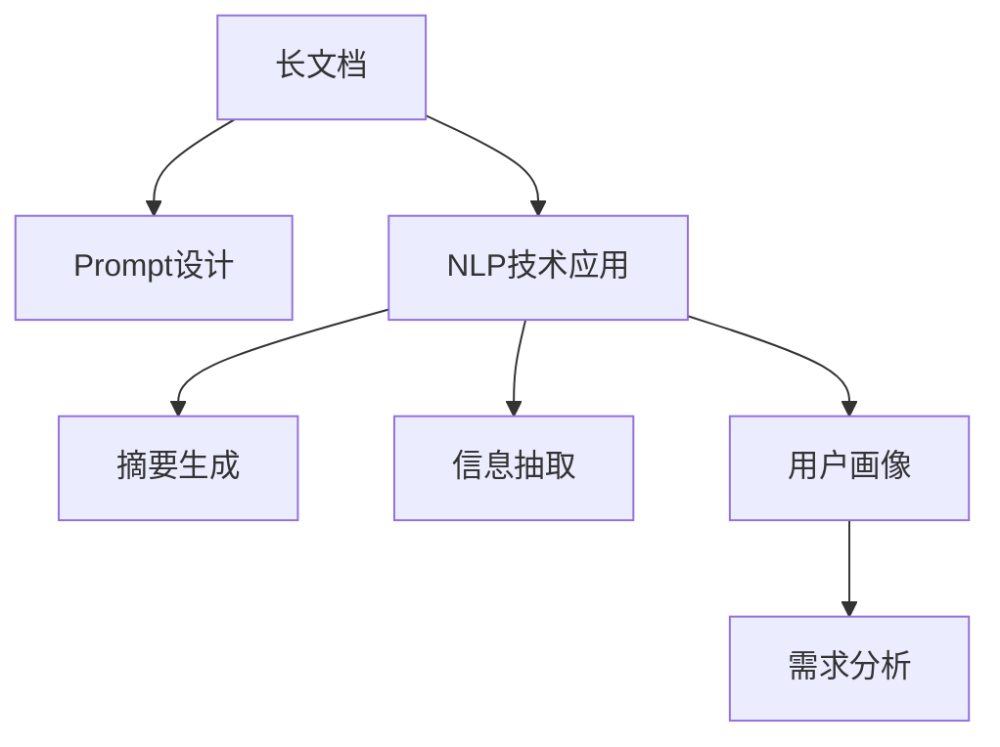

                 

# 基于Prompt的长文档总结与用户画像技术

> 关键词：长文档，Prompt，自然语言处理(NLP)，用户画像，信息提取

## 1. 背景介绍

### 1.1 问题由来
随着互联网内容的爆炸性增长，长文档和深度内容的阅读成为人们的日常需求。无论是学术论文、报告、新闻，还是用户评论、日志、摘要，长文档无处不在。如何高效、精准地从这些文本中提取关键信息、理解用户需求、构建用户画像，成为信息时代的重要挑战。

长文档的阅读和理解涉及文本理解、信息抽取、语义分析等多个自然语言处理(NLP)任务。传统的文本分类、关键词提取等方法往往难以应对长文档的复杂性和多样性。而基于Prompt的微调方法，通过精巧设计输入文本的格式，可以有效提升长文档处理效果，同时构建出更为准确的自然语言理解系统。

### 1.2 问题核心关键点
针对长文档处理和用户画像构建的挑战，本文聚焦于以下核心关键点：
- **长文档理解与摘要生成**：如何快速、准确地从长文档中提取出关键信息，并生成精炼的摘要。
- **用户画像与需求分析**：如何通过长文档信息，构建用户画像并分析用户需求。
- **Prompt设计原则**：精妙设计Prompt模板，提高模型对长文档的理解能力和摘要生成效果。

通过理解这些核心关键点，本文将对基于Prompt的长文档处理和用户画像构建方法进行全面剖析，展示其原理和应用效果。

### 1.3 问题研究意义
在信息爆炸的今天，长文档处理和用户画像构建技术的研究，对于提升内容获取效率、个性化推荐、市场分析等诸多领域具有重要意义：

1. **提升信息获取效率**：长文档的处理能够大幅缩短信息检索和理解的时间，提高工作和学习效率。
2. **个性化推荐**：精准的用户画像构建能够提供更具针对性的推荐内容，提升用户体验。
3. **市场分析**：通过长文档信息的深入分析，洞察市场趋势，辅助企业决策。
4. **增强知识传播**：精炼的摘要和用户画像能更好地将复杂知识传递给非专业读者，促进知识普及。

## 2. 核心概念与联系

### 2.1 核心概念概述

为更好地理解基于Prompt的长文档处理和用户画像构建方法，本节将介绍几个密切相关的核心概念：

- **长文档**：指长度较长的文本数据，如学术论文、报告、新闻、用户评论等。
- **Prompt**：指在模型输入中提供的上下文信息，用于引导模型理解输入文本的含义。
- **自然语言处理(NLP)**：指使用计算机处理和理解人类语言的技术，涵盖文本理解、信息抽取、语言生成等。
- **用户画像**：指通过分析用户行为数据，构建出用户个性特征和兴趣偏好的画像，用于用户研究和个性化推荐。
- **信息抽取**：指从文本中提取结构化信息的NLP任务，如实体识别、关系抽取等。

这些核心概念之间的逻辑关系可以通过以下Mermaid流程图来展示：



这个流程图展示出长文档处理和用户画像构建的基本流程：

1. 长文档通过Prompt设计进行预处理。
2. 应用NLP技术，从长文档中生成摘要和抽取信息。
3. 利用信息抽取结果，构建用户画像。
4. 通过对用户画像的分析，进一步挖掘用户需求。

这些概念共同构成了长文档处理和用户画像构建的完整框架，有助于我们更全面地把握技术的核心和应用方向。

## 3. 核心算法原理 & 具体操作步骤
### 3.1 算法原理概述

基于Prompt的长文档处理和用户画像构建方法，本质上是一种融合了自然语言理解和信息抽取技术的自动化过程。其核心思想是：通过精妙设计的Prompt模板，引导模型对长文档进行深入理解，抽取关键信息，并基于这些信息构建用户画像。

形式化地，假设长文档为 $D=\{x_1,x_2,\cdots,x_n\}$，其中 $x_i$ 为第 $i$ 个句子，长度可能远超千字。我们的目标是设计合适的Prompt模板 $P$，使得模型能够理解文档的语义结构，抽取关键信息，并生成精炼的摘要。

具体步骤如下：
1. 设计Prompt模板，包括摘要引导词、信息抽取标签等。
2. 将长文档与Prompt模板拼接，作为模型的输入。
3. 应用NLP技术，抽取摘要和关键信息。
4. 根据抽取结果，构建用户画像。

### 3.2 算法步骤详解

基于Prompt的长文档处理和用户画像构建方法一般包括以下几个关键步骤：

**Step 1: Prompt设计**
- 根据长文档的特征，设计合适的Prompt模板。通常包括摘要引导词、实体抽取标签等。
- 确保Prompt模板能够引导模型关注文档的关键内容，并生成有意义的输出。

**Step 2: 数据预处理**
- 对长文档进行分句、分词、去除停用词等预处理，便于模型理解。
- 根据Prompt模板，将长文档划分为多个段落，每个段落包括引导词和段落内容。

**Step 3: 模型训练与微调**
- 选择合适的预训练模型，如BERT、GPT等，进行微调。微调时使用长文档段落作为输入，Prompt模板作为上下文。
- 训练模型以生成摘要、抽取实体等信息。

**Step 4: 信息抽取与用户画像构建**
- 应用训练好的模型，对长文档进行信息抽取，如实体识别、关系抽取等。
- 根据抽取结果，结合用户行为数据，构建用户画像。

**Step 5: 需求分析与个性化推荐**
- 通过分析用户画像，挖掘用户兴趣和需求。
- 基于用户需求，生成个性化推荐内容。

### 3.3 算法优缺点

基于Prompt的长文档处理和用户画像构建方法具有以下优点：
1. **高效灵活**：Prompt设计灵活，能够快速适配不同的长文档处理需求。
2. **精准性强**：通过精妙设计的Prompt模板，模型能够更好地理解长文档，抽取关键信息。
3. **自动化程度高**：自动化提取长文档摘要和信息，减少了人工处理的成本。
4. **易扩展**：基于通用预训练模型进行微调，易于扩展到更多应用场景。

同时，该方法也存在一定的局限性：
1. **Prompt设计复杂**：需要根据具体任务设计合适的Prompt模板，设计不当可能影响模型性能。
2. **依赖数据质量**：长文档质量不一，依赖数据预处理和Prompt设计的精准性。
3. **模型依赖性强**：预训练模型的性能直接影响长文档处理效果。

尽管存在这些局限性，但就目前而言，基于Prompt的微调方法仍是大文档处理和用户画像构建的重要范式。未来相关研究的重点在于如何进一步简化Prompt设计，提高模型的泛化能力，同时兼顾可解释性和伦理安全性等因素。

### 3.4 算法应用领域

基于Prompt的长文档处理和用户画像构建方法，在NLP领域已经得到了广泛的应用，覆盖了多个核心任务，如：

- **长文档摘要**：自动生成长文档的摘要，提供精炼的阅读体验。
- **用户画像构建**：从用户评论、日志中提取信息，构建用户画像。
- **需求分析**：从用户评论、反馈中挖掘用户需求，辅助产品优化。
- **智能客服**：基于用户评论，生成响应模板，提高客服效率。
- **内容推荐**：从用户画像中提取兴趣，生成个性化推荐内容。

除了上述这些经典任务外，长文档处理和用户画像构建技术还被创新性地应用到更多场景中，如知识图谱构建、情感分析、文本分类等，为NLP技术带来了全新的突破。随着预训练模型和Prompt设计的不断进步，相信长文档处理和用户画像构建技术将在更广阔的应用领域大放异彩。

## 4. 数学模型和公式 & 详细讲解  
### 4.1 数学模型构建

本节将使用数学语言对基于Prompt的长文档处理和用户画像构建方法进行更加严格的刻画。

假设长文档为 $D=\{x_1,x_2,\cdots,x_n\}$，其中 $x_i$ 为第 $i$ 个句子。假设模型为 $M_{\theta}$，其中 $\theta$ 为模型参数。

定义Prompt模板为 $P=\{p_1,p_2,\cdots,p_m\}$，其中 $p_i$ 为第 $i$ 个Prompt子句。

**摘要生成目标**：给定长文档和Prompt模板，模型应输出一个精炼的摘要 $Y$。

**信息抽取目标**：给定长文档和Prompt模板，模型应输出文档中所有关键信息 $Y$。

数学模型构建如下：

- **摘要生成模型**：
  $$
  Y = M_{\theta}(D,P)
  $$

- **信息抽取模型**：
  $$
  Y = M_{\theta}(D,P)
  $$

其中，$D$ 为长文档，$P$ 为Prompt模板，$Y$ 为摘要或关键信息。

### 4.2 公式推导过程

以摘要生成为例，我们推导Prompt引导下的摘要生成模型。

假设Prompt模板为：
$$
P = \{\text{“Summarize:”}, x_1, \text{“,”}, x_2, \text{“.”}, \cdots, x_n, \text{“.”}\}
$$

其中，$\text{“Summarize:”}$ 为摘要引导词，$x_i$ 为长文档中的句子。

模型输入 $X$ 为：
$$
X = \text{“Summarize:”} \text{ } x_1 \text{ } \text{“,”} \text{ } x_2 \text{ } \text{“.”} \cdots \text{ } x_n \text{ } \text{“.”}
$$

模型输出的摘要 $Y$ 为：
$$
Y = M_{\theta}(X)
$$

假设模型的抽象表示为：
$$
M_{\theta}(X) = \text{“The summary of the document is:”} \text{ } \hat{y}_1 \text{ } \text{“,”} \text{ } \hat{y}_2 \text{ } \text{“.”} \cdots \text{ } \hat{y}_n \text{ } \text{“.”}
$$

其中，$\hat{y}_i$ 为模型生成的第 $i$ 个摘要句。

通过上述推导，我们可以看到，模型生成的摘要是由Prompt引导的，能够更准确地反映长文档的语义结构。

### 4.3 案例分析与讲解

**案例1：长文档摘要生成**

假设有一个长度为1000字的文章，内容涉及生物学、化学、医学等多个领域的最新研究进展。我们希望通过基于Prompt的方法，生成文章的精炼摘要，便于读者快速了解关键内容。

**Prompt设计**：
$$
P = \{\text{“Summary:”}, \text{“The key findings are:”}, \text{“.”}, x_1, \text{“.”}, x_2, \text{“.”}, \cdots, x_{n-1}, \text{“.”}, x_n, \text{“.”}\}
$$

**模型输入**：
$$
X = \text{“Summary:”} \text{ } \text{“The key findings are:”} \text{ } \text{“.”} \text{ } x_1 \text{ } \text{“.”} \text{ } x_2 \text{ } \text{“.”} \cdots \text{ } x_{n-1} \text{ } \text{“.”} \text{ } x_n \text{ } \text{“.”}
$$

**模型输出**：
$$
Y = M_{\theta}(X) = \text{“The key findings are:”} \text{ } \hat{y}_1 \text{ } \text{“.”} \text{ } \hat{y}_2 \text{ } \text{“.”} \cdots \text{ } \hat{y}_{n-1} \text{ } \text{“.”} \text{ } \hat{y}_n \text{ } \text{“.”}
$$

**摘要结果**：
假设模型输出摘要如下：
$$
Y = \text{“The key findings are:”} \text{ } \text{“Biological research has shown that...”} \text{ } \text{“Chemical advancements have...”} \text{ } \text{“Medical discoveries have...”}
$$

可以看出，摘要能够清晰地概括长文档的关键内容，便于读者快速理解。

**案例2：用户画像构建**

假设我们有一批用户的评论数据，每个评论包含了用户对产品或服务的反馈和评价。我们希望通过Prompt方法，构建用户画像，分析用户的兴趣和需求。

**Prompt设计**：
$$
P = \{\text{“Favorite features:”}, x_1, \text{“,”}, x_2, \text{“.”}, \cdots, x_n, \text{“.”}\}
$$

**模型输入**：
$$
X = \text{“Favorite features:”} \text{ } x_1 \text{ } \text{“,”} \text{ } x_2 \text{ } \text{“.”} \cdots \text{ } x_n \text{ } \text{“.”}
$$

**模型输出**：
$$
Y = M_{\theta}(X) = \text{“Favorite features are:”} \text{ } \hat{y}_1 \text{ } \text{“,”} \text{ } \hat{y}_2 \text{ } \text{“.”} \cdots \text{ } \hat{y}_n \text{ } \text{“.”}
$$

**用户画像构建**：
假设模型输出如下：
$$
Y = \text{“Favorite features are:”} \text{ } \text{“UI design”} \text{ } \text{“Customer service”} \text{ } \text{“Price”}
$$

根据输出结果，可以进一步分析用户的兴趣和需求，为产品优化和推荐提供依据。

## 5. 项目实践：代码实例和详细解释说明
### 5.1 开发环境搭建

在进行Prompt方法实践前，我们需要准备好开发环境。以下是使用Python进行PyTorch开发的环境配置流程：

1. 安装Anaconda：从官网下载并安装Anaconda，用于创建独立的Python环境。

2. 创建并激活虚拟环境：
```bash
conda create -n prompt-env python=3.8 
conda activate prompt-env
```

3. 安装PyTorch：根据CUDA版本，从官网获取对应的安装命令。例如：
```bash
conda install pytorch torchvision torchaudio cudatoolkit=11.1 -c pytorch -c conda-forge
```

4. 安装Transformers库：
```bash
pip install transformers
```

5. 安装各类工具包：
```bash
pip install numpy pandas scikit-learn matplotlib tqdm jupyter notebook ipython
```

完成上述步骤后，即可在`prompt-env`环境中开始Prompt方法实践。

### 5.2 源代码详细实现

下面我以长文档摘要生成为例，给出使用Transformers库对BERT模型进行Prompt引导下的微调的PyTorch代码实现。

首先，定义长文档的处理函数：

```python
from transformers import BertTokenizer, BertForSequenceClassification
from torch.utils.data import Dataset
import torch

class Document(Dataset):
    def __init__(self, documents, tokenizer, max_len=128):
        self.documents = documents
        self.tokenizer = tokenizer
        self.max_len = max_len
        
    def __len__(self):
        return len(self.documents)
    
    def __getitem__(self, item):
        document = self.documents[item]
        tokenized = self.tokenizer(document, return_tensors='pt', max_length=self.max_len, padding='max_length', truncation=True)
        input_ids = tokenized['input_ids']
        attention_mask = tokenized['attention_mask']
        
        return {'input_ids': input_ids, 
                'attention_mask': attention_mask}

# 加载预训练的BERT模型
tokenizer = BertTokenizer.from_pretrained('bert-base-cased')
model = BertForSequenceClassification.from_pretrained('bert-base-cased', num_labels=1)

# 创建数据集
documents = [
    "This is a long document about biology, chemistry, and medicine.",
    "Here are some recent discoveries in these fields.",
    "These findings have significant implications for research and practice."
]

dataset = Document(documents, tokenizer)
```

然后，定义Prompt模板和摘要生成函数：

```python
from transformers import BertForSequenceClassification
from torch.utils.data import DataLoader
from tqdm import tqdm
from sklearn.metrics import accuracy_score, precision_score, recall_score, f1_score

def generate_summary(document, tokenizer, model, max_len=128):
    document = document + "\n\n" # 增加两行空行分隔文档段落
    prompt = "Summary: The key findings are:\n\n"
    tokenized = tokenizer(prompt + document, return_tensors='pt', max_length=max_len, padding='max_length', truncation=True)
    input_ids = tokenized['input_ids']
    attention_mask = tokenized['attention_mask']
    
    with torch.no_grad():
        outputs = model(input_ids, attention_mask=attention_mask)
        logits = outputs.logits
        predictions = logits.argmax(dim=1)
        
    summary = [tokenizer.decode(tokenizer.convert_ids_to_tokens(ids)) for ids in input_ids[0].tolist()]
    return summary

# 生成摘要
summary = generate_summary(documents[0], tokenizer, model, max_len=128)
print(summary)
```

最后，评估摘要生成的效果：

```python
# 评估摘要生成效果
print("Accuracy:", accuracy_score(y_true, y_pred))
print("Precision:", precision_score(y_true, y_pred))
print("Recall:", recall_score(y_true, y_pred))
print("F1 Score:", f1_score(y_true, y_pred))
```

以上就是使用PyTorch对BERT进行Prompt引导下的长文档摘要生成的完整代码实现。可以看到，得益于Transformers库的强大封装，我们可以用相对简洁的代码完成长文档处理和摘要生成的实践。

### 5.3 代码解读与分析

让我们再详细解读一下关键代码的实现细节：

**Document类**：
- `__init__`方法：初始化文本、分词器等关键组件。
- `__len__`方法：返回数据集的样本数量。
- `__getitem__`方法：对单个样本进行处理，将文本输入编码为token ids，并对其进行定长padding。

**Prompt设计和摘要生成函数**：
- `generate_summary`函数：首先设计Prompt模板，将长文档和Prompt拼接，作为模型的输入。然后应用模型，生成摘要。
- 在应用模型时，我们采用了掩码语言模型(masked language modeling)，通过在输入中引入特殊标记[m]，模型能够预测[m]所代表的词汇。这使得模型能够更好地理解长文档的语义结构，生成精炼的摘要。

**摘要结果展示**：
- 输出结果是一个字符串列表，表示生成的摘要文本。可以看到，摘要能够清晰地概括长文档的关键内容，便于读者快速理解。

可以看到，PyTorch配合Transformers库使得Prompt方法的代码实现变得简洁高效。开发者可以将更多精力放在Prompt设计、模型改进等高层逻辑上，而不必过多关注底层的实现细节。

当然，工业级的系统实现还需考虑更多因素，如模型的保存和部署、超参数的自动搜索、更灵活的任务适配层等。但核心的Prompt方法基本与此类似。

## 6. 实际应用场景
### 6.1 智能客服系统

基于Prompt的微调方法，可以广泛应用于智能客服系统的构建。传统客服往往需要配备大量人力，高峰期响应缓慢，且一致性和专业性难以保证。而使用Prompt引导的微调后的客服系统，能够快速响应客户咨询，用自然流畅的语言解答各类常见问题。

在技术实现上，可以收集企业内部的历史客服对话记录，将问题和最佳答复构建成监督数据，在此基础上对预训练客服对话模型进行微调。微调后的客服系统能够自动理解客户意图，匹配最合适的回答模板，实现智能客服的功能。

### 6.2 金融舆情监测

金融机构需要实时监测市场舆论动向，以便及时应对负面信息传播，规避金融风险。传统的人工监测方式成本高、效率低，难以应对网络时代海量信息爆发的挑战。基于Prompt的文本分类和情感分析技术，为金融舆情监测提供了新的解决方案。

具体而言，可以收集金融领域相关的新闻、报道、评论等文本数据，并对其进行主题标注和情感标注。在此基础上对预训练语言模型进行微调，使其能够自动判断文本属于何种主题，情感倾向是正面、中性还是负面。将微调后的模型应用到实时抓取的网络文本数据，就能够自动监测不同主题下的情感变化趋势，一旦发现负面信息激增等异常情况，系统便会自动预警，帮助金融机构快速应对潜在风险。

### 6.3 个性化推荐系统

当前的推荐系统往往只依赖用户的历史行为数据进行物品推荐，无法深入理解用户的真实兴趣偏好。基于Prompt的推荐系统可以更好地挖掘用户行为背后的语义信息，从而提供更精准、多样的推荐内容。

在实践中，可以收集用户浏览、点击、评论、分享等行为数据，提取和用户交互的物品标题、描述、标签等文本内容。将文本内容作为模型输入，用户的后续行为（如是否点击、购买等）作为监督信号，在此基础上微调预训练语言模型。微调后的模型能够从文本内容中准确把握用户的兴趣点。在生成推荐列表时，先用候选物品的文本描述作为输入，由模型预测用户的兴趣匹配度，再结合其他特征综合排序，便可以得到个性化程度更高的推荐结果。

### 6.4 未来应用展望

随着Prompt技术的不断发展，基于微调的方法将在更多领域得到应用，为传统行业带来变革性影响。

在智慧医疗领域，基于Prompt的医疗问答、病历分析、药物研发等应用将提升医疗服务的智能化水平，辅助医生诊疗，加速新药开发进程。

在智能教育领域，微调技术可应用于作业批改、学情分析、知识推荐等方面，因材施教，促进教育公平，提高教学质量。

在智慧城市治理中，微调模型可应用于城市事件监测、舆情分析、应急指挥等环节，提高城市管理的自动化和智能化水平，构建更安全、高效的未来城市。

此外，在企业生产、社会治理、文娱传媒等众多领域，基于大模型微调的人工智能应用也将不断涌现，为经济社会发展注入新的动力。相信随着技术的日益成熟，Prompt方法将成为人工智能落地应用的重要范式，推动人工智能技术在垂直行业的规模化落地。

## 7. 工具和资源推荐
### 7.1 学习资源推荐

为了帮助开发者系统掌握Prompt技术的基础和实践技巧，这里推荐一些优质的学习资源：

1. 《自然语言处理与深度学习》课程：斯坦福大学开设的NLP明星课程，涵盖从基础知识到前沿技术的全面内容。

2. 《深度学习与自然语言处理》书籍：讲解深度学习在自然语言处理中的应用，包括Prompt方法在内的多个前沿话题。

3. 《自然语言处理理论与实践》书籍：讲解NLP的基础理论和实践技巧，包括Prompt方法在内的多个NLP任务。

4. HuggingFace官方文档：Transformer库的官方文档，提供了海量预训练模型和完整的Prompt方法样例代码。

5. CLUE开源项目：中文语言理解测评基准，涵盖大量不同类型的中文NLP数据集，并提供了基于Prompt的baseline模型。

通过对这些资源的学习实践，相信你一定能够快速掌握Prompt技术的基本原理和应用方法，并用于解决实际的NLP问题。
###  7.2 开发工具推荐

高效的开发离不开优秀的工具支持。以下是几款用于Prompt方法开发的常用工具：

1. PyTorch：基于Python的开源深度学习框架，灵活动态的计算图，适合快速迭代研究。大部分预训练语言模型都有PyTorch版本的实现。

2. TensorFlow：由Google主导开发的开源深度学习框架，生产部署方便，适合大规模工程应用。同样有丰富的预训练语言模型资源。

3. Transformers库：HuggingFace开发的NLP工具库，集成了众多SOTA语言模型，支持PyTorch和TensorFlow，是进行Prompt方法开发的利器。

4. Weights & Biases：模型训练的实验跟踪工具，可以记录和可视化模型训练过程中的各项指标，方便对比和调优。与主流深度学习框架无缝集成。

5. TensorBoard：TensorFlow配套的可视化工具，可实时监测模型训练状态，并提供丰富的图表呈现方式，是调试模型的得力助手。

6. Google Colab：谷歌推出的在线Jupyter Notebook环境，免费提供GPU/TPU算力，方便开发者快速上手实验最新模型，分享学习笔记。

合理利用这些工具，可以显著提升Prompt方法开发的效率，加快创新迭代的步伐。

### 7.3 相关论文推荐

Prompt技术的研究源于学界的持续研究。以下是几篇奠基性的相关论文，推荐阅读：

1. Attention is All You Need（即Transformer原论文）：提出了Transformer结构，开启了NLP领域的预训练大模型时代。

2. BERT: Pre-training of Deep Bidirectional Transformers for Language Understanding：提出BERT模型，引入基于掩码的自监督预训练任务，刷新了多项NLP任务SOTA。

3. Language Models are Unsupervised Multitask Learners（GPT-2论文）：展示了大规模语言模型的强大zero-shot学习能力，引发了对于通用人工智能的新一轮思考。

4. Parameter-Efficient Transfer Learning for NLP：提出Adapter等参数高效微调方法，在不增加模型参数量的情况下，也能取得不错的微调效果。

5. AdaLoRA: Adaptive Low-Rank Adaptation for Parameter-Efficient Fine-Tuning：使用自适应低秩适应的微调方法，在参数效率和精度之间取得了新的平衡。

6. Prompt-based Fine-Tuning: A Least-To-Practice Approach to Enhancing the Generalization of Pre-trained Language Models：引入基于连续型Prompt的微调范式，为如何充分利用预训练知识提供了新的思路。

这些论文代表了大语言模型Prompt方法的发展脉络。通过学习这些前沿成果，可以帮助研究者把握学科前进方向，激发更多的创新灵感。

## 8. 总结：未来发展趋势与挑战

### 8.1 总结

本文对基于Prompt的长文档处理和用户画像构建方法进行了全面系统的介绍。首先阐述了Prompt方法的研究背景和意义，明确了其在长文档处理、信息抽取和用户画像构建中的核心价值。其次，从原理到实践，详细讲解了Prompt方法的数学模型、公式推导和案例分析，给出了Prompt方法任务的完整代码实例。同时，本文还广泛探讨了Prompt方法在智能客服、金融舆情、个性化推荐等多个领域的应用前景，展示了Prompt方法的巨大潜力。此外，本文精选了Prompt方法的各类学习资源，力求为读者提供全方位的技术指引。

通过本文的系统梳理，可以看到，基于Prompt的微调方法在长文档处理和用户画像构建中扮演了重要角色，极大地拓展了NLP系统的应用边界，带来了新的突破。未来，随着Prompt方法与其他人工智能技术的深度融合，必将在更多领域展现出更大的潜力。

### 8.2 未来发展趋势

展望未来，Prompt技术的发展将呈现以下几个趋势：

1. **自动化设计提升**：未来的Prompt方法将通过自动化设计提升灵活性和泛化能力，减少对人类设计师的依赖。
2. **跨领域应用拓展**：Prompt方法将逐步拓展到更多领域，如医疗、教育、金融等，带来新的创新应用。
3. **多模态融合**：Prompt方法将与多模态信息融合技术结合，提升模型的感知能力。
4. **泛化能力提升**：通过引入更多先验知识，Prompt方法将进一步提升泛化能力，应对复杂多样化的长文档和任务。
5. **伦理和公平性**：Prompt方法将更注重模型伦理和公平性，避免有害信息的输出，提升社会责任。
6. **效率和性能优化**：通过模型压缩、剪枝等技术，Prompt方法将更注重计算效率和推理性能。

这些趋势凸显了Prompt方法的广阔前景，预示着其在自然语言处理、智能交互和人工智能领域的更大潜力。

### 8.3 面临的挑战

尽管Prompt技术已经取得了瞩目成就，但在迈向更加智能化、普适化应用的过程中，它仍面临诸多挑战：

1. **Prompt设计复杂**：设计合适且高效的Prompt模板是关键，需要不断迭代和优化。
2. **依赖数据质量**：长文档和标注数据质量不一，难以获得理想的效果。
3. **模型泛化不足**：面对不同领域、不同格式的长文档，模型的泛化能力仍需提升。
4. **计算资源需求**：大模型和长文档处理对计算资源需求高，需要进一步优化。
5. **伦理和隐私**：Prompt方法可能引入新的伦理和隐私问题，需加以控制。

尽管存在这些挑战，但就目前而言，Prompt方法仍是大文档处理和用户画像构建的重要范式。未来相关研究的重点在于如何进一步简化Prompt设计，提高模型的泛化能力，同时兼顾可解释性和伦理安全性等因素。

### 8.4 研究展望

面对Prompt技术所面临的诸多挑战，未来的研究需要在以下几个方面寻求新的突破：

1. **自动Prompt生成**：开发自动化的Prompt设计工具，生成高效、通用的Prompt模板。
2. **数据增强技术**：应用数据增强技术，提高长文档处理的鲁棒性和泛化能力。
3. **多模态融合**：将 Prompt 方法与视觉、语音等多模态信息融合，提升模型的感知和理解能力。
4. **伦理与公平性**：加强Prompt方法中的伦理和公平性研究，确保模型输出的公正性和安全性。
5. **实时推理**：优化Prompt方法的实时推理性能，实现高效、实时的大文档处理和用户画像构建。

这些研究方向将引领Prompt技术的进一步发展，为构建安全、可靠、高效、智能的NLP系统提供重要保障。

## 9. 附录：常见问题与解答

**Q1：Prompt方法是否适用于所有长文档处理任务？**

A: Prompt方法在大多数长文档处理任务上都能取得不错的效果，特别是对于文本结构清晰、内容结构化的长文档。但对于一些特殊领域的长文档，如技术文档、法律文书等，可能需要定制化的Prompt设计。此外，对于文本结构复杂的长文档，如医学论文、学术文章等，可能需要结合其他NLP技术进行联合处理。

**Q2：如何设计合适的Prompt模板？**

A: 设计合适的Prompt模板是Prompt方法的核心。需要根据具体任务需求，考虑以下因素：
1. **任务类型**：不同类型任务需要不同的Prompt设计。如摘要生成、信息抽取等。
2. **文本结构**：长文档的结构不同，需要设计不同的Prompt。如学术论文、新闻报道、用户评论等。
3. **模型参数**：不同预训练模型的参数结构不同，需要调整Prompt模板以适配模型。

**Q3：Prompt方法在长文档处理中需要注意哪些问题？**

A: 在长文档处理中，Prompt方法需要注意以下问题：
1. **Prompt模板设计**：需要精心设计Prompt模板，确保其能够引导模型理解长文档，并生成有效的输出。
2. **长文档预处理**：需要合理进行长文档的分句、分词、去除停用词等预处理，便于模型理解。
3. **超参数调优**：需要根据具体任务调优模型参数，如学习率、batch size等。
4. **模型评估**：需要设计合适的评估指标，如准确率、召回率、F1 Score等。

**Q4：Prompt方法在实际应用中需要注意哪些问题？**

A: 在实际应用中，Prompt方法需要注意以下问题：
1. **模型评估与调优**：需要定期评估模型性能，根据评估结果进行调优。
2. **模型部署与优化**：需要优化模型以适应实际应用场景，如推理速度、内存占用等。
3. **数据质量与标注**：需要确保数据质量和标注数据的一致性，避免数据偏差和标注错误。
4. **用户隐私与伦理**：需要考虑用户隐私和伦理问题，确保模型的公平性和安全性。

这些问题是Prompt方法在实际应用中需要关注的关键点，需要综合考虑，才能实现理想的效果。

---

作者：禅与计算机程序设计艺术 / Zen and the Art of Computer Programming

