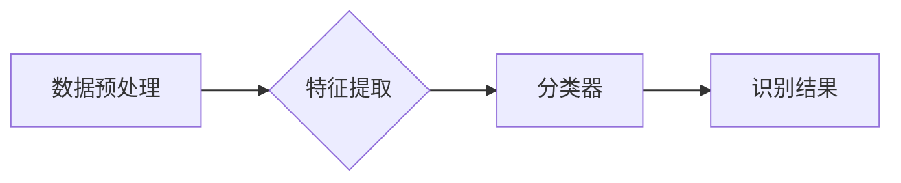

> TensorFlow,图像识别,深度学习,卷积神经网络,物体检测,图像分类

## 1. 背景介绍

图像识别作为人工智能领域的重要分支，在各个领域都得到了广泛应用，例如医疗诊断、自动驾驶、人脸识别、安防监控等。随着深度学习技术的快速发展，基于深度学习的图像识别系统取得了显著的成果，其识别精度和效率得到了大幅提升。

TensorFlow作为一款开源的机器学习平台，提供了丰富的工具和资源，支持构建和训练各种深度学习模型，包括图像识别模型。本文将介绍基于TensorFlow构建图像识别系统的设计与开发过程，涵盖核心概念、算法原理、代码实现以及实际应用场景等方面。

## 2. 核心概念与联系

图像识别系统通常由以下几个核心模块组成：

* **数据预处理:** 对原始图像进行预处理，例如尺寸调整、数据增强、归一化等，以提高模型训练的效率和精度。
* **特征提取:** 从图像中提取特征，例如颜色、纹理、形状等，这些特征可以用于描述图像的内容。
* **分类器:** 根据提取的特征，对图像进行分类，例如识别图像中包含的物体类别。

TensorFlow提供了丰富的API和工具，可以方便地实现上述各个模块的功能。

**核心架构流程图:**



## 3. 核心算法原理 & 具体操作步骤

### 3.1  算法原理概述

卷积神经网络(CNN)是图像识别领域最常用的算法之一。CNN的结构灵感来源于生物视觉系统，它通过多个卷积层、池化层和全连接层来提取图像特征并进行分类。

* **卷积层:** 使用卷积核对图像进行卷积运算，提取图像局部特征。
* **池化层:** 对卷积层的输出进行池化操作，例如最大池化或平均池化，降低特征维度并提高模型鲁棒性。
* **全连接层:** 将池化层的输出连接到全连接层，进行最终的分类决策。

### 3.2  算法步骤详解

1. **数据预处理:** 将原始图像转换为合适的格式，例如调整尺寸、归一化像素值等。
2. **构建CNN模型:** 使用TensorFlow API定义CNN模型结构，包括卷积层、池化层和全连接层。
3. **训练模型:** 使用训练数据训练CNN模型，通过反向传播算法更新模型参数，使模型的识别精度不断提高。
4. **评估模型:** 使用测试数据评估模型的识别精度，例如准确率、召回率、F1-score等。
5. **部署模型:** 将训练好的模型部署到实际应用场景中，例如嵌入到应用程序中或部署到云平台上。

### 3.3  算法优缺点

**优点:**

* 识别精度高：CNN能够学习到图像的复杂特征，从而实现高精度的图像识别。
* 鲁棒性强：CNN对图像的噪声和变形具有较强的鲁棒性。
* 可迁移性强：预训练的CNN模型可以迁移到其他图像识别任务中，例如物体检测、图像分割等。

**缺点:**

* 计算量大：训练CNN模型需要大量的计算资源和时间。
* 数据依赖性强：CNN模型的性能取决于训练数据的质量和数量。

### 3.4  算法应用领域

CNN算法广泛应用于以下领域：

* **图像分类:** 识别图像中包含的物体类别，例如猫、狗、车等。
* **物体检测:** 在图像中定位和识别物体，例如检测图像中的人脸、车牌等。
* **图像分割:** 将图像分割成不同的区域，例如分割图像中的前景和背景。
* **图像生成:** 生成新的图像，例如生成人脸图像、风景图像等。

## 4. 数学模型和公式 & 详细讲解 & 举例说明

### 4.1  数学模型构建

CNN模型的核心是卷积层和池化层。卷积层的数学模型可以表示为：

$$
y = f(W * x + b)
$$

其中：

* $x$ 是输入图像的特征图。
* $W$ 是卷积核的权重矩阵。
* $b$ 是卷积层的偏置项。
* $f$ 是激活函数，例如ReLU函数。
* $y$ 是卷积层的输出特征图。

池化层的数学模型可以表示为：

$$
y = \text{pool}(x)
$$

其中：

* $x$ 是输入特征图。
* $\text{pool}$ 是池化操作，例如最大池化或平均池化。
* $y$ 是池化层的输出特征图。

### 4.2  公式推导过程

卷积操作的推导过程可以参考相关机器学习教材，这里不再赘述。

### 4.3  案例分析与讲解

假设我们有一个输入图像大小为 $28 \times 28$ 的灰度图像，我们使用一个 $3 \times 3$ 的卷积核进行卷积操作，步长为 $1$，填充为 $0$。

卷积操作后，输出特征图的大小为 $26 \times 26$。

## 5. 项目实践：代码实例和详细解释说明

### 5.1  开发环境搭建

* 安装Python3.x
* 安装TensorFlow库：`pip install tensorflow`
* 安装必要的依赖库，例如NumPy、Matplotlib等。

### 5.2  源代码详细实现

```python
import tensorflow as tf

# 定义CNN模型
model = tf.keras.models.Sequential([
    tf.keras.layers.Conv2D(32, (3, 3), activation='relu', input_shape=(28, 28, 1)),
    tf.keras.layers.MaxPooling2D((2, 2)),
    tf.keras.layers.Conv2D(64, (3, 3), activation='relu'),
    tf.keras.layers.MaxPooling2D((2, 2)),
    tf.keras.layers.Flatten(),
    tf.keras.layers.Dense(10, activation='softmax')
])

# 编译模型
model.compile(optimizer='adam',
              loss='sparse_categorical_crossentropy',
              metrics=['accuracy'])

# 训练模型
model.fit(x_train, y_train, epochs=10)

# 评估模型
loss, accuracy = model.evaluate(x_test, y_test)
print('Test loss:', loss)
print('Test accuracy:', accuracy)
```

### 5.3  代码解读与分析

* **定义CNN模型:** 使用TensorFlow的`keras` API定义CNN模型结构，包括卷积层、池化层和全连接层。
* **编译模型:** 使用`adam`优化器、`sparse_categorical_crossentropy`损失函数和`accuracy`指标编译模型。
* **训练模型:** 使用训练数据训练模型，指定训练轮数`epochs`。
* **评估模型:** 使用测试数据评估模型的性能，输出测试损失和准确率。

### 5.4  运行结果展示

训练完成后，可以将模型部署到实际应用场景中，例如嵌入到应用程序中或部署到云平台上。

## 6. 实际应用场景

基于TensorFlow的图像识别系统在各个领域都有广泛的应用场景：

* **医疗诊断:** 识别医学图像中的病灶，辅助医生进行诊断。
* **自动驾驶:** 检测道路上的车辆、行人、交通信号灯等，辅助车辆自动驾驶。
* **人脸识别:** 识别人脸，用于身份验证、人脸搜索等应用。
* **安防监控:** 检测异常行为，例如入侵、盗窃等，提高安防安全。

### 6.4  未来应用展望

随着深度学习技术的不断发展，基于TensorFlow的图像识别系统将会有更广泛的应用场景，例如：

* **智能家居:** 通过图像识别，实现智能家居设备的控制和管理。
* **工业自动化:** 使用图像识别技术，实现工业生产过程的自动化和智能化。
* **零售业:** 通过图像识别技术，实现商品识别、库存管理等应用。

## 7. 工具和资源推荐

### 7.1  学习资源推荐

* **TensorFlow官方文档:** https://www.tensorflow.org/
* **深度学习书籍:** 《深度学习》、《动手学深度学习》等。
* **在线课程:** Coursera、edX等平台上的深度学习课程。

### 7.2  开发工具推荐

* **Jupyter Notebook:** 用于编写和运行Python代码，可视化数据和模型结果。
* **TensorBoard:** 用于可视化TensorFlow模型的训练过程和性能指标。

### 7.3  相关论文推荐

* **AlexNet:** https://papers.nips.cc/paper/4824-imagenet-classification-with-deep-convolutional-neural-networks.pdf
* **VGGNet:** https://arxiv.org/abs/1409.1556
* **ResNet:** https://arxiv.org/abs/1512.03385

## 8. 总结：未来发展趋势与挑战

### 8.1  研究成果总结

基于TensorFlow的图像识别系统取得了显著的成果，在识别精度、效率和应用场景方面都取得了长足的进步。

### 8.2  未来发展趋势

* **模型更深更广:** 探索更深层次和更广阔的网络结构，提高模型的识别能力。
* **数据更丰富更精准:** 收集和构建更丰富、更精准的图像数据集，提高模型的泛化能力。
* **推理更快速更高效:** 优化模型结构和训练方法，提高模型的推理速度和效率。
* **解释性更强:** 研究图像识别模型的决策机制，提高模型的可解释性。

### 8.3  面临的挑战

* **数据标注成本高:** 图像识别模型的训练需要大量的标注数据，数据标注成本较高。
* **模型训练时间长:** 训练大型图像识别模型需要大量的计算资源和时间。
* **模型安全性问题:** 图像识别模型可能存在安全漏洞，例如对抗攻击。

### 8.4  研究展望

未来，图像识别领域将继续朝着更智能、更安全、更可解释的方向发展。

## 9. 附录：常见问题与解答

* **如何选择合适的CNN模型结构？**

选择合适的CNN模型结构需要根据具体的应用场景和数据特点进行选择。

* **如何提高模型的识别精度？**

可以尝试以下方法提高模型的识别精度：

* 使用更深层次和更广阔的网络结构。
* 收集和构建更丰富、更精准的图像数据集。
* 使用数据增强技术提高训练数据的多样性。
* 调整模型的超参数，例如学习率、批处理大小等。

* **如何部署模型到实际应用场景中？**

可以将训练好的模型部署到以下场景中：

* 嵌入到应用程序中。
* 部署到云平台上。
* 使用边缘计算设备进行部署。


作者：禅与计算机程序设计艺术 / Zen and the Art of Computer Programming 
<end_of_turn>