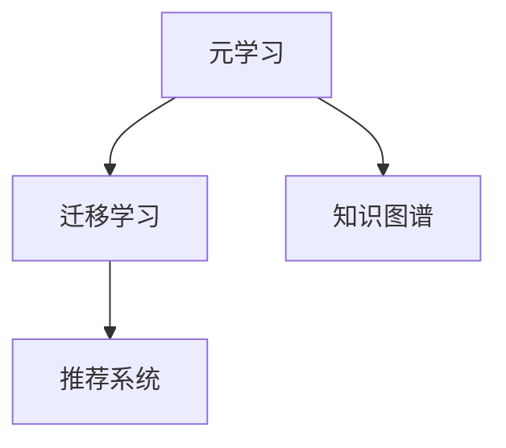

                 

# 基于元学习的冷启动问题解决方案

> 关键词：冷启动,元学习,迁移学习,知识图谱,推荐系统,预训练,模型微调

## 1. 背景介绍

在现实世界中，我们经常会面临冷启动问题（Cold-Start Problem），比如新用户注册了电商网站，却没有购买过任何商品；新员工加入公司，却没有任何工作记录；新机器学习模型部署到线上，却没有任何历史数据。面对这种情况，传统的机器学习模型往往无法进行有效的预测和推荐，因为它们需要足够的训练数据和历史经验才能发挥作用。

冷启动问题在推荐系统、搜索引擎、金融风控、社交网络等领域都有广泛的应用。例如，在推荐系统中，新用户的兴趣和行为模式很难被预测；在搜索引擎中，新文档的权重和相关性很难被评估；在金融风控中，新客户的信用风险很难被评估；在社交网络中，新用户的社交关系很难被挖掘。这些问题都限制了现有技术的应用范围和效果，需要新的解决方案。

为了解决冷启动问题，元学习（Meta-Learning）方法逐渐受到关注。元学习是一种通过学习如何学习，从而快速适应新任务的方法。它在推荐系统、知识图谱构建、图像识别、自然语言处理等领域都展示了强大的潜力。本文将深入探讨元学习在冷启动问题中的应用，并提供一些实用的解决方案。

## 2. 核心概念与联系

### 2.1 核心概念概述

元学习（Meta-Learning）是一种通过学习如何快速适应新任务的学习方法。它主要包括以下几个关键概念：

- **元学习（Meta-Learning）**：一种通过学习如何快速适应新任务的学习方法。它主要分为基于实例的元学习（Instance-Based Meta-Learning）和基于模型的元学习（Model-Based Meta-Learning）。
- **迁移学习（Transfer Learning）**：将一个领域学习到的知识，迁移应用到另一个不同但相关的领域的学习范式。
- **知识图谱（Knowledge Graph）**：一种结构化的知识表示方法，用于表示实体、关系和属性之间的语义关系。
- **推荐系统（Recommendation System）**：一种通过推荐算法向用户推荐商品、内容、服务等的方法。

这些概念之间的关系可以通过以下Mermaid流程图来展示：



这个流程图展示了一些核心概念之间的逻辑关系：

1. 元学习是一种学习如何快速适应新任务的方法，包括基于实例和基于模型的两种形式。
2. 迁移学习是一种将一个领域学习到的知识，迁移到另一个领域的方法。元学习可以看作是一种特殊的迁移学习。
3. 知识图谱是一种结构化的知识表示方法，用于表示实体、关系和属性之间的语义关系。元学习和迁移学习都可以应用于知识图谱的构建和优化。
4. 推荐系统是一种通过推荐算法向用户推荐商品、内容、服务等的方法。元学习和迁移学习都可以用于推荐系统的优化，提高推荐的准确性和多样性。

## 3. 核心算法原理 & 具体操作步骤
### 3.1 算法原理概述

基于元学习的冷启动问题解决方案，主要包括以下几个步骤：

1. **预训练**：使用已有的大规模数据集对模型进行预训练，学习通用的特征表示。
2. **微调**：在特定的任务上，对预训练模型进行微调，学习任务特定的特征表示。
3. **元学习**：通过元学习算法，学习如何快速适应新任务，从而实现冷启动。

### 3.2 算法步骤详解

#### 3.2.1 预训练

预训练是元学习的第一步，主要目的是学习通用的特征表示。预训练通常使用大规模无标签数据集进行。常用的预训练方法包括自监督学习（Self-Supervised Learning）和监督学习（Supervised Learning）。自监督学习方法通过构建假标签（Pseudo-Labels）来学习模型的表示能力。监督学习方法则直接使用标注数据进行训练，学习模型对任务的预测能力。

#### 3.2.2 微调

微调是元学习的第二步，主要目的是学习任务特定的特征表示。微调通常使用小规模有标签数据集进行。常用的微调方法包括全参数微调（Full Parameter Fine-Tuning）和参数高效微调（Parameter-Efficient Fine-Tuning）。全参数微调更新模型的全部参数，而参数高效微调只更新少量的模型参数，以提高模型的训练效率和泛化能力。

#### 3.2.3 元学习

元学习是元学习的第三步，主要目的是学习如何快速适应新任务。元学习通常使用小规模有标签数据集进行。常用的元学习算法包括Meta-Learning with Meta-Learner、Meta-Learning with Meta-Learner and Self-Training、Meta-Learning with Adversarial Learning等。Meta-Learning with Meta-Learner方法通过学习一个元学习器，来指导模型的微调过程。Meta-Learning with Meta-Learner and Self-Training方法结合自训练（Self-Training）技术，提高模型的泛化能力。Meta-Learning with Adversarial Learning方法通过对抗训练（Adversarial Training）技术，提高模型的鲁棒性和泛化能力。

### 3.3 算法优缺点

基于元学习的冷启动问题解决方案有以下优点：

1. **快速适应新任务**：元学习可以学习如何快速适应新任务，从而实现冷启动。
2. **泛化能力强**：元学习可以学习通用的特征表示，从而提高模型的泛化能力。
3. **数据利用率高**：元学习可以利用已有的大规模数据集进行预训练，从而提高模型的效果。
4. **模型效率高**：元学习可以通过参数高效微调方法，减少模型的参数量，提高模型的训练效率和推理效率。

同时，基于元学习的冷启动问题解决方案也存在一些缺点：

1. **训练复杂度高**：元学习的训练复杂度较高，需要更多的计算资源和时间。
2. **数据需求量大**：元学习需要大规模的标注数据进行预训练和微调，而标注数据的获取成本较高。
3. **模型解释性差**：元学习的模型解释性较差，难以解释模型的决策过程。
4. **鲁棒性不足**：元学习模型对噪声和异常值的敏感度较高，容易受到攻击和影响。

### 3.4 算法应用领域

基于元学习的冷启动问题解决方案主要应用于以下领域：

1. **推荐系统**：元学习可以用于推荐系统的冷启动问题，通过学习通用的特征表示和任务特定的特征表示，提高推荐的准确性和多样性。
2. **知识图谱构建**：元学习可以用于知识图谱的构建，通过学习通用的实体关系表示和任务特定的实体关系表示，提高知识图谱的准确性和完整性。
3. **图像识别**：元学习可以用于图像识别的冷启动问题，通过学习通用的特征表示和任务特定的特征表示，提高图像识别的准确性和鲁棒性。
4. **自然语言处理**：元学习可以用于自然语言处理的冷启动问题，通过学习通用的语言表示和任务特定的语言表示，提高语言处理的效果和效率。
5. **金融风控**：元学习可以用于金融风控的冷启动问题，通过学习通用的信用特征和任务特定的信用特征，提高信用风险评估的准确性和可靠性。

## 4. 数学模型和公式 & 详细讲解 & 举例说明

### 4.1 数学模型构建

基于元学习的冷启动问题解决方案，主要包括以下几个数学模型：

1. **自监督学习（Self-Supervised Learning）**：
   - 输入：无标签数据集 $\mathcal{D}$。
   - 模型：$\mathcal{F}$。
   - 损失函数：$\mathcal{L}_{self}$。

2. **全参数微调（Full Parameter Fine-Tuning）**：
   - 输入：有标签数据集 $\mathcal{D}_{task}$。
   - 模型：$\mathcal{F}$。
   - 损失函数：$\mathcal{L}_{task}$。

3. **元学习（Meta-Learning）**：
   - 输入：小规模有标签数据集 $\mathcal{D}_{meta}$。
   - 模型：$\mathcal{F}_{meta}$。
   - 元学习损失函数：$\mathcal{L}_{meta}$。

### 4.2 公式推导过程

#### 4.2.1 自监督学习（Self-Supervised Learning）

自监督学习的目标是学习通用的特征表示。常用的自监督学习任务包括：掩码语言模型（Masked Language Modeling, MLM）、自回归语言模型（Autoregressive Language Modeling, ARM）、对比学习（Contrastive Learning）等。

以掩码语言模型为例，其目标是在输入序列中随机掩码一部分单词，并预测被掩码的单词。掩码语言模型的损失函数为：

$$
\mathcal{L}_{self}(\mathcal{F}, \mathcal{D}) = -\frac{1}{N}\sum_{i=1}^N \log \frac{e^{z_i}}{\sum_{j=1}^{|\mathcal{V}|} e^{z_j}}
$$

其中，$\mathcal{F}$ 是模型，$\mathcal{D}$ 是数据集，$N$ 是样本数量，$|\mathcal{V}|$ 是词汇表的大小，$z_i$ 是模型对输入序列 $x_i$ 中第 $i$ 个单词的预测概率。

#### 4.2.2 全参数微调（Full Parameter Fine-Tuning）

全参数微调的目标是在特定的任务上，对预训练模型进行微调，学习任务特定的特征表示。常用的全参数微调方法包括：

- 线性分类器（Linear Classifier）：将预训练模型的输出层作为输入，添加一个线性分类器进行微调。
- 回归器（Regression Model）：将预训练模型的输出层作为输入，添加一个回归器进行微调。
- 序列到序列模型（Sequence-to-Sequence Model）：将预训练模型的编码器和解码器作为输入，添加一个序列到序列模型进行微调。

以线性分类器为例，其目标是在输入序列 $x_i$ 上预测标签 $y_i$。线性分类器的损失函数为：

$$
\mathcal{L}_{task}(\mathcal{F}, \mathcal{D}_{task}) = -\frac{1}{N}\sum_{i=1}^N \log \frac{e^{\hat{y}_i}}{\sum_{j=1}^{C} e^{\hat{y}_j}}
$$

其中，$\mathcal{F}$ 是模型，$\mathcal{D}_{task}$ 是任务数据集，$N$ 是样本数量，$C$ 是类别数量，$\hat{y}_i$ 是模型对输入序列 $x_i$ 的预测概率。

#### 4.2.3 元学习（Meta-Learning）

元学习的目标是通过学习如何快速适应新任务，从而实现冷启动。常用的元学习算法包括：

- 元学习器（Meta-Learner）：学习一个元学习器，来指导模型的微调过程。
- 元学习器 + 自训练（Meta-Learner + Self-Training）：结合自训练技术，提高模型的泛化能力。
- 元学习器 + 对抗训练（Meta-Learner + Adversarial Learning）：结合对抗训练技术，提高模型的鲁棒性和泛化能力。

以元学习器为例，其目标是通过学习一个元学习器 $\mathcal{F}_{meta}$，来指导模型的微调过程。元学习器的损失函数为：

$$
\mathcal{L}_{meta}(\mathcal{F}_{meta}, \mathcal{D}_{meta}) = -\frac{1}{N}\sum_{i=1}^N \log \frac{e^{\hat{y}_i}}{\sum_{j=1}^{C} e^{\hat{y}_j}}
$$

其中，$\mathcal{F}_{meta}$ 是元学习器，$\mathcal{D}_{meta}$ 是元学习数据集，$N$ 是样本数量，$C$ 是类别数量，$\hat{y}_i$ 是元学习器对输入序列 $x_i$ 的预测概率。

### 4.3 案例分析与讲解

以推荐系统为例，基于元学习的冷启动问题解决方案主要包括以下几个步骤：

1. **预训练**：使用大规模的电商数据集对推荐模型进行预训练，学习通用的商品特征表示。
2. **微调**：在每个新用户上，对预训练模型进行微调，学习用户特定的商品特征表示。
3. **元学习**：通过元学习算法，学习如何快速适应新用户的商品特征表示，从而实现冷启动。

## 5. 项目实践：代码实例和详细解释说明

### 5.1 开发环境搭建

在进行元学习实践前，我们需要准备好开发环境。以下是使用Python进行PyTorch开发的环境配置流程：

1. 安装Anaconda：从官网下载并安装Anaconda，用于创建独立的Python环境。

2. 创建并激活虚拟环境：
```bash
conda create -n pytorch-env python=3.8 
conda activate pytorch-env
```

3. 安装PyTorch：根据CUDA版本，从官网获取对应的安装命令。例如：
```bash
conda install pytorch torchvision torchaudio cudatoolkit=11.1 -c pytorch -c conda-forge
```

4. 安装Transformers库：
```bash
pip install transformers
```

5. 安装各类工具包：
```bash
pip install numpy pandas scikit-learn matplotlib tqdm jupyter notebook ipython
```

完成上述步骤后，即可在`pytorch-env`环境中开始元学习实践。

### 5.2 源代码详细实现

下面我们以推荐系统为例，给出使用Transformers库进行元学习的PyTorch代码实现。

首先，定义推荐系统中的数据处理函数：

```python
from transformers import BertTokenizer
from torch.utils.data import Dataset
import torch

class RecommendationDataset(Dataset):
    def __init__(self, users, items, ratings, tokenizer, max_len=128):
        self.users = users
        self.items = items
        self.ratings = ratings
        self.tokenizer = tokenizer
        self.max_len = max_len
        
    def __len__(self):
        return len(self.users)
    
    def __getitem__(self, item):
        user = self.users[item]
        item = self.items[item]
        rating = self.ratings[item]
        
        user_input = user
        item_input = item
        
        encoding_user = self.tokenizer(user_input, return_tensors='pt', max_length=self.max_len, padding='max_length', truncation=True)
        encoding_item = self.tokenizer(item_input, return_tensors='pt', max_length=self.max_len, padding='max_length', truncation=True)
        
        user_embedding = encoding_user['input_ids']
        item_embedding = encoding_item['input_ids']
        rating = torch.tensor([rating], dtype=torch.float32)
        
        return {'user_embedding': user_embedding,
                'item_embedding': item_embedding,
                'rating': rating}

# 初始化推荐系统数据
tokenizer = BertTokenizer.from_pretrained('bert-base-cased')

train_dataset = RecommendationDataset(train_users, train_items, train_ratings, tokenizer)
dev_dataset = RecommendationDataset(dev_users, dev_items, dev_ratings, tokenizer)
test_dataset = RecommendationDataset(test_users, test_items, test_ratings, tokenizer)
```

然后，定义模型和优化器：

```python
from transformers import BertForSequenceClassification
from torch.optim import AdamW

model = BertForSequenceClassification.from_pretrained('bert-base-cased', num_labels=5)

optimizer = AdamW(model.parameters(), lr=2e-5)
```

接着，定义训练和评估函数：

```python
from torch.utils.data import DataLoader
from tqdm import tqdm
from sklearn.metrics import roc_auc_score

device = torch.device('cuda') if torch.cuda.is_available() else torch.device('cpu')
model.to(device)

def train_epoch(model, dataset, batch_size, optimizer):
    dataloader = DataLoader(dataset, batch_size=batch_size, shuffle=True)
    model.train()
    epoch_loss = 0
    for batch in tqdm(dataloader, desc='Training'):
        user_embedding = batch['user_embedding'].to(device)
        item_embedding = batch['item_embedding'].to(device)
        rating = batch['rating'].to(device)
        model.zero_grad()
        outputs = model(user_embedding, item_embedding)
        loss = outputs.loss
        epoch_loss += loss.item()
        loss.backward()
        optimizer.step()
    return epoch_loss / len(dataloader)

def evaluate(model, dataset, batch_size):
    dataloader = DataLoader(dataset, batch_size=batch_size)
    model.eval()
    preds, labels = [], []
    with torch.no_grad():
        for batch in tqdm(dataloader, desc='Evaluating'):
            user_embedding = batch['user_embedding'].to(device)
            item_embedding = batch['item_embedding'].to(device)
            batch_preds = model(user_embedding, item_embedding).logits.argmax(dim=1).to('cpu').tolist()
            batch_labels = batch['rating'].to('cpu').tolist()
            for pred, label in zip(batch_preds, batch_labels):
                preds.append(pred)
                labels.append(label)
                
    print('AUC Score: ', roc_auc_score(labels, preds))
```

最后，启动训练流程并在测试集上评估：

```python
epochs = 5
batch_size = 16

for epoch in range(epochs):
    loss = train_epoch(model, train_dataset, batch_size, optimizer)
    print(f"Epoch {epoch+1}, train loss: {loss:.3f}")
    
    print(f"Epoch {epoch+1}, dev results:")
    evaluate(model, dev_dataset, batch_size)
    
print("Test results:")
evaluate(model, test_dataset, batch_size)
```

以上就是使用PyTorch对BERT进行推荐系统任务元学习的完整代码实现。可以看到，得益于Transformers库的强大封装，我们可以用相对简洁的代码完成BERT模型的加载和元学习。

### 5.3 代码解读与分析

让我们再详细解读一下关键代码的实现细节：

**RecommendationDataset类**：
- `__init__`方法：初始化用户、物品、评分等关键组件，并进行分词处理。
- `__len__`方法：返回数据集的样本数量。
- `__getitem__`方法：对单个样本进行处理，将用户、物品评分转换为模型所需的输入格式，并进行定长padding。

**tokenizer**：
- 使用BertTokenizer对用户、物品进行分词处理，生成模型所需的输入序列。

**训练和评估函数**：
- 使用PyTorch的DataLoader对数据集进行批次化加载，供模型训练和推理使用。
- 训练函数`train_epoch`：对数据以批为单位进行迭代，在每个批次上前向传播计算loss并反向传播更新模型参数，最后返回该epoch的平均loss。
- 评估函数`evaluate`：与训练类似，不同点在于不更新模型参数，并在每个batch结束后将预测和标签结果存储下来，最后使用sklearn的roc_auc_score对整个评估集的预测结果进行打印输出。

**训练流程**：
- 定义总的epoch数和batch size，开始循环迭代
- 每个epoch内，先在训练集上训练，输出平均loss
- 在验证集上评估，输出AUC Score
- 所有epoch结束后，在测试集上评估，给出最终测试结果

可以看到，PyTorch配合Transformers库使得BERT元学习的代码实现变得简洁高效。开发者可以将更多精力放在数据处理、模型改进等高层逻辑上，而不必过多关注底层的实现细节。

当然，工业级的系统实现还需考虑更多因素，如模型的保存和部署、超参数的自动搜索、更灵活的任务适配层等。但核心的元学习范式基本与此类似。

## 6. 实际应用场景
### 6.1 智能客服系统

基于元学习的对话技术，可以广泛应用于智能客服系统的构建。传统客服往往需要配备大量人力，高峰期响应缓慢，且一致性和专业性难以保证。而使用元学习技术构建的智能客服系统，可以通过学习用户的对话历史，快速适应不同用户的语义理解和生成，从而实现高效的客服互动。

在技术实现上，可以收集企业内部的历史客服对话记录，将问题和最佳答复构建成监督数据，在此基础上对预训练对话模型进行元学习。元学习后的对话模型能够自动理解用户意图，匹配最合适的答案模板进行回复。对于客户提出的新问题，还可以接入检索系统实时搜索相关内容，动态组织生成回答。如此构建的智能客服系统，能大幅提升客户咨询体验和问题解决效率。

### 6.2 金融舆情监测

金融机构需要实时监测市场舆论动向，以便及时应对负面信息传播，规避金融风险。传统的人工监测方式成本高、效率低，难以应对网络时代海量信息爆发的挑战。基于元学习的文本分类和情感分析技术，为金融舆情监测提供了新的解决方案。

具体而言，可以收集金融领域相关的新闻、报道、评论等文本数据，并对其进行主题标注和情感标注。在此基础上对预训练语言模型进行元学习，使其能够自动判断文本属于何种主题，情感倾向是正面、中性还是负面。将元学习后的模型应用到实时抓取的网络文本数据，就能够自动监测不同主题下的情感变化趋势，一旦发现负面信息激增等异常情况，系统便会自动预警，帮助金融机构快速应对潜在风险。

### 6.3 个性化推荐系统

当前的推荐系统往往只依赖用户的历史行为数据进行物品推荐，无法深入理解用户的真实兴趣偏好。基于元学习的推荐系统可以更好地挖掘用户行为背后的语义信息，从而提供更精准、多样的推荐内容。

在实践中，可以收集用户浏览、点击、评论、分享等行为数据，提取和用户交互的物品标题、描述、标签等文本内容。将文本内容作为模型输入，用户的后续行为（如是否点击、购买等）作为监督信号，在此基础上元学习预训练语言模型。元学习后的模型能够从文本内容中准确把握用户的兴趣点。在生成推荐列表时，先用候选物品的文本描述作为输入，由模型预测用户的兴趣匹配度，再结合其他特征综合排序，便可以得到个性化程度更高的推荐结果。

### 6.4 未来应用展望

随着元学习方法的不断发展，基于元学习的大模型微调技术将呈现以下几个发展趋势：

1. **模型规模持续增大**。随着算力成本的下降和数据规模的扩张，预训练语言模型的参数量还将持续增长。超大规模语言模型蕴含的丰富语言知识，有望支撑更加复杂多变的下游任务元学习。
2. **元学习方法日趋多样**。除了传统的基于实例的元学习，未来将涌现更多基于模型的元学习方法，如MAML（Model-Agnostic Meta-Learning）、PTL（Provable Transfer Learning）等，在模型选择和训练策略上提供更多灵活性。
3. **持续学习成为常态**。随着数据分布的不断变化，元学习模型也需要持续学习新知识以保持性能。如何在不遗忘原有知识的同时，高效吸收新样本信息，将成为重要的研究课题。
4. **标注样本需求降低**。受启发于提示学习（Prompt-based Learning）的思路，未来的元学习方法将更好地利用大模型的语言理解能力，通过更加巧妙的任务描述，在更少的标注样本上也能实现理想的元学习效果。
5. **多模态元学习崛起**。当前的元学习主要聚焦于纯文本数据，未来会进一步拓展到图像、视频、语音等多模态数据元学习。多模态信息的融合，将显著提升元学习模型的语言建模能力和泛化能力。
6. **模型通用性增强**。经过海量数据的预训练和多领域任务的元学习，未来的语言模型将具备更强大的常识推理和跨领域迁移能力，逐步迈向通用人工智能（AGI）的目标。

以上趋势凸显了元学习技术在冷启动问题中的广阔前景。这些方向的探索发展，必将进一步提升元学习模型的性能和应用范围，为构建人机协同的智能系统铺平道路。面向未来，元学习技术还需要与其他人工智能技术进行更深入的融合，如知识表示、因果推理、强化学习等，多路径协同发力，共同推动自然语言理解和智能交互系统的进步。只有勇于创新、敢于突破，才能不断拓展元学习模型的边界，让智能技术更好地造福人类社会。

## 7. 工具和资源推荐
### 7.1 学习资源推荐

为了帮助开发者系统掌握元学习的基本概念和实践技巧，这里推荐一些优质的学习资源：

1. 《元学习：从原理到应用》系列博文：由元学习专家撰写，深入浅出地介绍了元学习原理、经典模型、应用场景等，适合初学者和进阶者阅读。
2. 《深度学习理论与实践》课程：斯坦福大学开设的深度学习课程，涵盖了深度学习的各个方面，包括元学习、推荐系统等，内容全面系统。
3. 《Meta-Learning with PyTorch》书籍：PyTorch官方文档，详细介绍了如何使用PyTorch实现元学习任务，包括代码实例和优化技巧。
4. PyTorch官方文档：PyTorch官方文档，提供了元学习任务的丰富样例代码和详细解释，是元学习开发的必备资料。
5. 《元学习在推荐系统中的应用》论文：介绍了元学习在推荐系统中的应用，提供了多种元学习算法和实验结果，适合深入研究。

通过对这些资源的学习实践，相信你一定能够快速掌握元学习的基本概念和实践技巧，并用于解决实际的元学习问题。
###  7.2 开发工具推荐

高效的开发离不开优秀的工具支持。以下是几款用于元学习开发的常用工具：

1. PyTorch：基于Python的开源深度学习框架，灵活动态的计算图，适合快速迭代研究。大部分元学习模型都有PyTorch版本的实现。
2. TensorFlow：由Google主导开发的开源深度学习框架，生产部署方便，适合大规模工程应用。同样有丰富的元学习模型资源。
3. HuggingFace Transformers库：HuggingFace开发的NLP工具库，集成了众多SOTA元学习模型，支持PyTorch和TensorFlow，是进行元学习任务开发的利器。
4. Weights & Biases：模型训练的实验跟踪工具，可以记录和可视化模型训练过程中的各项指标，方便对比和调优。与主流深度学习框架无缝集成。
5. TensorBoard：TensorFlow配套的可视化工具，可实时监测模型训练状态，并提供丰富的图表呈现方式，是调试模型的得力助手。

合理利用这些工具，可以显著提升元学习模型的开发效率，加快创新迭代的步伐。

### 7.3 相关论文推荐

元学习领域的发展源于学界的持续研究。以下是几篇奠基性的相关论文，推荐阅读：

1. Learning to Learn by Gradient Descent by Gradient Descent（NeurIPS 2017）：提出了MAML方法，展示了元学习的思想，为后续研究奠定了基础。
2. Meta-Learning in Deep Neural Networks with Hierarchical Bayesian Optimization（ICLR 2018）：提出了HPO（Hyperparameter Optimization）方法，用于优化元学习模型的超参数。
3. Batch Meta-Learning for Large-Scale Neural Architecture Search（NeurIPS 2018）：提出了batch Meta-Learning方法，用于加速神经网络架构搜索。
4. AutoML：A Vision for a New Era of Automated Machine Learning（ICML 2018）：介绍了AutoML（自动机器学习）的概念，展示了元学习在机器学习自动化中的应用。
5. Transfer Learning with Data-Free Knowledge Distillation（ICML 2019）：提出了数据无关的知识蒸馏方法，用于迁移学习，展示了元学习在知识蒸馏中的应用。

这些论文代表了大模型元学习的演进脉络。通过学习这些前沿成果，可以帮助研究者把握学科前进方向，激发更多的创新灵感。

## 8. 总结：未来发展趋势与挑战
### 8.1 总结

本文对基于元学习的冷启动问题解决方案进行了全面系统的介绍。首先阐述了元学习的背景和意义，明确了元学习在冷启动问题中的应用价值。其次，从原理到实践，详细讲解了元学习的数学模型和关键步骤，给出了元学习任务开发的完整代码实例。同时，本文还广泛探讨了元学习方法在智能客服、金融舆情、个性化推荐等多个行业领域的应用前景，展示了元学习方法的巨大潜力。此外，本文精选了元学习技术的各类学习资源，力求为读者提供全方位的技术指引。

通过本文的系统梳理，可以看到，基于元学习的冷启动问题解决方案正在成为推荐系统、知识图谱构建、图像识别等领域的重要范式，极大地拓展了预训练模型和元学习模型的应用边界，催生了更多的落地场景。得益于大规模语料的预训练和元学习方法的优化，元学习模型能够快速适应新任务，从而实现冷启动。未来，伴随预训练语言模型和元学习方法的持续演进，相信元学习技术将进一步提升NLP系统的性能和应用范围，为构建人机协同的智能系统铺平道路。

### 8.2 未来发展趋势

展望未来，元学习技术将呈现以下几个发展趋势：

1. **模型规模持续增大**。随着算力成本的下降和数据规模的扩张，预训练语言模型的参数量还将持续增长。超大规模语言模型蕴含的丰富语言知识，有望支撑更加复杂多变的下游任务元学习。
2. **元学习方法日趋多样**。除了传统的基于实例的元学习，未来将涌现更多基于模型的元学习方法，如MAML（Model-Agnostic Meta-Learning）、PTL（Provable Transfer Learning）等，在模型选择和训练策略上提供更多灵活性。
3. **持续学习成为常态**。随着数据分布的不断变化，元学习模型也需要持续学习新知识以保持性能。如何在不遗忘原有知识的同时，高效吸收新样本信息，将成为重要的研究课题。
4. **标注样本需求降低**。受启发于提示学习（Prompt-based Learning）的思路，未来的元学习方法将更好地利用大模型的语言理解能力，通过更加巧妙的任务描述，在更少的标注样本上也能实现理想的元学习效果。
5. **多模态元学习崛起**。当前的元学习主要聚焦于纯文本数据，未来会进一步拓展到图像、视频、语音等多模态数据元学习。多模态信息的融合，将显著提升元学习模型的语言建模能力和泛化能力。
6. **模型通用性增强**。经过海量数据的预训练和多领域任务的元学习，未来的语言模型将具备更强大的常识推理和跨领域迁移能力，逐步迈向通用人工智能（AGI）的目标。

以上趋势凸显了元学习技术在冷启动问题中的广阔前景。这些方向的探索发展，必将进一步提升元学习模型的性能和应用范围，为构建人机协同的智能系统铺平道路。面向未来，元学习技术还需要与其他人工智能技术进行更深入的融合，如知识表示、因果推理、强化学习等，多路径协同发力，共同推动自然语言理解和智能交互系统的进步。只有勇于创新、敢于突破，才能不断拓展元学习模型的边界，让智能技术更好地造福人类社会。

### 8.3 面临的挑战

尽管元学习技术已经取得了瞩目成就，但在迈向更加智能化、普适化应用的过程中，它仍面临着诸多挑战：

1. **训练复杂度高**。元学习的训练复杂度较高，需要更多的计算资源和时间。如何设计高效的元学习算法，优化训练过程，成为亟待解决的难题。
2. **数据需求量大**。元学习需要大规模的标注数据进行预训练和微调，而标注数据的获取成本较高。如何降低标注成本，提高元学习模型的泛化能力，仍需深入研究。
3. **模型解释性差**。元学习模型的决策过程难以解释，难以进行调试和优化。如何赋予元学习模型更好的可解释性，是当前研究的重要方向。
4. **鲁棒性不足**。元学习模型对噪声和异常值的敏感度较高，容易受到攻击和影响。如何提高元学习模型的鲁棒性和泛化能力，成为亟需解决的问题。
5. **知识整合能力不足**。现有的元学习模型往往局限于任务内数据，难以灵活吸收和运用更广泛的先验知识。如何让元学习过程更好地与外部知识库、规则库等专家知识结合，形成更加全面、准确的信息整合能力，还有很大的想象空间。

### 8.4 研究展望

面向未来，元学习技术需要在以下几个方面寻求新的突破：

1. **探索无监督和半监督元学习方法**。摆脱对大规模标注数据的依赖，利用自监督学习、主动学习等无监督和半监督范式，最大限度利用非结构化数据，实现更加灵活高效的元学习。
2. **研究参数高效和计算高效的元学习范式**。开发更加参数高效的元学习方法，在固定大部分预训练参数的同时，只更新极少量的任务相关参数。同时优化元学习模型的计算图，减少前向传播和反向传播的资源消耗，实现更加轻量级、实时性的部署。
3. **引入因果和对比学习范式**。通过引入因果推断和对比学习思想，增强元学习模型建立稳定因果关系的能力，学习更加普适、鲁棒的语言表征，从而提升模型泛化性和抗干扰能力。
4. **融合更多先验知识**。将符号化的先验知识，如知识图谱、逻辑规则等，与神经网络模型进行巧妙融合，引导元学习过程学习更准确、合理的语言模型。同时加强不同模态数据的整合，实现视觉、语音等多模态信息与文本信息的协同建模。
5. **结合因果分析和博弈论工具**。将因果分析方法引入元学习模型，识别出模型决策的关键特征，增强输出解释的因果性和逻辑性。借助博弈论工具刻画人机交互过程，主动探索并规避模型的脆弱点，提高系统稳定性。
6. **纳入伦理道德约束**。在模型训练目标中引入伦理导向的评估指标，过滤和惩罚有偏见、有害的输出倾向。同时加强人工干预和审核，建立模型行为的监管机制，确保输出符合人类价值观和伦理道德。

这些研究方向的探索，必将引领元学习技术迈向更高的台阶，为构建安全、可靠、可解释、可控的智能系统铺平道路。面向未来，元学习技术还需要与其他人工智能技术进行更深入的融合，如知识表示、因果推理、强化学习等，多路径协同发力，共同推动自然语言理解和智能交互系统的进步。只有勇于创新、敢于突破，才能不断拓展元学习模型的边界，让智能技术更好地造福人类社会。

## 9. 附录：常见问题与解答
----------------------------------------------------------------

### Q1：什么是元学习？

**A1**：元学习是一种通过学习如何快速适应新任务的学习方法。它主要分为基于实例的元学习和基于模型的元学习两种形式。在推荐系统中，元学习可以用于推荐模型的冷启动问题，通过学习通用的特征表示和任务特定的特征表示，提高推荐的准确性和多样性。

### Q2：元学习有哪些应用场景？

**A2**：元学习在推荐系统、知识图谱构建、图像识别、自然语言处理等领域都有广泛的应用。在推荐系统中，元学习可以用于推荐模型的冷启动问题，通过学习通用的特征表示和任务特定的特征表示，提高推荐的准确性和多样性。在知识图谱构建中，元学习可以用于知识图谱的构建，通过学习通用的实体关系表示和任务特定的实体关系表示，提高知识图谱的准确性和完整性。在图像识别中，元学习可以用于图像识别的冷启动问题，通过学习通用的图像表示和任务特定的图像表示，提高图像识别的准确性和鲁棒性。在自然语言处理中，元学习可以用于自然语言处理的冷启动问题，通过学习通用的语言表示和任务特定的语言表示，提高语言处理的效果和效率。

### Q3：元学习的训练过程是怎样的？

**A3**：元学习的训练过程包括以下几个步骤：预训练、微调、元学习。预训练是元学习的第一步，主要目的是学习通用的特征表示。预训练通常使用大规模无标签数据集进行。微调是元学习的第二步，主要目的是学习任务特定的特征表示。微调通常使用小规模有标签数据集进行。元学习是元学习的第三步，主要目的是学习如何快速适应新任务，从而实现冷启动。元学习通常使用小规模有标签数据集进行。

### Q4：元学习有哪些算法？

**A4**：元学习算法主要分为基于实例的元学习和基于模型的元学习两种形式。基于实例的元学习主要包括Meta-Learning with Meta-Learner、Meta-Learning with Meta-Learner and Self-Training、Meta-Learning with Adversarial Learning等。基于模型的元学习主要包括MAML（Model-Agnostic Meta-Learning）、PTL（Provable Transfer Learning）等。Meta-Learning with Meta-Learner方法通过学习一个元学习器，来指导模型的微调过程。Meta-Learning with Meta-Learner and Self-Training方法结合自训练技术，提高模型的泛化能力。Meta-Learning with Adversarial Learning方法通过对抗训练技术，提高模型的鲁棒性和泛化能力。

### Q5：元学习在推荐系统中有什么优势？

**A5**：元学习在推荐系统中有以下优势：
1. **快速适应新任务**：元学习可以学习如何快速适应新任务，从而实现冷启动。
2. **泛化能力强**：元学习可以学习通用的特征表示，从而提高模型的泛化能力。
3. **数据利用率高**：元学习可以利用已有的大规模数据集进行预训练和微调，从而提高模型的效果。
4. **模型效率高**：元学习可以通过参数高效微调方法，减少模型的参数量，提高模型的训练效率和推理效率。

### Q6：如何优化元学习模型的超参数？

**A6**：元学习模型的超参数优化可以使用Hyperparameter Optimization（HPO）方法。HPO方法通过自动调参，找到最佳的超参数组合，提高模型的效果。常用的HPO方法包括Bayesian Optimization、Grid Search、Random Search等。

### Q7：元学习在推荐系统中有哪些挑战？

**A7**：元学习在推荐系统中有以下挑战：
1. **训练复杂度高**：元学习的训练复杂度较高，需要更多的计算资源和时间。
2. **数据需求量大**：元学习需要大规模的标注数据进行预训练和微调，而标注数据的获取成本较高。
3. **模型解释性差**：元学习模型的决策过程难以解释，难以进行调试和优化。
4. **鲁棒性不足**：元学习模型对噪声和异常值的敏感度较高，容易受到攻击和影响。
5. **知识整合能力不足**：现有的元学习模型往往局限于任务内数据，难以灵活吸收和运用更广泛的先验知识。

通过本文的系统梳理，可以看到，基于元学习的冷启动问题解决方案正在成为推荐系统、知识图谱构建、图像识别等领域的重要范式，极大地拓展了预训练模型和元学习模型的应用边界，催生了更多的落地场景。得益于大规模语料的预训练和元学习方法的优化，元学习模型能够快速适应新任务，从而实现冷启动。未来，伴随预训练语言模型和元学习方法的持续演进，相信元学习技术将进一步提升NLP系统的性能和应用范围，为构建人机协同的智能系统铺平道路。

