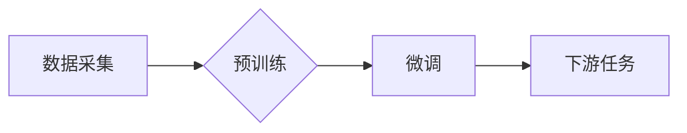

> 基础模型、大语言模型、深度学习、科技产业、应用场景、伦理问题

## 1. 背景介绍

近年来，人工智能（AI）技术取得了飞速发展，其中基础模型（Foundation Models）作为AI领域的新兴热点，正在深刻地改变着科技产业的格局。基础模型是指在海量数据上预训练的强大通用模型，能够在各种下游任务中表现出卓越的性能，并为特定领域进行微调，从而实现更精准、更有效的应用。

传统的AI模型通常针对特定任务进行设计和训练，需要大量的标注数据和专业知识，开发周期长，成本高昂。而基础模型的出现则打破了这种局限性，其强大的泛化能力和可迁移性，使得其能够在多个领域进行广泛应用，并加速了AI技术的普及和发展。

## 2. 核心概念与联系

基础模型的核心概念是“预训练”，即在海量数据上进行无监督学习，学习到通用的语言表示和知识结构。这些预训练模型可以作为其他任务的起点，通过微调的方式进行特定任务的训练，从而提高效率和性能。

**基础模型与深度学习的关系：**

基础模型是深度学习技术的产物，其强大的学习能力和表达能力来自于深度神经网络的结构和训练方法。深度学习算法能够从海量数据中自动学习特征和模式，从而构建出复杂的模型，实现对语言、图像、音频等多种数据类型的理解和处理。

**基础模型与科技产业的关系：**

基础模型的出现对科技产业产生了深远的影响，其强大的通用能力和可迁移性，为各个行业带来了新的机遇和挑战。

**基础模型的架构：**



## 3. 核心算法原理 & 具体操作步骤

### 3.1  算法原理概述

基础模型的训练主要基于深度学习算法，其中Transformer模型是目前最流行的架构之一。Transformer模型利用自注意力机制，能够捕捉文本中的长距离依赖关系，从而实现更准确的语言理解和生成。

### 3.2  算法步骤详解

1. **数据预处理:** 将原始数据进行清洗、格式化和编码，使其能够被模型理解。
2. **模型训练:** 使用深度学习算法，在海量数据上训练Transformer模型，学习到语言表示和知识结构。
3. **模型评估:** 使用测试集评估模型的性能，并根据评估结果进行模型调优。
4. **模型部署:** 将训练好的模型部署到生产环境中，用于实际应用。

### 3.3  算法优缺点

**优点:**

* 强大的泛化能力：能够在多个领域进行广泛应用。
* 可迁移性强：能够通过微调的方式适应不同的下游任务。
* 训练效率高：预训练模型可以复用，减少了训练时间和成本。

**缺点:**

* 数据依赖性强：需要海量数据进行预训练。
* 计算资源消耗大：训练大型模型需要大量的计算资源。
* 潜在的偏差和风险：模型可能存在偏见和风险，需要进行仔细的评估和控制。

### 3.4  算法应用领域

基础模型在各个领域都有广泛的应用，例如：

* **自然语言处理:** 文本生成、机器翻译、问答系统、情感分析等。
* **计算机视觉:** 图像识别、物体检测、图像生成等。
* **语音识别:** 语音转文本、语音合成等。
* **推荐系统:** 商品推荐、内容推荐等。

## 4. 数学模型和公式 & 详细讲解 & 举例说明

### 4.1  数学模型构建

基础模型的训练通常基于深度学习算法，其中Transformer模型是目前最流行的架构之一。Transformer模型的核心是自注意力机制，其数学模型可以表示为：

$$
Attention(Q, K, V) = \frac{exp(Q \cdot K^T / \sqrt{d_k})}{exp(Q \cdot K^T / \sqrt{d_k})} \cdot V
$$

其中：

* $Q$：查询矩阵
* $K$：键矩阵
* $V$：值矩阵
* $d_k$：键向量的维度

### 4.2  公式推导过程

自注意力机制通过计算查询向量与键向量的点积，来衡量它们之间的相关性。然后通过softmax函数将点积值归一化，得到每个键向量对查询向量的注意力权重。最后，将注意力权重与值向量进行加权求和，得到最终的输出。

### 4.3  案例分析与讲解

例如，在机器翻译任务中，输入句子中的每个词都可以看作是一个查询向量，而目标语言中的每个词都可以看作是一个键向量。通过自注意力机制，模型可以学习到输入句子中每个词与目标句子中每个词之间的关系，从而实现更准确的翻译。

## 5. 项目实践：代码实例和详细解释说明

### 5.1  开发环境搭建

使用Python语言开发基础模型，需要安装以下软件包：

* TensorFlow或PyTorch深度学习框架
* NumPy数值计算库
* Pandas数据处理库
* HuggingFace Transformers库

### 5.2  源代码详细实现

```python
from transformers import AutoModelForSequenceClassification, AutoTokenizer

# 加载预训练模型和词典
model_name = "bert-base-uncased"
tokenizer = AutoTokenizer.from_pretrained(model_name)
model = AutoModelForSequenceClassification.from_pretrained(model_name)

# 输入文本
text = "This is a sample text."

# 对文本进行编码
inputs = tokenizer(text, return_tensors="pt")

# 进行模型预测
outputs = model(**inputs)

# 获取预测结果
predicted_class = outputs.logits.argmax().item()

# 打印预测结果
print(f"Predicted class: {predicted_class}")
```

### 5.3  代码解读与分析

这段代码演示了如何使用HuggingFace Transformers库加载预训练的BERT模型，对文本进行分类预测。

* `AutoTokenizer.from_pretrained(model_name)`：加载预训练的词典。
* `AutoModelForSequenceClassification.from_pretrained(model_name)`：加载预训练的分类模型。
* `tokenizer(text, return_tensors="pt")`：将文本编码成模型可以理解的格式。
* `model(**inputs)`：将编码后的文本输入模型进行预测。
* `outputs.logits.argmax().item()`：获取预测结果。

### 5.4  运行结果展示

运行这段代码后，会输出预测的类别。例如，如果预训练模型是用于情感分析的任务，则输出结果可能是“正面”或“负面”。

## 6. 实际应用场景

基础模型在各个领域都有广泛的应用，例如：

### 6.1  自然语言处理

* **文本生成:** 使用基础模型生成高质量的文本内容，例如新闻报道、小说、诗歌等。
* **机器翻译:** 将文本从一种语言翻译成另一种语言，提高跨语言沟通效率。
* **问答系统:** 基于知识图谱和文本理解能力，构建智能问答系统，提供更准确和全面的信息。
* **情感分析:** 分析文本中的情感倾向，用于市场调研、用户反馈分析等。

### 6.2  计算机视觉

* **图像识别:** 识别图像中的物体、场景和人物，用于图像搜索、安防监控等。
* **物体检测:** 在图像中定位和识别特定物体的边界框，用于自动驾驶、机器人视觉等。
* **图像生成:** 基于文本描述生成图像，用于创意设计、艺术创作等。

### 6.3  语音识别

* **语音转文本:** 将语音信号转换为文本，用于语音助手、会议记录等。
* **语音合成:** 将文本转换为语音信号，用于语音导航、虚拟助手等。

### 6.4  未来应用展望

基础模型的应用场景还在不断扩展，未来将有更多创新应用涌现，例如：

* **个性化教育:** 基于学生的学习情况，提供个性化的学习内容和辅导。
* **医疗诊断:** 基于患者的病历和影像数据，辅助医生进行诊断和治疗方案制定。
* **科学研究:** 加速科学研究的进程，例如药物研发、材料科学等。

## 7. 工具和资源推荐

### 7.1  学习资源推荐

* **HuggingFace Transformers库文档:** https://huggingface.co/docs/transformers/index
* **OpenAI API文档:** https://beta.openai.com/docs/api-reference/introduction
* **DeepLearning.AI课程:** https://www.deeplearning.ai/

### 7.2  开发工具推荐

* **Jupyter Notebook:** https://jupyter.org/
* **Google Colab:** https://colab.research.google.com/
* **AWS SageMaker:** https://aws.amazon.com/sagemaker/

### 7.3  相关论文推荐

* **Attention Is All You Need:** https://arxiv.org/abs/1706.03762
* **BERT: Pre-training of Deep Bidirectional Transformers for Language Understanding:** https://arxiv.org/abs/1810.04805
* **GPT-3: Language Models are Few-Shot Learners:** https://arxiv.org/abs/2005.14165

## 8. 总结：未来发展趋势与挑战

### 8.1  研究成果总结

基础模型在AI领域取得了显著的进展，其强大的泛化能力和可迁移性，为各个行业带来了新的机遇和挑战。

### 8.2  未来发展趋势

未来基础模型的发展趋势包括：

* **模型规模的进一步扩大:** 更大的模型规模能够带来更强的学习能力和性能提升。
* **多模态模型的开发:** 将文本、图像、音频等多种模态数据融合在一起，构建更全面的知识表示。
* **可解释性和安全性:** 提高模型的可解释性和安全性，使其能够更好地服务于人类社会。

### 8.3  面临的挑战

基础模型的发展也面临着一些挑战，例如：

* **数据获取和隐私保护:** 基础模型的训练需要海量数据，如何获取高质量数据并保护用户隐私是一个重要问题。
* **计算资源消耗:** 训练大型模型需要大量的计算资源，如何降低训练成本是一个关键挑战。
* **伦理问题:** 基础模型可能存在偏见和风险，如何确保其公平、公正和安全地应用是一个重要的伦理问题。

### 8.4  研究展望

未来，基础模型的研究将继续深入，探索更强大的模型架构、更有效的训练方法和更广泛的应用场景。同时，也将更加注重模型的可解释性、安全性以及伦理问题，确保基础模型能够真正为人类社会带来福祉。

## 9. 附录：常见问题与解答

### 9.1  基础模型和深度学习有什么区别？

基础模型是深度学习技术的产物，其强大的学习能力和表达能力来自于深度神经网络的结构和训练方法。深度学习算法能够从海量数据中自动学习特征和模式，从而构建出复杂的模型，实现对语言、图像、音频等多种数据类型的理解和处理。

### 9.2  如何选择合适的基础模型？

选择合适的基础模型需要根据具体的应用场景和需求进行考虑。例如，对于文本生成任务，可以选择GPT-3等文本生成模型；对于图像识别任务，可以选择ResNet、EfficientNet等图像识别模型。

### 9.3  如何训练和部署基础模型？

训练和部署基础模型需要一定的技术基础和资源支持。可以使用开源框架如TensorFlow或PyTorch进行模型训练，并使用云平台如AWS SageMaker进行模型部署。

### 9.4  基础模型存在哪些伦理问题？

基础模型可能存在偏见、歧视和风险，例如：

* **数据偏见:** 如果训练数据存在偏见，则模型也可能存在偏见。
* **滥用风险:** 基础模型可以被用于恶意目的，例如生成虚假信息、进行网络攻击等。
* **隐私问题:** 基础模型的训练可能需要使用用户数据，需要确保用户隐私得到保护。

为了