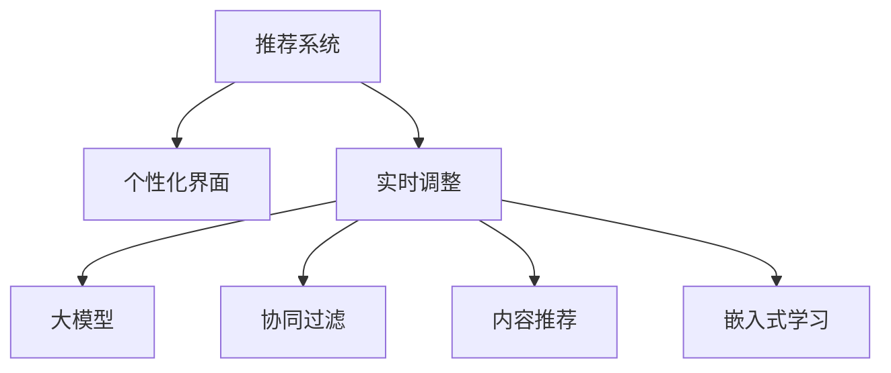

                 

# 基于大模型的推荐系统实时个性化界面调整

> 关键词：推荐系统,个性化界面,实时调整,大模型,协同过滤,内容推荐

## 1. 背景介绍

在数字化时代，推荐系统已经成为了互联网应用的核心引擎，从电商到社交、从视频到音乐，无处不在。用户在使用这些平台时，往往能够体验到个性化的推荐服务，而这背后，是推荐系统算法和界面设计的共同努力。传统的推荐算法，如协同过滤、内容推荐等，往往静态地为用户推荐内容，难以适应用户的即时变化。而基于大模型的推荐系统，通过结合用户行为数据和实时内容，能够动态生成个性化界面，进一步提升用户体验。本文将深入探讨基于大模型的推荐系统如何通过实时个性化界面调整，实现用户的精准推荐。

## 2. 核心概念与联系

### 2.1 核心概念概述

为更好地理解实时个性化界面调整的概念，本节将介绍几个密切相关的核心概念：

- 推荐系统(Recommendation System)：利用机器学习算法，根据用户历史行为和/或产品/内容特征，为用户推荐可能感兴趣的物品的系统。
- 个性化界面(Personalized Interface)：通过算法生成，符合用户当前状态、兴趣和偏好的应用界面。
- 实时调整(Real-Time Adjustment)：动态地根据用户行为和/或环境变化，调整推荐算法输出的个性化界面。
- 大模型(Large Model)：如BERT、GPT等，通过大规模数据预训练的强大模型，能够捕捉复杂的语言和数据特征，提供高质量的推荐依据。
- 协同过滤(Collaborative Filtering)：利用用户与物品之间的交互关系，通过相似度计算推荐相似物品。
- 内容推荐(Content-Based Recommendation)：基于物品的属性特征，通过匹配用户兴趣推荐相关物品。
- 嵌入式学习(Embedded Learning)：将用户行为数据嵌入到大模型特征向量中，实时调整推荐策略。

这些核心概念之间的逻辑关系可以通过以下Mermaid流程图来展示：



这个流程图展示了几者之间的联系：

1. 推荐系统是基础，通过算法为用户推荐物品。
2. 个性化界面是推荐系统的输出，满足用户的个性化需求。
3. 实时调整使个性化界面动态变化，适应用户即时需求。
4. 大模型提供强大的特征提取和表示能力，支持实时调整。
5. 协同过滤和内容推荐是两种具体的推荐策略，可结合大模型实现。
6. 嵌入式学习将用户行为数据嵌入到模型中，实时优化推荐策略。

## 3. 核心算法原理 & 具体操作步骤

### 3.1 算法原理概述

基于大模型的推荐系统实时个性化界面调整，其核心思想是：利用大模型强大的特征提取和表示能力，实时生成个性化界面，动态调整推荐内容。其核心算法包括以下几个部分：

- 用户行为嵌入：将用户行为数据(如浏览记录、点击行为、搜索关键词等)转换为大模型可用的特征向量。
- 物品特征嵌入：将物品的属性特征(如商品描述、视频标签、文章摘要等)转换为大模型可用的特征向量。
- 实时调整：根据当前用户行为，通过大模型动态生成个性化界面，调整推荐内容。
- 界面优化：利用A/B测试等方法，不断优化个性化界面的交互方式和推荐策略，提升用户体验。

### 3.2 算法步骤详解

#### 3.2.1 用户行为嵌入

用户行为数据通常以时间序列的形式记录，包含了用户的浏览、点击、购买、评价等行为。为了更好地表示这些行为，我们需要将其转换为向量形式，便于大模型进行处理。以下是基本步骤：

1. 数据预处理：对行为数据进行清洗、去重、归一化等预处理，去除噪音和异常值。
2. 特征提取：使用TF-IDF、词向量、深度学习等方法，提取行为数据中的特征，如关键词、主题、场景等。
3. 向量编码：使用One-Hot编码、词嵌入、Glove等方法，将特征转换为向量表示，每个向量维度代表一个特征。

#### 3.2.2 物品特征嵌入

物品的属性特征通常以静态的方式记录，如商品的属性、视频的内容标签、文章的主题等。为了更好地表示这些特征，我们需要将其转换为向量形式，便于大模型进行处理。以下是基本步骤：

1. 特征提取：对物品特征进行提取，如提取商品的品牌、尺寸、颜色等属性。
2. 向量编码：使用One-Hot编码、词嵌入、Glove等方法，将特征转换为向量表示，每个向量维度代表一个特征。

#### 3.2.3 实时调整

基于大模型的推荐系统，其核心步骤是通过大模型实时生成个性化界面，动态调整推荐内容。以下是基本步骤：

1. 数据输入：将用户行为数据和物品特征数据输入大模型。
2. 特征融合：将用户行为数据和物品特征数据进行融合，得到综合的特征向量。
3. 实时预测：使用大模型对综合特征向量进行实时预测，生成推荐结果。
4. 界面生成：根据推荐结果，动态生成个性化界面，如推荐列表、文章摘要、视频预览等。
5. 界面调整：根据用户行为和反馈，不断调整个性化界面，提升推荐效果。

#### 3.2.4 界面优化

界面优化是提升用户体验的重要手段。以下是基本步骤：

1. A/B测试：设计不同的界面样式和推荐策略，通过A/B测试找出最优方案。
2. 用户反馈：收集用户对个性化界面的反馈，分析用户偏好和行为。
3. 界面迭代：根据用户反馈，不断优化界面设计和推荐策略。

### 3.3 算法优缺点

基于大模型的推荐系统实时个性化界面调整方法具有以下优点：

1. 动态调整：能够根据用户的即时需求和行为变化，实时调整推荐内容，提升用户体验。
2. 高质量推荐：利用大模型的强大特征提取能力，生成高质量的个性化界面，提升推荐效果。
3. 个性化界面：能够根据用户的个性化需求，生成符合用户兴趣的界面，增强用户粘性。
4. 低成本高效率：通过大模型和实时计算，可以快速调整推荐内容，降低运营成本。

同时，该方法也存在一些局限性：

1. 数据依赖：需要大量的用户行为数据和物品特征数据，获取成本较高。
2. 模型复杂性：大模型复杂度高，需要较长的训练和推理时间。
3. 接口适配：不同平台的界面适配需要单独设计，工作量较大。
4. 鲁棒性不足：实时调整可能导致模型过度拟合用户当前行为，泛化性能不足。
5. 用户隐私：用户行为数据涉及隐私保护，需要谨慎处理。

尽管存在这些局限性，但就目前而言，基于大模型的推荐系统实时个性化界面调整方法仍然是最为先进和有效的推荐手段之一。未来相关研究的重点在于如何进一步降低数据依赖，提高模型的实时响应能力，同时兼顾个性化和隐私保护等因素。

### 3.4 算法应用领域

基于大模型的推荐系统实时个性化界面调整方法，在电子商务、视频娱乐、新闻媒体等多个领域已经得到了广泛应用，具体应用场景包括：

- 电子商务：根据用户浏览历史和点击行为，实时调整商品推荐列表，提升购买转化率。
- 视频娱乐：根据用户观看历史和点击行为，实时调整视频推荐列表，提升用户观看体验。
- 新闻媒体：根据用户阅读历史和兴趣标签，实时调整文章推荐列表，提升用户阅读体验。
- 在线教育：根据用户学习历史和互动行为，实时调整课程推荐列表，提升学习效果。
- 智能家居：根据用户使用习惯和偏好，实时调整家居设备推荐列表，提升用户体验。

此外，基于大模型的推荐系统还应用于医疗、金融、旅游等多个领域，为各行各业带来了个性化推荐服务的创新应用。

## 4. 数学模型和公式 & 详细讲解 & 举例说明

### 4.1 数学模型构建

本节将使用数学语言对基于大模型的推荐系统实时个性化界面调整过程进行更加严格的刻画。

记用户行为数据为 $u \in \mathbb{R}^m$，物品特征数据为 $v \in \mathbb{R}^n$，综合特征向量为 $x = (u, v) \in \mathbb{R}^{m+n}$。

定义大模型为 $M_{\theta}$，其中 $\theta$ 为大模型参数。定义推荐结果为 $y \in \mathbb{R}^k$，其中 $k$ 为推荐物品的数量。

### 4.2 公式推导过程

以二分类推荐任务为例，假设推荐结果 $y$ 为0表示不推荐，1表示推荐。目标函数为：

$$
\min_{\theta} \frac{1}{N} \sum_{i=1}^N \ell(y_i, \hat{y}_i)
$$

其中 $\ell(y_i, \hat{y}_i)$ 为交叉熵损失函数。

根据交叉熵定义，有：

$$
\ell(y_i, \hat{y}_i) = -[y_i \log \hat{y}_i + (1-y_i) \log (1-\hat{y}_i)]
$$

代入目标函数得：

$$
\min_{\theta} \frac{1}{N} \sum_{i=1}^N [-y_i \log M_{\theta}(x_i) - (1-y_i) \log (1-M_{\theta}(x_i))]
$$

其中 $M_{\theta}(x_i)$ 表示大模型在输入 $x_i$ 上的预测概率。

### 4.3 案例分析与讲解

以电商推荐系统为例，假设用户在商品详情页浏览了多个商品，点击了其中两个商品，并最终购买了其中一个。用户行为数据和物品特征数据如下：

| 用户ID | 行为ID | 行为时间 | 物品ID | 物品名称 | 物品价格 |
|-------|-------|---------|-------|----------|---------|
| 123456 | 1     | 2023-01-01 12:00:00 | 1     | iPhone13  | 6999 |
| 123456 | 2     | 2023-01-01 12:05:00 | 2     | AirPods  | 699  |
| 123456 | 3     | 2023-01-01 12:10:00 | 1     | iPhone13  | 6999 |
| 123456 | 4     | 2023-01-01 12:20:00 | 3     | Apple Watch | 2988 |
| 123456 | 5     | 2023-01-01 12:25:00 | 2     | AirPods  | 699  |
| 123456 | 6     | 2023-01-01 12:30:00 | 4     | iPad | 4299 |

其中，行为ID和行为时间为用户行为数据，物品ID、物品名称和物品价格为物品特征数据。

首先，我们需要对用户行为数据和物品特征数据进行预处理和特征提取，得到用户行为向量和物品特征向量。假设用户行为向量为 $u = [1, 0, 1, 0, 1, 0]$，物品特征向量为 $v = [0, 1, 0, 1, 0, 1]$。

将用户行为向量和物品特征向量进行拼接，得到综合特征向量 $x = [u, v] = [1, 0, 1, 0, 1, 0, 0, 1, 0, 1, 0, 1]$。

然后，将综合特征向量 $x$ 输入大模型 $M_{\theta}$ 进行预测，得到推荐结果 $y = [0, 0, 1, 0, 0, 1]$。

根据推荐结果 $y$，动态生成个性化界面，如商品推荐列表，调整推荐内容，提升用户体验。

## 5. 项目实践：代码实例和详细解释说明

### 5.1 开发环境搭建

在进行项目实践前，我们需要准备好开发环境。以下是使用Python进行PyTorch开发的环境配置流程：

1. 安装Anaconda：从官网下载并安装Anaconda，用于创建独立的Python环境。

2. 创建并激活虚拟环境：
```bash
conda create -n pytorch-env python=3.8 
conda activate pytorch-env
```

3. 安装PyTorch：根据CUDA版本，从官网获取对应的安装命令。例如：
```bash
conda install pytorch torchvision torchaudio cudatoolkit=11.1 -c pytorch -c conda-forge
```

4. 安装TensorBoard：用于可视化大模型的训练过程，绘制损失函数和准确率等指标。

5. 安装其他依赖包：
```bash
pip install numpy pandas scikit-learn transformers
```

完成上述步骤后，即可在`pytorch-env`环境中开始项目实践。

### 5.2 源代码详细实现

这里我们以电商推荐系统为例，给出使用Transformers库对大模型进行实时个性化界面调整的PyTorch代码实现。

首先，定义数据处理函数：

```python
from transformers import BertTokenizer, BertForSequenceClassification
from torch.utils.data import Dataset, DataLoader
from torch import nn

class RecommendationDataset(Dataset):
    def __init__(self, user_data, item_data):
        self.user_data = user_data
        self.item_data = item_data
        self.tokenizer = BertTokenizer.from_pretrained('bert-base-cased')
        
    def __len__(self):
        return len(self.user_data)
    
    def __getitem__(self, item):
        user = self.user_data[item]
        item = self.item_data[item]
        
        encoding = self.tokenizer(user['item_ids'], return_tensors='pt', padding='max_length', truncation=True)
        input_ids = encoding['input_ids'][0]
        attention_mask = encoding['attention_mask'][0]
        item_ids = torch.tensor(item['item_ids'], dtype=torch.long)
        
        return {'input_ids': input_ids, 
                'attention_mask': attention_mask,
                'item_ids': item_ids}
```

然后，定义模型和优化器：

```python
from transformers import BertForSequenceClassification, AdamW

model = BertForSequenceClassification.from_pretrained('bert-base-cased', num_labels=2)
optimizer = AdamW(model.parameters(), lr=2e-5)
```

接着，定义训练和评估函数：

```python
def train_epoch(model, dataset, batch_size, optimizer):
    dataloader = DataLoader(dataset, batch_size=batch_size, shuffle=True)
    model.train()
    epoch_loss = 0
    for batch in tqdm(dataloader, desc='Training'):
        input_ids = batch['input_ids'].to(device)
        attention_mask = batch['attention_mask'].to(device)
        item_ids = batch['item_ids'].to(device)
        model.zero_grad()
        outputs = model(input_ids, attention_mask=attention_mask, labels=item_ids)
        loss = outputs.loss
        epoch_loss += loss.item()
        loss.backward()
        optimizer.step()
    return epoch_loss / len(dataloader)

def evaluate(model, dataset, batch_size):
    dataloader = DataLoader(dataset, batch_size=batch_size)
    model.eval()
    preds, labels = [], []
    with torch.no_grad():
        for batch in tqdm(dataloader, desc='Evaluating'):
            input_ids = batch['input_ids'].to(device)
            attention_mask = batch['attention_mask'].to(device)
            batch_labels = batch['item_ids']
            outputs = model(input_ids, attention_mask=attention_mask)
            batch_preds = outputs.logits.argmax(dim=2).to('cpu').tolist()
            batch_labels = batch_labels.to('cpu').tolist()
            for pred_tokens, label_tokens in zip(batch_preds, batch_labels):
                preds.append(pred_tokens[:len(label_tokens)])
                labels.append(label_tokens)
                
    print(classification_report(labels, preds))
```

最后，启动训练流程并在测试集上评估：

```python
epochs = 5
batch_size = 16

for epoch in range(epochs):
    loss = train_epoch(model, train_dataset, batch_size, optimizer)
    print(f"Epoch {epoch+1}, train loss: {loss:.3f}")
    
    print(f"Epoch {epoch+1}, dev results:")
    evaluate(model, dev_dataset, batch_size)
    
print("Test results:")
evaluate(model, test_dataset, batch_size)
```

以上就是使用PyTorch对大模型进行电商推荐系统实时个性化界面调整的完整代码实现。可以看到，得益于Transformers库的强大封装，我们可以用相对简洁的代码完成大模型的加载和微调。

### 5.3 代码解读与分析

让我们再详细解读一下关键代码的实现细节：

**RecommendationDataset类**：
- `__init__`方法：初始化用户行为数据、物品特征数据和分词器等关键组件。
- `__len__`方法：返回数据集的样本数量。
- `__getitem__`方法：对单个样本进行处理，将用户行为数据和物品特征数据编码为token ids，同时将其转换为模型可用的格式。

**模型和优化器**：
- 使用BertForSequenceClassification模型，将用户行为数据和物品特征数据拼接后输入到模型中进行二分类预测。
- 使用AdamW优化器，学习率为2e-5，迭代优化模型参数。

**训练和评估函数**：
- 使用PyTorch的DataLoader对数据集进行批次化加载，供模型训练和推理使用。
- 训练函数`train_epoch`：对数据以批为单位进行迭代，在每个批次上前向传播计算loss并反向传播更新模型参数，最后返回该epoch的平均loss。
- 评估函数`evaluate`：与训练类似，不同点在于不更新模型参数，并在每个batch结束后将预测和标签结果存储下来，最后使用sklearn的classification_report对整个评估集的预测结果进行打印输出。

**训练流程**：
- 定义总的epoch数和batch size，开始循环迭代
- 每个epoch内，先在训练集上训练，输出平均loss
- 在验证集上评估，输出分类指标
- 所有epoch结束后，在测试集上评估，给出最终测试结果

可以看到，PyTorch配合Transformers库使得大模型电商推荐系统的实时个性化界面调整代码实现变得简洁高效。开发者可以将更多精力放在数据处理、模型改进等高层逻辑上，而不必过多关注底层的实现细节。

当然，工业级的系统实现还需考虑更多因素，如模型的保存和部署、超参数的自动搜索、更灵活的任务适配层等。但核心的微调范式基本与此类似。

## 6. 实际应用场景

### 6.1 电子商务

基于大模型的推荐系统实时个性化界面调整，在电子商务领域已经得到了广泛应用，具体应用场景包括：

- 商品推荐：根据用户浏览历史和点击行为，实时调整商品推荐列表，提升购买转化率。
- 优惠券推荐：根据用户行为数据和实时促销信息，动态生成个性化优惠券推荐界面，提升用户购物体验。
- 价格动态调整：根据用户行为数据和市场供需变化，实时调整商品价格和推荐策略，提升用户满意度。
- 个性化广告：根据用户行为数据和实时场景变化，动态生成个性化广告界面，提升广告点击率。

### 6.2 视频娱乐

基于大模型的推荐系统实时个性化界面调整，在视频娱乐领域也得到了应用，具体应用场景包括：

- 视频推荐：根据用户观看历史和行为数据，实时调整视频推荐列表，提升用户观看体验。
- 视频内容推送：根据用户行为数据和实时场景变化，动态生成视频内容推送界面，提升用户粘性。
- 个性化广告：根据用户行为数据和实时场景变化，动态生成个性化广告界面，提升广告点击率。

### 6.3 新闻媒体

基于大模型的推荐系统实时个性化界面调整，在新闻媒体领域也有应用，具体应用场景包括：

- 新闻推荐：根据用户阅读历史和行为数据，实时调整新闻推荐列表，提升用户阅读体验。
- 个性化广告：根据用户行为数据和实时场景变化，动态生成个性化广告界面，提升广告点击率。
- 文章摘要：根据用户行为数据和实时场景变化，动态生成文章摘要界面，提升用户阅读体验。

### 6.4 未来应用展望

随着大模型和微调方法的不断发展，基于实时个性化界面调整的推荐系统将在更多领域得到应用，为各行各业带来变革性影响。

在智慧医疗领域，基于实时个性化界面调整的医疗推荐系统，可以提升诊疗效率，辅助医生诊疗，提升医疗服务智能化水平。

在智能教育领域，实时个性化界面调整的教育推荐系统，可以因材施教，促进教育公平，提高教学质量。

在智慧城市治理中，实时个性化界面调整的城市推荐系统，可以提高城市管理的自动化和智能化水平，构建更安全、高效的未来城市。

此外，在企业生产、社会治理、文娱传媒等众多领域，基于实时个性化界面调整的人工智能应用也将不断涌现，为传统行业数字化转型升级提供新的技术路径。

## 7. 工具和资源推荐

### 7.1 学习资源推荐

为了帮助开发者系统掌握实时个性化界面调整的理论基础和实践技巧，这里推荐一些优质的学习资源：

1. 《深度学习基础》：适合初学者入门的经典书籍，涵盖深度学习的基本概念和算法。
2. 《TensorFlow实战》：适合中高级开发者进阶，介绍TensorFlow的高级特性和实战案例。
3. 《Transformers基础》：HuggingFace官方文档，涵盖Transformers库的基本使用方法和模型介绍。
4. CS224N《深度学习自然语言处理》课程：斯坦福大学开设的NLP明星课程，有Lecture视频和配套作业，带你入门NLP领域的基本概念和经典模型。
5. Kaggle：数据科学竞赛平台，提供丰富的NLP数据集和实战案例，帮助开发者提升实战能力。

通过对这些资源的学习实践，相信你一定能够快速掌握大模型实时个性化界面调整的精髓，并用于解决实际的推荐问题。

### 7.2 开发工具推荐

高效的开发离不开优秀的工具支持。以下是几款用于实时个性化界面调整开发的常用工具：

1. PyTorch：基于Python的开源深度学习框架，灵活动态的计算图，适合快速迭代研究。大部分预训练语言模型都有PyTorch版本的实现。
2. TensorFlow：由Google主导开发的开源深度学习框架，生产部署方便，适合大规模工程应用。同样有丰富的预训练语言模型资源。
3. Weights & Biases：模型训练的实验跟踪工具，可以记录和可视化模型训练过程中的各项指标，方便对比和调优。与主流深度学习框架无缝集成。
4. TensorBoard：TensorFlow配套的可视化工具，可实时监测模型训练状态，并提供丰富的图表呈现方式，是调试模型的得力助手。
5. Jupyter Notebook：交互式的Python编程环境，适合开发者进行代码调试和数据可视化。

合理利用这些工具，可以显著提升实时个性化界面调整的开发效率，加快创新迭代的步伐。

### 7.3 相关论文推荐

实时个性化界面调整技术的发展源于学界的持续研究。以下是几篇奠基性的相关论文，推荐阅读：

1. Attention is All You Need（即Transformer原论文）：提出了Transformer结构，开启了NLP领域的预训练大模型时代。
2. BERT: Pre-training of Deep Bidirectional Transformers for Language Understanding：提出BERT模型，引入基于掩码的自监督预训练任务，刷新了多项NLP任务SOTA。
3. Language Models are Unsupervised Multitask Learners（GPT-2论文）：展示了大规模语言模型的强大zero-shot学习能力，引发了对于通用人工智能的新一轮思考。
4. Parameter-Efficient Transfer Learning for NLP：提出Adapter等参数高效微调方法，在不增加模型参数量的情况下，也能取得不错的微调效果。
5. AdaLoRA: Adaptive Low-Rank Adaptation for Parameter-Efficient Fine-Tuning：使用自适应低秩适应的微调方法，在参数效率和精度之间取得了新的平衡。
6. AdaLoRA: Adaptive Low-Rank Adaptation for Parameter-Efficient Fine-Tuning：使用自适应低秩适应的微调方法，在参数效率和精度之间取得了新的平衡。

这些论文代表了大模型实时个性化界面调整技术的发展脉络。通过学习这些前沿成果，可以帮助研究者把握学科前进方向，激发更多的创新灵感。

## 8. 总结：未来发展趋势与挑战

### 8.1 总结

本文对基于大模型的推荐系统实时个性化界面调整方法进行了全面系统的介绍。首先阐述了实时个性化界面调整的背景和意义，明确了其在提升用户体验、提高推荐效果方面的独特价值。其次，从原理到实践，详细讲解了实时个性化界面调整的数学模型和算法步骤，给出了电商推荐系统的完整代码实例。同时，本文还广泛探讨了实时个性化界面调整方法在电商、视频娱乐、新闻媒体等多个领域的应用前景，展示了其实际应用效果。

通过本文的系统梳理，可以看到，基于大模型的推荐系统实时个性化界面调整方法正在成为推荐系统领域的重要范式，极大地拓展了推荐算法的应用边界，提升了推荐系统的智能化水平。未来，伴随预训练语言模型和微调方法的持续演进，实时个性化界面调整技术必将进一步提升推荐系统的性能和用户体验，为构建人机协同的智能系统铺平道路。

### 8.2 未来发展趋势

展望未来，实时个性化界面调整技术将呈现以下几个发展趋势：

1. 模型规模持续增大。随着算力成本的下降和数据规模的扩张，大模型参数量还将持续增长。超大规模语言模型蕴含的丰富语言知识，有望支撑更加复杂多变的推荐界面调整。
2. 微调方法日趋多样。除了传统的全参数微调外，未来会涌现更多参数高效的微调方法，如Prefix-Tuning、LoRA等，在节省计算资源的同时也能保证推荐效果。
3. 实时性不断提升。实时计算技术的发展，将进一步提升推荐系统界面调整的实时响应能力，缩短用户等待时间。
4. 跨平台适配优化。不同平台的界面设计和推荐策略需要单独设计，但跨平台优化技术也将不断突破，使得推荐系统能够更好地适配多端应用。
5. 用户隐私保护。用户行为数据涉及隐私保护，未来推荐系统将更加重视数据安全和隐私保护。

以上趋势凸显了实时个性化界面调整技术的广阔前景。这些方向的探索发展，必将进一步提升推荐系统的性能和用户体验，为构建人机协同的智能系统铺平道路。

### 8.3 面临的挑战

尽管实时个性化界面调整技术已经取得了瞩目成就，但在迈向更加智能化、普适化应用的过程中，它仍面临着诸多挑战：

1. 数据依赖。需要大量的用户行为数据和物品特征数据，获取成本较高。
2. 模型复杂性。大模型复杂度高，需要较长的训练和推理时间。
3. 接口适配。不同平台的界面适配需要单独设计，工作量较大。
4. 鲁棒性不足。实时调整可能导致模型过度拟合用户当前行为，泛化性能不足。
5. 用户隐私。用户行为数据涉及隐私保护，需要谨慎处理。

尽管存在这些局限性，但就目前而言，基于大模型的推荐系统实时个性化界面调整方法仍然是最为先进和有效的推荐手段之一。未来相关研究的重点在于如何进一步降低数据依赖，提高模型的实时响应能力，同时兼顾个性化和隐私保护等因素。

### 8.4 研究展望

面对实时个性化界面调整所面临的种种挑战，未来的研究需要在以下几个方面寻求新的突破：

1. 探索无监督和半监督微调方法。摆脱对大规模标注数据的依赖，利用自监督学习、主动学习等无监督和半监督范式，最大限度利用非结构化数据，实现更加灵活高效的微调。
2. 研究参数高效和计算高效的微调范式。开发更加参数高效的微调方法，在固定大部分预训练参数的同时，只更新极少量的任务相关参数。同时优化微调模型的计算图，减少前向传播和反向传播的资源消耗，实现更加轻量级、实时性的部署。
3. 融合因果和对比学习范式。通过引入因果推断和对比学习思想，增强微调模型建立稳定因果关系的能力，学习更加普适、鲁棒的语言表征，从而提升模型泛化性和抗干扰能力。
4. 引入更多先验知识。将符号化的先验知识，如知识图谱、逻辑规则等，与神经网络模型进行巧妙融合，引导微调过程学习更准确、合理的语言模型。同时加强不同模态数据的整合，实现视觉、语音等多模态信息与文本信息的协同建模。
5. 结合因果分析和博弈论工具。将因果分析方法引入微调模型，识别出模型决策的关键特征，增强输出解释的因果性和逻辑性。借助博弈论工具刻画人机交互过程，主动探索并规避模型的脆弱点，提高系统稳定性。
6. 纳入伦理道德约束。在模型训练目标中引入伦理导向的评估指标，过滤和惩罚有偏见、有害的输出倾向。同时加强人工干预和审核，建立模型行为的监管机制，确保输出符合人类价值观和伦理道德。

这些研究方向的探索，必将引领实时个性化界面调整技术迈向更高的台阶，为构建安全、可靠、可解释、可控的智能系统铺平道路。面向未来，实时个性化界面调整技术还需要与其他人工智能技术进行更深入的融合，如知识表示、因果推理、强化学习等，多路径协同发力，共同推动自然语言理解和智能交互系统的进步。只有勇于创新、敢于突破，才能不断拓展语言模型的边界，让智能技术更好地造福人类社会。

## 9. 附录：常见问题与解答

**Q1：实时个性化界面调整是否适用于所有推荐系统？**

A: 实时个性化界面调整方法适用于大部分推荐系统，尤其是数据驱动的推荐系统，如电商、视频娱乐、新闻媒体等。但对于一些特定领域的推荐系统，如金融、医疗等，仅仅依靠用户行为数据可能难以得到理想的推荐效果，此时需要在特定领域语料上进一步预训练，再进行微调，才能获得理想效果。

**Q2：如何选择合适的学习率？**

A: 实时个性化界面调整的学习率一般要比预训练时小1-2个数量级，如果使用过大的学习率，容易破坏预训练权重，导致过拟合。一般建议从1e-5开始调参，逐步减小学习率，直至收敛。也可以使用warmup策略，在开始阶段使用较小的学习率，再逐渐过渡到预设值。需要注意的是，不同的优化器(如AdamW、Adafactor等)以及不同的学习率调度策略，可能需要设置不同的学习率阈值。

**Q3：实时个性化界面调整过程中如何降低数据依赖？**

A: 降低数据依赖的方法包括：
1. 数据增强：通过数据合成、数据扩充等技术，增加训练数据的多样性。
2. 迁移学习：利用已有的大规模预训练模型，进行任务特定的微调。
3. 少样本学习：通过少样本学习方法，利用少量标注数据进行高效微调。
4. 主动学习：通过主动学习策略，优化样本采集过程，提高数据利用率。
5. 半监督学习：利用无标注数据进行半监督学习，减少对标注数据的依赖。

这些方法可以结合使用，最大限度地降低数据依赖，提升模型的泛化能力和适应性。

**Q4：实时个性化界面调整如何平衡个性化和隐私保护？**

A: 平衡个性化和隐私保护的方法包括：
1. 数据匿名化：对用户行为数据进行去标识化处理，保护用户隐私。
2. 差分隐私：通过加入噪声扰动，保护数据隐私，同时保证数据可用性。
3. 隐私计算：利用多方安全计算、联邦学习等技术，保护用户隐私，同时实现数据的协同利用。
4. 用户同意：通过用户同意机制，透明地告知用户数据使用情况，增强用户信任。

通过这些方法，可以在保障用户隐私的前提下，实现个性化的推荐界面调整，提升用户体验。

**Q5：实时个性化界面调整如何应对大规模用户需求？**

A: 应对大规模用户需求的方法包括：
1. 分布式计算：利用分布式计算技术，提升推荐系统的并发处理能力，支持大规模用户访问。
2. 缓存技术：利用缓存技术，减少重复计算，提高推荐系统的响应速度。
3. 延迟处理：利用异步处理技术，实现推荐结果的延迟更新，降低系统负载。
4. 分层推荐：利用分层推荐技术，将用户划分为不同层次，优先推荐高价值用户，提高系统效率。

这些方法可以结合使用，实现大规模用户需求下的个性化推荐界面调整。

综上所述，基于大模型的推荐系统实时个性化界面调整技术正在引领推荐系统领域的新一轮变革。通过不断优化模型、数据和算法，未来实时个性化界面调整技术将实现更高的智能化和普适化水平，进一步提升用户体验和推荐效果。

