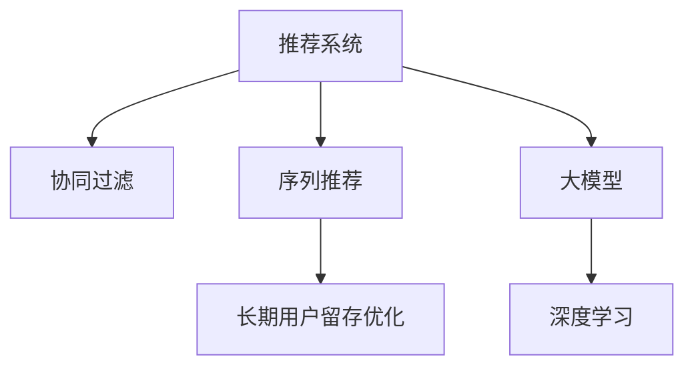

                 

# 基于大模型的推荐系统长期用户留存优化

> 关键词：推荐系统,用户留存优化,深度学习,大模型,协同过滤,序列推荐

## 1. 背景介绍

### 1.1 问题由来
随着互联网的发展，推荐系统在电商、社交媒体、内容平台等诸多领域发挥着至关重要的作用。推荐系统能够有效帮助用户发现感兴趣的物品，提高用户体验，促进平台活跃度和收入增长。然而，由于推荐算法本身的设计缺陷和环境变化，推荐系统的用户留存率在长期演进中出现了下降趋势，这一现象也被称为"递归下降"。

### 1.2 问题核心关键点
推荐系统用户留存的递归下降问题，主要表现在以下几个方面：

- 动态环境变化：用户的兴趣偏好会随着时间推移和环境变化而发生变动，传统的推荐系统难以捕捉这种动态性。
- 个性化需求差异：不同用户间的个性化需求千差万别，传统的推荐算法难以兼顾个性化和普适性。
- 交互行为多样性：用户行为呈现多样性，单一的推荐模式难以覆盖多种互动场景。
- 社会网络效应：推荐系统往往忽略了社会网络关系，无法充分利用社交网络的正向影响力。

### 1.3 问题研究意义
解决推荐系统的用户留存问题，有助于提升平台的长期价值，增强用户粘性，提高平台盈利能力。具体来说，长期的留存优化可以带来以下几个积极影响：

- 提升平台稳定性和持续增长：保持高比例的活跃用户，平台营收和广告收益才能持续增长。
- 促进用户价值提升：通过个性化的推荐，满足用户多样化的需求，提高用户满意度和忠诚度。
- 降低获客成本：对于高留存率的活跃用户，平台的转化率更高，获客成本更低。
- 优化资源配置：优化用户留存能更高效地配置推荐资源，提升平台整体运行效率。

## 2. 核心概念与联系

### 2.1 核心概念概述

为更好地理解基于大模型的推荐系统长期用户留存优化方法，本节将介绍几个密切相关的核心概念：

- 推荐系统(Recommender System)：通过分析用户行为和物品属性，为用户提供个性化推荐的技术系统。
- 协同过滤(Collaborative Filtering)：基于用户-物品交互数据，通过推荐相似物品或相似用户的方式进行推荐。
- 序列推荐(Sequential Recommendation)：考虑用户行为序列，预测用户未来兴趣，实现长期预测推荐。
- 大模型(Large Model)：指具有亿级或万亿级参数的深度神经网络模型，如BERT、GPT-3等，在大规模数据上预训练获得泛化能力。
- 深度学习(Deep Learning)：基于人工神经网络模型进行数据学习和预测，实现高效推荐。
- 用户留存(User Retention)：用户使用平台并保持活跃状态的时间长度，是衡量平台粘性的一个重要指标。

这些核心概念之间的逻辑关系可以通过以下Mermaid流程图来展示：



这个流程图展示了大模型推荐系统的主要组件及其之间的关系：

1. 推荐系统基于协同过滤和序列推荐，通过用户-物品交互数据预测用户兴趣。
2. 大模型作为核心组件，提供了强大的深度学习能力，辅助协同过滤和序列推荐。
3. 深度学习技术通过提升推荐精度，实现长期用户留存的优化。
4. 长期用户留存优化则关注用户使用行为的长序列预测，进一步提升推荐系统的效果。

## 3. 核心算法原理 & 具体操作步骤
### 3.1 算法原理概述

基于大模型的推荐系统长期用户留存优化，主要利用深度学习和大模型的泛化能力，通过协同过滤和序列推荐，实现对用户长期行为序列的预测，提升推荐系统的用户留存率。

具体来说，其核心思想是：
1. 使用大模型对用户-物品交互数据进行预训练，学习用户和物品的泛化表示。
2. 在用户-物品交互序列上，利用深度学习技术进行序列推荐，预测用户未来的兴趣。
3. 结合用户反馈和实时行为，进行动态调整和优化，实现长期用户留存的优化。

### 3.2 算法步骤详解

基于大模型的推荐系统长期用户留存优化一般包括以下几个关键步骤：

**Step 1: 准备数据和模型**

- 收集用户-物品交互数据，包括用户的点击、浏览、购买等行为数据。
- 对数据进行预处理，包括去除噪声、填充缺失值等。
- 选择合适的深度学习框架(如PyTorch、TensorFlow)和预训练大模型(如BERT、GPT-3)，进行模型搭建。

**Step 2: 用户-物品交互嵌入**

- 使用大模型对用户和物品进行预训练，学习到它们的泛化表示。
- 对用户和物品的表示进行拼接，得到用户-物品交互嵌入向量。

**Step 3: 序列推荐模型训练**

- 对用户-物品交互序列进行编码，得到序列特征表示。
- 构建序列推荐模型，如RNN、GRU、LSTM等，对序列特征进行建模，预测用户未来的兴趣。
- 训练模型并保存，使用模型对新用户行为进行预测。

**Step 4: 用户行为预测和留存优化**

- 收集用户实时行为数据，进行预测。
- 根据预测结果进行推荐，并记录用户反馈。
- 根据用户反馈和实时行为，动态调整模型参数和推荐策略。
- 通过A/B测试等手段，评估优化效果，调整策略。

**Step 5: 长期用户留存评估**

- 定义用户留存率指标，定期评估推荐系统的长期效果。
- 结合用户行为数据和模型输出，进行长期留存率的分析和优化。
- 优化策略包括调整模型参数、改进推荐算法等。

以上是基于大模型的推荐系统长期用户留存优化的主要流程。在实际应用中，还需要针对具体业务需求和数据特点，对各步骤进行优化设计，如改进数据预处理方式、选择适合的模型结构等，以进一步提升推荐系统的性能。

### 3.3 算法优缺点

基于大模型的推荐系统长期用户留存优化方法具有以下优点：

1. 数据利用率高：利用大模型的泛化能力，能够高效利用用户-物品交互数据，学习到用户的深度表示。
2. 推荐精度高：深度学习技术能够捕捉用户行为序列的复杂模式，实现长期预测推荐。
3. 动态调整灵活：结合用户实时行为，进行动态调整和优化，提高推荐效果。
4. 推荐多样化：能够覆盖多种互动场景，实现多维度的推荐。
5. 可解释性强：大模型和深度学习技术提供了丰富的特征提取和预测工具，便于分析推荐策略和优化效果。

同时，该方法也存在一定的局限性：

1. 数据标注成本高：需要对用户行为进行标签化，标注成本较高。
2. 模型复杂度高：大模型和深度学习技术需要较高的计算资源，可能影响系统实时性。
3. 模型泛化能力弱：在特定领域的数据上，大模型的泛化能力可能受到限制。
4. 模型偏置问题：深度学习模型可能学习到数据中的固有偏见，对推荐结果产生影响。
5. 用户隐私问题：用户行为数据的收集和使用可能涉及隐私问题，需要谨慎处理。

尽管存在这些局限性，但就目前而言，基于大模型的推荐系统长期用户留存优化方法仍是一种高效、准确的推荐技术，在电商、社交媒体等领域得到了广泛应用。未来相关研究的重点在于如何进一步降低数据标注成本，提高模型的实时性和泛化能力，同时兼顾可解释性和伦理安全性等因素。

### 3.4 算法应用领域

基于大模型的推荐系统长期用户留存优化方法在电商、社交媒体、内容平台等多个领域都有广泛应用，具体包括：

- 电商推荐系统：通过预测用户未来的购买行为，实现个性化推荐，提升用户满意度。
- 社交媒体推荐系统：基于用户行为序列，预测用户可能感兴趣的内容，提升平台活跃度。
- 内容平台推荐系统：根据用户历史行为，预测其对未来内容的偏好，提高内容匹配度。
- 在线广告推荐系统：根据用户行为序列和广告特征，实现精准广告投放，提高广告转化率。
- 视频推荐系统：利用序列推荐技术，预测用户对视频的观看兴趣，实现长视频内容的推荐。

除了这些常见应用外，大模型推荐系统长期用户留存优化方法也在智慧城市、智慧医疗、智慧交通等多个领域得到了拓展应用，为各行各业带来了新的价值增长点。

## 4. 数学模型和公式 & 详细讲解 & 举例说明

### 4.1 数学模型构建

本节将使用数学语言对基于大模型的推荐系统长期用户留存优化过程进行更加严格的刻画。

记用户集合为 $U$，物品集合为 $I$，用户行为序列为 $S_u$。设 $x_i$ 为物品 $i$ 的特征向量，$y_j$ 为用户 $j$ 的兴趣标签。

定义用户 $u$ 对物品 $i$ 的交互强度为 $f_{u,i}$，用户 $u$ 的行为序列为 $S_u=(x_1, x_2, \ldots, x_t)$。利用大模型对用户和物品进行预训练，得到用户和物品的泛化表示：

$$
\hat{x}_i = M_{\theta}(x_i), \quad \hat{y}_j = M_{\theta}(y_j)
$$

其中 $M_{\theta}$ 为预训练模型，$\theta$ 为模型参数。

在用户行为序列上，使用深度学习模型进行序列编码，得到序列特征表示 $h_t$：

$$
h_t = R_{\phi}(S_u, \{y_j\}_{j=1}^N)
$$

其中 $R_{\phi}$ 为序列推荐模型，$\phi$ 为模型参数。

序列推荐模型的预测目标为：

$$
\hat{y}_{t+1} = F_{\omega}(h_t, \{\hat{x}_i\}_{i=1}^M)
$$

其中 $F_{\omega}$ 为预测函数，$\omega$ 为模型参数。

### 4.2 公式推导过程

以下我们以基于深度学习模型的序列推荐为例，推导序列推荐模型的损失函数及其梯度计算公式。

设用户行为序列 $S_u$ 的长度为 $T$，用户 $u$ 对物品 $i$ 的交互强度为 $f_{u,i}$，使用大模型对用户和物品进行预训练，得到用户和物品的泛化表示：

$$
\hat{x}_i = M_{\theta}(x_i), \quad \hat{y}_j = M_{\theta}(y_j)
$$

其中 $M_{\theta}$ 为预训练模型，$\theta$ 为模型参数。

在用户行为序列上，使用深度学习模型进行序列编码，得到序列特征表示 $h_t$：

$$
h_t = R_{\phi}(S_u, \{y_j\}_{j=1}^N)
$$

其中 $R_{\phi}$ 为序列推荐模型，$\phi$ 为模型参数。

序列推荐模型的预测目标为：

$$
\hat{y}_{t+1} = F_{\omega}(h_t, \{\hat{x}_i\}_{i=1}^M)
$$

其中 $F_{\omega}$ 为预测函数，$\omega$ 为模型参数。

定义序列推荐模型的损失函数为：

$$
\mathcal{L}(\phi, \omega) = \sum_{u=1}^U \sum_{t=1}^{T-1} \ell(\hat{y}_{t+1}, y_{t+1})
$$

其中 $\ell$ 为损失函数，$y_{t+1}$ 为用户 $u$ 在时间 $t+1$ 的真实行为标签。

根据链式法则，序列推荐模型的梯度计算公式为：

$$
\frac{\partial \mathcal{L}}{\partial \phi} = \frac{\partial \mathcal{L}}{\partial h_t} \frac{\partial h_t}{\partial \phi}
$$

$$
\frac{\partial \mathcal{L}}{\partial \omega} = \frac{\partial \mathcal{L}}{\partial \hat{y}_{t+1}} \frac{\partial \hat{y}_{t+1}}{\partial h_t} \frac{\partial h_t}{\partial \omega}
$$

其中 $\frac{\partial h_t}{\partial \phi}$ 和 $\frac{\partial h_t}{\partial \omega}$ 分别为序列编码模型和预测模型对参数的梯度。

在得到损失函数和梯度公式后，即可带入训练算法，如AdamW等，进行模型的迭代优化。重复上述过程直至收敛，最终得到适应用户行为序列的推荐模型。

## 5. 项目实践：代码实例和详细解释说明
### 5.1 开发环境搭建

在进行推荐系统开发前，我们需要准备好开发环境。以下是使用Python进行PyTorch开发的环境配置流程：

1. 安装Anaconda：从官网下载并安装Anaconda，用于创建独立的Python环境。

2. 创建并激活虚拟环境：
```bash
conda create -n pytorch-env python=3.8 
conda activate pytorch-env
```

3. 安装PyTorch：根据CUDA版本，从官网获取对应的安装命令。例如：
```bash
conda install pytorch torchvision torchaudio cudatoolkit=11.1 -c pytorch -c conda-forge
```

4. 安装Transformer库：
```bash
pip install transformers
```

5. 安装各类工具包：
```bash
pip install numpy pandas scikit-learn matplotlib tqdm jupyter notebook ipython
```

完成上述步骤后，即可在`pytorch-env`环境中开始推荐系统开发。

### 5.2 源代码详细实现

这里我们以电商推荐系统为例，给出使用Transformers库对BERT模型进行推荐系统开发的PyTorch代码实现。

首先，定义数据处理函数：

```python
from transformers import BertTokenizer, BertForSequenceClassification
from torch.utils.data import Dataset
import torch

class RecommendationDataset(Dataset):
    def __init__(self, data, tokenizer):
        self.data = data
        self.tokenizer = tokenizer
        
    def __len__(self):
        return len(self.data)
    
    def __getitem__(self, item):
        user_id, item_id, label = self.data[item]
        sequence = [item_id]
        
        tokenized_sequence = self.tokenizer(sequence, padding='max_length', truncation=True, max_length=64)
        input_ids = tokenized_sequence['input_ids']
        attention_mask = tokenized_sequence['attention_mask']
        label = torch.tensor(label, dtype=torch.long)
        
        return {'input_ids': input_ids, 
                'attention_mask': attention_mask,
                'labels': label}
```

然后，定义模型和优化器：

```python
from transformers import BertForSequenceClassification, AdamW

model = BertForSequenceClassification.from_pretrained('bert-base-cased', num_labels=1)

optimizer = AdamW(model.parameters(), lr=1e-5)
```

接着，定义训练和评估函数：

```python
from torch.utils.data import DataLoader
from tqdm import tqdm
from sklearn.metrics import roc_auc_score

device = torch.device('cuda') if torch.cuda.is_available() else torch.device('cpu')
model.to(device)

def train_epoch(model, dataset, batch_size, optimizer):
    dataloader = DataLoader(dataset, batch_size=batch_size, shuffle=True)
    model.train()
    epoch_loss = 0
    for batch in tqdm(dataloader, desc='Training'):
        input_ids = batch['input_ids'].to(device)
        attention_mask = batch['attention_mask'].to(device)
        labels = batch['labels'].to(device)
        model.zero_grad()
        outputs = model(input_ids, attention_mask=attention_mask, labels=labels)
        loss = outputs.loss
        epoch_loss += loss.item()
        loss.backward()
        optimizer.step()
    return epoch_loss / len(dataloader)

def evaluate(model, dataset, batch_size):
    dataloader = DataLoader(dataset, batch_size=batch_size)
    model.eval()
    preds, labels = [], []
    with torch.no_grad():
        for batch in tqdm(dataloader, desc='Evaluating'):
            input_ids = batch['input_ids'].to(device)
            attention_mask = batch['attention_mask'].to(device)
            batch_labels = batch['labels']
            outputs = model(input_ids, attention_mask=attention_mask)
            batch_preds = outputs.logits.sigmoid().to('cpu').tolist()
            batch_labels = batch_labels.to('cpu').tolist()
            for pred, label in zip(batch_preds, batch_labels):
                preds.append(pred)
                labels.append(label)
                
    print(roc_auc_score(labels, preds))
```

最后，启动训练流程并在测试集上评估：

```python
epochs = 5
batch_size = 16

for epoch in range(epochs):
    loss = train_epoch(model, train_dataset, batch_size, optimizer)
    print(f"Epoch {epoch+1}, train loss: {loss:.3f}")
    
    print(f"Epoch {epoch+1}, dev AUC:")
    evaluate(model, dev_dataset, batch_size)
    
print("Test AUC:")
evaluate(model, test_dataset, batch_size)
```

以上就是使用PyTorch对BERT进行电商推荐系统开发的完整代码实现。可以看到，得益于Transformers库的强大封装，我们可以用相对简洁的代码完成BERT模型的加载和推荐系统的微调。

### 5.3 代码解读与分析

让我们再详细解读一下关键代码的实现细节：

**RecommendationDataset类**：
- `__init__`方法：初始化训练数据、分词器等关键组件。
- `__len__`方法：返回数据集的样本数量。
- `__getitem__`方法：对单个样本进行处理，将物品ID序列转换为token ids，进行定长padding，最终返回模型所需的输入。

**模型和优化器定义**：
- 使用PyTorch的BertForSequenceClassification类，构建序列分类模型。
- 使用AdamW优化器，设置学习率。

**训练和评估函数**：
- 使用PyTorch的DataLoader对数据集进行批次化加载，供模型训练和推理使用。
- 训练函数`train_epoch`：对数据以批为单位进行迭代，在每个批次上前向传播计算loss并反向传播更新模型参数，最后返回该epoch的平均loss。
- 评估函数`evaluate`：与训练类似，不同点在于不更新模型参数，并在每个batch结束后将预测和标签结果存储下来，最后使用sklearn的roc_auc_score函数对整个评估集的预测结果进行打印输出。

**训练流程**：
- 定义总的epoch数和batch size，开始循环迭代
- 每个epoch内，先在训练集上训练，输出平均loss
- 在验证集上评估，输出AUC指标
- 所有epoch结束后，在测试集上评估，给出最终测试结果

可以看到，PyTorch配合Transformers库使得BERT微调的代码实现变得简洁高效。开发者可以将更多精力放在数据处理、模型改进等高层逻辑上，而不必过多关注底层的实现细节。

当然，工业级的系统实现还需考虑更多因素，如模型的保存和部署、超参数的自动搜索、更灵活的任务适配层等。但核心的微调范式基本与此类似。

## 6. 实际应用场景
### 6.1 电商平台推荐系统

基于大模型的推荐系统长期用户留存优化方法在电商平台上得到了广泛应用。电商平台需要高效推荐商品，满足用户多样化的需求，并保持长期活跃。传统的推荐算法往往难以应对动态环境变化和个性化需求，导致用户留存率下降。通过使用大模型的深度学习能力和序列推荐技术，可以提升推荐系统的用户留存效果。

在技术实现上，可以收集用户的浏览、点击、购买等行为数据，构建用户-物品交互序列。在此基础上对预训练模型进行微调，学习用户和物品的泛化表示，并使用深度学习模型对序列进行编码和预测。微调后的模型能够根据用户历史行为，预测未来的购买兴趣，推荐符合用户需求的商品。结合用户反馈和实时行为，动态调整模型参数和推荐策略，不断优化用户留存率。

### 6.2 社交媒体内容推荐

社交媒体平台需要推荐用户感兴趣的内容，提升平台活跃度和用户粘性。传统的协同过滤方法难以处理长序列和复杂结构，因此基于大模型的推荐系统在该场景中也有着广泛应用。

在实际应用中，可以收集用户对内容的操作行为（如点赞、评论、分享等），构建行为序列。利用深度学习模型进行序列编码，预测用户未来的兴趣内容。根据预测结果进行推荐，并通过用户反馈进行动态调整。通过A/B测试等手段，评估优化效果，不断优化推荐算法，提高用户留存率。

### 6.3 视频平台内容推荐

视频平台需要推荐用户感兴趣的视频内容，提高用户观看时长和平台活跃度。基于大模型的推荐系统可以通过序列推荐技术，预测用户对视频的观看兴趣，实现长视频内容的推荐。

在技术实现上，可以收集用户观看视频的历史行为，如观看时长、暂停次数等，构建行为序列。利用深度学习模型进行序列编码，预测用户未来的观看兴趣。结合用户实时行为，进行动态调整和推荐。通过A/B测试等手段，评估优化效果，不断优化推荐算法，提升用户留存率。

### 6.4 未来应用展望

随着大模型推荐系统的持续演进，未来将在更多领域得到应用，为各行各业带来新的价值增长点：

- 智慧医疗：推荐个性化治疗方案，提高医疗服务质量，增强患者满意度。
- 智慧教育：推荐个性化学习内容，满足学生多样化需求，提升学习效果。
- 智慧城市：推荐出行和居住信息，优化城市运行效率，提高用户生活品质。
- 智慧交通：推荐路线和出行方式，提高交通效率，提升出行体验。
- 智慧农业：推荐农资和种植方案，优化农业生产，提升农产品产量和质量。

此外，在智能家居、智慧物流、金融服务等多个领域，基于大模型的推荐系统也将得到拓展应用，为传统行业数字化转型升级提供新的技术路径。相信随着技术的日益成熟，推荐系统必将在更广阔的应用领域大放异彩，成为各行业智能化的重要引擎。

## 7. 工具和资源推荐
### 7.1 学习资源推荐

为了帮助开发者系统掌握大模型推荐系统的理论基础和实践技巧，这里推荐一些优质的学习资源：

1. 《深度学习推荐系统》系列博文：由大模型推荐系统专家撰写，深入浅出地介绍了推荐系统的工作原理和前沿技术。

2. 《Recommender System: Textbook》书籍：经典推荐系统教材，涵盖了推荐系统的各类算法和模型，并提供了大量的实际案例。

3. 《Deep Learning for Recommendation Systems》书籍：详细介绍了深度学习在推荐系统中的应用，并提供了丰富的代码示例。

4. Kaggle推荐系统竞赛：参加Kaggle的推荐系统竞赛，可以获得实际的推荐系统开发经验，并学习推荐系统的优秀实践。

5. 《Personalization》在线课程：由Coursera提供的个性化推荐系统课程，系统讲解了推荐系统的发展历程和各类算法，适合初学者学习。

通过对这些资源的学习实践，相信你一定能够快速掌握大模型推荐系统的精髓，并用于解决实际的推荐问题。
### 7.2 开发工具推荐

高效的开发离不开优秀的工具支持。以下是几款用于大模型推荐系统开发的常用工具：

1. PyTorch：基于Python的开源深度学习框架，灵活动态的计算图，适合快速迭代研究。大部分预训练语言模型都有PyTorch版本的实现。

2. TensorFlow：由Google主导开发的开源深度学习框架，生产部署方便，适合大规模工程应用。同样有丰富的预训练语言模型资源。

3. Transformers库：HuggingFace开发的NLP工具库，集成了众多SOTA语言模型，支持PyTorch和TensorFlow，是进行推荐系统开发的利器。

4. Weights & Biases：模型训练的实验跟踪工具，可以记录和可视化模型训练过程中的各项指标，方便对比和调优。与主流深度学习框架无缝集成。

5. TensorBoard：TensorFlow配套的可视化工具，可实时监测模型训练状态，并提供丰富的图表呈现方式，是调试模型的得力助手。

6. Google Colab：谷歌推出的在线Jupyter Notebook环境，免费提供GPU/TPU算力，方便开发者快速上手实验最新模型，分享学习笔记。

合理利用这些工具，可以显著提升大模型推荐系统的开发效率，加快创新迭代的步伐。

### 7.3 相关论文推荐

大模型推荐系统推荐系统的研究源于学界的持续研究。以下是几篇奠基性的相关论文，推荐阅读：

1. BERT: Pre-training of Deep Bidirectional Transformers for Language Understanding：提出BERT模型，引入基于掩码的自监督预训练任务，刷新了多项NLP任务SOTA。

2. Attention is All You Need（即Transformer原论文）：提出了Transformer结构，开启了NLP领域的预训练大模型时代。

3. Deep Learning Recommendation Systems：系统介绍了深度学习在推荐系统中的应用，并提供了丰富的代码示例。

4. Neo-Personalized Tensorflow Recommender Systems：利用Tensorflow框架实现推荐系统，介绍了深度学习在推荐系统中的成功应用。

5. Knowledge Graph Embeddings and Recommender Systems：引入知识图谱嵌入技术，增强推荐系统的效果。

6. Embedding Recommendation Methods：介绍了基于嵌入的推荐方法，利用低维向量空间表示物品和用户，进行推荐。

这些论文代表了大模型推荐系统的研究进展，通过学习这些前沿成果，可以帮助研究者把握学科前进方向，激发更多的创新灵感。

## 8. 总结：未来发展趋势与挑战

### 8.1 总结

本文对基于大模型的推荐系统长期用户留存优化方法进行了全面系统的介绍。首先阐述了推荐系统的用户留存递归下降问题，明确了长期留存优化的重要性和现实意义。其次，从原理到实践，详细讲解了基于大模型的推荐系统长期用户留存优化的数学原理和关键步骤，给出了推荐系统开发的完整代码实例。同时，本文还广泛探讨了推荐系统在电商、社交媒体、内容平台等多个领域的应用前景，展示了推荐系统技术的发展潜力。此外，本文精选了推荐系统的各类学习资源，力求为读者提供全方位的技术指引。

通过本文的系统梳理，可以看到，基于大模型的推荐系统长期用户留存优化方法在多个领域中得到了广泛应用，大幅提升了推荐系统的用户留存效果。未来，伴随大模型推荐系统的进一步演进，将有更多智能化应用场景得以落地，为各行各业带来新的发展机遇。

### 8.2 未来发展趋势

展望未来，基于大模型的推荐系统长期用户留存优化技术将呈现以下几个发展趋势：

1. 数据利用率提升：利用深度学习和大模型的泛化能力，能够高效利用用户-物品交互数据，学习到用户的深度表示。

2. 推荐精度提升：深度学习技术能够捕捉用户行为序列的复杂模式，实现长期预测推荐，提升推荐系统的用户留存效果。

3. 动态调整灵活：结合用户实时行为，进行动态调整和优化，提高推荐效果。

4. 推荐多样化：能够覆盖多种互动场景，实现多维度的推荐，提升用户体验。

5. 可解释性强：大模型和深度学习技术提供了丰富的特征提取和预测工具，便于分析推荐策略和优化效果。

以上趋势凸显了大模型推荐系统的广阔前景。这些方向的探索发展，必将进一步提升推荐系统的性能和应用范围，为各行业智能化转型带来新的动力。

### 8.3 面临的挑战

尽管基于大模型的推荐系统长期用户留存优化技术已经取得了瞩目成就，但在迈向更加智能化、普适化应用的过程中，它仍面临着诸多挑战：

1. 数据标注成本高：需要对用户行为进行标签化，标注成本较高。

2. 模型复杂度高：大模型和深度学习技术需要较高的计算资源，可能影响系统实时性。

3. 模型泛化能力弱：在特定领域的数据上，大模型的泛化能力可能受到限制。

4. 模型偏置问题：深度学习模型可能学习到数据中的固有偏见，对推荐结果产生影响。

5. 用户隐私问题：用户行为数据的收集和使用可能涉及隐私问题，需要谨慎处理。

尽管存在这些局限性，但就目前而言，基于大模型的推荐系统长期用户留存优化方法仍是一种高效、准确的推荐技术，在电商、社交媒体等领域得到了广泛应用。未来相关研究的重点在于如何进一步降低数据标注成本，提高模型的实时性和泛化能力，同时兼顾可解释性和伦理安全性等因素。

### 8.4 研究展望

面对基于大模型的推荐系统长期用户留存优化所面临的种种挑战，未来的研究需要在以下几个方面寻求新的突破：

1. 探索无监督和半监督推荐方法。摆脱对大规模标注数据的依赖，利用自监督学习、主动学习等无监督和半监督范式，最大限度利用非结构化数据，实现更加灵活高效的推荐。

2. 研究参数高效和计算高效的推荐范式。开发更加参数高效的推荐方法，在固定大部分预训练参数的同时，只更新极少量的任务相关参数。同时优化推荐模型的计算图，减少前向传播和反向传播的资源消耗，实现更加轻量级、实时性的部署。

3. 引入更多先验知识。将符号化的先验知识，如知识图谱、逻辑规则等，与神经网络模型进行巧妙融合，引导推荐过程学习更准确、合理的推荐策略。

4. 结合因果分析和博弈论工具。将因果分析方法引入推荐系统，识别出推荐策略的关键特征，增强推荐过程的稳定性和可解释性。借助博弈论工具刻画人机交互过程，主动探索并规避推荐系统的脆弱点，提高系统稳定性。

5. 纳入伦理道德约束。在推荐系统设计中引入伦理导向的评估指标，过滤和惩罚有偏见、有害的推荐结果，确保推荐过程符合用户价值观和伦理道德。

这些研究方向的探索，必将引领大模型推荐系统长期用户留存优化技术迈向更高的台阶，为构建安全、可靠、可解释、可控的智能推荐系统铺平道路。面向未来，大模型推荐系统推荐系统还将与其他人工智能技术进行更深入的融合，如知识表示、因果推理、强化学习等，多路径协同发力，共同推动推荐系统的技术进步。

## 9. 附录：常见问题与解答

**Q1：基于大模型的推荐系统长期用户留存优化是否适用于所有推荐场景？**

A: 基于大模型的推荐系统长期用户留存优化方法在大多数推荐场景中都能取得不错的效果，特别是对于数据量较大的电商、社交媒体等领域。但对于一些特定领域的推荐任务，如医疗、法律等，仅仅依靠通用语料预训练的模型可能难以很好地适应。此时需要在特定领域语料上进一步预训练，再进行微调，才能获得理想效果。

**Q2：推荐系统在长期留存优化中面临哪些挑战？**

A: 推荐系统在长期留存优化中面临以下挑战：

1. 动态环境变化：用户的兴趣偏好会随着时间推移和环境变化而发生变动，传统的推荐系统难以捕捉这种动态性。
2. 个性化需求差异：不同用户间的个性化需求千差万别，传统的推荐算法难以兼顾个性化和普适性。
3. 交互行为多样性：用户行为呈现多样性，单一的推荐模式难以覆盖多种互动场景。
4. 社会网络效应：推荐系统往往忽略了社会网络关系，无法充分利用社交网络的正向影响力。

以上挑战需要通过引入深度学习和大模型的泛化能力，设计更加灵活和高效的推荐算法来解决。

**Q3：如何降低推荐系统的标注成本？**

A: 降低推荐系统的标注成本，可以通过以下几种方式：

1. 利用用户自发行为：使用用户的浏览、点击、购买等行为数据，无需额外标注。
2. 使用半监督学习：利用小部分标注数据和大部分未标注数据，通过半监督学习提升模型性能。
3. 利用无监督学习：利用聚类、关联规则等无监督方法，自动发现用户行为模式，进行推荐。
4. 利用主动学习：利用少量标注数据进行主动学习，发现更有价值的数据，降低标注成本。

通过上述方法，可以最大限度利用数据，降低推荐系统的标注成本。

**Q4：如何提升推荐系统的实时性和泛化能力？**

A: 提升推荐系统的实时性和泛化能力，可以通过以下几种方式：

1. 使用模型压缩技术：如剪枝、量化等，减小模型尺寸，提高推理速度。
2. 使用混合精度训练：使用混合精度训练，减小浮点数计算开销，提升训练速度。
3. 使用轻量级模型：如MobileNet、SqueezeNet等，减小模型复杂度，提高计算效率。
4. 使用预训练-微调范式：通过在大规模数据上预训练模型，提升泛化能力，减少对特定数据集的依赖。

通过上述方法，可以减小模型复杂度，提高计算效率，同时提升模型的泛化能力。

**Q5：如何保证推荐系统的公平性和透明度？**

A: 保证推荐系统的公平性和透明度，可以通过以下几种方式：

1. 引入伦理导向的评估指标：如多样性、公平性等，过滤和惩罚有偏见、有害的推荐结果。
2. 加强用户反馈机制：通过用户反馈，及时调整推荐策略，确保推荐结果符合用户期望。
3. 提高推荐过程的可解释性：通过提供推荐理由、分析用户行为等手段，增强推荐过程的透明度。
4. 引入人工干预和审核机制：在关键推荐场景中，引入人工干预和审核，确保推荐结果的公平性和安全性。

通过上述方法，可以保证推荐系统的公平性和透明度，提高用户信任度和满意度。

---

作者：禅与计算机程序设计艺术 / Zen and the Art of Computer Programming

