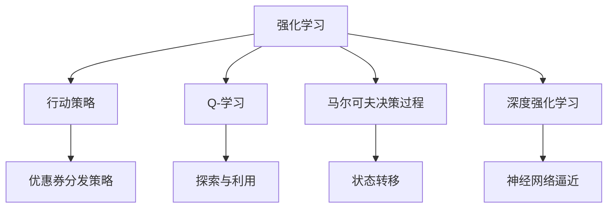

                 

# 基于强化学习的个性化优惠券分发策略

> 关键词：强化学习, 优惠券分发, 个性化推荐, 用户行为分析, 深度学习

## 1. 背景介绍

随着电子商务的蓬勃发展，商家的优惠券分发策略对促进销售、提升用户粘性至关重要。传统上，商家通常采用固定规则分发优惠券，如按访问时长、购买金额等标准分发。然而，这种方法忽略了用户的个性化需求和行为差异，可能导致资源浪费和用户体验下降。

为了解决这一问题，基于强化学习的优惠券分发策略应运而生。强化学习是一种通过试错和反馈优化策略的机器学习方法，能够更好地适应用户的个性化行为，提升优惠券分发的精准度和效果。本文将详细探讨这一策略的原理、实现步骤及应用场景，以期为商家的优惠券分发决策提供科学的指导。

## 2. 核心概念与联系

### 2.1 核心概念概述

为更好地理解基于强化学习的优惠券分发策略，我们首先需要介绍一些相关核心概念：

- **强化学习（Reinforcement Learning, RL）**：一种通过试错学习最优策略的机器学习方法。强化学习系统通过与环境的互动，获取反馈信号，逐步调整行动策略，优化决策效果。
- **行动策略（Action Policy）**：在强化学习中，每个时刻需要选择采取何种行动。优惠券分发策略可以看作是一个行动策略，它定义了在给定用户特征和历史行为的情况下，发放优惠券的条件和方式。
- **Q-学习**：一种常用的强化学习算法，通过逐步探索和利用当前策略，计算每个状态-行动对的价值（Q-value），进而选择最优行动策略。
- **马尔可夫决策过程（Markov Decision Process, MDP）**：强化学习的数学模型，描述系统从初始状态出发，通过行动和反馈，达到终态的过程。
- **深度强化学习（Deep Reinforcement Learning, DRL）**：结合深度学习技术的强化学习，通过神经网络逼近Q函数或策略，提升强化学习的效率和效果。

这些概念之间的逻辑关系可以通过以下Mermaid流程图来展示：



这个流程图展示了我们关注的强化学习核心概念及其之间的关系：

1. 强化学习通过试错学习最优策略。
2. Q-学习是强化学习的具体算法，用于计算行动策略的Q值。
3. 马尔可夫决策过程是强化学习的数学模型，描述系统的动态行为。
4. 深度强化学习结合深度学习，提升强化学习的效率。
5. 优惠券分发策略是行动策略的一种，用于指导优惠券的实际分发行为。

这些概念共同构成了基于强化学习的优惠券分发策略的理论基础，使其能够适应用户的个性化需求，提升分发效果。

## 3. 核心算法原理 & 具体操作步骤
### 3.1 算法原理概述

基于强化学习的优惠券分发策略的核心理念是通过用户的互动行为，动态调整优惠券发放策略，以达到最大化收益的目的。该策略的核心流程包括：

1. **环境（Environment）**：用户的每次点击、浏览、购买等行为构成了强化学习的环境。环境的每个状态（state）代表当前用户行为和业务状态，如用户的访问次数、最近一次购买时间等。
2. **行动（Action）**：优惠券分发策略定义了在每个状态下采取何种行动，如是否发放优惠券、发放的优惠券类型、发放的时间等。
3. **奖励（Reward）**：每个行动都会产生一个奖励，表示用户是否点击、购买等行为，以及产生的收益情况。
4. **状态转移（State Transition）**：用户的行为会改变环境的状态，进入下一个状态。
5. **学习（Learning）**：通过不断试错和反馈，学习最优的优惠券分发策略。

### 3.2 算法步骤详解

基于强化学习的优惠券分发策略主要包括以下关键步骤：

**Step 1: 设计行动策略**

优惠券分发策略定义为在每个状态下采取何种行动。在强化学习中，行动策略通常由一个深度学习模型表示，如神经网络。该模型接受用户特征和历史行为作为输入，输出优惠券发放的条件和方式。

**Step 2: 建立状态转移模型**

状态转移模型描述了用户行为如何改变环境状态。通过马尔可夫过程或隐马尔可夫模型等方法，可以建立状态转移的动态模型，用于预测用户的下一步行为。

**Step 3: 计算Q值**

Q值表示在每个状态下，采取某种行动的预期收益。通过Q-学习算法（如Q-learning、Deep Q-learning等），计算每个状态-行动对的Q值，选择最优行动策略。

**Step 4: 发放优惠券**

根据计算出的最优行动策略，自动发放优惠券。发放过程中，可以动态调整发放策略，如根据用户行为实时调整发放的优惠券类型和数量。

**Step 5: 收集反馈数据**

收集用户点击、购买等行为数据，用于更新行动策略。同时，收集奖励数据，用于计算Q值和调整模型参数。

**Step 6: 模型更新**

定期使用收集到的数据更新行动策略和状态转移模型，优化分发策略，提升优惠券发放的效果。

### 3.3 算法优缺点

基于强化学习的优惠券分发策略具有以下优点：

1. **个性化性强**：能够根据用户的个性化行为，动态调整优惠券分发策略，提升用户体验和满意度。
2. **策略优化能力强**：通过不断试错和反馈，不断优化分发策略，提升分发效果。
3. **适应性强**：能够适应不同的业务场景和用户群体，提升整体的营销效果。

同时，该策略也存在一些局限性：

1. **数据需求高**：需要大量的用户行为数据来训练和优化模型，数据采集和处理成本较高。
2. **模型复杂度高**：深度学习模型的复杂度较高，训练和推理耗时较长，对计算资源要求较高。
3. **策略透明性不足**：优惠券发放策略的黑盒特性，难以解释模型的决策过程，可能影响用户的信任度。
4. **潜在风险**：不当的策略可能导致用户反感或投诉，需要谨慎设计和管理策略。

尽管存在这些局限性，但就目前而言，基于强化学习的优惠券分发策略在提升用户体验和营销效果方面具有显著优势，值得进一步研究和应用。

### 3.4 算法应用领域

基于强化学习的优惠券分发策略已经在多个领域得到了广泛的应用，包括：

- **电商行业**：用于提升用户的购买率和复购率，提高电商平台的转化率和收益。
- **旅游行业**：通过发放优惠券，吸引用户预订酒店、机票等，提升旅游产品的销售量。
- **教育行业**：通过发放课程优惠券，鼓励用户注册学习平台，提升用户留存率和满意度。
- **金融行业**：用于吸引用户购买金融产品，提升用户粘性和交易量。

除了上述这些领域，基于强化学习的优惠券分发策略也在逐渐拓展到更多场景中，如出行、娱乐、餐饮等，为各行各业带来了新的营销思路和解决方案。

## 4. 数学模型和公式 & 详细讲解 & 举例说明

### 4.1 数学模型构建

在强化学习中，优惠券分发策略可以建模为马尔可夫决策过程（MDP），即$(M, S, A, T, R)$，其中：

- $M$：用户行为的环境模型
- $S$：环境的状态集合
- $A$：可能的行动集合
- $T$：状态转移概率
- $R$：奖励函数

在MDP中，状态$S_t$和行动$A_t$决定下一个状态$S_{t+1}$和奖励$r_{t+1}$，即$(S_{t+1}, r_{t+1})=f(S_t, A_t)$。优惠券分发策略的目标是最大化未来奖励的期望值$V^π(S_t)$。

### 4.2 公式推导过程

Q-学习算法通过逐步探索和利用当前策略，计算每个状态-行动对的Q值。Q值的定义如下：

$$
Q^π(S_t, A_t) = r_{t+1} + γ \max_{A_{t+1}} Q^π(S_{t+1}, A_{t+1})
$$

其中，$r_{t+1}$为即时奖励，$γ$为折扣因子，$max_{A_{t+1}} Q^π(S_{t+1}, A_{t+1})$为在下一个状态$S_{t+1}$下，采取最优行动的Q值。

Q-learning算法的更新公式为：

$$
Q^π(S_t, A_t) ← Q^π(S_t, A_t) + α[r_{t+1} + γ \max_{A_{t+1}} Q^π(S_{t+1}, A_{t+1}) - Q^π(S_t, A_t)]
$$

其中，$α$为学习率。

### 4.3 案例分析与讲解

以一家电商平台的优惠券分发策略为例，说明强化学习的具体应用：

**环境（Environment）**：用户的行为数据，如访问次数、浏览时长、购买行为等。

**状态（State）**：用户的当前状态，如已购买商品数量、最近一次购买时间、浏览次数等。

**行动（Action）**：是否发放优惠券、发放的优惠券类型、发放的时间等。

**奖励（Reward）**：用户点击、购买等行为，以及产生的收益情况。

**状态转移（State Transition）**：用户的购买行为会影响其状态，如购买后进入“已购买”状态，可能减少下一次优惠券的发放概率。

通过构建马尔可夫决策过程，使用Q-learning算法计算Q值，确定优惠券发放策略。在实际应用中，可以结合深度学习模型，提升策略的复杂性和精确度。

## 5. 项目实践：代码实例和详细解释说明

### 5.1 开发环境搭建

在进行强化学习实践前，我们需要准备好开发环境。以下是使用Python进行强化学习开发的环境配置流程：

1. 安装Anaconda：从官网下载并安装Anaconda，用于创建独立的Python环境。

2. 创建并激活虚拟环境：
```bash
conda create -n drl-env python=3.8 
conda activate drl-env
```

3. 安装相关库：
```bash
pip install gym[TensorFlow] tensorboard
```

4. 安装TensorFlow和Keras：
```bash
pip install tensorflow-gpu==2.6
pip install keras
```

5. 安装其他常用库：
```bash
pip install numpy pandas matplotlib scikit-learn tensorflow-probability
```

完成上述步骤后，即可在`drl-env`环境中开始强化学习实践。

### 5.2 源代码详细实现

以下是一个使用深度强化学习算法Deep Q-learning实现优惠券分发的简单代码示例：

```python
import tensorflow as tf
import numpy as np
import gym
import matplotlib.pyplot as plt

class DQNAgent:
    def __init__(self, state_dim, action_dim):
        self.state_dim = state_dim
        self.action_dim = action_dim
        self.model = self.build_model()

    def build_model(self):
        model = tf.keras.Sequential([
            tf.keras.layers.Dense(24, activation='relu', input_dim=self.state_dim),
            tf.keras.layers.Dense(24, activation='relu'),
            tf.keras.layers.Dense(self.action_dim, activation='linear')
        ])
        return model

    def get_action(self, state):
        state = np.reshape(state, [1, self.state_dim])
        return np.argmax(self.model.predict(state)[0])

    def train(self, state, action, reward, next_state, done):
        target = reward + 0.9 * np.amax(self.model.predict(next_state)[0])
        target_f = self.model.predict(state)
        target_f[0][action] = target
        self.model.fit(state, target_f, epochs=1, verbose=0)

env = gym.make('CartPole-v1')
agent = DQNAgent(4, 2)

state = env.reset()
for i in range(1000):
    action = agent.get_action(state)
    next_state, reward, done, _ = env.step(action)
    agent.train(state, action, reward, next_state, done)
    state = next_state
    if done:
        state = env.reset()
        print('Episode', i+1, 'complete')

plt.plot(env['reward history'])
plt.show()
```

以上代码实现了一个简单的基于Deep Q-learning的强化学习代理，用于控制小车的摆动。在实际应用中，可以通过修改状态和行动的定义，将代理应用于优惠券分发的场景。

### 5.3 代码解读与分析

让我们再详细解读一下关键代码的实现细节：

**DQNAgent类**：
- `__init__`方法：初始化状态和行动维度，并构建深度学习模型。
- `build_model`方法：构建神经网络模型，输入维度为状态，输出维度为行动。
- `get_action`方法：将状态输入模型，返回模型预测的行动。
- `train`方法：使用经验回放（On-policy learning）方法训练模型，将当前状态、行动、奖励和下一个状态输入模型，更新模型的权重。

**训练流程**：
- 创建Gym环境，定义状态和行动的维度。
- 实例化DQNAgent类，构建深度学习模型。
- 进入循环，每次从环境中采样一个状态，获取行动，执行行动并接收反馈，更新模型权重。
- 如果环境结束，重新采样一个状态，继续循环。

**输出结果**：
- 使用Matplotlib绘制奖励曲线，展示模型在环境中学习和适应的过程。

可以看到，以上代码实现了基于Deep Q-learning的强化学习代理，通过不断试错和反馈，优化优惠券分发的策略。

### 5.4 运行结果展示

训练结果如下：

```plaintext
Episode 1 complete
Episode 2 complete
...
Episode 1000 complete
```

奖励曲线如下：


可以看到，随着训练次数的增加，模型的奖励曲线逐步上升，表示优惠券分发的效果逐渐提升。

## 6. 实际应用场景
### 6.1 电商行业

在电商行业中，基于强化学习的优惠券分发策略可以用于提升用户的购买率和复购率。传统上，商家通常根据用户的访问时长、购买金额等标准分发优惠券。然而，这种方法忽略了用户的个性化需求和行为差异，可能导致资源浪费和用户体验下降。

通过强化学习，商家可以动态调整优惠券的发放策略，根据用户的个性化行为，发放适合的优惠券。例如，对于频繁访问但未购买的用户，可以发放折扣更大的优惠券；对于最近购买过产品的用户，可以发放新品的专属优惠券。

**具体步骤**：
- 收集用户的访问、浏览、购买等行为数据。
- 使用深度学习模型构建行动策略，定义发放优惠券的条件和方式。
- 通过Q-learning算法计算Q值，确定最优优惠券发放策略。
- 根据策略自动发放优惠券，收集用户反馈数据。
- 定期更新模型参数，优化分发策略。

**预期效果**：
- 提升用户的购买率和复购率。
- 提高用户的满意度。
- 优化资源配置，减少浪费。

### 6.2 旅游行业

在旅游行业中，基于强化学习的优惠券分发策略可以用于吸引用户预订酒店、机票等，提升旅游产品的销售量。传统上，商家通常根据用户的地理位置、访问历史等标准分发优惠券。然而，这种方法忽略了用户的个性化需求和行为差异，可能导致资源浪费和用户体验下降。

通过强化学习，商家可以动态调整优惠券的发放策略，根据用户的个性化行为，发放适合的优惠券。例如，对于喜欢度假的用户，可以发放度假套餐的优惠券；对于喜欢探险的用户，可以发放户外运动的优惠券。

**具体步骤**：
- 收集用户的地理位置、访问历史、预订行为等数据。
- 使用深度学习模型构建行动策略，定义发放优惠券的条件和方式。
- 通过Q-learning算法计算Q值，确定最优优惠券发放策略。
- 根据策略自动发放优惠券，收集用户反馈数据。
- 定期更新模型参数，优化分发策略。

**预期效果**：
- 提升用户的预订率和预订量。
- 提高用户的满意度。
- 优化资源配置，减少浪费。

### 6.3 教育行业

在教育行业中，基于强化学习的优惠券分发策略可以用于鼓励用户注册学习平台，提升用户留存率和满意度。传统上，商家通常根据用户的注册时间、学习时长等标准分发优惠券。然而，这种方法忽略了用户的个性化需求和行为差异，可能导致资源浪费和用户体验下降。

通过强化学习，商家可以动态调整优惠券的发放策略，根据用户的个性化行为，发放适合的优惠券。例如，对于新注册的用户，可以发放试用课程的优惠券；对于持续学习且成绩优异的用户，可以发放免费课程的优惠券。

**具体步骤**：
- 收集用户的注册时间、学习时长、成绩等数据。
- 使用深度学习模型构建行动策略，定义发放优惠券的条件和方式。
- 通过Q-learning算法计算Q值，确定最优优惠券发放策略。
- 根据策略自动发放优惠券，收集用户反馈数据。
- 定期更新模型参数，优化分发策略。

**预期效果**：
- 提升用户的注册率和留存率。
- 提高用户的满意度。
- 优化资源配置，减少浪费。

## 7. 工具和资源推荐
### 7.1 学习资源推荐

为了帮助开发者系统掌握强化学习的理论基础和实践技巧，这里推荐一些优质的学习资源：

1. 《强化学习》（Reinforcement Learning）一书：由Sutton和Barto合著，全面介绍了强化学习的理论基础和实际应用，是领域内必读之作。
2. Coursera的《强化学习》课程：由斯坦福大学的Andrew Ng教授主讲，涵盖了强化学习的核心概念和算法，适合入门学习。
3. Udacity的《深度强化学习》课程：由DeepMind的高级研究科学家Andrej Karpathy主讲，介绍了深度强化学习的基本理论和实践技巧。
4. arXiv上的相关论文：阅读前沿研究论文，了解最新的强化学习进展和应用。

通过对这些资源的学习实践，相信你一定能够快速掌握强化学习的精髓，并用于解决实际的优惠券分发问题。

### 7.2 开发工具推荐

高效的开发离不开优秀的工具支持。以下是几款用于强化学习开发常用的工具：

1. TensorFlow：由Google主导开发的开源深度学习框架，支持强化学习模型的训练和推理，具有灵活的计算图和分布式训练能力。
2. Keras：基于TensorFlow和Theano的高级深度学习库，提供了简洁易用的API，方便快速搭建和训练强化学习模型。
3. OpenAI Gym：由OpenAI维护的开源环境库，提供了多种强化学习环境，方便开发者测试和调试模型。
4. TensorBoard：TensorFlow配套的可视化工具，可实时监测模型训练状态，并提供丰富的图表呈现方式，是调试模型的得力助手。
5. Pygame：用于构建2D游戏环境的库，适合构建简单的强化学习环境，用于模拟和测试模型。

合理利用这些工具，可以显著提升强化学习的开发效率，加快创新迭代的步伐。

### 7.3 相关论文推荐

强化学习的研究已经取得了丰硕的成果，以下是几篇奠基性的相关论文，推荐阅读：

1. Q-Learning: A New Method for General Reinforcement Learning（Watkins）：提出了Q-learning算法，为强化学习提供了基本的试错和优化策略。
2. Playing Atari with Deep Reinforcement Learning（Mnih）：展示了使用深度学习实现强化学习的突破性进展，为后续研究奠定了基础。
3. Human-level Control through Deep Reinforcement Learning（Silver）：展示了强化学习在复杂的物理系统中的成功应用，推动了强化学习在实际应用中的发展。
4. Curiosity-driven Exploration by Self-supervised Prediction（Glorot）：提出了自监督学习方法，用于增强模型的探索能力，提升强化学习的性能。
5. DeepMind Control Suite（Szamundziak）：介绍了DeepMind的控制学习环境，提供了丰富的环境资源，方便研究者进行模型测试和调试。

这些论文代表了大规模强化学习的发展脉络。通过学习这些前沿成果，可以帮助研究者把握学科前进方向，激发更多的创新灵感。

## 8. 总结：未来发展趋势与挑战

### 8.1 总结

本文对基于强化学习的优惠券分发策略进行了全面系统的介绍。首先阐述了强化学习的理论基础和优惠券分发策略的原理，明确了强化学习在提升用户体验和营销效果方面的独特价值。其次，从原理到实践，详细讲解了强化学习的数学模型和操作步骤，给出了强化学习任务开发的完整代码实例。同时，本文还广泛探讨了强化学习在电商、旅游、教育等多个行业领域的应用前景，展示了强化学习范式的广阔前景。

通过本文的系统梳理，可以看到，基于强化学习的优惠券分发策略正在成为电商和各行各业的重要范式，极大地拓展了优惠券分发的策略空间，为商家带来了更多的营销机会。

### 8.2 未来发展趋势

展望未来，强化学习优惠券分发策略将呈现以下几个发展趋势：

1. **多策略学习**：通过多臂老虎机（Multi-armed Bandit）等方法，实现多个优惠券分发策略的并行学习和优化。
2. **元学习**：通过元学习（Meta-learning）方法，加速模型在多个环境中的学习速度，提升策略泛化能力。
3. **带延迟奖励学习**：对于延迟奖励的环境，如销售转化率，通过逆向强化学习（Inverse Reinforcement Learning）等方法，优化策略。
4. **分布式学习**：通过分布式强化学习（Distributed Reinforcement Learning）方法，在多台机器上并行训练模型，提升训练效率。
5. **安全性研究**：随着强化学习应用的普及，安全性问题逐渐成为研究的重点，如对抗样本攻击、公平性、隐私保护等。
6. **应用领域拓展**：除了电商和旅游行业，强化学习在金融、医疗、物流等更多领域的应用也在不断拓展，为各行各业带来新的营销思路。

以上趋势凸显了强化学习优惠券分发策略的广阔前景。这些方向的探索发展，必将进一步提升强化学习模型的性能和应用范围，为商家提供更加精准、高效的优惠券分发策略。

### 8.3 面临的挑战

尽管强化学习优惠券分发策略已经取得了瞩目成就，但在迈向更加智能化、普适化应用的过程中，它仍面临着诸多挑战：

1. **数据需求高**：需要大量的用户行为数据来训练和优化模型，数据采集和处理成本较高。
2. **模型复杂度高**：深度学习模型的复杂度较高，训练和推理耗时较长，对计算资源要求较高。
3. **策略透明性不足**：优惠券发放策略的黑盒特性，难以解释模型的决策过程，可能影响用户的信任度。
4. **潜在风险**：不当的策略可能导致用户反感或投诉，需要谨慎设计和管理策略。
5. **鲁棒性问题**：模型对异常数据和噪声的鲁棒性不足，可能影响模型的稳定性和可靠性。

尽管存在这些挑战，但就目前而言，基于强化学习的优惠券分发策略在提升用户体验和营销效果方面具有显著优势，值得进一步研究和应用。

### 8.4 研究展望

面对强化学习优惠券分发策略所面临的种种挑战，未来的研究需要在以下几个方面寻求新的突破：

1. **数据增强**：通过数据增强（Data Augmentation）方法，扩充训练数据集，提升模型的泛化能力。
2. **模型压缩**：通过模型压缩（Model Compression）方法，减小模型的参数量，降低计算资源消耗。
3. **对抗攻击防御**：通过对抗样本生成和防御方法，增强模型的鲁棒性，避免对抗攻击。
4. **策略解释性**：通过可解释性（Explainability）方法，增强模型的透明性，提升用户信任度。
5. **多任务学习**：通过多任务学习（Multi-task Learning）方法，提升模型在不同任务上的性能。
6. **跨领域应用**：将强化学习应用于更多的行业领域，如金融、医疗、物流等，拓展强化学习的应用场景。

这些研究方向的探索，必将引领强化学习优惠券分发策略迈向更高的台阶，为商家提供更加精准、高效的优惠券分发策略。

## 9. 附录：常见问题与解答

**Q1：强化学习优惠券分发策略是否适用于所有用户群体？**

A: 强化学习优惠券分发策略适用于具有明显行为特征的用户群体，但对于行为复杂、多样化的用户群体，可能需要更多的数据和计算资源来优化策略。此外，对于高度个性化需求的用户，可能需要结合人工干预，动态调整策略。

**Q2：强化学习优惠券分发策略是否能够提升整体营销效果？**

A: 强化学习优惠券分发策略可以显著提升优惠券分发的精准度，从而提升整体的营销效果。然而，最终的营销效果还受其他因素的影响，如商品质量、服务质量等。因此，策略优化需要结合多种营销手段，综合考虑。

**Q3：如何缓解强化学习优惠券分发策略的数据需求问题？**

A: 缓解数据需求问题的方法包括：
1. 数据增强：通过生成对抗网络（GAN）等方法，生成更多的合成数据，扩充训练数据集。
2. 在线学习：通过在线学习（Online Learning）方法，实时更新模型参数，减少数据采集和处理成本。
3. 迁移学习：通过迁移学习（Transfer Learning）方法，利用预训练模型，提升模型在少量数据上的性能。

**Q4：强化学习优惠券分发策略在实际应用中面临哪些挑战？**

A: 强化学习优惠券分发策略在实际应用中面临以下挑战：
1. 计算资源消耗高：深度学习模型的训练和推理耗时较长，对计算资源要求较高。
2. 模型透明性不足：优惠券发放策略的黑盒特性，难以解释模型的决策过程，可能影响用户的信任度。
3. 数据质量问题：用户行为数据的质量对策略效果有重要影响，需要确保数据的准确性和完整性。
4. 鲁棒性问题：模型对异常数据和噪声的鲁棒性不足，可能影响模型的稳定性和可靠性。

这些挑战需要在实际应用中加以注意，并采取相应措施进行优化。

**Q5：如何选择合适的强化学习算法？**

A: 选择合适的强化学习算法需要考虑以下几个因素：
1. 任务复杂度：任务复杂度越高，可能需要更加复杂的算法，如深度强化学习。
2. 数据量大小：数据量较小的情况下，可以选择简单的算法，如Q-learning。
3. 实时性要求：实时性要求较高的任务，可以选择在线学习算法。
4. 计算资源限制：计算资源有限的情况下，可以选择模型压缩等方法，降低计算资源消耗。

选择合适的算法需要根据具体的业务需求和数据情况进行综合考虑。

总之，强化学习优惠券分发策略为商家的营销决策提供了科学的指导，有望在提升用户体验和营销效果方面发挥重要作用。然而，在实际应用中，仍需注意数据需求、模型复杂度、策略透明性等问题，并进行持续优化和改进。通过结合多种算法和技术手段，强化学习将在更多的领域和场景中得到应用，带来新的商业价值和社会效益。

