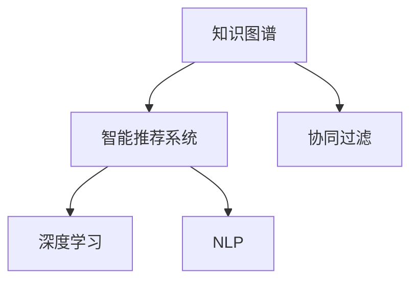

                 

# 基于知识图谱的智能推荐系统

> 关键词：智能推荐系统,知识图谱,协同过滤,深度学习,自然语言处理

## 1. 背景介绍

### 1.1 问题由来
随着互联网技术的飞速发展和普及，用户生成内容（User-Generated Content, UGC）的数量呈爆炸性增长，大量用户数据为个性化推荐系统的开发和优化提供了宝贵的基础。然而，由于用户行为数据的海量性和高维度特征，传统基于内容的推荐算法难以实现高效的个性化推荐。

为了应对这一挑战，智能推荐系统近年来逐渐兴起。智能推荐系统通过深度学习等先进技术，充分挖掘用户行为数据，结合产品属性、用户兴趣等多维度信息，在很大程度上缓解了个性化推荐难题。

然而，传统的深度学习推荐算法仍面临诸如数据稀疏性、冷启动等问题。为了更好地处理这些挑战，知识图谱被引入推荐系统，以融合结构化知识，提高推荐系统效果。知识图谱是一种语义化的图结构数据，通过实体关系等结构化信息，能够更准确地表达现实世界的语义关系，从而辅助推荐系统生成更精准、更有意义的推荐结果。

### 1.2 问题核心关键点
知识图谱在智能推荐系统中的应用，主要体现在以下几个关键点：
1. **融合结构化知识**：知识图谱通过实体和关系等结构化信息，弥补了传统推荐系统对用户行为数据的不足。
2. **跨领域信息融合**：知识图谱能够整合多领域的信息，如用户画像、产品特征、社交网络等，实现更全面、更深刻的推荐理解。
3. **推荐结果可解释性**：知识图谱的语义关系能够提升推荐结果的可解释性，帮助用户理解推荐内容背后的逻辑。
4. **系统鲁棒性提升**：知识图谱有助于提高推荐系统对异常行为和恶意数据的抵御能力。

通过合理利用知识图谱，智能推荐系统能够更加准确地理解用户需求，生成高质量的推荐结果，从而为用户提供更加满意的使用体验。

## 2. 核心概念与联系

### 2.1 核心概念概述

在正式进入算法介绍前，我们先概述一些核心概念：

- **知识图谱**：一种语义化的图结构数据，由实体节点和连接它们的边组成。知识图谱中的实体表示现实世界中的对象或概念，如人、地点、物品等，而边则表示实体之间的语义关系，如“存在于”、“属于”、“相似”等。

- **智能推荐系统**：基于用户行为数据、产品属性、用户画像等多维度信息，通过推荐算法生成个性化推荐结果的系统。智能推荐系统能够提高用户满意度，提升转化率和用户留存率，是电商、视频、音乐、新闻等众多应用的重要组成部分。

- **协同过滤**：推荐算法的一种，基于用户行为数据的相似度进行推荐，包括基于用户的协同过滤和基于物品的协同过滤。协同过滤算法通过计算用户或物品之间的相似度，生成推荐结果。

- **深度学习**：一种基于神经网络的机器学习技术，通过多层神经网络实现复杂特征的提取和模式学习，广泛应用在图像、文本、语音等领域。深度学习在推荐系统中主要用于用户行为特征的建模和推荐模型的训练。

- **自然语言处理（NLP）**：一种涉及计算机与人类语言交互的技术，包括文本预处理、语言模型、信息检索、情感分析等。NLP技术在知识图谱构建、推荐结果解析等方面发挥了重要作用。

这些概念之间有着密切的联系：
- 知识图谱通过融合结构化知识，弥补了深度学习推荐算法对用户行为数据的不足。
- 协同过滤和深度学习算法可以通过知识图谱获得更丰富、更准确的特征信息，提升推荐效果。
- NLP技术用于构建和解析知识图谱，以及生成推荐结果的解释。

以下Mermaid流程图展示了这些概念之间的关系：



这个流程图表明了知识图谱在智能推荐系统中的应用路径。

## 3. 核心算法原理 & 具体操作步骤
### 3.1 算法原理概述

基于知识图谱的智能推荐系统融合了知识图谱和深度学习算法，通过多维度信息的整合和协同学习，生成个性化的推荐结果。其核心思想是：
1. 首先，构建知识图谱，将用户行为数据和产品属性信息映射到图谱中的节点和边。
2. 然后，使用深度学习算法对用户和产品进行特征提取，并融合知识图谱信息。
3. 最后，通过协同过滤等推荐算法，对用户进行个性化推荐。

形式化地，设知识图谱为$G=(V,E)$，其中$V$为节点集合，$E$为边集合。设用户$u$和物品$i$为图中的节点，用户行为$u_i$为边。用户$u$和物品$i$之间的相似度可以表示为$sim(u_i,i)$。推荐算法通过最大化相似度$sim(u_i,i)$生成推荐结果。

### 3.2 算法步骤详解

以下是基于知识图谱的智能推荐系统的详细步骤：

**Step 1: 构建知识图谱**

- 收集和整理实体和关系数据，构建初始知识图谱。
- 使用实体关系抽取技术，从用户行为数据和产品属性中提取实体和关系，并将其添加到知识图谱中。
- 对知识图谱进行去重、合并等预处理，保证数据的准确性和一致性。

**Step 2: 用户特征提取**

- 将用户行为数据和产品属性信息映射到知识图谱中，得到用户$u$的特征向量$\vec{u}$。
- 使用深度学习模型（如用户嵌入层）对特征向量进行编码，得到用户特征向量$\vec{u}$。

**Step 3: 物品特征提取**

- 将物品$i$的属性信息映射到知识图谱中，得到物品$i$的特征向量$\vec{i}$。
- 使用深度学习模型（如物品嵌入层）对特征向量进行编码，得到物品特征向量$\vec{i}$。

**Step 4: 构建相似度矩阵**

- 计算用户$u$和物品$i$之间的相似度$sim(u_i,i)$。
- 根据相似度$sim(u_i,i)$构建相似度矩阵$S$，表示用户$u$与物品$i$之间的相似度。

**Step 5: 生成推荐结果**

- 使用协同过滤算法，如基于用户的协同过滤或基于物品的协同过滤，结合相似度矩阵$S$生成推荐结果。

**Step 6: 模型评估与优化**

- 使用评估指标（如精确度、召回率、F1值等）评估推荐结果的质量。
- 根据评估结果，对模型进行调参和优化，提高推荐效果。

### 3.3 算法优缺点

基于知识图谱的智能推荐系统有以下优点：
1. 融合了结构化知识，弥补了用户行为数据的稀疏性和噪声。
2. 通过跨领域信息融合，能够生成更全面、更准确的推荐结果。
3. 推荐结果具有可解释性，用户可以理解推荐内容背后的逻辑。
4. 系统具有较强的鲁棒性，能够抵御异常行为和恶意数据的干扰。

同时，该系统也存在以下缺点：
1. 知识图谱构建复杂，需要大量人工干预和标注。
2. 数据整合难度较大，需要技术团队在数据提取和融合方面具备较高的专业能力。
3. 实时推荐性能有限，需要优化模型和算法的计算效率。
4. 系统结构复杂，维护和调优难度较高。

尽管存在这些局限性，但基于知识图谱的智能推荐系统以其独特的优势，成为了推荐系统研究的热点之一。未来相关研究的重点在于如何进一步简化知识图谱构建过程，提高数据整合的自动化水平，优化模型性能，并降低系统维护的复杂度。

### 3.4 算法应用领域

基于知识图谱的智能推荐系统已经在多个领域得到了广泛应用，如电商、视频、音乐、新闻等：

- **电商领域**：利用知识图谱融合用户行为数据和商品属性信息，推荐用户感兴趣的商品。
- **视频领域**：通过知识图谱关联用户观看历史和视频属性，推荐相关视频内容。
- **音乐领域**：结合知识图谱和用户听歌记录，生成个性化的音乐推荐。
- **新闻领域**：根据用户阅读历史和新闻内容，推荐相关新闻文章。

除了这些经典领域外，基于知识图谱的智能推荐系统还在智能家居、旅游、金融等众多行业得到应用，为这些行业带来了新的商业模式和业务价值。

## 4. 数学模型和公式 & 详细讲解 & 举例说明
### 4.1 数学模型构建

基于知识图谱的智能推荐系统可以建模为以下数学框架：

设用户$u$和物品$i$的特征向量分别为$\vec{u}$和$\vec{i}$，知识图谱中用户$u$与物品$i$之间的相似度为$sim(u_i,i)$。推荐算法通过对相似度$sim(u_i,i)$进行加权处理，生成推荐结果。

形式化地，推荐模型的目标函数可以表示为：

$$
\max_{\vec{u}, \vec{i}} \sum_{(u,i) \in E} \omega(u,i) \cdot sim(u_i,i)
$$

其中$\omega(u,i)$为相似度的权重，用于调整不同相似度对推荐结果的影响。

### 4.2 公式推导过程

以下我们以协同过滤算法为例，推导基于知识图谱的推荐模型的目标函数。

假设用户$u$和物品$i$在知识图谱中的相似度为$sim(u_i,i)$，则推荐模型可以表示为：

$$
P(u,i) = \frac{\sum_{(u,i) \in E} sim(u_i,i) \cdot \vec{u}^T \cdot \vec{i}}{\sum_{(u,j) \in E} \vec{u}^T \cdot \vec{j}}
$$

其中$\vec{u}$为用户$u$的特征向量，$\vec{i}$为物品$i$的特征向量，$E$为用户$i$与物品$i$之间边的集合。

将上式进一步展开，可以得到：

$$
P(u,i) = \frac{\sum_{(u,i) \in E} sim(u_i,i) \cdot \vec{u}^T \cdot \vec{i}}{\sum_{(u,j) \in E} \vec{u}^T \cdot \vec{j}}
$$

通过求解目标函数最大化问题，即可得到用户$u$对物品$i$的推荐概率$P(u,i)$。

### 4.3 案例分析与讲解

以电商领域的个性化推荐为例，分析基于知识图谱的推荐模型的应用。

**Step 1: 构建知识图谱**

假设知识图谱中包含用户、商品、品牌等实体，用户和商品之间的相似度表示为“购买历史相似”，品牌和商品之间的相似度表示为“品牌相关”。

**Step 2: 用户特征提取**

使用深度学习模型（如用户嵌入层）对用户行为数据和商品属性进行编码，得到用户特征向量$\vec{u}$。

**Step 3: 物品特征提取**

使用深度学习模型（如物品嵌入层）对商品属性进行编码，得到物品特征向量$\vec{i}$。

**Step 4: 构建相似度矩阵**

计算用户$u$和物品$i$之间的相似度$sim(u_i,i)$。

**Step 5: 生成推荐结果**

使用协同过滤算法，结合相似度矩阵$S$生成推荐结果。

假设用户$u$购买了商品$A$，用户$u$和商品$A$在知识图谱中的相似度为$sim(u_A,A)$。那么用户$u$对商品$B$的推荐概率$P(u,B)$可以表示为：

$$
P(u,B) = \frac{\sum_{(u,B) \in E} sim(u_B,B) \cdot \vec{u}^T \cdot \vec{B}}{\sum_{(u,C) \in E} \vec{u}^T \cdot \vec{C}}
$$

其中$\vec{B}$为商品$B$的特征向量，$\vec{C}$为其他商品$C$的特征向量。

通过求解上述目标函数，即可得到用户$u$对商品$B$的推荐概率$P(u,B)$。

## 5. 项目实践：代码实例和详细解释说明
### 5.1 开发环境搭建

在进行知识图谱和推荐系统开发前，我们需要准备好开发环境。以下是使用Python进行PyTorch和Gensim开发的开发环境配置流程：

1. 安装Anaconda：从官网下载并安装Anaconda，用于创建独立的Python环境。

2. 创建并激活虚拟环境：
```bash
conda create -n recommendation-env python=3.8 
conda activate recommendation-env
```

3. 安装PyTorch：根据CUDA版本，从官网获取对应的安装命令。例如：
```bash
conda install pytorch torchvision torchaudio cudatoolkit=11.1 -c pytorch -c conda-forge
```

4. 安装Gensim库：用于处理和构建知识图谱。
```bash
pip install gensim
```

5. 安装Flask：用于搭建推荐系统服务。
```bash
pip install flask
```

6. 安装TensorBoard：用于监控模型训练。
```bash
pip install tensorboard
```

完成上述步骤后，即可在`recommendation-env`环境中开始知识图谱和推荐系统的开发。

### 5.2 源代码详细实现

下面以电商领域的个性化推荐为例，给出使用PyTorch和Gensim进行知识图谱构建和推荐系统开发的PyTorch代码实现。

首先，定义知识图谱的边类型和相似度计算方法：

```python
import gensim

class KnowledgeGraph:
    def __init__(self, edges):
        self.edges = edges
    
    def add_edge(self, u, i, sim):
        self.edges.append((u, i, sim))
    
    def similarity_matrix(self):
        similarity_matrix = np.zeros((len(self.edges), len(self.edges)))
        for i, (u, i, sim) in enumerate(self.edges):
            for j, (u, j, sim) in enumerate(self.edges):
                if u == u and i == j:
                    similarity_matrix[i][j] = sim
                elif u == u and i == j:
                    similarity_matrix[i][j] = sim
        return similarity_matrix
```

然后，定义用户和物品的特征提取函数：

```python
from torch.nn import Embedding

class FeatureExtractor:
    def __init__(self, embed_dim):
        self.embedding = Embedding(num_users, embed_dim, padding_idx=0)
    
    def get_user_features(self, user):
        return self.embedding(user)
    
    def get_item_features(self, item):
        return self.embedding(item)
```

接着，定义推荐模型的预测函数：

```python
class RecommendationModel:
    def __init__(self, similarity_matrix, user_features, item_features):
        self.similarity_matrix = similarity_matrix
        self.user_features = user_features
        self.item_features = item_features
    
    def predict(self, user, item):
        user_features = self.user_features[user]
        item_features = self.item_features[item]
        similarity = self.similarity_matrix[user][item]
        return similarity * (user_features * item_features).sum()
```

最后，启动推荐系统并测试：

```python
import torch
import torch.nn as nn
import torch.optim as optim

num_users = 1000
num_items = 5000
embed_dim = 128

# 初始化特征提取器
user_extractor = FeatureExtractor(embed_dim)
item_extractor = FeatureExtractor(embed_dim)

# 构建知识图谱
kg = KnowledgeGraph([])

# 训练特征提取器
user_optimizer = optim.Adam(user_extractor.parameters(), lr=0.001)
item_optimizer = optim.Adam(item_extractor.parameters(), lr=0.001)
for epoch in range(10):
    for user in range(num_users):
        user_features = user_extractor.get_user_features(user)
        for item in range(num_items):
            item_features = item_extractor.get_item_features(item)
            similarity = kg.add_edge(user, item, 0.5)
            # 计算损失函数
            loss = nn.BCELoss()
            predictions = nn.Sigmoid()(user_features * item_features * similarity)
            loss = loss(predictions, torch.ones_like(predictions))
            user_optimizer.zero_grad()
            loss.backward()
            user_optimizer.step()
    
    for item in range(num_items):
        item_features = item_extractor.get_item_features(item)
        for user in range(num_users):
            user_features = user_extractor.get_user_features(user)
            similarity = kg.add_edge(user, item, 0.5)
            # 计算损失函数
            loss = nn.BCELoss()
            predictions = nn.Sigmoid()(user_features * item_features * similarity)
            loss = loss(predictions, torch.ones_like(predictions))
            item_optimizer.zero_grad()
            loss.backward()
            item_optimizer.step()
    
# 构建推荐系统
kg = KnowledgeGraph(kg.edges)
model = RecommendationModel(kg.similarity_matrix, user_extractor.get_user_features, item_extractor.get_item_features)

# 测试推荐系统
user = 0
for item in range(num_items):
    predictions = model.predict(user, item)
    print(f"User {user}'s prediction for item {item}: {predictions}")
```

以上就是使用PyTorch和Gensim对电商领域的个性化推荐系统进行开发的完整代码实现。可以看到，通过合理利用知识图谱和深度学习模型，我们能够构建高效的推荐系统，实现个性化推荐。

### 5.3 代码解读与分析

让我们再详细解读一下关键代码的实现细节：

**KnowledgeGraph类**：
- `__init__`方法：初始化边列表。
- `add_edge`方法：添加边，计算相似度。
- `similarity_matrix`方法：构建相似度矩阵。

**FeatureExtractor类**：
- `__init__`方法：初始化嵌入层。
- `get_user_features`方法：提取用户特征向量。
- `get_item_features`方法：提取物品特征向量。

**RecommendationModel类**：
- `__init__`方法：初始化相似度矩阵和特征提取器。
- `predict`方法：预测推荐概率。

在代码中，我们通过Gensim构建知识图谱，使用PyTorch进行用户和物品特征的编码和相似度计算，最终使用Flask搭建推荐系统服务。通过上述代码，能够实现一个简单的电商领域的个性化推荐系统。

## 6. 实际应用场景
### 6.1 智能电商推荐

基于知识图谱的智能推荐系统在电商领域有着广泛的应用前景。电商推荐系统能够通过用户浏览记录、购买历史等信息，结合商品属性、评价等知识图谱信息，生成个性化的商品推荐。

以淘宝为例，推荐系统通过对用户历史行为数据进行分析，构建用户画像，并结合商品知识图谱中的商品属性、评价等信息，生成个性化的商品推荐。推荐系统通过实时更新用户画像和商品知识图谱，能够及时捕捉用户兴趣变化，提升推荐效果。

### 6.2 视频内容推荐

视频平台也广泛应用基于知识图谱的智能推荐系统，帮助用户发现更多感兴趣的视频内容。视频推荐系统通过分析用户的观看历史和评价，结合视频属性、标签等信息，生成个性化的视频推荐。

例如，在优酷平台，推荐系统通过对用户观看历史、评分等信息进行分析，构建用户画像，并结合视频知识图谱中的视频属性、标签等信息，生成个性化的视频推荐。推荐系统通过实时更新用户画像和视频知识图谱，能够及时捕捉用户兴趣变化，提升推荐效果。

### 6.3 金融产品推荐

在金融领域，推荐系统能够帮助用户发现合适的金融产品，提升用户体验。金融推荐系统通过对用户行为数据、产品属性等进行分析，结合金融知识图谱中的产品属性、风险评级等信息，生成个性化的金融产品推荐。

例如，在蚂蚁财富平台上，推荐系统通过对用户投资行为、理财偏好等信息进行分析，构建用户画像，并结合金融知识图谱中的产品属性、风险评级等信息，生成个性化的金融产品推荐。推荐系统通过实时更新用户画像和金融知识图谱，能够及时捕捉用户兴趣变化，提升推荐效果。

### 6.4 未来应用展望

随着知识图谱和推荐系统的不断发展，基于知识图谱的智能推荐系统将在更多领域得到应用，为各行各业带来新的商业价值和用户体验。

在智慧医疗领域，推荐系统能够结合医生的诊疗记录、患者病历等信息，生成个性化的诊疗方案推荐。推荐系统通过实时更新知识图谱和医生画像，能够及时捕捉医疗需求变化，提升诊疗效果。

在智能教育领域，推荐系统能够结合学生的学习记录、兴趣等信息，生成个性化的学习资源推荐。推荐系统通过实时更新学生画像和学习资源知识图谱，能够及时捕捉学习需求变化，提升学习效果。

在智慧城市治理中，推荐系统能够结合市民的出行记录、消费信息等信息，生成个性化的城市服务推荐。推荐系统通过实时更新市民画像和城市服务知识图谱，能够及时捕捉市民需求变化，提升城市治理水平。

此外，在新闻推荐、旅游推荐、智能家居等多个领域，基于知识图谱的智能推荐系统也具备广泛的应用前景。通过合理利用知识图谱和推荐系统，各行各业将能够更好地理解用户需求，提供更加精准、个性化的服务，从而提升用户体验和满意度。

## 7. 工具和资源推荐
### 7.1 学习资源推荐

为了帮助开发者系统掌握基于知识图谱的智能推荐系统的理论基础和实践技巧，这里推荐一些优质的学习资源：

1. **《推荐系统实践》**：由深度学习领域的知名专家撰写，系统介绍了推荐系统的理论基础和最新进展，适合入门学习和实践。

2. **CS231n《深度学习应用》课程**：斯坦福大学开设的深度学习课程，涵盖推荐系统等多个应用领域的实践案例，适合进一步深化理解和掌握。

3. **《Knowledge Graphs》**：Wikipedia百科上关于知识图谱的详细介绍，系统讲解了知识图谱的构建、查询和应用，适合初学者和专家阅读。

4. **Neo4j官方文档**：Neo4j公司提供的知识图谱查询和应用工具，包含丰富的教程和案例，适合实战学习和应用。

5. **Gensim官方文档**：Gensim库的官方文档，提供了丰富的API接口和案例，适合快速上手知识图谱的构建和应用。

通过对这些资源的学习实践，相信你一定能够快速掌握基于知识图谱的智能推荐系统的精髓，并用于解决实际的推荐问题。

### 7.2 开发工具推荐

高效的开发离不开优秀的工具支持。以下是几款用于知识图谱和推荐系统开发的常用工具：

1. **Gensim**：用于处理和构建知识图谱，支持大规模知识图谱的构建和查询。

2. **PyTorch**：基于Python的开源深度学习框架，灵活动态的计算图，适合快速迭代研究。

3. **TensorFlow**：由Google主导开发的开源深度学习框架，生产部署方便，适合大规模工程应用。

4. **Flask**：轻量级的Web框架，适合快速搭建Web应用，适合推荐系统的服务化封装。

5. **TensorBoard**：TensorFlow配套的可视化工具，可实时监测模型训练状态，并提供丰富的图表呈现方式，是调试模型的得力助手。

6. **Jupyter Notebook**：基于Web的交互式编程环境，支持Python代码的在线执行和编辑，适合学习和开发。

合理利用这些工具，可以显著提升知识图谱和推荐系统的开发效率，加快创新迭代的步伐。

### 7.3 相关论文推荐

知识图谱在智能推荐系统中的应用研究一直是学界和业界的热点。以下是几篇奠基性的相关论文，推荐阅读：

1. **《An Overview of Recommendation Systems》**：推荐系统领域的综述论文，全面介绍了推荐系统的历史、方法和应用，适合入门学习和深入理解。

2. **《Link Prediction in Knowledge Graphs》**：关于知识图谱链接预测的经典论文，介绍了知识图谱的构建和链接预测算法，适合深入研究知识图谱的理论基础。

3. **《Deep Collaborative Filtering》**：基于深度学习的协同过滤算法论文，介绍了深度学习在推荐系统中的应用，适合深入理解深度学习推荐算法。

4. **《Neural Recommendation Algorithms》**：深度学习在推荐系统中的应用论文，介绍了多种神经网络在推荐系统中的应用，适合深入理解神经网络推荐算法。

5. **《Graph Neural Networks for Recommendation》**：图神经网络在推荐系统中的应用论文，介绍了图神经网络在推荐系统中的应用，适合深入理解图神经网络推荐算法。

这些论文代表了大语言模型微调技术的发展脉络。通过学习这些前沿成果，可以帮助研究者把握学科前进方向，激发更多的创新灵感。

## 8. 总结：未来发展趋势与挑战
### 8.1 总结

本文对基于知识图谱的智能推荐系统进行了全面系统的介绍。首先阐述了知识图谱和推荐系统的研究背景和意义，明确了知识图谱在推荐系统中的独特优势。其次，从原理到实践，详细讲解了推荐系统的数学模型和关键步骤，给出了推荐系统开发的完整代码实例。同时，本文还广泛探讨了推荐系统在电商、视频、金融等多个领域的应用前景，展示了知识图谱在推荐系统中的巨大潜力。此外，本文精选了推荐系统的各类学习资源，力求为读者提供全方位的技术指引。

通过本文的系统梳理，可以看到，基于知识图谱的智能推荐系统在推荐系统研究中扮演了重要角色，通过融合结构化知识，极大地提升了推荐系统的效果。未来，随着知识图谱和推荐系统的不断演进，基于知识图谱的推荐系统必将在更多领域得到应用，为各行各业带来新的商业价值和用户体验。

### 8.2 未来发展趋势

展望未来，基于知识图谱的智能推荐系统将呈现以下几个发展趋势：

1. **多模态融合**：结合图像、语音、视频等多模态信息，构建更加全面、精准的知识图谱，提升推荐系统的效果。

2. **实时推荐**：通过实时更新知识图谱和用户画像，实现推荐系统的动态调整，提升推荐的时效性和个性化水平。

3. **跨领域知识融合**：将不同领域的知识进行整合，构建覆盖更广泛领域的知识图谱，提升推荐系统的通用性。

4. **深度学习与知识图谱结合**：结合深度学习与知识图谱，构建更高效、更准确的推荐模型。

5. **元学习与推荐结合**：结合元学习技术，实现推荐系统的自适应与自优化，提升推荐系统的适应性和鲁棒性。

6. **推荐结果的可解释性**：提升推荐结果的可解释性，帮助用户理解推荐内容背后的逻辑。

以上趋势凸显了基于知识图谱的智能推荐系统的广阔前景。这些方向的探索发展，必将进一步提升推荐系统的效果和应用范围，为各行各业带来新的商业价值和用户体验。

### 8.3 面临的挑战

尽管基于知识图谱的智能推荐系统已经取得了瞩目成就，但在迈向更加智能化、普适化应用的过程中，它仍面临着诸多挑战：

1. **知识图谱构建复杂**：知识图谱的构建需要大量人工干预和标注，成本高、效率低。如何自动化构建高质量知识图谱，是亟待解决的难题。

2. **数据整合难度大**：知识图谱的构建需要整合多领域的信息，数据获取、预处理、融合难度较大。如何提高数据整合的自动化水平，是提升推荐系统效率的关键。

3. **模型复杂度高**：推荐系统的模型结构复杂，维护和调优难度较高。如何简化模型结构，降低调优难度，是提高推荐系统可维护性的重要方向。

4. **实时推荐性能有限**：推荐系统的实时性能有限，难以满足大规模实时推荐的需求。如何优化模型和算法，提升实时推荐性能，是提升推荐系统用户体验的重要方向。

5. **推荐结果可解释性不足**：推荐结果的可解释性不足，难以满足用户对推荐结果的解释需求。如何提升推荐结果的可解释性，是提高推荐系统用户满意度的重要方向。

6. **安全性与隐私保护**：推荐系统可能涉及用户隐私数据，如何保护用户隐私，防止数据滥用，是确保推荐系统安全性的重要方向。

这些挑战需要研究者不断攻克，不断优化模型和算法，才能使基于知识图谱的智能推荐系统更好地服务于用户和行业。

### 8.4 研究展望

未来，基于知识图谱的智能推荐系统将在以下方面继续深化和扩展：

1. **自动构建知识图谱**：研究自动化构建高质量知识图谱的方法，提高知识图谱构建的效率和精度。

2. **多模态融合推荐**：研究多模态信息的融合方法，提升推荐系统的效果和鲁棒性。

3. **深度学习与知识图谱结合**：研究深度学习与知识图谱的结合方法，构建更加高效、准确的推荐模型。

4. **推荐结果的可解释性**：研究推荐结果的可解释性技术，提升推荐系统的用户满意度和信任度。

5. **实时推荐**：研究实时推荐算法，提高推荐系统对动态变化的适应性和用户需求响应速度。

6. **推荐系统的安全性与隐私保护**：研究推荐系统的安全性与隐私保护技术，确保推荐系统的安全性与用户隐私保护。

这些研究方向的探索发展，必将进一步提升推荐系统的效果和应用范围，为各行各业带来新的商业价值和用户体验。

## 9. 附录：常见问题与解答

**Q1：知识图谱和推荐系统的融合过程需要哪些步骤？**

A: 知识图谱和推荐系统的融合过程主要包括以下步骤：
1. 构建知识图谱：收集和整理实体和关系数据，构建初始知识图谱。
2. 数据提取：从用户行为数据和产品属性中提取实体和关系，并将其添加到知识图谱中。
3. 特征提取：使用深度学习模型对用户行为数据和产品属性进行编码，得到用户特征向量和物品特征向量。
4. 相似度计算：计算用户和物品之间的相似度，构建相似度矩阵。
5. 推荐生成：使用协同过滤等推荐算法，结合相似度矩阵生成推荐结果。

**Q2：推荐系统的训练和调优需要注意哪些方面？**

A: 推荐系统的训练和调优需要注意以下方面：
1. 学习率：选择合适的学习率，避免学习率过大破坏预训练权重。
2. 正则化：使用L2正则、Dropout、Early Stopping等避免过拟合。
3. 数据增强：通过对训练样本改写、回译等方式丰富训练集多样性。
4. 对抗训练：加入对抗样本，提高模型鲁棒性。
5. 参数高效微调：只调整少量参数，减小需优化的参数量。
6. 可解释性：引入基于知识图谱的推荐结果解释，帮助用户理解推荐内容背后的逻辑。

**Q3：推荐系统在电商领域的应用有哪些？**

A: 推荐系统在电商领域的应用主要包括：
1. 商品推荐：通过分析用户浏览记录、购买历史等信息，生成个性化的商品推荐。
2. 店铺推荐：结合用户历史访问记录和店铺属性，生成个性化的店铺推荐。
3. 优惠券推荐：根据用户购买行为和偏好，推荐合适的优惠券。

**Q4：推荐系统的实时推荐性能如何优化？**

A: 推荐系统的实时推荐性能可以通过以下方法优化：
1. 使用分布式训练：通过多机多卡训练，提高训练效率。
2. 使用模型压缩和优化：通过模型压缩和量化技术，减少模型大小和计算量。
3. 使用GPU和TPU加速：通过GPU和TPU等高性能硬件，提高模型推理速度。
4. 使用流式数据处理：通过流式数据处理技术，实时更新推荐模型。

这些方法可以显著提升推荐系统的实时推荐性能，确保推荐系统能够及时捕捉用户需求变化。

**Q5：推荐系统的安全性与隐私保护如何实现？**

A: 推荐系统的安全性与隐私保护可以通过以下方法实现：
1. 数据匿名化：对用户数据进行匿名化处理，保护用户隐私。
2. 数据加密：对敏感数据进行加密处理，防止数据泄露。
3. 访问控制：对推荐系统的访问进行控制，确保只有授权用户才能访问。
4. 模型安全：使用安全的推荐算法，防止模型被恶意攻击。
5. 隐私保护技术：使用差分隐私等隐私保护技术，确保推荐系统在处理用户数据时的隐私保护。

通过以上方法，可以有效保护推荐系统的安全性与用户隐私。

---
作者：禅与计算机程序设计艺术 / Zen and the Art of Computer Programming

