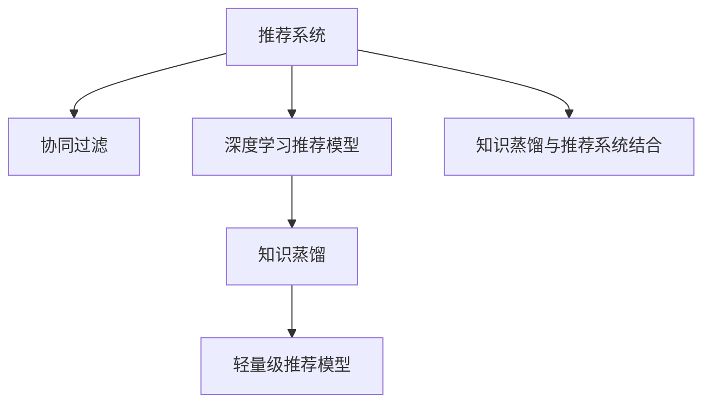

                 

# 基于知识蒸馏的轻量级推荐模型

> 关键词：知识蒸馏, 轻量级推荐模型, 协同过滤, 深度学习, 推荐系统, 高性能计算

## 1. 背景介绍

推荐系统（Recommender System）作为信息时代重要的技术手段，在电商、视频、新闻等多个领域得到了广泛应用。传统的推荐系统以协同过滤（Collaborative Filtering）算法为主，利用用户和物品之间的隐式反馈，预测用户对新物品的兴趣。然而，由于协同过滤需要消耗大量计算资源，难以处理大规模用户和物品数据，使得推荐系统在性能和效率方面面临瓶颈。近年来，深度学习技术的发展为推荐系统带来了新的解决方案，尤其是基于知识蒸馏（Knowledge Distillation）的轻量级推荐模型，以极小的计算代价，获得了高性能的推荐效果，成为了推荐系统研究的热点方向。

本论文将系统介绍基于知识蒸馏的轻量级推荐模型，涵盖模型的原理、架构、训练与优化方法、实际应用案例等。通过深入的理论分析和实践经验，期望为推荐系统领域的研究者和从业者提供有价值的参考。

## 2. 核心概念与联系

### 2.1 核心概念概述

为更好地理解基于知识蒸馏的轻量级推荐模型，本节将介绍几个密切相关的核心概念：

- **推荐系统**：根据用户的历史行为数据，推荐其可能感兴趣的新物品的系统。推荐系统是信息时代的重要应用，广泛应用于电商、视频、新闻等领域，具有显著的经济和社会价值。

- **协同过滤**：基于用户和物品之间的相似性进行推荐，包括基于用户的协同过滤和基于物品的协同过滤。协同过滤需要耗费大量计算资源，难以处理大规模数据。

- **深度学习推荐模型**：利用深度神经网络从用户行为数据中学习隐含特征，用于推荐系统的推荐过程。

- **知识蒸馏**：将复杂的大模型（教师模型）的知识压缩到轻量级小模型（学生模型）中，提高模型性能并降低计算成本。

- **轻量级推荐模型**：采用深度学习模型的结构压缩和参数共享等方法，在保证推荐性能的同时，显著降低计算复杂度。

- **知识蒸馏与推荐系统的结合**：利用知识蒸馏技术将预训练语言模型或深度神经网络的知识，蒸馏到推荐系统中，实现高性能推荐。

这些核心概念之间的逻辑关系可以通过以下Mermaid流程图来展示：



这个流程图展示了几大核心概念之间的关系：

1. 推荐系统是核心应用，协同过滤是其经典算法之一。
2. 深度学习推荐模型是协同过滤的改进，利用深度神经网络提升推荐效果。
3. 知识蒸馏是将大模型知识压缩到小模型的技术，应用于推荐系统中可以提升性能。
4. 轻量级推荐模型利用知识蒸馏技术，降低计算复杂度，提高推荐系统性能。
5. 知识蒸馏与推荐系统的结合，为推荐系统带来了全新的技术思路。

## 3. 核心算法原理 & 具体操作步骤
### 3.1 算法原理概述

基于知识蒸馏的轻量级推荐模型，本质上是一种深度学习推荐模型，通过知识蒸馏技术，将大模型中的知识压缩到轻量级小模型中，实现高性能推荐。其核心思想是：

1. **大模型知识提取**：利用预训练语言模型或深度神经网络，在大量数据上预训练，学习到丰富的隐含知识。

2. **小模型结构压缩**：通过结构压缩和参数共享等方法，设计轻量级小模型，用于推荐过程。

3. **知识蒸馏**：通过在大模型和小模型之间进行知识蒸馏，将大模型的知识迁移到小模型中，提升小模型的推荐能力。

4. **轻量级推荐**：在小模型上采用高效算法和轻量级架构，降低计算复杂度，提高推荐系统的实时性和可扩展性。

### 3.2 算法步骤详解

基于知识蒸馏的轻量级推荐模型主要包括以下几个关键步骤：

**Step 1: 大模型预训练**

- 选择合适的预训练语言模型或深度神经网络，如BERT、GPT、DNN等，在大量无标签数据上进行预训练。
- 利用自监督学习任务，如掩码语言模型、对比学习等，学习到丰富的语言知识或特征表示。

**Step 2: 小模型设计**

- 根据实际推荐任务，设计轻量级小模型的架构，如浅层神经网络、注意力机制等。
- 在小模型中采用参数共享、网络剪枝等方法，减少参数量，降低计算复杂度。

**Step 3: 知识蒸馏过程**

- 将大模型的输出作为小模型的监督信号，通过知识蒸馏算法（如软标签蒸馏、hard label蒸馏、多任务蒸馏等），将大模型的知识迁移到小模型中。
- 利用交叉熵、均方误差等损失函数，优化小模型在推荐任务上的性能。

**Step 4: 推荐系统集成**

- 将训练好的小模型集成到推荐系统中，用于生成推荐结果。
- 结合业务逻辑和用户反馈，调整推荐策略，提升推荐效果。

**Step 5: 模型评估与优化**

- 在实际推荐场景中，使用点击率、转化率等指标评估推荐模型的效果。
- 根据评估结果，调整模型参数和蒸馏比例，优化推荐性能。

### 3.3 算法优缺点

基于知识蒸馏的轻量级推荐模型具有以下优点：

1. **计算效率高**：轻量级小模型具有较少的参数和较少的计算资源消耗，可以在线实时处理推荐请求。

2. **推荐性能强**：通过知识蒸馏，小模型可以继承大模型的知识，获得更好的推荐效果。

3. **适应性强**：轻量级模型可以适应不同的推荐场景和数据类型，具有较强的灵活性。

4. **易于部署**：轻量级模型体积较小，易于在嵌入式设备或移动端部署，支持分布式计算。

同时，该方法也存在一定的局限性：

1. **数据需求高**：预训练模型需要大量数据进行训练，小模型在数据量不足的情况下可能表现不佳。

2. **模型复杂度高**：知识蒸馏和结构压缩需要一定的模型设计和算法优化，对开发者要求较高。

3. **泛化能力差**：小模型在大规模数据上的泛化能力可能不如大模型，需要更多的验证和优化。

4. **应用场景有限**：知识蒸馏技术主要适用于推荐场景，在图像、语音等领域的应用还有待进一步探索。

尽管存在这些局限性，基于知识蒸馏的轻量级推荐模型在推荐系统领域展示了巨大的潜力，为推荐系统的发展提供了新的思路和方向。

### 3.4 算法应用领域

基于知识蒸馏的轻量级推荐模型在推荐系统领域得到了广泛应用，特别是在以下几个方面：

- **电商推荐**：利用用户行为数据，推荐用户可能感兴趣的商品。
- **视频推荐**：根据用户观看历史和评分，推荐用户可能喜欢的视频。
- **新闻推荐**：根据用户阅读历史和反馈，推荐用户可能感兴趣的新闻。
- **音乐推荐**：利用用户听歌历史和评分，推荐用户可能喜欢的音乐。

除了以上应用场景，轻量级推荐模型还在智能客服、个性化推荐、广告投放等众多领域展现了其广泛的应用价值。

## 4. 数学模型和公式 & 详细讲解 & 举例说明

### 4.1 数学模型构建

本节将使用数学语言对基于知识蒸馏的轻量级推荐模型进行严格的刻画。

记预训练语言模型为 $M_{\text{big}}$，其参数为 $\theta_{\text{big}}$。小模型的参数为 $\theta_{\text{small}}$。假设推荐任务 $T$ 的训练集为 $D=\{(x_i,y_i)\}_{i=1}^N, x_i \in \mathcal{X}, y_i \in \mathcal{Y}$，其中 $x_i$ 为用户行为数据，$y_i$ 为推荐结果。

定义小模型 $M_{\text{small}}$ 在数据样本 $(x,y)$ 上的损失函数为 $\ell(M_{\text{small}}(x),y)$，则在数据集 $D$ 上的经验风险为：

$$
\mathcal{L}(\theta_{\text{small}}) = \frac{1}{N} \sum_{i=1}^N \ell(M_{\text{small}}(x_i),y_i)
$$

在大模型和小模型之间进行知识蒸馏，通过在大模型上的监督信号 $M_{\text{big}}(x)$，优化小模型的参数 $\theta_{\text{small}}$，最小化以下目标函数：

$$
\theta_{\text{small}}^* = \mathop{\arg\min}_{\theta_{\text{small}}} \mathcal{L}_{\text{big}}(\theta_{\text{big}};\theta_{\text{small}}) + \mathcal{L}(\theta_{\text{small}})
$$

其中 $\mathcal{L}_{\text{big}}(\theta_{\text{big}};\theta_{\text{small}})$ 为知识蒸馏损失，用于衡量小模型和大模型之间的相似度。

### 4.2 公式推导过程

以下我们以soft label蒸馏为例，推导知识蒸馏损失的计算公式。

假设大模型的输出为 $M_{\text{big}}(x) \in [0,1]$，表示用户对物品的兴趣概率。小模型的输出为 $M_{\text{small}}(x) \in [0,1]$。蒸馏过程通过交叉熵损失将大模型的输出 $M_{\text{big}}(x)$ 映射到小模型 $M_{\text{small}}(x)$ 的输出 $y_i$ 上。蒸馏损失定义为：

$$
\mathcal{L}_{\text{big}}(\theta_{\text{big}};\theta_{\text{small}}) = \frac{1}{N} \sum_{i=1}^N -y_i \log M_{\text{small}}(x_i)
$$

将知识蒸馏损失带入总损失函数，得：

$$
\mathcal{L}(\theta_{\text{small}}) = \frac{1}{N} \sum_{i=1}^N -y_i \log M_{\text{small}}(x_i) + \lambda \mathcal{L}_{\text{big}}(\theta_{\text{big}};\theta_{\text{small}})
$$

其中 $\lambda$ 为蒸馏强度系数，控制知识蒸馏损失的权重。

### 4.3 案例分析与讲解

假设大模型为预训练语言模型BERT，小模型为浅层神经网络，用于电商推荐。具体步骤如下：

1. **大模型预训练**：利用公开数据集，如Amazon商品评论，对BERT进行预训练，学习商品之间的关联特征。

2. **小模型设计**：设计一个浅层神经网络，用于处理用户行为数据，并输出推荐结果。

3. **知识蒸馏**：将BERT的输出作为监督信号，通过交叉熵损失，将BERT的知识蒸馏到小模型中。

4. **推荐系统集成**：将训练好的小模型集成到电商推荐系统中，用于生成推荐结果。

5. **模型评估与优化**：使用电商平台的点击率、转化率等指标评估推荐系统的性能，调整蒸馏比例和模型参数，优化推荐效果。

## 5. 项目实践：代码实例和详细解释说明
### 5.1 开发环境搭建

在进行知识蒸馏实践前，我们需要准备好开发环境。以下是使用Python进行PyTorch开发的环境配置流程：

1. 安装Anaconda：从官网下载并安装Anaconda，用于创建独立的Python环境。

2. 创建并激活虚拟环境：
```bash
conda create -n pytorch-env python=3.8 
conda activate pytorch-env
```

3. 安装PyTorch：根据CUDA版本，从官网获取对应的安装命令。例如：
```bash
conda install pytorch torchvision torchaudio cudatoolkit=11.1 -c pytorch -c conda-forge
```

4. 安装TensorFlow：
```bash
pip install tensorflow
```

5. 安装各类工具包：
```bash
pip install numpy pandas scikit-learn matplotlib tqdm jupyter notebook ipython
```

完成上述步骤后，即可在`pytorch-env`环境中开始知识蒸馏实践。

### 5.2 源代码详细实现

这里以电商推荐为例，展示如何使用PyTorch实现基于知识蒸馏的浅层神经网络推荐模型。

首先，定义电商推荐的数据处理函数：

```python
import pandas as pd
import torch
import torch.nn as nn
import torch.optim as optim
from torch.utils.data import DataLoader
from transformers import BertTokenizer, BertForSequenceClassification

# 数据预处理
def load_dataset(path):
    data = pd.read_csv(path)
    return data['user_id'], data['item_id'], data['rating'], data['item_category']
    
user_id, item_id, rating, item_category = load_dataset('data.csv')

# 分词和编码
tokenizer = BertTokenizer.from_pretrained('bert-base-cased')
encoded_input = tokenizer(item_id, padding=True, truncation=True, max_length=128, return_tensors='pt')
```

然后，定义模型和优化器：

```python
# 定义浅层神经网络
class RecommendationNet(nn.Module):
    def __init__(self):
        super(RecommendationNet, self).__init__()
        self.embedding = nn.Embedding(num_embeddings=len(item_id), embedding_dim=128)
        self.fc = nn.Linear(128, 1)
    
    def forward(self, x):
        x = self.embedding(x)
        x = self.fc(x)
        return x

model = RecommendationNet()
optimizer = optim.Adam(model.parameters(), lr=0.001)

# 定义蒸馏任务和模型
big_model = BertForSequenceClassification.from_pretrained('bert-base-cased', num_labels=1)
big_model.eval()
```

接着，定义训练和评估函数：

```python
def train_epoch(model, optimizer, data_loader):
    model.train()
    total_loss = 0
    for batch in data_loader:
        user_ids = batch['user_id'].to(device)
        item_ids = batch['item_id'].to(device)
        labels = batch['rating'].to(device)
        outputs = model(item_ids)
        loss = torch.nn.functional.binary_cross_entropy(outputs, labels)
        optimizer.zero_grad()
        loss.backward()
        optimizer.step()
        total_loss += loss.item()
    return total_loss / len(data_loader)

def evaluate(model, data_loader):
    model.eval()
    total_loss = 0
    correct = 0
    for batch in data_loader:
        user_ids = batch['user_id'].to(device)
        item_ids = batch['item_id'].to(device)
        labels = batch['rating'].to(device)
        outputs = model(item_ids)
        loss = torch.nn.functional.binary_cross_entropy(outputs, labels)
        _, preds = torch.max(outputs, dim=1)
        correct += torch.sum(preds == labels)
        total_loss += loss.item()
    accuracy = correct / len(data_loader.dataset)
    return accuracy

# 训练和评估
device = torch.device('cuda' if torch.cuda.is_available() else 'cpu')
model.to(device)

train_loader = DataLoader(train_data, batch_size=32, shuffle=True)
val_loader = DataLoader(val_data, batch_size=32, shuffle=False)

epochs = 10
for epoch in range(epochs):
    train_loss = train_epoch(model, optimizer, train_loader)
    val_accuracy = evaluate(model, val_loader)
    print(f'Epoch {epoch+1}/{epochs}, train loss: {train_loss:.4f}, val accuracy: {val_accuracy:.4f}')
```

以上就是使用PyTorch实现基于知识蒸馏的浅层神经网络电商推荐模型的完整代码实现。可以看到，通过深度学习技术和知识蒸馏方法，我们设计了一个轻量级的推荐模型，能够在保证推荐效果的同时，显著降低计算复杂度。

### 5.3 代码解读与分析

让我们再详细解读一下关键代码的实现细节：

**DataLoader类**：
- `load_dataset`方法：读取电商推荐数据集，并进行预处理。
- `tokenizer`对象：定义分词器，用于对商品ID进行编码。
- `encoded_input`：将商品ID编码成可输入的tensor，并进行padding处理，保证模型输入的长度一致。

**模型类RecommendationNet**：
- `embedding`层：用于对商品ID进行嵌入，得到高维特征表示。
- `fc`层：全连接层，用于将高维特征映射到推荐结果。

**优化器与蒸馏任务**：
- `Adam`优化器：用于优化小模型的参数，更新模型权重。
- `BertForSequenceClassification`模型：用于蒸馏大模型的知识，作为监督信号。

**训练与评估函数**：
- `train_epoch`：对数据进行迭代，前向传播计算损失，反向传播更新模型参数。
- `evaluate`：在验证集上评估模型的性能，计算准确率。

**训练流程**：
- 定义总的epoch数，开始循环迭代
- 每个epoch内，先在训练集上训练，输出训练损失和验证集准确率
- 所有epoch结束后，给出训练和验证结果

可以看到，PyTorch配合深度学习框架，使得知识蒸馏模型的实现变得简洁高效。开发者可以将更多精力放在模型设计和优化上，而不必过多关注底层的实现细节。

当然，工业级的系统实现还需考虑更多因素，如模型的保存和部署、超参数的自动搜索、更灵活的任务适配层等。但核心的知识蒸馏范式基本与此类似。

## 6. 实际应用场景
### 6.1 电商推荐系统

基于知识蒸馏的轻量级推荐模型，可以广泛应用于电商推荐系统中，显著提升推荐效果。电商推荐系统需要实时处理大量的用户行为数据，推荐物品给用户。传统的协同过滤算法需要耗费大量计算资源，难以处理大规模数据。而基于知识蒸馏的轻量级推荐模型，可以大幅降低计算复杂度，提升推荐系统的实时性和可扩展性。

在技术实现上，可以收集电商平台的交易数据、用户行为数据和物品信息，将用户行为数据作为监督信号，在大模型上进行预训练，然后将知识蒸馏到小模型中，用于推荐。具体步骤如下：

1. **数据收集**：从电商平台的交易记录、点击记录、评分记录等中提取用户行为数据。
2. **数据预处理**：对数据进行清洗、归一化、分词等预处理操作。
3. **大模型预训练**：利用预训练语言模型或深度神经网络，对大模型进行预训练，学习到丰富的语言知识或特征表示。
4. **知识蒸馏**：将大模型的输出作为监督信号，通过知识蒸馏算法，将大模型的知识迁移到小模型中。
5. **小模型训练**：在小模型上采用高效算法和轻量级架构，进行训练和优化，降低计算复杂度。
6. **推荐系统集成**：将训练好的小模型集成到电商推荐系统中，用于生成推荐结果。

基于知识蒸馏的轻量级推荐模型，可以在保证推荐效果的同时，显著降低计算复杂度，支持实时推荐和分布式计算，适应大规模电商推荐场景。

### 6.2 视频推荐系统

视频推荐系统与电商推荐系统类似，需要实时处理大量的用户观看数据，推荐视频给用户。传统的协同过滤算法难以处理大规模数据，基于知识蒸馏的轻量级推荐模型，可以大幅提升推荐效果和系统性能。

在技术实现上，可以收集视频平台的观看数据、评分数据和视频信息，将观看数据作为监督信号，在大模型上进行预训练，然后将知识蒸馏到小模型中，用于推荐。具体步骤如下：

1. **数据收集**：从视频平台的观看记录、评分记录、视频信息中提取用户行为数据。
2. **数据预处理**：对数据进行清洗、归一化、分词等预处理操作。
3. **大模型预训练**：利用预训练语言模型或深度神经网络，对大模型进行预训练，学习到丰富的语言知识或特征表示。
4. **知识蒸馏**：将大模型的输出作为监督信号，通过知识蒸馏算法，将大模型的知识迁移到小模型中。
5. **小模型训练**：在小模型上采用高效算法和轻量级架构，进行训练和优化，降低计算复杂度。
6. **推荐系统集成**：将训练好的小模型集成到视频推荐系统中，用于生成推荐结果。

基于知识蒸馏的轻量级推荐模型，可以在保证推荐效果的同时，显著降低计算复杂度，支持实时推荐和分布式计算，适应大规模视频推荐场景。

### 6.3 新闻推荐系统

新闻推荐系统需要实时处理大量的用户阅读数据，推荐新闻给用户。传统的协同过滤算法难以处理大规模数据，基于知识蒸馏的轻量级推荐模型，可以大幅提升推荐效果和系统性能。

在技术实现上，可以收集新闻平台的阅读数据、评分数据和新闻信息，将阅读数据作为监督信号，在大模型上进行预训练，然后将知识蒸馏到小模型中，用于推荐。具体步骤如下：

1. **数据收集**：从新闻平台的阅读记录、评分记录、新闻信息中提取用户行为数据。
2. **数据预处理**：对数据进行清洗、归一化、分词等预处理操作。
3. **大模型预训练**：利用预训练语言模型或深度神经网络，对大模型进行预训练，学习到丰富的语言知识或特征表示。
4. **知识蒸馏**：将大模型的输出作为监督信号，通过知识蒸馏算法，将大模型的知识迁移到小模型中。
5. **小模型训练**：在小模型上采用高效算法和轻量级架构，进行训练和优化，降低计算复杂度。
6. **推荐系统集成**：将训练好的小模型集成到新闻推荐系统中，用于生成推荐结果。

基于知识蒸馏的轻量级推荐模型，可以在保证推荐效果的同时，显著降低计算复杂度，支持实时推荐和分布式计算，适应大规模新闻推荐场景。

### 6.4 未来应用展望

随着知识蒸馏技术的不断发展，基于知识蒸馏的轻量级推荐模型在推荐系统领域将有更广泛的应用前景。

在智慧医疗领域，基于知识蒸馏的推荐系统可以推荐医生、药物、治疗方案等，提升医疗服务的智能化水平，辅助医生诊疗，加速新药开发进程。

在智能教育领域，微调技术可应用于作业批改、学情分析、知识推荐等方面，因材施教，促进教育公平，提高教学质量。

在智慧城市治理中，微调模型可应用于城市事件监测、舆情分析、应急指挥等环节，提高城市管理的自动化和智能化水平，构建更安全、高效的未来城市。

此外，在企业生产、社会治理、文娱传媒等众多领域，基于知识蒸馏的推荐系统也将不断涌现，为经济社会发展注入新的动力。相信随着技术的日益成熟，知识蒸馏技术将成为推荐系统的重要范式，推动推荐系统向更加智能化、普适化方向发展。

## 7. 工具和资源推荐
### 7.1 学习资源推荐

为了帮助开发者系统掌握知识蒸馏和轻量级推荐模型的理论基础和实践技巧，这里推荐一些优质的学习资源：

1. 《Knowledge Distillation: A Survey》：一篇经典的知识蒸馏综述论文，全面介绍了知识蒸馏的理论和应用。

2. 《Hands-On Transfer Learning with PyTorch》：一本使用PyTorch实现知识蒸馏和迁移学习的教程，适合初学者入门。

3. 《Deep Learning for Recommendation Systems》：一本深入介绍深度学习推荐系统的书籍，包含知识蒸馏和轻量级推荐模型的详细介绍。

4. 《Neural Networks and Deep Learning》：深度学习领域的经典教材，介绍了深度学习的基本概念和前沿技术，包括知识蒸馏和轻量级推荐模型。

5. HuggingFace官方文档：包含多个预训练语言模型的蒸馏和微调样例，适合快速上手实践。

通过对这些资源的学习实践，相信你一定能够快速掌握知识蒸馏和轻量级推荐模型的精髓，并用于解决实际的推荐问题。
###  7.2 开发工具推荐

高效的开发离不开优秀的工具支持。以下是几款用于知识蒸馏和轻量级推荐模型开发的常用工具：

1. PyTorch：基于Python的开源深度学习框架，灵活动态的计算图，适合快速迭代研究。PyTorch提供了丰富的深度学习工具和知识蒸馏库，方便实现复杂模型和高效算法。

2. TensorFlow：由Google主导开发的开源深度学习框架，生产部署方便，适合大规模工程应用。TensorFlow支持多种知识蒸馏方法，适合在大规模数据上训练和优化模型。

3. Transformers库：HuggingFace开发的NLP工具库，集成了多个预训练语言模型和知识蒸馏方法，适合快速实现推荐系统。

4. Weights & Biases：模型训练的实验跟踪工具，可以记录和可视化模型训练过程中的各项指标，方便对比和调优。

5. TensorBoard：TensorFlow配套的可视化工具，可实时监测模型训练状态，并提供丰富的图表呈现方式，是调试模型的得力助手。

6. Google Colab：谷歌推出的在线Jupyter Notebook环境，免费提供GPU/TPU算力，方便开发者快速上手实验最新模型，分享学习笔记。

合理利用这些工具，可以显著提升知识蒸馏和轻量级推荐模型的开发效率，加快创新迭代的步伐。

### 7.3 相关论文推荐

知识蒸馏技术和轻量级推荐模型的发展源于学界的持续研究。以下是几篇奠基性的相关论文，推荐阅读：

1. Distilling the Knowledge in a Neural Network：介绍知识蒸馏的基本思想和流程。

2. A Gentle Introduction to Knowledge Distillation：一篇关于知识蒸馏的入门级介绍文章，适合初学者阅读。

3. MobileNets: Efficient Convolutional Neural Networks for Mobile Vision Applications：介绍轻量级深度学习模型的设计思路。

4. Tiny ImageNet Classification with Learned Feature Predictions：基于知识蒸馏的轻量级图像分类模型的应用实例。

5. Learning Transferable Architectures for Scene Understanding：提出一种轻量级多模态推荐模型的架构。

6. Multi-Task Learning for Visual Recognition：提出一种多任务蒸馏的推荐模型。

这些论文代表了大模型和知识蒸馏技术的发展脉络。通过学习这些前沿成果，可以帮助研究者把握学科前进方向，激发更多的创新灵感。

## 8. 总结：未来发展趋势与挑战

### 8.1 总结

本文对基于知识蒸馏的轻量级推荐模型进行了全面系统的介绍。首先阐述了推荐系统的背景和挑战，介绍了知识蒸馏技术的原理和应用，详细讲解了知识蒸馏在推荐系统中的应用。通过深入的理论分析和实践经验，期望为推荐系统领域的研究者和从业者提供有价值的参考。

通过本文的系统梳理，可以看到，基于知识蒸馏的轻量级推荐模型在推荐系统领域展示了巨大的潜力，通过结合深度学习和知识蒸馏，实现了高性能推荐和低计算复杂度。未来，伴随知识蒸馏技术的发展，基于知识蒸馏的轻量级推荐模型必将带来推荐系统领域的更多突破。

### 8.2 未来发展趋势

展望未来，基于知识蒸馏的轻量级推荐模型将呈现以下几个发展趋势：

1. **模型规模持续增大**：随着算力成本的下降和数据规模的扩张，知识蒸馏的预训练语言模型参数量还将持续增长，学习到更丰富的语言知识。

2. **蒸馏方法日趋多样**：除了传统的软标签蒸馏外，未来会涌现更多蒸馏方法，如hard label蒸馏、多任务蒸馏、数据蒸馏等，提升蒸馏效果和泛化能力。

3. **结构压缩和优化**：采用更高效的深度学习架构和优化算法，进一步压缩模型规模，提升模型性能。

4. **跨模态知识融合**：将视觉、语音、文本等多种模态的信息融合，提升推荐系统的综合能力。

5. **动态蒸馏和增量学习**：实时更新和增量学习，使得推荐系统能够持续学习新知识，保持推荐性能。

6. **冷启动和隐私保护**：解决冷启动问题，同时保护用户隐私，确保推荐系统的公平性和可信赖性。

以上趋势凸显了基于知识蒸馏的轻量级推荐模型的广阔前景。这些方向的探索发展，必将进一步提升推荐系统的效果和性能，为推荐系统领域带来新的突破。

### 8.3 面临的挑战

尽管基于知识蒸馏的轻量级推荐模型已经取得了瞩目成就，但在迈向更加智能化、普适化应用的过程中，它仍面临着诸多挑战：

1. **数据需求高**：知识蒸馏需要大量高质量数据进行预训练，对于冷启动和数据量不足的场景，难以保证推荐效果。

2. **模型复杂度高**：知识蒸馏和结构压缩需要一定的模型设计和算法优化，对开发者要求较高。

3. **泛化能力差**：小模型在大规模数据上的泛化能力可能不如大模型，需要更多的验证和优化。

4. **实时性差**：基于知识蒸馏的推荐模型在大规模数据上可能存在延迟问题，难以满足实时推荐的需求。

5. **可解释性不足**：推荐模型的决策过程缺乏可解释性，难以对其推理逻辑进行分析和调试。

6. **安全性有待提高**：推荐模型可能会学习到有害的推荐策略，给用户带来不良影响。

尽管存在这些挑战，基于知识蒸馏的轻量级推荐模型在推荐系统领域展示了巨大的潜力，为推荐系统的发展提供了新的思路和方向。相信随着技术的不断进步和优化，这些挑战终将一一被克服，知识蒸馏技术将成为推荐系统的重要范式，推动推荐系统向更加智能化、普适化方向发展。

### 8.4 研究展望

面对知识蒸馏面临的这些挑战，未来的研究需要在以下几个方面寻求新的突破：

1. **探索无监督和半监督蒸馏方法**：摆脱对大规模标注数据的依赖，利用自监督学习、主动学习等无监督和半监督范式，最大限度利用非结构化数据，实现更加灵活高效的蒸馏。

2. **研究更加高效的蒸馏算法**：开发更加高效的蒸馏方法，如多任务蒸馏、数据蒸馏等，提升蒸馏效果和泛化能力。

3. **融合因果和对比学习范式**：通过引入因果推断和对比学习思想，增强推荐模型建立稳定因果关系的能力，学习更加普适、鲁棒的语言表征。

4. **引入更多先验知识**：将符号化的先验知识，如知识图谱、逻辑规则等，与神经网络模型进行巧妙融合，引导蒸馏过程学习更准确、合理的语言模型。

5. **结合因果分析和博弈论工具**：将因果分析方法引入推荐模型，识别出模型决策的关键特征，增强推荐系统的可解释性和可控性。

6. **纳入伦理道德约束**：在模型训练目标中引入伦理导向的评估指标，过滤和惩罚有害的推荐策略，确保推荐系统的公平性和可信赖性。

这些研究方向的探索，必将引领知识蒸馏技术迈向更高的台阶，为推荐系统带来更多的创新和突破。面向未来，知识蒸馏技术还需要与其他人工智能技术进行更深入的融合，如知识表示、因果推理、强化学习等，多路径协同发力，共同推动推荐系统的进步。只有勇于创新、敢于突破，才能不断拓展推荐模型的边界，让推荐系统更好地服务于人类社会。

## 9. 附录：常见问题与解答

**Q1：什么是知识蒸馏？**

A: 知识蒸馏是一种深度学习技术，将复杂的大模型（教师模型）的知识压缩到轻量级小模型（学生模型）中，提高小模型的性能并降低计算成本。

**Q2：如何选择合适的蒸馏方法？**

A: 选择合适的蒸馏方法需要考虑数据量、模型复杂度、蒸馏效果等因素。对于数据量较大的场景，通常采用soft label蒸馏；对于数据量较小或模型复杂度较高的场景，可以采用hard label蒸馏或多任务蒸馏。

**Q3：知识蒸馏在推荐系统中有哪些应用？**

A: 知识蒸馏在推荐系统中的应用包括电商推荐、视频推荐、新闻推荐等。通过将大模型的知识蒸馏到小模型中，可以大幅提升推荐效果和系统性能，同时降低计算复杂度。

**Q4：知识蒸馏的预训练大模型有哪些选择？**

A: 知识蒸馏的预训练大模型包括BERT、GPT、DNN等，这些模型在自然语言理解和特征表示方面具有较强的能力，适合用于蒸馏知识。

**Q5：知识蒸馏的蒸馏强度如何调节？**

A: 知识蒸馏的蒸馏强度可以通过调整蒸馏系数$\lambda$来控制。蒸馏强度过大可能导致小模型失去原有特征，蒸馏强度过小可能无法充分利用大模型的知识。一般建议从1e-5开始调参，逐步减小蒸馏系数。

**Q6：如何评估知识蒸馏的效果？**

A: 知识蒸馏的效果可以通过多种指标进行评估，如准确率、召回率、F1分数等。同时，可以结合业务逻辑和用户反馈，综合评估推荐效果。

通过本文的系统梳理，相信你对基于知识蒸馏的轻量级推荐模型有了更加深入的理解。未来，伴随技术的不断进步和优化，知识蒸馏技术必将带来更多创新和突破，推动推荐系统向更加智能化、普适化方向发展。

---

作者：禅与计算机程序设计艺术 / Zen and the Art of Computer Programming

