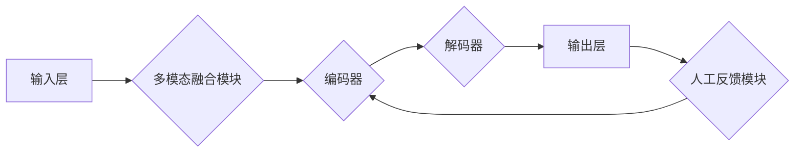

> 多模态大模型，强化学习，人工反馈，文本生成，图像生成，多模态交互，自然语言处理，计算机视觉

## 1. 背景介绍

近年来，人工智能领域取得了令人瞩目的进展，其中大模型的涌现尤为引人注目。大模型凭借其强大的学习能力和泛化能力，在自然语言处理、计算机视觉等领域取得了突破性成果。然而，传统的单模态大模型仅处理单一类型的数据，例如文本或图像，难以捕捉现实世界中多模态信息的丰富性和复杂性。

多模态大模型 (Multimodal Large Models, MMLMs) 应运而生，旨在融合文本、图像、音频等多种模态数据，学习跨模态的表示和理解能力。MMLMs 能够更好地理解和生成多模态内容，为更自然、更智能的人机交互提供基础。

## 2. 核心概念与联系

**2.1 多模态数据**

多模态数据是指包含多种不同类型信息的集合，例如文本、图像、音频、视频等。这些模态数据之间存在着相互关联和补充的关系，共同构成了更完整的现实世界信息。

**2.2 多模态表示学习**

多模态表示学习是指将不同模态的数据映射到同一个低维空间，使得不同模态的数据在该空间中能够相互交互和融合。

**2.3 强化学习**

强化学习是一种机器学习方法，通过在环境中与环境交互，学习最优的策略来最大化奖励。

**2.4 人工反馈**

人工反馈是指人类对模型输出的评价和指导，可以帮助模型学习更符合人类期望的输出。

**2.5 架构图**



## 3. 核心算法原理 & 具体操作步骤

### 3.1  算法原理概述

基于人工反馈的强化学习在多模态大模型训练中扮演着至关重要的角色。其核心思想是将模型训练视为一个强化学习过程，其中模型的输出被视为动作，人工反馈被视为奖励信号。通过不断地与环境交互，模型学习到最优的策略，以生成符合人类期望的多模态内容。

### 3.2  算法步骤详解

1. **初始化模型参数:** 首先，需要初始化多模态大模型的参数。

2. **输入多模态数据:** 将文本、图像等多模态数据输入到模型中。

3. **多模态融合:** 使用多模态融合模块将不同模态的数据融合在一起，形成统一的表示。

4. **编码:** 将融合后的数据输入到编码器中，提取其特征表示。

5. **解码:** 将编码后的特征表示输入到解码器中，生成多模态输出，例如文本、图像等。

6. **人工反馈:** 人类对模型生成的输出进行评价和反馈，例如打分、标注等。

7. **奖励信号:** 将人工反馈转换为奖励信号，反馈给模型。

8. **强化学习更新:** 使用强化学习算法，根据奖励信号更新模型参数，使其能够生成更符合人类期望的输出。

9. **重复步骤2-8:** 重复上述步骤，直到模型达到预期的性能。

### 3.3  算法优缺点

**优点:**

* 能够学习更符合人类期望的多模态内容。
* 能够更好地理解和生成跨模态信息。
* 能够适应不同的多模态任务。

**缺点:**

* 需要大量的标注数据进行训练。
* 训练过程比较复杂，需要专业的技术人员进行操作。
* 模型的性能受人工反馈的质量影响。

### 3.4  算法应用领域

* **文本生成:** 生成更自然、更流畅的文本内容，例如小说、诗歌、新闻报道等。
* **图像生成:** 生成逼真的图像内容，例如人物肖像、风景画、产品设计等。
* **多模态对话:** 建立更自然、更智能的人机对话系统，能够理解和响应用户的文本和语音输入。
* **视频理解:** 理解视频内容，例如识别人物、场景、事件等。
* **医疗诊断:** 辅助医生进行诊断，例如识别病灶、预测疾病风险等。

## 4. 数学模型和公式 & 详细讲解 & 举例说明

### 4.1  数学模型构建

多模态大模型的训练目标是学习一个映射函数 f，将多模态输入 x = (x_t, x_v, ...) 映射到相应的输出 y = (y_t, y_v, ...)。其中，x_t 表示文本输入，x_v 表示图像输入，y_t 表示文本输出，y_v 表示图像输出。

### 4.2  公式推导过程

为了学习这个映射函数，我们可以使用强化学习算法，例如策略梯度方法。策略梯度方法的目标是最大化奖励信号的期望值，即：

$$
\max_{\theta} \mathbb{E}_{\tau \sim \pi_{\theta}} [R(\tau)]
$$

其中，θ 表示模型参数，τ 表示一个轨迹，π_θ 表示策略函数，R(τ) 表示轨迹的奖励信号。

### 4.3  案例分析与讲解

假设我们训练一个多模态大模型用于文本图像对齐任务。输入是一个文本句子和一张图像，模型需要学习将文本中的每个词语与图像中的对应区域进行对齐。

我们可以使用强化学习算法来训练这个模型。奖励信号可以定义为对齐准确率，即模型将文本词语与图像区域对齐的准确率。通过不断地训练和更新模型参数，模型能够学习到将文本和图像进行对齐的最佳策略。

## 5. 项目实践：代码实例和详细解释说明

### 5.1  开发环境搭建

* Python 3.7+
* PyTorch 1.7+
* CUDA 10.2+

### 5.2  源代码详细实现

```python
import torch
import torch.nn as nn

class MultimodalFusionModule(nn.Module):
    def __init__(self):
        super(MultimodalFusionModule, self).__init__()
        # ...

    def forward(self, text_embedding, image_embedding):
        # ...

class Encoder(nn.Module):
    def __init__(self):
        super(Encoder, self).__init__()
        # ...

    def forward(self, fused_embedding):
        # ...

class Decoder(nn.Module):
    def __init__(self):
        super(Decoder, self).__init__()
        # ...

    def forward(self, encoded_embedding):
        # ...

# 实例化模型
model = MultimodalModel()

# 定义损失函数和优化器
criterion = nn.CrossEntropyLoss()
optimizer = torch.optim.Adam(model.parameters(), lr=0.001)

# 训练模型
for epoch in range(num_epochs):
    for batch in dataloader:
        # ...
        optimizer.zero_grad()
        outputs = model(batch)
        loss = criterion(outputs, targets)
        loss.backward()
        optimizer.step()

```

### 5.3  代码解读与分析

* **MultimodalFusionModule:** 用于融合文本和图像的嵌入表示。
* **Encoder:** 用于提取融合后的嵌入表示的特征。
* **Decoder:** 用于根据编码后的特征生成多模态输出。
* **训练过程:** 使用强化学习算法，通过最大化奖励信号的期望值来训练模型。

### 5.4  运行结果展示

训练完成后，可以将模型应用于实际任务中，例如文本图像对齐、多模态对话等。

## 6. 实际应用场景

### 6.1  文本图像对齐

将文本中的每个词语与图像中的对应区域进行对齐，例如在图像识别中，可以将文本描述与图像中的物体进行对齐，提高识别准确率。

### 6.2  多模态对话

构建更自然、更智能的人机对话系统，能够理解和响应用户的文本和语音输入，例如聊天机器人、虚拟助手等。

### 6.3  视频理解

理解视频内容，例如识别人物、场景、事件等，例如视频搜索、视频摘要等。

### 6.4  未来应用展望

* **个性化教育:** 根据学生的学习风格和进度，提供个性化的学习内容和教学方式。
* **医疗诊断辅助:** 辅助医生进行诊断，例如识别病灶、预测疾病风险等。
* **增强现实:** 将虚拟信息叠加到现实世界中，例如在购物时，可以查看商品的详细信息。

## 7. 工具和资源推荐

### 7.1  学习资源推荐

* **书籍:**
    * 《深度学习》
    * 《自然语言处理》
    * 《计算机视觉》
* **在线课程:**
    * Coursera
    * edX
    * Udacity

### 7.2  开发工具推荐

* **PyTorch:** 深度学习框架
* **TensorFlow:** 深度学习框架
* **HuggingFace Transformers:** 预训练模型库

### 7.3  相关论文推荐

* **BERT:** Devlin et al., 2018
* **GPT-3:** Brown et al., 2020
* **DALL-E:** Radford et al., 2021

## 8. 总结：未来发展趋势与挑战

### 8.1  研究成果总结

基于人工反馈的强化学习在多模态大模型训练中取得了显著进展，能够学习更符合人类期望的多模态内容，并应用于多个领域。

### 8.2  未来发展趋势

* **模型规模和能力的提升:** 未来，多模态大模型的规模和能力将会进一步提升，能够处理更复杂的多模态数据，并完成更复杂的任务。
* **跨模态理解和生成能力的增强:** 未来，多模态大模型将更加擅长跨模态理解和生成，例如能够将文本描述转换为图像，或将图像描述转换为文本。
* **个性化和可解释性:** 未来，多模态大模型将更加个性化，能够根据用户的需求和偏好提供定制化的服务。同时，模型的决策过程也将更加可解释，能够帮助用户理解模型的 reasoning 过程。

### 8.3  面临的挑战

* **数据获取和标注:** 多模态数据的获取和标注成本较高，这限制了多模态大模型的训练和应用。
* **模型训练效率:** 多模态大模型的训练时间和资源消耗较大，需要更高效的训练方法。
* **模型安全性:** 多模态大模型可能存在安全风险，例如生成虚假信息、进行恶意攻击等，需要加强模型的安全性和可靠性。

### 8.4  研究展望

未来，我们将继续致力于多模态大模型的研究，探索更有效的训练方法、更强大的模型架构、更广泛的应用场景，推动多模态人工智能技术的发展。

## 9. 附录：常见问题与解答

**Q1: 多模态大模型与单模态大模型有什么区别？**

**A1:** 单模态大模型只处理单一类型的数据，例如文本或图像，而多模态大模型能够处理多种类型的数据，例如文本、图像、音频等。

**Q2: 多模态大模型的训练需要哪些数据？**

**A2:** 多模态大模型的训练需要多模态数据，例如文本和图像的配对数据。

**Q3: 多模态大模型有哪些应用场景？**

**A3:** 多模态大模型的应用场景非常广泛，例如文本图像对齐、多模态对话、视频理解等。


作者：禅与计算机程序设计艺术 / Zen and the Art of Computer Programming 
<end_of_turn>