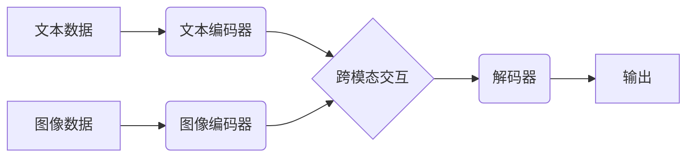

> 多模态大模型、出行物流、自然语言处理、计算机视觉、深度学习、Transformer、BERT、YOLO

## 1. 背景介绍

近年来，人工智能技术取得了飞速发展，其中多模态大模型（Multimodal Large Models，MLMs）作为一种新兴的AI技术，展现出巨大的潜力。MLMs能够处理多种类型的数据，例如文本、图像、音频、视频等，并从中学习到丰富的知识和表示。

出行与物流行业是社会经济发展的重要组成部分，其高效运行对国民生活和经济发展至关重要。传统出行与物流系统往往依赖于单一数据模式，例如文本信息或图像数据，难以充分利用多模态数据的价值。而多模态大模型的出现为出行与物流行业带来了新的机遇，能够帮助企业提升效率、降低成本、提升用户体验。

## 2. 核心概念与联系

多模态大模型的核心概念是融合不同模态数据，学习跨模态的表示和理解能力。

**2.1 多模态数据**

多模态数据是指包含多种类型数据信息的集合，例如文本、图像、音频、视频等。

**2.2 多模态学习**

多模态学习是指利用多种类型数据进行训练，学习跨模态的表示和理解能力。

**2.3 多模态大模型**

多模态大模型是指能够处理多种类型数据，并学习跨模态表示和理解能力的大规模深度学习模型。

**2.4 多模态大模型架构**

多模态大模型的架构通常包括以下几个部分：

* **模态编码器:** 负责将不同模态数据编码成相应的向量表示。
* **跨模态交互模块:** 负责融合不同模态的向量表示，学习跨模态的表示。
* **解码器:** 负责根据融合后的表示生成最终的输出，例如文本、图像、音频等。

**2.5 Mermaid 流程图**



## 3. 核心算法原理 & 具体操作步骤

### 3.1  算法原理概述

多模态大模型的训练主要基于深度学习算法，例如Transformer、BERT等。这些算法能够学习到数据中的复杂模式和关系，并生成高质量的跨模态表示。

### 3.2  算法步骤详解

1. **数据预处理:** 将多模态数据进行清洗、格式化、标注等操作，使其能够被模型训练。
2. **模型训练:** 使用深度学习算法训练多模态大模型，并根据预定义的损失函数进行优化。
3. **模型评估:** 使用测试数据评估模型的性能，例如准确率、召回率、F1-score等。
4. **模型部署:** 将训练好的模型部署到实际应用场景中，例如出行与物流系统。

### 3.3  算法优缺点

**优点:**

* 能够处理多种类型数据，学习跨模态的表示和理解能力。
* 能够学习到数据中的复杂模式和关系，生成高质量的输出。
* 能够应用于多种场景，例如图像识别、文本生成、语音识别等。

**缺点:**

* 训练成本高，需要大量的计算资源和数据。
* 模型复杂度高，难以理解和调试。
* 容易受到数据偏差的影响。

### 3.4  算法应用领域

多模态大模型在多个领域都有广泛的应用，例如：

* **出行与物流:** 路线规划、车辆调度、货物追踪、智能驾驶等。
* **医疗保健:** 疾病诊断、图像分析、药物研发等。
* **教育:** 智能辅导、个性化学习、虚拟现实教学等。
* **娱乐:** 游戏开发、内容创作、虚拟助手等。

## 4. 数学模型和公式 & 详细讲解 & 举例说明

### 4.1  数学模型构建

多模态大模型的数学模型通常基于深度学习框架，例如TensorFlow或PyTorch。模型的结构和参数可以通过深度学习算法进行训练。

### 4.2  公式推导过程

多模态大模型的训练过程涉及到许多数学公式，例如损失函数、梯度下降算法等。这些公式的推导过程通常基于微积分和概率论的知识。

### 4.3  案例分析与讲解

例如，在图像识别任务中，多模态大模型可以将图像编码成特征向量，并与文本描述进行匹配。可以使用余弦相似度来衡量特征向量之间的相似度，从而判断图像和文本是否匹配。

$$
\text{相似度} = \frac{\mathbf{v_1} \cdot \mathbf{v_2}}{\|\mathbf{v_1}\| \|\mathbf{v_2}\|}
$$

其中，$\mathbf{v_1}$ 和 $\mathbf{v_2}$ 分别是图像和文本的特征向量，$\cdot$ 表示点积，$\|\mathbf{v}\|$ 表示向量的模长。

## 5. 项目实践：代码实例和详细解释说明

### 5.1  开发环境搭建

使用Python语言开发多模态大模型，需要安装相关的库和工具，例如TensorFlow、PyTorch、OpenCV等。

### 5.2  源代码详细实现

以下是一个简单的多模态大模型代码示例，使用TensorFlow框架实现图像和文本的匹配任务：

```python
import tensorflow as tf

# 定义图像和文本的编码器
image_encoder = tf.keras.Sequential([
    tf.keras.layers.Conv2D(32, (3, 3), activation='relu'),
    tf.keras.layers.MaxPooling2D((2, 2)),
    tf.keras.layers.Flatten(),
    tf.keras.layers.Dense(128, activation='relu')
])

text_encoder = tf.keras.Sequential([
    tf.keras.layers.Embedding(vocab_size, embedding_dim),
    tf.keras.layers.LSTM(128)
])

# 定义跨模态交互模块
def cross_modal_interaction(image_features, text_features):
    # 使用注意力机制融合图像和文本特征
    # ...

# 定义损失函数和优化器
loss_fn = tf.keras.losses.BinaryCrossentropy()
optimizer = tf.keras.optimizers.Adam()

# 定义模型
model = tf.keras.Model(inputs=[image_input, text_input], outputs=output)

# 训练模型
model.compile(loss=loss_fn, optimizer=optimizer)
model.fit(train_data, epochs=10)

```

### 5.3  代码解读与分析

代码示例展示了多模态大模型的基本结构和训练流程。

* 首先定义了图像和文本的编码器，将图像和文本数据编码成相应的特征向量。
* 然后定义了跨模态交互模块，将图像和文本特征融合在一起。
* 最后定义了损失函数和优化器，并训练模型。

### 5.4  运行结果展示

训练完成后，可以使用测试数据评估模型的性能，例如准确率、召回率、F1-score等。

## 6. 实际应用场景

### 6.1  出行场景

* **智能路线规划:** 多模态大模型可以结合地图数据、交通流量信息、天气预报等多模态数据，为用户提供更智能、更精准的路线规划建议。
* **车辆调度:** 多模态大模型可以分析车辆位置、乘客需求、道路状况等多模态数据，优化车辆调度方案，提高效率和服务质量。
* **智能驾驶:** 多模态大模型可以处理摄像头、雷达、激光雷达等传感器数据，帮助车辆感知周围环境，实现自动驾驶功能。

### 6.2  物流场景

* **货物追踪:** 多模态大模型可以结合GPS数据、物流信息、天气预报等多模态数据，实时追踪货物位置，提高物流效率和透明度。
* **仓储管理:** 多模态大模型可以分析库存数据、商品信息、仓储布局等多模态数据，优化仓储管理方案，提高空间利用率和效率。
* **配送优化:** 多模态大模型可以结合配送路线、配送时间、客户需求等多模态数据，优化配送方案，降低配送成本和时间。

### 6.3  未来应用展望

随着多模态大模型技术的不断发展，其在出行与物流领域的应用场景将更加广泛和深入。例如：

* **个性化出行服务:** 根据用户的出行习惯、偏好、需求等多模态数据，提供个性化的出行方案和服务。
* **智能物流网络:** 建立基于多模态大模型的智能物流网络，实现货物高效、安全、可持续的运输。
* **无人化物流:** 利用多模态大模型实现无人驾驶车辆、无人机等物流设备的自主运行，提高物流效率和安全性。

## 7. 工具和资源推荐

### 7.1  学习资源推荐

* **书籍:**
    * 《深度学习》 by Ian Goodfellow, Yoshua Bengio, Aaron Courville
    * 《自然语言处理》 by Dan Jurafsky, James H. Martin
* **在线课程:**
    * Coursera: Deep Learning Specialization
    * Udacity: Deep Learning Nanodegree
* **博客和论坛:**
    * TensorFlow Blog
    * PyTorch Blog
    * Reddit: r/MachineLearning

### 7.2  开发工具推荐

* **深度学习框架:** TensorFlow, PyTorch
* **图像处理库:** OpenCV
* **自然语言处理库:** NLTK, spaCy

### 7.3  相关论文推荐

* **BERT:** Devlin, J., Chang, M. W., Lee, K., & Toutanova, K. (2018). BERT: Pre-training of deep bidirectional transformers for language understanding. arXiv preprint arXiv:1810.04805.
* **GPT-3:** Brown, T. B., Mann, B., Ryder, N., Subbiah, M., Kaplan, J., Dhariwal, P., ... & Amodei, D. (2020). Language models are few-shot learners. arXiv preprint arXiv:2005.14165.
* **Vision Transformer (ViT):** Dosovitskiy, A., Beyer, L., Kolesnikov, A., Weissenborn, D., Houlsby, N., Pathak, D., ... & Fischer, A. (2020). An image is worth 16x16 words: Transformers for image recognition at scale. arXiv preprint arXiv:2010.11929.

## 8. 总结：未来发展趋势与挑战

### 8.1  研究成果总结

多模态大模型在出行与物流领域取得了显著的成果，例如智能路线规划、车辆调度、货物追踪等。这些成果为提高出行与物流效率、降低成本、提升用户体验提供了新的解决方案。

### 8.2  未来发展趋势

未来，多模态大模型的发展趋势包括：

* **模型规模和能力的提升:** 随着计算资源的不断发展，多模态大模型的规模和能力将进一步提升，能够处理更复杂、更丰富的多模态数据。
* **跨模态理解和生成能力的增强:** 研究者将致力于开发更强大的跨模态理解和生成模型，能够更好地理解和生成不同模态之间的关系。
* **应用场景的拓展:** 多模态大模型的应用场景将更加广泛，例如个性化出行服务、智能物流网络、无人化物流等。

### 8.3  面临的挑战

多模态大模型的发展也面临着一些挑战，例如：

* **数据获取和标注:** 多模态数据的获取和标注成本较高，需要大量的标注数据才能训练出高质量的模型。
* **模型训练和推理效率:** 多模态大模型的训练和推理效率较低，需要大量的